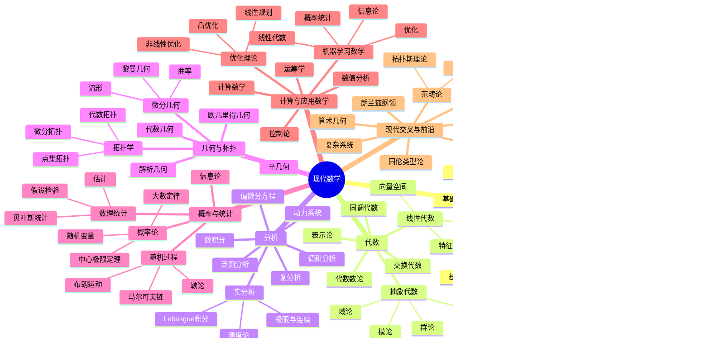

# 现代数学分支思维导图

这是一张学习用总地图：从基础语言出发，逐步走向现代数学的核心分支和前沿方向。

## 分层理解

### 1. 基础层：数学的语言

逻辑、集合论、证明方法、离散数学，是很多现代数学分支的共同语言。它们不一定最先全部学完，但越往后越会发现这些东西像语法一样无处不在。

### 2. 核心层：四大主干

- 代数：研究结构，比如群、环、域、向量空间。
- 分析：研究极限、连续、变化、积分、函数空间。
- 几何与拓扑：研究形状、空间、连续变形。
- 概率与统计：研究随机性、不确定性和数据推断。

### 3. 应用层：把数学变成工具

数值分析、优化、运筹、控制、机器学习数学等，常常连接工程、计算机、经济、物理和数据科学。

### 4. 前沿层：现代数学的交叉地带

现代数学很多深水区不是单一分支，而是多个主干交织出来的。例如：

- 代数几何 = 代数 + 几何
- 代数拓扑 = 代数 + 拓扑
- 朗兰兹纲领 = 数论 + 表示论 + 几何
- 数学物理 = 几何 + 分析 + 代数 + 物理直觉
- 机器学习数学 = 线性代数 + 概率统计 + 优化 + 信息论

## 一个合理的学习顺序

如果目标是建立现代数学整体视野，可以按这个顺序推进：

1. 高中数学补强：函数、三角、数列、解析几何。
2. 微积分：极限、导数、积分、多元微积分。
3. 线性代数：矩阵、向量空间、线性变换、特征值。
4. 概率统计基础：随机变量、分布、期望、方差、估计。
5. 离散数学：集合、逻辑、组合、图论。
6. 实分析：严谨理解极限、连续、测度和积分。
7. 抽象代数：群、环、域。
8. 拓扑学：开集、连续映射、紧致、连通。
9. 复分析、泛函分析、微分几何、数论等按兴趣分流。

## 记忆方式

可以先把现代数学看成五条主线：

- 结构：代数
- 变化：分析
- 空间：几何与拓扑
- 随机：概率统计
- 计算：计算与应用数学

这五条线互相交叉，就形成了现代数学的大部分版图。
