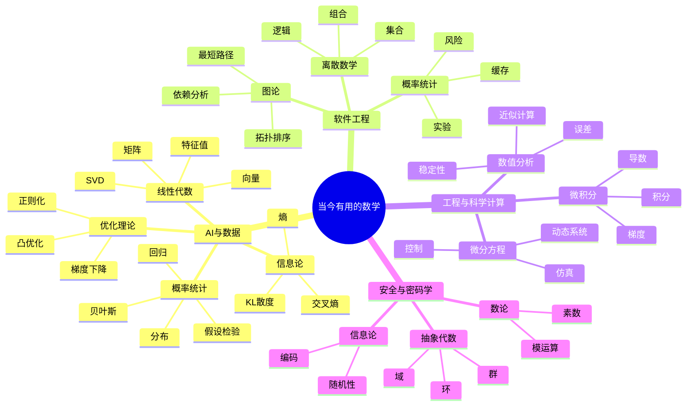

# 当今时代非常有用的数学

这份笔记关注“现实用途”：哪些数学在今天的技术、工程、AI、金融、数据科学和软件开发中最常出现，以及学习时应该怎么排优先级。

## 总览

现代社会里最有实用价值的数学，通常集中在这些方向：

- 线性代数：向量、矩阵、空间、变换。
- 概率统计：不确定性、数据推断、实验判断。
- 微积分与分析基础：变化率、累积量、连续模型。
- 优化理论：在约束下寻找最优解。
- 离散数学：计算机科学的基础语言。
- 图论：关系网络、路径、依赖、连接结构。
- 信息论：信息、压缩、熵、编码、模型损失。
- 数值分析：让数学公式可靠地跑在计算机上。

如果只用一句话概括：

> 当代最实用的数学，是把现实问题转化为向量、概率、函数、图和优化问题的能力。

## 实用优先级

| 优先级 | 分支 | 核心用途 | 常见领域 |
|---|---|---|---|
| 1 | 线性代数 | 表示和变换高维数据 | AI、图形学、推荐系统、物理仿真 |
| 1 | 概率统计 | 处理不确定性和数据结论 | 数据分析、A/B 测试、金融、医学、AI |
| 1 | 微积分 | 描述变化、梯度和连续系统 | 机器学习、物理、工程、经济学 |
| 1 | 优化理论 | 寻找最好或足够好的方案 | AI 训练、调度、资源分配、金融组合 |
| 2 | 离散数学 | 处理符号、逻辑、组合结构 | 算法、数据库、编译器、软件工程 |
| 2 | 图论 | 建模关系和网络 | 地图、社交网络、依赖系统、知识图谱 |
| 2 | 信息论 | 衡量信息量和不确定性 | 通信、压缩、机器学习、密码学 |
| 2 | 数值分析 | 控制计算误差和稳定性 | 科学计算、仿真、工程、金融 |
| 3 | 抽象代数 | 研究结构和对称性 | 密码学、编码理论、区块链、数论 |
| 3 | 几何与拓扑 | 研究形状、空间和连续变形 | 机器人、视觉、图形学、物理、TDA |
| 3 | 微分方程 | 描述动态系统 | 物理、生物、控制、流体、金融 |

## 第一梯队：当代技术的地基

### 1. 线性代数

线性代数是现代计算世界最重要的数学之一。

核心概念：

- 向量
- 矩阵
- 线性变换
- 向量空间
- 特征值与特征向量
- 奇异值分解 SVD
- 张量

为什么有用：

- 图像、文本、音频都可以表示成向量。
- 神经网络的大量计算本质上是矩阵运算。
- 推荐系统、搜索排序、PCA 降维离不开线性代数。
- 3D 图形学、游戏引擎、机器人运动都大量使用矩阵变换。

直觉理解：

> 线性代数让我们把复杂对象放进高维空间里，再用矩阵去移动、旋转、压缩、投影和组合它们。

### 2. 概率论与统计

概率统计研究不确定性。现实世界里的数据往往有噪声、不完整、有偏差，所以统计思维非常重要。

核心概念：

- 随机变量
- 概率分布
- 期望与方差
- 条件概率
- 贝叶斯公式
- 极大似然估计
- 假设检验
- 置信区间
- 回归分析

为什么有用：

- 数据分析需要判断数据是否真的支持某个结论。
- A/B 测试需要统计显著性。
- 金融、保险、风控需要概率模型。
- 机器学习模型训练和评估都离不开统计。
- 医学实验和社会科学研究也依赖统计推断。

直觉理解：

> 统计不是让人“算平均数”，而是让人在不确定的信息里做更可靠的判断。

### 3. 微积分与分析基础

微积分研究变化率和累积量。

核心概念：

- 极限
- 导数
- 积分
- 偏导数
- 梯度
- 链式法则
- 多元函数

为什么有用：

- 神经网络训练依赖梯度下降。
- 物理、工程、经济学中的连续模型都需要微积分。
- 最优化问题需要理解函数如何变化。
- 微分方程建立在微积分之上。

直觉理解：

> 只要一个问题里出现“变化有多快”“总量是多少”“怎样调整参数”，微积分就会出现。

### 4. 优化理论

优化理论研究如何找到最优解，或者在复杂条件下找到足够好的解。

核心概念：

- 目标函数
- 约束条件
- 梯度下降
- 凸优化
- 拉格朗日乘子
- 线性规划
- 动态规划
- 正则化

为什么有用：

- 机器学习训练就是大规模优化。
- 物流、排班、路径规划、资源分配都需要优化。
- 金融投资组合需要在收益和风险之间优化。
- 工程设计常常是在成本、强度、效率之间找平衡。

直觉理解：

> 很多现代问题不是问“答案是什么”，而是问“在这些限制下怎么做最好”。

## 第二梯队：计算机与工程特别重要

### 5. 离散数学

离散数学是计算机科学的基础，因为计算机处理的是离散符号。

核心概念：

- 集合
- 逻辑
- 命题与谓词
- 组合数学
- 递推
- 布尔代数
- 图
- 自动机

为什么有用：

- 算法设计和复杂度分析需要离散数学。
- 数据结构里的树、图、集合都属于离散对象。
- 数据库查询、权限系统、规则系统依赖逻辑。
- 编译器、形式语言、状态机也离不开离散数学。

直觉理解：

> 如果微积分适合描述连续世界，那么离散数学适合描述计算机世界。

### 6. 图论

图论研究节点和边，也就是“对象之间的关系”。

核心概念：

- 节点与边
- 路径
- 连通性
- 最短路径
- 拓扑排序
- 网络流
- 图遍历
- PageRank

为什么有用：

- 地图导航是图。
- 社交网络是图。
- 项目依赖、包依赖、构建系统是图。
- 知识图谱和推荐系统经常使用图结构。
- 图神经网络 GNN 是机器学习中的重要方向。

直觉理解：

> 只要一个问题的重点是“谁和谁有关”，图论就可能是最自然的工具。

### 7. 信息论

信息论研究信息量、压缩、编码、噪声和不确定性。

核心概念：

- 熵
- 交叉熵
- KL 散度
- 互信息
- 编码
- 信道容量

为什么有用：

- 通信系统需要信息论。
- 数据压缩和纠错编码依赖信息论。
- 机器学习里的交叉熵损失来自信息论。
- 语言模型训练、分类模型评估也经常涉及信息论概念。

直觉理解：

> 信息论是在问：一条消息到底带来了多少新信息？

### 8. 数值分析

数值分析研究如何用计算机近似求解数学问题，并控制误差。

核心概念：

- 舍入误差
- 稳定性
- 插值
- 数值积分
- 数值微分
- 线性方程组求解
- 微分方程数值解

为什么有用：

- 计算机不能精确表示所有实数。
- 科学计算和工程仿真都依赖数值方法。
- 天气预报、金融定价、物理模拟都需要数值分析。
- 大规模矩阵计算也需要考虑稳定性和误差。

直觉理解：

> 数学公式写在纸上是一回事，让它在机器上稳定、快速、可靠地跑起来是另一回事。

## 第三梯队：按方向变得非常重要

### 9. 抽象代数

抽象代数研究结构，例如群、环、域。

重要领域：

- 密码学
- 编码理论
- 区块链
- 量子计算
- 现代数论
- 对称性分析

直觉理解：

> 抽象代数不一定在普通业务开发里天天出现，但它是密码学、数论和很多现代数学结构的底层语言。

### 10. 几何与拓扑

几何研究形状和空间，拓扑研究连续变形下保持不变的性质。

重要领域：

- 机器人
- 计算机视觉
- 3D 图形学
- SLAM
- 物理仿真
- 拓扑数据分析 TDA
- 深度学习中的流形假设

直觉理解：

> 当问题涉及空间、形状、运动、连续变形时，几何和拓扑会变得非常有力。

### 11. 微分方程

微分方程描述系统如何随时间或空间变化。

重要领域：

- 物理
- 生物系统
- 流体力学
- 电路
- 控制系统
- 传染病模型
- 金融模型
- 神经科学

直觉理解：

> 微分方程是描述动态世界的语言。

## 按目标选择学习路线

### 如果目标是 AI / 机器学习

优先级：

1. 线性代数
2. 概率统计
3. 微积分
4. 优化理论
5. 信息论
6. 数值分析

关键词：

- 矩阵运算
- 梯度下降
- 损失函数
- 概率分布
- 最大似然
- 正则化
- 熵与交叉熵

### 如果目标是普通软件工程

优先级：

1. 离散数学
2. 图论
3. 逻辑
4. 组合数学
5. 概率统计
6. 一点线性代数

典型对应：

- 权限系统：集合与逻辑。
- 依赖关系：图论。
- 数据库查询：逻辑。
- 缓存策略：概率与统计。
- 搜索和推荐：线性代数、概率、图论。
- 调度系统：图论与优化。

### 如果目标是数据分析 / 商业分析

优先级：

1. 概率统计
2. 线性代数
3. 优化基础
4. 回归分析
5. 实验设计

关键词：

- 分布
- 相关与因果
- 假设检验
- 置信区间
- A/B 测试
- 回归模型
- 贝叶斯思维

### 如果目标是工程 / 物理 / 仿真

优先级：

1. 微积分
2. 线性代数
3. 微分方程
4. 数值分析
5. 优化
6. 概率统计

关键词：

- 连续系统
- 动态系统
- 数值解
- 稳定性
- 仿真
- 控制

### 如果目标是密码学 / 安全 / 区块链

优先级：

1. 离散数学
2. 数论
3. 抽象代数
4. 概率
5. 信息论

关键词：

- 模运算
- 素数
- 有限域
- 椭圆曲线
- 哈希
- 编码
- 随机性

## 学习顺序建议

一个偏实用的学习顺序：

1. 线性代数：先理解向量、矩阵、线性变换。
2. 概率统计：理解分布、期望、方差、条件概率。
3. 微积分：掌握导数、偏导、梯度、链式法则。
4. 优化理论：理解梯度下降、凸性、约束优化。
5. 离散数学：学习集合、逻辑、组合、图。
6. 图论：学习遍历、最短路径、拓扑排序、网络。
7. 信息论：理解熵、交叉熵、KL 散度。
8. 数值分析：理解误差、稳定性和数值方法。

如果时间有限，可以先学：

> 线性代数 + 概率统计 + 微积分 + 优化

这四个是 AI、数据科学、工程计算中最常见的一组组合拳。

## 思维导图

## 最重要的判断

不是所有数学都要从头学到很深。更现实的策略是：

- 先学能立刻解释现实问题的数学。
- 再根据方向补深层理论。
- 学习时始终问：这个概念解决了什么问题？

对当代多数技术学习者来说，最值得先打牢的是：

> 线性代数、概率统计、微积分、优化、离散数学、图论。

