# 第一章 搜索

作者：Nikhil Sharma

编辑：Matei Gardea、Catherine Chu、Wesley Zheng

部分内容改编自《人工智能：一种现代方法》（*Artificial Intelligence: A Modern Approach*）。

最后更新：2024 年 10 月

## 1.1 智能体

人工智能的核心问题，是构造一个理性智能体（rational agent）：它拥有目标或偏好，并试图根据这些目标执行一系列行动，使结果达到最佳或期望意义下的最优。

理性智能体存在于某个环境（environment）中，环境由智能体所处的具体任务实例决定。智能体通过传感器（sensors）与环境交互，并使用执行器（actuators）对环境施加作用。以跳棋智能体为例，它所在的环境就是与对手进行对弈的虚拟棋盘，棋子移动就是行动。环境与其中的智能体共同构成一个世界（world）。

反射智能体（reflex agent）不会思考行动的后果，只根据世界的当前状态选择行动。这类智能体通常会被规划智能体（planning agent）击败。规划智能体维护一个世界模型，用模型模拟执行不同行动的结果，然后确定假设的后果并选择最好的行动。这种“智能”模拟的正是人在各种情形下寻找最佳行动时所做的事情：提前思考。

### PEAS 任务环境描述

我们使用 PEAS（Performance Measure、Environment、Actuators、Sensors）描述任务环境：

- 性能度量（Performance Measure）说明智能体试图最大化哪一种效用。
- 环境（Environment）概括智能体在哪个世界中行动，以及哪些因素会影响它。
- 执行器（Actuators）和传感器（Sensors）分别是智能体作用于环境、从环境接收信息的方式。

智能体的设计很大程度上取决于它所处环境的类型。环境可以从以下维度刻画：

- 在部分可观测（partially observable）环境中，智能体无法获得世界状态的完整信息，因此必须维护对世界状态的内部估计。与之相对的是完全可观测（fully observable）环境，智能体能够获得完整状态信息。
- 随机（stochastic）环境的转移模型包含不确定性：在某个状态执行一个行动，可能以不同概率产生多个结果。与之相对的是确定性（deterministic）环境，在确定状态执行行动时，结果只有一个并且必然发生。
- 在多智能体（multi-agent）环境中，智能体与其他智能体共同行动。因此，智能体可能需要随机化自己的行动，避免被其他智能体预测。
- 如果环境不会随着智能体的行动而改变，就称为静态（static）环境；会随着交互而改变的环境称为动态（dynamic）环境。
- 如果环境的物理规律已知，那么转移模型（即使它是随机的）对智能体也是已知的，智能体可以用它规划路径。如果物理规律未知，智能体就需要有意识地采取行动，以学习未知的动力学规律。

## 1.2 状态空间与搜索问题

为了构造理性规划智能体，我们需要一种数学方式表达智能体所在的环境。为此，需要形式化定义一个搜索问题：给定智能体当前的状态（它在环境中的配置），如何以最好的方式到达一个满足目标的新状态？

一个搜索问题由以下元素组成：

- 状态空间（state space）：给定世界中所有可能状态的集合。
- 行动集合（actions）：每个状态下可以执行的行动。
- 转移模型（transition model）：在当前状态执行具体行动时，输出下一个状态。
- 行动代价（action cost）：执行行动、从一个状态移动到另一个状态时产生的代价。
- 初始状态（start state）：智能体最初所在的状态。
- 目标测试（goal test）：接收一个状态作为输入，并判断它是否为目标状态的函数。

从根本上说，解决搜索问题的过程是：先考虑初始状态，然后利用行动、转移和代价方法探索状态空间，不断计算各个状态的子节点，直到到达目标状态。此时，我们就得到了从初始状态到目标状态的一条路径，通常称为一个计划（plan）。决定考察哪些状态的顺序，取决于预先选定的搜索策略。

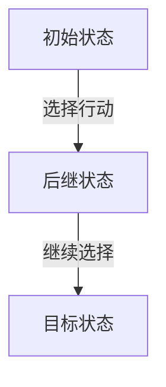

在继续讨论如何解决搜索问题之前，需要区分世界状态（world state）与搜索状态（search state）。世界状态包含某个状态的全部信息；搜索状态只包含规划所需的世界信息，主要用于节省空间。

本课程的核心示例是 Pacman。Pacman 必须在迷宫中移动，吃掉所有小食物，同时不能被巡逻的幽灵吃掉。如果 Pacman 吃到大能量豆，它会在一段时间内免疫幽灵，并获得吃掉幽灵得分的能力。

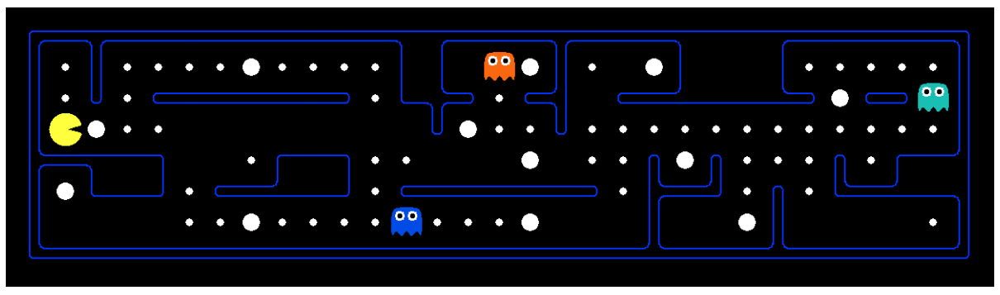

*图 1：Pacman 示例图。*

考虑一个只包含 Pacman 和食物的迷宫变体。在这个环境中，可以提出两个不同的搜索问题：路径规划（pathing）和吃完所有食物（eat-all-dots）。路径规划的目标是在迷宫中从位置 $(x_1,y_1)$ 最优地到达位置 $(x_2,y_2)$；吃完所有食物的目标是在尽可能短的时间内吃掉迷宫中的全部食物。

两种问题的状态、行动、转移模型和目标测试如下：

**路径规划：**

- 状态：位置 $(x,y)$。
- 行动：北、南、东、西。
- 转移模型：只更新位置。
- 目标测试：$(x,y)=mathrm{END}$？

**吃完所有食物：**

- 状态：$(x,y)$ 位置与食物布尔值集合。
- 行动：北、南、东、西。
- 转移模型：更新位置和食物布尔值。
- 目标测试：所有食物布尔值都为 `false`？

对于路径规划，状态包含的信息少于吃完所有食物问题。后者必须维护一个与食物对应的布尔数组，记录每颗食物在当前状态中是否已经被吃掉。世界状态可能包含更多信息，例如 Pacman 已经走过的总距离，或者它访问过的所有位置；这些信息会附加在当前的 $(x,y)$ 位置和食物布尔值之上。

### 1.2.1 状态空间大小

估算解决搜索问题所需的计算时间时，一个经常出现的问题是状态空间有多大。计算状态空间大小时，几乎总会用到基本的计数原理：如果世界中有 $n$ 个变量对象，第 $i$ 个对象有 $x_i$ 种可能取值，那么状态总数为

$$
\lvert S\rvert=\prod_{i=1}^{n}x_i=x_1\cdot x_2\cdot\ldots\cdot x_n。
$$

下面用 Pacman 说明这个概念。

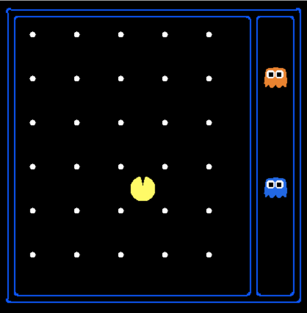

*图 2：状态空间大小。*

假设变量对象及其可能性如下：

- Pacman 的位置：Pacman 可以处于 120 个不同的 $(x,y)$ 位置；世界中只有一个 Pacman。
- Pacman 的方向：可以是北、南、东、西，共 4 种可能。
- 幽灵的位置：有两个幽灵，每个幽灵可以处于 12 个不同的 $(x,y)$ 位置。
- 食物配置：有 30 颗食物，每颗食物都可以处于“已吃掉”或“未吃掉”两种状态。

因此，按照基本计数原理，Pacman 的位置有 120 种可能，方向有 4 种可能，两个幽灵的位置配置数是 $12\cdot12$，食物配置数是

$$
2\cdot2\cdot\ldots\cdot2=2^{30}。
$$

总状态空间大小为

$$
120\cdot4\cdot12^2\cdot2^{30}。
$$

这说明，即使任务看起来很简单，状态空间也会因为多个变量的组合迅速变得巨大。

### 1.2.2 状态空间图与搜索树

图由一组节点以及连接节点对的边组成，边还可以带有权重。状态空间图把状态作为节点，并在状态与其子状态之间建立有向边。边表示行动，边上的权重表示执行相应行动的代价。

状态空间图通常大到无法完整存储在内存中。即使是前面简单的 Pacman 示例，也有大约 $10^{13}$ 个可能状态。不过，状态空间图作为概念模型仍然非常有用。需要注意的是，在状态空间图中，每个状态只表示一次；没有必要重复表示同一个状态，这一点有助于我们分析搜索问题。

与状态空间图不同，搜索树不限制同一个状态出现的次数。搜索树也是一种以状态为节点、以行动为边的图，但每个节点记录的不只是状态本身，还记录从起点到该状态的完整路径或计划。因此，同一个状态可以通过多条路径到达，也就可能在搜索树中出现多次。搜索树的大小至少与对应的状态空间图一样大。

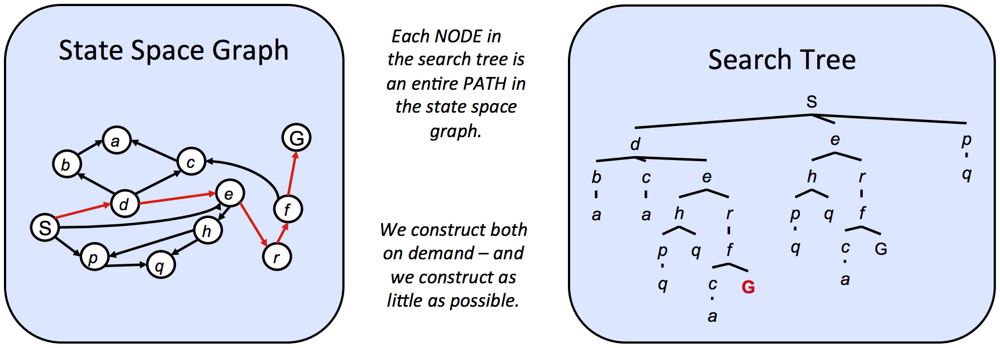

*图 3：状态空间图与搜索树。*

在上图的状态空间图中，被标出的路径是 $S\to d\to e\to r\to f\to G$。在对应的搜索树中，这条路径表现为从起点 $S$ 沿树向下走到目标状态 $G$。类似地，从起点到其他任意节点的每一条路径，都对应搜索树中从根节点 $S$ 到某个后代节点的一条路径。

我们已经看到，即使简单问题的状态空间图也可能极其庞大。既然完整结构无法装入内存，算法如何在其上进行有用的计算？关键在于按需计算当前状态的子节点：算法只保存当前正在处理的少量状态，然后通过 `getNextState`、`getAction` 和 `getActionCost` 等方法按需生成新状态。

搜索问题通常使用搜索树求解。算法会谨慎地同时保存少量节点，反复用子节点替换当前节点，直到到达目标状态。不同方法的区别，就在于如何决定这种逐步替换的顺序。

## 1.3 无信息搜索

从起点到目标寻找计划的标准过程，是维护一个来自搜索树的部分计划集合，称为边缘（frontier）。算法不断从边缘中移除一个节点；该节点对应一条部分计划，具体选择哪个节点由搜索策略决定。然后，算法用这个节点的所有子节点替换它。移除一个长度为 $n$ 的计划，并把从它延伸出来的所有长度为 $n+1$ 的计划加入考虑范围，正是这个过程的含义。

当算法最终从边缘中移除一个目标状态时，就可以断定：与该目标状态对应的部分计划，实际上是一条从初始状态到目标状态的路径。

在实际实现中，节点对象通常会保存父节点、到达该节点的距离以及节点状态。这种过程称为树搜索（tree search），其伪代码如下：

```text
function TREE-SEARCH(problem, frontier) return a solution or failure
    frontier ← INSERT(MAKE-NODE(INITIAL-STATE[problem]), frontier)
    while not IS-EMPTY(frontier) do
        node ← POP(frontier)
        if problem.IS-GOAL(node.STATE) then return node
        for each child-node in EXPAND(problem, node) do
            add child-node to frontier
    return failure
```

伪代码中的 `EXPAND` 函数，通过考察当前节点可用的所有行动，返回从该节点可以到达的所有节点：

```text
function EXPAND(problem, node) yields nodes
    s ← node.STATE
    for each action in problem.ACTIONS(s) do
        s' ← problem.RESULT(s, action)
        yield NODE(STATE=s', PARENT=node, ACTION=action)
```

当我们不知道目标状态在搜索树中的位置时，只能从无信息搜索（uninformed search）方法中选择树搜索策略。本章依次介绍深度优先搜索、广度优先搜索和一致代价搜索，并讨论以下性质：

- 完备性（completeness）：如果搜索问题存在解，在拥有无限计算资源时，该策略是否保证找到解？
- 最优性（optimality）：该策略是否保证找到到达目标状态的最低代价路径？
- 分支因子 $b$：每次从边缘取出一个节点并用其子节点替换时，节点数的增长为 $O(b)$。搜索树深度为 $k$ 时，存在 $O(b^k)$ 个节点。
- 最大深度 $m$。
- 最浅解深度 $s$。

### 1.3.1 深度优先搜索

- **描述：** 深度优先搜索（DFS）总是选择从起点出发最深的边缘节点进行扩展。
- **边缘表示：** 移除最深节点并将其子节点放回边缘后，子节点会成为新的最深节点，它们的深度比刚被移除的节点多 1。因此，DFS 需要一个让最近加入的对象拥有最高优先级的数据结构。后进先出（LIFO）栈正好满足这一要求，也是实现 DFS 时表示边缘的传统结构。

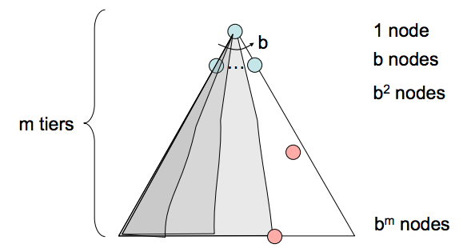

*图 1：DFS。*

- **完备性：** 深度优先搜索不完备。如果状态空间图存在环，对应的搜索树就会在深度方向上无限延伸。因此，DFS 可能一直搜索无限深搜索树中的最深节点，永远找不到解。
- **最优性：** DFS 只关注搜索树中最靠左的解，不考虑路径代价，因此不保证最优。
- **时间复杂度：** 最坏情况下，DFS 可能探索整个搜索树。如果树的最大深度为 $m$，DFS 的运行时间为 $O(b^m)$。
- **空间复杂度：** 最坏情况下，DFS 的边缘在每个深度层级上维护 $b$ 个节点，共 $m$ 个深度层级，因此空间复杂度为 $O(bm)$。原因是：某个父节点的 $b$ 个子节点入队后，DFS 在任意时刻只会继续探索其中一个子树。

### 1.3.2 广度优先搜索

- **描述：** 广度优先搜索（BFS）总是选择从起点出发最浅的边缘节点进行扩展。
- **边缘表示：** 如果希望先访问浅层节点再访问深层节点，就必须按照节点加入边缘的顺序访问它们。因此，需要一个输出最早入队对象的数据结构。BFS 使用先进先出（FIFO）队列。
- **完备性：** 如果问题存在解，最浅目标节点的深度 $s$ 必然有限，所以 BFS 最终会搜索到这一层，因此 BFS 完备。
- **最优性：** BFS 通常不保证最优，因为它在选择要替换的边缘节点时不考虑代价。所有边代价相同是一个特殊情形：这时 BFS 退化为一致代价搜索的特例，因此保证最优。

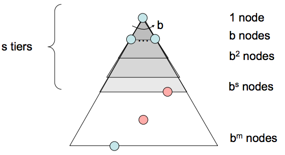

*图 2：BFS。*

- **时间复杂度：** 最坏情况下，需要搜索深度从 1 到 $s$ 的所有节点，总数为

  $$
  1+b+b^2+\ldots+b^s，
  $$

  因此时间复杂度为 $O(b^s)$。
- **空间复杂度：** 最坏情况下，边缘包含最浅解所在层的所有节点。最浅解位于深度 $s$，这一层有 $O(b^s)$ 个节点，因此空间复杂度为 $O(b^s)$。

### 1.3.3 一致代价搜索

- **描述：** 一致代价搜索（UCS）总是选择从起点出发路径代价最低的边缘节点进行扩展。
- **边缘表示：** UCS 通常使用基于堆的优先队列表示边缘。加入节点 $v$ 的优先级，是从起点到 $v$ 的路径代价，也就是 $v$ 的后向代价（backward cost）。当我们移除当前代价最小的路径并用它的子节点替换时，优先队列会自动重新排列，使节点仍按路径代价排序。

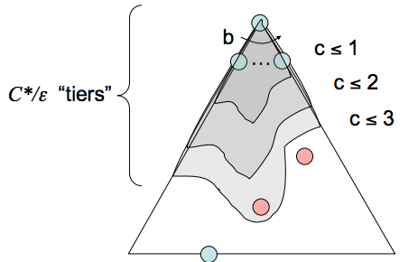

*图 3：UCS。*

- **完备性：** UCS 完备。如果存在目标状态，那么最短路径有有限长度；因此，UCS 最终会找到这条最短路径。
- **最优性：** 假设所有边代价非负，UCS 也是最优的。因为它按路径代价递增的顺序扩展节点，所以保证找到到达目标状态的最低代价路径。UCS 使用的策略与 Dijkstra 算法相同，主要区别在于：UCS 找到一个目标状态后就终止，而 Dijkstra 通常会继续求出起点到所有状态的最短路径。需要注意，图中存在负边代价时，路径上的节点代价可能递减，从而破坏最优性保证；处理这种情况可以使用更慢的 Bellman–Ford 算法。
- **时间复杂度：** 设最优路径代价为 $C^*$，状态空间图中两个节点之间的最小代价为 $\varepsilon$。大致上需要探索深度从 1 到 $C^*/\varepsilon$ 的节点，因此运行时间估计为

  $$
  O\left(b^{C^*/\varepsilon}\right)。
  $$

- **空间复杂度：** 边缘大致会包含最便宜解所在层的全部节点，因此 UCS 的空间复杂度估计为

  $$
  O\left(b^{C^*/\varepsilon}\right)。
  $$

无信息搜索的三个策略在根本上是相同的，差异只在于扩展策略不同；它们的共同结构都由前面的树搜索伪代码表达。

## 1.4 有信息搜索

一致代价搜索同时具备完备性和最优性，但可能很慢，因为它从起点向各个方向扩展，寻找目标。如果我们知道应该把搜索集中在哪个方向，就能显著改善性能，更快地“锁定”目标。这正是有信息搜索（informed search）关注的问题。

### 1.4.1 启发式函数

启发式函数（heuristic）是估计到目标状态距离的工具：它接收一个状态作为输入，并输出相应的估计值。具体如何计算，取决于待解决的搜索问题。

在 A* 搜索中会看到，我们通常希望启发式函数给出到目标的剩余距离下界。因此，启发式函数通常来自松弛问题（relaxed problem）：删除原问题中的部分约束，使问题更容易解决。

回到 Pacman 的路径规划问题。一个常用启发式是曼哈顿距离（Manhattan distance）。对于两个点 $(x_1,y_1)$ 和 $(x_2,y_2)$，它定义为

$$
\operatorname{Manhattan}(x_1,y_1,x_2,y_2)=\lvert x_1-x_2\rvert+\lvert y_1-y_2\rvert。
$$

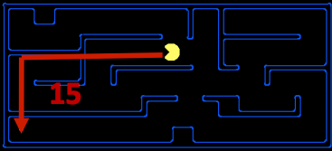

*图 1：曼哈顿距离可视化。*

上图展示了曼哈顿距离解决的松弛问题。假设 Pacman 想到达迷宫左下角，曼哈顿距离会计算 Pacman 当前所在位置到目标位置的距离，并假设迷宫中没有墙。这个距离在松弛搜索问题中是精确的目标距离，在实际搜索问题中则是目标距离的估计值。

有了启发式函数，我们就能很容易地让智能体优先扩展那些估计上更接近目标的状态。这种偏好非常有用，下面两个搜索算法都会使用它：贪心搜索和 A* 搜索。

### 1.4.2 贪心搜索

- **描述：** 贪心搜索总是选择启发式值最低的边缘节点进行扩展，因为它认为该节点对应的状态距离目标最近。
- **边缘表示：** 贪心搜索与 UCS 一样使用优先队列表示边缘。区别在于：UCS 使用已计算的后向代价（路径中各条边权重之和）赋予优先级，而贪心搜索使用启发式值形式的前向代价估计。
- **完备性与最优性：** 贪心搜索不保证在存在目标状态时一定找到它，也不保证最优；特别是在启发式函数很差时更是如此。它在不同场景中的行为可能差异很大：有时会直接走向目标，有时则像一个方向错误的 DFS，探索所有错误区域。

### 1.4.3 A* 搜索

- **描述：** A* 搜索总是选择估计总成本最低的边缘节点进行扩展。这里的总成本，是从起点到目标的完整路径成本。
- **边缘表示：** 与贪心搜索和 UCS 一样，A* 使用优先队列表示边缘。区别仍然只是优先级的计算方式。A* 把 UCS 使用的后向总成本（从起点到当前状态的路径边权重之和）与贪心搜索使用的前向成本估计（启发式值）相加，得到从起点到目标的估计总成本。因为我们的目标是最小化从起点到目标的总成本，这是一个很好的选择。
- **完备性与最优性：** 在使用合适启发式函数的前提下，A* 既完备又最优。它结合了前面各种搜索策略的优点：具有贪心搜索通常拥有的较高速度，同时保留 UCS 的最优性和完备性。

### 1.4.4 可采纳性

现在我们已经讨论了启发式函数，以及它们如何应用于贪心搜索和 A* 搜索。接下来讨论什么样的启发式函数是好的。先用以下定义重新表述 UCS、贪心搜索和 A* 决定优先队列顺序的方法：

- $g(n)$：UCS 计算的总后向代价。
- $h(n)$：贪心搜索使用的启发式值，即前向代价估计。
- $f(n)$：A* 使用的总成本估计函数：

  $$
  f(n)=g(n)+h(n)。
  $$

在讨论好的启发式函数之前，需要先回答：无论使用什么启发式函数，A* 是否都能保持完备性和最优性？答案是否定的。很容易构造出破坏这两个性质的启发式函数。例如，考虑

$$
h(n)=1-g(n)。
$$

无论搜索问题是什么，使用这个启发式函数都会得到

$$
f(n)=g(n)+h(n)=g(n)+(1-g(n))=1。
$$

因此，A* 会退化成 BFS，就像所有边代价都相同一样。前面已经说明，在一般边权不恒定的情形下，BFS 不保证最优。

A* 树搜索保持最优性所需的条件称为可采纳性（admissibility）。可采纳启发式函数估计的值既不能为负，也不能高估真实剩余代价。

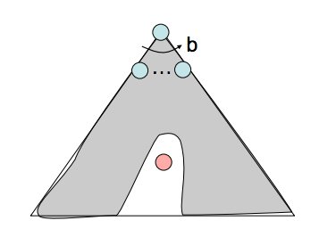

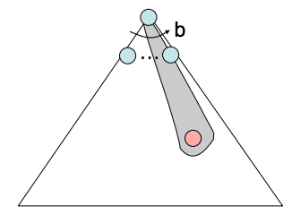

令 $h^*(n)$ 表示从节点 $n$ 到某个目标状态的真实最优前向代价。可采纳性可以形式化为

$$
\forall n,\quad 0\le h(n)\le h^*(n)。
$$

**定理：** 对于给定的搜索问题，如果启发式函数 $h$ 满足可采纳性约束，那么在该问题上使用启发式 $h$ 的 A* 树搜索会得到最优解。

**证明：** 假设给定搜索问题的搜索树中有两个可到达的目标状态：最优目标 $A$ 和次优目标 $B$。由于 $A$ 从起点可到达，因此 $A$ 的某个祖先节点 $n$（也可能就是 $A$ 本身）当前一定在边缘中。我们证明 $n$ 会在 $B$ 之前被选中。

1. $g(A)<g(B)$。因为 $A$ 是最优目标而 $B$ 是次优目标，所以 $A$ 从起点出发的后向代价低于 $B$。
2. $h(A)=h(B)=0$。可采纳性要求启发式不能高估真实剩余代价，而 $A$ 和 $B$ 都是目标状态，因此从它们到目标的真实最优代价为 $h^*(A)=h^*(B)=0$，从而 $0\le h(A),h(B)\le0$。
3. $f(n)\le f(A)$。由 $h$ 的可采纳性，

   $$
   f(n)=g(n)+h(n)\le g(n)+h^*(n)=g(A)=f(A)。
   $$

   经过节点 $n$ 的总成本至多等于到达 $A$ 的真实后向代价，而后者就是 $A$ 的总成本。

把前两条结合起来，可以得到 $f(A)<f(B)$：

$$
f(A)=g(A)+h(A)=g(A)<g(B)=g(B)+h(B)=f(B)。
$$

再结合第三条，可得

$$
f(n)\le f(A)\land f(A)<f(B)\Rightarrow f(n)<f(B)。
$$

因此，$n$ 会在 $B$ 之前被扩展。由于这个结论对任意祖先节点 $n$ 都成立，所以 $A$ 的所有祖先（包括 $A$ 本身）都会在 $B$ 之前扩展。

树搜索存在一个问题：有些情况下，它可能永远在状态空间图的同一个环中循环，始终找不到解。即使搜索方法不会陷入无限循环，也经常会因为到达同一个节点的路径不止一条而重复访问节点。这会带来指数级的额外工作。自然的解决办法是记录已经扩展过的状态，永远不再扩展它们。

更具体地说，在使用选定搜索方法时维护一个已到达（reached）节点集合；扩展节点前检查它是否已在集合中，若不在，则扩展后将它加入集合。带有这一优化的树搜索称为图搜索（graph search）。

此外，要保持最优性，还需要另一个条件。考虑下面这个带有边权和启发式值的状态空间图及其对应搜索树：

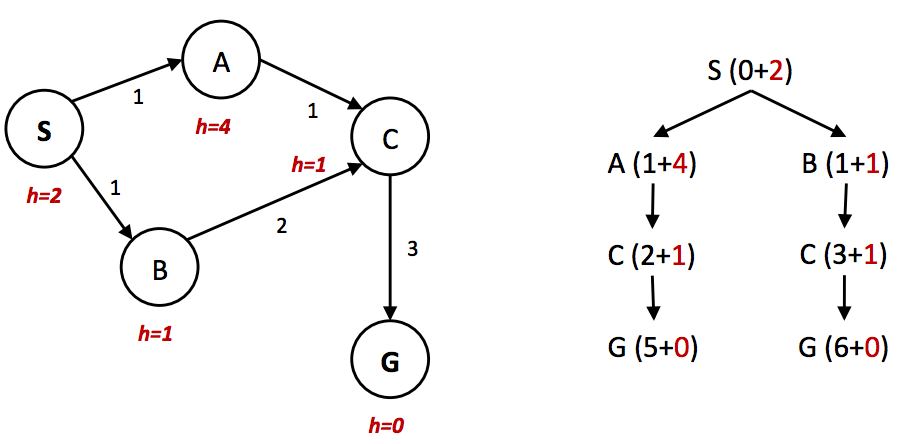

*图 2：状态空间图与搜索树。*

在这个例子中，最优路径显然是 $S\to A\to C\to G$，总路径代价为 $1+1+3=5$。另一条路径 $S\to B\to C\to G$ 的代价为 $1+2+3=6$。然而，由于节点 $A$ 的启发式值远大于节点 $B$ 的启发式值，节点 $C$ 会先沿着次优路径作为 $B$ 的子节点被扩展。它随后被放入 `reached` 集合；当算法沿着 $A$ 到达 $C$ 时，A* 图搜索不会重新扩展它，因此永远找不到最优解。

所以，为了让 A* 图搜索保持最优性，不仅要检查某个节点是否已经访问过，还要检查是否找到了到达该节点的更低代价路径。其伪代码如下：

```text
function A*-GRAPH-SEARCH(problem, frontier) return a solution or failure
    reached ← an empty dict mapping nodes to the cost to each one
    frontier ← INSERT((MAKE-NODE(INITIAL-STATE[problem]),0), frontier)
    while not IS-EMPTY(frontier) do
        node, node.CostToNode ← POP(frontier)
        if problem.IS-GOAL(node.STATE) then return node
        if node.STATE is not in reached or reached[node.STATE] > node.CostToNode then
            reached[node.STATE] = node.CostToNode
            for each child-node in EXPAND(problem, node) do
                frontier ← INSERT((child-node, child-node.COST + CostToNode), frontier)
    return failure
```

实现时，`reached` 集合必须使用不相交集合或哈希集合，而不能使用普通列表。使用列表检查成员关系需要 $O(n)$ 的时间，会抵消图搜索本来要获得的性能改进。

在继续之前，回顾两个要点：要使启发式函数可采纳，对任何目标状态 $G$ 都必须有 $h(G)=0$。此外，课程中有些地方会用“树是满足某些限制（连通且无环）的图”来定义树；这里的树搜索与图搜索之分，并不是图论中这个术语意义上的树与图之分。

### 1.4.5 支配关系

我们已经建立了可采纳性，以及它如何帮助 A* 保持最优性。现在回到最初的问题：怎样构造“好的”启发式函数，怎样判断一个启发式函数是否优于另一个？标准度量是支配关系（dominance）。

如果启发式函数 $h_a$ 支配启发式函数 $h_b$，那么对状态空间图中的每一个节点，$h_a$ 给出的目标距离估计都不小于 $h_b$ 的估计。形式化地说：

$$
\forall n:\quad h_a(n)\ge h_b(n)。
$$

支配关系很直观地表达了一个启发式函数更好的含义：如果一个可采纳启发式支配另一个可采纳启发式，它就总能更接近地估计从任意状态到目标的距离。

此外，平凡启发式函数定义为 $h(n)=0$；使用它会把 A* 降级为 UCS。所有可采纳启发式都支配平凡启发式。对于一个搜索问题，平凡启发式通常位于半格（semi-lattice）的底部，而半格是一种表示启发式支配层级的结构；精确目标距离位于顶部，其他启发式 $h_a$、$h_b$、$h_c$ 分布在中间。

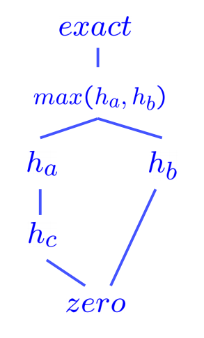

*图 3：启发式函数的半格示例。*

一般来说，多个可采纳启发式的最大值仍然是可采纳的。这是因为对于任意状态，所有启发式输出都满足

$$
0\le h(n)\le h^*(n)。
$$

这些数的最大值自然也在同一范围内。因此，实际中经常为同一个搜索问题构造多个可采纳启发式，再取它们输出值的最大值，从而得到一个支配每个单独启发式、因而更好的启发式。

## 1.5 局部搜索

前面的问题要求我们找到目标状态，以及到达目标的最优路径。但在某些问题中，我们只关心找到目标状态，恢复路径很简单。例如，在数独中，最优配置本身就是目标；找到它以后，只要逐格填写，就知道如何到达它。

局部搜索算法寻找目标状态时，不必关心到达目标的路径。在局部搜索问题中，状态空间由一组“完整”的解组成。我们使用这些算法寻找满足约束的配置，或优化某个目标函数。


*图 1：目标函数图。*

上图展示了状态空间上目标函数的一维图像。对于这个函数，我们希望找到目标值最高的状态。局部搜索的基本思想是：从每个状态出发，逐步向目标值更高的邻居移动，直到到达一个极大值，最好是全局极大值。本节介绍四种算法：爬山法、模拟退火、局部束搜索和遗传算法。这些算法也广泛用于优化任务，以最大化或最小化目标函数。

### 1.5.1 爬山搜索

爬山搜索（hill-climbing search），也称最陡上升法（steepest-ascent），从当前状态移动到能让目标函数值增加最多的邻居状态。算法不维护搜索树，只跟踪状态和相应的目标值。

爬山法的“贪心”特性使它容易陷入局部极大值（见相关图示），因为从局部看，这些点就像全局极大值一样。它也容易陷入平台。平台可以分成两类：没有任何方向能带来改进的平坦区域（“平坦局部极大值”），以及仍能前进但进展很慢的平坦区域（“肩部”）。

有人提出了爬山法的变体，例如随机爬山法：在所有可能的上坡移动中随机选择一个。实践表明，随机爬山法往往能收敛到更高的极大值，但需要更多迭代。另一个变体是随机侧向移动：允许目标值不严格增加的移动，从而帮助算法逃离“肩部”。

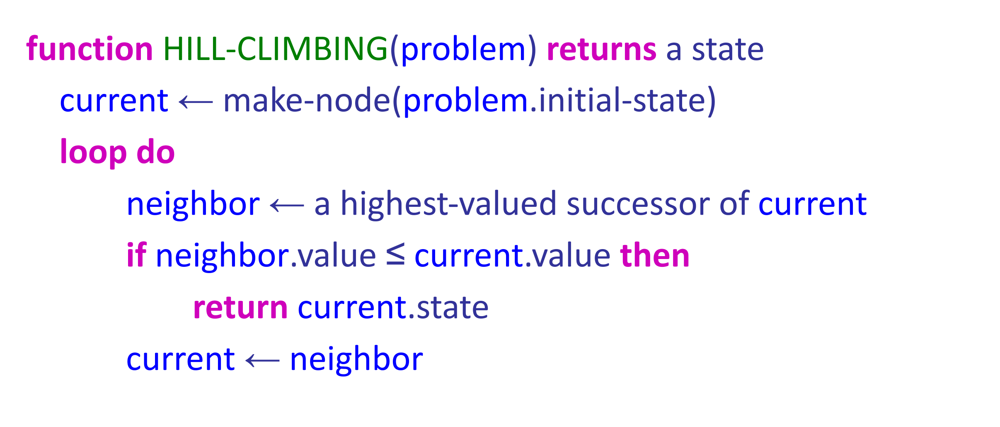

*图 2：爬山算法。*

上图给出了爬山算法的伪代码。顾名思义，算法反复移动到目标值更高的状态，直到无法继续改进。爬山法不完备。相比之下，随机重启爬山法会从随机选择的多个初始状态分别执行爬山搜索；只要随机选到的某个初始状态最终能收敛到全局极大值，它就能找到解，因此具有完备性意义上的优势。

稍后在本课程中还会遇到“梯度下降”（gradient descent）这个术语。它与爬山法的思想完全相同，区别在于：爬山法最大化目标函数，而梯度下降要最小化代价函数。

### 1.5.2 模拟退火搜索

第二种局部搜索算法是模拟退火。模拟退火试图把随机游走（随机移动到附近状态）与爬山法结合起来，从而得到完备且高效的搜索算法。在模拟退火中，我们允许移动到目标值降低的状态。

算法在每个时间步选择一个随机移动。如果移动带来更高的目标值，就总是接受；如果带来更低的目标值，则以某个概率接受。这个概率由温度参数决定：开始时温度较高，允许更多“坏”移动；随后温度按照某个“降温计划”逐渐降低。从理论上说，只要温度下降得足够慢，模拟退火以趋近于 1 的概率到达全局极大值。


*图 3：模拟退火算法。*

### 1.5.3 局部束搜索

局部束搜索是爬山搜索的另一种变体。两者的关键区别是：局部束搜索在每次迭代中维护 $k$ 个状态（线程）。算法从 $k$ 个随机初始化的状态开始，每次迭代像爬山法一样选择 $k$ 个新状态。

这些状态并不是普通爬山法的 $k$ 份独立副本。关键在于，算法会把所有线程产生的完整后继状态集合放在一起，然后选出其中最好的 $k$ 个后继状态。如果某个线程找到最优值，算法就停止。

这 $k$ 个线程可以共享信息：目标值较高的“优秀”线程会吸引其他线程也移动到附近区域。局部束搜索和爬山法一样，容易卡在平坦区域。随机束搜索与随机爬山法类似，可以缓解这一问题。

### 1.5.4 遗传算法

最后介绍遗传算法。遗传算法是局部束搜索的一种变体，广泛应用于各种优化任务。顾名思义，它从生物进化中获得启发。

遗传算法以束搜索的形式开始：先随机初始化 $k$ 个状态，将它们称为种群。状态（称为个体）表示成有限字母表上的字符串。

回顾课堂中介绍的八皇后问题。八皇后是一个约束满足问题，目标是在 $8\times8$ 的棋盘上放置 8 个皇后。满足约束的解中，不存在相互攻击的皇后对；相互攻击指两个皇后位于同一行、同一列或同一条对角线上。前面介绍的所有算法都可以用来解决八皇后问题。

在遗传算法中，用 1 到 8 的数字表示八个皇后的位置，每个数字表示相应列中皇后所在的行。每个个体都通过评价函数（适应度函数）计算得分，并按得分排序。对于八皇后问题，适应度可以定义为不相互攻击的皇后对数量。

选择某个状态进行“繁殖”的概率与该状态的适应度成正比。我们按照这些概率进行采样，选择成对的状态繁殖。子代通过在父代字符串中随机选择交叉点、交换字符串片段生成。最后，每个子代还以独立概率接受某种随机突变。

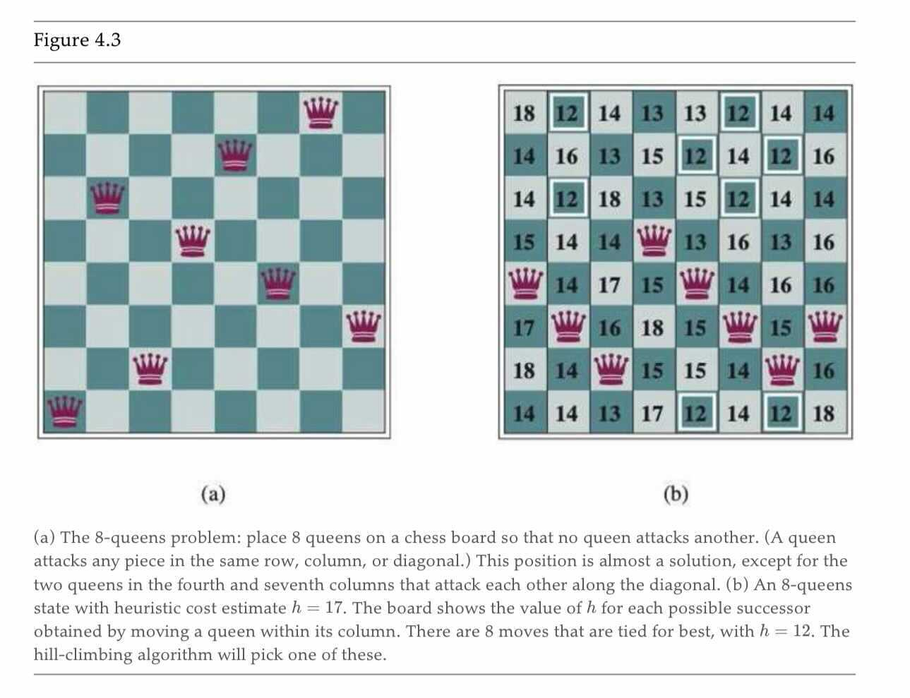

*图 4：八皇后问题。*


*图 5：遗传算法示例。*

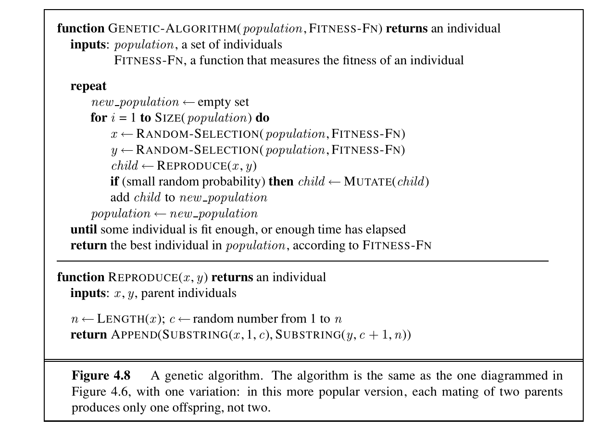

*图 6：遗传算法伪代码。*

遗传算法与随机束搜索类似：它们都试图在探索状态空间的同时向更高目标值移动，并在线程之间交换信息。遗传算法的主要优势是交叉操作：已经进化出来、能够带来高评价的大片字符串，可以与其他高评价片段组合，产生总分很高的解。

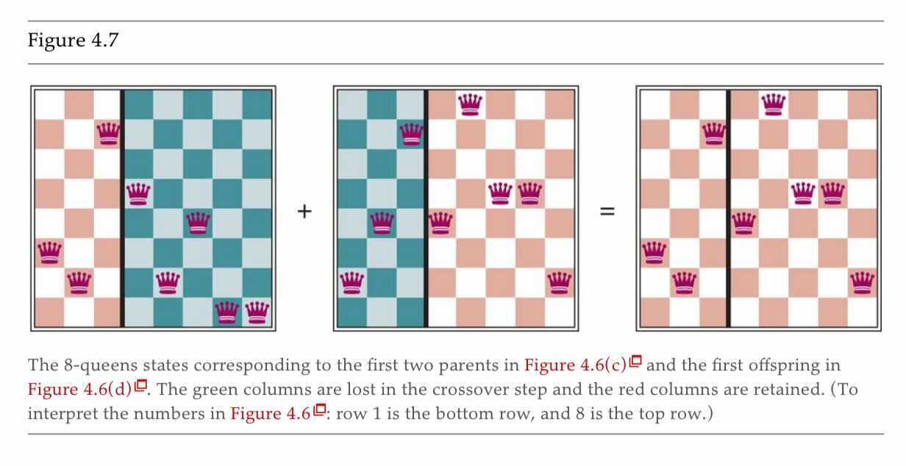

*图 7：八皇后问题的一个解。*

## 本章小结

本章讨论了搜索问题及其组成部分：状态空间、行动集合、转移函数、行动代价、初始状态和目标状态。智能体通过传感器和执行器与环境交互。智能体函数描述智能体在所有情形下会做什么。智能体的理性意味着它试图最大化期望效用。最后，我们使用 PEAS 描述任务环境。

搜索问题可以通过多种搜索技术求解。本章介绍了 CS 188 中重点讨论的五种方法：

- 广度优先搜索；
- 深度优先搜索；
- 一致代价搜索；
- 贪心搜索；
- A* 搜索。

前面三种是无信息搜索；后面两种使用启发式函数估计目标距离，以改善搜索性能。

我们还区分了树搜索算法和图搜索算法，并讨论了局部搜索的动机：当我们不关心到达目标的路径，只关心满足约束或优化目标时，可以使用局部搜索。局部搜索能节省空间，并帮助我们在巨大的状态空间中找到足够好的解。

本章介绍了几种相互递进的局部搜索方法：

- 爬山法；
- 模拟退火；
- 局部束搜索；
- 遗传算法。

优化函数的思想会在课程后面再次出现，尤其是在学习神经网络时。
