# 第二章 约束满足问题

作者：Nikhil Sharma

编辑：Pranav Muralikrishnan、Wesley Zheng

部分内容改编自《人工智能：一种现代方法》（*Artificial Intelligence: A Modern Approach*）。

最后更新：2024 年 9 月

## 2.1 约束满足问题

上一章学习了如何寻找搜索问题的最优解。搜索问题是一类规划问题。本章学习一类相关问题：约束满足问题（constraint satisfaction problems，CSP）。

与搜索问题不同，CSP 属于识别问题：我们只需要识别一个状态是否是目标状态，不关心如何到达这个目标。CSP 由三个因素定义：

1. **变量：** CSP 有 $N$ 个变量 $X_1,\ldots,X_N$，每个变量都必须从某个规定的值集合中取一个值。
2. **域：** 域是集合 $\{x_1,\ldots,x_d\}$，表示一个 CSP 变量可以取的所有值。
3. **约束：** 约束规定变量取值必须满足的限制，也可能规定多个变量之间的关系。

考虑 $N$ 皇后识别问题：给定一个 $N\times N$ 棋盘，是否能放置 $N$ 个皇后，使任意两个皇后都不会互相攻击？

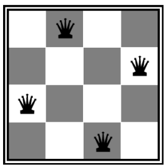

*图 1：N 皇后问题。*

可以把这个问题形式化为如下 CSP：

1. **变量：** $X_{ij}$，其中 $0\le i,j<N$。每个 $X_{ij}$ 表示 $N\times N$ 棋盘上的一个格子，$i$、$j$ 分别表示行号和列号。
2. **域：** $\{0,1\}$。每个 $X_{ij}$ 可以取 0 或 1，表示位置 $(i,j)$ 上是否有皇后。
3. **约束：**
   - 对任意 $i,j,k$，

     $$
     (X_{ij},X_{ik})\in\{(0,0),(0,1),(1,0)\}。
     $$

     这表示当两个变量处于同一行时，至多有一个变量取值为 1，从而保证同一行不会有两个皇后。
   - 对任意 $i,j,k$，

     $$
     (X_{ij},X_{kj})\in\{(0,0),(0,1),(1,0)\}。
     $$

     这与上一个约束类似，保证同一列不会有两个皇后。
   - 对任意 $i,j,k$，主对角线上的约束为

     $$
     (X_{ij},X_{i+k,j+k})\in\{(0,0),(0,1),(1,0)\}，
     $$

     次对角线上的约束为

     $$
     (X_{ij},X_{i+k,j-k})\in\{(0,0),(0,1),(1,0)\}。
     $$

     这两个约束分别保证同一条主对角线和同一条次对角线上不会有两个皇后。
   - 最后，要求棋盘上恰好放置 $N$ 个皇后：

     $$
     \sum_{i,j}X_{ij}=N。
     $$

     这保证恰好有 $N$ 个格子取值为 1，其余格子取值为 0。

一般来说，约束满足问题是 NP-hard 的。粗略地说，目前没有已知算法能够在关于变量数的多项式时间内找到一般 CSP 的解。若有 $N$ 个变量，每个变量的域大小为 $O(d)$，那么可能的赋值数为 $O(d^N)$，它随变量数量指数增长。

一种常见的应对方式，是把 CSP 表述为搜索问题：把状态定义为部分赋值，也就是部分变量已经赋值、其余变量尚未赋值的 CSP。相应地，后继函数为一个 CSP 状态增加一个新变量的所有状态；目标测试则检查所有变量是否已经赋值，并且当前赋值是否满足全部约束。

CSP 往往比普通搜索问题具有更多结构。把上述形式化方法与合适的启发式结合起来，就可以利用这些结构，在可接受的时间内找到解。

### 2.1.1 约束图

再看一个 CSP 示例：地图着色。地图着色要求我们给定一组颜色，为地图着色，使相邻的州或区域不能使用相同颜色。

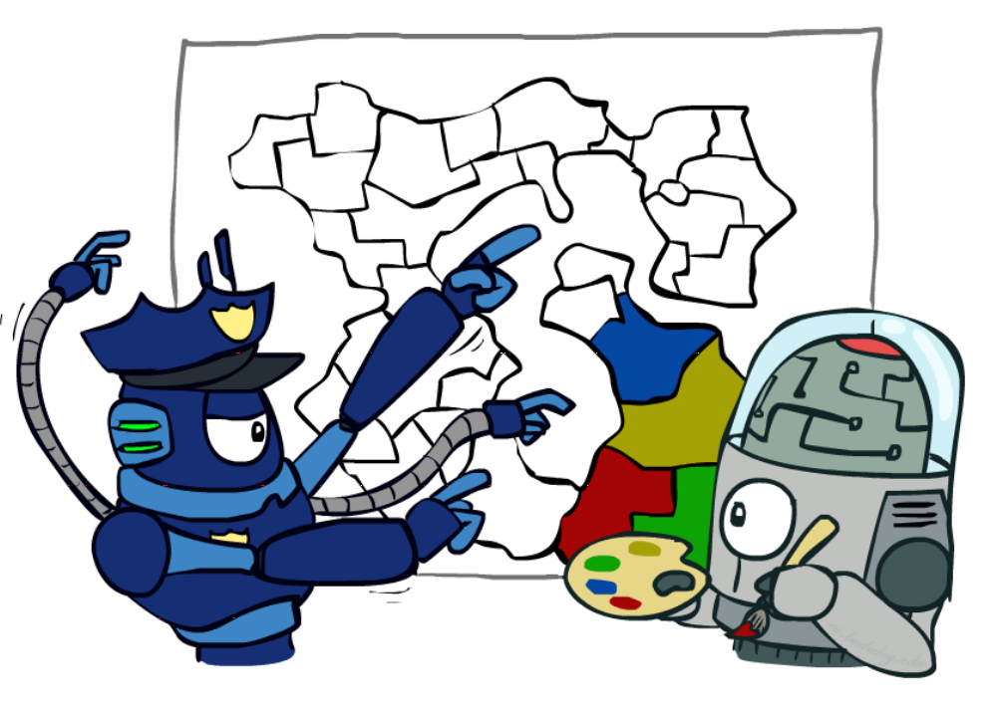

*图 2：地图着色漫画。*

CSP 通常表示为约束图：节点表示变量，边表示变量之间的约束。约束有多种类型，每种类型的处理方式略有不同：

- **一元约束：** 一元约束只涉及 CSP 中的一个变量。它们不会画成约束图中的边，而是在必要时直接删减该变量的域。
- **二元约束：** 二元约束涉及两个变量，在约束图中表示为普通的图边。
- **高阶约束：** 涉及三个或更多变量的约束也可以在 CSP 图中表示，只是图形看起来不太像普通边。

考虑给澳大利亚地图着色：

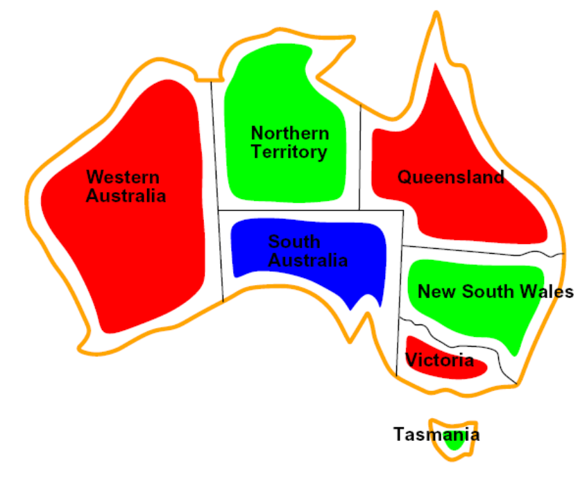

*图 3：澳大利亚地图。*

这个问题的约束很简单：相邻州不能使用同一种颜色。因此，只要在每一对相邻州之间画一条边，就可以得到澳大利亚地图着色问题的约束图。

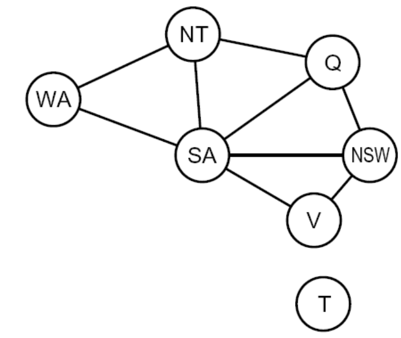

*图 4：澳大利亚地图的约束图。*

约束图的价值在于，它能帮助我们提取正在求解的 CSP 的结构信息。分析 CSP 图，可以判断它的连接或约束是稀疏还是密集，也可以判断它是否具有树结构。后面讨论 CSP 求解时会进一步利用这些信息。

## 2.2 求解约束满足问题

CSP 的传统求解方法是回溯搜索（backtracking search）。回溯搜索是专门针对约束满足问题对深度优先搜索做出的优化，主要依据两个原则：

1. 固定变量顺序，并按照这个顺序给变量选择值。因为赋值具有交换性，例如先给 WA 赋红色、再给 NT 赋绿色，与先给 NT 赋绿色、再给 WA 赋红色是同一个赋值，所以这样做是合理的。
2. 给某个变量选择值时，只选择不与此前赋值冲突的值。如果不存在这样的值，就回溯到前一个变量，改变它的值。

递归回溯的伪代码如下：

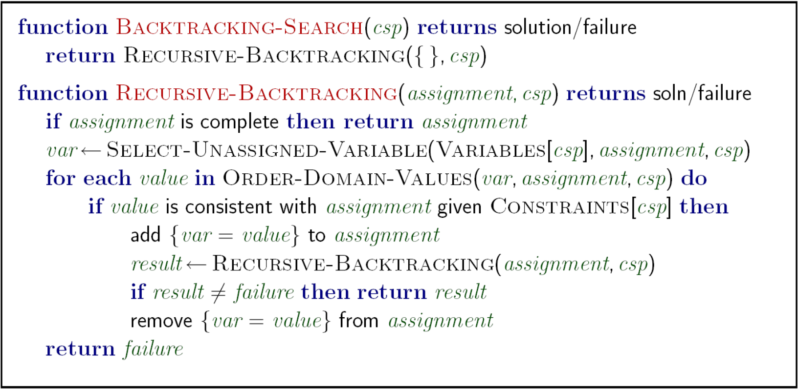

*图 1：回溯搜索伪代码。*

下面比较地图着色中的深度优先搜索和回溯搜索的部分搜索树：

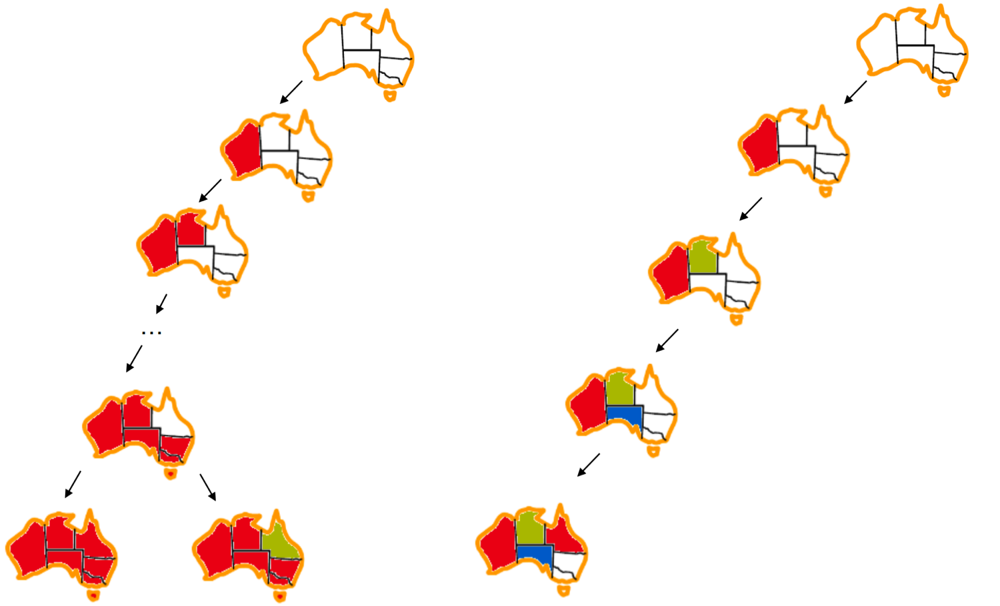

*图 2：DFS 与回溯搜索的比较。*

可以看到，DFS 会先令人遗憾地把所有区域都染成红色，然后才意识到需要改变；即使开始回溯，它也没有很快朝着解的方向前进。回溯搜索只有在某个值不违反约束时才给变量赋值，因此需要的回溯少得多。

回溯搜索已经比深度优先搜索的暴力尝试有很大改进，但还可以通过过滤、变量和值的排序，以及利用问题结构进一步提升速度。

## 2.3 过滤

第一个 CSP 性能优化是过滤。过滤会提前检查：能否从未赋值变量的域中删掉那些必然导致回溯的值。

一种朴素的过滤方法是前向检查（forward checking）。当给变量 $X_i$ 赋值时，前向检查会删减那些与 $X_i$ 共享约束、并且一旦取某个值就会违反约束的未赋值变量的域。每赋值一个新变量，就可以在约束图中检查与它相邻的未赋值变量，并删减它们的域。

考虑带有未赋值变量及其候选值的地图着色示例：

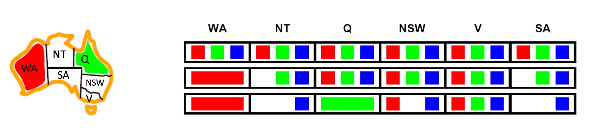

*图 1：前向检查示例。*

先令 $WA=\text{red}$，再令 $Q=\text{green}$。可以看到，与 WA、Q 或二者相邻的 NT、NSW 和 SA 的域会随着不可能值被删除而不断缩小。

前向检查的思想可以推广为弧一致性（arc consistency）。对于弧一致性，我们把约束图中的每条无向边理解成方向相反的两条有向边，每条有向边称为一条弧。

弧一致性算法如下：

1. 把 CSP 约束图中的所有弧放入队列 $Q$。
2. 反复从 $Q$ 中取出弧，并对取出的弧 $X_i\to X_j$ 强制执行以下条件：对于尾变量 $X_i$ 的每个剩余值 $v$，头变量 $X_j$ 至少存在一个剩余值 $w$，使得赋值 $X_i=v,X_j=w$ 不违反任何约束。如果 $X_i$ 的某个值 $v$ 与 $X_j$ 的任何剩余值都不兼容，就从 $X_i$ 的可能取值中删除 $v$。
3. 如果在处理弧 $X_i\to X_j$ 时删除了 $X_i$ 的至少一个值，就把所有形如 $X_k\to X_i$ 的弧加入 $Q$，其中 $X_k$ 是未赋值变量。如果某条弧已经在 $Q$ 中，则不必重复加入。
4. 继续处理，直到 $Q$ 为空，或者某个变量的域变空并触发回溯。

弧一致性通常不太直观，下面用地图着色快速走一遍例子。

一开始，把共享约束的未赋值变量之间的所有弧加入队列：

$$
Q=[SA\to V,V\to SA,SA\to NSW,NSW\to SA,SA\to NT,NT\to SA,V\to NSW,NSW\to V]。
$$

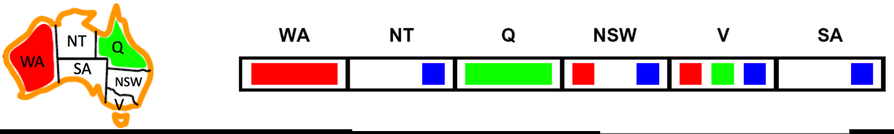

*图 2：弧一致性示例。*

处理第一条弧 $SA\to V$ 时，SA 的域只有 $\{\text{blue}\}$。对于 SA 的这个值，V 的域 $\{\text{red},\text{green},\text{blue}\}$ 中至少存在一个值不会违反约束，因此不需要从 SA 的域中删除值。

处理下一条弧 $V\to SA$ 时，如果令 $V=\text{blue}$，就会发现 SA 没有任何剩余值能与之兼容。因此，从 V 的域中删除 `blue`。

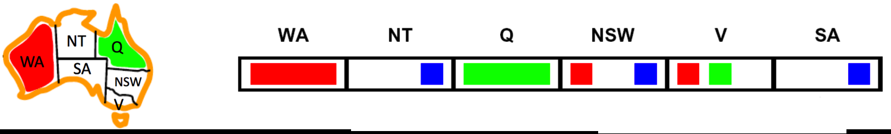

*图 3：弧一致性示例 2。*

由于从 V 的域中删掉了一个值，需要把所有“头部是 V”的弧重新加入队列：$SA\to V$、$NSW\to V$。其中 $NSW\to V$ 已经在队列中，所以只需要加入 $SA\to V$。更新后的队列是

$$
Q=[SA\to NSW,NSW\to SA,SA\to NT,NT\to SA,V\to NSW,NSW\to V,SA\to V]。
$$

继续处理，直到从队列中取出弧 $SA\to NT$。在这条弧上执行弧一致性会从 SA 的域中删除 `blue`，使 SA 的域变空，并触发回溯。注意，$NSW\to SA$ 在 $SA\to NT$ 之前出现在队列中；处理它会从 NSW 的域中删除 `blue`。

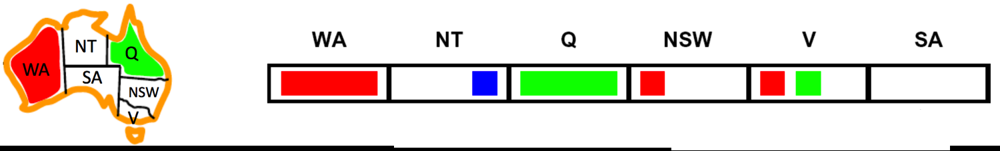

*图 4：弧一致性示例 3。*

弧一致性通常使用 AC-3 算法（Arc Consistency Algorithm #3）实现，其伪代码如下：

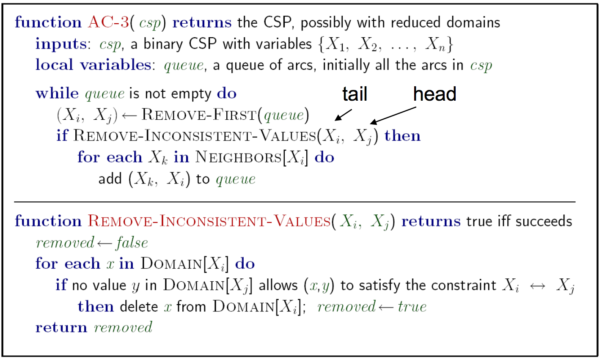

*图 5：AC-3 伪代码。*

AC-3 的最坏时间复杂度为 $O(ed^3)$，其中 $e$ 是弧（有向边）的数量，$d$ 是最大域大小。

总体而言，弧一致性比前向检查更全面，能删减更多域值并减少回溯，但强制执行弧一致性需要更多计算。因此，为待解决的 CSP 选择过滤技术时，必须考虑这项权衡。

关于一致性，还有一个有趣的补充：弧一致性是更一般的一致性概念——$k$-一致性——的子集。强制执行 $k$-一致性后，对于 CSP 中任意一组 $k$ 个节点，只要给其中任意 $k-1$ 个节点做出一致赋值，第 $k$ 个节点就至少有一个一致的值。

这个思想还可以推广为强 $k$-一致性。一个强 $k$-一致图不仅满足 $k$-一致性，还同时满足 $k-1,k-2,\ldots,1$-一致性。在这个更一般的定义下，弧一致性等价于 2-一致性。显然，对 CSP 施加更高程度的一致性，需要付出更多计算成本。

## 2.4 排序

求解 CSP 时，我们已经说明需要为变量和值固定某种顺序。但在实践中，按照两个原则动态计算下一个变量及其取值往往更有效：最少剩余值和最少约束值。

- **最少剩余值（Minimum Remaining Values，MRV）：** 选择下一个变量时，MRV 策略选择剩余有效值最少的未赋值变量，也就是约束最强的变量。直觉上，约束最强的变量如果一直不赋值，最容易耗尽所有可能值并导致回溯；因此应尽早给它赋值。
- **最少约束值（Least Constraining Value，LCV）：** 选择下一个值时，选择会从其他未赋值变量的域中删掉最少值的那个值。使用 LCV 需要额外计算，例如对每个候选值重新执行弧一致性、前向检查或其他过滤方法；但在合适的场景中，这项额外计算仍然可能换来整体速度提升。

### 2.4.1 结构

求解 CSP 的最后一类优化，是利用 CSP 的结构。特别地，如果约束图没有环，是树结构 CSP，那么寻找解的运行时间可以从 $O(d^N)$ 降到关于变量数线性的 $O(Nd^2)$。

树结构 CSP 算法如下：

1. 在 CSP 的约束图中任意选择一个节点作为树根。由于树的任意节点都可以作为根，所以选择哪个节点并不重要。
2. 把树中的所有无向边转换为从根节点向外指向的有向边，然后将得到的有向无环图线性化，也就是进行拓扑排序。简单地说，就是排列节点，使所有边都朝右指。假设选择节点 A 作为根，并把所有边指向远离 A 的方向，就得到如下转换：

   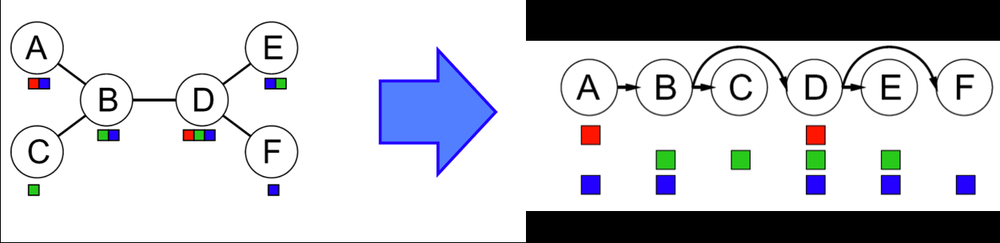

   *图 1：树结构 CSP。*

3. 执行一次反向弧一致性处理。从 $i=N$ 到 $i=2$，对所有弧 $Parent(X_i)\to X_i$ 强制执行弧一致性。对于线性化后的 CSP，这次域删减会移除一些值，得到：

   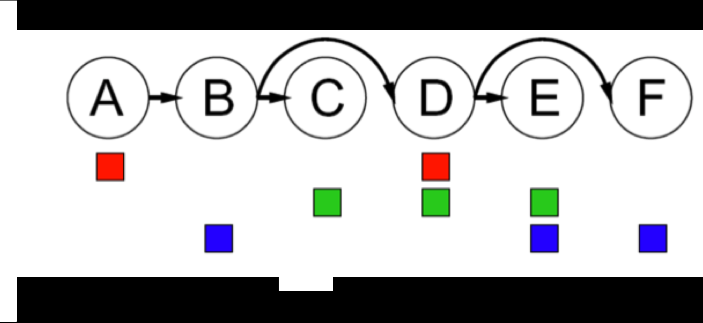

   *图 2：剪枝后的树。*

4. 最后执行前向赋值。从 $X_1$ 走到 $X_N$，为每个 $X_i$ 选择一个与其父节点取值一致的值。由于我们已经对这些弧执行了弧一致性，无论为某个节点选择什么值，都知道它的每个子节点至少存在一个一致值。因此，这种迭代赋值保证得到正确解；这个事实也可以用归纳法直接证明。

对于与树结构接近的 CSP，可以使用割集条件化（cutset conditioning）扩展树结构算法。割集条件化首先要在约束图中找到一个最小变量子集，使删除这些变量后剩余图成为一棵树；这个子集称为图的割集。

在地图着色示例中，南澳大利亚（SA）是可能的最小割集。找到最小割集后，给割集中的所有变量赋值，并删减所有相邻节点的域。剩余部分就是树结构 CSP，可以使用前面的树结构 CSP 算法求解。

割集大小为 $c$ 的初始赋值，经过剪枝后可能使剩余树结构 CSP 没有有效解，因此仍可能需要回溯，最多尝试 $d^c$ 种割集赋值。删除割集后，剩余树结构 CSP 有 $N-c$ 个变量，可以在 $O((N-c)d^2)$ 时间内求解，或者判断它没有解。因此，普通 CSP 上割集条件化的运行时间为

$$
O\left(d^c(N-c)d^2\right)。
$$

当 $c$ 很小时，这个复杂度非常好。

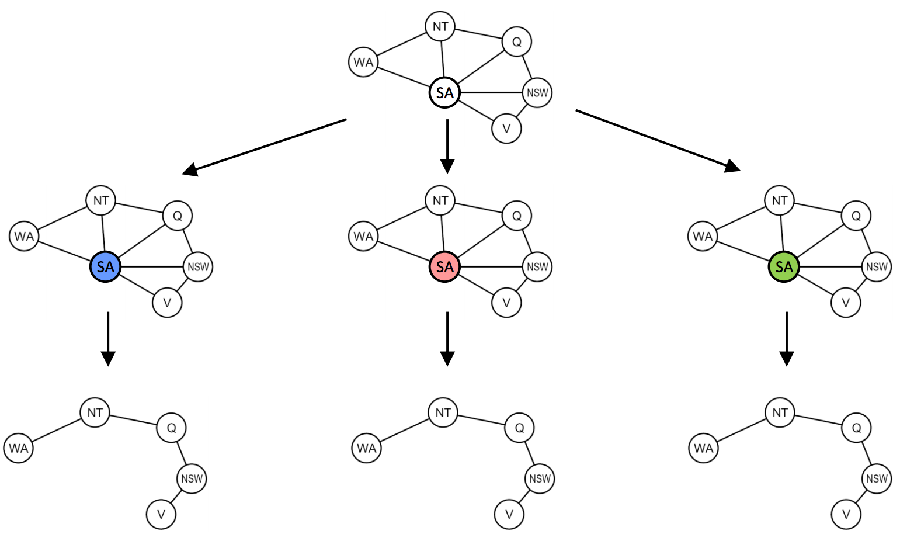

*图 3：割集示例。*

## 2.5 局部搜索

回溯搜索并不是解决 CSP 的唯一算法。另一种广泛使用的方法是局部搜索，其思想看起来非常简单，却非常有用。

局部搜索采用迭代改进：先随机给变量赋值，然后反复选择一个发生冲突的变量，把它重新赋值为能违反最少约束的值，直到不再存在约束冲突。这种策略称为最少冲突启发式（min-conflicts heuristic）。

使用这种策略后，N 皇后等 CSP 可以非常高效地利用时间和空间求解。例如，在下面的四皇后示例中，只需要两次迭代就能得到解：

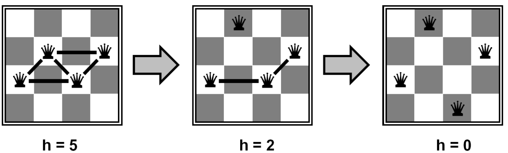

*图 1：四皇后。*

事实上，对于任意大的 $N$ 皇后问题，甚至对于随机生成的 CSP，局部搜索似乎都能以近似常数时间运行，并具有很高的成功概率。然而，局部搜索同时不完备且非最优，因此不一定收敛到最优解。

局部搜索还存在一个临界比率，在这个比率附近使用局部搜索会变得非常昂贵：

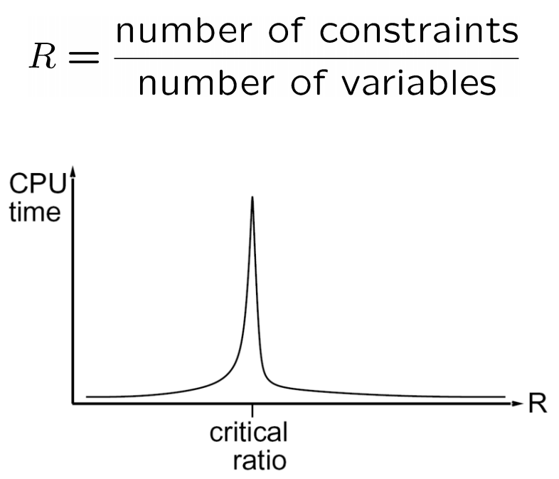

*图 2：临界比率。*

上一章已经见过，局部搜索会在状态空间中逐步移动到目标值更高的状态，直到到达某个极大值（希望是全局极大值）。这里介绍三种局部搜索算法：爬山法、模拟退火和遗传算法。它们都可以用于最大化或最小化目标函数。

### 2.5.1 爬山搜索

爬山搜索（或最陡上升法）从当前状态移动到能增加目标值的邻居状态。算法不维护搜索树，只维护状态及其目标值。

爬山法的贪心特性使它容易陷入局部极大值，因为这些点在局部看起来像全局极大值；它也容易陷入平台。平台可以是没有任何方向能带来改进的平坦局部极大值，也可以是进展缓慢的肩部。

随机爬山法会在所有上坡移动中随机选择一个。实践表明，这个变体往往能收敛到更高的极大值，但代价是需要更多迭代。

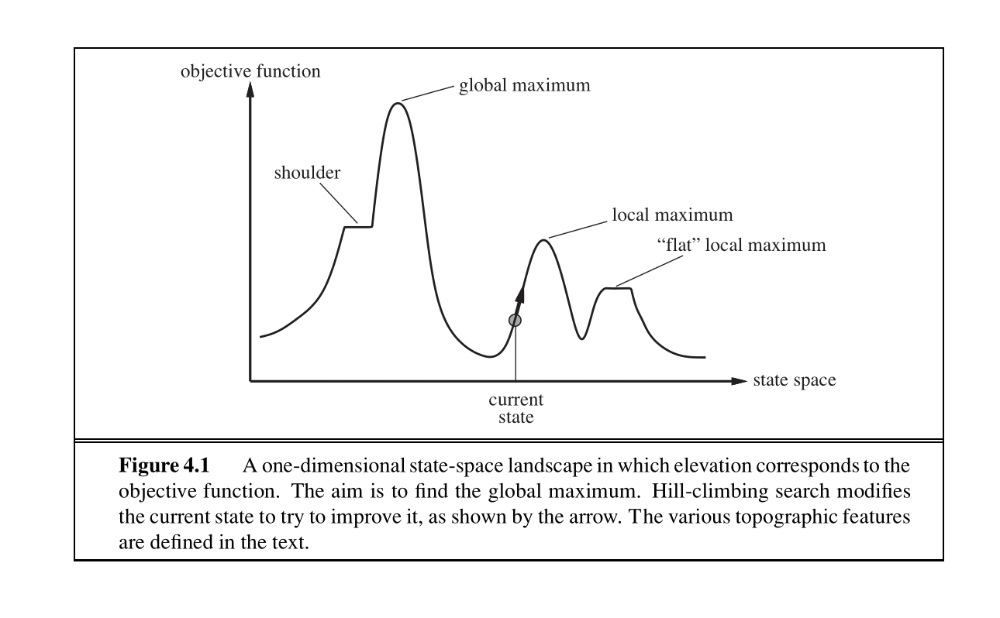

*图 3：全局极大值与局部极大值。*

爬山算法会反复移动到目标值更高的状态，直到无法继续改进，因此它不完备。随机重启爬山法会从随机选择的多个初始状态分别执行爬山；从某个时刻开始，随机选中的初始状态可能正好收敛到全局极大值，因此它具有完备性。

### 2.5.2 模拟退火搜索

模拟退火试图把随机游走和爬山法结合起来，得到完备且高效的搜索算法。它允许移动到目标值可能降低的状态。

算法在每个状态选择一个随机移动。如果移动带来更高目标值，就总是接受；如果目标值降低，就以某个概率接受。这个概率由温度参数决定：温度开始较高，允许更多“坏”移动；随后按某个计划降低。如果温度下降得足够慢，模拟退火以趋近于 1 的概率到达全局极大值。

*图 4：爬山。*

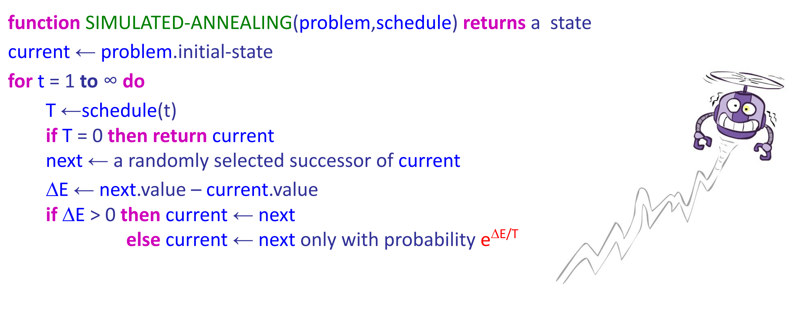

*图 5：模拟退火。*

### 2.5.3 遗传算法

遗传算法是局部束搜索的一种变体，也广泛用于优化任务。遗传算法从束搜索开始：随机初始化 $k$ 个状态，并把它们称为种群。状态或个体表示为有限字母表上的字符串。

回到课堂中介绍的八皇后问题。可以用 1 到 8 的数字表示八个皇后在各自列中的位置。每个个体通过评价函数（适应度函数）计算得分，并按得分排序。对于八皇后问题，适应度就是不相互攻击的皇后对数量。

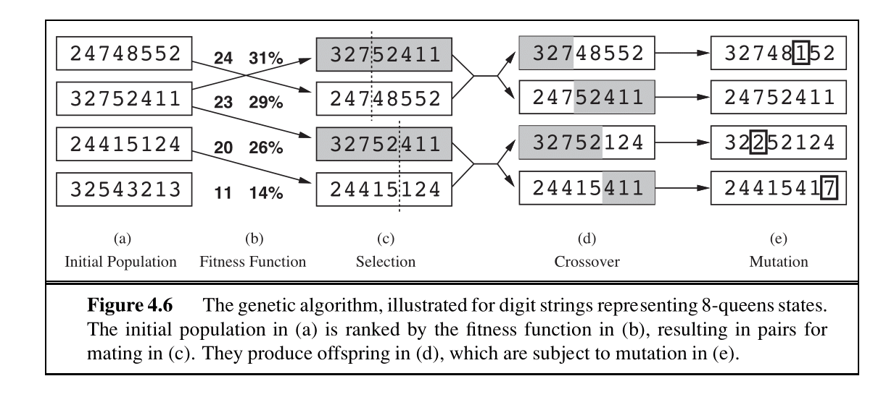

*图 6：遗传算法示例。*

选择某个状态进行“繁殖”的概率与该状态的评价值成正比。按照这些概率选择成对状态繁殖，在随机选择的交叉点处交换父代字符串片段生成子代。最后，每个子代还以独立概率接受随机突变。

遗传算法的伪代码如下图所示：

*图 7：遗传算法伪代码。*

遗传算法试图在探索状态空间的同时向更高目标值移动，并在线程之间交换信息。它的主要优势是交叉操作：已经进化出来、能带来高评价的大片字符串，可以与其他高评价片段组合，从而产生总分很高的解。

## 2.6 本章小结

一般来说，CSP 没有一个能在关于变量数的多项式时间内高效求解所有问题的算法。不过，利用各种启发式，我们经常能够在可接受的时间内找到解：

- **过滤：** 过滤提前剪枝未赋值变量的域，避免不必要的回溯。本章介绍了前向检查和弧一致性两种重要过滤技术。
- **排序：** 排序负责选择下一个变量或值，使回溯尽可能少。变量选择使用 MRV 策略，值选择使用 LCV 策略。
- **结构：** 如果 CSP 是树结构或接近树结构，可以运行树结构 CSP 算法在线性时间内得到解。对于接近树结构的 CSP，还可以使用割集条件化，把它转换成一个或多个相互独立的树结构 CSP，再分别求解。
