# 第三章 博弈

作者：Nikhil Sharma

编辑：Catherine Chu、Wesley Zheng

部分内容改编自《人工智能：一种现代方法》（*Artificial Intelligence: A Modern Approach*）。

最后更新：2024 年 9 月

## 3.1 博弈

第一章讨论了搜索问题，以及如何使用强大的通用搜索算法高效、最优地解决它们。智能体可以确定最佳计划，然后执行计划到达目标。

现在考虑另一类场景：智能体有一个或多个对手，而对手会阻止它到达目标。由于我们通常无法确定对手会如何规划、如何回应自己的行动，智能体不能直接运行已经学过的普通搜索算法来制定计划。此时需要使用一类新的算法，求解对抗性搜索问题，也就是通常所说的博弈问题。

博弈有很多类型：行动结果可以是确定的，也可以是随机的；玩家数量可以变化；博弈也可能是零和或非零和。本章首先讨论确定性零和博弈：行动是确定的，一个团队或智能体的收益等于对手的损失，反之亦然。

理解这类博弈最简单的方式，是把它看成由一个数值定义。某一方试图最大化这个数值，另一方试图最小化它，双方直接竞争。在 Pacman 中，这个数值就是分数：Pacman 通过快速、高效地吃食物来最大化分数，而幽灵试图先吃掉 Pacman 来最小化分数。

许多常见的家庭游戏都属于这一类：

- **跳棋：** 第一台跳棋计算机玩家诞生于 1950 年。后来跳棋成为已解决的游戏：如果双方都采取最优行动，任意棋局都可以被确定地判断为某一方获胜、失败或和棋。
- **国际象棋：** 1997 年，Deep Blue 在六局比赛中首次击败人类国际象棋冠军 Garry Kasparov。Deep Blue 使用高度复杂的方法，每秒评估超过 2 亿个局面。今天的程序更强，只是少了 Deep Blue 的历史意义。
- **围棋：** 围棋的搜索空间比国际象棋大得多，多年来很多人都不相信围棋计算机程序能击败人类世界冠军。然而，Google 开发的 AlphaGo 在 2016 年 3 月以 4 比 1 的比分击败围棋冠军李世石，创造了历史。

上面这些世界冠军级智能体都至少在一定程度上使用了下面将介绍的对抗性搜索技术。

普通搜索返回一个完整计划；对抗性搜索返回一个策略或政策（policy），它只根据智能体、对手的当前配置，建议当前最好的行动。稍后会看到，这类算法会通过计算产生行为：运行的计算在概念上相对简单，而且可以广泛推广，但它会自然地产生同队智能体之间的合作，以及对抗智能体之间的“斗智”。

标准博弈形式化包含以下定义：

- 初始状态 $s_0$；
- 玩家：$Players(s)$ 表示轮到谁行动；
- 行动：$Actions(s)$ 表示当前玩家可采取的行动；
- 转移模型：$Result(s,a)$；
- 终止测试：$Terminal\text{-}test(s)$；
- 终止值：$Utility(s,player)$。

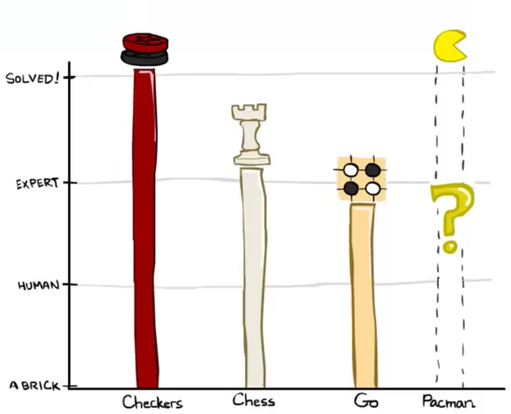

*图 1：常见博弈。*

## 3.2 Minimax

首先讨论零和博弈算法 minimax。它的核心假设是：对手会理性行动，总是选择对我们最不利的行动。

要介绍这个算法，需要先形式化终止效用和状态价值。一个状态的价值，是控制该状态的智能体能够获得的最优分数。

考虑下面这个非常简单的 Pacman 棋盘：

*图 1：Pacman 博弈。*

假设 Pacman 初始有 10 分，每移动一次损失 1 分；吃到食物后，游戏到达终止状态并结束。对于这个棋盘，可以建立如下博弈树，其中状态的子节点和普通搜索树一样表示后继状态：

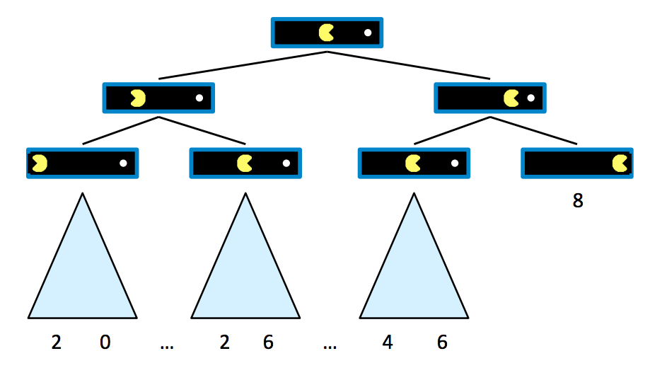

*图 2：Pacman 博弈树。*

从这棵树可以看出，如果 Pacman 直接走向食物，游戏结束时得分为 8；如果中途回头，最终得分会更低。

一个状态的价值，定义为智能体从该状态出发能够获得的最佳结果或效用。后面会更具体地定义效用；现在可以把它理解成智能体得到的分数。

终止状态的价值称为终止效用（terminal utility），它总是一个确定的已知值，也是博弈本身的属性。在 Pacman 示例中，最右侧终止状态的价值就是 8，即 Pacman 直接走向食物所得的分数。

在这个示例中，非终止状态的价值等于其子节点价值的最大值。令 $V(s)$ 表示状态 $s$ 的价值，则

$$
\begin{aligned}
\text{非终止状态：}\quad &V(s)=\max_{s'\in successors(s)}V(s'),\\
\text{终止状态：}\quad &V(s)=\text{已知值}。
\end{aligned}
$$

这建立了一个简单的递归规则。根节点的直接右子节点价值为 8，直接左子节点价值为 6，因为 Pacman 分别向右或向左移动时可以获得的最高分就是这些值。因此，只要运行这个计算，智能体就能判断从起点向右移动是最优的：右子节点的价值高于左子节点。

现在加入一个想阻止 Pacman 吃到食物的对抗性幽灵：

*图 3：带幽灵的 Pacman。*

游戏规则规定两个智能体轮流移动，于是博弈树的不同层由不同智能体控制。一个智能体控制某个节点，意味着该节点表示轮到这个智能体行动的状态，它可以选择行动并改变博弈状态。

蓝色节点由 Pacman 控制，Pacman 可以在这些节点选择行动；红色节点由幽灵控制。幽灵控制节点的所有子节点，都是幽灵从父状态向左或向右移动后的状态；Pacman 控制节点也同理。

为了简单起见，把这棵博弈树截断到深度 2，并为终止状态指定一些示例值：

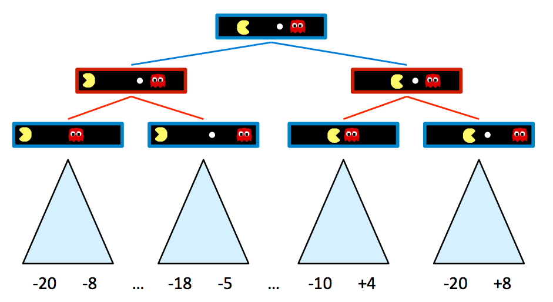

*图 4：Pacman 博弈树。*

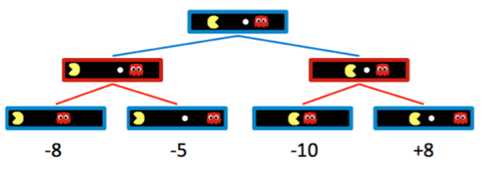

*图 5：小型博弈树。*

加入幽灵控制节点后，Pacman 认为最优的移动发生了变化。新的最优移动由 minimax 算法决定。算法不再在每一层都对所有子节点取最大值，而是在 Pacman 控制的节点取最大值，在幽灵控制的节点取最小值。

因此，上面两个幽灵节点的价值分别是

$$
\min(-8,-5)=-8，\qquad \min(-10,+8)=-10。
$$

相应地，Pacman 控制的根节点价值为

$$
\max(-8,-10)=-8。
$$

Pacman 想最大化分数，所以它会向左走并接受 $-8$，而不会尝试走向食物得到 $-10$。这体现了“通过计算产生行为”：Pacman 当然希望得到右侧子节点的 $+8$，但 minimax 让它“知道”一个理性行动的幽灵不会允许这个结果发生。为了理性行动，Pacman 只能采取保守策略，反直觉地远离食物，以减小失败的程度。

minimax 为状态赋值的规则可以概括为

$$
\begin{aligned}
\text{智能体控制的状态：}\quad &V(s)=\max_{s'\in successors(s)}V(s'),\\
\text{对手控制的状态：}\quad &V(s)=\min_{s'\in successors(s)}V(s'),\\
\text{终止状态：}\quad &V(s)=\text{已知值}。
\end{aligned}
$$

minimax 的实现方式类似深度优先搜索：它按照 DFS 的顺序计算节点价值，从最左侧终止节点开始，逐步向右处理。更准确地说，它对博弈树进行后序遍历。

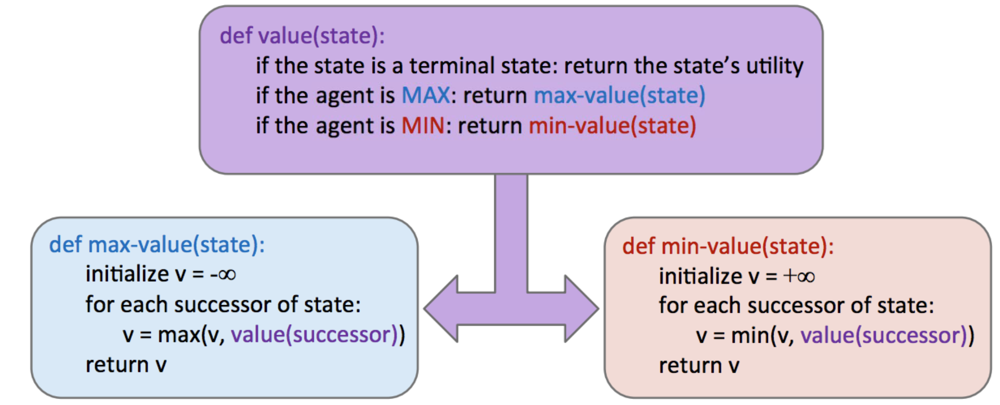

*图 6：Minimax 伪代码。*

minimax 返回一个行动，对应根节点选择的、价值来自哪个子节点的分支。

### 3.2.1 Alpha–Beta 剪枝

minimax 看起来几乎完美：简单、最优、直观。然而，它的执行过程非常像深度优先搜索，时间复杂度也是令人难以接受的 $O(b^m)$。其中 $b$ 是分支因子，$m$ 是大致能找到终止节点的树深度。对于许多博弈，这个运行时间太大。例如，国际象棋的分支因子约为 $b\approx35$，树深度约为 $m\approx100$。

为缓解这个问题，minimax 有一个优化：alpha–beta 剪枝。

alpha–beta 剪枝的核心思想是：如果我们要通过考察节点 $n$ 的后继节点来确定 $n$ 的价值，那么一旦知道 $n$ 的价值至多等于其父节点的最优值，就可以停止继续考察 $n$ 的其他后继。

考虑下面的博弈树。方形节点表示终止状态，向下的三角形表示最小化节点，向上的三角形表示最大化节点：

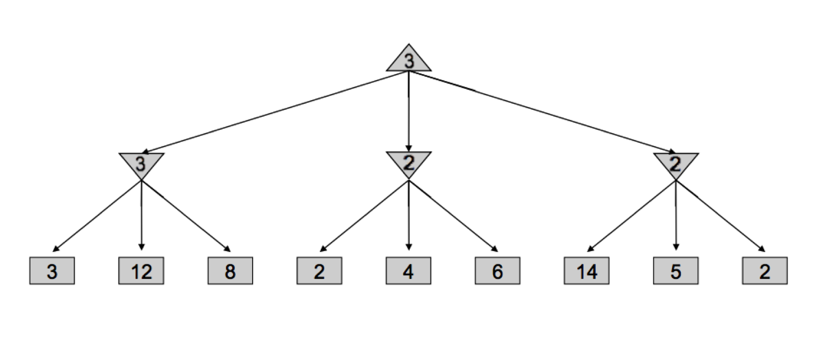

*图 7：Alpha–Beta 示例第一部分。*

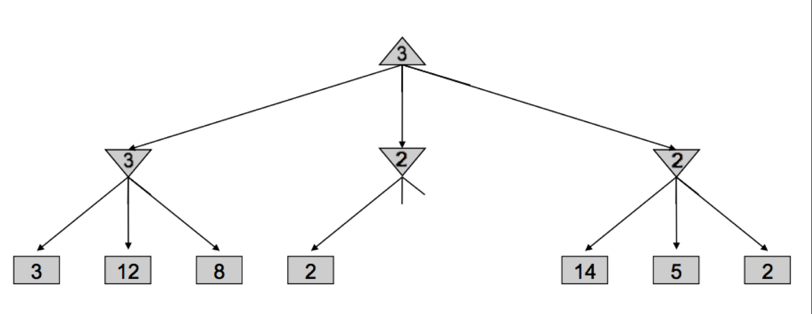

*图 8：Alpha–Beta 示例第二部分。*

minimax 会先处理值为 3、12、8 的节点，把最左侧最小化节点的价值设为 $\min(3,12,8)=3$；再把中间最小化节点的价值设为 $\min(2,4,6)=2$；把右侧最小化节点的价值设为 $\min(14,5,2)=2$；最后把根最大化节点的价值设为 $\max(3,2,2)=3$。

但仔细观察会发现，一旦访问中间最小化节点下值为 2 的子节点，就不必再查看它的其他子节点。因为只要看到了一个值为 2 的子节点，无论其他子节点的值是多少，中间最小化节点的价值都至多为 2。

根最大化节点正在比较左侧最小化节点返回的 3，以及中间最小化节点返回的至多 2 的值。因此，无论中间节点剩余子节点的值是多少，根节点都会选择左侧的 3。于是可以剪掉中间最小化节点的剩余子节点，不再访问它们。

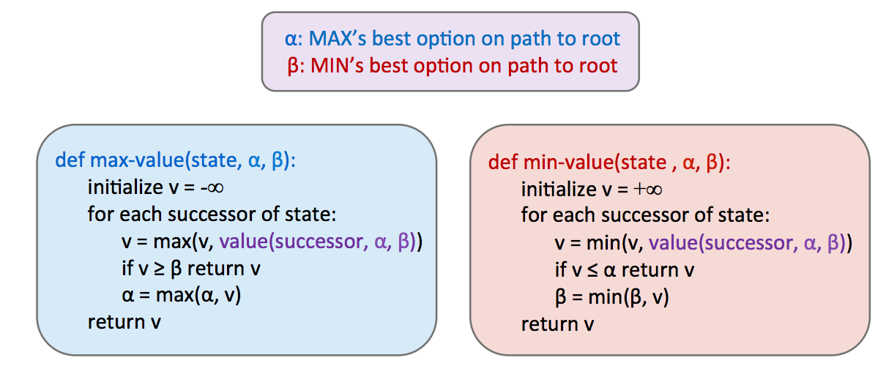

*图 9：Alpha–Beta 伪代码。*

这种剪枝可以把运行时间改善到 $O(b^{m/2})$，相当于把可解决的深度提高一倍。实践中通常达不到这个最好情况，但一般仍能让算法多搜索一两层。这个提升很重要：能向前思考 3 步的玩家，通常会击败只能向前思考 2 步的玩家。

alpha–beta 剪枝正是带有 alpha–beta 优化的 minimax 所做的事情。与普通 minimax 的伪代码相比，它可以在不搜索所有后继节点的情况下提前返回。

### 3.2.2 评价函数

即使 alpha–beta 剪枝可以增加 minimax 可行的搜索深度，也通常不足以让我们触及绝大多数博弈树的底部。因此，需要引入评价函数（evaluation function）：它接收一个状态，输出该节点真实 minimax 价值的估计。

通常，一个好的评价函数会给“更好”的状态分配更高的值，给“更差”的状态分配更低的值。评价函数广泛用于深度受限 minimax：达到最大可搜索深度后，把非终止节点当作终止节点，并用精心选择的评价函数给它们分配模拟终止效用。

由于评价函数只能估计非终止状态的价值，使用它会失去 minimax 保证最优行动的性质。设计运行 minimax 的智能体时，人们通常会花费大量时间和实验来选择评价函数。评价函数越好，智能体的行为就越接近最优。

在使用评价函数前把博弈树探索得更深，也通常会带来更好的结果；越深入博弈树，评价函数估计的不确定性越不容易破坏最优性。这些函数在博弈中的作用，与普通搜索问题中的启发式函数非常相似。

评价函数最常见的设计是特征的线性组合：

$$
Eval(s)=w_1f_1(s)+w_2f_2(s)+\ldots+w_nf_n(s)。
$$

每个 $f_i(s)$ 都是从输入状态 $s$ 提取的特征，并有一个对应的权重 $w_i$。特征就是博弈状态中可以提取并赋予数值的某个元素。

例如，在跳棋中，可以设计包含 4 个特征的评价函数：我方兵的数量、我方王的数量、对手兵的数量、对手王的数量。然后根据各特征的重要性选择权重。自然的选择是给我方兵和王使用正权重，给对手兵和王使用负权重。由于跳棋中的王比普通兵更有价值，我方和对手王对应的权重绝对值应大于兵对应的权重。

一个符合上述特征和权重思路的评价函数是

$$
Eval(s)=2\cdot agent\_kings(s)+agent\_pawns(s)-2\cdot opponent\_kings(s)-opponent\_pawns(s)。
$$

评价函数的设计空间很大，也不一定必须是线性函数。例如，基于神经网络的非线性评价函数在强化学习应用中非常常见。最重要的一点，是评价函数应尽可能经常地给更好的局面更高的分数。这通常需要通过多种特征、权重和实验不断调参。

## 3.3 Expectimax

前面已经看到，完整 minimax 可以让我们在对手最优行动时做出最优回应。但 minimax 也有天然限制：它假设对手理性且最优，因此在对手不一定采取最优回应的情况下往往过于悲观。

带有内在随机性的纸牌、骰子游戏，或者会随机行动、行动次优的不可预测对手，都属于这种情况。后续讨论马尔可夫决策过程时会更详细地研究随机性。

这种随机性可以由 minimax 的推广算法 expectimax 表示。Expectimax 在博弈树中加入机会节点（chance node）。最小化节点考虑最坏情况，而机会节点考虑平均情况：最小化节点对所有子节点取最小效用，机会节点计算期望效用或期望价值。

Expectimax 的状态价值规则为

$$
\begin{aligned}
\text{智能体控制的状态：}\quad &V(s)=\max_{s'\in successors(s)}V(s'),\\
\text{机会状态：}\quad &V(s)=\sum_{s'\in successors(s)}p(s'\mid s)V(s'),\\
\text{终止状态：}\quad &V(s)=\text{已知值}。
\end{aligned}
$$

这里的 $p(s'\mid s)$ 可能表示：非确定性行动从状态 $s$ 转移到 $s'$ 的概率，也可能表示对手选择某个行动、导致从 $s$ 转移到 $s'$ 的概率，具体取决于博弈和博弈树的定义。

由此可见，minimax 是 expectimax 的一个特例：把最小化节点看成机会节点，为它的最低价值子节点分配概率 1，为其他子节点分配概率 0。

一般来说，概率必须正确反映要建模的博弈状态；后续章节会进一步讨论如何确定概率。当前可以把概率视为博弈本身固有的属性。

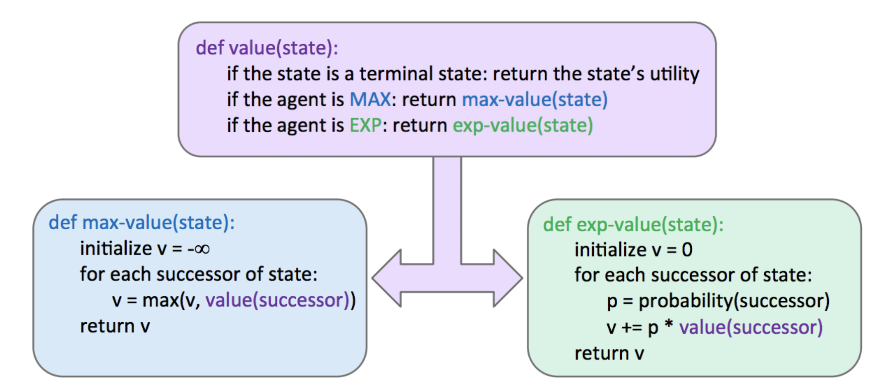

*图 1：Expectimax 伪代码。*

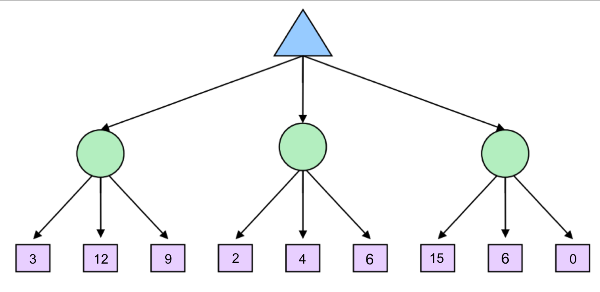

*图 2：未填充的 Expectimax 树。*

考虑上面的简单 expectimax 树，机会节点用圆形表示，最大化/最小化节点则用向上或向下的三角形表示。为简单起见，假设每个机会节点的所有子节点发生概率都为 $1/3$。

从左到右，三个机会节点的值分别为

$$
\frac13\cdot3+\frac13\cdot12+\frac13\cdot9=8，
$$

$$
\frac13\cdot2+\frac13\cdot4+\frac13\cdot6=4，
$$
$$
\frac13\cdot15+\frac13\cdot6+\frac13\cdot0=7。
$$

最大化节点选择三者中的最大值 8，得到填充后的博弈树：

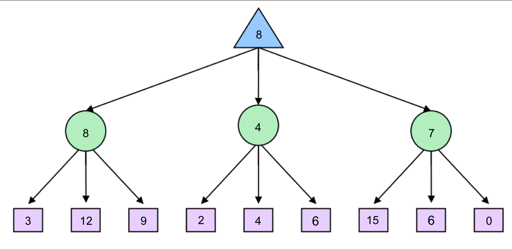

*图 3：填充后的 Expectimax 树。*

关于 expectimax 还要注意：通常必须考察机会节点的所有子节点，不能像 minimax 那样直接剪枝。计算最小值或最大值时，一个子节点就可能足以决定结果；计算期望值时，单个值可以把期望值任意地推高或压低。不过，如果知道节点值具有有限范围，则仍可能进行剪枝。

### 3.3.1 混合节点层

Minimax 和 expectimax 分别要求最大化节点与最小化节点、最大化节点与机会节点交替出现，但许多博弈并不遵循这两种算法要求的严格交替模式。

例如，在 Pacman 中，Pacman 移动后通常有多个幽灵依次移动，而不是只有一个幽灵。可以灵活地按需要向博弈树中加入节点层：四个幽灵的例子可以是一个 Pacman 最大化层，接着四个连续的幽灵/最小化层，再接着第二个 Pacman 最大化层。

这样做会自然地产生最小化节点之间的合作，因为它们轮流行动，继续降低最大化节点能够获得的效用。也可以把机会节点层与最小化节点、最大化节点组合起来。例如，若有两个幽灵，其中一个随机行动、另一个最优行动，就可以用最大化—机会—最小化的交替节点组来模拟。

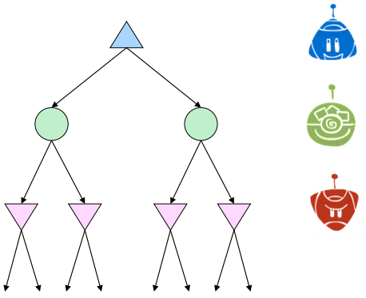

*图 4：混合节点层。*

节点层的组合方式具有很大弹性，因此可以针对各种零和博弈构造不同的博弈树，以及 minimax/expectimax 的混合对抗性搜索算法。

## 3.4 一般博弈

并非所有博弈都是零和的。不同智能体在博弈中可能有不同任务，并不一定严格互相竞争。这类博弈可以用多智能体效用的树表示。

多智能体效用不是让交替行动的智能体共同最小化或最大化一个数值，而是一个元组，元组中的不同分量对应不同智能体的独立效用。每个智能体在自己控制的节点上，只最大化自己的效用，不考虑其他智能体的效用。

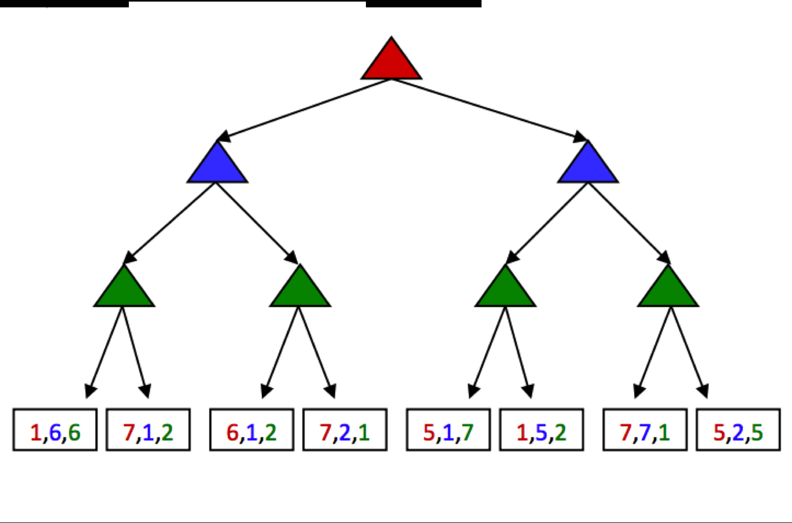

*图 1：多智能体效用。*

红色、绿色和蓝色节点对应三个不同的智能体。它们分别在自己的层中最大化元组的红色、绿色和蓝色效用。处理完这个例子后，最终会在树根得到效用元组 $(5,2,5)$。

带多智能体效用的一般博弈，是通过计算产生行为的典型例子：根节点选择的效用往往能给所有参与者带来相对合理的收益，从而产生合作。

## 3.5 蒙特卡洛树搜索

对于围棋这类分支因子很大的应用，不能再使用 minimax。此时使用蒙特卡洛树搜索（Monte Carlo Tree Search，MCTS）。MCTS 建立在两个思想上：

- **通过 rollout 评价：** 从状态 $s$ 出发，使用某个策略（例如随机策略）多次进行游戏，并统计胜负。
- **选择性搜索：** 在没有固定视界限制的情况下，探索那些能改善根节点决策的部分树。

以围棋为例，从某个状态开始，按照某个策略多次进行游戏，直到终止；记录获胜比例。获胜比例与状态价值有很好的相关性。

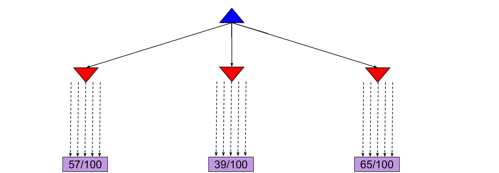

*图 1：MCTS 示例一。*

假设当前状态有左、中、右三个可用行动。每个行动执行 100 次，并记录每个行动的获胜百分比。模拟结束后，我们相当有把握地认为右侧行动最好。

这个例子给每个候选行动分配了相同数量的模拟。但经过几次模拟后，可能发现某个行动几乎不能带来胜利；此时可以把原本分配给它的计算资源，转给其他行动。下面的图展示了这种情形：把中间行动剩余的 90 次模拟分配给左侧和右侧行动。

另一个有趣情形是：两个行动的获胜比例相近，但其中一个使用的模拟次数远少于另一个。模拟次数少的行动，其比例估计方差更大，因此可以再给它分配几次模拟，以更有把握地估计真实获胜比例。

UCB 算法通过以下准则，在“有希望”和“不确定”之间进行权衡。对于每个节点 $n$，使用

$$
UCB_1(n)=\frac{U(n)}{N(n)}+C\sqrt{\frac{\log N(Parent(n))}{N(n)}}。
$$

其中，$N(n)$ 表示从节点 $n$ 出发的 rollout 总数，$U(n)$ 表示该节点获得的胜利总数。第一项表示节点当前有多大希望，第二项表示我们对该节点效用有多不确定。

用户指定的参数 $C$ 决定两个项的权重，也就是“探索”和“利用”的平衡，并取决于应用以及任务所处阶段。到了后期，已经积累了很多试验，通常会减少探索、增加利用。

MCTS 的 UCT 算法在树搜索问题中使用这个 UCB 准则。更具体地说，它会重复以下三个步骤：

1. 使用 UCB 准则从根节点开始向下遍历各层，直到到达一个尚未扩展的叶节点。
2. 为该叶节点添加一个新子节点，并从这个子节点开始执行一次 rollout，确定从该节点得到的胜利数。
3. 把胜利数从子节点向上更新到根节点。

重复这三个步骤足够多次后，选择通向 $N$ 值最高子节点的行动。由于 UCT 会让更有希望的子节点被探索更多次，当 $N\to\infty$ 时，UCT 会逐渐接近 minimax 智能体的行为。

*图 2：MCTS 示例二。*

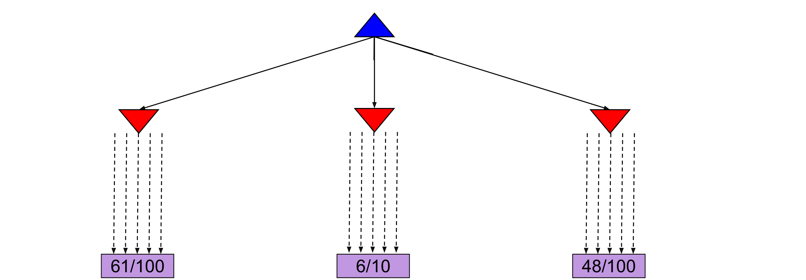

*图 3：MCTS 示例三。*

## 3.6 本章小结

本章从普通搜索问题转向对抗性搜索问题。普通搜索只需从起点找到通往目标的路径；对抗性搜索还要考虑试图阻止我们到达目标的对手。

本章讨论了两个主要算法：

- **Minimax：** 用于对手会最优行动的情形，可以使用 $\alpha$–$\beta$ 剪枝优化。Minimax 比 expectimax 更保守，因此即使对手未知，也往往能产生有利结果。
- **Expectimax：** 用于面对次优对手的情形，使用我们认为对手会采取的行动概率分布，计算状态的期望价值。

在大多数情形下，把上述算法运行到博弈树的终止节点，计算成本都太高。因此引入评价函数，提前终止搜索。对于分支因子很大的问题，介绍了 MCTS 和 UCT 算法。这些算法容易并行化，可以利用现代硬件执行大量 rollout。

最后，讨论了一般博弈：博弈规则不一定是零和的。
