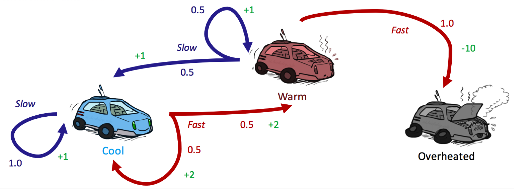
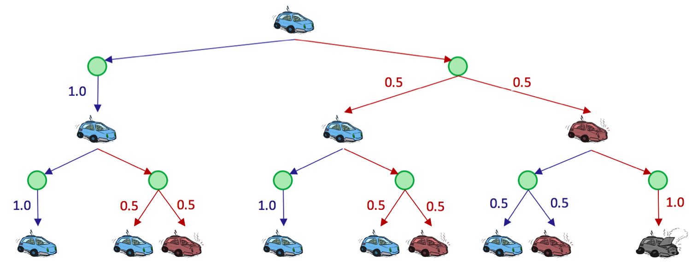
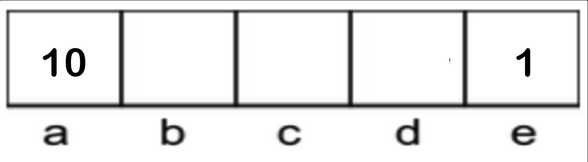
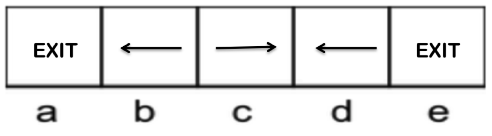
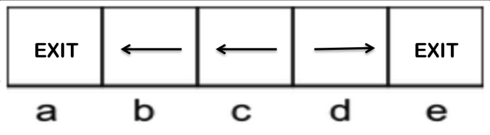

# 第四章 马尔可夫决策过程

作者：Nikhil Sharma

编辑：Saathvik Selvan、Wesley Zheng

部分内容改编自《人工智能：一种现代方法》（*Artificial Intelligence: A Modern Approach*）。

最后更新：2024 年 10 月

## 4.1 马尔可夫决策过程

马尔可夫决策过程（Markov Decision Process，MDP）由以下属性定义：

- 状态集合 $S$。MDP 中的状态与传统搜索问题中的状态表示方式相同。
- 行动集合 $A$。MDP 中的行动也与传统搜索问题中的行动表示方式相同。
- 初始状态。
- 一个或多个终止状态（可以没有）。
- 折扣因子 $\gamma$（可以没有，后面会介绍）。
- 转移函数 $T(s,a,s')$。由于行动可能是非确定性的，需要一种方式描述：从任意状态执行任意行动后，各种可能结果出现的概率。MDP 的转移函数就是这样一个概率函数，表示智能体从 $s\in S$ 执行 $a\in A$ 后到达 $s'\in S$ 的概率。
- 奖励函数 $R(s,a,s')$。MDP 通常在每一步设置较小的“生存”奖励，以鼓励智能体继续存在；到达终止状态时给出较大的奖励。奖励可以为正，也可以为负，取决于结果是否对智能体有利。智能体的目标自然是在到达终止状态前获得尽可能大的奖励。

为一个场景构造 MDP，与为搜索问题构造状态空间图非常相似，但需要注意一些额外情况。考虑下面的赛车示例：

*图 1：赛车示例。*

有三个可能状态：

$$
S=\{\text{cool},\text{warm},\text{overheated}\}，
$$

以及两个可能行动：

$$
A=\{\text{slow},\text{fast}\}。
$$

和状态空间图一样，三个状态分别表示为节点，边表示行动。`overheated` 是终止状态：赛车智能体到达该状态后无法再执行行动、获得奖励；它是 MDP 中没有出边的汇状态。

对于非确定性行动，同一个状态执行同一个行动时可能有多条边，分别通向不同后继状态。每条边不仅标注行动，还标注转移概率和相应奖励。它们总结如下：

**转移函数 $T(s,a,s')$：**

$$
\begin{aligned}
T(\text{cool},\text{slow},\text{cool})&=1,\\
T(\text{warm},\text{slow},\text{cool})&=0.5,\\
T(\text{warm},\text{slow},\text{warm})&=0.5,\\
T(\text{cool},\text{fast},\text{cool})&=0.5,\\
T(\text{cool},\text{fast},\text{warm})&=0.5,\\
T(\text{warm},\text{fast},\text{overheated})&=1。
\end{aligned}
$$

**奖励函数 $R(s,a,s')$：**

$$
\begin{aligned}
R(\text{cool},\text{slow},\text{cool})&=1,\\
R(\text{warm},\text{slow},\text{cool})&=1,\\
R(\text{warm},\text{slow},\text{warm})&=1,\\
R(\text{cool},\text{fast},\text{cool})&=2,\\
R(\text{cool},\text{fast},\text{warm})&=2,\\
R(\text{warm},\text{fast},\text{overheated})&=-10。
\end{aligned}
$$

用离散时间步表示智能体随时间在不同 MDP 状态之间的移动。令 $s_t\in S$ 表示时间步 $t$ 智能体所在的状态，令 $a_t\in A$ 表示时间步 $t$ 执行的行动。智能体在时间步 0 从 $s_0$ 开始，并在每个时间步执行一个行动：

$$
s_0\xrightarrow{a_0}s_1\xrightarrow{a_1}s_2\xrightarrow{a_2}s_3\xrightarrow{a_3}\cdots。
$$

由于智能体的目标是在所有时间步中最大化奖励，因此可以把它的效用写成

$$
U([s_0,a_0,s_1,a_1,s_2,\ldots])=
R(s_0,a_0,s_1)+R(s_1,a_1,s_2)+R(s_2,a_2,s_3)+\cdots。
$$

和状态空间图一样，MDP 也可以展开为搜索树。在搜索树中，不确定性由 Q 状态（Q-state），也称行动状态（action state）表示，它们与 expectimax 中的机会节点基本相同。

这是合理的：Q 状态用概率表示环境会把智能体带到哪个状态的不确定性，expectimax 的机会节点用概率表示对手选择行动后会把智能体带到哪个状态的不确定性。从状态 $s$ 执行行动 $a$ 后形成的 Q 状态记为 $(s,a)$。

下面是赛车 MDP 展开并截断到深度 2 的搜索树：

*图 2：赛车搜索树。*

绿色节点表示 Q 状态：行动已经从某个状态执行，但还没有解析为具体后继状态。需要注意，智能体在 Q 状态中花费的时间步为零；Q 状态只是为了表示和开发 MDP 算法而构造的概念。

### 4.1.1 有限视界与折扣

赛车 MDP 存在一个问题：我们没有限制赛车可以执行行动、收集奖励的时间步数量。按照当前定义，赛车可以在每个时间步永远选择 `slow`，安全而有效地获得无限奖励，同时不冒过热风险。

有限视界和折扣因子可以防止这种情况。

有限视界 MDP 很简单：它为智能体定义一个“寿命”，让智能体拥有固定数量 $n$ 个时间步，在自动终止前尽可能多地积累奖励。

折扣因子更复杂，用于描述奖励价值随时间的指数衰减。给定折扣因子 $\gamma$，在时间步 $t$ 从状态 $s_t$ 执行行动 $a_t$ 并到达 $s_{t+1}$ 时，得到的奖励不是 $R(s_t,a_t,s_{t+1})$，而是

$$
\gamma^tR(s_t,a_t,s_{t+1})。
$$

此时，目标从最大化加性效用

$$
U([s_0,a_0,s_1,a_1,s_2,\ldots])=
R(s_0,a_0,s_1)+R(s_1,a_1,s_2)+R(s_2,a_2,s_3)+\cdots
$$

变成最大化折扣效用

$$
U([s_0,a_0,s_1,a_1,s_2,\ldots])=
R(s_0,a_0,s_1)+\gamma R(s_1,a_1,s_2)+\gamma^2R(s_2,a_2,s_3)+\cdots。
$$

这个折扣效用函数类似公比为 $\gamma$ 的几何级数。当 $\lvert\gamma\rvert<1$ 时，它一定具有有限值。设 MDP 中任意时间步可能获得的最大奖励为 $R_{\max}$，则

$$
\begin{aligned}
U([s_0,s_1,s_2,\ldots])
&=R(s_0,a_0,s_1)+\gamma R(s_1,a_1,s_2)+\gamma^2R(s_2,a_2,s_3)+\cdots\\
&=\sum_{t=0}^{\infty}\gamma^tR(s_t,a_t,s_{t+1})\\
&\le\sum_{t=0}^{\infty}\gamma^tR_{\max}\\
&=\frac{R_{\max}}{1-\gamma}。
\end{aligned}
$$

通常选择 $0<\gamma<1$。$-1<\gamma\le0$ 在多数现实场景中没有意义，因为负折扣因子会让状态奖励在相邻时间步的正负之间来回翻转。

### 4.1.2 马尔可夫性

马尔可夫决策过程之所以称为“马尔可夫”，是因为它满足马尔可夫性质，也就是无记忆性质：给定现在，未来与过去条件独立。

直观地说，如果知道当前状态，那么知道过去不会为未来提供额外信息。设智能体在执行行动 $a_0,\ldots,a_{t-1}$ 后访问过状态 $s_0,s_1,\ldots,s_t$，并刚执行行动 $a_t$。给定过去访问过的状态与执行过的行动，它到达 $s_{t+1}$ 的概率可以写为

$$
P(S_{t+1}=s_{t+1}\mid S_t=s_t,A_t=a_t,S_{t-1}=s_{t-1},A_{t-1}=a_{t-1},\ldots,S_0=s_0)。
$$

马尔可夫性质把上式简化为

$$
P(S_{t+1}=s_{t+1}\mid S_t=s_t,A_t=a_t)。
$$

这就是“无记忆”的含义：时间 $t+1$ 到达状态 $s'$ 的概率，只取决于时间 $t$ 的状态 $s$ 和行动 $a$，与更早的状态和行动无关。实际上，这些无记忆概率正是转移函数编码的内容：

$$
T(s,a,s')=P(s'\mid s,a)。
$$

## 4.2 求解马尔可夫决策过程

在确定性、非对抗性搜索中，解决搜索问题意味着找到到达目标状态的最优计划。相反，解决 MDP 意味着找到一个最优策略

$$
\pi^*:S\to A，
$$

也就是把每个状态 $s\in S$ 映射到行动 $a\in A$ 的函数。

一个显式策略 $\pi$ 定义了一个反射智能体：处于状态 $s$ 的智能体执行 $a=\pi(s)$，不会考虑行动的未来后果。最优策略是指：智能体遵循该策略时，能够获得最大的期望总奖励或效用。

考虑下面的 MDP：

$$
S=\{a,b,c,d,e\},\qquad A=\{\text{East},\text{West},\text{Exit}\}。
$$

其中 `Exit` 只在状态 $a$ 和 $e$ 有效，奖励分别为 10 和 1；折扣因子 $\gamma=0.1$；转移是确定的。

*图 1：简单 MDP。*

这个 MDP 有两个候选策略：

*策略 1。*

*策略 2。*

稍加分析就能确定策略 2 是最优的。按照策略执行，直到执行 $a=\text{Exit}$，从不同初始状态出发获得的奖励如下：

| 初始状态 | 奖励 |
| --- | ---: |
| $a$ | 10 |
| $b$ | 1 |
| $c$ | 0.1 |
| $d$ | 0.1 |
| $e$ | 1 |

下面将使用 MDP 的 Bellman 方程，算法化地求解这类 MDP，以及更复杂的 MDP。

### 4.2.1 Bellman 方程

讨论 MDP 的 Bellman 方程之前，需要引入两个新的数学量：

- 状态 $s$ 的最优价值 $V^*(s)$：从 $s$ 开始、之后始终以最优方式行动的智能体，在剩余寿命中能够获得的效用期望值。文献中也经常把这个量记作 $V^*(s)$。
- Q 状态 $(s,a)$ 的最优价值 $Q^*(s,a)$：智能体从 $s$ 开始，先执行 $a$，然后从此以后最优行动时所获得效用的期望值。

使用这两个量以及前面定义的 MDP 量，Bellman 方程为

$$
V^*(s)=\max_a\sum_{s'}T(s,a,s')\left[R(s,a,s')+\gamma V^*(s')\right]。
$$

再定义 Q 状态的最优价值，也就是通常所说的最优 Q 值：

$$
Q^*(s,a)=\sum_{s'}T(s,a,s')\left[R(s,a,s')+\gamma V^*(s')\right]。
$$

于是 Bellman 方程可以写成更简单的形式：

$$
V^*(s)=\max_aQ^*(s,a)。
$$

Bellman 方程是一个动态规划方程：它利用问题的递归结构，把问题分解为更小的子问题。Q 值公式中的

$$
R(s,a,s')+\gamma V^*(s')
$$

体现了这种递归。这个量表示：从 $s$ 执行行动 $a$ 到达 $s'$ 后，之后始终最优行动所得到的总效用。行动带来的即时奖励 $R(s,a,s')$，加上从 $s'$ 开始可获得的最优折扣奖励和 $V^*(s')$；因为执行 $a$ 消耗了一个时间步，所以后者乘以 $\gamma$。

从 $s'$ 到某个终止状态可能存在大量状态和行动序列，但所有细节都被一个递归值 $V^*(s')$ 封装起来。

从 Q 值公式出发，进一步观察

$$
\sum_{s'}T(s,a,s')\left[R(s,a,s')+\gamma V^*(s')\right]
$$

就是一个效用的加权和，每个效用的权重是它发生的概率。因此，它正是从 Q 状态 $(s,a)$ 开始、之后最优行动时的期望效用。这也完整解释了 Bellman 方程：状态 $s$ 的最优价值 $V^*(s)$，就是从 $s$ 出发的所有行动中最大的期望效用。

计算状态的最大期望效用，本质上与运行 expectimax 相同：先计算每个 Q 状态 $(s,a)$ 的期望效用，这相当于计算机会节点的价值；再在这些节点上取最大值，这相当于计算最大化节点的价值。

Bellman 方程的另一个重要用途是作为最优性条件。也就是说，如果能为每个 $s\in S$ 确定一个值 $V(s)$，使 Bellman 方程对所有状态都成立，那么这些值就是相应状态的最优值：

$$
\forall s\in S,\quad V(s)=V^*(s)。
$$

## 4.3 价值迭代

现在有了检验 MDP 状态价值是否最优的框架，自然会问：如何实际计算这些最优值？答案是引入时间受限价值，这是有限视界的自然结果。

状态 $s$ 在 $k$ 个时间步视界下的时间受限价值记为 $V_k(s)$，表示 MDP 在 $k$ 个时间步后终止时，从 $s$ 出发可以获得的最大期望效用。等价地，它就是在 MDP 搜索树上运行深度为 $k$ 的 expectimax 所返回的值。

价值迭代（value iteration）是一个动态规划算法。它使用逐步变长的时间视界计算时间受限价值，直到收敛，也就是对每个状态都有

$$
V_{k+1}(s)=V_k(s)。
$$

算法如下：

1. 对所有 $s\in S$，初始化 $V_0(s)=0$。这是自然的：时间限制为 0 时，智能体无法在终止前执行行动，也就无法获得奖励。
2. 重复以下更新规则，直到收敛：

   $$
   V_{k+1}(s)\leftarrow\max_a\sum_{s'}T(s,a,s')\left[R(s,a,s')+\gamma V_k(s')\right]，
   \qquad\forall s\in S。
   $$

在第 $k$ 轮，使用每个状态的 $k$ 步时间受限价值，生成 $k+1$ 步时间受限价值。换句话说，使用已经计算的子问题解 $V_k(s)$，逐步构造更大的子问题解 $V_{k+1}(s)$；这正是价值迭代属于动态规划算法的原因。

Bellman 方程与上面的更新规则看起来几乎相同，但二者并不相同：Bellman 方程给出最优性的条件，更新规则给出通过反复更新直到收敛来计算价值的方法。达到收敛后，对所有状态都有

$$
V_k(s)=V_{k+1}(s)=V^*(s)。
$$

为简洁起见，常把更新写成 $V_{k+1}\leftarrow BV_k$，其中 $B$ 称为 Bellman 算子。Bellman 算子是关于最大范数、收缩因子为 $\gamma$ 的压缩映射。

证明这一点需要下面的一般不等式：

$$
\left|\max_z f(z)-\max_z h(z)\right|\le\max_z\lvert f(z)-h(z)\rvert。
$$

设在同一个状态 $s$ 上评价两个价值函数 $V(s)$ 和 $V'(s)$。当 $\gamma\in(0,1)$ 时，Bellman 更新 $B$ 关于最大范数是收缩因子为 $\gamma$ 的压缩映射：

$$
\begin{aligned}
\lvert BV(s)-BV'(s)\rvert
&=\left|\max_a\sum_{s'}T(s,a,s')\left[R(s,a,s')+\gamma V(s')\right]
 -\max_a\sum_{s'}T(s,a,s')\left[R(s,a,s')+\gamma V'(s')\right]\right|\\
&\le\max_a\left|\sum_{s'}T(s,a,s')\left[R(s,a,s')+\gamma V(s')\right]
 -\sum_{s'}T(s,a,s')\left[R(s,a,s')+\gamma V'(s')\right]\right|\\
&=\gamma\max_a\left|\sum_{s'}T(s,a,s')\left[V(s')-V'(s')\right]\right|\\
&\le\gamma\max_a\sum_{s'}T(s,a,s')\max_{s''}\lvert V(s'')-V'(s'')\rvert\\
&=\gamma\max_{s'}\lvert V(s')-V'(s')\rvert\\
&=\gamma\lVert V-V'\rVert_\infty。
\end{aligned}
$$

第一步不等式使用了前面的一般不等式；第二步不等式取了 $V$ 与 $V'$ 差值的最大值；倒数第二步使用了概率之和无论行动 $a$ 如何都等于 1 这一事实。最后一步使用最大范数定义：对于向量 $x=(x_1,\ldots,x_n)$，

$$
\lVert x\rVert_\infty=\max(\lvert x_1\rvert,\ldots,\lvert x_n\rvert)。
$$

既然已经证明 Bellman 更新是关于 $\gamma$ 的压缩映射，就知道价值迭代会收敛。收敛时到达满足 $V^*=BV^*$ 的不动点。

再次考虑前面的赛车 MDP，这次引入折扣因子 $\gamma=0.5$，看看价值迭代的几轮更新：

*图 1：赛车 MDP。*

首先初始化所有 $V_0(s)=0$：

|  | cool | warm | overheated |
| --- | ---: | ---: | ---: |
| $V_0$ | 0 | 0 | 0 |

第一轮更新中：

$$
\begin{aligned}
V_1(\text{cool})
&=\max\{1\cdot[1+0.5\cdot0],\\
&\qquad 0.5\cdot[2+0.5\cdot0]+0.5\cdot[2+0.5\cdot0]\}\\
&=\max\{1,2\}=2，\\[4pt]
V_1(\text{warm})
&=\max\{0.5\cdot[1+0.5\cdot0]+0.5\cdot[1+0.5\cdot0],\\
&\qquad 1\cdot[-10+0.5\cdot0]\}\\
&=\max\{1,-10\}=1，\\[4pt]
V_1(\text{overheated})&=0。
\end{aligned}
$$

|  | cool | warm | overheated |
| --- | ---: | ---: | ---: |
| $V_0$ | 0 | 0 | 0 |
| $V_1$ | 2 | 1 | 0 |

继续使用 $V_1(s)$ 计算第二轮：

$$
\begin{aligned}
V_2(\text{cool})
&=\max\{1\cdot[1+0.5\cdot2],\\
&\qquad0.5\cdot[2+0.5\cdot2]+0.5\cdot[2+0.5\cdot1]\}\\
&=\max\{2,2.75\}=2.75，\\[4pt]
V_2(\text{warm})
&=\max\{0.5\cdot[1+0.5\cdot2]+0.5\cdot[1+0.5\cdot1],\\
&\qquad1\cdot[-10+0.5\cdot0]\}\\
&=\max\{1.75,-10\}=1.75，\\[4pt]
V_2(\text{overheated})&=0。
\end{aligned}
$$

|  | cool | warm | overheated |
| --- | ---: | ---: | ---: |
| $V_0$ | 0 | 0 | 0 |
| $V_1$ | 2 | 1 | 0 |
| $V_2$ | 2.75 | 1.75 | 0 |

任何终止状态的 $V^*(s)$ 都必须为 0，因为终止状态没有可执行行动，也就无法再获得奖励。

### 4.3.1 策略提取

解决 MDP 的最终目标，是确定最优策略。使用最优价值求出策略的过程称为策略提取（policy extraction）。直觉很简单：处于状态 $s$ 时，应选择带来最大期望效用的行动 $a$。

这个行动就是把智能体带到 Q 值最大的 Q 状态的行动，因此最优策略为

$$
\begin{aligned}
\pi^*(s)
&=\arg\max_aQ^*(s,a)\\
&=\arg\max_a\sum_{s'}T(s,a,s')\left[R(s,a,s')+\gamma V^*(s')\right]。
\end{aligned}
$$

从性能角度看，最好保存每个状态的最优 Q 值，这样只需执行一次 `argmax` 就能确定状态下的最优行动。如果只保存 $V^*(s)$，就必须先用 Bellman 方程重新计算所有需要的 Q 值，再执行 `argmax`；这等价于执行一次深度为 1 的 expectimax。

### 4.3.2 Q 值迭代

使用价值迭代求最优策略时，先计算所有最优状态价值，再通过策略提取获得策略。前面已经看到，Q 值同样编码了最优策略的信息。

Q 值迭代是一个计算时间受限 Q 值的动态规划算法：

$$
Q_{k+1}(s,a)\leftarrow\sum_{s'}T(s,a,s')\left[R(s,a,s')+\gamma\max_{a'}Q_k(s',a')\right]。
$$

这个更新规则只是对价值迭代做了小修改。真正的区别是行动上的最大值位置发生了变化：处于普通状态时先选择行动再转移；处于 Q 状态时先转移，之后才选择新的行动。

得到每个状态—行动对的最优 Q 值后，只需选择 Q 值最高的行动，就能得到该状态下的策略。

## 4.4 策略迭代

价值迭代可能很慢。每轮迭代都要更新 $\lvert S\rvert$ 个状态的值；对每个状态，又要遍历 $\lvert A\rvert$ 个行动，计算每个行动的 Q 值；而每个 Q 值还要再次遍历 $\lvert S\rvert$ 个状态。因此，运行时间较差，为

$$
O(\lvert S\rvert^2\lvert A\rvert)。
$$

此外，如果目标只是求出 MDP 的最优策略，价值迭代还会进行大量多余计算，因为通过策略提取计算的策略通常比状态价值本身更快收敛。

解决方法是策略迭代（policy iteration）。它保持价值迭代的最优性，同时提供显著的性能提升。策略迭代如下：

1. 定义一个初始策略。初始策略可以任意选择，但它越接近最终最优策略，策略迭代收敛越快。
2. 重复以下步骤，直到收敛：
   - **用策略评估当前策略。** 对策略 $\pi$，策略评估意味着计算所有状态 $s$ 的 $V^\pi(s)$，其中 $V^\pi(s)$ 是从状态 $s$ 开始并遵循 $\pi$ 时获得的期望效用：

     $$
     V^\pi(s)=\sum_{s'}T(s,\pi(s),s')\left[R(s,\pi(s),s')+\gamma V^\pi(s')\right]。
     $$

     设策略迭代第 $i$ 轮的策略为 $\pi_i$。因为每个状态只固定选择一个行动，所以不再需要最大值运算；上式会给出 $\lvert S\rvert$ 个方程组成的方程组，求解该方程组即可得到每个 $V^{\pi_i}(s)$。

     也可以像价值迭代一样，用下面的更新规则反复计算 $V^{\pi_i}(s)$，直到收敛：

     $$
     V^{\pi_i}_{k+1}(s)\leftarrow\sum_{s'}T(s,\pi_i(s),s')\left[R(s,\pi_i(s),s')+\gamma V^{\pi_i}_k(s')\right]。
     $$

     不过，这种方法通常更慢。
   - **策略改进。** 当前策略评估完成后，用策略改进生成更好的策略。策略改进使用策略评估得到的状态价值执行策略提取：

     $$
     \pi_{i+1}(s)=\arg\max_a\sum_{s'}T(s,a,s')\left[R(s,a,s')+\gamma V^{\pi_i}(s')\right]。
     $$

     如果 $\pi_{i+1}=\pi_i$，算法收敛，并且可以断定

     $$
     \pi_{i+1}=\pi_i=\pi^*。
     $$

再次运行赛车示例，检查策略迭代是否得到与价值迭代相同的策略。仍使用折扣因子 $\gamma=0.5$。

初始策略选择“始终慢速”：

|  | cool | warm | overheated |
| --- | --- | --- | --- |
| $\pi_0$ | slow | slow | — |

终止状态没有出边，所以任何策略都不会为终止状态分配行动；可以忽略 `overheated`，并令所有终止状态的 $V^{\pi_i}(s)=0$。

对 $\pi_0$ 执行一次策略评估：

$$
\begin{aligned}
V^{\pi_0}(\text{cool})&=1\cdot[1+0.5V^{\pi_0}(\text{cool})],\\
V^{\pi_0}(\text{warm})
&=0.5\cdot[1+0.5V^{\pi_0}(\text{cool})]\\
&\quad+0.5\cdot[1+0.5V^{\pi_0}(\text{warm})]。
\end{aligned}
$$

解这个方程组，得到：

|  | cool | warm | overheated |
| --- | ---: | ---: | ---: |
| $V^{\pi_0}$ | 2 | 2 | 0 |

使用这些价值执行策略提取：

$$
\begin{aligned}
\pi_1(\text{cool})
&=\arg\max\{\text{slow}:1\cdot[1+0.5\cdot2],\\
&\qquad\text{fast}:0.5\cdot[2+0.5\cdot2]+0.5\cdot[2+0.5\cdot2]\}\\
&=\arg\max\{\text{slow}:2,\text{fast}:3\}=\text{fast}，\\[4pt]
\pi_1(\text{warm})
&=\arg\max\{\text{slow}:0.5\cdot[1+0.5\cdot2]+0.5\cdot[1+0.5\cdot2],\\
&\qquad\text{fast}:1\cdot[-10+0.5\cdot0]\}\\
&=\arg\max\{\text{slow}:2,\text{fast}:-10\}=\text{slow}。
\end{aligned}
$$

第二轮策略迭代得到

$$
\pi_2(\text{cool})=\text{fast},\qquad \pi_2(\text{warm})=\text{slow}。
$$

这与 $\pi_1$ 相同，因此

$$
\pi_1=\pi_2=\pi^*。
$$

|  | cool | warm |
| --- | --- | --- |
| $\pi_0$ | slow | slow |
| $\pi_1$ | fast | slow |
| $\pi_2$ | fast | slow |

这个例子展示了策略迭代的真正优势：只用两轮迭代，就得到了赛车 MDP 的最优策略。相比之下，对同一个 MDP 运行价值迭代时，前面计算两轮之后，价值还需要几轮才能收敛。

*图 1：赛车示例。*

## 4.5 本章小结

本章介绍了价值迭代、策略迭代、策略提取和策略评估。它们都使用 Bellman 方程，形式相近，但目的略有不同：

- **价值迭代：** 通过不断更新直到收敛，计算状态的最优价值。
- **策略评估：** 计算遵循某个特定策略时的状态价值。
- **策略提取：** 给定状态价值函数，确定策略。如果状态价值是最优的，提取出的策略也最优。价值迭代之后用它从最优状态价值计算最优策略；策略迭代中也把它作为子程序，根据当前估计的状态价值计算最优策略。
- **策略迭代：** 把策略评估和策略提取组合起来，迭代收敛到最优策略。它通常比价值迭代更快，因为策略一般比状态价值更快收敛。
