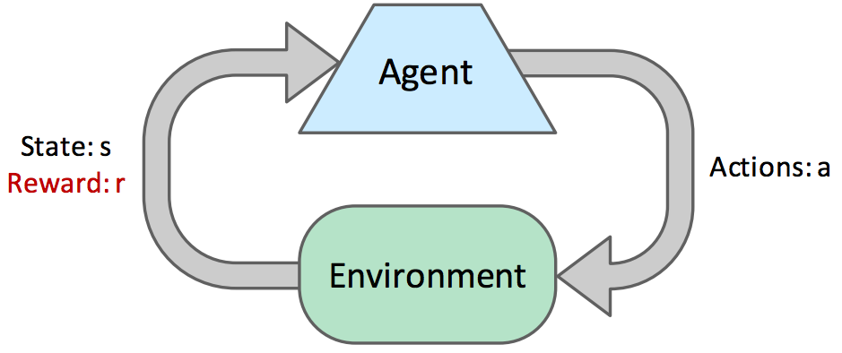
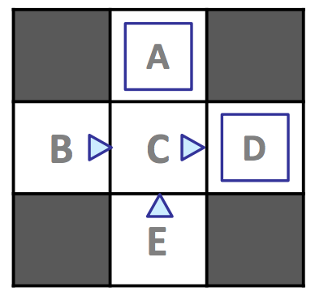
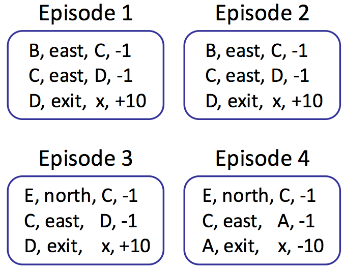
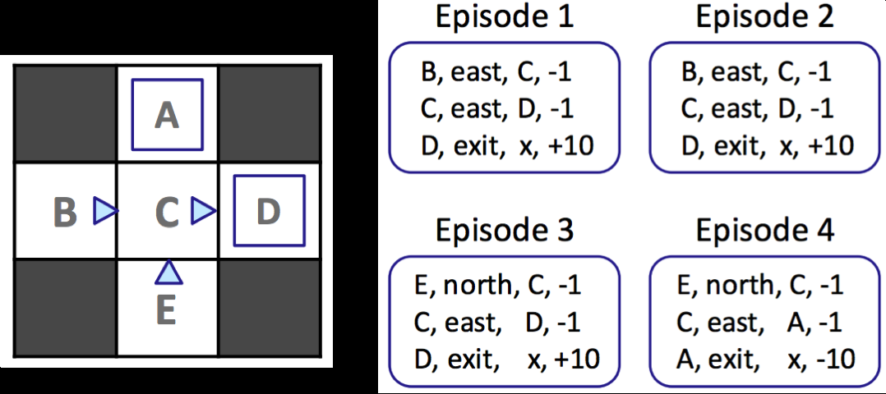
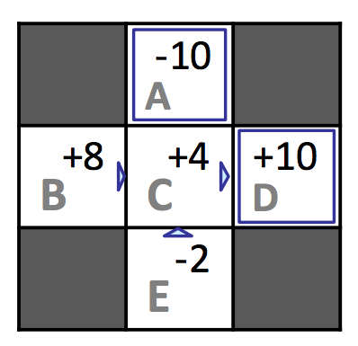

# 第五章 强化学习

作者：Nikhil Sharma

编辑：Wesley Zheng

部分内容改编自《人工智能：一种现代方法》（*Artificial Intelligence: A Modern Approach*）。

最后更新：2024 年 9 月

## 5.1 强化学习

上一章讨论了马尔可夫决策过程，以及如何通过价值迭代和策略迭代计算状态的最优价值、提取最优策略。求解 MDP 是离线规划（offline planning）的例子：智能体完整知道转移函数和奖励函数，因此无需实际采取行动，就能预先计算 MDP 所描述世界中的最优行动。

本章讨论在线规划（online planning）。在线规划中，智能体事先不知道世界中的奖励和转移规律，尽管世界仍然可以表示为一个 MDP。智能体必须进行探索：执行行动，并从环境得到反馈，包括到达的后继状态以及获得的奖励。智能体利用这些反馈，通过强化学习（reinforcement learning）估计最优策略，然后使用估计出的策略进行利用（exploitation），也就是最大化奖励。

*图 1：强化学习反馈回路。*

先介绍一些基本术语。在线规划的每个时间步中，智能体从状态 $s$ 开始，执行行动 $a$，到达后继状态 $s'$，并获得奖励 $r$。四元组 $(s,a,s',r)$ 称为一个样本（sample）。

智能体通常会连续执行行动、收集样本，直到到达终止状态。这样连续收集的一组样本称为一个 episode。探索阶段通常会经历许多 episode，以收集学习所需的足够数据。

强化学习有两种类型：基于模型的学习和无模型学习。

- **基于模型的学习（model-based learning）：** 使用探索中获得的样本估计转移函数和奖励函数，然后使用价值迭代或策略迭代正常求解 MDP。
- **无模型学习（model-free learning）：** 直接估计状态的价值或 Q 值，从不构造 MDP 的奖励和转移模型。

## 5.2 基于模型的学习

在基于模型的学习中，智能体通过统计：进入 Q 状态 $(s,a)$ 后到达每个状态 $s'$ 的次数，来生成转移函数的近似值 $\hat T(s,a,s')$。

当需要时，智能体通过归一化计数生成近似转移函数：把每个观测到的三元组 $(s,a,s')$ 的计数，除以智能体处于 Q 状态 $(s,a)$ 的所有情况的计数总和。归一化把计数缩放到总和为 1，因此可以将它们解释为概率。

考虑下面的 MDP。状态集合为

$$
S=\{A,B,C,D,E,x\}，
$$

其中 $x$ 是终止状态，折扣因子为 $\gamma=1$：

*图 1：MDP 示例。*

允许智能体按照上图给出的探索策略 $\pi_{explore}$ 探索 4 个 episode。方向三角形表示沿三角形指向的方向移动，蓝色方格表示选择 `exit` 作为行动。

四个 episode 一共得到 12 个样本，每个 episode 有 3 个样本。计数如下：

| $s$ | $a$ | $s'$ | 计数 |
| --- | --- | --- | ---: |
| $A$ | exit | $x$ | 1 |
| $B$ | east | $C$ | 2 |
| $C$ | east | $A$ | 1 |
| $C$ | east | $D$ | 3 |
| $D$ | exit | $x$ | 3 |
| $E$ | north | $C$ | 2 |

*图 2：示例 episode。*

回忆转移函数

$$
T(s,a,s')=P(s'\mid a,s)。
$$

可以用计数估计转移函数：把每个三元组 $(s,a,s')$ 的计数除以处于 Q 状态 $(s,a)$ 的总次数。同时，可以直接使用探索时获得的奖励估计奖励函数。

**转移函数 $\hat T(s,a,s')$：**

$$
\begin{aligned}
\hat T(A,exit,x)&=\frac{\#(A,exit,x)}{\#(A,exit)}=\frac11=1,\\
\hat T(B,east,C)&=\frac{\#(B,east,C)}{\#(B,east)}=\frac22=1,\\
\hat T(C,east,A)&=\frac{\#(C,east,A)}{\#(C,east)}=\frac14=0.25,\\
\hat T(C,east,D)&=\frac{\#(C,east,D)}{\#(C,east)}=\frac34=0.75,\\
\hat T(D,exit,x)&=\frac{\#(D,exit,x)}{\#(D,exit)}=\frac33=1,\\
\hat T(E,north,C)&=\frac{\#(E,north,C)}{\#(E,north)}=\frac22=1。
\end{aligned}
$$

**奖励函数 $\hat R(s,a,s')$：**

$$
\begin{aligned}
\hat R(A,exit,x)&=-10,\\
\hat R(B,east,C)&=-1,\\
\hat R(C,east,A)&=-1,\\
\hat R(C,east,D)&=-1,\\
\hat R(D,exit,x)&=+10,\\
\hat R(E,north,C)&=-1。
\end{aligned}
$$

根据大数定律，随着智能体经历更多 episode、收集更多样本，$\hat T$ 和 $\hat R$ 会逐渐改善：$\hat T$ 会收敛到 $T$，而 $\hat R$ 会随着发现新的 $(s,a,s')$ 三元组而获得此前未知的奖励信息。

在认为训练已经足够时，可以使用当前的 $\hat T$ 和 $\hat R$ 运行价值迭代或策略迭代，生成利用策略 $\pi_{exploit}$。之后让智能体在 MDP 中行动，追求奖励最大化，而不是继续追求学习。

后面会讨论如何有效分配探索与利用的时间。基于模型的学习简单直观，却非常有效：只需要计数和归一化，就能生成 $\hat T$ 和 $\hat R$。

它的缺点是需要维护每个见过的 $(s,a,s')$ 三元组的计数。因此，下一节会发展无模型方法，完全避免维护这些计数，也避免基于模型学习的内存开销。

## 5.3 无模型学习

无模型学习包含多种算法，本章介绍三种：直接评估、时序差分学习和 Q-Learning。

直接评估和时序差分学习属于被动强化学习（passive reinforcement learning）：智能体被给定一个要遵循的策略，在经历 episode 的过程中学习该策略下的状态价值。

Q-Learning 属于主动强化学习（active reinforcement learning）：学习中的智能体可以利用收到的反馈，在学习过程中不断更新自己的策略，经过足够探索后最终确定最优策略。

### 5.3.1 直接评估

第一种被动强化学习技术是直接评估（direct evaluation）。它和名字一样简单：固定一个策略 $\pi$，让智能体遵循 $\pi$ 经历多个 episode。

在这些 episode 中收集样本时，智能体记录从每个状态获得的总效用，以及访问每个状态的次数。任意时刻，状态 $s$ 的估计价值都可以通过“从 $s$ 获得的总效用”除以“访问 $s$ 的次数”计算。

再次使用前面的示例，并令 $\gamma=1$：

*图 1：直接评估示例。*

观察第一个 episode：从状态 $D$ 到终止总共获得 10；从状态 $C$ 出发获得 $(-1)+10=9$；从状态 $B$ 出发获得 $(-1)+(-1)+10=8$。

对所有 episode 完成同样计算，可以得到每个状态的总奖励、访问次数和估计价值：

| $s$ | 总奖励 | 访问次数 | $V^\pi(s)$ |
| --- | ---: | ---: | ---: |
| $A$ | $-10$ | 1 | $-10$ |
| $B$ | 16 | 2 | 8 |
| $C$ | 16 | 4 | 4 |
| $D$ | 30 | 3 | 10 |
| $E$ | $-4$ | 2 | $-2$ |

直接评估最终可以学到每个状态的价值，但收敛通常很慢，因为它浪费了状态之间转移的信息。

*图 2：带注释的示例。*

在这个例子中，直接评估得到 $V^\pi(E)=-2$、$V^\pi(B)=8$。但从反馈来看，B 和 E 都只有 C 作为后继状态，并且转移到 C 时都获得奖励 $-1$。根据 Bellman 方程，B 和 E 在策略 $\pi$ 下应该具有相同的价值。

然而，智能体 4 次到达 C，其中 3 次从 C 转移到 D 并获得奖励 10，1 次转移到 A 并获得奖励 $-10$。智能体恰好在从 E 开始的那次经历中收到 $-10$，而不是从 B 开始的经历中收到；这个偶然事件严重扭曲了 E 的估计价值。

经历足够多 episode 后，B 和 E 的估计值最终都会收敛到真实值，但这样的偶然情况会让过程比预期更慢。可以使用第二种被动强化学习算法——时序差分学习——缓解这个问题。

### 5.3.2 时序差分学习

时序差分学习（Temporal Difference Learning，TD Learning）的思想是从每一次经验中学习，而不是像直接评估那样只记录总奖励和访问次数，等到最后才学习。

在策略评估中，我们可以使用固定策略产生的方程组和 Bellman 方程，计算该策略下的状态价值：

$$
V^\pi(s)=\sum_{s'}T(s,\pi(s),s')\left[R(s,\pi(s),s')+\gamma V^\pi(s')\right]。
$$

每个方程都把某个状态的价值，等同于其后继状态折扣价值与转移奖励的加权平均。

TD 学习要解决的问题是：没有转移概率权重时，如何计算这个加权平均？它使用指数移动平均巧妙地完成了这一点。

首先初始化

$$
\forall s,\quad V^\pi(s)=0。
$$

每个时间步，智能体从状态 $s$ 执行 $\pi(s)$，转移到状态 $s'$，并获得奖励 $R(s,\pi(s),s')$。把收到的奖励与后继状态当前的折扣价值相加，就得到一个样本价值：

$$
\text{sample}=R(s,\pi(s),s')+\gamma V^\pi(s')。
$$

这个样本是 $V^\pi(s)$ 的新估计。然后用指数移动平均把它加入已有模型：

$$
V^\pi(s)\leftarrow(1-\alpha)V^\pi(s)+\alpha\cdot\text{sample}。
$$

其中 $\alpha$ 是学习率（learning rate），满足 $0\le\alpha\le1$。它决定已有模型的权重 $1-\alpha$，以及新样本估计的权重 $\alpha$。

通常先取 $\alpha=1$，把 $V^\pi(s)$ 设置为第一个样本的值；随着学习进行，逐渐把学习率减小到 0。此时后续样本的权重都趋近于 0，不再显著影响模型。

令 $V_k^\pi(s)$ 表示第 $k$ 次更新后状态 $s$ 的估计价值，令 $sample_k$ 表示第 $k$ 个样本，则更新为

$$
V_k^\pi(s)\leftarrow(1-\alpha)V_{k-1}^\pi(s)+\alpha\cdot sample_k。
$$

展开这个递归定义：

$$
V_k^\pi(s)\leftarrow
\alpha\left[(1-\alpha)^{k-1}sample_1+\cdots+(1-\alpha)sample_{k-1}+sample_k\right]。
$$

因为 $0\le1-\alpha\le1$，当指数越来越大时，$(1-\alpha)$ 的高次幂越来越接近 0。因此，越早的样本权重按指数越小。这正是我们需要的效果，因为旧样本使用的是旧的、通常更差的 $V^\pi(s)$ 模型。

时序差分学习用一个直接的更新规则同时实现了：

- 在每个时间步学习，利用刚刚获得的状态转移信息；样本使用不断更新的 $V^\pi(s')$，无需等到 episode 结束。
- 给旧的、可能不准确的样本分配指数递减的权重。
- 相比直接评估，用更少的 episode 更快收敛到真实状态价值。

### 5.3.3 Q-Learning

直接评估和 TD 学习最终都能学习到所遵循策略下的真实状态价值，但二者都有一个主要问题：我们的目标是找到最优策略，而这需要知道状态的 Q 值。

根据 Bellman 方程，从状态价值计算 Q 值需要转移函数和奖励函数：

$$
Q^*(s,a)=\sum_{s'}T(s,a,s')\left[R(s,a,s')+\gamma V^*(s')\right]。
$$

因此，TD 学习或直接评估通常需要与基于模型的学习结合，先估计 $T$ 和 $R$，再有效更新学习智能体所遵循的策略。

Q-Learning 提出了一个革命性的想法：直接学习状态的 Q 值，从而绕过对状态价值、转移函数和奖励函数的需求。因此，Q-Learning 完全无模型。

它使用下面的更新规则执行 Q 值迭代：

$$
Q_{k+1}(s,a)\leftarrow\sum_{s'}T(s,a,s')\left[R(s,a,s')+\gamma\max_{a'}Q_k(s',a')\right]。
$$

这个规则只是对价值迭代更新做了小修改：处于普通状态时，先选择行动再转移；处于 Q 状态时，先转移再选择新行动，所以最大值运算的位置发生了变化。

Q-Learning 与 TD 学习的推导方式基本相同。先获取 Q 值样本：

$$
\text{sample}=R(s,a,s')+\gamma\max_{a'}Q(s',a')，
$$

再将它加入指数移动平均：

$$
Q(s,a)\leftarrow(1-\alpha)Q(s,a)+\alpha\cdot\text{sample}。
$$

只要探索时间足够长，并且以合适的速度降低学习率 $\alpha$，Q-Learning 就能学到每个 Q 状态的最优 Q 值。

这正是 Q-Learning 的革命性之处：TD 学习和直接评估通过遵循某个策略来学习该策略下的状态价值，之后还要使用其他方法判断策略是否最优；Q-Learning 即使执行次优行动或随机行动，也能直接学习最优策略。

这称为离策略学习（off-policy learning）。直接评估和 TD 学习则是在线策略学习（on-policy learning）的例子。

### 5.3.4 近似 Q-Learning

Q-Learning 是非常强大的学习技术，至今仍处于强化学习发展的中心。但它还有改进空间。

普通 Q-Learning 以表格形式存储所有状态的 Q 值。对于大多数强化学习应用来说，这并不高效，因为状态数量可能达到数千甚至数百万。训练期间不可能访问所有状态，即使能够访问，也可能没有足够内存存储所有 Q 值。

如果 Pacman 通过普通 Q-Learning 学到上面图 1 的状态不利，它仍然不知道图 2、图 3 也不利。近似 Q-Learning 通过学习少数一般情形，并把知识外推到许多相似情形，来处理这个问题。

泛化学习经验的关键是基于特征的状态表示：把每个状态表示成一个称为特征向量的向量。例如，Pacman 的特征向量可以包含：

- 到最近幽灵的距离；
- 到最近食物的距离；
- 幽灵数量；
- Pacman 是否被困，用 0 或 1 表示。

使用特征向量，可以把状态和 Q 状态的价值表示为线性价值函数：

$$
V(s)=w_1f_1(s)+w_2f_2(s)+\cdots+w_nf_n(s)=\vec w\cdot\vec f(s)。
$$

Q 值也可以写成

$$
Q(s,a)=w_1f_1(s,a)+w_2f_2(s,a)+\cdots+w_nf_n(s,a)=\vec w\cdot\vec f(s,a)。
$$

其中

$$
\vec f(s)=\begin{bmatrix}f_1(s)&f_2(s)&\cdots&f_n(s)\end{bmatrix}^{T}
$$

和

$$
\vec f(s,a)=\begin{bmatrix}f_1(s,a)&f_2(s,a)&\cdots&f_n(s,a)\end{bmatrix}^{T}
$$

分别是状态 $s$ 和 Q 状态 $(s,a)$ 的特征向量，

$$
\vec w=\begin{bmatrix}w_1&w_2&\cdots&w_n\end{bmatrix}^{T}
$$

是权重向量。

定义差值

$$
\text{difference}=
\left[R(s,a,s')+\gamma\max_{a'}Q(s',a')\right]-Q(s,a)。
$$

近似 Q-Learning 与 Q-Learning 几乎相同，更新每个权重：

$$
w_i\leftarrow w_i+\alpha\cdot\text{difference}\cdot f_i(s,a)。
$$

它不必为每个状态存储 Q 值，只需要保存一个权重向量，并在需要时计算 Q 值。因此，近似 Q-Learning 既能更好地泛化，也显著节省内存。

最后，使用 `difference` 可以把精确 Q-Learning 的更新写成

$$
Q(s,a)\leftarrow Q(s,a)+\alpha\cdot\text{difference}。
$$

这个形式提供了另一种同样有价值的理解：算法计算样本估计与当前 $Q(s,a)$ 模型之间的差值，并沿着估计值的方向移动模型，移动幅度与差值大小成正比。

## 5.4 探索与利用

本章介绍了多种让智能体学习最优策略的方法，并强调必须进行“足够的探索”，但还没有解释“足够”具体意味着什么。下面讨论两种在探索和利用之间分配时间的方法：$\epsilon$-贪心策略和探索函数。

### 5.4.1 $\epsilon$-贪心策略

遵循 $\epsilon$-贪心策略的智能体选择一个概率 $0\le\epsilon\le1$，以概率 $\epsilon$ 随机行动并探索，以概率 $1-\epsilon$ 遵循当前已建立的策略并利用。

这种策略很容易实现，但仍然很难调节。如果 $\epsilon$ 很大，即使智能体已经学到最优策略，它仍然会大部分时间随机行动。反过来，如果 $\epsilon$ 很小，智能体探索很少，Q-Learning 或其他学习算法就会非常慢地学到最优策略。

因此，需要手动调节 $\epsilon$，并随时间逐渐降低它，才能获得好的结果。

### 5.4.2 探索函数

探索函数避免手动调节 $\epsilon$。它通过修改 Q 值迭代更新，让较少访问的状态更受偏好。修改后的更新为

$$
Q(s,a)\leftarrow(1-\alpha)Q(s,a)+\alpha\left[R(s,a,s')+\gamma\max_{a'}f(s',a')\right]，
$$

其中 $f$ 是探索函数。

探索函数有多种设计方式，一个常见选择是

$$
f(s,a)=Q(s,a)+\frac{k}{N(s,a)}，
$$

其中 $k$ 是预先指定的值，$N(s,a)$ 表示 Q 状态 $(s,a)$ 被访问的次数。

智能体处于状态 $s$ 时，总是选择具有最高 $f(s,a)$ 的行动，因此不必在探索和利用之间进行概率决策。探索被编码进探索函数：对于访问次数很少的行动，$k/N(s,a)$ 可以提供足够大的奖励，使它超过 Q 值更高的其他行动。

随着时间推移，状态被访问得越来越频繁，这个额外奖励会逐渐趋近于 0，$f(s,a)$ 也会逐渐回到 $Q(s,a)$，利用行为变得越来越占主导。

## 5.5 本章小结

强化学习背后有一个 MDP，强化学习的目标是求解这个 MDP，推导出最优策略。

强化学习与价值迭代、策略迭代的区别，在于强化学习不知道底层 MDP 的转移函数 $T$ 和奖励函数 $R$。因此，智能体必须通过在线试错学习最优策略，而不是完全依靠离线计算。

主要方法如下：

- **基于模型的学习：** 估计转移函数 $T$ 和奖励函数 $R$ 的值，再使用价值迭代或策略迭代等 MDP 求解方法。
- **无模型学习：** 不估计 $T$ 和 $R$，而使用其他方法直接估计状态价值或 Q 值。
  - **直接评估：** 遵循策略 $\pi$，记录从每个状态获得的总奖励，以及访问每个状态的总次数。样本足够多时，它会收敛到策略 $\pi$ 下的真实状态价值，但速度慢，并且浪费了状态转移信息。
  - **时序差分学习：** 遵循策略 $\pi$，使用样本价值的指数移动平均，直到收敛到策略 $\pi$ 下的真实状态价值。TD 学习和直接评估都属于在线策略学习：先学习某个策略的价值，再判断该策略是否次优、是否需要更新。
  - **Q-Learning：** 通过 Q 值迭代更新和试错直接学习最优策略。这是离策略学习的例子：即使采取次优行动，也能学习最优策略。
  - **近似 Q-Learning：** 做与 Q-Learning 相同的事情，但使用基于特征的状态表示来泛化学习经验。

最后，用遗憾（regret）衡量不同强化学习算法的表现。遗憾表示：从一开始就采取最优行动时能够积累的总奖励，与实际运行学习算法所积累的总奖励之间的差异。
