# 第六章 贝叶斯网络

作者：Josh Hug、Jacky Liang

编辑：Regina Wang、Pranav Muralikrishnan、Wesley Zheng

部分内容改编自《人工智能：一种现代方法》（*Artificial Intelligence: A Modern Approach*）。

最后更新：2024 年 11 月

## 6.1 概率回顾

本章假设读者已经在 CS70 中学习过概率基础，因此默认读者理解概率密度函数、条件概率、独立性和条件独立性等概念。这里简要回顾后面会使用的概率规则。

随机变量表示结果未知的事件。概率分布为各种结果分配权重，并且必须满足：

$$
0\le P(\omega)\le1，
$$

$$
\sum_{\omega}P(\omega)=1。
$$

例如，若 $A$ 是二元变量，只能取两个值，则对于某个 $p\in[0,1]$，有

$$
P(A=0)=p，\qquad P(A=1)=1-p。
$$

本章约定：大写字母表示随机变量，小写字母表示该随机变量的某个具体结果。

用 $P(A,B,C)$ 表示变量 $A,B,C$ 的联合分布。联合分布中变量的顺序不重要：

$$
P(A,B,C)=P(C,B,A)。
$$

可以使用链式法则（也称乘法法则）展开联合分布：

$$
P(A,B)=P(A\mid B)P(B)=P(B\mid A)P(A)，
$$

$$
P(A_1,A_2,\ldots,A_k)=P(A_1)P(A_2\mid A_1)\cdots P(A_k\mid A_1,\ldots,A_{k-1})。
$$

变量 $A,B$ 的边缘分布可以通过对变量 $C$ 的所有可能值求和得到：

$$
P(A,B)=\sum_cP(A,B,C=c)。
$$

变量 $A$ 的边缘分布也可以写成

$$
P(A)=\sum_b\sum_cP(A,B=b,C=c)。
$$

把这种边缘化过程称为“消去求和”（summing out）。

对概率分布进行运算时，结果有时不一定总和为 1。此时需要归一化：把分布中所有项相加，再用这个总和除以每一项。

条件概率为已知某些事实时的事件分配概率。例如，$P(A\mid B=b)$ 表示已知 $B$ 的值等于 $b$ 时，$A$ 的概率分布。条件概率定义为

$$
P(A\mid B)=\frac{P(A,B)}{P(B)}。
$$

把条件概率定义与链式法则结合，就得到贝叶斯规则：

$$
P(A\mid B)=\frac{P(B\mid A)P(A)}{P(B)}。
$$

随机变量 $A$、$B$ 相互独立时，记作

$$
A\perp\!\!\perp B。
$$

这等价于

$$
B\perp\!\!\perp A。
$$

当 $A$ 和 $B$ 相互独立时，

$$
P(A,B)=P(A)P(B)。
$$

两个独立的抛硬币结果就是一个例子。由上式和链式法则，还能得到

$$
P(A\mid B)=P(A)，\qquad P(B\mid A)=P(B)。
$$

给定另一个随机变量 $C$ 时，随机变量 $A$、$B$ 条件独立，记作

$$
A\perp\!\!\perp B\mid C。
$$

这同样等价于 $B\perp\!\!\perp A\mid C$。

如果给定 $C$ 时 $A$ 和 $B$ 条件独立，那么

$$
P(A,B\mid C)=P(A\mid C)P(B\mid C)。
$$

这意味着，一旦知道 $C$ 的值，$B$ 和 $A$ 就不会互相影响。等价地，也可以写成

$$
P(A\mid B,C)=P(A\mid C)，
$$

$$
P(B\mid A,C)=P(B\mid C)。
$$

可以看到，这三条公式与相互独立的三条公式完全对应，只是多了对 $C$ 的条件。

## 6.2 概率推断

人工智能经常需要建模各种非确定性事件之间的关系。例如：天气预报说下雨概率为 40%，我是否应该带伞？冰激凌买得越多，全部掉在地上的概率越高，我应该买几勺？如果去 Oracle Arena 看勇士队比赛的路上发生了交通事故，我应该现在出发，还是 30 分钟后出发？这些问题都可以用概率推断回答。

前面几章把世界建模为一个总是已知的具体状态。接下来几周会使用一种新模型：世界的每个可能状态都有自己的概率。

例如，可以建立天气模型，状态由季节、温度和天气组成。模型可能给出

$$
P(\text{winter},35^\circ,\text{cloudy})=0.023。
$$

这个数字表示“冬天、35 度、阴天”这一具体结果的概率。

更准确地说，这个模型是一个联合分布，也就是捕获每个可能结果（又称变量赋值）可能性的概率表：

| 季节 | 温度 | 天气 | 概率 |
| --- | --- | --- | ---: |
| summer | hot | sun | 0.30 |
| summer | hot | rain | 0.05 |
| summer | cold | sun | 0.10 |
| summer | cold | rain | 0.05 |
| winter | hot | sun | 0.10 |
| winter | hot | rain | 0.05 |
| winter | cold | sun | 0.15 |
| winter | cold | rain | 0.20 |

这个模型可以回答很多问题：

1. 晴天的概率是多少？$P(W=\text{sun})$。
2. 已知是冬天时，天气的概率分布是什么？$P(W\mid S=\text{winter})$。
3. 已知下雨且寒冷时，是冬天的概率是多少？$P(S=\text{winter}\mid T=\text{cold},W=\text{rain})$。
4. 已知寒冷时，天气和季节的联合概率分布是什么？$P(S,W\mid T=\text{cold})$。

### 枚举推断

给定联合概率分布，可以用一种简单直观的过程——枚举推断（inference by enumeration）——计算任意所需的概率分布

$$
P(Q_1,\ldots,Q_m\mid e_1,\ldots,e_n)。
$$

需要区分三类变量：

1. **查询变量 $Q_i$：** 未知变量，出现在目标条件概率分布竖线 $\mid$ 的左侧。
2. **证据变量 $e_i$：** 已观察、值已知的变量，出现在竖线右侧。
3. **隐藏变量：** 存在于整体联合分布中，但不出现在目标分布中的变量。

枚举推断的算法是：

1. 收集与已观察证据变量一致的所有行。
2. 对所有隐藏变量求和，也就是把它们边缘化。
3. 归一化得到的表，使它成为一个概率分布（各项总和为 1）。

例如，要计算 $P(W\mid S=\text{winter})$，先选择 $S=\text{winter}$ 的四行，然后对温度 $T$ 求和并归一化：

| $W$ | $S$ | 未归一化总和 | 概率 |
| --- | --- | ---: | ---: |
| sun | winter | $0.10+0.15=0.25$ | $0.25/(0.25+0.25)=0.5$ |
| rain | winter | $0.05+0.20=0.25$ | $0.25/(0.25+0.25)=0.5$ |

因此

$$
P(W=\text{sun}\mid S=\text{winter})=0.5，
$$

$$
P(W=\text{rain}\mid S=\text{winter})=0.5。
$$

也就是说，冬天晴天和下雨的概率各为 50%。只要有完整的联合概率分布表，枚举推断就能计算任意概率分布，即使有多个查询变量 $Q_1,\ldots,Q_m$。

## 6.3 贝叶斯网络表示

虽然枚举推断可以计算任意查询的概率，但在真实问题中，把完整联合分布存进计算机并不现实。若要表示的 $n$ 个变量每个都有 $d$ 个可能值，那么联合分布表会有

$$
d^n
$$

个条目，随变量数量指数增长，几乎无法存储。

贝叶斯网络（Bayesian network，Bayes net）利用条件概率来避免这个问题。它不把信息存储在一张巨大表中，而是把概率分散到多个较小的条件概率表中，并用有向无环图（DAG）表示变量之间的关系。

局部概率表与 DAG 合在一起，包含了足够的信息，可以计算完整联合分布能够计算的任何概率分布。

贝叶斯网络由以下部分组成：

1. 一个有向无环图，每个变量对应一个节点 $X$。
2. 每个节点的条件分布 $P(X\mid A_1,\ldots,A_n)$，其中 $A_i$ 是 $X$ 的第 $i$ 个父节点。这个分布存储为条件概率表（CPT）。每个 CPT 有 $n+2$ 列：每个父变量的取值一列、$X$ 的取值一列，以及给定父节点时 $X$ 的条件概率一列。

贝叶斯网络图的结构编码了节点之间的条件独立关系。这些条件独立性使我们可以存储许多小表，而不是一张大表。

需要注意，贝叶斯网络节点之间的边并不表示节点之间一定存在因果关系，也不表示变量一定相关；它只表示节点之间可能存在某种关系。

考虑一个有五个二元随机变量的模型：

- $B$：发生入室盗窃（Burglary）。
- $A$：警报响起（Alarm）。
- $E$：发生地震（Earthquake）。
- $J$：John 打电话（John calls）。
- $M$：Mary 打电话（Mary calls）。

假设入室盗窃或地震都可能触发警报；John 和 Mary 听到警报后会打电话。可以用下面的图表示这些依赖关系。


*图 1：基本贝叶斯网络示例。*

在这个贝叶斯网络中，需要存储以下概率表：

$$
P(B)，\quad P(E)，\quad P(A\mid B,E)，\quad P(J\mid A)，\quad P(M\mid A)。
$$

给定图中所有 CPT，可以用以下规则计算一次具体赋值的概率：

$$
P(X_1,X_2,\ldots,X_n)=\prod_{i=1}^{n}P(X_i\mid parents(X_i))。
$$

对于警报模型，例如

$$
P(\neg b,\neg e,+a,+j,\neg m)
=P(\neg b)P(\neg e)P(+a\mid\neg b,\neg e)P(+j\mid+a)P(\neg m\mid+a)。
$$

下一节会证明这个关系为什么成立。

贝叶斯网络只是模型的一种。模型试图捕捉世界的运行方式，但因为模型总是简化，所以总会有不准确之处。好的建模选择仍然可以产生足够好的近似，使模型能够用于解决真实世界的问题。

一般来说，好的模型可能不包含每个变量，也不包含变量之间的每个交互。但通过在图结构中做出建模假设，可以得到非常高效的推断技术，实践价值往往高于直接使用枚举推断。

## 6.4 贝叶斯网络的结构

本课程中，下面两条关于贝叶斯网络独立性的规则可以直接从图结构推断出来：

- 给定一个节点的全部父节点后，该节点与图中的所有祖先节点（非后代节点）条件独立。

  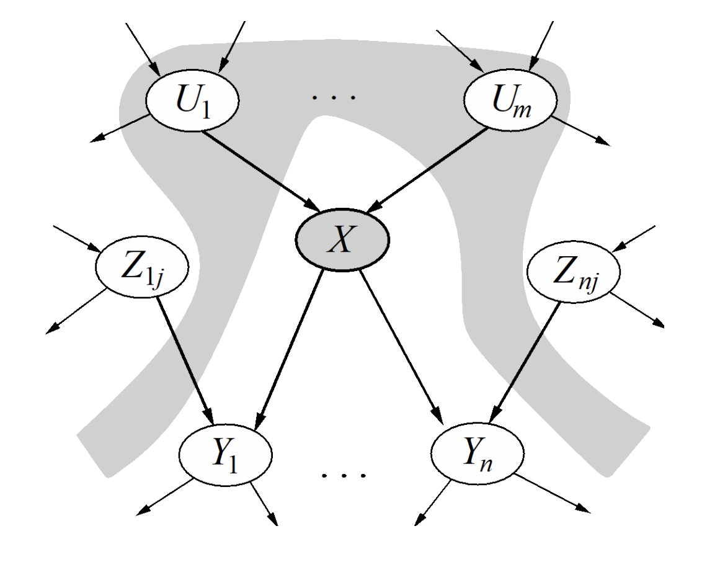

  *图 1：父节点关系。*

- 给定一个变量的马尔可夫毯（Markov blanket）后，该变量与其他所有变量条件独立。变量的马尔可夫毯由它的父节点、子节点，以及子节点的其他父节点组成。

  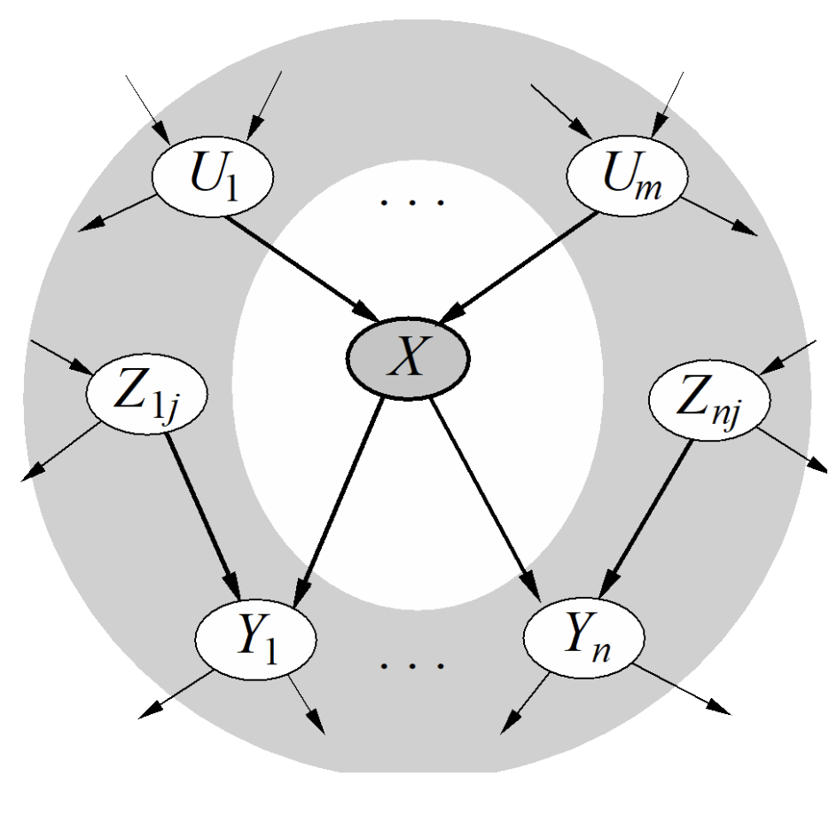

  *图 2：马尔可夫毯。*

利用这些工具，回到上一节的断言：把贝叶斯网络的 CPT 相乘，就能得到所有变量的联合分布：

$$
P(X_1,X_2,\ldots,X_n)=\prod_{i=1}^{n}P(X_i\mid parents(X_i))。
$$

这个关系成立，是因为图结构给出了条件独立关系。下面用警报示例证明。

我们有 CPT

$$
P(B),P(E),P(A\mid B,E),P(J\mid A),P(M\mid A)，
$$

以及下图中的网络：

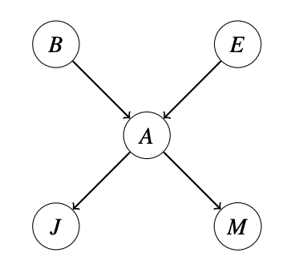

*图 3：基本贝叶斯网络示例。*

要证明的关系是

$$
P(B,E,A,J,M)=P(B)P(E)P(A\mid B,E)P(J\mid A)P(M\mid A)。
$$

也可以使用链式法则展开联合分布。按照拓扑顺序（父节点在子节点之前）展开，得到

$$
P(B,E,A,J,M)=P(B)P(E\mid B)P(A\mid B,E)P(J\mid B,E,A)P(M\mid B,E,A,J)。
$$

第一条式子中，每个变量都出现在形式为 $P(\text{变量}\mid parents(\text{变量}))$ 的 CPT 中；第二条式子中，每个变量都出现在形式为 $P(\text{变量}\mid parents(\text{变量}),ancestors(\text{变量}))$ 的 CPT 中。

使用上一节的第一条条件独立规则：给定所有父节点后，每个节点与它的祖先节点条件独立。因此

$$
P(\text{变量}\mid parents(\text{变量}),ancestors(\text{变量}))
=P(\text{变量}\mid parents(\text{变量}) )。
$$

于是两条展开式相等。贝叶斯网络的条件独立性，让多个更小的条件概率表能够表示完整联合分布。

这里采用“给定父节点后与祖先独立”的假设，是因为我们总是希望使用最少的假设，再证明需要的结论。其他地方也可能把它表述为“给定父节点后，一个节点与它的非后代节点条件独立”。

## 6.5 D-分离

一个很有用的问题是：一个随机变量是否独立于另一个随机变量？或者，给定第三个随机变量后，它们是否条件独立？贝叶斯网络对联合分布的表示方式，让我们可以通过检查图的拓扑结构快速回答这类问题。

前面已经提到，给定节点的全部父节点后，该节点与所有祖先节点条件独立。下面介绍三种由三个节点、两条边构成的规范贝叶斯网络，也称三元组（triple），以及它们表达的条件独立关系。

### 6.5.1 因果链

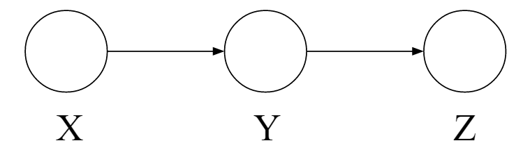

*图 1：没有观测的因果链。*

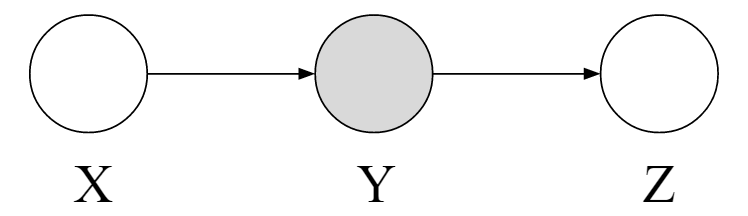

*图 2：观测 Y 的因果链。*

图 1 是三个节点组成的因果链。它表示 $X,Y,Z$ 的联合分布为

$$
P(x,y,z)=P(z\mid y)P(y\mid x)P(x)。
$$

需要注意，$X$ 和 $Z$ 不一定独立。反例是：

$$
P(y\mid x)=
\begin{cases}
1,&x=y,\\
0,&\text{其他情况，}
\end{cases}
$$

$$
P(z\mid y)=
\begin{cases}
1,&z=y,\\
0,&\text{其他情况。}
\end{cases}
$$

此时，若 $x=z$，则 $P(z\mid x)=1$；否则为 0。因此 $X$ 与 $Z$ 不独立。

但可以断言

$$
X\perp\!\!\perp Z\mid Y。
$$

也就是

$$
P(X\mid Z,Y)=P(X\mid Y)。
$$

证明如下：

$$
\begin{aligned}
P(X\mid Z,y)
&=\frac{P(X,Z,y)}{P(Z,y)}\\
&=\frac{P(Z\mid y)P(y\mid X)P(X)}{P(Z\mid y)P(y)}\\
&=\frac{P(y\mid X)P(X)}{P(y)}\\
&=P(X\mid y)。
\end{aligned}
$$

当 $X$ 有多个父节点时，可以使用类似证明。总结来说，在因果链结构中，$X\perp\!\!\perp Z\mid Y$。

### 6.5.2 共同原因

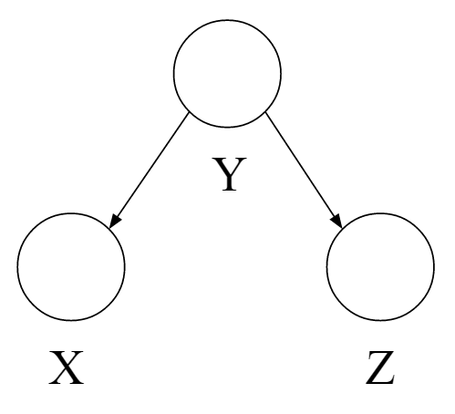

*图 1：没有观测的共同原因。*

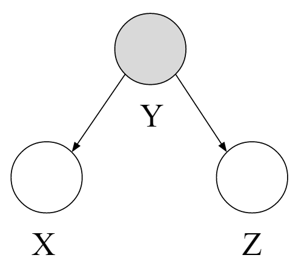

*图 2：共同原因示例。*

共同原因是三元组的另一种配置，表示

$$
P(x,y,z)=P(x\mid y)P(z\mid y)P(y)。
$$

与因果链一样，$X$ 与 $Z$ 不一定独立。仍然考虑下面的反例：

$$
P(x\mid y)=
\begin{cases}
1,&x=y,\\
0,&\text{其他情况，}
\end{cases}
\qquad
P(z\mid y)=
\begin{cases}
1,&z=y,\\
0,&\text{其他情况。}
\end{cases}
$$

此时，若 $x=z$，则 $P(x\mid z)=1$；否则为 0，所以 $X$ 与 $Z$ 不独立。

但如果观测到 $Y$，则 $X$ 和 $Z$ 独立：

$$
X\perp\!\!\perp Z\mid Y。
$$

证明为

$$
\begin{aligned}
P(X\mid Z,y)
&=\frac{P(X,Z,y)}{P(Z,y)}\\
&=\frac{P(X\mid y)P(Z\mid y)P(y)}{P(Z\mid y)P(y)}\\
&=P(X\mid y)。
\end{aligned}
$$

### 6.5.3 共同结果

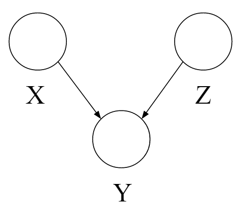

*图 3：没有观测的共同结果。*

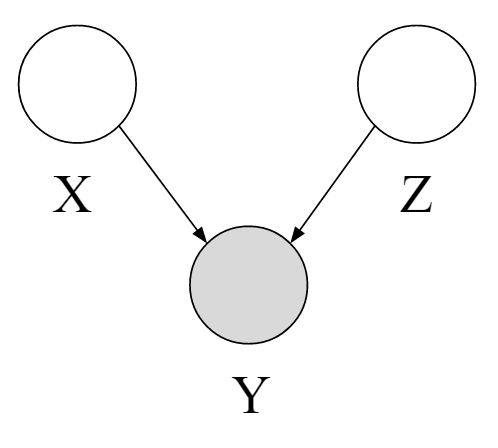

*图 4：共同结果示例。*

共同结果结构表示

$$
P(x,y,z)=P(y\mid x,z)P(x)P(z)。
$$

图 3 中的 $X$ 与 $Z$ 独立：

$$
X\perp\!\!\perp Z。
$$

但给定 $Y$ 后，二者不一定独立，如图 4 所示。假设三个变量都是二元变量，$X$ 和 $Z$ 以相同概率取真或假：

$$
P(X=\text{true})=P(X=\text{false})=0.5，
$$

$$
P(Z=\text{true})=P(Z=\text{false})=0.5。
$$

令 $Y$ 表示 $X$ 与 $Z$ 是否取相同值：

$$
P(Y\mid X,Z)=
\begin{cases}
1,&X=Z\text{ 且 }Y=\text{true},\\
1,&X\ne Z\text{ 且 }Y=\text{false},\\
0,&\text{其他情况。}
\end{cases}
$$

当不观测 $Y$ 时，$X$ 和 $Z$ 独立。但观测到 $Y$ 后，知道 $X$ 就会知道 $Z$ 的值，反之亦然。因此，给定 $Y$ 时 $X$ 和 $Z$ 不条件独立。

共同结果与因果链、共同原因相反：不对 $Y$ 进行条件化时，$X$ 和 $Z$ 保证独立；条件化 $Y$ 后，二者可能依赖，具体取决于 $P(Y\mid X,Z)$ 的概率值。

如果观测到 $Y$ 的后代节点，也有相同逻辑。如下图所示，一旦观测 $Y$ 的某个后代，$X$ 与 $Z$ 就不再保证独立。

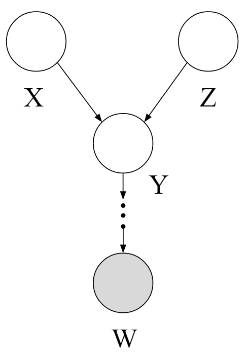

*图 5：观测共同结果的子节点。*

### 6.5.4 一般情形与 D-分离

前面的三个规范结构可以作为积木，帮助我们回答包含超过三个节点、两条边的任意贝叶斯网络中的条件独立问题。

给定贝叶斯网络 $G$、两个节点 $X,Y$，以及表示已观测变量的集合 $\{Z_1,\ldots,Z_k\}$，问题是判断以下命题是否成立：

$$
X\perp\!\!\perp Y\mid\{Z_1,\ldots,Z_k\}？
$$

D-分离（d-separation，directed separation）是贝叶斯网络图结构的一个性质，它蕴含上述条件独立关系，并推广了前面讨论的三种情形。

如果变量集合 $Z_1,\ldots,Z_k$ d-分离 $X$ 和 $Y$，那么对于贝叶斯网络能够编码的所有可能分布，都有

$$
X\perp\!\!\perp Y\mid\{Z_1,\ldots,Z_k\}。
$$

可以从节点 $X$ 到节点 $Y$ 的可达性出发构造算法。先给出一个不完全正确的版本，稍后修正：

1. 在图中把所有观测节点 $\{Z_1,\ldots,Z_k\}$ 涂成阴影。
2. 如果存在一条从 $X$ 到 $Y$ 的无向路径，没有被阴影节点阻断，则称 $X$ 和 $Y$“连通”。
3. 如果 $X$ 和 $Y$ 连通，则它们在给定 $\{Z_1,\ldots,Z_k\}$ 时不条件独立；否则条件独立。

这个算法只有在网络中没有共同结果结构时才有效。共同结果会造成一个问题：当共同结果中的中间节点被观测、被激活时，两个节点可能变得“可达”。

修正后的 D-分离算法如下：

1. 在图中把所有观测节点 $\{Z_1,\ldots,Z_k\}$ 涂成阴影。
2. 枚举从 $X$ 到 $Y$ 的所有无向路径。
3. 对每条路径：
   1. 把路径分解成三元组，也就是连续的三个节点和两条边。
   2. 如果所有三元组都是激活的，则该路径是激活的，并且 d-连接 $X$ 和 $Y$。
4. 如果没有任何路径 d-连接 $X$ 和 $Y$，则

   $$
   X\perp\!\!\perp Y\mid\{Z_1,\ldots,Z_k\}。
   $$

图中从 $X$ 到 $Y$ 的任意路径，都可以分解为若干个连续的三节点、两条边的片段，每个片段称为一个三元组。三元组是否激活，取决于中间节点是否被观测。

如果路径中的所有三元组都激活，那么路径激活并 d-连接 $X$ 与 $Y$，说明给定观测节点后，$X$ 与 $Y$ 不保证条件独立。如果从 $X$ 到 $Y$ 的所有路径都未激活，则 $X$ 与 $Y$ 在给定观测节点时条件独立。

下面用三个规范图枚举激活和未激活三元组的全部情况：

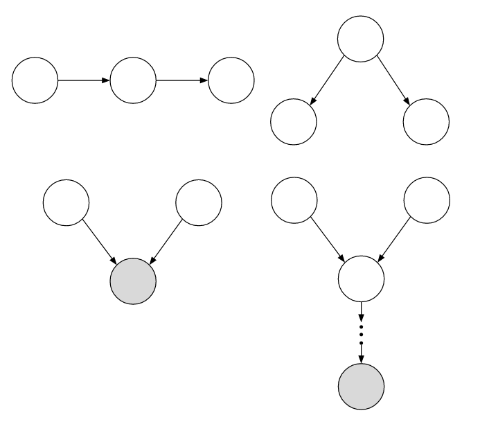

*图 6：激活三元组。*

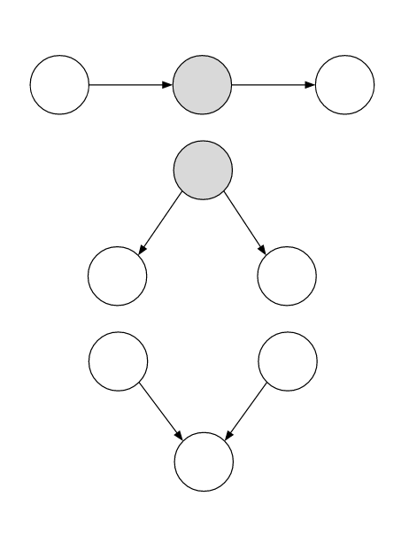

*图 7：未激活三元组。*

### 6.5.5 示例

下面是应用 D-分离算法的几个例子：

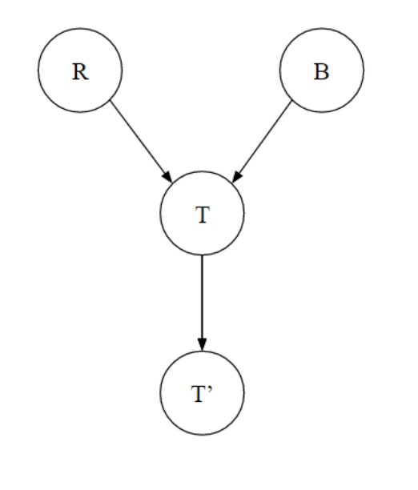

*图 8：示例一。*

第一个图包含共同结果和因果链规范图。其结论为：

$$
R\perp\!\!\perp B\quad\text{保证}，
$$

$$
R\perp\!\!\perp B\mid T\quad\text{不保证}，
$$

$$
R\perp\!\!\perp B\mid T'\quad\text{不保证}，
$$

$$
R\perp\!\!\perp T'\mid T\quad\text{保证}。
$$

第二个图包含三种规范图的组合。可以尝试列出其中的全部结构；结论包括：

$$
L\perp\!\!\perp T'\mid T\quad\text{保证}，
$$

$$
L\perp\!\!\perp B\quad\text{保证}，
$$

$$
L\perp\!\!\perp B\mid T\quad\text{不保证}，
$$

$$
L\perp\!\!\perp B\mid T'\quad\text{不保证}，
$$

$$
L\perp\!\!\perp B\mid T,R\quad\text{保证}。
$$

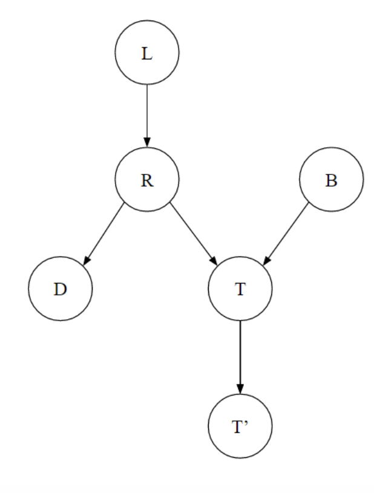

*图 9：示例二。*

第三个图也包含三种规范图的组合：

$$
T\perp\!\!\perp D\quad\text{不保证}，
$$

$$
T\perp\!\!\perp D\mid R\quad\text{保证}，
$$

$$
T\perp\!\!\perp D\mid R,S\quad\text{不保证}。
$$

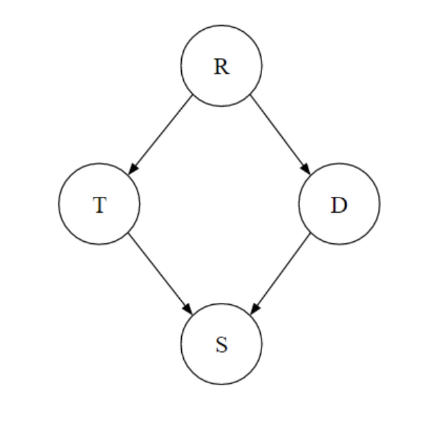

*图 10：示例三。*

## 6.6 贝叶斯网络中的精确推断

推断问题是求某个概率分布

$$
P(Q_1,\ldots,Q_k\mid e_1,\ldots,e_k)
$$

的值，正如本章开头的概率推断一节所述。

给定贝叶斯网络，可以先构造联合概率分布，再使用枚举推断直接解决这个问题。但这需要建立并遍历一张指数大小的表。

### 6.6.1 变量消除

另一种方法是逐个消除隐藏变量。要消除变量 $X$：

1. 连接，也就是相乘所有涉及 $X$ 的因子。
2. 对 $X$ 求和消除它。

因子（factor）就是一个未归一化的概率。在变量消除的每一步中，每个因子都与它对应的概率成正比，但因子本身的所有项不一定总和为 1，因此不一定是合法的概率分布。

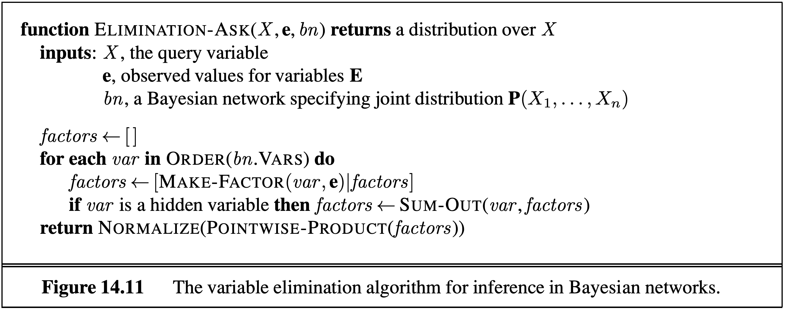

*图 1：变量消除。*

用一个例子具体说明。假设有如下模型，$T,C,S,E$ 都是二元变量：

- $T$ 表示冒险者是否拿取宝藏；
- $C$ 表示在拿取宝藏的前提下，笼子是否落下；
- $S$ 表示在拿取宝藏的前提下，是否释放蛇；
- $E$ 表示在知道笼子和蛇的状态后，冒险者是否逃脱。

对应的因子为

$$
P(T)，\quad P(C\mid T)，\quad P(S\mid T)，\quad P(E\mid C,S)。
$$

假设要计算 $P(T\mid+e)$。

枚举推断会构造有 16 行的联合概率表 $P(T,C,S,E)$，只选择与 $+e$ 对应的行，再对 $C$ 和 $S$ 求和，最后归一化：

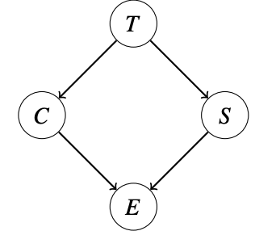

*图 2：变量消除示例。*

变量消除则逐个消除 $C$、$S$：

1. 连接涉及 $C$ 的所有因子，形成

   $$
   f_1(C,+e,T,S)=P(C\mid T)\cdot P(+e\mid C,S)。
   $$

   有时也写作 $P(C,+e\mid T,S)$。
2. 对 $C$ 求和，得到

   $$
   f_2(+e,T,S)，
   $$

   有时写作 $P(+e\mid T,S)$。
3. 连接涉及 $S$ 的所有因子，形成

   $$
   f_3(+e,S,T)=P(S\mid T)\cdot f_2(+e,T,S)，
   $$

   有时写作 $P(+e,S\mid T)$。
4. 对 $S$ 求和，得到

   $$
   f_4(+e,T)，
   $$

   有时写作 $P(+e\mid T)$。
5. 连接剩余因子，得到

   $$
   f_5(+e,T)=f_4(+e,T)\cdot P(T)。
   $$

有了 $f_5(+e,T)$ 后，只需归一化，就能得到 $P(T\mid+e)$。

写连接后的因子时，可以使用 $f_1(C,+e,T,S)$ 这样的因子记号：它忽略条件竖线，只列出因子包含的变量。也可以写成 $P(C,+e\mid T,S)$，即使它未必是合法概率分布，例如所有行的和可能不为 1。

这个写法可以机械地得到：原始因子中条件竖线左边的变量（本例中是 $P(C\mid T)$ 里的 $C$ 和 $P(E\mid C,S)$ 里的 $E$）仍然留在竖线左侧；其余变量 $T,S$ 放到竖线右侧。

这种因子写法来自链式法则的重复应用。不能让一个变量同时出现在条件竖线的两侧，并且

$$
P(T,C,S,+e)=P(T)P(S\mid T)P(C\mid T)P(+e\mid C,S)=P(S,T)P(C\mid T)P(+e\mid C,S)。
$$

因此

$$
P(C\mid T)P(+e\mid C,S)=\frac{P(T,C,S,+e)}{P(S,T)}=P(C,+e\mid T,S)。
$$

虽然变量消除在概念上更复杂，但它生成的最大因子只有 8 行；如果先构造完整联合概率表，则最大表有 16 行。

也可以把 $P(T\mid+e)$ 的计算写成两种等价形式。枚举推断为

$$
\alpha\sum_s\sum_cP(T)P(s\mid T)P(c\mid T)P(+e\mid c,s)，
$$

变量消除为

$$
\alpha P(T)\sum_sP(s\mid T)\sum_cP(c\mid T)P(+e\mid c,s)。
$$

二者等价；变量消除只是把与某次求和无关的项移到了求和外面。

最后要注意，只有在能把最大因子的大小限制在合理范围内时，变量消除才比枚举推断更好。

## 6.7 贝叶斯网络中的近似推断：采样

另一种概率推理方法，是通过简单统计样本来隐式计算查询概率。这不会像枚举推断或变量消除那样给出精确解，但通常已经足够好，尤其考虑到它能大幅节省计算量。

例如，要计算 $P(+t\mid+e)$。如果有一台神奇机器可以从分布中生成样本，就可以收集所有 $E=+e$ 的样本，再计算其中 $T=+t$ 的比例。只要查看样本，就能计算想要的推断结果。

### 6.7.1 先验采样

给定贝叶斯网络模型，可以很容易地写出一个模拟器。考虑只有两个变量 $T,C$ 的简化模型，其 CPT 如下。一个简单的 Python 模拟器是：

```python
import random

def get_t():
    if random.random() < 0.99:
        return True
    return False

def get_c(t):
    if t and random.random() < 0.95:
        return True
    return False

def get_sample():
    t = get_t()
    c = get_c(t)
    return [t, c]
```

这种简单方法称为先验采样（prior sampling）。它的缺点是：分析低概率情形时，可能需要生成大量样本。

例如，要计算 $P(C\mid\neg t)$，必须丢弃 99% 的样本。

### 6.7.2 拒绝采样

一种缓解方法是修改过程，尽早拒绝与证据不一致的样本。对于查询 $P(C\mid\neg t)$，如果 $t$ 为假，就避免生成 $C$ 的值。

这样仍然会丢弃大多数样本，但至少生成坏样本所花的时间更少。这种方法称为拒绝采样（rejection sampling）。

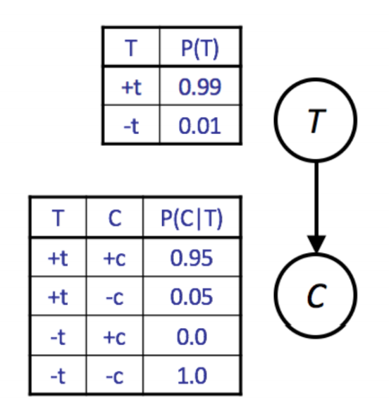

*图 1：T-C 模型。*

先验采样和拒绝采样之所以有效，是因为每个合法样本出现的概率都等于联合概率分布中规定的概率。

### 6.7.3 似然加权

似然加权（likelihood weighting）保证不生成坏样本。它会手动把所有变量设置为查询中的证据值。

例如，要计算 $P(C\mid\neg t)$，直接声明 $t$ 为假。但强制变量等于证据可能导致样本与正确分布不一致。

如果强制某些变量等于证据，那么样本出现的概率只等于非证据变量对应 CPT 的乘积。联合概率分布不再保证正确，尽管在前面的二变量贝叶斯网络中可能恰好正确。

设已经采样变量为 $Z_1,\ldots,Z_p$，固定证据变量为 $E_1,\ldots,E_m$。样本的概率是

$$
P(Z_1,\ldots,Z_p,E_1,\ldots,E_m)=\prod_{i=1}^{p}P(Z_i\mid Parents(Z_i))。
$$

这里缺少证据变量 $P(E_i\mid Parents(E_i))$ 的概率，并非每个 CPT 都参与了计算。

似然加权为每个样本使用一个权重，权重等于在已采样变量给定时，证据变量取观测值的可能性。因此，不再把所有样本等权计算，而是给第 $j$ 个样本分配权重 $w_j$。

算法遍历贝叶斯网络中的每个变量：如果变量不是证据变量，就像普通采样一样采样它；如果是证据变量，就更新该样本的权重。

例如，要计算 $P(T\mid+c,+e)$，对于第 $j$ 个样本：

- 设 $w_j=1.0$，并设 $c=\text{true}$、$e=\text{true}$。
- 对于 $T$：它不是证据变量，所以从 $P(T)$ 采样 $t_j$。
- 对于 $C$：它是证据变量，因此把权重乘以 $P(+c\mid t_j)$：

  $$
  w_j\leftarrow w_j\cdot P(+c\mid t_j)。
  $$

- 对于 $S$：从 $P(S\mid t_j)$ 采样 $s_j$。
- 对于 $E$：把权重乘以 $P(+e\mid+c,s_j)$：

  $$
  w_j\leftarrow w_j\cdot P(+e\mid+c,s_j)。
  $$

执行普通计数过程时，不再用 1 作为样本 $j$ 的权重，而用 $w_j$；并且 $0\le w_j\le1$。

这种方法有效，是因为在最终概率计算中，权重补上了缺失的 CPT。加权后，每个样本的概率为

$$
P(z_1,\ldots,z_p,e_1,\ldots,e_m)
=\left[\prod_{i=1}^{p}P(z_i\mid Parents(z_i))\right]
\left[\prod_{i=1}^{m}P(e_i\mid Parents(e_i))\right]。
$$

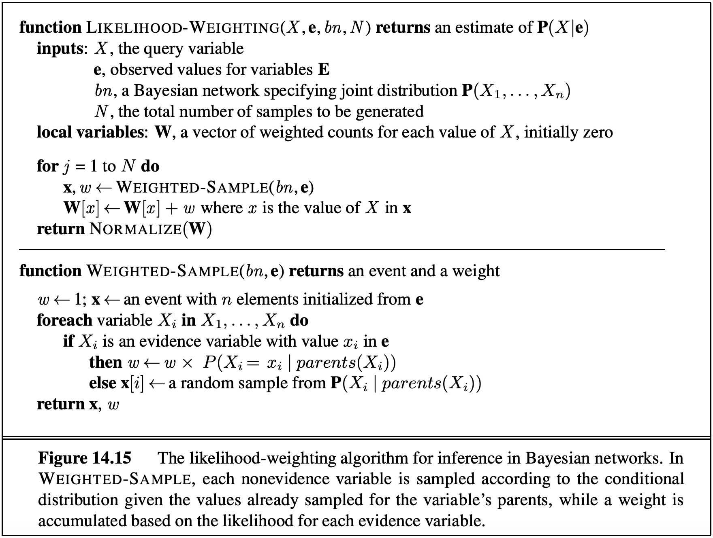

*图 2：似然加权。*

先验采样、拒绝采样和似然加权都可以通过生成更多样本来提高准确度。在三者中，似然加权的计算效率最高，具体原因超出本课程范围。

### 6.7.4 Gibbs 采样

Gibbs 采样是第四种采样方法。它先把所有变量设置为完全随机的值，不考虑 CPT；然后一次选择一个变量，清除它的值，再根据当前其他变量的值重新采样该变量。

对于前面的 $T,C,S,E$ 示例，可以先赋值 $t=\text{true},c=\text{true},s=\text{false},e=\text{true}$。然后选择四个变量中的一个重新采样，例如选择 $S$ 并清除它，再从

$$
P(S\mid+t,+c,+e)
$$

中采样新的值。

计算任意一个变量在其他所有变量给定时的条件分布，其实很容易。更具体地说，$P(S\mid T,C,E)$ 只需要使用连接 $S$ 与邻居的 CPT。

因此，在典型贝叶斯网络中，大多数变量只有少量邻居，可以在线性时间内预先计算每个变量在其邻居给定时的条件分布。

我们不证明这个结论，但如果重复这个过程足够多次，即使初始赋值是低概率的，后期样本最终也会收敛到正确分布。Gibbs 采样还有一些超出本课程范围的限制，可以在相关资料的 Failure Modes 部分进一步了解。

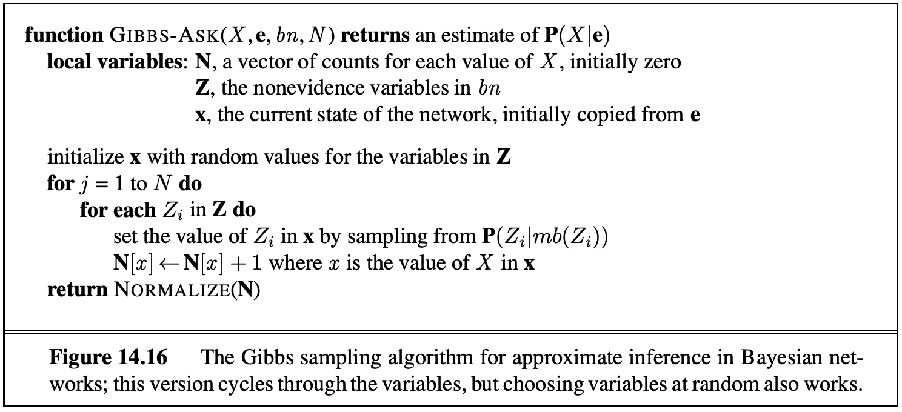

*图 3：Gibbs 采样。*

## 6.8 本章小结

贝叶斯网络是表示联合概率分布的强大工具。它的拓扑结构编码独立性和条件独立性关系，可以用来建模任意分布并执行推断和采样。

本章介绍了两种概率推断方法：精确推断和概率采样。

- **精确推断：** 保证得到完全正确的概率，但计算量可能无法接受。介绍的精确推断算法包括：
  - 枚举推断；
  - 变量消除。
- **采样：** 用更少的计算近似概率。介绍的采样算法包括：
  - 先验采样；
  - 拒绝采样；
  - 似然加权；
  - Gibbs 采样。
