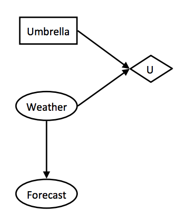
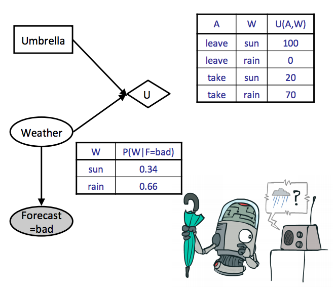
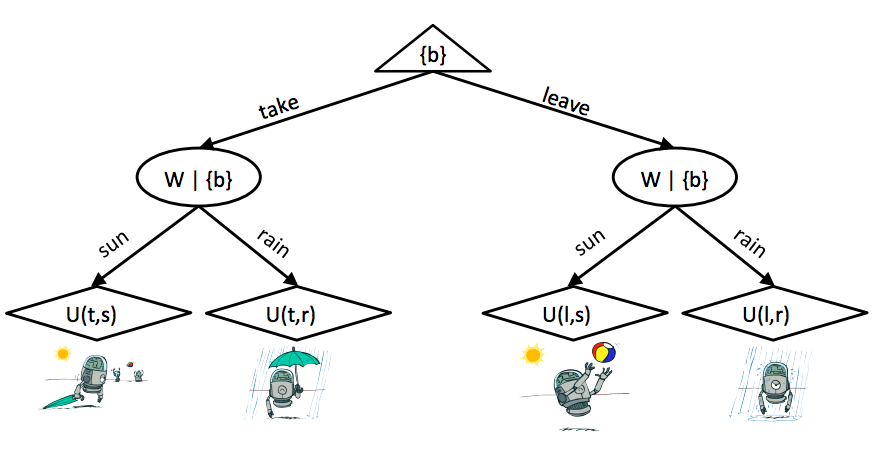
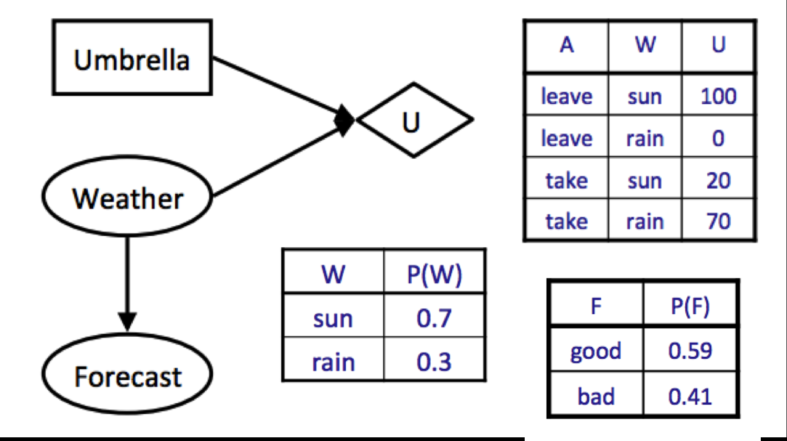

# 第七章 决策网络与完美信息价值

作者：Nikhil Sharma

编辑：Saathvik Selvan、Wesley Zheng

部分内容改编自《人工智能：一种现代方法》（*Artificial Intelligence: A Modern Approach*）。

最后更新：2024 年 9 月

## 7.1 效用

在讨论理性智能体时，效用（utility）这个概念反复出现。例如在博弈中，效用值通常预先写入游戏，智能体使用效用值选择行动。本节讨论如何构造可用的效用函数。

理性智能体必须遵循最大效用原则：总是选择最大化期望效用的行动。但这个原则只有在智能体具有理性偏好时才有帮助。

考虑一个非理性偏好的例子。有三个物品 A、B、C，智能体当前拥有 A，并且有以下偏好：

- 智能体偏好 B，而不是 A 加 1 美元；
- 智能体偏好 C，而不是 B 加 1 美元；
- 智能体偏好 A，而不是 C 加 1 美元。

如果一个恶意智能体拥有 B 和 C，它可以先用 B 换走我们的 A 和 1 美元，再用 C 换走 B 和 1 美元，最后再用 A 换走 C 和 1 美元。我们的智能体什么也没得到，却损失了 3 美元。这样，恶意智能体就能让它陷入无休止的噩梦循环，不断交出金钱。

下面正式定义描述偏好的数学语言：

- 如果智能体偏好获得奖品 A，而不是奖品 B，记作 $A\succ B$。
- 如果智能体在获得 A 或 B 之间无差别，记作 $A\sim B$。
- 抽奖（lottery）是一种以不同概率得到不同奖品的情形。A 以概率 $p$ 获得、B 以概率 $1-p$ 获得的抽奖记作

  $$
  L=[p,A;(1-p),B]。
  $$

一组偏好要成为理性偏好，必须满足理性的五条公理：

### 可排序性

$$
(A\succ B)\lor(B\succ A)\lor(A\sim B)。
$$

理性智能体必须偏好 A 或 B 其中之一，或者在二者之间无差别。

### 传递性

$$
(A\succ B)\land(B\succ C)\Rightarrow(A\succ C)。
$$

如果理性智能体偏好 A 胜过 B，偏好 B 胜过 C，那么它也偏好 A 胜过 C。

### 连续性

$$
A\succ B\succ C\Rightarrow\exists p\;[p,A;(1-p),C]\sim B。
$$

如果理性智能体偏好 A 胜过 B、偏好 B 胜过 C，那么可以选择合适的 $p$，构造一个只在 A 和 C 之间抽取的抽奖 $L$，使智能体在 $L$ 与 B 之间无差别。

### 可替代性

$$
A\sim B\Rightarrow[p,A;(1-p),C]\sim[p,B;(1-p),C]。
$$

如果理性智能体在奖品 A 与 B 之间无差别，那么任何只把 A 替换成 B、或把 B 替换成 A 的两种抽奖，它也会无差别。

### 单调性

$$
A\succ B\Rightarrow(p\ge q)\Longleftrightarrow[p,A;(1-p),B]\succeq[q,A;(1-q),B]。
$$

如果理性智能体偏好 A 胜过 B，那么在只包含 A、B 的抽奖中，它会偏好给 A 更高概率的抽奖。

如果智能体满足这五条公理，就能保证它的行为可以描述为最大化期望效用。更具体地说，存在一个实值效用函数 $U$，满足：偏好的奖品拥有更大的效用；抽奖的效用等于抽奖结果的效用期望。

这两点可以简洁地写成：

$$
U(A)\ge U(B)\Longleftrightarrow A\succeq B，
$$

$$
U([p_1,S_1;\ldots;p_n,S_n])=\sum_i p_iU(S_i)。
$$

只要这些约束成立，并且选择合适的算法，使用该效用函数的智能体就能保证做出最优行为。

考虑下面的抽奖：

$$
L=[0.5,\$0;0.5,\$1000]。
$$

它表示以 0.5 的概率得到 1000 美元，以 0.5 的概率得到 0 美元。

现在有三个智能体 $A_1,A_2,A_3$，它们的效用函数分别为

$$
U_1(\$x)=x，\qquad U_2(\$x)=\sqrt{x}，\qquad U_3(\$x)=x^2。
$$

如果三个智能体都要在参加这个抽奖和直接收取 500 美元之间选择，它们会怎样选择？

| 智能体 | 抽奖效用 | 直接收款效用 |
| --- | ---: | ---: |
| $A_1$ | 500 | 500 |
| $A_2$ | 15.81 | 22.36 |
| $A_3$ | 500000 | 250000 |

计算过程如下：

$$
\begin{aligned}
U_1(L)&=0.5\cdot U_1(\$1000)+0.5\cdot U_1(\$0)\\
&=0.5\cdot1000+0.5\cdot0=500，\\[4pt]
U_2(L)&=0.5\cdot U_2(\$1000)+0.5\cdot U_2(\$0)\\
&=0.5\sqrt{1000}+0.5\sqrt0=15.81，\\[4pt]
U_3(L)&=0.5\cdot U_3(\$1000)+0.5\cdot U_3(\$0)\\
&=0.5\cdot1000^2+0.5\cdot0^2=500000。
\end{aligned}
$$

$A_1$ 对抽奖和直接收款无差别，因为二者效用相同。这样的智能体称为风险中性（risk-neutral）。$A_2$ 偏好直接收款而不是抽奖，称为风险厌恶（risk-averse）。$A_3$ 偏好抽奖而不是直接收款，称为风险偏好（risk-seeking）。

## 7.2 决策网络

前面学习了博弈树，以及 minimax、expectimax 等最大化期望效用的算法。第五章又讨论了贝叶斯网络，以及如何利用已知证据执行概率推断、进行预测。

决策网络（decision network）是二者的结合：它用图形概率模型表示行动对效用的影响。

决策网络包含三类节点：

- **机会节点：** 行为与贝叶斯网络中的节点相同。每个结果有一个相关概率，可以在它所属的贝叶斯网络上执行推断得到。用椭圆表示。
- **行动节点：** 智能体完全控制的节点，表示可以从多个行动中选择一个。用矩形表示。
- **效用节点：** 是某些行动节点和机会节点的子节点，根据父节点的取值输出效用。用菱形表示。

考虑早晨去上课时是否带伞。天气预报给出 30% 的下雨概率，是否应该带伞？如果下雨概率为 80%，答案会改变吗？这类问题很适合用决策网络建模：

*图 1：天气决策网络示例。*

和课程前面讨论的各种建模技术、算法一样，决策网络的目标仍然是选择能产生最大期望效用（maximum expected utility，MEU）的行动。

过程如下：

1. 先把已知证据实例化，然后执行推断，计算行动节点所连接的效用节点的所有机会节点父节点的后验概率。
2. 遍历每个可能行动，在上一步的后验概率下计算执行该行动的期望效用。给定证据 $e$ 和 $n$ 个机会节点，行动 $a$ 的期望效用为

   $$
   EU(a\mid e)=\sum_{x_1,\ldots,x_n}P(x_1,\ldots,x_n\mid e)U(a,x_1,\ldots,x_n)。
   $$

   其中 $x_i$ 是第 $i$ 个机会节点可能取的值。也就是对每个结果的效用做加权求和，权重是该结果的概率。
3. 选择期望效用最高的行动，得到 MEU。

仍然使用天气示例，结合恶劣天气预报下的天气条件概率表，以及给定行动和天气的效用表：

*图 2：带表格的决策网络。*

这里省略了后验概率 $P(W\mid F=\text{bad})$ 的推断过程；可以使用贝叶斯网络章节中的任意推断算法计算它。当前直接使用上表给出的后验概率。

对两个行动分别计算期望效用：

$$
\begin{aligned}
EU(\text{leave}\mid\text{bad})
&=\sum_wP(w\mid\text{bad})U(\text{leave},w)\\
&=0.34\cdot100+0.66\cdot0=34，\\[4pt]
EU(\text{take}\mid\text{bad})
&=\sum_wP(w\mid\text{bad})U(\text{take},w)\\
&=0.34\cdot20+0.66\cdot70=53。
\end{aligned}
$$

对这些效用取最大值：

$$
MEU(F=\text{bad})=\max_aEU(a\mid\text{bad})=53。
$$

因此，最大期望效用对应的行动是带伞，这就是决策网络推荐的行动。形式化地说，MEU 行动可以通过对期望效用取 `argmax` 得到。

### 7.2.1 结果树

本章开头提到决策网络包含 expectimax 的元素。把决策网络中选择最大期望效用行动的过程展开，就得到结果树（outcome tree）。天气示例展开成如下结果树：

*图 3：结果树。*

顶部根节点是一个最大化节点，与 expectimax 中的最大化节点相同，由我们控制。选择行动后到达下一层，这一层由机会节点控制。机会节点按照对贝叶斯网络执行概率推断得到的后验概率，解析为最终一层的不同效用节点。

这与普通 expectimax 有什么区别？唯一真正的区别，是结果树的节点标注了我们在每个时刻所知道的信息，这些信息写在花括号中。

## 7.3 完美信息价值

到目前为止，我们通常假设智能体已经拥有某个问题所需的全部信息，或者没有办法获得新信息。但实践中很少如此。

决策的一个重要部分，是判断收集更多证据、帮助选择行动是否值得。观察新证据几乎总有成本，可能是时间、金钱或其他资源。本节介绍完美信息价值（value of perfect information，VPI）：它从数学上量化了观察新证据后，智能体最大期望效用的预期增加量。

把获取新信息的 VPI 与观察信息的成本比较，就能决定是否值得收集证据。

### 7.3.1 一般公式

不直接给出公式，先直观推导。根据定义，完美信息价值是：决定观察新证据后，最大期望效用预期增加了多少。

给定当前证据 $e$，当前最大期望效用为

$$
MEU(e)=\max_a\sum_sP(s\mid e)U(s,a)。
$$

如果在行动前观察到新证据 $e'$，此时的最大期望效用变为

$$
MEU(e,e')=\max_a\sum_sP(s\mid e,e')U(s,a)。
$$

但我们不知道会观察到什么新证据。例如，不知道天气预报、决定去观察它时，得到的预报可能是好，也可能是坏。由于不知道将得到哪个 $e'$，要把新证据表示为随机变量 $E'$。

如果不知道观察结果会告诉我们什么，如何表示观察新变量后得到的 MEU？应该计算“最大期望效用的期望值”：

$$
MEU(e,E')=\sum_{e'}P(e'\mid e)MEU(e,e')。
$$

观察证据变量会得到不同的 MEU，每个值出现的概率就是观察到该证据值的概率。因此，上式计算了观察新证据后预期能得到的 MEU。

现在回到 VPI 定义。当前 MEU 已知，观察新证据后的新 MEU 的期望值也已知，因此预期增加量就是二者之差：

$$
VPI(E'\mid e)=MEU(e,E')-MEU(e)。
$$

可以把 $VPI(E'\mid e)$ 读作“给定当前证据 $e$，观察新证据 $E'$ 的价值”。

再次使用天气场景。如果不观察任何证据，最大期望效用为

$$
\begin{aligned}
MEU(\varnothing)
&=\max_aEU(a)\\
&=\max_a\sum_wP(w)U(a,w)\\
&=\max\{0.7\cdot100+0.3\cdot0,\\
&\qquad0.7\cdot20+0.3\cdot70\}\\
&=\max\{70,35\}=70。
\end{aligned}
$$

没有证据时使用 $MEU(\varnothing)$ 表示证据集合为空。

现在决定是否观察天气预报。前面已经算出

$$
MEU(F=\text{bad})=53，
$$

假设同样计算得到

$$
MEU(F=\text{good})=95。
$$

于是

$$
\begin{aligned}
MEU(e,E')&=MEU(F)\\
&=\sum_{e'}P(e'\mid e)MEU(e,e')\\
&=\sum_fP(F=f)MEU(F=f)\\
&=P(F=\text{good})MEU(F=\text{good})\\
&\quad+P(F=\text{bad})MEU(F=\text{bad})\\
&=0.59\cdot95+0.41\cdot53\\
&=77.78。
\end{aligned}
$$

因此

$$
VPI(F)=MEU(F)-MEU(\varnothing)=77.78-70=7.78。
$$

*图 1：VPI 示例。*

### 7.3.2 VPI 的性质

完美信息价值有三个重要性质：

- **非负性：**

  $$
  \forall E',e,\quad VPI(E'\mid e)\ge0。
  $$

  观察新信息总能让决策更有依据，因此最大期望效用只会增加，或者在信息与决策无关时保持不变。

- **非可加性：** 一般来说，

  $$
  VPI(E_j,E_k\mid e)\ne VPI(E_j\mid e)+VPI(E_k\mid e)。
  $$

  这条性质最难直观理解。原因是观察新证据 $E_j$ 后，我们对 $E_k$ 的重视程度可能发生变化，因此不能简单把观察 $E_j$ 的 VPI 与观察 $E_k$ 的 VPI 相加，得到同时观察二者的 VPI。

- **顺序无关性：**

  $$
  \begin{aligned}
  VPI(E_j,E_k\mid e)
  &=VPI(E_j\mid e)+VPI(E_k\mid e,E_j)\\
  &=VPI(E_k\mid e)+VPI(E_j\mid e,E_k)。
  \end{aligned}
  $$

  观察多个新证据带来的最大期望效用增益，与观察顺序无关。因为在观察完所有新证据之前并不真正采取行动，所以一起观察证据，或按任意顺序逐个观察，最终结果相同。
