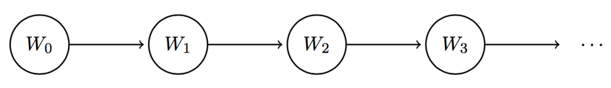
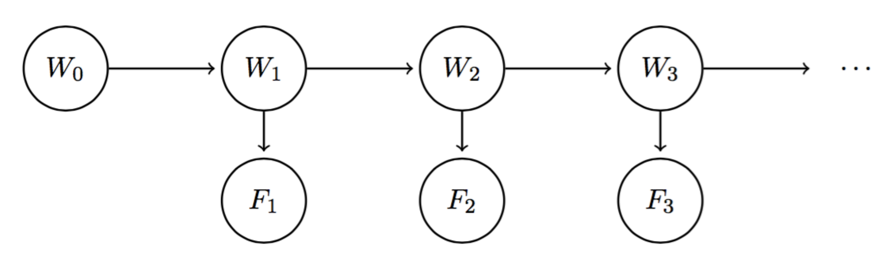
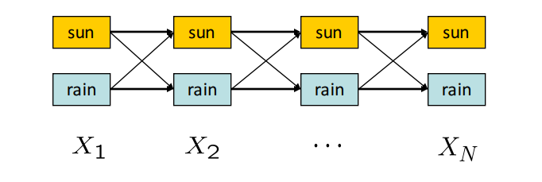

# 第八章 隐马尔可夫模型

作者：Nikhil Sharma

编辑：Saathvik Selvan、Pranav Muralikrishnan、Wesley Zheng

部分内容改编自《人工智能：一种现代方法》（*Artificial Intelligence: A Modern Approach*）。

最后更新：2024 年 11 月

## 8.1 马尔可夫模型

前面讨论过贝叶斯网络：它是一种用紧凑方式表示随机变量关系的优秀结构。本章介绍一种内在相关的结构——马尔可夫模型。

在本课程中，可以把马尔可夫模型理解成链状、无限长度的贝叶斯网络。贯穿本节的例子是每天变化的天气模式。天气模型依赖时间：每一天的天气都有一个单独的随机变量。令 $W_i$ 表示第 $i$ 天的天气，则天气马尔可夫模型如下：

*图 1：天气马尔可夫模型。*

马尔可夫模型中需要存储哪些信息？为了跟踪天气随时间的变化，需要知道时间 $t=0$ 的初始分布，以及描述时间步之间如何从一个状态移动到另一个状态的转移模型。

初始分布由 $P(W_0)$ 的概率表给出；从时间 $i$ 转移到时间 $i+1$ 的转移模型由 $P(W_{i+1}\mid W_i)$ 给出。

这个转移模型意味着 $W_{i+1}$ 只条件依赖于 $W_i$。换句话说，时间 $t=i+1$ 的天气满足马尔可夫性质或无记忆性质，与 $t=i$ 以外的其他时间的天气独立。

使用链式法则构造 $W_0,W_1,W_2$ 的联合分布，原本会得到

$$
P(W_0,W_1,W_2)=P(W_0)P(W_1\mid W_0)P(W_2\mid W_1,W_0)。
$$

但根据马尔可夫性质 $W_0\perp\!\!\perp W_2\mid W_1$，联合分布简化为

$$
P(W_0,W_1,W_2)=P(W_0)P(W_1\mid W_0)P(W_2\mid W_1)。
$$

马尔可夫模型中的这些信息已经足以计算它。

更一般地，每个时间步都作出以下独立性假设：

$$
W_{i+1}\perp\!\!\perp\{W_0,\ldots,W_{i-1}\}\mid W_i。
$$

因此，可以用链式法则重建前 $n+1$ 个变量的联合分布：

$$
\begin{aligned}
P(W_0,W_1,\ldots,W_n)
&=P(W_0)P(W_1\mid W_0)P(W_2\mid W_1)\cdots P(W_n\mid W_{n-1})\\
&=P(W_0)\prod_{i=0}^{n-1}P(W_{i+1}\mid W_i)。
\end{aligned}
$$

马尔可夫模型通常还作出一个假设：转移模型是平稳的。也就是对所有 $i$、所有时间步，$P(W_{i+1}\mid W_i)$ 都相同。因此，马尔可夫模型只需要两张表：$P(W_0)$ 和 $P(W_{i+1}\mid W_i)$。

### 8.1.1 小型前向算法

现在已经知道如何计算马尔可夫模型跨时间步的联合分布，但这还不能直接回答“第 $t$ 天的天气分布是什么”。当然，可以先计算联合分布，再对其他变量求和，但这通常非常低效：如果有 $j$ 个变量，每个变量有 $d$ 个可能值，联合分布大小就是 $O(d^j)$。

更高效的技术是小型前向算法（mini-forward algorithm）。

根据边缘化性质：

$$
P(W_{i+1})=\sum_{w_i}P(w_i,W_{i+1})。
$$

利用链式法则，可以写成

$$
P(W_{i+1})=\sum_{w_i}P(W_{i+1}\mid w_i)P(w_i)。
$$

这条式子很直观：要计算时间步 $i+1$ 的天气分布，就把时间步 $i$ 的分布 $P(W_i)$ 通过转移模型 $P(W_{i+1}\mid W_i)$ 向前推进一步。

因此，可以从初始分布 $P(W_0)$ 出发计算 $P(W_1)$，再用 $P(W_1)$ 计算 $P(W_2)$，如此反复计算任意时间步的天气分布。

考虑以下初始分布和转移模型：

| $W_0$ | $P(W_0)$ |
| --- | ---: |
| sun | 0.8 |
| rain | 0.2 |

| $W_{i+1}$ | $W_i$ | $P(W_{i+1}\mid W_i)$ |
| --- | --- | ---: |
| sun | sun | 0.6 |
| rain | sun | 0.4 |
| sun | rain | 0.1 |
| rain | rain | 0.9 |

用小型前向算法计算 $P(W_1)$：

$$
\begin{aligned}
P(W_1=\text{sun})
&=\sum_{w_0}P(W_1=\text{sun}\mid w_0)P(w_0)\\
&=P(W_1=\text{sun}\mid W_0=\text{sun})P(W_0=\text{sun})\\
&\quad+P(W_1=\text{sun}\mid W_0=\text{rain})P(W_0=\text{rain})\\
&=0.6\cdot0.8+0.1\cdot0.2=0.5，\\[4pt]
P(W_1=\text{rain})
&=\sum_{w_0}P(W_1=\text{rain}\mid w_0)P(w_0)\\
&=0.4\cdot0.8+0.9\cdot0.2=0.5。
\end{aligned}
$$

所以

| $W_1$ | $P(W_1)$ |
| --- | ---: |
| sun | 0.5 |
| rain | 0.5 |

从 $t=0$ 的 80% 晴天概率，到 $t=1$ 降为 50%，是转移模型偏好转移到雨天的直接结果。

自然会产生一个后续问题：给定时间步的状态概率是否最终会收敛？下一节回答这个问题。

### 8.1.2 平稳分布

要解决上述问题，需要计算天气的平稳分布。顾名思义，平稳分布经过时间推移仍保持不变：

$$
P(W_{t+1})=P(W_t)。
$$

把这个等式与小型前向算法使用的公式结合，就能求出收敛后的状态概率：

$$
P(W_{t+1})=P(W_t)=\sum_{w_t}P(W_{t+1}\mid w_t)P(w_t)。
$$

在天气示例中，有两个方程：

$$
\begin{aligned}
P(W_t=\text{sun})
&=P(W_{t+1}=\text{sun}\mid W_t=\text{sun})P(W_t=\text{sun})\\
&\quad+P(W_{t+1}=\text{sun}\mid W_t=\text{rain})P(W_t=\text{rain})\\
&=0.6P(W_t=\text{sun})+0.1P(W_t=\text{rain}),\\[4pt]
P(W_t=\text{rain})
&=0.4P(W_t=\text{sun})+0.9P(W_t=\text{rain})。
\end{aligned}
$$

概率总和必须为 1：

$$
P(W_t=\text{sun})+P(W_t=\text{rain})=1。
$$

令 $x=P(W_t=\text{sun})$、$y=P(W_t=\text{rain})$，得到方程组：

1. $x+y=1$；
2. $0.6x+0.1y=x$；
3. $0.4x+0.9y=y$。

用 $y=1-x$ 代入第二个方程，得到

$$
0.6x+0.1(1-x)=x。
$$

解得 $x=1/5$，再由第一个方程得 $y=4/5$。因此平稳分布为

| $W$ | $P(W)$ |
| --- | ---: |
| sun | 0.2 |
| rain | 0.8 |

这说明，当小型前向算法继续运行、时间趋于无穷时，下雨概率会收敛到 80%。这同样是转移模型偏好转移到雨天的结果。

## 8.2 隐马尔可夫模型

在马尔可夫模型中，可以通过初始分布 $P(W_0)$ 和转移模型计算第 10 天的 $P(W_{10})$。但在 $t=0$ 到 $t=10$ 之间，可能会收到新的气象证据，改变对任意时间步天气分布的信念。

例如，天气预报说第 10 天下雨概率为 80%，但第 9 天晚上天空晴朗，那么这 80% 的概率可能会显著下降。这正是隐马尔可夫模型（Hidden Markov Model，HMM）解决的问题：允许在每个时间步观测证据，从而影响对各状态的信念分布。

天气模型的 HMM 可以用下面的贝叶斯网络表示：

*图 1：天气 HMM。*

与普通马尔可夫模型不同，HMM 有两类节点：

- $W_i$：状态变量，表示第 $i$ 天的天气。
- $F_i$：证据变量，表示第 $i$ 天收到的天气预报。

由于 $W_i$ 编码了第 $i$ 天天气的概率分布，因此第 $i$ 天的天气预报自然条件依赖于它。

HMM 具有与普通马尔可夫模型相似的条件独立关系，并为证据变量增加了以下关系：

$$
F_1\perp\!\!\perp W_0\mid W_1，
$$

对于 $i=2,\ldots,n$：

$$
W_i\perp\!\!\perp\{W_0,\ldots,W_{i-2},F_1,\ldots,F_{i-1}\}\mid W_{i-1}，
$$

$$
F_i\perp\!\!\perp\{W_0,\ldots,W_{i-1},F_1,\ldots,F_{i-1}\}\mid W_i。
$$

和马尔可夫模型一样，HMM 假设转移模型 $P(W_{i+1}\mid W_i)$ 平稳；此外，还假设传感器模型 $P(F_i\mid W_i)$ 平稳。因此，任意 HMM 都可以用三张表紧凑表示：初始分布、转移模型和传感器模型。

定义到时间 $i$ 为止已经观测到 $F_1,\ldots,F_i$ 时的信念分布：

$$
B(W_i)=P(W_i\mid f_1,\ldots,f_i)。
$$

定义只观测到 $f_1,\ldots,f_{i-1}$ 时的信念分布：

$$
B'(W_i)=P(W_i\mid f_1,\ldots,f_{i-1})。
$$

令 $e_i$ 表示时间步 $i$ 观测到的证据。有时会把时间步 $1\le i\le t$ 的聚合证据写成

$$
e_{1:t}=e_1,\ldots,e_t。
$$

在这种记号下，$P(W_i\mid f_1,\ldots,f_{i-1})$ 可以写成 $P(W_i\mid f_{1:(i-1)})$。后面讨论如何把新证据逐步加入天气模型时会使用这个记号。

### 8.2.1 前向算法

利用前面给出的条件概率假设以及条件概率表的边缘化性质，可以推导 $B(W_i)$ 和 $B'(W_{i+1})$ 的关系；它与小型前向算法的更新规则形式相同。

先边缘化：

$$
B'(W_{i+1})=P(W_{i+1}\mid f_1,\ldots,f_i)=\sum_{w_i}P(W_{i+1},w_i\mid f_1,\ldots,f_i)。
$$

用链式法则展开：

$$
B'(W_{i+1})=\sum_{w_i}P(W_{i+1}\mid w_i,f_1,\ldots,f_i)P(w_i\mid f_1,\ldots,f_i)。
$$

注意 $P(w_i\mid f_1,\ldots,f_i)=B(w_i)$，并且

$$
W_{i+1}\perp\!\!\perp\{f_1,\ldots,f_i\}\mid W_i。
$$

因此

$$
B'(W_{i+1})=\sum_{w_i}P(W_{i+1}\mid w_i)B(w_i)。
$$

接下来推导 $B'(W_{i+1})$ 和 $B(W_{i+1})$ 的关系。根据带额外条件的条件概率定义，

$$
B(W_{i+1})=P(W_{i+1}\mid f_1,\ldots,f_{i+1})
=\frac{P(W_{i+1},f_{i+1}\mid f_1,\ldots,f_i)}{P(f_{i+1}\mid f_1,\ldots,f_i)}。
$$

条件概率中有一个常用技巧：延迟归一化，直到真正需要归一化概率时再做。上式分母对 $B(W_{i+1})$ 概率表中的每一项都相同，因此可以暂时不除以它，只记作

$$
B(W_{i+1})\propto P(W_{i+1},f_{i+1}\mid f_1,\ldots,f_i)。
$$

当需要恢复归一化的 $B(W_{i+1})$ 时，再把每一项除以这个比例常数。

利用链式法则：

$$
\begin{aligned}
B(W_{i+1})
&\propto P(f_{i+1}\mid W_{i+1},f_1,\ldots,f_i)P(W_{i+1}\mid f_1,\ldots,f_i)\\
&=P(f_{i+1}\mid W_{i+1})B'(W_{i+1})。
\end{aligned}
$$

第一步等式使用 HMM 的条件独立性，第二项正是 $B'(W_{i+1})$ 的定义。

把两条关系合起来，得到 HMM 的前向算法：

$$
B(W_{i+1})\propto P(f_{i+1}\mid W_{i+1})\sum_{w_i}P(W_{i+1}\mid w_i)B(w_i)。
$$

前向算法包含两个步骤：

- **时间流逝更新：** 根据 $B(W_i)$ 计算 $B'(W_{i+1})$。
- **观测更新：** 根据 $B'(W_{i+1})$ 计算 $B(W_{i+1})$。

因此，要把信念分布向前推进一个时间步，必须先用时间流逝更新推进状态，再用观测更新加入该时间步的新证据。

考虑以下初始分布、转移模型和传感器模型：

| $W_0$ | $B(W_0)$ |
| --- | ---: |
| sun | 0.8 |
| rain | 0.2 |

| $W_{i+1}$ | $W_i$ | $P(W_{i+1}\mid W_i)$ |
| --- | --- | ---: |
| sun | sun | 0.6 |
| rain | sun | 0.4 |
| sun | rain | 0.1 |
| rain | rain | 0.9 |

| $F_i$ | $W_i$ | $P(F_i\mid W_i)$ |
| --- | --- | ---: |
| good | sun | 0.8 |
| bad | sun | 0.2 |
| good | rain | 0.3 |
| bad | rain | 0.7 |

计算 $B(W_1)$ 时，先进行时间更新，得到 $B'(W_1)$：

$$
\begin{aligned}
B'(W_1=\text{sun})
&=0.6\cdot0.8+0.1\cdot0.2=0.5，\\
B'(W_1=\text{rain})
&=0.4\cdot0.8+0.9\cdot0.2=0.5。
\end{aligned}
$$

| $W_1$ | $B'(W_1)$ |
| --- | ---: |
| sun | 0.5 |
| rain | 0.5 |

假设第 1 天的天气预报是 good，即 $F_1=\text{good}$，执行观测更新：

$$
B(W_1=\text{sun})\propto P(F_1=\text{good}\mid W_1=\text{sun})B'(W_1=\text{sun})=0.8\cdot0.5=0.4，
$$

$$
B(W_1=\text{rain})\propto P(F_1=\text{good}\mid W_1=\text{rain})B'(W_1=\text{rain})=0.3\cdot0.5=0.15。
$$

最后归一化。$B(W_1)$ 表中的项总和为 $0.4+0.15=0.55$：

$$
B(W_1=\text{sun})=\frac{0.4}{0.55}=\frac{8}{11}，
$$

$$
B(W_1=\text{rain})=\frac{0.15}{0.55}=\frac{3}{11}。
$$

因此

| $W_1$ | $B(W_1)$ |
| --- | ---: |
| sun | $8/11$ |
| rain | $3/11$ |

观测天气预报的效果很明显：时间更新后晴天信念为 $1/2$，观测到“好天气”后增加到 $8/11$。

最后，前面讨论的延迟归一化技巧可以显著简化 HMM 计算。如果从初始分布开始，想计算时间 $t$ 的信念分布，可以使用前向算法依次计算 $B(W_1),\ldots,B(W_t)$，最后只归一化一次：用 $B(W_t)$ 表中所有项的总和除每一项。

## 8.3 Viterbi 算法

前向算法使用递归求解给定已观测证据后系统状态的概率分布：$P(X_N\mid e_{1:N})$。关于 HMM 还有一个重要问题：给定目前观测到的证据，系统最可能经历了哪一串隐藏状态？也就是求

$$
\arg\max_{x_{1:N}}P(x_{1:N}\mid e_{1:N})
=\arg\max_{x_{1:N}}P(x_{1:N},e_{1:N})。
$$

可以用动态规划的 Viterbi 算法求出这条轨迹。

算法分两次遍历：

1. 第一次沿时间正向进行，计算给定当前证据时，到达每个“状态—时间”节点的最佳路径概率。
2. 第二次沿时间反向进行：先找到位于最高概率路径上的终止状态，再沿着通向该状态的最佳路径向后追踪。

用状态格（state trellis）表示这个算法。状态格是随时间展开的状态和转移图：

*图 1：状态格。*

在有两个隐藏状态 sun、rain 的 HMM 中，我们希望从 $X_1$ 到 $X_N$ 找到概率最高的路径，也就是为每个时间步赋一个状态。

从 $X_{t-1}$ 到 $X_t$ 的边权为

$$
P(X_t\mid X_{t-1})P(E_t\mid X_t)。
$$

一条路径的概率等于其所有边权的乘积。第一项表示特定转移的可能性，第二项表示观测证据与结果状态的匹配程度。

回忆

$$
P(X_{1:N},e_{1:N})=P(X_1)P(e_1\mid X_1)\prod_{t=2}^{N}P(X_t\mid X_{t-1})P(e_t\mid X_t)。
$$

前向算法计算的是（忽略归一化常数）

$$
P(X_N,e_{1:N})=\sum_{x_1,\ldots,x_{N-1}}P(X_N,x_{1:N-1},e_{1:N})。
$$

Viterbi 算法则要计算

$$
\arg\max_{x_1,\ldots,x_N}P(x_{1:N},e_{1:N})。
$$

乘积中的每一项正好是状态格中相邻两层之间的边权，因此路径上的边权乘积就是给定证据时这条路径的概率。

可以构造所有可能隐藏状态的联合概率表，但它的空间成本是指数级的。即使有这张表，也可以用动态规划在多项式时间内求最佳路径；然而，既然动态规划本身能求最佳路径，就不必在任一时刻保存完整表。

定义

$$
m_t[x_t]=\max_{x_{1:t-1}}P(x_{1:t},e_{1:t})，
$$

表示在时间 $t$ 到达 $x_t$ 的路径中，看到截至当前的证据后，路径概率的最大值。它也是状态格从第 1 步到第 $t$ 步的最大权重路径。

展开这个定义：

$$
\begin{aligned}
m_t[x_t]
&=\max_{x_{1:t-1}}P(e_t\mid x_t)P(x_t\mid x_{t-1})P(x_{1:t-1},e_{1:t-1})\\
&=P(e_t\mid x_t)\max_{x_{t-1}}P(x_t\mid x_{t-1})\max_{x_{1:t-2}}P(x_{1:t-1},e_{1:t-1})\\
&=P(e_t\mid x_t)\max_{x_{t-1}}P(x_t\mid x_{t-1})m_{t-1}[x_{t-1}]。
\end{aligned}
$$

因此可以用动态规划递归计算所有 $t$ 的 $m_t$。这样可以确定最高概率路径的最后状态 $x_N$，但还需要回溯信息重建完整路径。

定义

$$
a_t[x_t]=\arg\max_{x_{t-1}}P(x_t\mid x_{t-1})m_{t-1}[x_{t-1}]，
$$

记录到达 $x_t$ 的最佳路径中最后一条转移。完成正向遍历后，数组 $a$ 为每个终止状态定义了一条最可能序列；比较这些序列的概率，选择最佳的一条，再在反向遍历中重建它。

这样，我们就能在多项式时间和空间内，为当前证据计算最可能的解释。

## 8.4 粒子滤波

回顾贝叶斯网络：精确推断计算量过大时，可以使用采样技术近似目标概率分布。HMM 也有同样的问题：前向算法的运行时间随随机变量域中可能值的数量增长。

天气模型中 $W_i\in\{\text{sun},\text{rain}\}$，只有两个状态，精确推断还可以接受。但如果要推断某一天的实际温度，精确到 0.1 度，那么可能状态数量就会非常大。

HMM 中对应贝叶斯网络采样的方法叫粒子滤波（particle filtering）。它模拟一组粒子在状态图中的移动，以近似目标随机变量的概率或信念分布。

它回答的问题与前向算法相同：给定证据，近似计算

$$
P(X_N\mid e_{1:N})。
$$

粒子滤波不保存从每个状态到信念概率的完整表，而是保存 $n$ 个粒子组成的列表，每个粒子处于时间相关随机变量的 $d$ 个可能状态之一。

通常 $n\ll d$，但 $n$ 仍然足够大，能产生有意义的近似；否则粒子滤波的性能优势会消失。粒子只是算法中样本的名称。

某个时间步某个状态的粒子信念，完全取决于模拟中该时间步处于该状态的粒子数量。

例如，想模拟某天的温度 $T_i$，假设温度只能取区间 $[10,20]$ 内的整数，共 $d=11$ 个状态。再假设有 $n=10$ 个粒子，在时间步 $i$ 的取值为

$$
[15,12,12,10,18,14,12,11,11,10]。
$$

统计列表中各温度出现的次数，并除以粒子总数，就得到温度的经验分布：

| $T_i$ | 10 | 11 | 12 | 13 | 14 | 15 | 16 | 17 | 18 | 19 | 20 |
| --- | ---: | ---: | ---: | ---: | ---: | ---: | ---: | ---: | ---: | ---: | ---: |
| $B(T_i)$ | 0.2 | 0.2 | 0.3 | 0 | 0.1 | 0.1 | 0 | 0 | 0.1 | 0 | 0 |

现在只剩下一个问题：如何生成指定时间步的粒子列表。

### 8.4.1 粒子滤波模拟

粒子滤波模拟从粒子初始化开始。初始化方式很灵活：可以随机采样、均匀采样，或从某个初始分布采样。得到初始粒子列表后，模拟过程与前向算法类似：每个时间步先执行时间流逝更新，再执行观测更新。

#### 时间流逝更新

根据转移模型更新每个粒子的值。若粒子当前处于状态 $t_i$，就从 $P(T_{i+1}\mid t_i)$ 给出的概率分布中采样新的值。

这与贝叶斯网络中的先验采样相似，因为任意状态中粒子的频率反映了转移概率。

#### 观测更新

使用传感器模型 $P(F_i\mid T_i)$，根据观测证据和粒子状态给每个粒子加权。若粒子处于 $t_i$，传感器读数为 $f_i$，则权重为

$$
P(f_i\mid t_i)。
$$

观测更新算法如下：

1. 按照上面的规则计算所有粒子的权重。
2. 计算每个状态的总权重。
3. 如果所有状态的权重总和为 0，则重新初始化全部粒子。
4. 否则，归一化各状态总权重的分布，并从这个分布重新采样粒子列表。

观测更新与似然加权很相似：都根据证据降低样本权重。

下面继续用温度作为随时间变化的随机变量。定义天气场景中的转移模型：对于某个温度状态，粒子可以留在原状态，也可以在区间 $[10,20]$ 内转移到相差 1 度的状态。

在所有可能后继状态中，最接近 15 度的状态获得 80% 的转移概率，其余后继状态均分剩下的 20%。初始粒子列表为

$$
[15,12,12,10,18,14,12,11,11,10]。
$$

对列表中的第一个粒子执行时间流逝更新。它处于 $T_i=15$，对应转移模型为

| $T_{i+1}$ | 14 | 15 | 16 |
| --- | ---: | ---: | ---: |
| $P(T_{i+1}\mid T_i=15)$ | 0.1 | 0.8 | 0.1 |

实践中，为 $T_{i+1}$ 的每个取值分配一个不重叠的区间，使这些区间共同覆盖 $[0,1)$：

1. $T_{i+1}=14$：$0\le r<0.1$；
2. $T_{i+1}=15$：$0.1\le r<0.9$；
3. $T_{i+1}=16$：$0.9\le r<1$。

要重新采样处于 $T_i=15$ 的粒子，只需生成一个 $[0,1)$ 中的随机数，查看它落在哪个区间。例如 $r=0.467$ 时，因为 $0.1\le r<0.9$，粒子仍处于 $T_{i+1}=15$。

对于 10 个粒子使用以下随机数：

$$
[0.467,0.452,0.583,0.604,0.748,0.932,0.609,0.372,0.402,0.026]。
$$

完整执行时间流逝更新后，新的粒子列表为

$$
[15,13,13,11,17,15,13,12,12,10]。
$$

更新后的信念分布为

| $T_{i+1}$ | 10 | 11 | 12 | 13 | 14 | 15 | 16 | 17 | 18 | 19 | 20 |
| --- | ---: | ---: | ---: | ---: | ---: | ---: | ---: | ---: | ---: | ---: | ---: |
| $B(T_{i+1})$ | 0.1 | 0.1 | 0.2 | 0.3 | 0 | 0.2 | 0 | 0.1 | 0 | 0 | 0 |

与初始分布相比，粒子整体趋向温度 $T=15$。

现在执行观测更新。假设传感器模型 $P(F_i\mid T_i)$ 表示正确预测 $f_i=t_i$ 的概率为 80%，预测其他 10 个状态中的任意一个的概率均为 2%。假设观测到 $F_{i+1}=13$，时间流逝更新后的 10 个粒子及其权重为：

| 粒子 | $p_1$ | $p_2$ | $p_3$ | $p_4$ | $p_5$ | $p_6$ | $p_7$ | $p_8$ | $p_9$ | $p_{10}$ |
| --- | ---: | ---: | ---: | ---: | ---: | ---: | ---: | ---: | ---: | ---: |
| 状态 | 15 | 13 | 13 | 11 | 17 | 15 | 13 | 12 | 12 | 10 |
| 权重 | 0.02 | 0.8 | 0.8 | 0.02 | 0.02 | 0.02 | 0.8 | 0.02 | 0.02 | 0.02 |

按状态聚合权重：

| 状态 | 10 | 11 | 12 | 13 | 15 | 17 |
| --- | ---: | ---: | ---: | ---: | ---: | ---: |
| 权重 | 0.02 | 0.02 | 0.04 | 2.4 | 0.04 | 0.02 |

权重总和为 2.54。用这个总和除每个权重，得到归一化分布：

| 状态 | 10 | 11 | 12 | 13 | 15 | 17 |
| --- | ---: | ---: | ---: | ---: | ---: | ---: |
| 权重 | 0.02 | 0.02 | 0.04 | 2.4 | 0.04 | 0.02 |
| 归一化权重 | 0.0079 | 0.0079 | 0.0157 | 0.9449 | 0.0157 | 0.0079 |

最后，使用时间流逝更新相同的重采样方法，从该概率分布重新采样。假设生成以下 10 个 $[0,1)$ 中的随机数：

$$
[0.315,0.829,0.304,0.368,0.459,0.891,0.282,0.980,0.898,0.341]。
$$

得到新的粒子列表：

$$
[13,13,13,13,13,13,13,15,13,13]。
$$

相应的最终信念分布为

| $T_{i+1}$ | 10 | 11 | 12 | 13 | 14 | 15 | 16 | 17 | 18 | 19 | 20 |
| --- | ---: | ---: | ---: | ---: | ---: | ---: | ---: | ---: | ---: | ---: | ---: |
| $B(T_{i+1})$ | 0 | 0 | 0 | 0.9 | 0 | 0.1 | 0 | 0 | 0 | 0 | 0 |

传感器模型表示天气预报有 80% 的准确率，新的粒子列表也符合这个事实：大多数粒子都被重采样为 $T_{i+1}=13$。

## 8.5 本章小结

马尔可夫模型可以看成链状、无限长度的贝叶斯网络。它满足马尔可夫性质：所建模变量的分布只取决于上一时间步该变量的值。

可以使用小型前向算法计算任意时间步的分布；当时间趋于无穷时，该分布最终会收敛到平稳分布。

本章还介绍了两种模型：

- **马尔可夫模型：** 表示具有马尔可夫性质的时间相关随机变量。可以使用概率推断和小型前向算法，计算任意时间步的信念分布。
- **隐马尔可夫模型：** 在马尔可夫模型基础上，允许每个时间步观测会影响信念分布的新证据。可以使用前向算法计算任意时间步的信念分布。

如果对这些模型执行精确推断的计算成本太高，可以使用粒子滤波进行近似推断。
