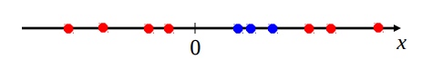
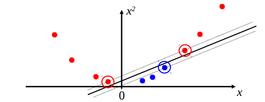
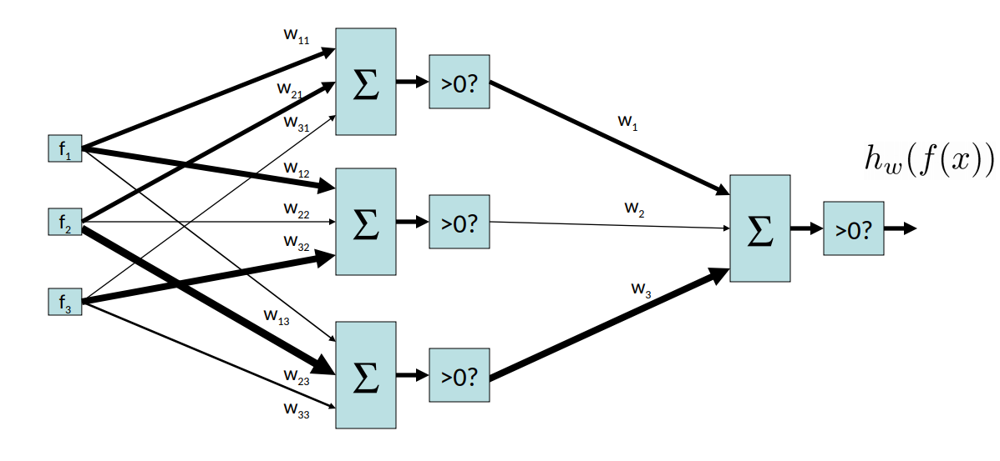
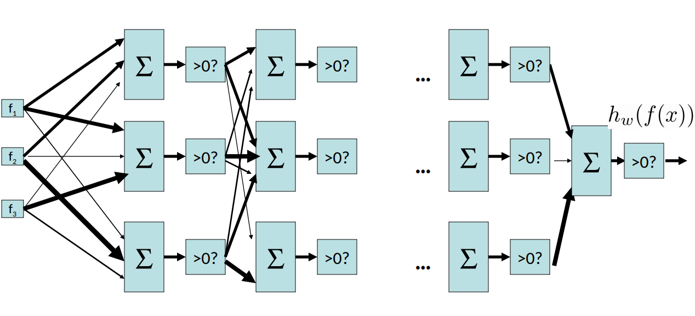
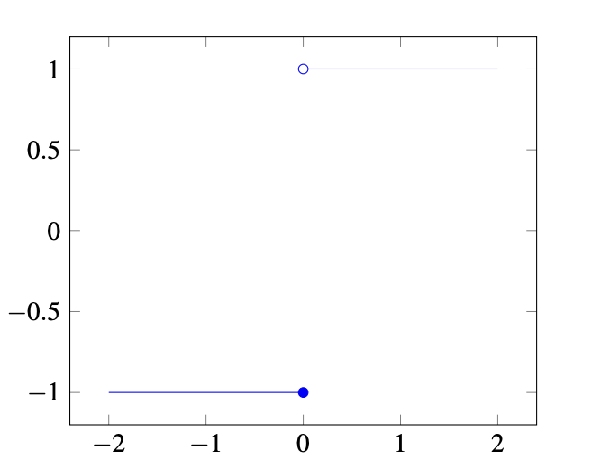
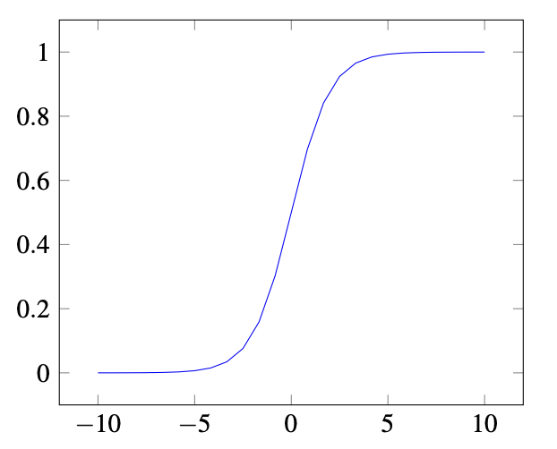
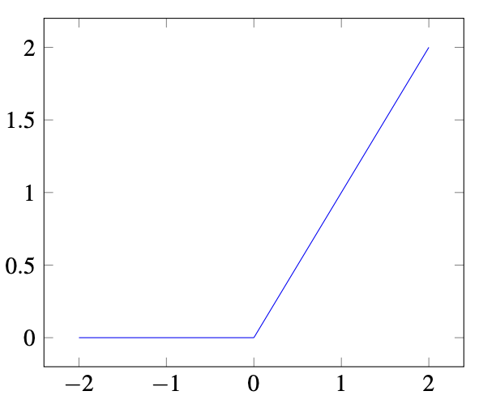

# 第九章 机器学习

作者：Nikhil Sharma

编辑：Samantha Huang、Wesley Zheng

部分内容改编自《人工智能：一种现代方法》（*Artificial Intelligence: A Modern Approach*）。

最后更新：2024 年 9 月

## 9.1 机器学习

在前几章中，我们学习了多种帮助智能体在不确定性下进行推理的模型。到目前为止，我们把所用的概率模型视为已经给定，并且把底层概率表是如何从数据中产生的过程抽象掉了。本章开始拆开这层抽象，讨论机器学习：机器学习是计算机科学的一个广泛领域，研究如何根据数据构造指定模型，或者学习指定模型的参数。

机器学习算法面对的问题和数据类型各不相同，通常按照希望完成的任务以及处理的数据类型分类。两类主要的机器学习算法是监督学习和无监督学习。

- 监督学习算法从输入数据及其对应的输出数据中推断关系，用来预测此前未见过的新输入的输出。
- 无监督学习算法只接收没有对应输出标签的输入数据，因此关注识别数据点之间或数据点内部的固有结构，并据此进行分组或处理。

本课程讨论的算法局限于监督学习任务。

准备好数据集以后，机器学习过程通常把数据分成三个不同的子集。训练数据用于实际生成从输入到输出的模型；验证数据（也叫留出数据或开发数据）用于让模型对输入作出预测，并据此计算准确率，衡量模型表现。如果表现不够好，可以调整模型特有的超参数，或改用另一种学习算法，再重新训练，直到验证结果满足要求。最后使用测试集作出预测。测试集直到开发过程的最后阶段才会被智能体看到，可以把它看作衡量模型在真实数据上表现的“期末考试”。

本章将介绍几种基础机器学习算法：朴素贝叶斯、线性回归、逻辑回归和感知机。

## 9.2 朴素贝叶斯

先看一个具体的机器学习例子：构建电子邮件垃圾邮件过滤器，把邮件分为垃圾邮件（spam）和正常邮件（ham）。这类问题称为分类问题：给定若干数据点（这里每封邮件就是一个数据点），目标是把它们归入两个或更多类别中的一个。对于分类问题，训练集包含数据点及其标签，标签通常取少数几个离散值。

我们的目标是利用训练数据——邮件以及每封邮件的 spam/ham 标签——学习一种关系，用来预测此前未见过的邮件。下面介绍一种解决分类问题的模型：朴素贝叶斯分类器。

邮件本身只是文本字符串。为了从中学习有用的规律，需要提取某些属性，称为特征。特征可以是特定单词的计数、文本模式（例如单词是否全部大写），也可以是我们能够想到的其他数据属性。

训练时具体选择哪些特征，通常取决于所解决的问题；特征选择会显著影响模型性能。决定使用哪些特征的过程称为特征工程，是机器学习的基础内容之一。本课程中可以假设给定数据集已经提供了提取好的特征。本文用 $f(x)$ 表示在把输入 $x$ 放入模型之前应用的特征函数。

假设词典中有 $n$ 个单词。从每封邮件提取一个特征向量 $F\in\mathbb{R}^n$。其中第 $i$ 个分量是随机变量 $F_i$：如果词典中的第 $i$ 个单词出现在当前邮件中，则取值为 $1$，否则为 $0$。例如，如果 $F_{200}$ 表示单词 *free*，那么 *free* 出现时 $F_{200}=1$，没有出现时 $F_{200}=0$。

如果能够构造每个特征变量 $F_i$ 与标签 $Y$ 的联合概率表，就可以根据特征向量判断邮件属于哪一类。具体来说，可以计算

$$
P(Y=\text{spam}\mid F_1=f_1,\ldots,F_n=f_n)
$$

以及

$$
P(Y=\text{ham}\mid F_1=f_1,\ldots,F_n=f_n)，
$$

然后把邮件标记为概率较大的类别。

问题在于：有 $n$ 个特征和一个标签，每个变量都可能取两个值，因此对应的联合概率表有 $2^{n+1}$ 个条目，规模随 $n$ 指数增长，实际很难使用。朴素贝叶斯通过一个贝叶斯网络解决这个问题，并作出关键的简化假设：给定类别标签后，每个特征 $F_i$ 与其他特征条件独立。

这是一个很强的建模假设，也是它被称为“朴素”的原因。但它能大幅简化推理，并且在实践中通常效果很好。根据这个假设，网络包含一张 $P(Y)$ 表，以及每个特征对应的一张 $P(F_i\mid Y)$ 表。$P(Y)$ 有 $2$ 个条目，每张二元条件概率表有 $2^2=4$ 个条目，总规模为 $4n+2$，关于 $n$ 是线性的。

这体现了统计效率中的权衡：为了让计算规模保持在可接受范围内，有时需要牺牲模型的复杂程度。当特征数量足够少时，也可以对特征之间的关系作出更多假设，即给贝叶斯网络增加边，从而构造更精细的模型。

给定特征观测值 $F_1=f_1,\ldots,F_n=f_n$ 后，可以在贝叶斯网络中进行推理，并选择条件概率最大的标签：

$$
\begin{aligned}
\operatorname{prediction}(f_1,\ldots,f_n)
&=\arg\max_y P(Y=y\mid F_1=f_1,\ldots,F_n=f_n)\\
&=\arg\max_y P(Y=y,F_1=f_1,\ldots,F_n=f_n)\\
&=\arg\max_y P(Y=y)\prod_{i=1}^{n}P(F_i=f_i\mid Y=y)。
\end{aligned}
$$

第一步利用了一个事实：归一化分布和未归一化分布的最大概率类别相同；第二步直接来自“给定类别标签后各特征相互独立”的朴素贝叶斯假设。

更一般地，假设 $Y$ 有 $k$ 个可能的类别 $y_1,\ldots,y_k$。由于

$$
P(Y=y_i\mid F_1=f_1,\ldots,F_n=f_n)
\propto P(Y=y_i,F_1=f_1,\ldots,F_n=f_n)，
$$

可以计算每个类别对应的未归一化概率：

$$
P(Y=y_i,F_1=f_1,\ldots,F_n=f_n)
=P(Y=y_i)\prod_{j=1}^{n}P(F_j=f_j\mid Y=y_i)。
$$

因此，对特征向量 $F$ 的预测就是选出上式取值最大的类别：

$$
\operatorname{prediction}(F)=\arg\max_{y_i}\left[P(Y=y_i)\prod_jP(F_j=f_j\mid Y=y_i)\right]。
$$

到这里，我们知道了朴素贝叶斯分类器的建模假设以及如何作出预测，但还没有说明如何从训练数据中学习网络所需的条件概率表。这就是参数估计要解决的问题。

### 9.2.1 参数估计

假设有一组样本或观测 $x_1,\ldots,x_N$，并且相信这些数据来自一个由未知参数 $\theta$ 参数化的分布。也就是说，每个观测的概率 $P_\theta(x_i)$ 都是 $\theta$ 的函数。例如，可以抛一枚正面概率为 $\theta$ 的硬币。

如何根据样本学习最可能的 $\theta$？如果抛硬币 10 次，观察到 7 次正面，应该选择什么样的 $\theta$？一种做法是选择使观测到样本 $x_1,\ldots,x_N$ 的概率最大的参数值。机器学习中常用的最大似然估计（maximum likelihood estimation，MLE）正是这样做的。

最大似然估计通常作出以下简化假设：

- 每个样本来自同一个分布，即所有 $x_i$ 同分布。在抛硬币例子中，每次抛掷正面的概率都相同，都是 $\theta$。
- 给定分布参数后，每个样本 $x_i$ 与其他样本条件独立。这是一个很强的假设，但它能大幅简化最大似然估计，并且通常在实践中有效。在抛硬币例子中，一次抛掷的结果不会影响其他抛掷。
- 在看到数据之前，$\theta$ 的所有可能取值都同样可能，这称为均匀先验。

前两个假设通常合称为独立同分布（independent and identically distributed，i.i.d.）。第三个假设使 MLE 成为最大后验估计（maximum a posteriori，MAP）的一种特殊情形；MAP 允许使用非均匀先验。

定义样本的似然 $L(\theta)$：它表示从该分布中抽到给定样本的概率。对固定样本 $x_1,\ldots,x_N$，似然是关于 $\theta$ 的函数：

$$
L(\theta)=P_\theta(x_1,\ldots,x_N)。
$$

利用样本 i.i.d. 的假设，似然可以写成

$$
L(\theta)=\prod_{i=1}^{N}P_\theta(x_i)。
$$

我们要找到使这个函数最大的 $\theta$。根据微积分，在函数取得极值的点，对每个输入的偏导数（组成梯度）必须为零。因此最大似然估计满足

$$
\frac{\partial}{\partial\theta}L(\theta)=0。
$$

#### 例：红球和蓝球

袋子里装着红球和蓝球，但不知道两种球各有多少个。每次取出一个球，记录颜色，再放回袋中，即有放回抽样。三次抽样结果是“红、红、蓝”。直观上可以推测袋中 $2/3$ 的球是红色，$1/3$ 的球是蓝色。

假设每次取球得到红球的概率为 $\theta$，得到蓝球的概率为 $1-\theta$。这就是伯努利分布：

$$
P_\theta(x_i)=
\begin{cases}
\theta,&x_i=\text{红};\\
1-\theta,&x_i=\text{蓝}。
\end{cases}
$$

样本的似然为

$$
\begin{aligned}
L(\theta)&=\prod_{i=1}^{3}P_\theta(x_i)\\
&=P_\theta(x_1=\text{红})P_\theta(x_2=\text{红})P_\theta(x_3=\text{蓝})\\
&=\theta^2(1-\theta)。
\end{aligned}
$$

令似然的一阶导数为零：

$$
\frac{\partial}{\partial\theta}\left[\theta^2(1-\theta)\right]
=\theta(2-3\theta)=0。
$$

解得 $\theta=2/3$。这符合直觉。另一个解是 $\theta=0$，但它对应似然函数的最小值，因为 $L(0)=0<L(2/3)=4/27$。

### 9.2.2 朴素贝叶斯中的最大似然

回到垃圾邮件分类问题。先回顾几个变量：

- $n$：词典中的单词数量。
- $N$：训练样本（邮件）的数量。令 $N_h$ 为标签是 ham 的训练样本数，令 $N_s$ 为标签是 spam 的训练样本数，因此 $N_h+N_s=N$。
- $F_i$：如果当前邮件中出现词典中的第 $i$ 个单词则为 $1$，否则为 $0$ 的随机变量。
- $Y$：取 spam 或 ham 的随机变量，取值由对应邮件的标签决定。
- $f_i^{(j)}$：训练集第 $j$ 个样本中随机变量 $F_i$ 的已实现值。也就是说，如果第 $j$ 封邮件中出现了第 $i$ 个单词，则 $f_i^{(j)}=1$，否则为 $0$。

下面的数学推导可以跳过。CS 188 要求掌握的是本节最后一段总结的结果。

在任意条件概率表 $P(F_i\mid Y)$ 中，实际上有两个不同的伯努利分布：$P(F_i\mid Y=\text{ham})$ 和 $P(F_i\mid Y=\text{spam})$。具体考虑前者，令

$$
\theta=P(F_i=1\mid Y=\text{ham})，
$$

即词典中第 $i$ 个单词出现在 ham 邮件中的概率。训练集中有 $N_h$ 封 ham 邮件，因此有 $N_h$ 次观测来判断单词 $i$ 是否出现。由于模型假设给定标签后单词出现服从伯努利分布，似然为

$$
L(\theta)=\prod_{j=1}^{N_h}P(F_i=f_i^{(j)}\mid Y=\text{ham})
=\prod_{j=1}^{N_h}\theta^{f_i^{(j)}}(1-\theta)^{1-f_i^{(j)}}。
$$

第二个等式来自一个简单技巧：如果 $f_i^{(j)}=1$，则对应因子是 $\theta^1(1-\theta)^0=\theta$；如果 $f_i^{(j)}=0$，则对应因子是 $\theta^0(1-\theta)^1=1-\theta$。

直接对 $L(\theta)$ 求导并解出 $\theta$ 很困难。常见技巧是改为最大化似然的对数。由于 $\log(x)$ 是严格递增的函数，使 $\log L(\theta)$ 最大的参数也会使 $L(\theta)$ 最大：

$$
\begin{aligned}
\log L(\theta)
&=\log\prod_{j=1}^{N_h}\theta^{f_i^{(j)}}(1-\theta)^{1-f_i^{(j)}}\\
&=\sum_{j=1}^{N_h}\log\left(\theta^{f_i^{(j)}}(1-\theta)^{1-f_i^{(j)}}\right)\\
&=\sum_{j=1}^{N_h}\left[f_i^{(j)}\log\theta+(1-f_i^{(j)})\log(1-\theta)\right]。
\end{aligned}
$$

令导数为零：

$$
\frac{\partial}{\partial\theta}\log L(\theta)
=\frac{1}{\theta}\sum_{j=1}^{N_h}f_i^{(j)}
-\frac{1}{1-\theta}\sum_{j=1}^{N_h}(1-f_i^{(j)})=0。
$$

整理可得

$$
\sum_{j=1}^{N_h}f_i^{(j)}=\theta N_h，
$$

因此

$$
\hat\theta=\frac{1}{N_h}\sum_{j=1}^{N_h}f_i^{(j)}。
$$

结果非常简单：$\theta=P(F_i=1\mid Y=\text{ham})$ 的最大似然估计，就是出现第 $i$ 个单词的 ham 邮件数量除以 ham 邮件总数。这个结论也可以推广到多个类别和每个特征有多个取值的情形。

对于采用伯努利特征分布的朴素贝叶斯模型，在给定类别中，某一结果的最大似然概率等于该结果出现的次数除以该类别的样本总数。

### 9.2.3 平滑

最大似然估计很强大，但糟糕的训练数据会造成问题。例如，如果训练集中每一封包含单词 “minute” 的邮件都被标记为 spam，模型可能学到

$$
P(F_{\text{minute}}=1\mid Y=\text{ham})=0。
$$

于是对于一封未见过的邮件，只要出现 *minute*，就有

$$
P(Y=\text{ham})\prod_iP(F_i\mid Y=\text{ham})=0，
$$

模型永远不会把包含这个单词的邮件分类为 ham。这是过拟合的经典例子：模型对训练数据拟合得过度，无法很好地泛化到此前未见过的数据。训练数据中没有出现某个词，并不代表测试数据或现实世界中不会出现它。

朴素贝叶斯分类器的过拟合可以用拉普拉斯平滑缓解。强度为 $k$ 的拉普拉斯平滑，在概念上相当于假设每种结果额外出现了 $k$ 次。如果结果 $x$ 有 $|\mathcal X|$ 个可能取值，样本量为 $N$，最大似然估计是

$$
P_{\mathrm{MLE}}(x)=\frac{\operatorname{count}(x)}{N}。
$$

那么强度为 $k$ 的拉普拉斯估计为

$$
P_{\mathrm{LAP},k}(x)=\frac{\operatorname{count}(x)+k}{N+k|\mathcal X|}。
$$

这个式子表示：假设每个结果额外出现 $k$ 次，因此把 $\operatorname{count}(x)$ 换成 $\operatorname{count}(x)+k$；$|\mathcal X|$ 个结果各增加 $k$ 次，所以总样本数增加 $k|\mathcal X|$。对条件概率同样成立：

$$
P_{\mathrm{LAP},k}(x\mid y)=\frac{\operatorname{count}(x,y)+k}{\operatorname{count}(y)+k|\mathcal X|}。
$$

拉普拉斯平滑有两个值得注意的极端情形。$k=0$ 时，

$$
P_{\mathrm{LAP},0}(x)=P_{\mathrm{MLE}}(x)。
$$

$k=\infty$ 时，额外观察到的无限多个样本会让真实数据的影响消失，所有结果等可能：

$$
P_{\mathrm{LAP},\infty}(x)=\frac{1}{|\mathcal X|}。
$$

实际模型中适合的 $k$ 通常通过试错决定。$k$ 是一个超参数，可以尝试不同取值，再用验证集上的预测准确率选择表现最好的值。

## 9.3 感知机

### 9.3.1 线性分类器

朴素贝叶斯的核心思想是从训练数据中提取特征，然后估计给定特征时标签的概率 $P(y\mid f_1,f_2,\ldots,f_n)$。对于新的数据点，先提取相应特征，再选择条件概率最大的标签。这要求先用最大似然估计概率分布。

如果不估计概率分布，会怎样？先看一个简单的线性分类器。它可以用于二分类，标签只有正类和负类两种可能。

线性分类器用特征的线性组合进行分类，这个值称为激活值。具体来说，激活函数接收一个数据点，把每个特征 $f_i(x)$ 乘以对应权重 $w_i$，再把所得结果相加。用向量形式表示：

$$
\begin{aligned}
h_w(x)&=\sum_iw_if_i(x)\\
&=w^T f(x)=w\cdot f(x)。
\end{aligned}
$$

二分类时，根据激活值的正负分类：

$$
\operatorname{classify}(x)=
\begin{cases}
+,&h_w(x)>0;\\
-,&h_w(x)<0。
\end{cases}
$$

从几何上看，利用点积

$$
h_w(x)=w\cdot f(x)=\lVert w\rVert\lVert f(x)\rVert\cos\theta，
$$

其中 $\theta$ 是 $w$ 与 $f(x)$ 的夹角。向量长度总是非负的，而分类只看激活值的符号，因此真正决定类别的是 $\cos\theta$：

$$
\operatorname{classify}(x)=
\begin{cases}
+,&\cos\theta>0;\\
-,&\cos\theta<0。
\end{cases}
$$

当 $\theta<\pi/2$ 时，$\cos\theta\in(0,1]$，属于正类；当 $\theta>\pi/2$ 时，$\cos\theta\in[-1,0)$，属于负类。也就是说，简单的线性分类器检查新数据点的特征向量是否大致指向预先确定的权重向量方向：夹角小于 $90^\circ$ 时预测正类，夹角大于 $90^\circ$ 时预测负类。

还要考虑 $h_w(x)=w^Tf(x)=0$ 的点。此时 $\cos\theta=0$，也就是 $\theta=\pi/2$，特征向量与 $w$ 正交。所有这些点构成一条与 $w$ 正交的虚线，激活值为零。

这条线称为决策边界，因为它把预测为正类的区域与预测为负类的区域分开。在更高维度中，线性决策边界通常称为超平面。超平面是比潜在空间低一维的线性曲面，会把空间分成两部分。对于一般的非线性分类器，决策边界不必是线性的，只需是特征向量空间中把类别分隔开的曲面。落在决策边界上的点可以任意分配标签，因为两类都同样合理；下面的算法把边界上的点归为正类。

## 9.4 二元感知机

现在已经知道线性分类器如何工作，但如何构造一个好的线性分类器？有标签的正确类别的数据称为训练集。构建分类器时，需要在训练数据上评估分类器，将预测结果与训练标签比较，再调整分类器参数，直到达到目标。

二元感知机是线性分类器的一种具体实现。它是二分类器，也可以扩展到两个以上的类别。二元感知机的目标是找到一条能够完美分隔训练数据的决策边界，即找到最好的权重向量 $w$，使每个带特征的训练点都能被正确分类。

### 算法

感知机算法如下：

1. 将所有权重初始化为 $0$：$w=0$。
2. 对每个训练样本（特征为 $f(x)$，真实类别标签为 $y^*\in\{-1,+1\}$）：
   1. 用当前权重分类样本，令 $y$ 为预测类别：

      $$
      y=\operatorname{classify}(x)=
      \begin{cases}
      +1,&h_w(x)=w^Tf(x)>0;\\
      -1,&h_w(x)=w^Tf(x)<0。
      \end{cases}
      $$

   2. 将预测标签 $y$ 与真实标签 $y^*$ 比较：
      - 如果 $y=y^*$，什么也不做。
      - 如果 $y\ne y^*$，更新权重：$w\leftarrow w+y^*f(x)$。
3. 如果遍历整个训练集时一次也没有更新权重，说明所有样本都预测正确，终止；否则重复第 2 步。

### 更新权重

分类正确时权重不变；分类错误时按照

$$
w\leftarrow w+y^*f(x)
$$

更新，其中 $y^*$ 是真实标签，取 $1$ 或 $-1$，$x$ 是被错分的训练样本。这个规则可以分为两种情况：

- 把正类错分为负类：$w\leftarrow w+f(x)$。
- 把负类错分为正类：$w\leftarrow w-f(x)$。

为什么这样有效？把它看作一种平衡过程。错分通常意味着某个训练样本的激活值太小或太大。以“正类被错分为负类”为例，激活值本来应该为正，却是负的，因此需要让激活值变大：

$$
\begin{aligned}
h_{w+f(x)}(x)&=(w+f(x))^Tf(x)\\
&=w^Tf(x)+f(x)^Tf(x)\\
&=h_w(x)+f(x)^Tf(x)。
\end{aligned}
$$

新激活值增加了 $f(x)^Tf(x)$。这个数为正，因此更新确实使激活值变大，更接近正类。另一种情况的推导完全类似：当激活值太大时，更新会让它减少 $f(x)^Tf(x)$，使其更接近正确类别。

为什么更新量使用样本的特征，而不是对所有权重作相同幅度的修改？因为得分由权重和当前样本共同决定，样本的不同特征对得分贡献不同。例如某个负类样本的特征为

$$
f(x)=\begin{bmatrix}4\\0\\1\end{bmatrix},\qquad
w^T=\begin{bmatrix}2&2&2\end{bmatrix},\qquad
h_w(x)=2\times4+2\times0+2\times1=10。
$$

为了正确分类，权重需要变小，因为激活值应当为负。但第一个特征 $4$ 对得分贡献很大，第二个特征为 $0$、完全没有贡献，第三个特征贡献较小。因此合理的更新应当大幅修改第一个权重，不修改第二个权重，只小幅修改第三个权重；直接减去特征向量恰好会产生这种效果。

对于当前被错分的正类样本，把它的特征向量加到权重向量上，会减小权重向量与该特征向量之间的夹角，同时移动决策边界。移动幅度足够时，样本就会落到正确的一侧；但一次更新并不保证一定修正错误，这取决于权重向量的大小以及样本距离边界有多远。

> 注：上面的图示在在线讲义中作为外部资源引用；用户提供的 PDF 未包含可提取的对应位图，因此这里保留文字推导，不伪造一个“原始图片”。

### 偏置

如果直接实现目前为止的感知机，会发现一个不太方便的限制：任何决策边界都必须经过原点。也就是说，感知机只能产生形如

$$
w^Tf(x)=0
$$

的边界。但即便数据确实可以被某条线性边界分隔，这条边界也可能不经过原点。

解决方法是增加偏置项：给每个样本特征向量增加一个恒为 $1$ 的特征，同时给权重向量增加该特征对应的权重。这样决策边界可以写成

$$
w^Tf(x)+b=0，
$$

其中 $b$ 是加权偏置项，也就是扩展权重向量中最后一个权重乘以恒为 $1$ 的特征。

几何上，需要在比带特征数据空间高一维的空间中理解这个变化：不带偏置时，边界只能经过原点；带偏置时，可以在更高维空间中移动对应的边界。

### 例：运行一次感知机更新

设偏置特征恒为 $1$，从权重向量 $[w_0,w_1,w_2]=[-1,0,0]$ 开始。训练集为：

| 编号 | $f_1$ | $f_2$ | $y^*$ |
| ---: | ---: | ---: | :---: |
| 1 | 1 | 1 | $-$ |
| 2 | 3 | 2 | $+$ |
| 3 | 2 | 4 | $+$ |
| 4 | 3 | 4 | $+$ |
| 5 | 2 | 3 | $-$ |

按顺序遍历数据并作一次更新：

| 步骤 | 权重 | 得分 | 是否正确 | 更新 |
| ---: | :--- | :--- | :---: | :--- |
| 1 | $[-1,0,0]$ | $-1\times1+0\times1+0\times1=-1$ | 是 | 无 |
| 2 | $[-1,0,0]$ | $-1\times1+0\times3+0\times2=-1$ | 否 | $+[1,3,2]$ |
| 3 | $[0,3,2]$ | $0\times1+3\times2+2\times4=14$ | 是 | 无 |
| 4 | $[0,3,2]$ | $0\times1+3\times3+2\times4=17$ | 是 | 无 |
| 5 | $[0,3,2]$ | $0\times1+3\times2+2\times3=12$ | 否 | $-[1,2,3]$ |
| 6 | $[-1,1,-1]$ | — | — | — |

这里只展示一次遍历。实际运行中，算法还会进行更多轮遍历，直到某一轮中所有数据点都被正确分类。

### 9.4.1 多类别感知机

前面介绍的是二元分类器，但感知机可以很容易地扩展到多个类别。二分类只有一个权重向量，其维度等于特征数（加上偏置特征）；多分类时，每个类别都有一个权重向量。三分类就有三个权重向量。

分类时，用特征向量分别与每个类别的权重向量作点积，得分最高的类别就是预测结果。例如，令

$$
f(x)=[-2,3,1]，
$$

三个类别的权重为

$$
w_0=[-2,2,1],\qquad w_1=[0,3,4],\qquad w_2=[1,4,-2]。
$$

三个得分分别是 $s_0=11$、$s_1=13$、$s_2=8$，所以预测 $x$ 属于类别 $1$。

实际实现中通常不会把权重保存成三个独立结构，而是把它们堆叠成权重矩阵。这样不必分别计算多个点积，只需做一次矩阵—向量乘法：

$$
W=\begin{bmatrix}-2&2&1\\0&3&4\\1&4&-2\end{bmatrix},\qquad
x=\begin{bmatrix}-2\\3\\1\end{bmatrix}。
$$

于是

$$
\arg\max(Wx)=\arg\max\begin{bmatrix}11\\13\\8\end{bmatrix}=1。
$$

权重更新也相应改变。如果分类正确，什么也不做；如果预测类别为 $y$、真实类别为 $y^*$ 且二者不同，就把特征向量加到真实类别 $y^*$ 的权重上，并从预测类别 $y$ 的权重中减去它。

例如上面的例子中，如果真实类别是 $2$、预测类别是 $1$，则

$$
w_1\leftarrow[0,3,4]-[-2,3,1]=[2,0,3]，
$$

$$
w_2\leftarrow[1,4,-2]+[-2,3,1]=[-1,7,-1]。
$$

这相当于奖励正确的权重向量，惩罚误导预测的权重向量，其他权重向量保持不变。剩余算法与二元情形相同：遍历样本，出现错误时更新权重，直到不再出错。要加入偏置项，只需像二元感知机那样给每个特征向量增加一个恒为 $1$ 的特征，并给每个类别的权重向量增加相应权重，也就是在矩阵中增加一列。

## 9.5 线性回归

下面从朴素贝叶斯转向线性回归。线性回归也叫最小二乘法，可以追溯到 Carl Friedrich Gauss，是机器学习和计量经济学中研究最充分的工具之一。

回归问题是输出为连续变量 $y$ 的机器学习问题。特征可以是连续的，也可以是类别型的。对于 $n$ 个特征，令 $x\in\mathbb R^n$，即 $x=(x_1,\ldots,x_n)$。

使用以下线性模型预测输出：

$$
h_w(x)=w_0+w_1x_1+\cdots+w_nx_n。
$$

模型权重 $w_i$ 是需要估计的量。$w_0$ 是截距。有时在特征向量前面补一个 $1$，把模型写成 $w^Tx$，此时 $x\in\mathbb R^{n+1}$。

为了训练模型，需要度量预测结果与真实输出的差异。使用 $L_2$ 损失函数，以 $L_2$ 范数惩罚预测值和真实值之间的差异。若训练集有 $N$ 个数据点，则

$$
\begin{aligned}
\operatorname{Loss}(h_w)
&=\frac12\sum_{j=1}^{N}L_2(y^j,h_w(x^j))\\
&=\frac12\sum_{j=1}^{N}(y^j-h_w(x^j))^2\\
&=\frac12\lVert y-Xw\rVert_2^2。
\end{aligned}
$$

其中 $1/2$ 只是为了让闭式解的表达式更简单。$y$、$X$ 和 $w$ 定义为

$$
y=\begin{bmatrix}y^1\\y^2\\\vdots\\y^N\end{bmatrix},\qquad
X=\begin{bmatrix}
1&x_1^1&\cdots&x_n^1\\
1&x_1^2&\cdots&x_n^2\\
\vdots&\vdots&\ddots&\vdots\\
1&x_1^N&\cdots&x_n^N
\end{bmatrix},\qquad
w=\begin{bmatrix}w_0\\w_1\\\vdots\\w_n\end{bmatrix}。
$$

$y$ 是把所有输出堆叠起来的向量，$X$ 是特征矩阵，其中 $x_i^j$ 表示第 $j$ 个数据点的第 $i$ 个分量。

通过求导并令导数为零，可以得到使损失最小的权重 $\hat w$：

$$
\begin{aligned}
\nabla_w\frac12\lVert y-Xw\rVert_2^2
&=\nabla_w\frac12(y-Xw)^T(y-Xw)\\
&=\nabla_w\frac12(y^Ty-2w^TX^Ty+w^TX^TXw)\\
&=-X^Ty+X^TXw。
\end{aligned}
$$

令梯度为零：

$$
-X^Ty+X^TXw=0
\quad\Longrightarrow\quad
\hat w=(X^TX)^{-1}X^Ty。
$$

得到估计权重后，对新的、此前未见过的测试数据点进行预测：

$$
h_{\hat w}(x)=\hat w^Tx。
$$

## 9.6 优化

线性回归可以通过对损失函数求导并令梯度为零得到最优权重的闭式解。但一般来说，某个目标函数可能不存在闭式解。此时可以使用基于梯度的方法寻找最优权重。梯度指向目标函数增大最快的方向，因此最大化函数时沿最陡上升方向移动，最小化函数时沿最陡下降方向移动。

如果目标函数需要最大化，使用梯度上升：

```text
算法 1：梯度上升
1. 随机初始化 w。
2. 当 w 尚未收敛时：
       w ← w + α∇_w f(w)
```

如果目标是最小化损失函数，使用梯度下降。它与梯度上升的区别只是沿梯度的反方向移动：

```text
算法 2：梯度下降
1. 随机初始化 w。
2. 当 w 尚未收敛时：
       w ← w − α∇_w f(w)
```

开始时随机初始化权重。学习率用 $\alpha$ 表示，决定每一步沿梯度方向移动的大小。机器学习中很难为大多数函数预先找到最优学习率。理想的学习率要足够大，使算法快速朝正确方向移动；同时又要足够小，避免方法发散。常见做法是从相对较大的学习率开始，随着迭代次数增加逐渐减小学习率，这叫学习率衰减。

如果数据集包含大量数据点，每轮计算完整梯度可能代价很高，因此出现了随机梯度下降和批量梯度下降等方法。随机梯度下降每次只使用一个数据点计算梯度，并从数据集中随机抽取该点；因为只用一个点估计梯度，梯度可能比较嘈杂，收敛也更困难。小批量梯度下降则是折中方案：每次使用大小为 $m$ 的数据批次计算梯度，批大小 $m$ 是用户指定的参数。

以线性回归为例，损失函数为

$$
\operatorname{Loss}(h_w)=\frac12\lVert y-Xw\rVert_2^2。
$$

虽然线性回归有闭式解 $\hat w=(X^TX)^{-1}X^Ty$，也可以用梯度下降求最优权重。损失的梯度是

$$
\nabla_w\operatorname{Loss}(h_w)=-X^Ty+X^TXw。
$$

因此最小二乘梯度下降算法为：

```text
算法 3：最小二乘梯度下降
1. 随机初始化 w。
2. 当 w 尚未收敛时：
       w ← w − α(−X^Ty + X^TXw)
```

可以自行构造一个线性回归问题，验证闭式解与梯度下降收敛后的解是否相同。

## 9.7 逻辑回归

在线性回归中，假设输出是数值型实数。如果希望预测类别型变量，可以使用逻辑函数把输入特征的线性组合转为概率：

$$
h_w(x)=\frac{1}{1+e^{-w^Tx}}。
$$

虽然名称中有“回归”，逻辑回归实际上用于解决分类问题，而非回归问题。逻辑函数

$$
g(z)=\frac{1}{1+e^{-z}}
$$

常用于建模二元输出。它的输出总在 $0$ 和 $1$ 之间，可以理解为数据点属于标签为 $1$ 的类别的概率。训练好逻辑回归以后，对新数据点计算逻辑函数输出：大于 $0.5$ 时预测标签 $1$，否则预测标签 $0$。

更具体地，令 $f(x)$ 表示特征向量的特征函数（很多时候就是恒等函数），用分号表示概率是参数 $w$ 的函数，则

$$
P(y=+1\mid f(x);w)=\frac{1}{1+e^{-w^Tf(x)}}，
$$

$$
P(y=-1\mid f(x);w)=1-\frac{1}{1+e^{-w^Tf(x)}}。
$$

逻辑函数的一个有用性质是

$$
g'(z)=g(z)(1-g(z))。
$$

逻辑回归使用 $L_2$ 损失：

$$
\operatorname{Loss}(w)=\frac12(y-h_w(x))^2。
$$

逻辑回归没有可直接使用的闭式解，因此通过梯度下降估计未知权重。利用微分链式法则，损失函数对第 $i$ 个权重的偏导数为

$$
\frac{\partial}{\partial w_i}\frac12(y-h_w(x))^2
=-(y-h_w(x))h_w(x)(1-h_w(x))x_i。
$$

这里使用了 $g'(z)=g(z)(1-g(z))$。然后即可用梯度下降估计权重，并按照前面所述的规则作出预测。

## 9.8 多类别逻辑回归

多类别逻辑回归要把数据点分到 $K$ 个类别，而非两个类别。因此，模型需要输出新数据点属于每个可能类别的概率估计。这里用 softmax 函数替代逻辑函数：

$$
P(y=i\mid f(x);w)=\frac{e^{w_i^Tf(x)}}{\sum_{k=1}^{K}e^{w_k^Tf(x)}}。
$$

这些概率之和为 $1$，构成有效的概率分布。设观测到 $n$ 个带标签数据点 $(x_i,y_i)$，样本联合概率定义的似然记为 $\ell(w_1,\ldots,w_K)$：

$$
\ell(w_1,\ldots,w_K)=\prod_{i=1}^{n}P(y_i\mid f(x_i);w)。
$$

为了找到使似然最大的参数，对每个参数计算似然的梯度，令其为零并求解。若没有闭式解，就计算梯度并使用梯度上升求最优值。

常见技巧是先对似然取对数，因为对数会把乘积变成求和，简化梯度计算。由于对数是严格递增函数，这个变换不会改变最大值位置。

对每个数据点 $i$，定义 $K$ 个指示变量 $t_{i,k}$（$k=1,\ldots,K$）：当 $y_i=k$ 时 $t_{i,k}=1$，否则为 $0$。于是似然可以写成

$$
\ell(w_1,\ldots,w_K)
=\prod_{i=1}^{n}\prod_{k=1}^{K}
\left(\frac{e^{w_k^Tf(x_i)}}{\sum_{\ell=1}^{K}e^{w_\ell^Tf(x_i)}}\right)^{t_{i,k}}。
$$

对数似然为

$$
\log\ell(w_1,\ldots,w_K)
=\sum_{i=1}^{n}\sum_{k=1}^{K}t_{i,k}
\log\left(\frac{e^{w_k^Tf(x_i)}}{\sum_{\ell=1}^{K}e^{w_\ell^Tf(x_i)}}\right)。
$$

接下来估计使这个目标最大的 $w_i$。对 $w_j$ 求梯度得到

$$
\nabla_{w_j}\log\ell(w)
=\sum_{i=1}^{n}\left[
t_{i,j}-\frac{e^{w_j^Tf(x_i)}}{\sum_{\ell=1}^{K}e^{w_\ell^Tf(x_i)}}
\right]f(x_i)。
$$

这里使用了 $\sum_k t_{i,k}=1$。

## 9.9 神经网络：动机

下面介绍神经网络。会用到二元逻辑回归和多类别逻辑回归中发展出的建模技术。

### 9.9.1 非线性分隔面

我们已经知道如何构造学习二分类线性边界的模型。这在最优决策边界本身是线性时很有效。然而，许多实际问题需要非线性的决策边界，线性感知机没有足够的表达能力来捕获这些关系。

考虑下面的一组数据。目标是把两种颜色的点分开，但在一维空间中无法做到这一点，因为一维决策边界只是一个点，只能把数轴分成两个区域。



一种解决方法是增加特征（特征也可以是非线性的），从而构造新的决策边界。例如把 $x^2$ 作为特征加入原数据：



加入这个信息后，就可以在包含这些点的二维空间中构造线性分隔面。这里通过手工增加有用特征，把数据映射到更高维空间，从而解决了问题。但在图像分类等高维问题中，手动选择有用特征十分繁琐，需要领域专家知识，也妨碍模型跨任务泛化。更自然的目标是让模型也学习这种特征变换，并使用能够表示更广泛函数的非线性函数族。

### 9.9.2 多层感知机

考虑如何从原始感知机结构导出更复杂的函数。下面的两层感知机把另一个感知机的输出作为输入：



可以把这个结构推广到 $N$ 层感知机：



增加这些结构和权重后，可以表示更广泛的函数。模型复杂度提高以后，表达能力也显著增强。多层感知机提供了表示广泛函数的通用方法；事实上，多层感知机是通用函数逼近器，可以表示任意实函数。剩下的问题是选择参数化网络的最佳权重。

#### 9.9.2.1 定理：通用函数逼近器

具有足够多神经元的两层神经网络，可以以任意期望精度逼近任意连续函数。

### 9.9.3 衡量准确率

二元感知机进行 $n$ 次预测后的准确率可以写成

$$
\ell_{\mathrm{acc}}(w)=\frac1n\sum_{i=1}^{n}
\left(\operatorname{sgn}(w\cdot f(x_i))=y_i\right)，
$$

其中 $x_i$ 是第 $i$ 个数据点，$w$ 是权重向量，$f$ 是从原始数据点导出特征向量的函数，$y_i$ 是 $x_i$ 的真实类别标签。这里 $\operatorname{sgn}(x)$ 是指示函数：$x$ 为负时取 $-1$，$x$ 为正时取 $1$。这个准确率函数等于正确预测数除以预测总数。

有时需要比二元标签更有表现力的输出。此时可以为 $N$ 个类别分别输出概率，表示数据点属于各类别的确信程度。像多类别逻辑回归一样，为每个类别 $j$ 存储一个权重向量，并用 softmax 估计概率：

$$
\sigma(x_i)_j
=\frac{e^{f(x_i)^Tw_j}}{\sum_{\ell=1}^{N}e^{f(x_i)^Tw_\ell}}
=P(y_i=j\mid f(x_i);w)。
$$

给定 $f$ 输出的向量，softmax 会把它归一化为概率分布。可以用这个概率分布构造一组权重的似然：

$$
\ell(w)=\prod_{i=1}^{n}P(y_i\mid f(x_i);w)。
$$

这个式子表示一组特定权重解释观测标签和数据点的可能性。目标是找到使该量最大的权重。这等价于最大化对数似然：

$$
\log\ell(w)=\log\prod_{i=1}^{n}P(y_i\mid f(x_i);w)
=\sum_{i=1}^{n}\log P(y_i\mid f(x_i);w)。
$$

### 9.9.4 多层前馈神经网络

现在引入人工神经网络。和多层感知机一样，在每个感知机节点之后应用一个非线性函数。这些非线性使整个网络变得非线性、表达能力更强。如果没有它们，多层感知机只是线性函数的复合，整体仍然是线性的。

多层感知机使用阶跃函数：

$$
f(x)=
\begin{cases}
1,&x\ge0;\\
-1,&\text{其他情况}。
\end{cases}
$$

阶跃函数不连续，并且几乎处处导数为零，因此很难优化。可以改用连续函数，例如 sigmoid 函数或修正线性单元（rectified linear unit，ReLU）。

#### 9.9.4.1 Sigmoid 函数

$$
\sigma(x)=\frac{1}{1+e^{-x}}。
$$





#### 9.9.4.2 ReLU

$$
f(x)=
\begin{cases}
0,&x<0;\\
x,&x\ge0。
\end{cases}
$$



在多层感知机中，每一层的输出都要应用其中一种非线性函数。选择哪一种非线性函数是模型设计决策，通常需要通过实验确定。

### 9.9.5 损失函数与多元优化

了解前馈神经网络的结构后，还需要一种训练方法。回到对数似然函数，可以推导出一个直观的权重优化算法。

为了最大化对数似然函数，对它求导得到梯度向量：

$$
\nabla_w\ell(w)=\left[
\frac{\partial\ell(w)}{\partial w_1},\ldots,
\frac{\partial\ell(w)}{\partial w_n}
\right]。
$$

使用梯度上升寻找参数的最优值。由于数据集通常很大，批量梯度上升是神经网络优化中最常用的梯度上升变体。

## 本章小结

本章从“如何从数据中学习模型参数”出发，介绍了监督学习的基本流程，以及朴素贝叶斯、最大似然估计、拉普拉斯平滑、线性分类器、二元和多类别感知机、线性回归、梯度优化、逻辑回归、多类别逻辑回归和神经网络。它们共同体现了机器学习中的核心循环：选择模型表示，定义损失或似然，用数据估计参数，再用验证数据检验泛化能力。
