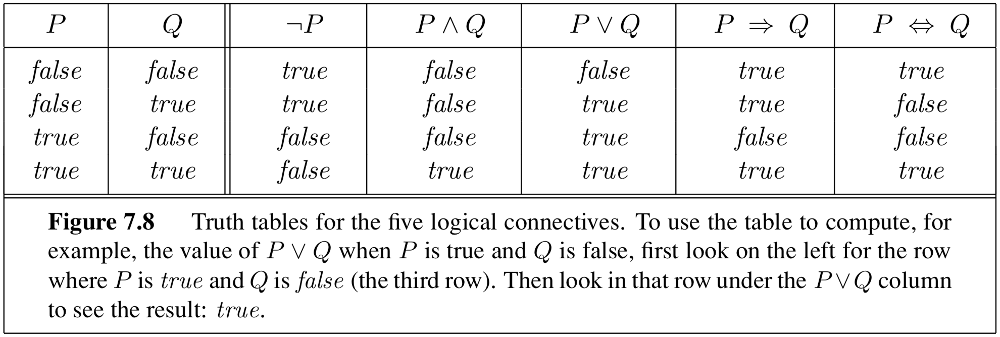
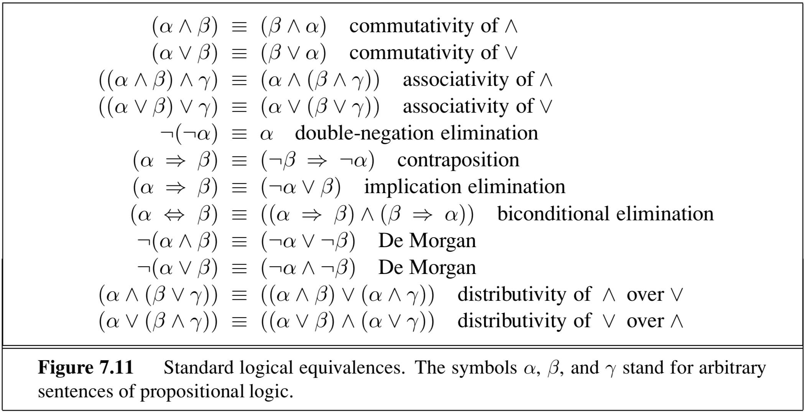
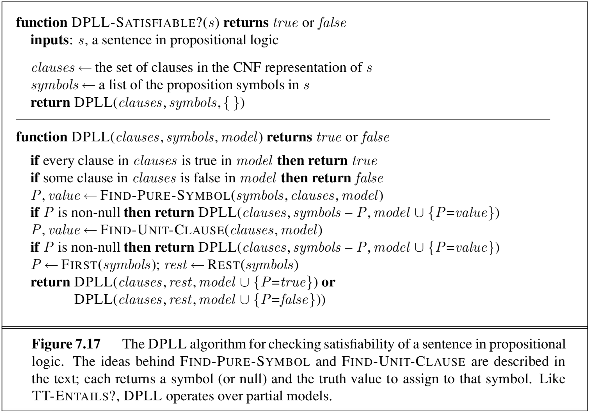
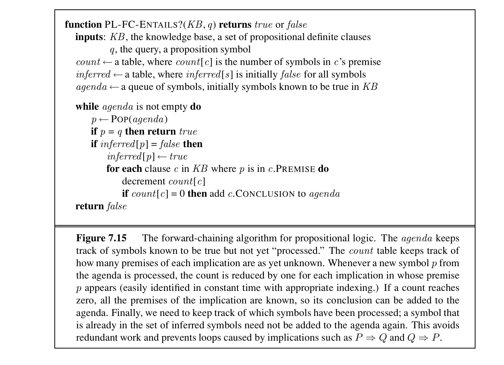
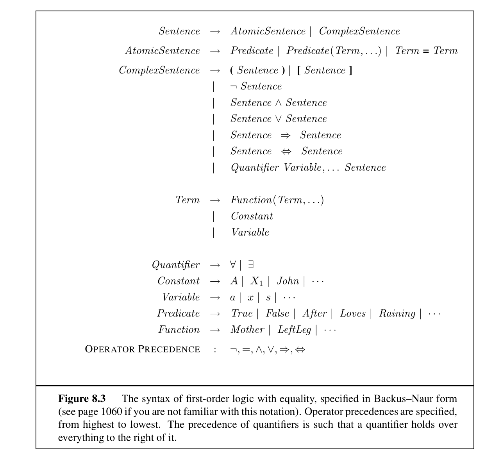
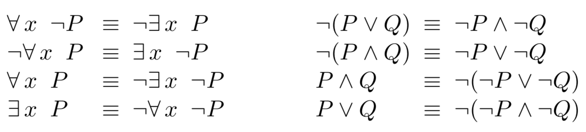

# 第十章 逻辑

作者：Henry Zhu

编辑：Peyrin Kao、Danial Toktarbayev、Wesley Zheng

部分内容改编自《人工智能：一种现代方法》（*Artificial Intelligence: A Modern Approach*）。

最后更新：2024 年 9 月

## 10.1 基于知识的智能体

想象一个充满熔岩的危险世界，远处有一片安全的绿洲。我们希望智能体能够从当前位置安全地走到绿洲。

在强化学习中，我们通常假设能够提供给智能体的唯一指导是奖励函数。奖励函数像“冷或热”游戏一样，把智能体逐渐推向正确方向。智能体探索世界并收集更多观测后，会逐渐学会把某些行动与未来的正奖励联系起来，把另一些行动与令人不快的灼热死亡联系起来。这样，它可能学会识别世界中的某些线索并据此行动。例如，如果它感觉空气变热，就应该转向另一个方向。

还可以考虑另一种策略：直接告诉智能体一些关于世界的事实，让它根据手头的信息进行推理。如果告诉智能体熔岩坑附近的空气又热又朦胧，水体附近的空气清新凉爽，那么智能体就可以根据大气读数合理地推断哪些区域危险、哪些区域安全。

这种智能体称为基于知识的智能体（knowledge-based agent）。它维护一个知识库（knowledge base），知识库是逻辑句子的集合，用来编码我们告诉智能体的内容以及智能体自己观察到的内容。智能体还能够进行逻辑推理，从已有信息中得出新的结论。

## 10.2 逻辑语言

和其他语言一样，逻辑句子也要使用特殊语法书写。每个逻辑句子都编码了关于某个世界的命题，而这个命题可能为真，也可能为假。例如，“地板是熔岩”在智能体所在的世界中可能为真，但在我们的世界中大概为假。把简单句子用逻辑连接词连接起来，就可以构造复杂句子，例如“从 Big C 可以看到整个校园，并且徒步是学习之余的健康休息”。

逻辑语言有五种连接词：

- **否定 $\neg$**：$\neg P$ 当且仅当（iff）$P$ 为假时为真。原子句 $P$ 和 $\neg P$ 称为文字（literal）。
- **合取 $\land$**：$A\land B$ 当且仅当 $A$ 和 $B$ 都为真时为真。这样的句子称为合取式，组成它的命题称为合取项。
- **析取 $\lor$**：$A\lor B$ 当且仅当 $A$ 或 $B$ 为真时为真。这样的句子称为析取式，组成它的命题称为析取项。
- **蕴含 $\Rightarrow$**：$A\Rightarrow B$ 除了 $A$ 为真且 $B$ 为假以外都为真。
- **双条件 $\Leftrightarrow$**：$A\Leftrightarrow B$ 当且仅当 $A$ 与 $B$ 同时为真，或者同时为假时为真。



## 10.3 命题逻辑

逻辑和其他语言一样有多种方言。本章介绍命题逻辑和一阶逻辑两种。命题逻辑的句子由命题符号组成，命题符号之间可以用逻辑连接词连接。命题符号通常用一个大写字母表示，每个符号代表关于世界的一个原子命题。

一个模型是给所有命题符号分配真或假的结果，也可以把它理解成一个“可能世界”。例如，令

- $A$ 表示“今天下雨”；
- $B$ 表示“我忘带雨伞”。

所有可能模型为：

1. $\{A=\text{真},B=\text{真}\}$：“今天下雨并且我忘带了雨伞。”
2. $\{A=\text{真},B=\text{假}\}$：“今天下雨，但我没有忘带雨伞。”
3. $\{A=\text{假},B=\text{真}\}$：“今天没有下雨，但我忘带了雨伞。”
4. $\{A=\text{假},B=\text{假}\}$：“今天没有下雨，我也没有忘带雨伞。”

一般来说，如果有 $N$ 个符号，就有 $2^N$ 个可能模型。如果一个句子在所有模型中都为真，则称它是有效的（valid），例如句子 True；如果至少有一个模型使它为真，则称它是可满足的（satisfiable）；如果没有任何模型使它为真，则称它是不可满足的（unsatisfiable）。

例如，$A\land B$ 在模型 1 中为真，因此可满足；但它在模型 2、3、4 中为假，所以不是有效的。另一方面，$\neg A\land A$ 在任何模型中都不可能为真，因此不可满足。

下面的逻辑等价式可以把句子化简为更容易处理和推理的形式。



命题逻辑中一个特别有用的句法是合取范式（conjunctive normal form，CNF）。CNF 是若干子句的合取，每个子句是文字的析取。一般形式是

$$
(P_1\lor\cdots\lor P_i)\land\cdots\land(P_j\lor\cdots\lor P_n)，
$$

也就是一个“或”的合取。后面会看到，这种形式很适合进行一些分析。

重要的是，每个逻辑句子都有逻辑等价的 CNF。这意味着知识库中的所有信息（知识库本身就是不同句子的合取）都可以转写成一个大的 CNF 句子，再把这些 CNF 用“与”连接起来。

### CNF 转换例子

假设句子为 $A\Leftrightarrow(B\lor C)$，希望把它转为 CNF。推导依据图中的逻辑等价规则：

1. 消去 $\Leftrightarrow$：

   $$
   (A\Rightarrow(B\lor C))\land((B\lor C)\Rightarrow A)。
   $$

2. 消去 $\Rightarrow$：

   $$
   (\neg A\lor B\lor C)\land(\neg(B\lor C)\lor A)。
   $$

3. 在 CNF 中，否定符号只能出现在文字上。使用德摩根定律：

   $$
   (\neg A\lor B\lor C)\land((\neg B\land\neg C)\lor A)。
   $$

4. 最后应用分配律：

   $$
   (\neg A\lor B\lor C)\land(\neg B\lor A)\land(\neg C\lor A)。
   $$

最终表达式是三个“或”子句的合取，因此处于 CNF。

## 10.4 命题逻辑推理

逻辑之所以有用且强大，是因为它能让我们从已知信息得出新的结论。先定义推理问题中的术语。

如果在所有 $A$ 为真的模型中 $B$ 也为真，就说句子 $A$ 蕴含句子 $B$，记作

$$
A\models B。
$$

如果 $A\models B$，则 $A$ 的模型集合是 $B$ 的模型集合的子集，即 $M(A)\subseteq M(B)$。推理问题可以表述为判断

$$
KB\models q，
$$

其中 $KB$ 是逻辑句子组成的知识库，$q$ 是查询。

可以利用以下两个定理判断蕴含：

1. $A\models B$ 当且仅当 $A\Rightarrow B$ 有效。通过证明 $A\Rightarrow B$ 有效来证明蕴含，称为直接证明。
2. $A\models B$ 当且仅当 $A\land\neg B$ 不可满足。通过证明 $A\land\neg B$ 不可满足来证明蕴含，称为反证法。

### 10.4.1 模型检查

判断 $KB\models q$ 的一个简单算法是枚举所有可能模型，检查其中所有使 $KB$ 为真的模型是否也使 $q$ 为真。这种方法称为模型检查。命题符号数量适中时，可以直接画真值表完成枚举。

命题逻辑有 $N$ 个符号时，需要检查 $2^N$ 个模型，因此时间复杂度为 $O(2^N)$。一阶逻辑的模型数量则可能是无限的。命题蕴含问题实际上是 co-NP 完全问题。最坏情况下运行时间不可避免地随问题规模指数增长，但有些算法在实践中可以快得多。本节讨论两个命题逻辑模型检查算法。

第一个算法由 Davis、Putnam、Logemann 和 Loveland 提出，简称 DPLL。它本质上是在可能模型上的深度优先回溯搜索，并使用三个技巧减少过多的回溯。DPLL 旨在解决可满足性问题：给定一个句子，寻找所有符号的一个可行赋值。蕴含问题可以归约为可满足性问题，即证明 $A\land\neg B$ 不可满足；DPLL 接收的输入通常是 CNF。

可把可满足性写成约束满足问题：变量（节点）是符号，约束是 CNF 施加的逻辑限制。DPLL 持续给符号赋真值，直到找到满足模型，或者某个符号无法在不违反逻辑约束的情况下赋值，此时回溯到上一个可行赋值。

DPLL 比普通回溯搜索多了三个改进：

1. **提前终止**：一个子句只要有一个符号为真就为真，因此在所有符号都赋值前，就可能知道整个句子为真；一个子句只要为假，整个合取句子就为假。尽早判断整个句子已经为真或为假，可以避免无意义地搜索子树。
2. **纯符号启发式**：如果一个符号在整个句子中只以正形式出现，或者只以负形式出现，就称它为纯符号。纯符号可以立刻赋为真或假。例如在

   $$
   (A\lor B)\land(\neg B\lor C)\land(\neg C\lor A)
   $$

   中，$A$ 是唯一的纯符号，可以立即令 $A=\text{真}$，把问题简化为寻找 $(\neg B\lor C)$ 的满足赋值。
3. **单元子句启发式**：单元子句只有一个文字，或者说除了一个文字外其他文字都已经为假。单元子句中的文字只有一种有效赋值。例如，要让

   $$
   (B\lor\text{假}\lor\cdots\lor\text{假})
   $$

   为真，必须令 $B=\text{真}$。



### 10.4.2 DPLL 示例

考虑以下 CNF 句子：

$$
\begin{aligned}
&(\neg N\lor\neg S)\land(M\lor Q\lor N)\land(L\lor\neg M)\land(L\lor\neg Q)\\
&\quad\land(\neg L\lor\neg P)\land(R\lor P\lor N)\land(\neg R\lor\neg L)\land(S)。
\end{aligned}
$$

要用 DPLL 判断它是否可满足。假设变量顺序固定为字母顺序，取值顺序固定为先尝试真再尝试假。

每次递归调用 DPLL 都记录三项：

- `model`：已经赋值的符号及其取值；
- `symbols`：还没有赋值的符号；
- `clauses`：本次调用或后续递归调用还需要处理的 CNF 子句。

初始调用为：

```text
model:   {}
symbols: [L, M, N, P, Q, R, S]
clauses: (¬N ∨ ¬S) ∧ (M ∨ Q ∨ N) ∧ (L ∨ ¬M) ∧ (L ∨ ¬Q)
         ∧ (¬L ∨ ¬P) ∧ (R ∨ P ∨ N) ∧ (¬R ∨ ¬L) ∧ (S)
```

首先检查提前终止。当前模型没有给任何符号赋值，因此还不能判断某个子句为真或为假。然后检查纯文字：没有符号只以正形式或只以负形式出现。接着检查单元子句，发现 $(S)$。要让整个句子为真，$S$ 必须为真，因此递归调用时加入 $S=\text{真}$，并从未赋值符号列表中删除 $S$：

```text
model:   {S: T}
symbols: [L, M, N, P, Q, R]
```

把 $S=\text{真}$ 代入并化简（$\neg S=\text{假}$）：

$$
(\neg N\lor\text{假})\land\cdots\land(\text{真})
\quad\Longrightarrow\quad
(\neg N)\land(M\lor Q\lor N)\land(L\lor\neg M)\land(L\lor\neg Q)
\land(\neg L\lor\neg P)\land(R\lor P\lor N)\land(\neg R\lor\neg L)。
$$

现在没有提前终止条件，也没有纯文字，但有单元子句 $(\neg N)$，所以必须令 $N=\text{假}$。第二次递归之后进入第三次调用：

```text
model:   {S: T, N: F}
symbols: [L, M, P, Q, R]
```

把 $N=\text{假}$ 代入，得到

$$
(M\lor Q)\land(L\lor\neg M)\land(L\lor\neg Q)\land(\neg L\lor\neg P)
\land(R\lor P)\land(\neg R\lor\neg L)。
$$

没有提前终止条件、纯文字或单元子句，因此根据固定变量顺序尝试 $M=\text{真}$。

#### 分支 $M=\text{真}$

加入赋值并代入后：

$$
(L)\land(L\lor\neg Q)\land(\neg L\lor\neg P)\land(R\lor P)\land(\neg R\lor\neg L)。
$$

此时 $\neg Q$ 是纯文字，因此令 $Q=\text{假}$。继续化简得到

$$
(L)\land(\neg L\lor\neg P)\land(R\lor P)\land(\neg R\lor\neg L)。
$$

单元子句 $(L)$ 要求 $L=\text{真}$，代入得到

$$
(\neg P)\land(R\lor P)\land(\neg R)。
$$

单元子句 $(\neg P)$ 要求 $P=\text{假}$，于是剩下

$$
(R)\land(\neg R)，
$$

同时要求 $R$ 为真和为假，矛盾。因此 $M=\text{真}$ 的分支不可满足，需要回溯到给 $M$ 赋值之前。

#### 分支 $M=\text{假}$

代入 $M=\text{假}$ 后得到

$$
(Q)\land(L\lor\neg Q)\land(\neg L\lor\neg P)\land(R\lor P)\land(\neg R\lor\neg L)。
$$

单元子句 $(Q)$ 要求 $Q=\text{真}$，再代入得到

$$
(L)\land(\neg L\lor\neg P)\land(R\lor P)\land(\neg R\lor\neg L)。
$$

单元子句 $(L)$ 要求 $L=\text{真}$，代入后得到

$$
(\neg P)\land(R\lor P)\land(\neg R)。
$$

此时有两个单元子句 $(\neg P)$ 和 $(\neg R)$。按变量顺序先处理 $P$，令 $P=\text{假}$，得到

$$
(R)\land(\neg R)，
$$

仍然矛盾。因此 $M=\text{假}$ 的分支也不可满足。

由于 $M$ 的真、假两个分支都不可满足，原始 CNF 句子不可满足，DPLL 结束。

## 10.5 定理证明

另一种方法是对知识库应用推理规则，直接证明 $KB\models q$。例如，若知识库包含 $A$ 和 $A\Rightarrow B$，就可以推出 $B$；这条规则称为肯定前件（Modus Ponens）。前面两个算法利用的是第二个定理：把 $A\land\neg B$ 写成 CNF，再证明它可满足或不可满足。

还可以使用以下推理规则：

1. 知识库包含 $A$ 和 $A\Rightarrow B$ 时，可以推出 $B$（肯定前件）。
2. 知识库包含 $A\land B$ 时，可以推出 $A$，也可以推出 $B$（合取消去）。
3. 知识库包含 $A$ 和 $B$ 时，可以推出 $A\land B$（合取引入；原文此处标为 Resolution）。

最后一条规则构成归结算法的基础。归结算法反复对知识库及新推出的句子应用规则，直到推出 $q$，此时证明了 $KB\models q$；或者再也推不出新句子，此时 $KB\not\models q$。

但在一种特殊情形下，知识库只包含文字和蕴含式：

$$
(P_1\land\cdots\land P_n\Rightarrow Q)
\equiv(\neg P_1\lor\cdots\lor\neg P_n\lor Q)。
$$

此时可以在线性于知识库大小的时间内证明蕴含。前向链算法遍历那些前提（左侧）已经被证明为真的蕴含式，把结论（右侧）加入已知事实列表。重复这一过程，直到 $q$ 被加入已知事实，或者再也推不出新内容。



## 10.6 前向链

前向链算法遍历前提已经为真的蕴含式，把结论加入已知事实列表。

### 10.6.1 前向链示例

考虑以下知识库：

1. $A\Rightarrow B$
2. $A\Rightarrow C$
3. $B\land C\Rightarrow D$
4. $D\land E\Rightarrow Q$
5. $A\land D\Rightarrow Q$
6. $A$

希望用前向链判断 $Q$ 为真还是为假。

算法首先初始化 `count` 列表。列表中的第 $i$ 个数字表示第 $i$ 个子句前提中还剩多少个符号。例如第三条 $B\land C\Rightarrow D$ 有两个前提符号 $B,C$，所以第三个数字是 $2$。第六条 $A$ 的前提中有零个符号，因为它等价于 $\text{真}\Rightarrow A$。

接着初始化 `inferred`，它把每个符号映射到真或假，表示哪些符号已经证明为真。开始时还没有证明任何符号，所以全部为假。

最后初始化符号列表 `agenda`，其中的符号已经可以证明为真，但其影响还没有传播出去。开始时只有直接已知为真的符号 $A$，所以 `agenda` 从前提数量为零的子句开始。

初始状态：

```text
count:    [1, 1, 2, 2, 2, 0]
inferred: {A: F, B: F, C: F, D: F, E: F, Q: F}
agenda:   [A]
```

#### 迭代 0：处理 $A$

从 `agenda` 取出 $A$。它不是查询 $Q$，因此算法还没有结束。虽然 `inferred` 中此前把 $A$ 记为假，但既然它从 `agenda` 中取出，就把它设为真。

接着传播 $A$ 为真的后果。第 1、2、5 条子句的前提中包含 $A$，因此把 `count` 的第 1、2、5 项各减一。第 1、2 条的计数达到零，说明它们的全部前提已经满足，结论 $B,C$ 可以加入 `agenda`。

```text
count:    [0, 0, 2, 2, 1, 0]
inferred: {A: T, B: F, C: F, D: F, E: F, Q: F}
agenda:   [B, C]
```

#### 迭代 1：处理 $B$

取出 $B$，把它标记为真。包含 $B$ 前提的只有第 3 条，因此其计数减一，但没有新的计数达到零：

```text
count:    [0, 0, 1, 2, 1, 0]
inferred: {A: T, B: T, C: F, D: F, E: F, Q: F}
agenda:   [C]
```

#### 迭代 2：处理 $C$

取出 $C$ 并标记为真。第 3 条的计数减为零，结论 $D$ 加入 `agenda`：

```text
count:    [0, 0, 0, 2, 1, 0]
inferred: {A: T, B: T, C: T, D: F, E: F, Q: F}
agenda:   [D]
```

#### 迭代 3：处理 $D$

取出 $D$ 并标记为真。第 4、5 条的前提中包含 $D$，所以相应计数减一。第 5 条计数达到零，结论 $Q$ 加入 `agenda`：

```text
count:    [0, 0, 0, 1, 0, 0]
inferred: {A: T, B: T, C: T, D: T, E: F, Q: F}
agenda:   [Q]
```

#### 迭代 4：处理 $Q$

从 `agenda` 取出查询符号 $Q$，说明它已经被证明为真。因此算法返回：$Q$ 为真。

## 10.7 一阶逻辑

第二种逻辑方言是一阶逻辑（first-order logic，FOL）。它比命题逻辑表达能力更强，以对象作为基本组成部分，可以描述对象之间的关系，也可以对对象应用函数。

- 每个对象由常量符号表示；
- 每种关系由谓词符号表示；
- 每个函数由函数符号表示。



一阶逻辑中的项是指向对象的逻辑表达式。最简单的项是常量符号。但我们不希望为每个可能对象都定义一个不同的常量符号。例如，要指代 John 的左腿和 Richard 的左腿，可以使用 `LeftLeg(John)` 和 `LeftLeg(Richard)` 这样的函数符号。函数符号只是另一种命名对象的方式，它们在这里并不代表实际计算函数。

一阶逻辑中的原子句描述对象之间的关系，当这种关系成立时原子句为真。例如 `Brother(John, Richard)` 由一个谓词符号和括号中的项列表构成。

一阶逻辑的复杂句子与命题逻辑类似：原子句通过逻辑连接词连接。为了描述整个对象集合，还需要量词：全称量词 $\forall$ 表示“对所有”，存在量词 $\exists$ 表示“存在”。

例如，如果世界中的对象集合是所有辩论，

$$
\forall a\;TwoSides(a)
$$

可以翻译为“每场辩论都有两方”。如果对象集合是人，

$$
\forall x\;\exists y\;SoulMate(x,y)
$$

表示“对每个人来说，都存在某个对象是他的灵魂伴侣”。匿名变量 $a,x,y$ 是对象的占位符，可以替换为实际对象；把第二个例子中的 $x$ 替换为 Laura，就得到“Laura 有某个灵魂伴侣”。

全称量词和存在量词分别是对所有对象作合取和析取的简写，因此也遵守德摩根定律：全称量词的否定对应存在量词，存在量词的否定对应全称量词。

最后，等号表示两个符号指向同一个对象。例如下面这个句子为真：

$$
Wife(Einstein)=FirstCousin(Einstein)\land
Wife(Einstein)=SecondCousin(Einstein)。
$$

命题逻辑中的模型是给所有命题符号赋真值；一阶逻辑中的模型则把常量符号映射到对象，把谓词符号映射到对象之间的关系，把函数符号映射到对象上的函数。若句子描述的关系在这个映射下成立，则该句子在模型下为真。

命题逻辑模型数量总是有限，而当对象数量不受限制时，一阶逻辑可能有无限多个模型。



这两种逻辑以不同方式描述和思考世界。命题逻辑把世界表示为一组真或假的符号。在这种假设下，可以用一个向量表示可能世界，每个符号对应一个 $1$ 或 $0$，这种二元视图称为因子化表示（factored representation）。一阶逻辑把世界表示为相互关联的对象，这种面向对象的视图称为结构化表示（structured representation），表达能力更强，也更接近自然语言描述世界的方式。

## 10.8 一阶逻辑推理

一阶逻辑中的推理问题与命题逻辑完全相同：要判断 $KB\models q$，即 $q$ 是否在所有使 $KB$ 为真的模型中都为真。

一种方法是命题化（propositionalization），把问题转换为命题逻辑，再使用已经介绍的技术。全称量词句子可以转换为合取：对变量可能替换的每个对象生成一个子句；存在量词句子可以转换为析取。然后可以使用 DPLL 或 Walk-SAT 等 SAT 求解器，判断 $KB\land\neg q$ 是否可满足。

这种方法有一个问题：因为没有限制函数可以对符号应用多少次，所以可能有无限多种替换。例如，可以无限次嵌套

$$
Classmate(Classmate(Classmate(Austen)))
$$

直到引用整个学校。幸运的是，Jacques Herbrand 在 1930 年证明：如果知识库蕴含一个句子，那么这个证明只涉及命题化知识库的某个有限子集。因此可以遍历有限子集，具体来说对嵌套函数应用进行迭代加深搜索：先搜索只用常量符号的替换，再搜索使用 `Classmate(Austen)` 的替换，再搜索使用 `Classmate(Classmate(Austen))` 的替换，依此类推。

另一种方法是直接使用一阶逻辑推理，称为提升推理（lifted inference）。例如给定

$$
(\forall x\;HasAbsolutePower(x)\land Person(x)\Rightarrow Corrupt(x))
\land Person(John)\land HasAbsolutePower(John)，
$$

即“绝对的权力导致绝对的腐败”，把 $x$ 替换为 John，就可以推出

$$
Corrupt(John)。
$$

这条规则称为广义肯定前件（Generalized Modus Ponens）。一阶逻辑中的前向链算法反复应用广义肯定前件和替换，直到推出 $q$，或者确认无法推出 $q$。

## 10.9 逻辑智能体

现在已经知道如何表达知识并进行推理，接下来讨论如何把演绎能力加入智能体。智能体应该具备的一项明显能力，是根据观测历史以及关于世界的知识，判断自己处于哪个状态，这称为状态估计（state estimation）。例如，如果告诉智能体熔岩池附近的空气会开始闪烁，而它观测到面前的空气正在闪烁，那么它就可以推断附近有危险。

为了把过去的观测纳入当前状态估计，智能体需要表示时间以及状态之间的转移。随时间变化的状态属性称为 fluent，可以用时间下标表示，例如 $Hot_t$ 表示时刻 $t$ 的空气是热的。

如果某件事使空气在时刻 $t$ 变热，或者空气在前一时刻已经很热且没有行动使它变凉，那么时刻 $t$ 的空气应该是热的。可以用以下一般形式的后继状态公理表达：

$$
F_{t+1}\Leftrightarrow ActionCausesF_t\lor
(F_t\land\neg ActionCausesNotF_t)。
$$

在熔岩世界中，可以写成

$$
Hot_{t+1}\Leftrightarrow StepCloseToLava_t\lor
(Hot_t\land\neg StepAwayFromLava_t)。
$$

把世界规则写成逻辑以后，就可以通过检查逻辑命题的可满足性来进行规划。构造一个同时包含初始状态、状态转移（后继状态公理）和目标的句子。例如，

$$
InOasis_T\land Alive_T
$$

编码了“在时刻 $T$ 前活着到达绿洲”的目标。如果世界规则表达正确，那么为所有变量找到一个满足赋值，就能提取出一系列把智能体带到目标的行动。

## 10.10 小结

本章介绍了逻辑，以及基于知识的智能体如何使用逻辑推理世界并作出决策。我们介绍了逻辑语言、语法和标准逻辑等价式。

命题逻辑是建立在命题符号和逻辑连接词上的简单语言。一阶逻辑的表达能力比命题逻辑更强；它在命题逻辑语法的基础上使用项表示对象，并用全称量词和存在量词作出断言。

我们还介绍了用于检查命题逻辑可满足性（SAT 问题）的 DPLL 算法。它以深度优先方式枚举可能模型，并使用提前终止、纯符号启发式和单元子句启发式提高性能。当知识库只由命题逻辑中的文字和蕴含式组成时，可以使用前向链进行推理。

一阶逻辑推理可以直接使用广义肯定前件等规则完成，也可以先命题化，把问题转换为命题逻辑，再使用 SAT 求解器得出结论。
