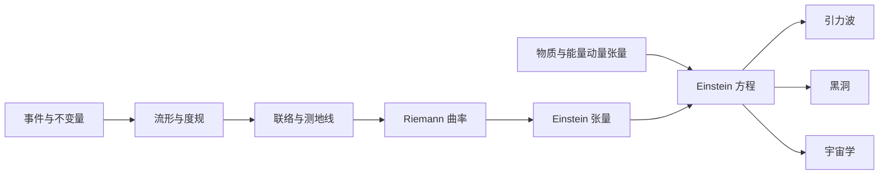

# Sean Carroll 广义相对论讲义完整中文译本

这一系列完整翻译 Sean M. Carroll 1997 年的 *Lecture Notes on General Relativity*，并把一学期研究生广义相对论课程重新组织成适合 VitePress 连续阅读的中文页面。原讲义从狭义相对论和张量出发，建立流形、联络与曲率，推导爱因斯坦方程，最后讨论引力波、黑洞和宇宙学。

系列关注三个问题：

1. 数学对象为什么需要被引入；
2. 公式怎样从前面的定义逐步推出；
3. 一个坐标表达式对应什么可测量的物理现象。

译文纳入原稿的全部实质正文、括号说明、例子、公式与公式编号。为改善网页阅读体验，原稿连续的章被拆成较短分节，并增加章节入口、中文小标题和前后导航；这些结构性调整不会删减作者的论证。103 张原图由作者发布的 PostScript 文件直接导出并随文放置。

[先读原讲义信息、完整目录与前言](./carroll-general-relativity/00-roadmap-and-conventions/01-contents-and-preface.md) · [查看原讲义书目](./carroll-general-relativity/00-roadmap-and-conventions/02-bibliography.md)

## 全系列路线

| 篇目 | 核心问题 | 笔记 |
| --- | --- | --- |
| 0. 阅读路线与约定 | 指标、单位、符号和章节依赖怎样统一？ | [阅读路线、预备知识与符号约定](./carroll-general-relativity/00-roadmap-and-conventions.md) |
| 1. 平直时空 | 不同惯性观察者怎样描述同一物理事件？ | [狭义相对论与平直时空](./carroll-general-relativity/01-special-relativity-and-flat-spacetime.md) |
| 2. 流形 | 没有全局直角坐标时，怎样定义向量、张量和积分？ | [流形、坐标与张量场](./carroll-general-relativity/02-manifolds-and-tensors.md) |
| 3. 曲率 | 怎样比较不同点的向量，并判断弯曲是否真实存在？ | [联络、测地线与曲率](./carroll-general-relativity/03-connection-and-curvature.md) |
| 4. 引力 | 物质怎样弯曲时空，弯曲又怎样控制运动？ | [等效原理与爱因斯坦方程](./carroll-general-relativity/04-gravitation-and-einstein-equation.md) |
| 5. 对称性 | 坐标变化、几何对称与守恒量怎样联系？ | [微分同胚、李导数与 Killing 对称](./carroll-general-relativity/05-diffeomorphisms-and-symmetry.md) |
| 6. 弱场 | 时空的微小扰动为什么会以波的形式传播？ | [线性引力与引力波](./carroll-general-relativity/06-weak-fields-and-gravitational-waves.md) |
| 7. 黑洞 | 球对称真空解怎样产生视界、轨道和黑洞热力学？ | [Schwarzschild 解与黑洞](./carroll-general-relativity/07-schwarzschild-and-black-holes.md) |
| 8. 宇宙学 | 均匀各向同性宇宙的尺度因子怎样演化？ | [FRW 宇宙学](./carroll-general-relativity/08-cosmology.md) |

## 一条贯穿全书的主线

广义相对论的逻辑可以压缩成下面这条链：

每个箭头都回答一个具体困难：

- 事件的坐标会随观察者变化，所以先寻找不变量；
- 弯曲时空一般没有一套覆盖全局的惯性坐标，所以用流形和局部坐标；
- 不同点的切空间彼此独立，所以需要联络来规定比较方法；
- 平行移动依赖路径的程度由曲率记录；
- 曲率要与物质分布建立局部关系，同时满足能量动量守恒；
- 爱因斯坦张量恰好具有零协变散度，于是可以与能量动量张量相等。

核心场方程是

$$
G_{\mu\nu}+\Lambda g_{\mu\nu}
=
8\pi G T_{\mu\nu},
$$

其中

$$
G_{\mu\nu}
=
R_{\mu\nu}-\frac{1}{2}R g_{\mu\nu}.
$$

左边描述时空几何，右边描述物质、能量、动量、压力和应力。方程短，真正的工作集中在理解每个张量的来源、对称性和可观测含义。

## 两类方程要同时掌握

学习广义相对论时，经常遇到两类方程。

### 几何恒等式

这类关系来自定义或几何结构，对具体物质模型没有要求。例如：

$$
\nabla_{[\lambda}R_{\rho\sigma]\mu\nu}=0,
\qquad
\nabla_\mu G^{\mu\nu}=0.
$$

它们告诉我们哪些组合必然成立。

### 动力学方程

这类关系选择了自然界实际遵循的理论。例如：

$$
G_{\mu\nu}=8\pi G T_{\mu\nu}.
$$

几何恒等式会约束动力学方程可能采用的形式。由上面两式立刻得到

$$
\nabla_\mu T^{\mu\nu}=0,
$$

也就是局部能量动量守恒。

## 推荐学习方式

第一次学习可以依次完成四层任务：

1. **认对象**：说清标量、向量、协向量、度规、联络、曲率分别位于哪里。
2. **查变换**：确认表达式在坐标变换后仍代表同一个几何对象。
3. **做小算例**：在二维球面、Rindler 坐标或 Schwarzschild 时空中算出具体分量。
4. **回到观测**：把抽象量连接到钟的读数、自由落体、光线偏折、波的极化或宇宙红移。

每篇末尾都给出一组自检问题。能够独立回答它们，比记住整页公式更能说明已经理解本章。

## 范围说明

原讲义写于 1997 年，宇宙学、黑洞信息问题和引力波观测等段落反映当时的知识与观测语境。为了忠实保留原文，这些历史性表述和数值也会照译；它们描述的是 1997 年讲义的内容，不代表本站对 2026 年研究现状的更新。原稿没有展开的量子引力、数值相对论和现代精密宇宙学仍不在译文范围内。

## PDF 覆盖对照

| PDF 页码 | 原讲义内容 | VitePress 入口 |
| --- | --- | --- |
| 1–3 | 题名、摘要、目录 | [讲义信息、目录与前言](./carroll-general-relativity/00-roadmap-and-conventions/01-contents-and-preface.md) |
| 4–5 | 前言 | [讲义信息、目录与前言](./carroll-general-relativity/00-roadmap-and-conventions/01-contents-and-preface.md) |
| 6–7 | 书目 | [原讲义书目](./carroll-general-relativity/00-roadmap-and-conventions/02-bibliography.md) |
| 8–37 | 第 1 章：狭义相对论与平坦时空 | [第 1 章入口](./carroll-general-relativity/01-special-relativity-and-flat-spacetime.md) |
| 38–61 | 第 2 章：流形 | [第 2 章入口](./carroll-general-relativity/02-manifolds-and-tensors.md) |
| 62–103 | 第 3 章：曲率 | [第 3 章入口](./carroll-general-relativity/03-connection-and-curvature.md) |
| 104–135 | 第 4 章：引力 | [第 4 章入口](./carroll-general-relativity/04-gravitation-and-einstein-equation.md) |
| 136–148 | 第 5 章：进一步的几何学 | [第 5 章入口](./carroll-general-relativity/05-diffeomorphisms-and-symmetry.md) |
| 149–170 | 第 6 章：弱场与引力辐射 | [第 6 章入口](./carroll-general-relativity/06-weak-fields-and-gravitational-waves.md) |
| 171–223 | 第 7 章：Schwarzschild 解与黑洞 | [第 7 章入口](./carroll-general-relativity/07-schwarzschild-and-black-holes.md) |
| 224–238 | 第 8 章：宇宙学 | [第 8 章入口](./carroll-general-relativity/08-cosmology.md) |

## 来源

- Sean M. Carroll, [Lecture Notes on General Relativity](https://arxiv.org/abs/gr-qc/9712019), arXiv:gr-qc/9712019v1, 1997。
- 本系列以 arXiv v1 的 TeX 源码和 PDF 逐项核对；页面结构为本站重组，正文、公式编号和插图内容对应原讲义。

[开始阅读：阅读路线、预备知识与符号约定](./carroll-general-relativity/00-roadmap-and-conventions.md)
