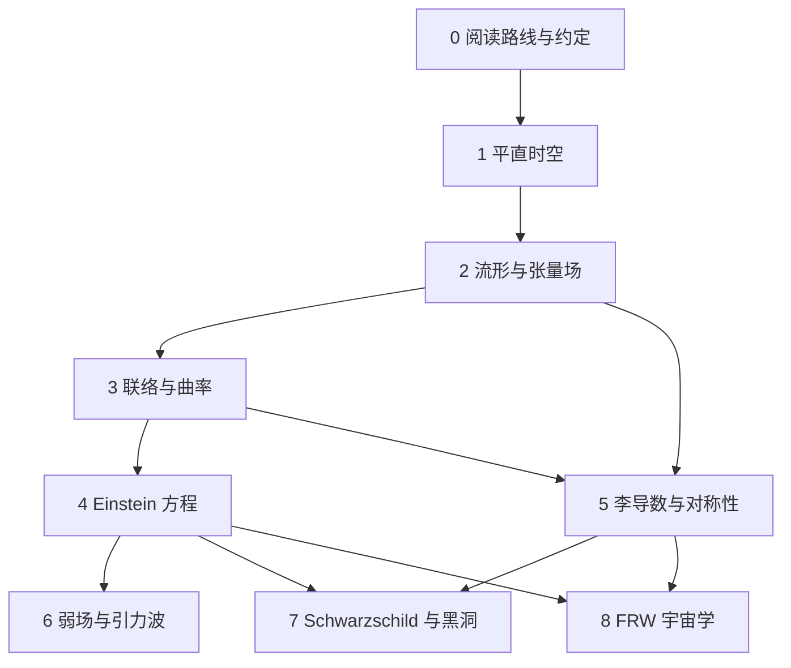

# 阅读路线、预备知识与符号约定

广义相对论的困难常常来自三件事同时出现：新的物理观念、新的几何语言，以及密集的指标计算。本篇先固定全系列的语言，再给出一条能够实际执行的学习路线。

本页是 VitePress 版额外编写的阅读入口。原讲义翻译从[讲义信息、目录与前言](./00-roadmap-and-conventions/01-contents-and-preface.md)开始；原作者列出的参考资料见[原讲义书目](./00-roadmap-and-conventions/02-bibliography.md)。

## 学完这套笔记要获得什么

目标可以分成四层：

| 层次 | 能力 | 例子 |
| --- | --- | --- |
| 几何对象 | 知道对象与坐标分量的区别 | 向量 $V$ 与四个数 $V^\mu$ 的关系 |
| 计算规则 | 能在给定度规下完成局部计算 | 从 $g_{\mu\nu}$ 求 $\Gamma^\rho{}_{\mu\nu}$ 和 $R^\rho{}_{\sigma\mu\nu}$ |
| 物理解释 | 能把公式转成钟、尺和自由落体的读数 | $g_{00}$ 与引力时间膨胀 |
| 模型判断 | 知道结论依赖哪些假设 | 弱场、真空、球对称、均匀各向同性 |

最终应能从一个时空度规出发，回答下面的问题：

1. 哪些坐标只是方便的标签？
2. 哪些量由观察者实际测得？
3. 自由粒子和光沿什么轨迹运动？
4. 时空在哪里弯曲，哪里只是坐标看起来复杂？
5. 这个度规需要怎样的物质分布才能满足爱因斯坦方程？

## 预备知识

### 必需内容

- 多元微积分：偏导数、链式法则、Taylor 展开、Jacobian；
- 线性代数：向量空间、对偶空间、基、矩阵、特征值；
- 常微分方程：二阶方程和初值问题；
- 经典力学：作用量、Euler–Lagrange 方程、守恒量；
- 狭义相对论的时间膨胀和能量动量关系。

### 可以边学边补的内容

- 拓扑空间的开集与连续映射；
- 微分形式、外积和外微分；
- 变分法与场论；
- 群、李代数和生成元。

第二、三、五篇会按广义相对论真正需要的程度重新建立这些工具。

## 章节依赖



如果只想先理解物理图景，可以读第 1、3、4、6、7、8 篇的概念部分。若要亲手验证公式，建议严格按顺序学习。

## 单位约定

全系列大部分推导采用自然单位制

$$
c=1.
$$

时间与长度因此具有相同量纲，坐标写成

$$
x^\mu=(t,x,y,z).
$$

需要恢复光速时，可以先把时间坐标改成 $x^0=ct$，再按量纲补回 $c$。例如自然单位下

$$
E^2=\boldsymbol p^2+m^2
$$

恢复为 SI 形式后是

$$
E^2=\boldsymbol p^2c^2+m^2c^4.
$$

Newton 引力常数 $G$ 通常保留。只有讨论黑洞热力学时，才会临时写出 $\hbar$、$c$ 和 $k_{\mathrm B}$。

## 指标约定

| 记号 | 取值 | 用途 |
| --- | --- | --- |
| $\mu,\nu,\rho,\sigma,\lambda$ | $0,1,2,3$ | 四维时空指标 |
| $i,j,k$ | $1,2,3$ | 三维空间指标 |
| $a,b$ | 依上下文而定 | 局部正交标架或一般抽象指标 |

重复出现一次上标、一次下标的指标自动求和：

$$
A_\mu B^\mu
=
\sum_{\mu=0}^{3}A_\mu B^\mu.
$$

自由指标必须在等号两边以同样方式出现。例如

$$
V^\mu=g^{\mu\nu}V_\nu
$$

中 $\mu$ 是自由指标，$\nu$ 是求和指标。

## 度规号差与升降指标

采用 Carroll 讲义使用的 mostly-plus 号差：

$$
\eta_{\mu\nu}
=
\operatorname{diag}(-1,+1,+1,+1).
$$

因此平直时空线元是

$$
\mathrm ds^2
=
-\mathrm dt^2+\mathrm dx^2+\mathrm dy^2+\mathrm dz^2.
$$

度规负责升降指标：

$$
V_\mu=g_{\mu\nu}V^\nu,
\qquad
V^\mu=g^{\mu\nu}V_\nu,
$$

并满足

$$
g^{\mu\rho}g_{\rho\nu}=\delta^\mu{}_\nu.
$$

号差会影响时间分量、四速度归一化、d'Alembert 算符和曲率约定。查阅其他教材时要先核对号差，不能只比较公式表面上的正负号。

## 因果分类

对非零向量 $V^\mu$：

$$
g_{\mu\nu}V^\mu V^\nu
\begin{cases}
<0, & \text{类时},\\
=0, & \text{类光},\\
>0, & \text{类空}.
\end{cases}
$$

有质量粒子的四速度满足

$$
U^\mu U_\mu=-1,
$$

光的切向量满足

$$
k^\mu k_\mu=0.
$$

这些分类与坐标选择无关，因为它们由标量内积定义。

## 导数记号

| 记号 | 含义 |
| --- | --- |
| $\partial_\mu$ | 坐标偏导数 $\partial/\partial x^\mu$ |
| $\nabla_\mu$ | 由联络定义的协变导数 |
| $\dot a$ | 对坐标时间 $t$ 求导 |
| $\mathrm d/\mathrm d\tau$ | 沿有质量粒子的固有时求导 |
| $\mathcal L_X$ | 沿向量场 $X$ 的李导数 |

标量的协变导数等于偏导数：

$$
\nabla_\mu f=\partial_\mu f.
$$

向量的协变导数需要联络修正：

$$
\nabla_\mu V^\nu
=
\partial_\mu V^\nu
+
\Gamma^\nu{}_{\mu\rho}V^\rho.
$$

## 曲率约定

本系列采用

$$
[\nabla_\mu,\nabla_\nu]V^\rho
=
R^\rho{}_{\sigma\mu\nu}V^\sigma
$$

来固定 Riemann 张量的符号。无挠联络下，分量表达式为

$$
R^\rho{}_{\sigma\mu\nu}
=
\partial_\mu\Gamma^\rho{}_{\nu\sigma}
-
\partial_\nu\Gamma^\rho{}_{\mu\sigma}
+
\Gamma^\rho{}_{\mu\lambda}\Gamma^\lambda{}_{\nu\sigma}
-
\Gamma^\rho{}_{\nu\lambda}\Gamma^\lambda{}_{\mu\sigma}.
$$

Ricci 张量与 Ricci 标量定义为

$$
R_{\mu\nu}=R^\rho{}_{\mu\rho\nu},
\qquad
R=g^{\mu\nu}R_{\mu\nu}.
$$

其他资料可能同时改变 Riemann 符号、Ricci 缩并位置或度规号差。只要内部一致，物理预言不会因此改变。

## 对象、分量与基

一个向量写成

$$
V=V^\mu\partial_\mu.
$$

$V$ 是几何对象，$\partial_\mu$ 是选定坐标产生的基，$V^\mu$ 是该基下的分量。换坐标时，基与分量反向变化，组合后的 $V$ 保持不变。

同理，协向量为

$$
\omega=\omega_\mu\,\mathrm dx^\mu,
$$

并通过

$$
\mathrm dx^\mu(\partial_\nu)=\delta^\mu{}_\nu
$$

与切空间基互为对偶。

这个区别贯穿全书：坐标奇点可能使分量发散，几何对象本身仍然光滑；真正的奇点要通过不变量或测地线完备性判断。

## 三种等号要在心里区分

学习时可以默默区分三类陈述：

1. **定义**：规定符号的含义，例如 $G_{\mu\nu}=R_{\mu\nu}-\frac12 Rg_{\mu\nu}$；
2. **恒等式**：由几何结构必然推出，例如 $\nabla_\mu G^{\mu\nu}=0$；
3. **动力学定律**：由实验选择，例如 $G_{\mu\nu}=8\pi G T_{\mu\nu}$。

混淆这三类关系，会让推导看起来像循环论证。

## 推荐的计算顺序

给定一个度规时，按下面的顺序工作最稳妥：

```text
写出 g_{mu nu}
  → 求逆矩阵 g^{mu nu}
  → 计算非零偏导
  → 计算 Christoffel 符号
  → 计算 Riemann / Ricci / R
  → 组成 Einstein 张量
  → 与 T_{mu nu} 比较
  → 再研究测地线和可观测量
```

每一步先利用对称性删去必为零的分量，能显著减少计算量。

## 读公式时的五个问题

看到新公式时，依次问：

1. 每个指标是自由指标还是求和指标？
2. 方程两边的张量型别是否相同？
3. 使用了哪种号差、单位制和曲率约定？
4. 这个关系来自定义、恒等式、运动方程还是近似？
5. 最终可由哪类观察者测量？

这五问可以拦住大部分初学计算错误。

## 本篇自检

1. 为什么 $V^\mu$ 会随坐标改变，而 $V$ 仍可视为同一个向量？
2. 为什么 $U^\mu U_\mu=-1$ 比“时间分量等于 1”更有几何意义？
3. 偏导数与协变导数分别在什么对象上相同？
4. 为什么比较两本教材的曲率公式前必须核对约定？
5. 给定度规后，从哪里开始计算 Einstein 张量？

[返回合集](../carroll-general-relativity.md) · [下一篇：狭义相对论与平直时空](./01-special-relativity-and-flat-spacetime.md)
