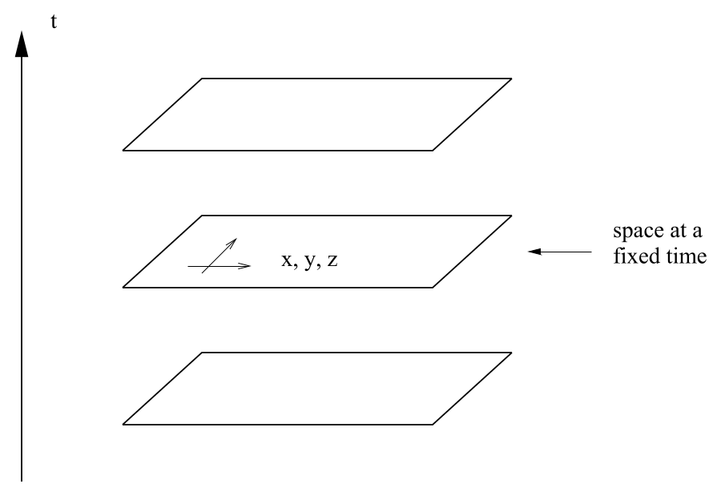
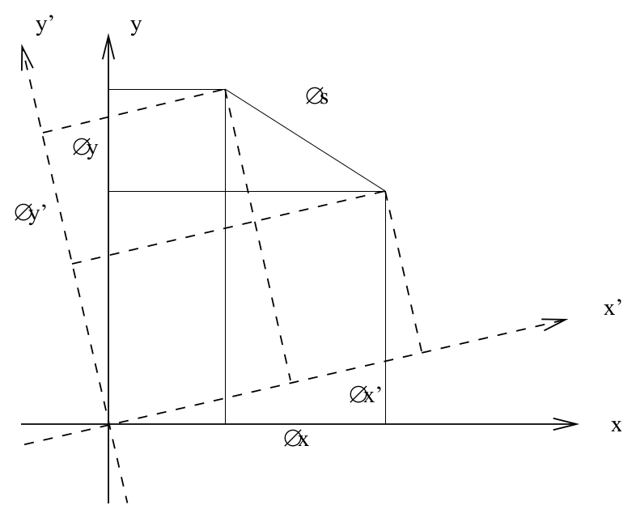
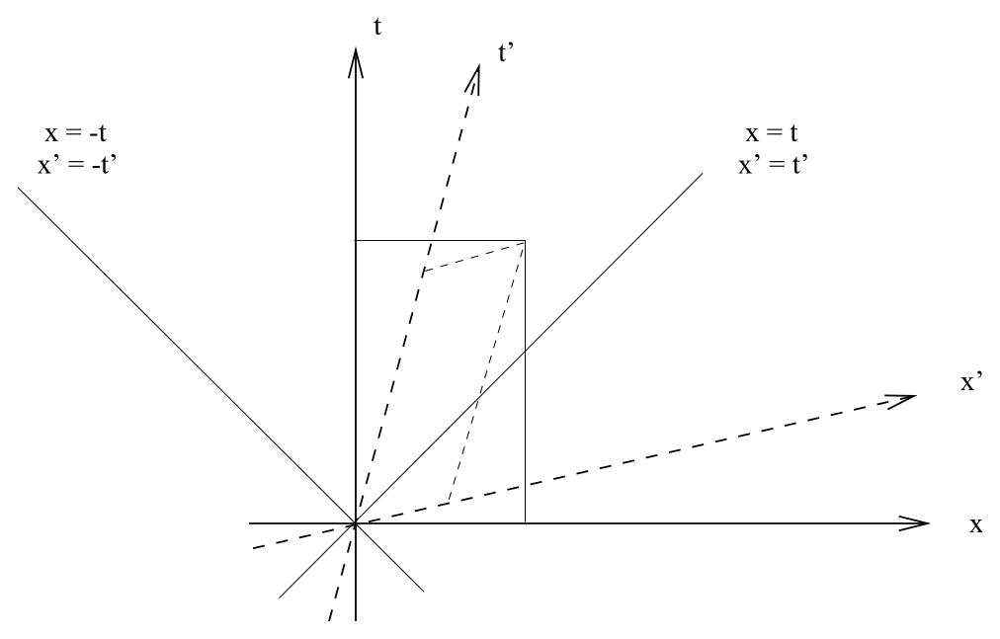

# 时空间隔与洛伦兹变换

<!-- CARROLL_NAV_TOP -->
> 完整译文 · 原 PDF 第 8–37 页 · [本章入口](../01-special-relativity-and-flat-spacetime.md) · [全书入口](../../carroll-general-relativity.md)
<!-- /CARROLL_NAV_TOP -->

## 为什么把空间与时间合为时空

我们将先快速巡览狭义相对论（special relativity，SR）以及平直时空中的物理。这样做有两个目的：一是回顾狭义相对论的核心内容，二是在暂不引入曲率所带来的额外复杂性的情况下，介绍张量及其相关概念；这些工具在后文中至关重要。因此，本节始终讨论平直时空，并且只采用正交归一的、类似笛卡尔坐标的坐标系。当然，你完全可以在任意坐标系中研究狭义相对论；然而，要引入为此所需的工具，我们差不多就已经走到弯曲空间的半途了，所以暂且把这件事留到以后。

人们常说，狭义相对论是一套关于四维时空的理论：三个空间维度和一个时间维度。不过，狭义相对论出现之前的 Newton 力学世界同样有三个空间维度和一个时间参数。尽管如此，人们当时很少想把它们视为同一个四维时空的不同方面。这是为什么？

<figure>
  
  <figcaption>图 1.1：Newton 物理学把每个固定时刻的三维空间视为绝对切片。</figcaption>
</figure>

考虑一个普通的二维平面。通常，为平面上的点引入坐标会很方便。例如，我们可以定义相互正交的 $x$ 轴和 $y$ 轴，再按通常的方法把每一点投影到这两条轴上。然而，显然，关于这个平面的大多数有趣几何事实都不依赖于我们对坐标的选择。一个简单的例子是两点之间的距离，它由下式给出：
$$
s^2 = (\Delta x)^2 + (\Delta y)^2\ .
\tag{1.1}
$$
在另一个笛卡尔坐标系中，$x'$ 轴和 $y'$ 轴相对于原坐标轴发生了旋转，而距离公式保持不变：
$$
s^2 = (\Delta x')^2 + (\Delta y')^2\ .
\tag{1.2}
$$
因此，我们说距离在这种坐标变换下具有不变性。

<figure>
  
  <figcaption>图 1.2：旋转坐标轴会改变坐标分量，但不会改变两点间的距离。</figcaption>
</figure>

这说明了为什么把平面看成二维对象很有用：虽然我们用两个彼此不同的数来标记每一个点，但这些数本身并非几何的实质，因为我们可以让坐标轴相互旋转，同时保持距离等几何量不变。在 Newton 物理学中，空间和时间之间并不具有这种性质；不存在一种有用的方式，可以把空间与时间相互旋转。相反，“某一时刻的全部空间”这一观念具有独立于坐标的意义。

狭义相对论中的情况不同。考虑时空上的坐标 $(t,x,y,z)$，并按如下方式建立它们。空间坐标 $(x,y,z)$ 构成一个标准笛卡尔坐标系，例如可以把彼此成直角的刚性标尺焊接在一起来构造它。这些标尺必须做无加速的自由运动。时间坐标由一组相对于空间坐标静止的时钟定义。（因为这是一个思想实验，我们设想标尺无限长，而且空间中的每一点都有一只时钟。）这些时钟按如下意义同步：如果你以恒定速度沿直线从空间中的一点前往任意另一点，那么旅程两端时钟的时间差，应当与以相同速度沿相反方向完成同一段路程时的时间差相同。这样构造出来的坐标系称为**惯性参考系**（inertial frame）。

## 时空间隔与惯性参考系

一个**事件**（event）定义为空间与时间中的一个特定瞬间，可由 $(t,x,y,z)$ 唯一刻画。现在先不追问动机，让我们引入两个事件之间的**时空间隔**（spacetime interval）：
$$
s^2 = -(c\Delta t)^2 + (\Delta x)^2 + (\Delta y)^2 + (\Delta z)^2\ .
\tag{1.3}
$$
（请注意，即使两个点并不相同，这个量也可以为正、为负或为零。）这里的 $c$ 是空间与时间之间的某个固定换算因子，也就是一个固定速度。它当然最终会被证明是光速。光子恰好以这个速度传播这一事实并非关键；真正重要的性质在于，存在这样一个 $c$，使时空间隔在坐标变换下保持不变。换言之，我们重复前面的步骤建立一个新的惯性参考系 $(t',x',y',z')$，并允许新旧标尺的初始位置、方向和速度彼此存在偏移，此时间隔仍然不变：
$$
s^2 = -(c\Delta t')^2 + (\Delta x')^2 + (\Delta y')^2 + (\Delta z')^2\ .
\tag{1.4}
$$
正因如此，把狭义相对论理解为关于四维时空的理论才是合理的；这个四维时空称为**Minkowski 空间**（Minkowski space）。（它是四维流形的一种特殊情形，我们稍后会详细讨论流形。）我们将看到，前面隐含定义的坐标变换确实会在某种意义上把空间和时间相互“旋转”。“同时发生的事件”没有绝对含义；两件事是否同时发生，取决于所用的坐标。因此，把 Minkowski 空间划分为空间与时间，是我们出于自身目的作出的选择，并非这一情形所固有的结构。

与狭义相对论相关的几乎所有“悖论”，都源于人们顽固地保留了 Newton 式观念，即时间坐标是唯一的，并且存在“某一时刻的空间”。一旦改用完整时空的视角来思考，这些悖论通常就会消失。

## 四维坐标、自然单位与度规

下面引入一些方便的记号。时空坐标将用带有希腊字母上标指标的量表示，指标取值从 $0$ 到 $3$，其中 $0$ 通常表示时间坐标。因此，
$$
x^\mu :\quad \matrix{x^0 = ct\cr x^1 = x\cr x^2 = y\cr x^3 = z\cr}
\tag{1.5}
$$
（不要把这些上标当成幂。）此外，为了简化表达，我们选取如下单位制：
$$
c = 1 \ ;
\tag{1.6}
$$
因此，在后续所有公式中，我们都会省略 $c$ 的因子。经验告诉我们，$c$ 是光速，即每秒 $3\times 10^8$ 米；所以，我们所用的单位制把 1 秒等同于 $3\times 10^8$ 米。有时分别指称 $x^\mu$ 的空间分量和时间分量会很方便，因此，我们将用拉丁字母上标专门表示空间分量：
$$
x^i :\quad \matrix{x^1 = x\cr x^2 = y\cr x^3 = z\cr}
\tag{1.7}
$$

把时空间隔写成更紧凑的形式也很方便。为此，我们引入一个 $4\times 4$ 矩阵，称为**度规**（metric），并用两个下标来书写它：
$$
\eta_{{\mu\nu}} = \left(\matrix{-1 &0&0&0\cr 0&1&0&0\cr
  0&0&1&0 \cr 0&0&0&1\cr}\right)\ .
\tag{1.8}
$$
（一些参考资料，尤其是场论教材，会采用符号恰好相反的度规，因此要多加留意。）于是可以得到一个简洁的公式：
$$
s^2 = \eta_{\mu\nu}\Delta x^\mu \Delta x^\nu\ .
\tag{1.9}
$$
请注意，我们采用了**求和约定**（summation convention）：凡是同一个指标分别以一次上标和一次下标出现，就要对它求和。因此，式 (1.9) 的内容与式 (1.3) 完全相同。

## 保持间隔不变的坐标变换

现在，我们可以在比前面更抽象的层次上考察时空中的坐标变换。什么样的变换会让间隔 (1.9) 保持不变？一个简单类别是平移，它只会整体移动坐标：
$$
x^\mu \rightarrow x^{\mu'} = x^\mu + a^\mu\ ,
\tag{1.10}
$$
其中 $a^\mu$ 是四个固定的数。（请注意，撇号加在指标上，而没有加在 $x$ 上。）平移不会改变差值 $\Delta x^\mu$，所以间隔不变并不令人惊讶。另一类线性变换是用一个不依赖时空位置的矩阵乘以 $x^\mu$：
$$
x^{\mu'} = \Lambda^{\mu'}{}_\nu x^\nu\ ,
\tag{1.11}
$$
或者用更常规的矩阵记号写成
$$
x' = \Lambda x\ .
\tag{1.12}
$$
这些变换不会保持差值 $\Delta x^\mu$ 原封不动，而是也会用矩阵 $\Lambda$ 乘以这些差值。什么样的矩阵能让间隔保持不变？继续采用矩阵记号，我们希望满足
$$
\begin{aligned}
s^2 = (\Delta x)^{\rm T} \eta (\Delta x)
  & = & (\Delta x')^{\rm T} \eta (\Delta x')\notag \\
  & = & (\Delta x)^{\rm T} \Lambda^{\rm T} \eta \Lambda (\Delta x)\ ,
\end{aligned}
\tag{1.13}
$$
因而有
$$
\eta = \Lambda^{\rm T} \eta \Lambda \ ,
\tag{1.14}
$$
或者写成
$$
\eta_{\rho\sigma} = \Lambda^{\mu'}{}_{\rho}\Lambda^{\nu'}{}_{\sigma}
  \eta_{\mu'\nu'}\ .
\tag{1.15}
$$
我们要找出这样的矩阵 $\Lambda^{\mu'}{}_\nu$，使矩阵 $\eta_{\mu'\nu'}$ 的各个分量与 $\eta_{\rho\sigma}$ 的相应分量相同；这正是间隔在这些变换下保持不变的含义。

## Lorentz 群、旋转与 boost

满足 (1.14) 的矩阵称为**Lorentz 变换**（Lorentz transformations）；它们的集合在矩阵乘法下构成一个群，称为**Lorentz 群**（Lorentz group）。这个群与三维空间中的旋转群 O(3) 有着密切的类比。旋转群可以看成满足下式的 $3\times 3$ 矩阵 $R$：
$$
{\bf 1} = R^{\rm T}{\bf 1} R\ ,
\tag{1.16}
$$
其中 **1** 是 $3\times 3$ 单位矩阵。它与 (1.14) 的相似性应当很清楚；唯一差异是度规 $\eta$ 的第一项带有负号，表示类时方向。因此，Lorentz 群经常记作 O(3,1)。（$3\times 3$ 单位矩阵就是普通平直空间的度规。所有特征值均为正的度规称为**欧几里得型**（Euclidean），而像 (1.8) 这样含有一个负号的度规则称为**Lorentz 型**（Lorentzian）。）

Lorentz 变换可以分为若干类别。首先是常规的**旋转**，例如 $x$-$y$ 平面内的旋转：
$$
\Lambda^{\mu'}{}_\nu = \left(\matrix{ 1&0&0&0\cr
  0& \cos\theta & \sin\theta &0\cr 0& -\sin\theta & \cos\theta &0\cr
  0&0&0&1\cr}\right)\ .
\tag{1.17}
$$
旋转角 $\theta$ 是一个以 $2\pi$ 为周期的周期变量。此外还有 **boost**，可以把它想成“空间方向与时间方向之间的旋转”。一个例子是
$$
\Lambda^{\mu'}{}_\nu = \left(\matrix{ \cosh\phi&-\sinh\phi &0&0\cr
  -\sinh\phi&\cosh\phi &0&0\cr 0&0&1&0\cr
  0&0&0&1\cr}\right)\ .
\tag{1.18}
$$
与旋转角不同，boost 参数 $\phi$ 的取值范围是 $-\infty$ 到 $\infty$。此外还有一些离散变换，它们会反转时间方向或反转一个乃至多个空间方向。（排除这些变换后，得到的就是正 Lorentz 群 SO(3,1)。）一般的变换可以通过把这些单独的变换相乘得到；完整写出这个含六个参数的矩阵——三个 boost 参数和三个旋转参数——既不美观，也没有足够用途，所以不必费力写下它。一般来说，Lorentz 变换彼此不可交换，因而 Lorentz 群是非阿贝尔群。由全部平移和 Lorentz 变换共同组成的集合，是一个含十个参数的非阿贝尔群，称为 **Poincaré 群**（Poincaré group）。

## boost 与匀速运动参考系

得知 boost 对应于切换到一个以恒定速度运动的参考系，你应该不会感到意外；不过，我们还是更明确地看一下。对于 (1.18) 给出的变换，变换后的坐标 $t'$ 和 $x'$ 为
$$
\begin{aligned}
t' &=& t\cosh\phi - x \sinh\phi \notag \\
  x' &=& -t \sinh\phi + x\cosh\phi\ .
\end{aligned}
\tag{1.19}
$$
由此可见，满足 $x'=0$ 的点正在运动；它的速度是
$$
v = {x\over t} = {{\sinh\phi}\over{\cosh\phi}} = \tanh\phi\ .
\tag{1.20}
$$
若要换成熟悉一些的记号，可以用 $\phi = \tanh^{-1}v$ 代换，从而得到
$$
\begin{aligned}
t' &=& \gamma(t-vx)\notag \\
  x' &=& \gamma(x-vt)
\end{aligned}
\tag{1.21}
$$
其中 $\gamma =1/\sqrt{1-v^2}$。由此可见，我们的抽象方法确实重新得到了 Lorentz 变换的常见表达式。应用这些公式便会导出时间膨胀、长度收缩等结果。

## 时空图与光锥

**时空图**（spacetime diagram）是一项极为有用的工具，下面就从这个角度考察 Minkowski 空间。我们可以先把原来的 $t$ 轴和 $x$ 轴画成（按照通常观念）彼此成直角，并略去 $y$ 轴和 $z$ 轴。根据 (1.19)，在 $x$-$t$ 平面内进行 boost 后，$x'$ 轴（$t' = 0$）由 $t = x \tanh\phi$ 给出，而 $t'$ 轴（$x' = 0$）由 $t = x/\tanh\phi$ 给出。因此可以看到，空间轴和时间轴会相互旋转，但它们会像剪刀合拢一样靠近，并不会保持传统 Euclid 意义下的正交。（我们将会看到，这些轴在 Lorentz 意义下其实仍然正交。）这一点不应令人惊讶：倘若时空的行为完全就像空间的四维版本，世界将会变得大不相同。

<figure>
  
  <figcaption>图 1.3：boost 使空间轴和时间轴彼此靠拢，而光线 x = ±t 保持不变。</figcaption>
</figure>

考察以速度 $c=1$ 运动所对应的路径也很有启发。这些路径在原坐标系中由 $x=\pm t$ 给出。在新坐标系中，稍加思考便会发现，由 $x' = \pm t'$ 定义的路径恰好与 $x=\pm t$ 定义的路径相同；这些轨迹在 Lorentz 变换下保持不变。我们当然知道光以这个速度传播；由此已经得到，光速在任何惯性参考系中都相同。所有能够通过以光速运动的直线与某个事件相连的点，组成这个事件的一个**光锥**（light cone）；整个点集在 Lorentz 变换下保持不变。光锥自然分为未来光锥和过去光锥。对于一点 $p$，位于其未来光锥或过去光锥内部的所有点都称为与 $p$ **类时分离**（timelike separated）；光锥外部的点则与该点**类空分离**（spacelike separated）；光锥上的点则与 $p$ **类光分离**（lightlike separated）或**零分离**（null separated）。回看 (1.3) 可知，类时分离的点之间间隔为负，类空分离的点之间间隔为正，零分离的点之间间隔为零。（这里把间隔定义为 $s^2$，并没有取这个量的平方根。）请注意，这与 Newton 世界中的情形有明显区别：对于一个与 $p$ 类空分离的点，我们无法以坐标无关的方式断言它位于 $p$ 的未来、位于 $p$ 的过去，或与之“同时”。

要进一步探究 Minkowski 空间的结构，就有必要引入向量与张量的概念。我们先从大家应当熟悉的向量开始。当然，时空中的向量是四维的，通常称为**四维向量**（four-vector）。这一点会造成相当重要的差异；例如，两个四维向量之间不存在叉积。

<!-- CARROLL_NAV_BOTTOM -->
---
[← 原讲义书目](../00-roadmap-and-conventions/02-bibliography.md) · [全书入口](../../carroll-general-relativity.md) · [向量、对偶向量与张量 →](./02-vectors-dual-vectors-and-tensors.md)
<!-- /CARROLL_NAV_BOTTOM -->
