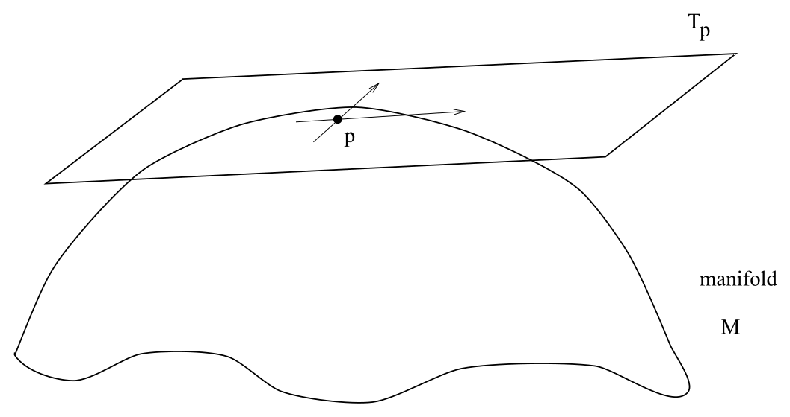

# 向量、对偶向量与张量

<!-- CARROLL_NAV_TOP -->
> 完整译文 · 原 PDF 第 8–37 页 · [本章入口](../01-special-relativity-and-flat-spacetime.md) · [全书入口](../../carroll-general-relativity.md)
<!-- /CARROLL_NAV_TOP -->

## 切空间、向量与基

除了维数这一简单事实之外，最需要强调的是：每个向量都位于时空中的某个给定点。你可能习惯把向量想成从空间中的一点伸向另一点，甚至习惯所谓的“自由”向量，仿佛可以随意把它从一点平移到另一点。这些观念在相对论中并不实用。我们采取的做法是：对时空中的每一点 $p$，都关联一组位于该点的所有可能向量；这组向量称为 $p$ 点的**切空间**，记作 $T_p$。这个名称来自一种直观图景：把依附于一个简单弯曲二维空间上某点的所有向量看成一个与该点相切的平面。不过，抛开这种启发式图景，关键仍是要把这些向量理解为位于同一个点，而非从一点延伸到另一点。（当然，这并不会妨碍我们在时空图上把它们画成箭头。）

<figure>
  
  <figcaption>图 1.4：时空一点处的切空间。</figcaption>
</figure>

稍后我们会把每一点的切空间与从时空本身能够构造出的对象联系起来。眼下，只需把 $T_p$ 看作时空中每一点对应的一个抽象向量空间。一个**（实）向量空间**是一组对象（“向量”），粗略地说，其中的对象可以相加，也可以以线性方式乘以实数。因此，对任意两个向量 $V$、$W$ 和实数 $a$、$b$，都有
$$
(a+b)(V+W) = aV+bV+aW+bW\ .
\tag{1.22}
$$
每个向量空间都有一个原点，也就是一个零向量；它在向量加法下充当单位元。许多向量空间中还定义了其他运算，例如取内积（点积），但这属于超出向量空间基本概念的附加结构。

向量是定义完备的几何对象，**向量场**亦然；向量场指的是这样一组向量：时空中的每一点恰好对应其中一个向量。（流形 $M$ 的所有切空间组成的集合称为**切丛**，记作 $T(M)$。）然而，为了进行具体计算，把向量相对于某组基向量分解成分量往往很有用。一组**基**必须同时满足两个条件：它张成向量空间（任意向量都能写成基向量的线性组合），并且线性无关（基中的任何向量都不能写成其他基向量的线性组合）。给定一个向量空间，合法的基有无穷多组，但每组基包含的向量数目都相同，这个数目称为空间的维数。（对于闵可夫斯基空间中一点对应的切空间，维数当然是四。）

设想我们在每个切空间中都建立一组由四个向量 ${\hat e}_{(\mu)}$ 构成的基，像往常一样令 $\mu\in\{0,1,2,3\}$。进一步假定每组基都适配于坐标 $x^\mu$；也就是说，基向量 ${\hat e}_{(1)}$ 指向我们通常所说的 $x$ 轴方向，等等。基完全没有必要适配任何坐标系，不过这样做通常很方便。（这里其实可以说得更精确，但以后我们会以近乎折磨人的精细程度重新讨论，所以眼下稍微含糊一点也情有可原。）于是，任意抽象向量 $A$ 都可以写成基向量的线性组合：
$$
A = A^\mu {\hat e}_{(\mu)}\ .
\tag{1.23}
$$
系数 $A^\mu$ 称为向量 $A$ 的**分量**。多数时候，我们会把基完全略去，略显随意地说“向量 $A^\mu$”，但请记住，这只是一种简写。真正的向量是抽象的几何实体，分量则只是某个方便选取的基中各基向量的系数。（由于我们通常省略显式的基向量，指标一般会标记向量和张量的分量。这正是基向量的指标外面加括号的原因：提醒我们这里是一组向量，而非单个向量的分量。）

时空中向量的一个标准例子，是曲线的切向量。穿过时空的一条参数化曲线或路径，可以用坐标关于参数的函数来指定，例如 $x^\mu(\lambda)$。切向量 $V(\lambda)$ 的分量为
$$
V^\mu = {{dx^\mu}\over{d\lambda}}\ .
\tag{1.24}
$$
完整向量因而是 $V=V^\mu{\hat e}_{(\mu)}$。在洛伦兹变换下，坐标 $x^\mu$ 按照式 (1.11) 变化，而参数化变量 $\lambda$ 保持不变；因此可以推出，切向量的分量必须按下式变化：
$$
V^\mu \rightarrow V^{\mu'} = \Lambda^{\mu'}{}_\nu V^\nu\ .
\tag{1.25}
$$
然而，向量本身在洛伦兹变换下是不变的，这一点要与它在某个坐标系中的分量区分开。我们可以利用这一事实推导基向量的变换性质。把变换后坐标系中的一组基向量记为 ${\hat e}_{(\nu')}$。由于向量不变，有
$$
\begin{aligned}
V = V^\mu{\hat e}_{(\mu )}&=& V^{\nu'}{\hat e}_{(\nu')}\notag \\
  &=& \Lambda^{\nu'}{}_\mu V^\mu{\hat e}_{(\nu')}\ .
\end{aligned}
\tag{1.26}
$$
而无论分量 $V^\mu$ 取何数值，这一关系都必须成立。因此可以写成
$$
{\hat e}_{(\mu )}= \Lambda^{\nu'}{}_\mu{\hat e}_{(\nu')}\ .
\tag{1.27}
$$
要用旧基 ${\hat e}_{(\mu)}$ 表示新基 ${\hat e}_{(\nu')}$，应当乘以洛伦兹变换 $\Lambda^{\nu'}{}_\mu$ 的逆矩阵。不过，从无撇坐标到有撇坐标的洛伦兹变换，其逆变换本身仍是洛伦兹变换，只是这次从有撇坐标系变到无撇坐标系。因此我们将引入一种略微微妙的记号：两个矩阵使用同一个符号，只调整有撇与无撇指标。也就是说，
$$
(\Lambda^{-1})^{\nu'}{}_\mu = \Lambda_{\nu'}{}^\mu\ ,
\tag{1.28}
$$
或者
$$
\Lambda_{\nu'}{}^\mu \Lambda^{\sigma'}{}_\mu = \delta^{\sigma'}_{\nu'}
  \ ,\quad \Lambda_{\nu'}{}^\mu \Lambda^{\nu'}{}_\rho =
  \delta^{\mu}_{\rho}\ ,
\tag{1.29}
$$
其中 $\delta^{\mu}_{\rho}$ 是四维空间中传统的克罗内克 delta 符号。（请注意，Schutz 采用另一套约定，总把两个指标排列在西北/东南方向；真正重要的是撇号放在哪里。）由式 (1.27)，便得到基向量的变换规则：
$$
{\hat e}_{(\nu')} = \Lambda_{\nu'}{}^\mu{\hat e}_{(\mu)}\ .
\tag{1.30}
$$
因此，一组基向量按照坐标或向量分量所用变换的逆洛伦兹变换来变化。

值得在这里停一下，把这些内容消化清楚。我们引入了以上指标标记的坐标，它们在洛伦兹变换下按某种方式变化。随后考虑的向量分量同样写成上指标，因为它们与坐标函数采用相同的变换方式，这样安排很合理。（在固定坐标系中，四个坐标 $x^\mu$ 都可各自看作时空上的函数，向量场的四个分量也一样。）与坐标系关联的基向量通过逆矩阵变换，并用下指标标记。这套记号保证了：对分量和基向量求和构造出的不变量在变换下保持不变，正合我们的期望。稍微提前透露一点大概无妨：对带有多个指标的更复杂对象（张量），情形仍会如此。

## 对偶向量与余切空间

建立一个向量空间之后，我们立刻可以定义一个与之关联、维数相同的向量空间，称为**对偶向量空间**。对偶空间通常用星号表示，因此切空间 $T_p$ 的对偶空间称为**余切空间**，记作 $T^*_p$。对偶空间由从原向量空间到实数的所有线性映射组成；用数学语言说，若 $\omega\in T_p^*$ 是一个对偶向量，那么它作为映射满足：
$$
\omega(aV+bW) = a\omega(V) + b\omega(W) \in {\bf R}\ ,
\tag{1.31}
$$
其中 $V$、$W$ 是向量，$a$、$b$ 是实数。这些映射的妙处在于，它们自己也构成向量空间；所以若 $\omega$ 和 $\eta$ 是对偶向量，则有
$$
(a\omega+b\eta)(V) = a\omega(V) + b\eta(V)\ .
\tag{1.32}
$$
为了让这一构造更具体一些，可以要求
$$
{\hat \theta}^{(\nu)}({\hat e}_{(\mu)}) = \delta^\nu_\mu\ .
\tag{1.33}
$$
从而引入一组对偶基向量 ${\hat \theta}^{(\nu)}$。于是，每个对偶向量都可以用其分量写出；这些分量用下指标标记：
$$
\omega = \omega_\mu{\hat \theta}^{(\mu)}\ .
\tag{1.34}
$$
与向量的情形完全类似，我们通常会直接用 $\omega_\mu$ 代表整个对偶向量。事实上，你有时会看到 $T_p$ 的元素（也就是我们所称的向量）被叫作**逆变向量**，而 $T_p^*$ 的元素（也就是我们所称的对偶向量）被叫作**协变向量**。其实，只要把普通向量称为带上指标的向量、把对偶向量称为带下指标的向量，也不会有人介意。对偶向量还有另一个名称：**一形式**。这个称呼眼下略显神秘，很快便会变得清楚。

分量记号让我们能够简单地写出对偶向量对向量的作用：
$$
\begin{aligned}
\omega(V) &=& \omega_\mu V^\nu{\hat \theta}^{(\mu)}({\hat e}_{(\nu)})\notag \\
  &=& \omega_\mu V^\nu \delta^\mu_\nu\notag \\
  &=& \omega_\mu V^\mu \in {\bf R} \ .
\end{aligned}
\tag{1.35}
$$
这说明了为什么很少需要显式写出基向量（和对偶基向量）：分量已经承担了全部工作。式 (1.35) 的形式还提示我们，可以把向量看成作用于对偶向量的线性映射，定义为
$$
V(\omega) \equiv \omega(V) = \omega_\mu V^\mu\ .
\tag{1.36}
$$
所以，对偶向量空间的对偶空间就是原来的向量空间本身。

当然，在时空中，我们关注的是向量场和对偶向量场，而非单独一个向量空间。（$M$ 上所有余切空间的集合称为**余切丛**，记作 $T^*(M)$。）在这种情况下，对偶向量场作用于向量场的结果不再是单个数，而会成为时空上的一个**标量**（或简称“函数”）。标量是不带指标、在洛伦兹变换下保持不变的量。

可以沿用先前对向量所作的论证，推导对偶向量的变换性质。其分量的变换为
$$
\omega_{\mu'} = \Lambda_{\mu'}{}^\nu\omega_\nu\ ,
\tag{1.37}
$$
对偶基向量的变换为
$$
{\hat \theta}^{(\rho')} = \Lambda^{\rho'}{}_\sigma {\hat \theta}^{(\sigma)}\ .
\tag{1.38}
$$
这正符合我们根据指标位置所作的预期：对偶向量的分量按照向量分量所用变换的逆变换而变化。请注意，这保证了标量 (1.35) 在洛伦兹变换下保持不变，它理应如此。

### 对偶向量的例子

来看几个对偶向量的例子，先从其他背景说起，再回到闵可夫斯基空间。设有某个整数 $n$，考虑由 $n$ 分量列向量构成的空间。那么它的对偶空间就是 $n$ 分量行向量构成的空间，对偶作用就是普通的矩阵乘法：
$$
\begin{aligned}
V &=&\left(\matrix{V^1 \cr V^2 \cr \cdot\cr \cdot \cr \cdot \cr
  V^{n}\cr}\right)\ ,\quad
  \omega = \left(\omega_1\  \omega_2\  \cdots\ \omega_{n}\right)\ ,\notag \\
  \omega(V) &=&\left(\omega_1\ \omega_2\ \cdots\ \omega_{n}\right)
  \left(\matrix{V^1 \cr V^2 \cr \cdot\cr \cdot \cr \cdot\cr
  V^{n}\cr}\right) = \omega_i V^i\ .
\end{aligned}
\tag{1.39}
$$
另一个熟悉的例子出现在量子力学中，其中希尔伯特空间里的向量用右矢 $|\psi\rangle$ 表示。这时，对偶空间是左矢 $\langle\phi |$ 构成的空间，对偶作用给出数 $\langle \phi |\psi\rangle$。（在量子力学里这是一个复数，但思想完全相同。）

在时空中，对偶向量最简单的例子是标量函数的**梯度**，即它对各时空坐标的偏导数组成的集合；我们用“d”表示：
$$
{\rm d}\phi = {{{\partial}_{}\phi}\over{{\partial}_{}x^\mu}} {\hat \theta}^{(\mu)}\ .
\tag{1.40}
$$
用来变换偏导数的通常链式法则，在这里恰好就是对偶向量分量的变换规则：
$$
\begin{aligned}
{{{\partial}_{}\phi}\over{{\partial}_{}x^{\mu'}}} &=&
  {{{\partial}_{}x^\mu}\over{{\partial}_{}x^{\mu'}}}{{{\partial}_{}\phi}\over{{\partial}_{}x^\mu}}\notag \\
  &=&\Lambda_{\mu'}{}^\mu {{{\partial}_{}\phi}\over{{\partial}_{}x^\mu}}\ ,
\end{aligned}
\tag{1.41}
$$
这里用式 (1.11) 和式 (1.28) 将洛伦兹变换与坐标联系了起来。梯度是对偶向量这一事实，引出以下几种偏导数的简写记号：
$$
{{{\partial}_{}\phi}\over{{\partial}_{}x^\mu}}={\partial}_{\mu}\phi = \phi,{}_\mu
  \ .
\tag{1.42}
$$
（非常粗略地说，“$x^\mu$ 带上指标，但它出现在导数的分母中时，得到的对象便带下指标。”）我个人不太喜欢逗号记法，不过我们会一直使用 ${\partial}_{\mu}$。请注意，梯度确实以一种自然方式作用在我们先前举过的向量例子上，也就是曲线的切向量。结果正是函数沿曲线的普通导数：
$$
{\partial}_{\mu}\phi {{\partial x^\mu}\over{\partial \lambda}}
  = {{d\phi}\over{d\lambda}}\ .
\tag{1.43}
$$

关于对偶向量，最后再补充一点：有一种图示方法能够把它们画出来，并且与用箭头表示向量的图景相容。可参阅 Schutz 的讨论，或 MTW 的讨论（后者把这种做法发挥到了令人目眩的地步）。

## 张量与张量积

向量和对偶向量的一个直接推广，就是**张量**的概念。正如对偶向量是从向量到 **R** 的线性映射，一个类型（或阶数）为 $(k,l)$ 的张量 $T$ 是从一组对偶向量和向量到 **R** 的多重线性映射：
$$
\begin{aligned}
T:~ &T^*_p\times\cdots\times T^*_p\times T_p\times\cdots
  \times T_p \rightarrow {\bf R}\notag \\
  & (k~{\rm times})\qquad\quad (l~{\rm times})
\end{aligned}
\tag{1.44}
$$
这里的“$\times$”表示笛卡尔积，例如 $T_p\times T_p$ 是向量有序对构成的空间。多重线性意味着张量对它的每个自变量都呈线性；例如，对一个 $(1,1)$ 型张量，有
$$
T(a\omega+b\eta, cV+dW) = acT(\omega,V)+adT(\omega,W)+bcT(\eta,V)
  +bdT(\eta,W)\ .
\tag{1.45}
$$
从这个视角看，标量是 $(0,0)$ 型张量，向量是 $(1,0)$ 型张量，对偶向量是 $(0,1)$ 型张量。

所有固定类型 $(k,l)$ 的张量构成一个向量空间；它们可以相加，也可以乘以实数。为了构造这个空间的一组基，需要定义一种新运算，称为**张量积**，记作 $\otimes$。若 $T$ 是 $(k,l)$ 型张量，$S$ 是 $(m,n)$ 型张量，我们把 $(k+m,l+n)$ 型张量 $T\otimes S$ 定义为
$$
\begin{aligned}
\lefteqn{T\otimes S(\omega^{(1)},\ldots ,\omega^{(k)},\ldots
  ,\omega^{(k+m)},V^{(1)},\ldots ,V^{(l)},\ldots ,V^{(l+n)})} \notag \\
  &  =
  T(\omega^{(1)},\ldots ,\omega^{(k)},V^{(1)},\ldots ,V^{(l)})
  S(\omega^{(k+1)},\ldots ,\omega^{(k+m)},V^{(l+1)},\ldots ,V^{(l+n)})
  \ .
\end{aligned}
\tag{1.46}
$$
（请注意，$\omega^{(i)}$ 和 $V^{(i)}$ 表示彼此不同的对偶向量和向量，并非它们的分量。）换句话说，先让 $T$ 作用在合适的一组对偶向量和向量上，再让 $S$ 作用在剩余的对象上，然后把两个结果相乘。一般而言，$T\otimes S \neq S\otimes T$。

现在很容易构造所有 $(k,l)$ 型张量所成空间的一组基：对基向量和对偶基向量取张量积即可。这组基由所有下列形式的张量组成：
$$
{\hat e}_{(\mu_1)}\otimes\cdots\otimes{\hat e}_{(\mu_k)}\otimes
  {\hat \theta}^{(\nu_1)}\otimes\cdots\otimes{\hat \theta}^{(\nu_l)}\ .
\tag{1.47}
$$
在四维时空中，总共有 $4^{k+l}$ 个基张量。采用分量记号时，我们把任意张量写成
$$
T = T^{\mu_1 \cdots \mu_k}{}_{\nu_1\cdots\nu_l}
  {\hat e}_{(\mu_1)}\otimes\cdots\otimes{\hat e}_{(\mu_k)}\otimes
  {\hat \theta}^{(\nu_1)}\otimes\cdots\otimes{\hat \theta}^{(\nu_l)}\ .
\tag{1.48}
$$
也可以让张量作用在基向量和对偶基向量上，以此定义它的分量：
$$
T^{\mu_1 \cdots \mu_k}{}_{\nu_1\cdots\nu_l} =
  T({\hat \theta}^{(\mu_1)},\ldots, {\hat \theta}^{(\mu_k)},{\hat e}_{(\nu_1)},\ldots,{\hat e}_{(\nu_l)})
  \ .
\tag{1.49}
$$
你可以利用式 (1.33) 等关系自行检查，确认这些方程彼此衔接得完全一致。

与向量一样，我们通常会采用简写，直接用张量 $T$ 的分量 $T^{\mu_1 \cdots \mu_k}{}_{\nu_1\cdots\nu_l}$ 来称呼它。张量对一组向量和对偶向量的作用，遵循式 (1.35) 已经确立的模式：
$$
T(\omega^{(1)},\ldots ,\omega^{(k)},V^{(1)},\ldots ,V^{(l)}) =
  T^{\mu_1 \cdots \mu_k}{}_{\nu_1\cdots\nu_l}
  \omega^{(1)}_{\mu_1}\cdots\omega^{(k)}_{\mu_k}V^{(1)\nu_1}\cdots
  V^{(l)\nu_l}\ .
\tag{1.50}
$$
指标的次序显然很重要，因为张量对不同自变量的作用未必相同。最后，张量分量在洛伦兹变换下的变化，可以由我们已经知道的基向量和对偶基向量的变换推导出来。答案正如指标位置所提示的那样：
$$
T^{\mu_1' \cdots \mu_k'}{}_{\nu_1'\cdots\nu_l'} =
  \Lambda^{\mu_1'}{}_{\mu_1}\cdots\Lambda^{\mu_k'}{}_{\mu_k}
  \Lambda_{\nu_1'}{}^{\nu_1}\cdots\Lambda_{\nu_l'}{}^{\nu_l}
  T^{\mu_1 \cdots \mu_k}{}_{\nu_1\cdots\nu_l} \ .
\tag{1.51}
$$
所以，每个上指标都像向量一样变换，每个下指标都像对偶向量一样变换。

尽管我们把张量定义成从若干组向量和切向量到 **R** 的线性映射，却没有任何要求强迫我们必须让它作用于一整套自变量。因此，一个 $(1,1)$ 型张量也可充当从向量到向量的映射：
$$
T^\mu{}_\nu :~ V^\nu\rightarrow T^\mu{}_\nu V^\nu\ .
\tag{1.52}
$$
你可以自行验证，$T^\mu{}_\nu V^\nu$ 确实是一个向量（也就是说，它遵守向量变换律）。类似地，我们可以让一个张量作用在另一个张量的全部或部分指标上，从而得到第三个张量。例如，
$$
U^\mu{}_\nu = T^{\mu\rho}{}_\sigma S^{\sigma}{}_{\rho\nu}
\tag{1.53}
$$
就是一个完全合格的 $(1,1)$ 型张量。

考虑到这部分材料多少有些艰深，你可能担心这里对张量的介绍过于简略。实际上，掌握张量概念并不需要付出特别大的力气；关键只在于理清指标，操纵指标的规则也十分自然。确实，有不少书喜欢把张量直接*定义*成按照式 (1.51) 变换的一组数。这样做在操作上很有用，但容易遮蔽张量更深层的含义：它是一个几何实体，其存在独立于任何选定的坐标系。不过，我们确实略过了一个细微之处。对偶向量、张量、基和线性映射这些概念属于线性代数；只要手头有一个抽象向量空间，它们便适用。在我们关注的情形中，时空的每一点都有一个向量空间。我们往往关心张量场，可以把它看作时空上的张量值函数。幸运的是，上面定义的各种操作并不真正在意我们面对的是单个向量空间，还是每个事件各有一个的整族向量空间。适当的时候，只把这些对象称作 $x^\mu$ 的函数就足以应付。然而，你应当始终分清：我们引入的概念在逻辑上彼此独立，而把它们具体应用于时空和相对论则是另一层事情。

## 张量的例子

现在来看一些张量的例子。首先回到前面的列向量及其对偶行向量。在这个体系中，一个 $(1,1)$ 型张量就是一个矩阵 $M^i{}_j$。它对一对 $(\omega,V)$ 的作用由通常的矩阵乘法给出：
$$
M(\omega,V) = \left(\omega_1\ \omega_2\ \cdots\ \omega_{n}\right)
  \left(\matrix{M^1{}_1 & M^1{}_2 & \cdots & M^1{}_n \cr
  M^2{}_1 & M^2{}_2 & \cdots & M^2{}_n \cr
  \cdot &\cdot & \cdots &\cdot \cr \cdot &\cdot & \cdots &\cdot \cr
  \cdot &\cdot & \cdots &\cdot \cr
  M^n{}_1 & M^n{}_2 & \cdots & M^n{}_n \cr}\right)
  \left(\matrix{V^1 \cr V^2 \cr \cdot\cr \cdot \cr \cdot\cr
  V^{n}\cr}\right) = \omega_i M^i{}_j V^j\ .
\tag{1.54}
$$
如果你愿意，尽管把张量想成“具有任意多个指标的矩阵”。

在时空中，我们已经见过一些张量，只是当时没有这么称呼它们。最熟悉的 $(0,2)$ 型张量例子是度规 $\eta_{\mu\nu}$。度规对两个向量的作用极其有用，因此有一个专门的名称：**内积**（或点积）：
$$
\eta(V,W) = \eta_{\mu\nu}V^\mu W^\nu = V\cdot W\ .
\tag{1.55}
$$
与通常的欧几里得点积一样，两个点积为零的向量称为**正交**。由于点积是标量，它在洛伦兹变换下保持不变；所以任意笛卡尔惯性系的基向量按定义选成相互正交之后，经过洛伦兹变换仍然正交（尽管我们先前看到它们似乎“像剪刀一样合拢”）。向量的**范数**定义为向量与自身的内积；与欧几里得空间不同，这个数并非正定：
$$
{\rm ~if~~}\eta_{\mu\nu}V^\mu V^\nu
  {\rm ~~is~}\left\{\matrix{<0\ ,\  V^\mu {\rm ~is~timelike}\hfill\cr
  =0\ ,\ V^\mu {\rm ~is~lightlike~or~null}\hfill\cr
  >0\ ,\ V^\mu {\rm ~is~spacelike}\ .\hfill\cr}\right.
$$
（一个向量可以具有零范数，同时又不是零向量。）你会注意到，这里的术语与我们先前用来分类时空中两点关系的术语完全相同。当然，这绝非巧合，稍后我们会更详细地讨论。

另一个张量是 $(1,1)$ 型的克罗内克 delta $\delta^\mu_\nu$，它的分量你已经知道了。与它和度规相关的还有**逆度规** $\eta^{\mu\nu}$；它是一个 $(2,0)$ 型张量，定义为度规的逆：
$$
\eta^{\mu\nu}\eta_{\nu\rho} = \eta_{\rho\nu}\eta^{\nu\mu}
  = \delta^\rho_\mu\ .
\tag{1.56}
$$
事实上，你可以验证，逆度规与度规本身的分量完全相同。（这只在采用笛卡尔坐标的平直空间中成立，到了更一般的情形就不再成立。）此外还有 **Levi-Civita 张量**，它是一个 $(0,4)$ 型张量：
$$
\epsilon_{\mu\nu\rho\sigma}=\left\{\matrix{+1 {\rm ~if~}\mu\nu\rho\sigma
  {\rm ~is~an~even~permutation~of~0123}\hfill\cr
  -1 {\rm ~if~}\mu\nu\rho\sigma {\rm ~is~an~odd~permutation~of~0123}\hfill\cr
  0{\rm ~otherwise}\ .\hfill\cr}\right.
\tag{1.57}
$$
这里，“0123 的一个排列”指数字 0、1、2、3 的某种次序，它可以从 0123 出发，通过交换其中两个数字得到；由偶数次这种交换得到的是偶排列，由奇数次交换得到的是奇排列。因此，例如 $\epsilon_{0321}=-1$。

上面这些张量——度规、逆度规、克罗内克 delta 和 Levi-Civita 张量——有一项引人注目的性质：尽管它们全都按照张量变换律 (1.51) 变化，但在平直时空的*任何*笛卡尔坐标系中，它们的分量都保持不变。从某种意义上说，这反倒让它们成了糟糕的张量例子，因为大多数张量并没有这一性质。事实上，一旦转向更一般的坐标系，连这些张量也不再具有这一性质，唯一的例外是克罗内克 delta。这个张量在任意时空的任意坐标系中都具有完全相同的分量。从张量作为线性映射的定义来看，这很合理：克罗内克张量可以看成从向量到向量（或从对偶向量到对偶向量）的恒等映射，无论采用什么坐标系，它显然都必须拥有相同的分量。其他张量（度规、它的逆以及 Levi-Civita 张量）刻画时空的结构，并且都依赖于度规。因此，当我们撤去平直时空的假设时，就必须更谨慎地对待它们。

一个更典型的张量例子是**电磁场强张量**。我们都知道，电磁场由电场向量 $E_i$ 和磁场向量 $B_i$ 组成。（请记住，我们用拉丁指标表示类空分量 1、2、3。）严格说来，它们只在空间旋转下是“向量”，在完整洛伦兹群下并非向量。事实上，它们是一个 $(0,2)$ 型张量 $F_{\mu\nu}$ 的分量；该张量定义为
$$
F_{\mu\nu} = \left(\matrix{0&-E_1 &-E_2 & -E_3\cr E_1 & 0 & B_3 & -B_2\cr
  E_2 & -B_3 & 0 & B_1\cr E_3 & B_2 & -B_1 & 0 \cr}\right)
  =-F_{\nu\mu}\ .
\tag{1.58}
$$
从这个角度出发，只要应用式 (1.51)，就很容易把一个参考系中的电磁场变换到另一个参考系。张量形式体系的统一力量显而易见：原先是两个向量的集合，它们之间的关系和变换性质颇为神秘；现在只需一个张量场便能描述整个电磁学。（不过也别兴奋过头；有时在单个坐标系中直接使用电场和磁场向量会更方便。）

## 张量运算与对称性

有了这些例子，现在可以更系统地讨论张量的一些性质。首先考虑**缩并**运算，它把一个 $(k,l)$ 型张量变成 $(k-1,l-1)$ 型张量。缩并的做法，是对一个上指标和一个下指标求和：
$$
S^{\mu\rho}{}_\sigma = T^{\mu\nu\rho}{}_{\sigma\nu}\ .
\tag{1.59}
$$
你可以验证，所得结果确实是一个定义良好的张量。当然，只允许上指标与下指标缩并，不能让两个同类指标彼此缩并。还要注意，指标次序很重要，所以用不同方式缩并可能得到不同张量；一般而言，
$$
T^{\mu\nu\rho}{}_{\sigma\nu}\neq T^{\mu\rho\nu}{}_{\sigma\nu}
\tag{1.60}
$$
成立。

度规和逆度规可用来为张量**升降指标**。也就是说，给定张量 $T^{\alpha\beta}{}_{\gamma\delta}$，可以用度规定义新的张量，并选择仍用字母 $T$ 表示它们：
$$
\begin{aligned}
T^{\alpha\beta\mu}{}_\delta &=&\eta^{\mu\gamma}
  T^{\alpha\beta}{}_{\gamma\delta}\ , \notag \\
  T_\mu{}^\beta{}_{\gamma\delta} &=&\eta_{\mu\alpha}
  T^{\alpha\beta}{}_{\gamma\delta}\ , \notag \\
  T_{\mu\nu}{}^{\rho\sigma} &=&\eta_{\mu\alpha}\eta_{\nu\beta}
  \eta^{\rho\gamma}\eta^{\sigma\delta}
  T^{\alpha\beta}{}_{\gamma\delta}\ ,
\end{aligned}
\tag{1.61}
$$
等等。请注意，升降指标不会改变该指标相对于其他指标的位置；还要注意，方程两边的“自由”指标（未被求和的指标）必须相同，而“哑”指标（被求和的指标）只出现在方程的一边。例如，可以通过升降指标让向量与对偶向量相互转换：
$$
\begin{aligned}
V_\mu &=&\eta_{\mu\nu}V^\nu\notag \\
  \omega^\mu &=&\eta^{\mu\nu}\omega_\nu\ .
\end{aligned}
\tag{1.62}
$$
这解释了为什么在三维平直欧几里得空间中，梯度通常被当作普通向量，尽管我们已经看到它源自对偶向量；在欧几里得空间中，度规为对角矩阵且所有对角元都是 $+1$，因此给对偶向量升指标之后，会得到分量完全相同的向量。你接下来可能会疑惑，我们为什么还要不厌其烦地区分两者。一个简单原因当然是：在洛伦兹时空中，两者的分量并不相等：
$$
\omega^\mu = (-\omega_0, \omega_1, \omega_2, \omega_3)\ .
\tag{1.63}
$$
在弯曲时空中，度规的形式通常更复杂，差别也要显著得多。还有一个更深层的理由：张量一般都有独立于度规的“自然”定义。尽管我们始终会有一个度规可用，清楚了解所引入的每个数学对象在逻辑上的地位仍很有帮助。无论有没有度规，梯度及其对向量的作用都有完备定义；“带上指标的梯度”则需要借助度规才能定义。（例如，我们最终会想要对度规变分某个泛函，因此必须确切知道该泛函如何依赖度规，而指标记号很容易掩盖这种依赖。）

继续汇集张量术语。如果一个张量交换某些指标后保持不变，我们就称它关于这些指标**对称**。因此，若
$$
S_{\mu\nu\rho} = S_{\nu\mu\rho}\ ,
\tag{1.64}
$$
便称 $S_{\mu\nu\rho}$ 关于前两个指标对称；若
$$
S_{\mu\nu\rho} = S_{\mu\rho\nu} = S_{\rho\mu\nu} = S_{\nu\mu\rho}
  = S_{\nu\rho\mu} = S_{\rho\nu\mu} \ ,
\tag{1.65}
$$
便称 $S_{\mu\nu\rho}$ 关于它的全部三个指标对称。类似地，如果交换张量的某些指标会使它变号，就称它关于这些指标**反对称**（或“斜对称”）；因此，
$$
A_{\mu\nu\rho} = -A_{\rho\nu\mu}
\tag{1.66}
$$
表示 $A_{\mu\nu\rho}$ 关于第一和第三个指标反对称（也可以只说“关于 $\mu$ 和 $\rho$ 反对称”）。如果一个张量关于它的所有指标都（反）对称，我们就直接称它为（反）对称张量（有时会加上略显多余的修饰词“完全”）。例如，度规 $\eta_{{\mu\nu}}$ 和逆度规 $\eta^{\mu\nu}$ 是对称的，而 Levi-Civita 张量 $\epsilon_{\mu\nu\rho\sigma}$ 与电磁场强张量 $F_{\mu\nu}$ 是反对称的。（请自行验证：若升高或降低一组对称或反对称指标，它们会保持原有的对称性。）请注意，互换上指标与下指标没有意义，所以别受到诱惑，把克罗内克 delta $\delta^\alpha_\beta$ 想成对称张量。另一方面，降低 $\delta^\alpha_\beta$ 的一个指标会得到对称张量（事实上就是度规），这意味着它的指标次序其实无关紧要，也正因如此，我们不为这一个张量追踪指标的相对位置。

给定任意张量，都可以对任意多个上指标或下指标作**对称化**（或反对称化）。对称化时，把相关指标的所有排列相加，再除以项数：
$$
T_{(\mu_1\mu_2\cdots\mu_n)\rho}{}^\sigma = {1\over {n!}}
  \left(T_{\mu_1\mu_2\cdots\mu_n\rho}{}^\sigma +
  {\rm sum~over~permutations~of~indices~}\mu_1\cdots\mu_n \right)
  \ ,
\tag{1.67}
$$
反对称化则来自交错和：
$$
T_{[\mu_1\mu_2\cdots\mu_n]\rho}{}^\sigma = {1\over {n!}}
  \left(T_{\mu_1\mu_2\cdots\mu_n\rho}{}^\sigma +
  {\rm alternating~sum~over~permutations~of~indices~ }
  \mu_1\cdots\mu_n \right)\ .
\tag{1.68}
$$
所谓“交错和”，是指由奇数次交换得到的排列带一个负号，因此：
$$
T_{[\mu\nu\rho]\sigma} = {1\over 6}\left(T_{\mu\nu\rho\sigma}
  - T _{\mu\rho\nu\sigma} + T_{\rho\mu\nu\sigma} - T_{\nu\mu\rho\sigma}
  + T_{\nu\rho\mu\sigma} - T_{\rho\nu\mu\sigma}
  \right)\ .
\tag{1.69}
$$
请注意，圆括号/方括号分别表示对称化/反对称化。此外，有时我们希望对彼此不相邻的指标作（反）对称化，这时用竖线标出不纳入求和的指标：
$$
T_{(\mu |\nu |\rho)} = {1\over 2}\left(T_{\mu\nu\rho}
  + T_{\rho\nu\mu}\right)\ .
\tag{1.70}
$$
最后，有些人使用的约定会省略因子 $1/n!$。这里采用的约定更好，因为例如一个对称张量满足
$$
S_{\mu_1 \cdots \mu_n} = S_{(\mu_1 \cdots \mu_n)} \ ,
\tag{1.71}
$$
反对称张量同理。

## 偏导数与协变表述

到目前为止，我们一直非常小心地区分两类陈述：一类在带有任意度规的流形上始终成立，另一类只在采用笛卡尔坐标的闵可夫斯基空间中成立。其中一个最重要的区别出现在**偏导数**上。如果在采用笛卡尔坐标的平直时空中工作，那么一个 $(k,l)$ 型张量的偏导数是 $(k,l+1)$ 型张量；也就是说，
$$
T_\alpha{}^\mu{}_\nu = \partial_\alpha R^\mu{}_\nu
\tag{1.72}
$$
在洛伦兹变换下会正确地变换。然而，在更一般的时空中，这就不再成立，我们将不得不定义“协变导数”来取代偏导数。即便如此，只要保持警觉，在这种特殊情形里我们仍可以利用偏导数给出张量这一事实。（这项警告有一个例外：标量的偏导数 $\partial_\alpha\phi$ 在任何时空中都是完全合格的张量，也就是梯度。）

### 麦克斯韦方程的张量形式

我们现在已经积累了足够多的张量知识，可以用真正的物理来说明其中一些概念。具体来说，我们要考察电动力学的**麦克斯韦方程**。用 $19^{\rm th}$ 世纪的记号，它们是
$$
\begin{aligned}
\nabla\times{\bf B} - {\partial}_{t}{\bf E} &=&4\pi{\bf J}\notag \\
  \nabla\cdot{\bf E} &=&4\pi\rho\notag \\
  \nabla\times{\bf E} + {\partial}_{t}{\bf B} &=&0\notag \\
  \nabla\cdot{\bf B} &=&0\ .
\end{aligned}
\tag{1.73}
$$
这里，**E** 和 **B** 是电场与磁场三维向量，**J** 是电流，$\rho$ 是电荷密度，$\nabla\times$ 和 $\nabla\cdot$ 是通常的旋度与散度。当然，这些方程在洛伦兹变换下不变；整件事情正是由此起步的。但它们看起来并没有显然的不变性；张量记号可以解决这一问题。先把这些方程换成一套只略有不同的记号：
$$
\begin{aligned}
\epsilon^{ijk}{\partial}_{j}B_k - {\partial}_{0} E^i &=&
  4\pi J^i\notag \\
  {\partial}_{i}E^i &=&4\pi J^0\notag \\
  \epsilon^{ijk}{\partial}_{j}E_k + {\partial}_{0} B^i &=&0\notag \\
  {\partial}_{i}B^i &=&0\ .
\end{aligned}
\tag{1.74}
$$
在这些表达式中，我们随意升降空间指标，完全没有刻意追踪度规出现在哪里。原因是 $\delta_{ij}$ 是平直三维空间的度规，$\delta^{ij}$ 是其逆矩阵（作为矩阵二者相等）。因此可以任意升降指标，因为分量不会改变。与此同时，三维 Levi-Civita 张量 $\epsilon^{ijk}$ 的定义与四维版本相同，只是少了一个指标。我们用 $J^0$ 代替了电荷密度；这样做合法，因为电荷密度和电流共同构成**四维电流向量** $J^\mu = (\rho,J^1,J^2,J^3)$。

由这些表达式和场强张量 $F_{\mu\nu}$ 的定义 (1.58)，很容易得到麦克斯韦方程一套完全张量化的 $20^{\rm th}$ 世纪版本。首先注意，带上指标的场强可表示为
$$
\begin{aligned}
F^{0i} &=&E^i\notag \\  F^{ij} &=&\epsilon^{ijk}B_k\ .
\end{aligned}
\tag{1.75}
$$
（要检查这一点，例如可注意到 $`F^{01} = \eta^{00}\eta^{11}
F_{01}`$ 以及 $F^{12} = \epsilon^{123}B_3$。）于是，式 (1.74) 中的前两个方程变成
$$
\begin{aligned}
{\partial}_{j}F^{ij} - {\partial}_{0} F^{0i} & =& 4\pi J^i\notag \\
  {\partial}_{i}F^{0i} &=&4\pi J^0\ .
\end{aligned}
\tag{1.76}
$$
利用 $F^{{\mu\nu}}$ 的反对称性，可以看出它们能够合并为单个张量方程：
$$
{\partial}_{\mu }F^{\nu\mu} = 4\pi J^\nu\ .
\tag{1.77}
$$
沿着类似的推理路线——把它留作练习——可以发现，式 (1.74) 中的第三、第四个方程可写成
$$
{\partial}_{[\mu} F_{\nu\lambda]}= 0\ .
\tag{1.78}
$$
传统的四条麦克斯韦方程就这样被两条方程取代，体现出张量记号的简洁。更重要的是，式 (1.77) 和式 (1.78) 的两边都显然按照张量变换；所以，只要它们在一个惯性系中成立，就必定在任何经洛伦兹变换得到的参考系中成立。这正是张量在相对论中如此有用的原因——我们常常希望表达不依赖任何参考系的关系，因此，方程两边的量在坐标改变时必须以相同方式变换。按术语习惯，我们有时把用张量写成的量称为**协变的**（这里的“协变”与“协变向量”和“逆变向量”那一组说法毫无关系）。所以，我们说式 (1.77) 和式 (1.78) 合起来给出了麦克斯韦方程的协变形式，而式 (1.73) 或式 (1.74) 是非协变形式。

<!-- CARROLL_NAV_BOTTOM -->
---
[← 时空间隔与洛伦兹变换](./01-spacetime-interval-and-lorentz-transformations.md) · [全书入口](../../carroll-general-relativity.md) · [微分形式与霍奇对偶 →](./03-differential-forms-and-hodge-duality.md)
<!-- /CARROLL_NAV_BOTTOM -->
