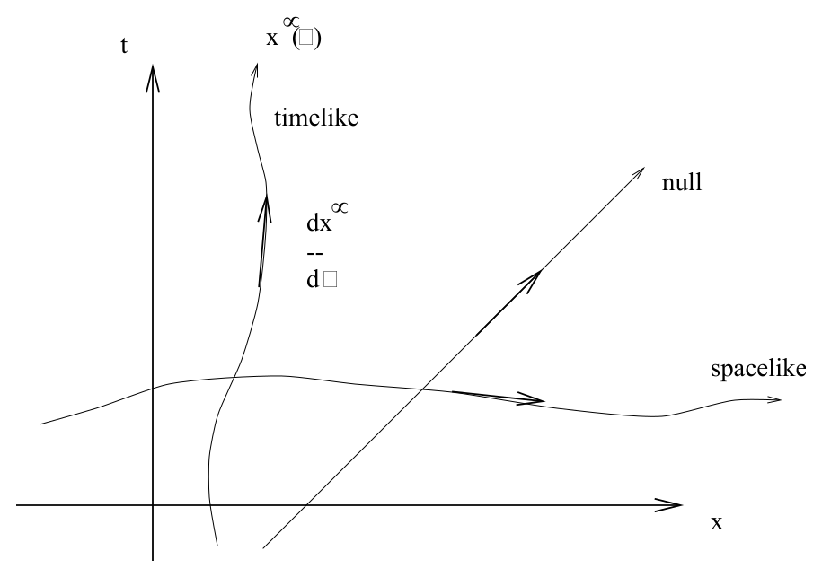

# 世界线、固有时与动量

<!-- CARROLL_NAV_TOP -->
> 完整译文 · 原 PDF 第 8–37 页 · [本章入口](../01-special-relativity-and-flat-spacetime.md) · [全书入口](../../carroll-general-relativity.md)
<!-- /CARROLL_NAV_TOP -->

## 世界线与因果类型

先从单个粒子的世界线说起。世界线由一个映射 ${\bf R} \rightarrow M$ 指定，其中 $M$ 是表示时空的流形；我们通常把这条路径看成参数化曲线 $x^\mu(\lambda)$。如前所述，这条路径的切向量是 $dx^\mu/d\lambda$（注意，它依赖于参数化方式）。我们主要关心的一个对象是切向量的范数，它可以用来刻画路径；如果在某个参数值 $\lambda$ 处，切向量是类时、类光或类空的，我们就说路径在该点是类时、类光或类空的。这也解释了为什么我们会用同样的词来分类切空间中的向量以及两点之间的间隔——因为，举例来说，连接两个类时分离点的直线，在沿路径的每一点上本身都会是类时的。

<figure>
  
  <figcaption>图 1.5：时空中的类时、类光与类空路径；箭头表示各路径的切向量。</figcaption>
</figure>

## 线元、路径长度与固有时

不过，我们必须留意这里暗中用到的一步处理。度规作为一个 $(0,2)$ 张量，是一台作用于两个向量（或者同一个向量的两个副本）并产生一个数的机器。因此，按照切向量范数的符号给它们分类是非常自然的。两点之间的间隔却没有这般自然；它依赖于连接这两个点的一条特定路径（即一条“直线”），而这种路径选择又依赖于时空平直这一事实（平直性使得两点之间的直线可以唯一选定）。一个更自然的对象是**线元**，也就是无穷小间隔：
$$
ds^2 = \eta_{\mu\nu}dx^\mu dx^\nu\ .
\tag{1.95}
$$
从这个定义出发，我们很容易想到开平方并沿路径积分，从而得到有限间隔。然而，由于 $ds^2$ 不一定为正，我们要针对不同情形采用不同的定义。对于类空路径，我们定义**路径长度**
$$
\Delta s = \int \sqrt{\eta_{\mu\nu}{{dx^\mu}\over{d\lambda}}
  {{dx^\nu}\over{d\lambda}}}\ d\lambda\ ,
\tag{1.96}
$$
其中积分沿路径进行。对于类光路径，间隔为零，所以不需要额外的公式。对于类时路径，我们定义**固有时**
$$
\Delta \tau = \int \sqrt{-\eta_{\mu\nu}{{dx^\mu}\over{d\lambda}}
  {{dx^\nu}\over{d\lambda}}}\ d\lambda\ ,
\tag{1.97}
$$
它将是正数。当然，我们也可以考虑在某些地方类时、另一些地方类空的路径，但幸运的是，这样做很少有必要，因为物理粒子的路径从不改变自身的因果类型（有质量粒子沿类时路径运动，无质量粒子沿类光路径运动）。此外，“固有时”这个名称格外贴切，因为 $\tau$ *实际测量的就是随路径一起携带的物理时钟所经历的时间*。这种观点让“双生子佯谬”和类似问题变得非常清楚；两条世界线不必是直线，只要它们在时空中的两个不同事件处相交，那么各自的固有时就由沿相应路径计算的积分 (1.97) 给出。这两个数通常会不同，即使沿两条世界线旅行的人出生于同一时刻也是如此。

## 以固有时参数化的四速度

现在，把讨论从一般路径转向有质量粒子的路径（它们总是类时的）。由于固有时由沿类时世界线运动的时钟测量，采用 $\tau$ 作为路径的参数会很方便。也就是说，我们先用 (1.97) 计算 $\tau(\lambda)$；只要 $\lambda$ 原本就是一个良好的参数，就可以将其反解为 $\lambda(\tau)$，随后便能把路径写成 $x^\mu(\tau)$。在这种参数化下，切向量称为**四速度** $U^\mu$：
$$
U^\mu = {{dx^\mu}\over{d\tau}}\ .
\tag{1.98}
$$
由于 $d\tau^2 = -\eta_{\mu\nu}dx^\mu dx^\nu$，四速度会自动归一化：
$$
\eta_{\mu\nu}U^\mu U^\nu = -1\ .
\tag{1.99}
$$
（它总是负的，因为我们只对类时轨迹定义四速度。也可以为类空路径定义一个类似的向量；类光路径会带来一些额外问题，因为其范数为零。）在粒子的静止系中，它的四速度分量为 $U^\mu = (1,0,0,0)$。

## 能量动量四向量

一个相关的向量是**能量—动量四向量**，其定义为
$$
p^\mu = m U^\mu\ ,
\tag{1.100}
$$
其中 $m$ 是粒子的质量。质量是一个不随惯性系变化的固定量，也就是你可能习惯称作“静止质量”的量。事实证明，从一开始就把它作为质量使用，比把质量看成随速度变化的量方便得多。粒子的**能量**就是 $p^0$，即能量—动量向量的类时分量。由于它只是一个四向量的单个分量，所以在 Lorentz 变换下并非不变量；这正符合预期，因为静止粒子的能量和同一粒子运动时的能量并不相同。在粒子的静止系中，我们有 $p^0 =m$；回想一下我们已令 $c=1$，便得到那条让 Einstein 声名大噪的方程 $E=mc^2$。（广义相对论的场方程其实比这条方程重要得多，但“$`R_{\mu\nu}- {1\over 2}
Rg_{\mu\nu}= 8\pi G T_{\mu\nu}`$”所激起的直觉反应，远不如“$E=mc^2$”强烈。）在一个运动的参考系中，可以通过 Lorentz 变换求出 $p^\mu$ 的分量；对于一个以（三维）速度 $v$ 沿 $x$ 轴运动的粒子，我们有
$$
p^\mu = (\gamma m, v\gamma m, 0 ,0)\ ,
\tag{1.101}
$$
其中 $\gamma = 1/\sqrt{1-v^2}$。当 $v$ 很小时，这给出 $p^0 = m+{1\over 2}mv^2$（也就是我们通常所说的静止能量加动能）以及 $p^1 = mv$（也就是我们通常所说的 [Newton] 动量）。因此，能量—动量向量名副其实。

## 四维力与 Lorentz 力

相对论诞生以前的物理学以 Newton 第二定律为核心，即 ${\bf f}=m{\bf a} = d{\bf p}/dt$。狭义相对论中也应当有一个类似的方程，而要求它具有张量形式，会直接引导我们引入满足下式的四维力向量 $f^\mu$：
$$
f^\mu = m{{d^2}\over{d\tau^2}}x^\mu(\tau) = {{d}\over{d\tau}}
  p^\mu(\tau)\ .
\tag{1.102}
$$
Newton 物理学中最简单的力之一是引力。不过，相对论把引力描述为时空本身的曲率，而不再把它作为一种力。我们转而考虑电磁学。三维 Lorentz 力由 ${\bf f} = q({\bf E} + {\bf v}\times{\bf B})$ 给出，其中 $q$ 是粒子所带的电荷。我们希望得到这个方程的张量推广。结果表明，答案是唯一的：
$$
f^\mu = qU^\lambda F_\lambda{}^\mu\ .
\tag{1.103}
$$
你可以自行验证，在低速极限下，它会还原成 Newton 版本。请注意，要求方程具有张量形式——这是保证 Lorentz 不变性的一种方式——会极大地限制我们可能得到的表达式。这体现了一种非常普遍的现象：面对看似无穷无尽的可能物理定律，对称性要求只会筛选出其中很少的几种。

<!-- CARROLL_NAV_BOTTOM -->
---
[← 微分形式与霍奇对偶](./03-differential-forms-and-hodge-duality.md) · [全书入口](../../carroll-general-relativity.md) · [能量动量张量与理想流体 →](./05-stress-energy-and-perfect-fluids.md)
<!-- /CARROLL_NAV_BOTTOM -->
