# 集合、映射、坐标图与流形

<!-- CARROLL_NAV_TOP -->
> 完整译文 · 原 PDF 第 38–61 页 · [本章入口](../02-manifolds-and-tensors.md) · [全书入口](../../carroll-general-relativity.md)
<!-- /CARROLL_NAV_TOP -->

## 从欧氏空间到流形

狭义相对论问世以后，爱因斯坦曾连续数年试图构造一种洛伦兹不变的引力理论，却始终没有成功。他最终取得的突破，是用弯曲时空取代闵可夫斯基时空；这种曲率由能量和动量产生，同时又反过来影响它们。在探究这一过程怎样发生以前，我们必须先学习一些关于弯曲空间的数学。我们首先一般性地考察流形，随后会在下一节研究曲率。为了保持一般性，我们通常在 $n$ 维中讨论；当然，如果你愿意，也完全可以取 $n=4$。

**流形**（manifold，有时也称“可微流形”）是数学和物理中最基本的概念之一。我们都熟悉 $n$ 维欧氏空间 ${\bf R}^n$ 的性质；它是所有 $n$ 元组 $(x^1,\ldots,x^n)$ 组成的集合。流形这个概念所要表达的是：一个空间尽管可能弯曲，并具有复杂的拓扑结构，但在局部区域中看起来恰如 ${\bf R}^n$。（这里的“看起来像”并不意味着度量相同，只意味着开集、函数和坐标等基本分析概念具有相同形式。）整个流形就是把这些局部区域光滑地缝合起来得到的。

### 流形的典型例子

流形的例子包括：

- ${\bf R}^n$ 本身，其中包括直线（${\bf R}$）、平面（${\bf R}^2$）等。这一点应当很明显，因为 ${\bf R}^n$ 不仅局部看起来像 ${\bf R}^n$，整体上也是如此。

- $n$ 维球面 $S^n$。它可以定义为 ${\bf R}^{n+1}$ 中到原点距离为某个固定值的全部点的轨迹。圆周当然就是 $S^1$，而二维球面 $S^2$ 将成为我们最常用的流形例子之一。

- $n$ 维环面 $T^n$，它可以通过取一个 $n$ 维立方体并把相对的面彼此等同而得到。因此，$T^2$ 就是通常所说的甜甜圈表面。

  <figure>
    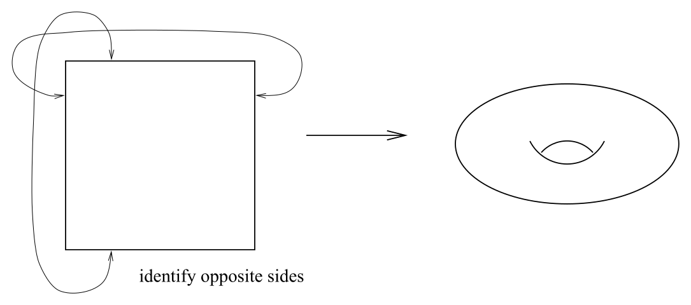
    <figcaption>图 2.1：把正方形的两对相对边分别等同，可得到二维环面。</figcaption>
  </figure>

- 亏格为 $g$ 的黎曼曲面，本质上可以看成带有 $g$ 个洞而非仅有一个洞的二维环面。$S^2$ 可以视为亏格为零的黎曼曲面。对熟悉这些术语的读者来说，每个“紧致、可定向、无边界”的二维流形，都是某个亏格的黎曼曲面。

  <figure>
    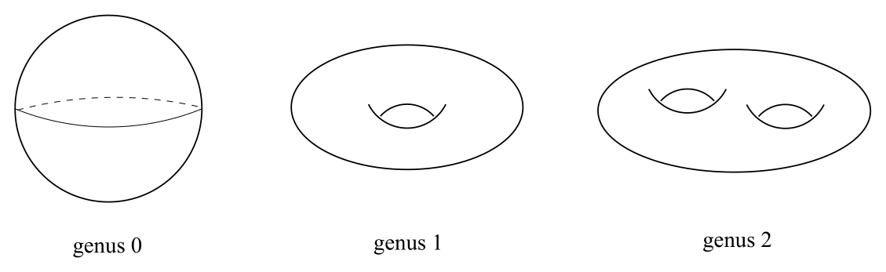
    <figcaption>图 2.2：带有不同数量把手的黎曼曲面，对应不同的亏格。</figcaption>
  </figure>

- 更抽象地说，${\bf R}^n$ 中的旋转之类的一组连续变换也构成流形。李群既是流形，同时还具有群结构。

- 两个流形的直积仍是流形。具体地说，给定维数分别为 $n$ 和 $n'$ 的流形 $M$ 与 $M'$，可以构造维数为 $n+n'$ 的流形 $M\times M'$；它由所有 $p\in M$ 和 $p'\in M'$ 所组成的有序对 $(p,p')$ 构成。

### 不属于流形的空间

看过这些例子以后，流形这个概念也许显得有些空泛：究竟还有什么东西不算流形？不属于流形的对象其实很多，因为它们会在某些地方无法局部呈现 ${\bf R}^n$ 的样子。例如，一条一维直线汇入一个二维平面，或者两个圆锥在顶点处粘在一起，都不构成流形。（单独一个圆锥没有问题；你可以设想把它的顶点磨平。）

<figure>
  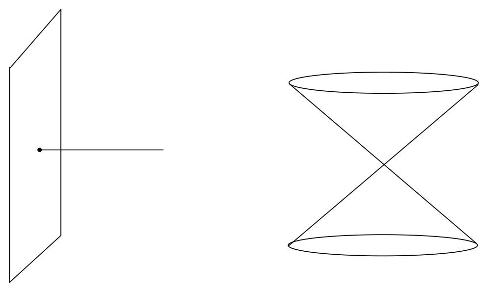
  <figcaption>图 2.3：一维直线接入二维平面，以及两个圆锥在顶点相接，都会产生非流形点。</figcaption>
</figure>

下面我们将逐步给出这个朴素想法的严格定义。为此需要先介绍若干预备定义。它们中的许多本来就相当直观，不过完整地列出来仍然很有益。

## 集合之间的映射

### 映射与复合

最基本的概念是两个集合之间的**映射**（map）。（我们假定你已经知道集合是什么。）给定两个集合 $M$ 和 $N$，映射 $\phi:M\rightarrow N$ 是一种对应关系，它把 $M$ 的每个元素恰好指派给 $N$ 中的一个元素。因此，映射只是函数概念的一种简单推广。描绘映射的标准图示如下：

<figure>
  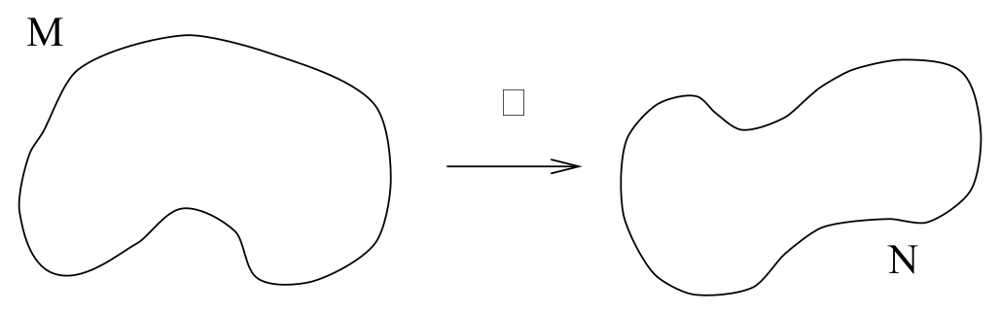
  <figcaption>图 2.4：映射把定义域中的每个元素指派给目标集合中的一个元素。</figcaption>
</figure>

给定两个映射 $\phi:A\rightarrow B$ 和 $\psi:B\rightarrow C$，我们用运算 $(\psi\circ\phi)(a)=\psi(\phi(a))$ 定义它们的**复合** $\psi\circ\phi:A\rightarrow C$。也就是说，$a\in A$，$\phi(a)\in B$，从而 $(\psi\circ\phi)(a)\in C$。映射的书写顺序很合理，因为最右边的映射先起作用。用图表示就是：

<figure>
  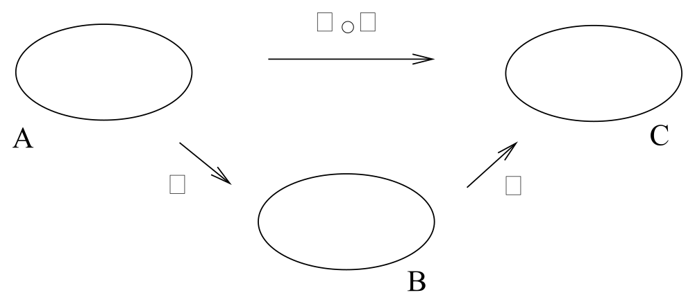
  <figcaption>图 2.5：复合映射中，右侧的 $\phi$ 先作用，随后由 $\psi$ 作用。</figcaption>
</figure>

### 单射、满射与双射

如果 $N$ 中每个元素至多有一个 $M$ 中的元素映到它，映射 $\phi$ 就称为**一一的**（one-to-one，也称“单射”，injective）；如果 $N$ 中每个元素至少有一个 $M$ 中的元素映到它，$\phi$ 就称为**到上的**（onto，也称“满射”，surjective）。（仔细想想，“一一”更合适的名字或许会是“二二”。）考虑函数 $\phi:{\bf R}\rightarrow{\bf R}$：$\phi(x)=e^x$ 是单射却非满射；$\phi(x)=x^3-x$ 是满射却非单射；$\phi(x)=x^3$ 两者兼具；$\phi(x)=x^2$ 则两者都不具备。

<figure>
  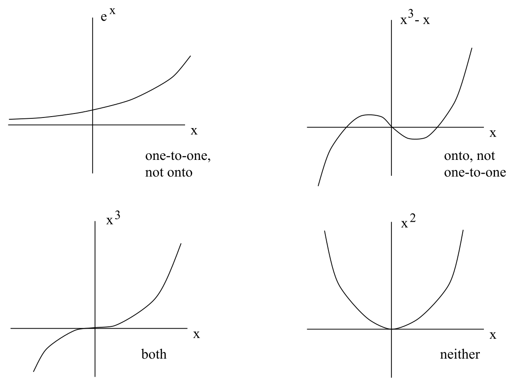
  <figcaption>图 2.6：单射、满射、双射以及既非单射也非满射的映射示意。</figcaption>
</figure>

集合 $M$ 称为映射 $\phi$ 的**定义域**（domain），而 $N$ 中由 $M$ 映入的那些点所组成的集合称为 $\phi$ 的**像**（image）。对任意子集 $U\subset N$，$M$ 中所有被映到 $U$ 的元素组成的集合称为 $U$ 在 $\phi$ 下的**原像**（preimage），记作 $\phi^{-1}(U)$。同时为单射和满射的映射称为**可逆的**（invertible，也称“双射”，bijective）。在这种情况下，可以用 $(\phi^{-1}\circ\phi)(a)=a$ 定义**逆映射** $\phi^{-1}:N\rightarrow M$。（注意，原像和逆映射使用同一个符号 $\phi^{-1}$；前者总有定义，后者只在某些特殊情形下才有定义。）于是有：

<figure>
  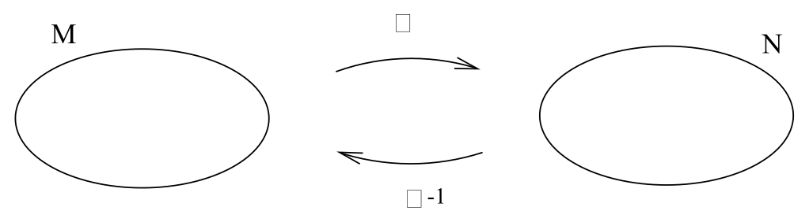
  <figcaption>图 2.7：可逆映射及其逆映射把元素送回原来的位置。</figcaption>
</figure>

### 连续性、光滑性与微分同胚

拓扑空间之间（因而也包括流形之间）的映射是否**连续**，其实是一个非常微妙的问题；我们并不真正需要它的精确定义。不过，对于欧氏空间之间的映射 $\phi:{\bf R}^m\rightarrow{\bf R}^n$，连续性和可微性的直观概念非常有用。从 ${\bf R}^m$ 到 ${\bf R}^n$ 的映射把一个 $m$ 元组 $(x^1,x^2,\ldots,x^m)$ 送到一个 $n$ 元组 $(y^1,y^2,\ldots,y^n)$，因此可以把它看成 $m$ 个变量的 $n$ 个函数 $\phi^i$ 的集合：
$$
\matrix{y^1 =\phi^1(x^1,x^2,\ldots,x^m)\cr
  y^2=\phi^2(x^1,x^2,\ldots,x^m)\cr
  \cdot\cr\cdot\cr\cdot\cr y^n=\phi^n(x^1,x^2,\ldots,x^m)\ .\cr}
\tag{2.1}
$$
如果其中任意一个函数连续并且可微 $p$ 次，我们就称它为 $C^p$；如果映射 $\phi:{\bf R}^m\rightarrow{\bf R}^n$ 的每个分量函数至少都是 $C^p$，就称整个映射为 $C^p$。因此，$C^0$ 映射是连续映射，但未必可微；$C^\infty$ 映射则连续，并且想微分多少次都可以。$C^\infty$ 映射有时称为**光滑映射**（smooth map）。如果存在一个 $C^\infty$ 映射 $\phi:M\rightarrow N$，其逆映射 $\phi^{-1}:N\rightarrow M$ 也是 $C^\infty$ 的，我们就称集合 $M$ 和 $N$ **微分同胚**（diffeomorphic）；此时 $\phi$ 称为一个微分同胚映射。

题外话：两个空间微分同胚这一概念只适用于流形，因为流形在局部类似 ${\bf R}^n$，从而继承了可微性的概念。不过，拓扑空间之间的映射（这些空间未必是流形）仍然可以定义“连续性”。如果两个这样的空间之间存在一个连续且具有连续逆映射的映射，我们就称它们**同胚**（homeomorphic），意思是“拓扑等价”。因此，完全可能存在彼此同胚却不微分同胚的空间：它们在拓扑上相同，却具有不同的“微分结构”。1964 年，Milnor 证明 $S^7$ 有 28 种不同的微分结构；后来发现，当 $n<7$ 时，$S^n$ 上只有一种微分结构，而当 $n>7$ 时，其数量会变得非常庞大。${\bf R}^4$ 则有无穷多种微分结构。

### 链式法则与雅可比行列式

我们以后会用到一个普通微积分中的结论，即**链式法则**。设有映射 $f:{\bf R}^m\rightarrow{\bf R}^n$ 和 $g:{\bf R}^n\rightarrow{\bf R}^l$，因而也有复合映射 $(g\circ f):{\bf R}^m\rightarrow{\bf R}^l$。

<figure>
  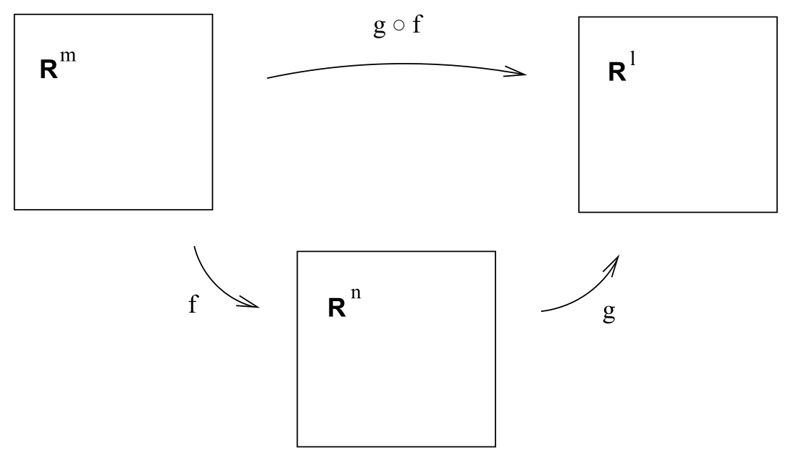
  <figcaption>图 2.8：映射 $f$ 与 $g$ 的复合，以及三个空间各自的坐标。</figcaption>
</figure>

我们可以分别用坐标表示每个空间：${\bf R}^m$ 上用 $x^a$，${\bf R}^n$ 上用 $y^b$，${\bf R}^l$ 上用 $z^c$，各指标在相应的取值范围内变化。链式法则把复合映射的偏导数同各个映射的偏导数联系起来：
$$
{{\partial}\over{\partial x^a}}(g\circ f)^c =
  \sum_b {{\partial f^b}\over{\partial x^a}}{{\partial g^c}
  \over{\partial y^b}}\ .
\tag{2.2}
$$
它通常简写成
$$
{{\partial}\over{\partial x^a}} = \sum_b {{\partial y^b}\over
  {\partial x^a}}{{\partial}\over{\partial y^b}}\ .
\tag{2.3}
$$
使用这种形式的链式法则既不违法，也不违背道德，不过你应当能够在脑中看见这一构造背后的映射。回想一下，当 $m=n$ 时，矩阵 $\partial y^b/\partial x^a$ 的行列式称为该映射的**雅可比行列式**（Jacobian）；只要雅可比行列式非零，映射就是可逆的。

这些基本定义你想必已经熟悉，哪怕只剩下模糊的印象。下面我们将用它们严格定义流形。遗憾的是，要把这个相当直观的概念形式化，需要一套略显繁复的程序。首先必须定义可以在其上设置坐标系的开集，然后以恰当方式把这些开集缝合起来。

## 坐标图、图册与流形

### 开球与开集

先从**开球**（open ball）说起。它是 ${\bf R}^n$ 中满足 $|x-y|<r$ 的全部点 $x$ 所组成的集合，其中 $y\in{\bf R}^n$ 和 $r\in{\bf R}$ 固定，并且 $|x-y|=[\sum_i(x^i-y^i)^2]^{1/2}$。注意这里是严格不等式——开球就是以 $y$ 为中心、半径为 $r$ 的 $n$ 维球的内部。

<figure>
  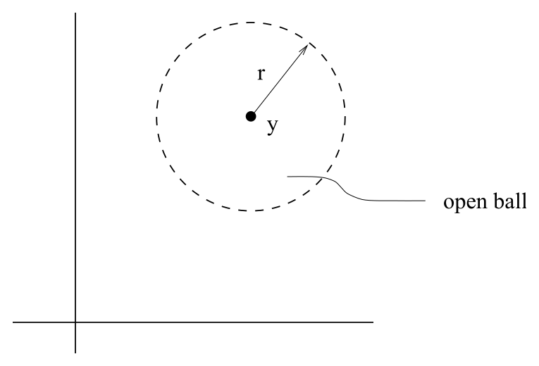
  <figcaption>图 2.9：以 $y$ 为中心、半径为 $r$ 的开球不包含边界。</figcaption>
</figure>

${\bf R}^n$ 中的**开集**（open set）是任意多个（可能无穷多个）开球的并。换句话说，如果对任意 $y\in V$，都存在一个以 $y$ 为中心且完全位于 $V$ 内部的开球，那么 $V\subset{\bf R}^n$ 就是开集。粗略地说，开集是某个 $(n-1)$ 维闭曲面的内部（或者若干个这类内部的并）。一旦规定了开集的概念，我们就为 ${\bf R}^n$ 赋予了一个拓扑——在这里，它就是“标准度量拓扑”。

### 坐标图与光滑图册

一个**坐标图**或**坐标系**（chart or coordinate system）由集合 $M$ 的一个子集 $U$ 和一个单射 $\phi:U\rightarrow{\bf R}^n$ 共同构成，并要求像 $\phi(U)$ 在 ${\bf R}$ 中是开集。（任意映射对它自己的像都是满射，所以映射 $\phi:U\rightarrow\phi(U)$ 可逆。）于是我们可以称 $U$ 为 $M$ 中的一个开集。（这样便在 $M$ 上诱导出了一个拓扑，不过这里不再深入讨论。）

<figure>
  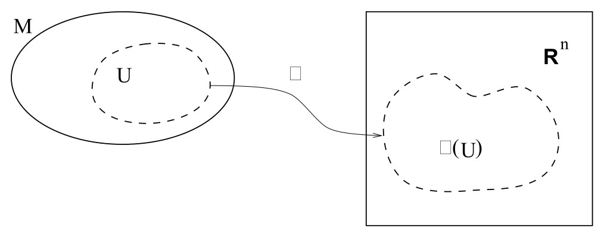
  <figcaption>图 2.10：坐标图把 $M$ 的一个开集 $U$ 一一映到欧氏空间中的开集。</figcaption>
</figure>

一个 **$C^\infty$ 图册**（atlas）是由坐标图组成的带指标集合 $\{(U_\alpha,\phi_\alpha)\}$，并满足两个条件：

1. 所有 $U_\alpha$ 的并等于 $M$；也就是说，$U_\alpha$ 覆盖 $M$。

2. 各坐标图之间以光滑方式缝合。更精确地说，如果两个坐标图发生重叠，即 $U_\alpha\cap U_\beta\neq\emptyset$，那么映射 $(\phi_\alpha\circ\phi_\beta^{-1})$ 会把 $\phi_\beta(U_\alpha\cap U_\beta)\subset{\bf R}^n$ 中的点映**到整个** $\phi_\alpha(U_\alpha\cap U_\beta)\subset{\bf R}^n$；所有这些映射在各自有定义的地方都必须是 $C^\infty$ 的。用图会看得更清楚：

<figure>
  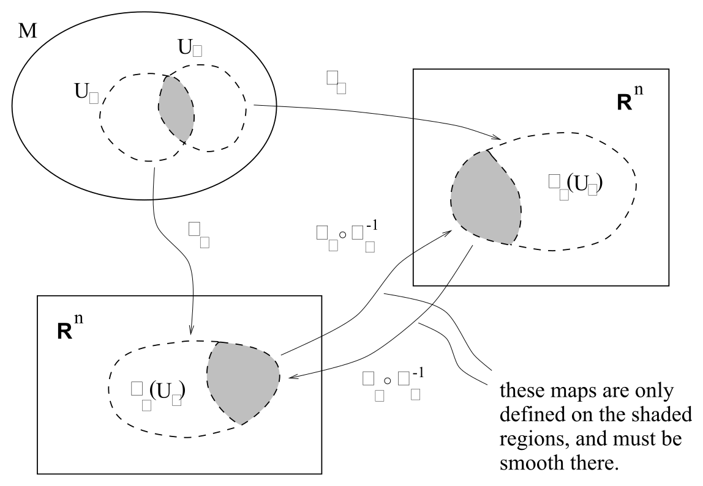
  <figcaption>图 2.11：两个坐标图在重叠区域上由光滑的坐标过渡映射联系起来。</figcaption>
</figure>

所以，坐标图就是我们通常所说的某个开集上的坐标系；图册则是一套在重叠区域上彼此光滑关联的坐标图。

### 流形的严格定义

终于可以给出定义了：一个 $C^\infty$ 的 $n$ 维**流形**（简称 $n$-流形），就是一个集合 $M$ 加上一个“极大图册”，即包含每个可能的相容坐标图的图册。（也可以在上述全部定义中用 $C^p$ 取代 $C^\infty$。就我们的目的而言，流形的可微程度并非关键；我们总是假定任何流形都具有当前应用所需的可微性。）要求图册极大，是为了避免给两个等价空间配上不同图册以后，就把它们算作两个不同的流形。这个定义以形式化语言准确表达了“一个集合局部看起来像 ${\bf R}^n$”的想法。当然，我们很少需要动用定义的全部威力，不过精确本身自有价值。

这个定义有一个可取之处：它不依赖于把流形嵌入某个更高维欧氏空间。事实上，任意 $n$ 维流形都可以嵌入 ${\bf R}^{2n}$（“Whitney 嵌入定理”），有时我们也会利用这一事实（例如前面对球面的定义）。不过，必须认识到，流形拥有独立于任何嵌入的自身存在。例如，我们没有理由认为四维时空嵌在某个更大的空间里。（实际上，一些人——弦理论家等——相信我们的四维世界是十维或十一维时空的一部分；但对广义相对论而言，四维观点完全够用。）

## 为什么需要多个坐标图

### 圆周上的坐标图

既然如此，为什么还要对坐标图及其重叠区域如此讲究，何不直接用单个坐标图覆盖每个流形？原因是多数流形无法由一个坐标图覆盖。考虑最简单的例子 $S^1$。圆周上有一种惯用坐标系 $\theta:S^1\rightarrow{\bf R}$：令圆周顶端为 $\theta=0$，然后绕圆一周直到 $2\pi$。然而，坐标图的定义要求像 $\theta(S^1)$ 在 ${\bf R}$ 中是开集。如果纳入 $\theta=0$ 或 $\theta=2\pi$ 中的任一点，得到的就是闭区间而非开区间；如果两个点都排除，又无法覆盖整个圆周。因此至少需要两个坐标图，如图所示。

<figure>
  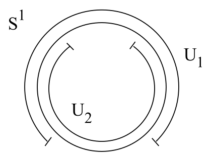
  <figcaption>图 2.12：覆盖整个圆周至少需要两个相互重叠的坐标图。</figcaption>
</figure>

### 二维球面与球极投影

$S^2$ 提供了一个稍复杂的例子，它同样无法由一个坐标图覆盖。传统世界地图所用的 Mercator 投影会漏掉北极和南极（也会漏掉国际日期变更线，其中涉及的正是我们在 $S^1$ 上碰到的同一个 $\theta$ 问题）。把 $S^2$ 取为 ${\bf R}^3$ 中满足 $(x^1)^2+(x^2)^2+(x^3)^2=1$ 的点集。定义开集 $U_1$ 为去掉北极后的球面，再通过“球极投影”构造一个坐标图：

<figure>
  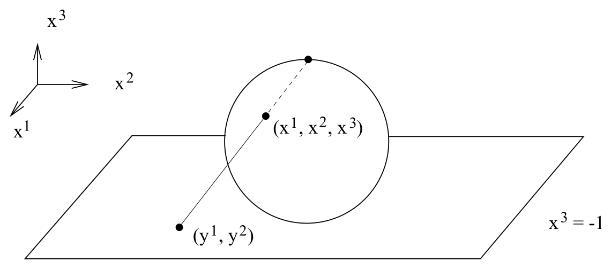
  <figcaption>图 2.13：从北极向 $x^3=-1$ 平面作球极投影。</figcaption>
</figure>

具体来说，从北极向 $x^3=-1$ 所定义的平面画一条直线；直线与 $S^2$ 相交的点，被赋予平面上相应点的笛卡尔坐标 $(y^1,y^2)$。显式地说，这一映射为
$$
\phi_1(x^1,x^2,x^3) \equiv (y^1,y^2) = \left(
  {{2x^1}\over{1-x^3}}\ ,\ {{2x^2}\over{1-x^3}}\right)\ .
\tag{2.4}
$$
建议你亲自核对这个结果。另一个坐标图 $(U_2,\phi_2)$ 可以通过从南极向 $x^3=+1$ 所定义的平面投影得到。所得坐标覆盖去掉南极后的球面，并由下式给出：
$$
\phi_2(x^1,x^2,x^3) \equiv (z^1,z^2) = \left(
  {{2x^1}\over{1+x^3}}\ ,\ {{2x^2}\over{1+x^3}}\right)\ .
\tag{2.5}
$$
这两个坐标图合在一起覆盖整个流形，并在区域 $-1<x^3<+1$ 内重叠。你还可以核对，复合映射 $\phi_2\circ\phi_1^{-1}$ 为
$$
z^i = {{4y^i}\over{[(y^1)^2 +(y^2)^2]}}\ ,
\tag{2.6}
$$
并且在重叠区域内是 $C^\infty$ 的。只要把注意力限制在该区域，式 (2.6) 就是我们通常所说的坐标变换。

由此可以看出坐标图和图册的必要性：许多流形无法由单一坐标系覆盖。（当然，有些流形可以，甚至一些具有非平凡拓扑的流形也可以。你能否想出一个覆盖圆柱 $S^1\times{\bf R}$ 的良好单一坐标系？）尽管如此，实际工作中使用单个坐标图往往最方便，只需同时记清有哪些点没有包含在其中即可。

<!-- CARROLL_NAV_BOTTOM -->
---
[← 能量动量张量与理想流体](../01-special-relativity-and-flat-spacetime/05-stress-energy-and-perfect-fluids.md) · [全书入口](../../carroll-general-relativity.md) · [微分、向量与张量分量 →](./02-differentiation-vectors-and-tensor-components.md)
<!-- /CARROLL_NAV_BOTTOM -->
