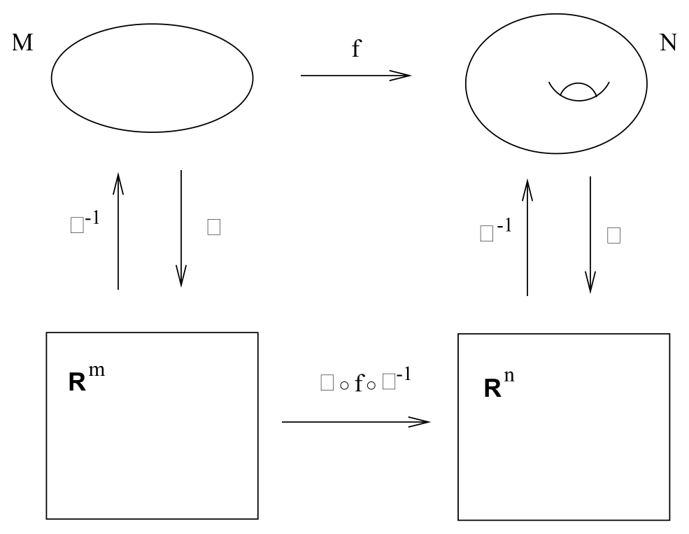
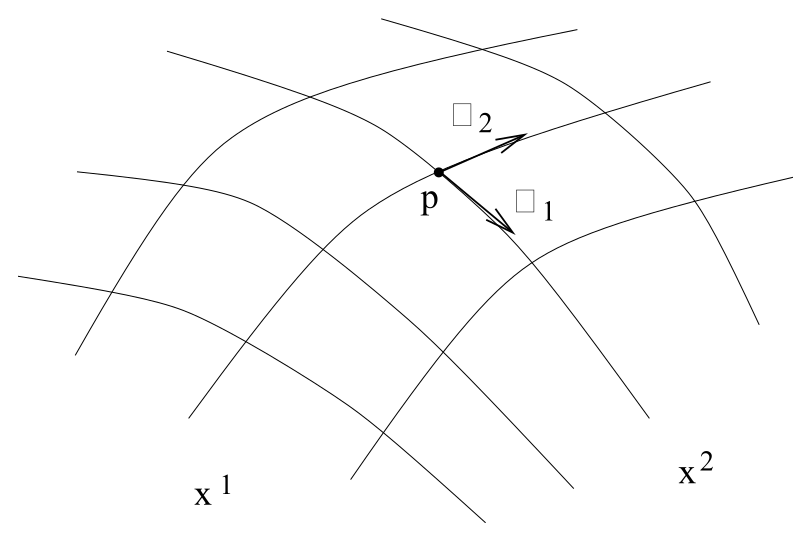
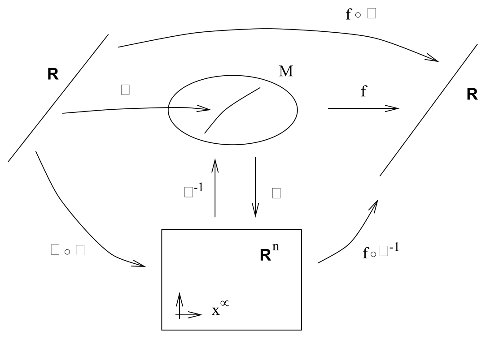
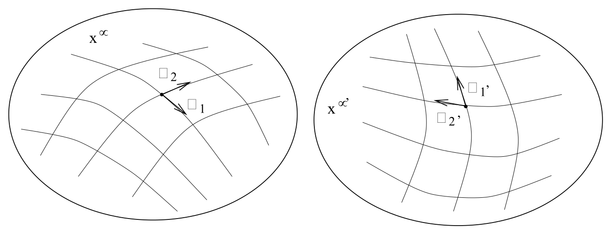

# 微分、向量与张量分量

<!-- CARROLL_NAV_TOP -->
> 完整译文 · 原 PDF 第 38–61 页 · [本章入口](../02-manifolds-and-tensors.md) · [全书入口](../../carroll-general-relativity.md)
<!-- /CARROLL_NAV_TOP -->

## 流形上的微分

流形在局部看起来像 ${\bf R}^n$，这一事实通过坐标图的构造体现出来，也使我们能够在流形上进行分析，包括微分和积分等运算。考虑维数分别为 $m$ 和 $n$ 的两个流形 $M$ 与 $N$，其中 $M$ 上有坐标图 $\phi$，$N$ 上有坐标图 $\psi$。设有函数 $f:M\rightarrow N$：

<figure>
  
  <figcaption>图 2.14：坐标图把流形之间的映射转写成欧氏空间之间的映射。</figcaption>
</figure>

如果只把 $M$ 和 $N$ 看成集合，我们无法轻率地对映射 $f$ 求导，因为此时还不知道这种运算意味着什么。但坐标图允许我们构造映射 $(\psi\circ f\circ\phi^{-1}):{\bf R}^m\rightarrow{\bf R}^n$。（在这里以及后文所有适当之处，你都可以自行补上“在这些映射有定义的地方”这句话。）这已经是欧氏空间之间的映射，因此高等微积分中的全部概念都适用。例如，把 $f$ 看成 $M$ 上取值于 $N$ 的函数，就可以对它求导，得到 ${\partial f}/{\partial x^\mu}$，其中 $x^\mu$ 表示 ${\bf R}^m$ 上的坐标。关键在于，这种记法只是一种简写，实际进行的是
$$
{{\partial f}\over{{\partial}_{} x^\mu}} \equiv {{\partial}\over{{\partial}_{} x^\mu}}
  (\psi\circ f\circ\phi^{-1})(x^{\mu})\ .
\tag{2.7}
$$
如果每次都把坐标映射显式写出，表达式将繁琐得无法使用，更不用说还会显得过于迂腐。对大多数用途而言，左边的简写已经足够。

有了这些基础，我们现在可以开始在流形上引入各种结构。先从向量和切空间说起。在讨论狭义相对论时，我们有意含糊处理了向量的定义以及向量与时空之间的关系。当时特别强调了**切空间**这个概念，也就是时空中某一点处全部向量的集合。这样强调，是为了让你摆脱“向量从流形上的一个点延伸到另一个点”的印象，并把它理解为只与单个点相联系的对象。采用这种观点会暂时失去一种表述能力：像“这个向量指向 $x$ 方向”这样的话该怎样理解？如果切空间只是与每一点相联系的抽象向量空间，这句话的含义就很难确定。现在该解决这个问题了。

## 用方向导数构造切空间

### 经过一点的曲线

设想我们希望仅利用流形 $M$ 的内在对象来构造点 $p\in M$ 处的切空间，不借助向更高维空间的嵌入等外部结构。第一个猜想可能是利用我们的直观认识：存在一种称为“曲线的切向量”的对象，它们应当属于切空间。因此，可以考虑所有经过 $p$ 的参数化曲线，也就是所有像中含有 $p$ 的（非退化）映射 $\gamma:{\bf R}\rightarrow M$ 所组成的空间。人们很容易想把切空间直接定义为这些曲线在 $p$ 点的全部切向量所成的空间。但这样显然是在偷换概念：切空间 $T_p$ 本来就应定义为 $p$ 点处向量的空间；在它得到定义以前，我们还没有独立的方式说明“曲线的切向量”究竟是什么。在某个坐标系 $x^\mu$ 中，每条经过 $p$ 的曲线都由 $n$ 个实数 $dx^\mu/d\lambda$（$\lambda$ 是沿曲线的参数）确定 ${\bf R}^n$ 中的一个元素；然而这个映射显然依赖坐标，无法满足我们的要求。

尽管如此，我们的方向是对的，只需让构造摆脱坐标依赖。为此，定义 ${\cal F}$ 为 $M$ 上所有光滑函数的空间，也就是所有 $C^\infty$ 映射 $f:M\rightarrow{\bf R}$ 的空间。随后注意到，每条经过 $p$ 的曲线都在这个函数空间上定义了一个算子，即方向导数；它把 $f$ 映为 $df/d\lambda$（在 $p$ 点取值）。我们提出如下论断：*切空间 $T_p$ 可以与沿所有经过 $p$ 的曲线所定义的方向导数算子空间等同起来。* 为确立这一想法，必须证明两点：第一，方向导数的空间是向量空间；第二，它确实是我们想要的那个向量空间——其维数与 $M$ 相同，能够自然表达沿某个方向的向量，等等。

### 方向导数构成向量空间

第一个论断，也就是方向导数构成向量空间，看起来十分直接。设有两个算子 ${d\over{d\lambda}}$ 和 ${d\over{d\eta}}$，分别表示沿两条经过 $p$ 的曲线求导。把它们相加并乘以实数完全没有问题，由此得到新算子 $a{d\over{d\lambda}}+b{d\over{d\eta}}$。然而，这个空间是否封闭并非立刻可见；换言之，所得算子本身是否仍为导数算子？一个合格的导数算子应当线性作用于函数，并对函数的乘积满足通常的 Leibniz（乘积）法则。新算子显然是线性的，所以只需验证它满足 Leibniz 法则。我们有
$$
\begin{aligned}
\left(a{d\over{d\lambda}}+ b{d\over{d\eta}}\right)(fg)
  & = &  af{{dg}\over{d\lambda}} + ag{{df}\over{d\lambda}} +
  bf{{dg}\over{d\eta}} + bg{{df}\over{d\eta}} \notag \\
  & = &  \left(a{{df}\over{d\lambda}}+ b{{df}\over{d\eta}}\right)g +
  \left(a{{dg}\over{d\lambda}}+ b{{dg}\over{d\eta}}\right)f\ .
\end{aligned}
\tag{2.8}
$$
正如我们所希望的那样，乘积法则成立，因此方向导数的集合确实是一个向量空间。

### 坐标基

它是否就是我们希望等同于切空间的向量空间？最容易令人信服的办法是为这个空间找出一组基。再次考虑一个坐标为 $x^\mu$ 的坐标图。在 $p$ 点有一组显然的 $n$ 个方向导数，也就是 $p$ 点的偏导数 ${\partial}_\mu$。

<figure>
  
  <figcaption>图 2.15：坐标方向上的偏导数在一点处给出切空间的一组自然基。</figcaption>
</figure>

下面要论证，$p$ 点的偏导算子 $\{{\partial}_\mu\}$ 构成切空间 $T_p$ 的一组基。（于是立刻可以推出 $T_p$ 是 $n$ 维的，因为基向量恰有 $n$ 个。）为此，我们将证明任意方向导数都能分解为若干实数乘偏导数之和。这其实就是熟悉的切向量分量表达式，不过通过这一整套形式化机制再看一遍仍很有益。考虑一个 $n$ 维流形 $M$、坐标图 $\phi:M\rightarrow{\bf R}^n$、曲线 $\gamma:{\bf R}\rightarrow M$ 和函数 $f:M\rightarrow{\bf R}$。它们形成如下这一团映射：

<figure>
  
  <figcaption>图 2.16：借助坐标图，把沿流形上曲线的求导化为实数空间中的链式求导。</figcaption>
</figure>

若 $\lambda$ 是沿 $\gamma$ 的参数，我们希望用偏导数 ${\partial}_\mu$ 展开向量或算子 ${{d}\over{d\lambda}}$。利用链式法则 (2.2)，有
$$
\begin{aligned}
{d\over{d\lambda}}f &=&  {d\over{d\lambda}}(f\circ\gamma)\notag \\
  &=& {d\over{d\lambda}}[(f\circ\phi^{-1})\circ(\phi\circ\gamma)]\notag \\
  &=& {{d(\phi\circ\gamma)^\mu}\over{d\lambda}}
  {{\partial(f\circ\phi^{-1})}\over{\partial x^\mu}}\notag \\
  &=&  {{dx^\mu}\over{d\lambda}}{\partial}_{\mu }f\ .
\end{aligned}
\tag{2.9}
$$
第一行只是把左边的非正式表达式改写成函数 $(f\circ\gamma):{\bf R}\rightarrow{\bf R}$ 的严格导数。第二行直接来自逆映射 $\phi^{-1}$ 的定义（以及复合运算的结合律）。第三行使用正式的链式法则 (2.2)，最后一行则回到了开头的非正式记法。由于函数 $f$ 是任意的，我们有
$$
{d\over{d\lambda}} = {{dx^\mu}\over{d\lambda}}{\partial}_{\mu}\ .
\tag{2.10}
$$
因此，偏导数 $\{{\partial}_\mu\}$ 的确构成方向导数向量空间的一组良好基，我们也就可以放心地把这个空间等同于切空间。

当然，${d\over{d\lambda}}$ 所表示的向量早已为我们所熟知：它就是参数为 $\lambda$ 的曲线的切向量。因此，可以把 (2.10) 看成 (1.24) 的另一种表述；在那里，我们声称切向量的分量就是 $dx^\mu/d\lambda$。这里唯一的区别是，我们正在任意流形上工作，并且把基向量明确选为 ${\hat e}_{(\mu)}={\partial}_\mu$。

这组特殊的基（${\hat e}_{(\mu)}={\partial}_\mu$）称为 $T_p$ 的**坐标基**（coordinate basis）；它把“令基向量沿坐标轴方向指向”这一想法形式化了。考虑切向量时，我们并不受限于坐标基；例如，采用某种正交归一基有时会更方便。不过坐标基极为简单自然，本课程几乎始终使用它。

## 向量与坐标变换

我们对向量采取的这一较为抽象的观点有一个优点：变换定律可以立即得到。由于基向量为 ${\hat e}_{(\mu)}={\partial}_\mu$，根据链式法则 (2.3)，新坐标系 $x^{\mu'}$ 中的基向量为
$$
{\partial}_{\mu'} = {{\partial x^\mu}\over{\partial x^{\mu'}}}{\partial}_{\mu}\ .
\tag{2.11}
$$
得到向量分量变换定律的方法，与平直空间中使用的技巧相同：要求向量 $V=V^\mu{\partial}_\mu$ 在基底变换下保持不变。于是
$$
\begin{aligned}
V^\mu{\partial}_{\mu }&=&  V^{\mu'}{\partial}_{\mu'}\notag \\
  &=&  V^{\mu'}{{\partial x^\mu}\over{\partial x^{\mu'}}}{\partial}_{\mu}\ ,
\end{aligned}
\tag{2.12}
$$
从而（因为矩阵 $\partial x^{\mu'}/\partial x^\mu$ 是矩阵 $\partial x^\mu/\partial x^{\mu'}$ 的逆）
$$
V^{\mu'} = {{\partial x^{\mu'}}\over{\partial x^{\mu}}}V^\mu
  \ .
\tag{2.13}
$$
由于基向量通常不显式写出，分量的变换规则 (2.13) 就是我们所说的“向量变换定律”。可以看到，它与狭义相对论中洛伦兹变换下的向量分量变换 $V^{\mu'}=\Lambda^{\mu'}{}_{\mu}V^\mu$ 相容，因为洛伦兹变换是坐标变换的一种特殊情形，其中 $x^{\mu'}=\Lambda^{\mu'}{}_{\mu}x^\mu$。但 (2.13) 更加一般，它包含任意坐标变换（因而包含任意相应的基底变换）下向量的行为，不只适用于线性变换。和以往一样，我们希望强调一个略显微妙的本体论区别：张量分量不会单凭坐标名称的改变而改变；它们会在切空间的基底改变时改变，而我们已经选择用坐标来定义基底。因此，坐标变换会诱导基底变换：

<figure>
  
  <figcaption>图 2.17：改变坐标会诱导每一点切空间中坐标基的改变。</figcaption>
</figure>

## 对偶向量与余切空间

考察完向量以后，我们继续沿着平直空间中的步骤前进，接着讨论对偶向量，也就是一形式。余切空间 $T^*_p$ 仍然是所有线性映射 $\omega:T_p\rightarrow{\bf R}$ 的集合。一形式的标准例子是函数 $f$ 的梯度，记作 ${\rm d}f$。它作用在向量 ${d\over{d\lambda}}$ 上，恰好得到该函数的方向导数：
$$
{\rm d}f\left({d\over{d\lambda}}\right)={{df}\over{d\lambda}}\ .
\tag{2.14}
$$
人们很容易产生这样的想法：“为什么不能把函数 $f$ 本身看成一形式，再把 $df/d\lambda$ 看成它的作用结果？”关键在于，一形式和向量一样，只存在于其定义所在的点，并不依赖 $M$ 上其他点的信息。知道一个函数在某点邻域中的取值，就可以求它的导数；只知道它在该点的值则做不到。另一方面，梯度恰好编码了沿所有经过 $p$ 的曲线求方向导数所需的信息，因此能够履行对偶向量的职责。

正如沿坐标轴的偏导数为切空间提供自然基，坐标函数 $x^\mu$ 的梯度也为余切空间提供自然基。回想一下，在平直空间中，我们通过要求 ${\hat\theta}^{(\mu)}({\hat e}_{(\nu)})=\delta^\mu_\nu$ 构造了 $T^*_p$ 的一组基。把同样的思想延续到任意流形上，由 (2.14) 可得
$$
{\rm d}x^\mu({\partial}_{\nu}) = {{\partial x^\mu}\over{\partial x^\nu}}
  =\delta^\mu_\nu\ .
\tag{2.15}
$$
所以，梯度 $\{{\rm d}x^\mu\}$ 是一组合适的基一形式；任意一形式都可以按分量展开为 $\omega=\omega_\mu\,{\rm d}x^\mu$。

基对偶向量及其分量的变换性质，也可以通过如今已经熟悉的步骤得到。对基一形式，有
$$
{\rm d}x^{\mu'} = {{\partial x^{\mu'}}\over{\partial x^{\mu}}}\,{\rm d}x^\mu
  \  ,
\tag{2.16}
$$
对分量则有
$$
\omega_{\mu'} = {{\partial x^{\mu}}\over{\partial x^{\mu'}}}\omega_\mu
  \ .
\tag{2.17}
$$
谈到一形式 $\omega$ 时，我们通常会写出它的分量 $\omega_\mu$。

## 一般张量的变换定律

一般张量的变换定律遵循同样的模式：把平直空间中使用的洛伦兹变换矩阵，换成表示更一般坐标变换的矩阵。一个 $(k,l)$ 型张量 $T$ 可以展开为
$$
T = T^{\mu_1 \cdots \mu_k}{}_{\nu_1\cdots\nu_l}
  {\partial}_{\mu_1}\otimes\cdots\otimes{\partial}_{\mu_k}\otimes
  {\rm d}x^{\nu_1}\otimes\cdots\otimes{\rm d}x^{\nu_l}\ ,
\tag{2.18}
$$
在坐标变换下，其分量按照下式改变：
$$
T^{\mu_1' \cdots \mu_k'}{}_{\nu_1'\cdots\nu_l'} =
  {{\partial x^{\mu_1'}}\over{\partial x^{\mu_1}}}\cdots
  {{\partial x^{\mu_k'}}\over{\partial x^{\mu_k}}}
  {{\partial x^{\nu_1}}\over{\partial x^{\nu_1'}}}\cdots
  {{\partial x^{\nu_l}}\over{\partial x^{\nu_l'}}}
  T^{\mu_1 \cdots \mu_k}{}_{\nu_1\cdots\nu_l} \ .
\tag{2.19}
$$
这一张量变换定律很容易记忆，因为一旦指标的位置确定，实际上也没有别的可能形式。不过，要变换一个张量，通常还有一种更简便的方法：直接把基向量与偏导数、基一形式与梯度的等同关系当真，然后代入坐标变换。

### 二维对称张量的例子

作为例子，考虑二维流形上的一个对称 $(0,2)$ 型张量 $S$。在坐标系 $(x^1=x,x^2=y)$ 中，它的分量为
$$
S_{\mu\nu}= \left(\matrix{x&0\cr 0&1\cr}\right)\ .
\tag{2.20}
$$
等价地，可以写成
$$
\begin{aligned}
S &=&  S_{\mu\nu}({\rm d}x^\mu \otimes {\rm d}x^\nu)\notag \\
  &=&  x({\rm d}x)^2 + ({\rm d}y)^2\ ,
\end{aligned}
\tag{2.21}
$$
最后一行中为了简洁省略了张量积符号。现在考虑新坐标
$$
\begin{aligned}
x' &=&  x^{1/3}\notag \\ y' &=&  e^{x+y}\ .
\end{aligned}
\tag{2.22}
$$
由此直接得到
$$
\begin{aligned}
x &=&  (x^\prime)^3\notag \\ y &=&  \ln(y^\prime) - (x^\prime)^3\notag \\
  {\rm d}x &=&  3(x^\prime)^2 \,{\rm d}x^\prime\notag \\ {\rm d}y &=&  {1\over{y^\prime}}\,{\rm d}y^\prime
  - 3(x^\prime)^2\,{\rm d}x^\prime\ .
\end{aligned}
\tag{2.23}
$$
只需把这些表达式直接代入 (2.21)，就可以得到下式（要记住张量积不满足交换律，所以 ${\rm d}x'\,{\rm d}y'\neq{\rm d}y'\,{\rm d}x'$）：
$$
S= 9(x')^4[1+(x')^3]({\rm d}x')^2 -3{{(x')^2}\over{y'}}({\rm d}x' \,{\rm d}y'
  +{\rm d}y' \,{\rm d}x') + {1\over{(y')^2}}({\rm d}y')^2\ ,
\tag{2.24}
$$
或者
$$
S_{\mu'\nu'} = \left(\matrix{9(x')^4[1+(x')^3]&-3{{(x')^2}\over{y'}}\cr
  -3{{(x')^2}\over{y'}}&{1\over{(y')^2}}\cr}\right)\ .
\tag{2.25}
$$
注意，它仍然是对称的。这里没有直接使用变换定律 (2.19)，但你可以核对：直接使用该定律也会得到同样的结果。

<!-- CARROLL_NAV_BOTTOM -->
---
[← 集合、映射、坐标图与流形](./01-sets-maps-charts-and-manifolds.md) · [全书入口](../../carroll-general-relativity.md) · [度量、正规坐标与偏导数 →](./03-metric-normal-coordinates-and-partial-derivatives.md)
<!-- /CARROLL_NAV_BOTTOM -->
