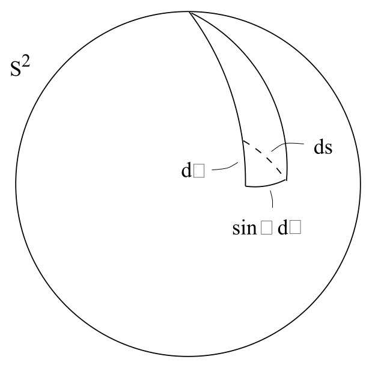

# 度量、正规坐标与偏导数

<!-- CARROLL_NAV_TOP -->
> 完整译文 · 原 PDF 第 38–61 页 · [本章入口](../02-manifolds-and-tensors.md) · [全书入口](../../carroll-general-relativity.md)
<!-- /CARROLL_NAV_TOP -->

## 曲空间中的张量运算

我们在平直空间中定义的大多数张量运算，在更一般的情形下都保持不变，例如缩并、对称化等。不过有三个重要的例外：偏导数、度量和 Levi-Civita 张量。先来看偏导数。

### 张量的偏导数通常不再是张量

一个令人遗憾的事实是，张量的偏导数一般不会产生新的张量。我们已经看到，标量的偏导数，也就是梯度，确实是一个 $(0,1)$ 型张量；但更高阶张量的偏导数不具有张量性。考察一形式的偏导数 ${\partial}_\mu W_\nu$，并变换到一个新坐标系，就能看出这一点：
$$
\begin{aligned}
{{\partial}\over{\partial x^{\mu'}}}W_{\nu'} &=&
  {{\partial x^{\mu}}\over{\partial x^{\mu'}}}
  {{\partial}\over{\partial x^{\mu}}}\left({{\partial x^{\nu}}
  \over{\partial x^{\nu'}}}W_\nu\right)\notag \\
  &=& {{\partial x^{\mu}}\over{\partial x^{\mu'}}}
  {{\partial x^{\nu}}\over{\partial x^{\nu'}}}
  \left({{\partial}\over{\partial x^{\mu}}}W_\nu\right)
  + W_\nu{{\partial x^{\mu}}\over{\partial x^{\mu'}}}
  {{\partial}\over{\partial x^\mu}}
  {{\partial x^{\nu}}\over{\partial x^{\nu'}}}\ .
\end{aligned}
\tag{2.26}
$$
如果 ${\partial}_\mu W_\nu$ 按照 $(0,2)$ 型张量变换，最后一行中的第二项就不该出现。可以看到，它的出现是因为变换矩阵的导数不为零；在平直空间的洛伦兹变换中，这个导数为零。

### 外导数仍是合法的张量算子

另一方面，外导数算子 ${\rm d}$ 作用于一个 $p$-形式时，确实会得到一个反对称的 $(0,p+1)$ 型张量。对 $p=1$，这可以从 (2.26) 看出；造成非张量行为的那一项可以写成
$$
W_\nu{{\partial x^{\mu}}\over{\partial x^{\mu'}}}
  {{\partial}\over{\partial x^\mu}}
  {{\partial x^{\nu}}\over{\partial x^{\nu'}}} =
  W_\nu{{\partial^2 x^{\nu}}\over{\partial x^{\mu'}
  \partial x^{\nu'}}}\ .
\tag{2.27}
$$
由于偏导数可交换，这个表达式关于 $\mu'$ 与 $\nu'$ 对称。而外导数定义为反对称化的偏导数，所以这一项消失（对称表达式的反对称部分为零）。剩下的部分正好满足正确的张量变换定律；推广到任意 $p$ 也很直接。因此，外导数是一个合法的张量算子。不过，它无法充分替代偏导数，因为它只对微分形式有定义。下一节将定义协变导数，可以把它看成偏导数在任意流形上的推广。

## 度量张量

### 逆度量与度量的作用

度量张量在弯曲空间中极为重要，因此使用一个新符号 $g_{\mu\nu}$ 表示它（$\eta_{\mu\nu}$ 则专门保留给闵可夫斯基度量）。对 $g_{\mu\nu}$ 的分量几乎没有限制，只要求它是一个对称的 $(0,2)$ 型张量。通常还要求它非退化，也就是行列式 $g=|g_{\mu\nu}|$ 不为零。这样就可以通过下式定义逆度量 $g^{\mu\nu}$：
$$
g^{\mu\nu}g_{\nu\sigma} = \delta^\mu_\sigma\ .
\tag{2.28}
$$
$g_{\mu\nu}$ 的对称性意味着 $g^{\mu\nu}$ 同样对称。和狭义相对论中一样，度量及其逆可以用来升降张量的指标。

要全面体会度量的全部作用，还需要学习数周；不过为了先获得一些直观印象，可以列出 $g_{\mu\nu}$ 的各种用途：(1) 度量提供“过去”和“未来”的概念；(2) 度量允许计算路径长度和固有时；(3) 度量确定两点之间的“最短距离”（因而也确定测试粒子的运动）；(4) 度量取代牛顿引力场 $\phi$；(5) 度量提供局部惯性系的概念，从而赋予“无转动”以意义；(6) 度量通过定义光速来确定因果关系，任何信号都无法超过这一速度传播；(7) 度量取代牛顿力学中传统的三维欧氏点积；等等。显然，这些想法彼此并非全都独立，但已经足以让我们感受到这个张量的重要性。

### 线元与坐标变换

在狭义相对论中讨论路径长度时，我们略显草率地引入了线元 $ds^2=\eta_{\mu\nu}dx^\mu dx^\nu$，并用它求路径长度。如今我们知道 ${\rm d}x^\mu$ 实际上是基对偶向量，于是交替使用“度量”和“线元”这两个词也就很自然，并写成
$$
ds^2 = g_{\mu\nu}\,{\rm d}x^\mu \,{\rm d}x^\nu\ .
\tag{2.29}
$$
（若要完全一致，应当把它写成“$g$”，有时我们确实会这样做；不过更多时候，$g$ 用来表示行列式 $|g_{\mu\nu}|$。）例如，我们知道三维空间在笛卡尔坐标下的欧氏线元为
$$
ds^2 = ({\rm d}x)^2 + ({\rm d}y)^2 + ({\rm d}z)^2\ .
\tag{2.30}
$$
现在可以变换到任意选定的坐标系。例如，在球坐标中有
$$
\begin{aligned}
x &=&  r\sin\theta \cos\phi\notag \\
  y &=&  r\sin\theta \sin\phi\notag \\ z &=&  r\cos\theta\ ,
\end{aligned}
\tag{2.31}
$$
由此直接得到
$$
ds^2 = {\rm d}r^2 + r^2 \,{\rm d}\theta^2 + r^2\sin^2\theta\,{\rm d}\phi^2\ .
\tag{2.32}
$$
度量分量显然与笛卡尔坐标中的形式不同，但空间的全部性质都保持不变。

也许现在正适合指出，大多数参考资料都不会细致地区分“$dx$”和“${\rm d}x$”：前者是无穷小位移的非正式概念，后者则是由坐标函数的梯度给出的严格基一形式。事实上，我们的记号“$ds^2$”既不表示某个量的外导数，也不表示某个量的平方；它只是度量张量的传统简写。另一方面，“$({\rm d}x)^2$”明确表示 $(0,2)$ 型张量 ${\rm d}x\otimes{\rm d}x$。

### 二维球面的度量

二维球面是弯曲空间的一个好例子，可以把它看成 ${\bf R}^3$ 中所有到原点距离为 1 的点的轨迹。$(\theta,\phi)$ 坐标系中的度量，可以通过在 (2.32) 中令 $r=1$、${\rm d}r=0$ 得到：
$$
ds^2 = {\rm d}\theta^2 + \sin^2\theta\,{\rm d}\phi^2\ .
\tag{2.33}
$$
这与把 $ds$ 解释为无穷小长度完全一致，如图所示。

<figure>
  
  <figcaption>图 2.18：球面上沿 $\theta$ 与 $\phi$ 方向的无穷小长度共同给出线元。</figcaption>
</figure>

我们将会看到，度量张量包含描述流形曲率所需的全部信息（至少在黎曼几何中如此；实际上我们还会提到更一般的处理方式）。在闵可夫斯基空间中，可以选择使度量分量为常数的坐标；但曲率是否存在，显然比“度量是否依赖坐标”更加微妙。前面的例子已经表明，即使在平直欧氏空间中，采用球坐标后，度量也会成为 $r$ 和 $\theta$ 的函数。稍后我们会看到，度量分量为常数足以保证空间平直；事实上，在任意平直空间上，总存在一个令度量为常数的坐标系。但我们未必愿意在这种坐标系中工作，甚至可能不知道怎样找到它。因此，我们需要对曲率作出更精确的刻画，后文会引入这种刻画。

## 度量的典范形式

将 $g_{\mu\nu}$ 化为其**典范形式**（canonical form），可以得到一种很有用的度量刻画。在这种形式下，度量分量变为
$$
g_{\mu\nu}= {\rm ~diag~}(-1,-1,\ldots,-1,+1,+1,\ldots,+1,
  0,0,\ldots,0)\ ,
\tag{2.34}
$$
其中“diag”表示以给定元素为对角元的对角矩阵。若 $n$ 是流形维数，$s$ 是典范形式中 $+1$ 的个数，$t$ 是 $-1$ 的个数，那么 $s-t$ 称为度量的**号差**（signature，即正号与负号数量之差），$s+t$ 称为度量的**秩**（rank，即非零特征值的数量）。如果度量连续，那么度量张量场在每一点的秩和号差都相同；如果度量非退化，其秩就等于维数 $n$。本课程始终处理连续且非退化的度量。

如果全部符号为正（$t=0$），度量称为**欧氏的**或**黎曼的**（也可以直接称“正定的”）；如果只有一个负号（$t=1$），则称为**洛伦兹的**或**伪黎曼的**；任何同时含有若干 $+1$ 和若干 $-1$ 的度量都称为“不定的”。（所以“欧氏”一词有时意味着空间平直，有时没有这层含义，但它总意味着典范形式严格为正。这个术语不够理想，却已成为标准用法。）广义相对论所关心的时空具有洛伦兹度量。

## 黎曼正规坐标与局部洛伦兹标架

我们还没有证明度量总能化为典范形式。事实上，在某个点 $p\in M$ 总能做到这一点，但一般只能在这个单独的点做到，无法在 $p$ 的任意邻域内都做到。其实还可以再前进一步：在任意点 $p$，都存在一个坐标系，使得 $g_{\mu\nu}$ 在该点取典范形式，并且所有一阶导数 ${\partial}_\sigma g_{\mu\nu}$ 都消失（但无法让所有二阶导数 ${\partial}_\rho{\partial}_\sigma g_{\mu\nu}$ 同时消失）。这样的坐标称为**黎曼正规坐标**（Riemann normal coordinates），相应的基向量构成一个**局部洛伦兹标架**（local Lorentz frame）。注意，在黎曼正规坐标（简称 RNC）中，$p$ 点的度量“精确到一阶”都像平直空间的度量。这就是“足够小的时空区域看起来像平直的闵可夫斯基空间”这一想法的严格含义。（此外，同时在 $M$ 的每一点构造一组使度量取典范形式的基向量并不困难；问题在于，这些基一般不是*坐标*基，也无法变成坐标基。）

### 局部平直性定理的证明思路

这里不讨论这一陈述的详细证明；可以在 Schutz 一书第 158—160 页找到，那里称它为“局部平直性定理”。（他还把局部洛伦兹标架称为“瞬时共动参考系”，momentarily comoving reference frames，简称 MCRF。）不过，对四维洛伦兹度量这一具体情形，了解证明梗概仍然很有用。其思路是考察度量的变换定律
$$
g_{\mu'\nu'} = {{\partial x^\mu}\over{\partial x^{\mu'}}}
  {{\partial x^\nu}\over{\partial x^{\nu'}}} g_{\mu\nu}\ ,
\tag{2.35}
$$
并把等式两边都按待求坐标 $x^{\mu'}$ 展开为 Taylor 级数。旧坐标 $x^\mu$ 的展开形如
$$
x^\mu = \left({{\partial x^\mu}\over{\partial x^{\mu'}}}\right)_p
  x^{\mu'} + {1\over 2} \left({{\partial^2 x^\mu}\over
  {\partial x^{\mu_1'}\partial x^{\mu_2'}}}\right)_p
  x^{\mu_1'}x^{\mu_2'} + {1\over 6} \left({{\partial^3 x^\mu}\over
  {\partial x^{\mu_1'}\partial x^{\mu_2'}\partial x^{\mu_3'}}}\right)_p
  x^{\mu_1'}x^{\mu_2'}x^{\mu_3'} +\cdots\ ,
\tag{2.36}
$$
其他各项也按同样方式展开。（为简单起见，我们已令 $x^\mu(p)=x^{\mu'}(p)=0$。）随后使用一种极其示意性的记法，把 (2.35) 展开到二阶，得到
$$
\begin{aligned}
\lefteqn{\left(g'\right)_p + \left(\partial' g'\right)_p x' +
  \left(\partial'\partial' g'\right)_p x' x'}\notag \\
   &=&
  \left({{\partial x}\over{\partial x'}}{{\partial x}\over{\partial x'}}
  g\right)_p + \left({{\partial x}\over{\partial x'}}
  {{\partial^2 x}\over{\partial x'\partial x'}}g +
  {{\partial x}\over{\partial x'}}{{\partial x}\over{\partial x'}}
  \partial' g\right)_p x' \notag \\
  & & \quad + \left({{\partial x}\over{\partial x'}}
  {{\partial^3 x}\over{\partial x'\partial x'\partial x'}}g +
  {{\partial^2 x}\over{\partial x'\partial x'}}
  {{\partial^2 x}\over{\partial x'\partial x'}}g +
  {{\partial x}\over{\partial x'}}
  {{\partial^2 x}\over{\partial x'\partial x'}}\partial' g +
  {{\partial x}\over{\partial x'}}{{\partial x}\over{\partial x'}}
  \partial'\partial' g\right)_p x' x'\ .
\end{aligned}
\tag{2.37}
$$

### 自由度计数

我们可以让等式两边 $x'$ 的同阶项彼此相等。因此，$g_{\mu'\nu'}(p)$ 的分量——描述一个对称双指标张量共需 10 个数——由矩阵 $(\partial x^\mu/\partial x^{\mu'})_p$ 决定。这是一个不受约束的 $4\times4$ 矩阵，因而有 16 个可自由选择的数。仅从自由度数量来看，这显然足以把 $g_{\mu'\nu'}(p)$ 的 10 个数化为典范形式。（事实上还存在一些限制——仔细完成整个过程会发现，例如号差和秩无法改变。）余下的 6 个自由度，恰好可以解释为洛伦兹群的 6 个参数；我们知道这些变换会保持典范形式不变。

在一阶，我们有导数 ${\partial}_{\sigma'}g_{\mu'\nu'}(p)$：10 个分量分别有 4 个方向的导数，总共 40 个数。不过，从 (2.37) 的右边可以看出，现在多出了选择 $(\partial^2x^\mu/\partial x^{\mu_1'}\partial x^{\mu_2'})_p$ 的自由。在这组数中，指标 $\mu_1'$ 与 $\mu_2'$ 有 10 种独立取法（由于偏导数可交换，它关于两者对称），而 $\mu$ 有 4 种取法，总计 40 个自由度。这恰好足以决定度量的全部一阶导数，因而可以把它们全都设为零。

然而到了二阶，我们要处理 ${\partial}_{\rho'}{\partial}_{\sigma'}g_{\mu'\nu'}(p)$；它既关于 $\rho'$ 与 $\sigma'$ 对称，也关于 $\mu'$ 与 $\nu'$ 对称，所以共有 $10\times10=100$ 个数。可供进一步选择的自由度包含在 $(\partial^3x^\mu/\partial x^{\mu_1'}\partial x^{\mu_2'}\partial x^{\mu_3'})_p$ 中。它关于三个下指标对称，给出 20 种可能，再乘以上指标的 4 种取法，一共有 80 个自由度——比让度量的二阶导数全都为零所需的数量少 20 个。因此，二阶导数确实无法全部消去；对平直性的偏离必然由代表度量张量场二阶导数的 20 个坐标无关自由度来衡量。稍后用 Riemann 张量刻画曲率时，我们会看到这是怎样实现的；Riemann 张量恰好有 20 个独立分量。

## Levi-Civita 对象

既然已经放弃平直空间的假设，我们还需要对原有张量知识作最后一处修改，它涉及 Levi-Civita 张量 $\epsilon_{\mu_1\mu_2\cdots\mu_n}$。回想一下，这个对象在平直空间中的版本现在记为 $\tilde\epsilon_{\mu_1\mu_2\cdots\mu_n}$，其定义为
$$
\tilde\epsilon_{\mu_1\mu_2\cdots\mu_n}=\left\{\matrix{
  +1 {\rm ~if~}\mu_1\mu_2\cdots\mu_n
  {\rm ~is~an~even~permutation~of~}01\cdots (n-1)\ ,\hfill\cr
  -1 {\rm ~if~}\mu_1\mu_2\cdots\mu_n
  {\rm ~is~an~odd~permutation~of~}01\cdots (n-1)\ ,\hfill\cr
  0{\rm ~otherwise}\ .\hfill\cr}\right.
\tag{2.38}
$$

<!-- CARROLL_NAV_BOTTOM -->
---
[← 微分、向量与张量分量](./02-differentiation-vectors-and-tensor-components.md) · [全书入口](../../carroll-general-relativity.md) · [张量密度、体积形式与积分 →](./04-tensor-densities-volume-forms-and-integration.md)
<!-- /CARROLL_NAV_BOTTOM -->
