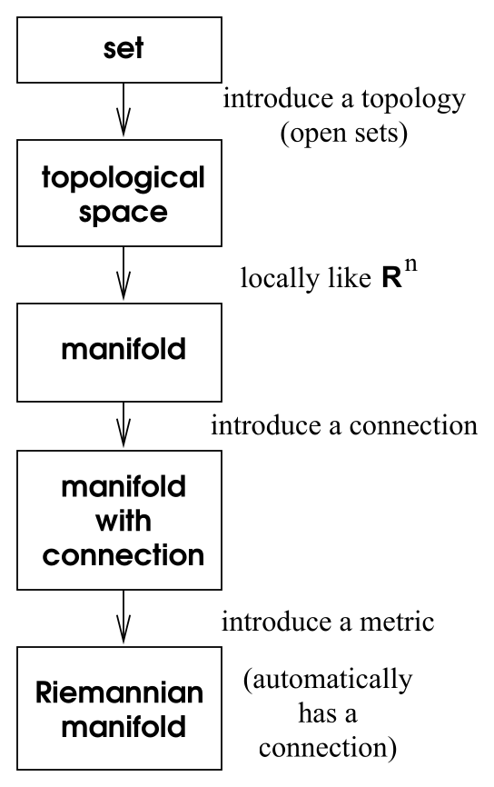

# 协变导数与联络

<!-- CARROLL_NAV_TOP -->
> 完整译文 · 原 PDF 第 62–103 页 · [本章入口](../03-connection-and-curvature.md) · [全书入口](../../carroll-general-relativity.md)
<!-- /CARROLL_NAV_TOP -->

## 为什么需要联络

在讨论流形时，我们已经清楚地看到，只要流形一经定义，就可以谈论各种概念；可以定义函数、对函数求导、考察参数化路径、建立张量，等等。另一些概念，例如一个区域的体积或一条路径的长度，则需要某种额外结构，也就是引入度规。我们已经非正式地使用过“曲率”概念，很自然会觉得它依赖于度规。事实上，这个说法并不完全正确，至少还不完整。我们还需要引入一种额外结构——“联络”（connection）——而曲率正是联络的一项特征。我们会说明，一个度规如何蕴含一个特定联络，并且可以把这个联络的曲率视为度规的曲率。

当我们试图处理偏导数无法成为良好张量算符这个问题时，联络就变得必不可少。我们想要的是一种协变导数：它在带 Cartesian 坐标的平坦空间中退化为偏导数，同时在任意流形上都作为张量变换。传统做法会花不少时间为引入协变导数提供动机，其实这种需要显而易见；像 ${\partial}_{\mu }T^{{\mu\nu}}=0$ 这样的方程总得以某种方式推广到弯曲空间。因此，我们就同意拥有协变导数是一件好事，然后着手把它建立起来。

在带 Cartesian 坐标的平坦空间中，偏导算符 ${\partial}_{\mu}$ 是一个从 $(k,l)$ 张量场到 $(k,l+1)$ 张量场的映射；它对自变量线性，并对张量积服从 Leibniz 法则。在我们现在希望考察的更一般情形中，这一切仍应成立，但偏导数给出的映射依赖于所使用的坐标系。因此，我们希望定义一个**协变导数**算符 $\nabla$，让它以不依赖坐标的方式完成偏导数的工作。于是，我们要求 $\nabla$ 是从 $(k,l)$ 张量场到 $(k,l+1)$ 张量场的映射，并具有以下两项性质：

1. 线性：$\nabla(T+S) = \nabla T + \nabla S$；

2. Leibniz（乘积）法则：$`\nabla(T\otimes S) =
   (\nabla T)\otimes S + T\otimes (\nabla S)`$。

如果 $\nabla$ 要服从 Leibniz 法则，它总能写成偏导数加上某个线性变换。也就是说，求协变导数时，我们先取偏导数，再施加一项修正，使结果具有协变性。（我们不会证明这个听起来很合理的陈述；如果你感兴趣，Wald 书中有详细讨论。）看看这对向量 $V^\nu$ 的协变导数意味着什么。对于每个方向 $\mu$，协变导数 $\nabla_\mu$ 都由偏导数 $\partial_\mu$ 加上一项修正给出；这项修正由矩阵 $(\Gamma_\mu)^\rho{}_\sigma$ 指定（对每个 $\mu$ 都有一个 $n\times n$ 矩阵，其中 $n$ 是流形的维数）。通常会去掉括号，把这些称为**联络系数**的矩阵随意地安排指标位置，写成 $\Gamma^\rho_{\mu\sigma}$。于是有
$$
\nabla_\mu V^\nu = \partial_\mu V^\nu + \Gamma^\nu_{\mu\lambda}
  V^\lambda\ .
\tag{3.1}
$$
请注意，在第二项中，原先位于 $V$ 上的指标移到了 $\Gamma$ 上，并对一个新指标求和。如果这是用偏导数表示向量协变导数的表达式，那么要求等号左侧是一个 $(1,1)$ 张量，就应当能够确定 $\Gamma^\nu_{\mu\lambda}$ 的变换性质。也就是说，我们希望变换律为
$$
\nabla_{\mu'}V^{\nu'} = {{\partial x^\mu}\over{\partial x^{\mu'}}}
  {{\partial x^{\nu'}}\over{\partial x^{\nu}}}\nabla_{\mu}V^{\nu}
  \ .
\tag{3.2}
$$
先看等号左侧；可以用 (3.1) 展开，再变换其中我们已经理解的部分：
$$
\begin{aligned}
\nabla_{\mu'}V^{\nu'} &=&\partial_{\mu'} V^{\nu'}
  + \Gamma^{\nu'}_{\mu'\lambda'}V^{\lambda'}\cr
  &=& {{\partial x^\mu}\over{\partial x^{\mu'}}}
  {{\partial x^{\nu'}}\over{\partial x^{\nu}}}\partial_{\mu} V^{\nu}
  + {{\partial x^\mu}\over{\partial x^{\mu'}}} V^\nu
  {{\partial}\over{\partial x^{\mu}}}
  {{\partial x^{\nu'}}\over{\partial x^{\nu}}}
  +  \Gamma^{\nu'}_{\mu'\lambda'}{{\partial x^{\lambda'}}\over
  {\partial x^{\lambda}}}V^{\lambda}\ .
\end{aligned}
\tag{3.3}
$$
与此同时，等号右侧也可以同样展开：
$$
{{\partial x^\mu}\over{\partial x^{\mu'}}}
  {{\partial x^{\nu'}}\over{\partial x^{\nu}}}\nabla_{\mu}V^{\nu}
  = {{\partial x^\mu}\over{\partial x^{\mu'}}}
  {{\partial x^{\nu'}}\over{\partial x^{\nu}}}\partial_{\mu}V^{\nu}
  + {{\partial x^\mu}\over{\partial x^{\mu'}}}
  {{\partial x^{\nu'}}\over{\partial x^{\nu}}}
  \Gamma^\nu_{\mu\lambda}V^{\lambda}\ .
\tag{3.4}
$$
最后这两个表达式应当相等；各自的第一项完全相同，因而相消，于是有
$$
\Gamma^{\nu'}_{\mu'\lambda'}{{\partial x^{\lambda'}}\over
  {\partial x^{\lambda}}}V^{\lambda} +
  {{\partial x^\mu}\over{\partial x^{\mu'}}} V^\lambda
  {{\partial}\over{\partial x^{\mu}}}
  {{\partial x^{\nu'}}\over{\partial x^{\lambda}}}
  = {{\partial x^\mu}\over{\partial x^{\mu'}}}
  {{\partial x^{\nu'}}\over{\partial x^{\nu}}}
  \Gamma^\nu_{\mu\lambda}V^{\lambda}\ ,
\tag{3.5}
$$
这里把哑指标从 $\nu$ 改成了 $\lambda$。这个方程必须对任意向量 $V^\lambda$ 成立，所以可以从等号两侧消去它。随后乘以 $\partial x^{\lambda}/\partial x^{\lambda'}$，便可以孤立出撇坐标中的联络系数。结果为
$$
\Gamma^{\nu'}_{\mu'\lambda'} = {{\partial x^\mu}\over{\partial x^{\mu'}}}
  {{\partial x^\lambda}\over{\partial x^{\lambda'}}}
  {{\partial x^{\nu'}}\over{\partial x^{\nu}}} \Gamma^\nu_{\mu\lambda}
  - {{\partial x^\mu}\over{\partial x^{\mu'}}}
  {{\partial x^\lambda}\over{\partial x^{\lambda'}}}
  {{\partial^2 x^{\nu'}}\over{\partial x^{\mu}\partial x^{\lambda}}}\ .
\tag{3.6}
$$
这当然不服从张量变换律；右侧第二项破坏了它。这样完全没问题，因为*联络系数并非张量的分量*。我们有意把它们构造成非张量式对象，却又使组合 (3.1) 能够作为张量变换——偏导数与 $\Gamma$ 的变换各自产生的额外项恰好相消。这也解释了我们为什么不太在意联络系数的指标位置；它们并非张量，因此尽量不要升降它们的指标。

## 任意张量的协变导数

其他类型张量的协变导数又如何呢？用与向量情形类似的推理，单形式的协变导数也可以表示成偏导数加某个线性变换。然而，到目前为止，没有理由认为表示这个变换的矩阵应与系数 $\Gamma^\nu_{\mu\lambda}$ 有关。一般来说，可以写成类似
$$
\nabla_\mu \omega_\nu = \partial_\mu \omega_\nu +
  \widetilde{\Gamma}^\lambda_{\mu\nu}
  \omega_\lambda\ ,
\tag{3.7}
$$
其中，对每个 $\mu$，$\widetilde{\Gamma}^\lambda_{\mu\nu}$ 都是一组新矩阵。（留意所有不同指标各自位于什么位置。）很容易推导出，$\widetilde{\Gamma}$ 的变换性质必须与 $\Gamma$ 相同，但除此之外还没有建立任何关系。为此，我们需要再引入希望协变导数具备的两项性质（加在前两项之上）：

3. 与缩并对易：$`\nabla_\mu(T^\lambda{}_{\lambda\rho})
   =(\nabla T)_\mu{}^\lambda{}_{\lambda\rho}`$；

4. 作用于标量时退化为偏导数：$`\nabla_\mu\phi
   ={\partial}_{\mu}\phi`$。

这些性质无法“推导”出来；我们只是要求它们作为协变导数定义的一部分成立。

来看看这些新性质意味着什么。给定某个单形式场 $\omega_\mu$ 和向量场 $V^\mu$，可以对 $\omega_\lambda V^\lambda$ 定义的标量取协变导数，得到
$$
\begin{aligned}
\nabla_\mu(\omega_\lambda V^\lambda) &=&
  (\nabla_\mu \omega_\lambda)V^\lambda + \omega_\lambda
  (\nabla_\mu V^\lambda)\cr
  &=& ({\partial}_{\mu}\omega_\lambda)V^\lambda +
  \widetilde{\Gamma}^\sigma_{\mu\lambda}\omega_\sigma V^\lambda
  +\omega_\lambda({\partial}_{\mu }V^\lambda) +
  \omega_\lambda\Gamma^\lambda_{\mu\rho}V^\rho\ .
\end{aligned}
\tag{3.8}
$$
但因为 $\omega_\lambda V^\lambda$ 是一个标量，它也必须由偏导数给出：
$$
\begin{aligned}
\nabla_\mu(\omega_\lambda V^\lambda) &=& \partial_\mu
  (\omega_\lambda V^\lambda) \cr &=&
  (\partial_\mu \omega_\lambda)V^\lambda + \omega_\lambda
  (\partial_\mu V^\lambda)\ .
\end{aligned}
\tag{3.9}
$$
只有当 (3.8) 中含联络系数的各项彼此抵消时，这才可能成立；也就是说，重新安排哑指标之后，必须有
$$
0 = \widetilde{\Gamma}^\sigma_{\mu\lambda}\omega_\sigma V^\lambda
  + {\Gamma}^\sigma_{\mu\lambda}\omega_\sigma V^\lambda\ .
\tag{3.10}
$$
但 $\omega_\sigma$ 和 $V^\lambda$ 都完全任意，所以
$$
\widetilde{\Gamma}^\sigma_{\mu\lambda} = - \Gamma^\sigma_{\mu\lambda}
  \ .
\tag{3.11}
$$
因此，我们施加的两项额外条件让单形式的协变导数也可以使用向量所用的同一组联络系数来表示，只是现在带一个负号（指标的配对方式也略有不同）：
$$
\nabla_\mu\omega_\nu = \partial_\mu\omega_\nu
  -\Gamma^\lambda_{\mu\nu}\omega_\lambda\ .
\tag{3.12}
$$

联络系数编码了求任意阶张量协变导数所需的全部信息，这一点不应令人意外。公式相当直接：对每一个上指标，引入一项含单个 $+\Gamma$ 的项；对每一个下指标，引入一项含单个 $-\Gamma$ 的项：
$$
\begin{aligned}
\nabla_\sigma T^{\mu_1 \mu_2 \cdots \mu_k}{}_{\nu_1
  \nu_2 \cdots \nu_l} &=&  \partial_\sigma T^{\mu_1 \mu_2 \cdots
  \mu_k}{}_{\nu_1 \nu_2 \cdots \nu_l} \cr
  &&  +\Gamma^{\mu_1}_{\sigma\lambda}\, T^{\lambda \mu_2 \cdots
  \mu_k}{}_{\nu_1 \nu_2 \cdots \nu_l}
  +\Gamma^{\mu_2}_{\sigma\lambda}\, T^{\mu_1 \lambda \cdots
  \mu_k}{}_{\nu_1 \nu_2 \cdots \nu_l} +\cdots\cr
  && -\Gamma^\lambda_{\sigma\nu_1}T^{\mu_1 \mu_2 \cdots
  \mu_k}{}_{\lambda \nu_2 \cdots \nu_l}
  -\Gamma^\lambda_{\sigma\nu_2}T^{\mu_1 \mu_2 \cdots \mu_k}{}_{\nu_1
  \lambda \cdots \nu_l} - \cdots \ .
\end{aligned}
\tag{3.13}
$$
这就是协变导数的一般表达式。你可以亲自检验；它来自我们已经确立的那组公理，以及各类张量都应当是与坐标无关的实体这一通常要求。有时还会使用另一套记号；正如用逗号表示偏导数，人们用分号表示协变导数：
$$
\nabla_\sigma T^{\mu_1 \mu_2 \cdots \mu_k}{}_{\nu_1
  \nu_2 \cdots \nu_l} \equiv T^{\mu_1 \mu_2 \cdots \mu_k}{}_{\nu_1
  \nu_2 \cdots \nu_l ;\sigma}\ .
\tag{3.14}
$$
再说一次，我不太喜欢这种记号。

## 联络之差与挠率

因此，要定义协变导数，就需要在流形上放置一个“联络”；在某个坐标系中，它由一组系数 $\Gamma^\lambda_{\mu\nu}$ 指定（当 $n=4$ 时有 $n^3=64$ 个独立分量），这些系数按 (3.6) 变换。（“联络”这个名称来自它被用来把向量从一个切空间移动到另一个切空间，稍后很快就会看到。）显然，可以在任意流形上定义大量联络，每一个联络都蕴含一种不同的协变微分概念。在广义相对论中，这种自由并不构成大问题，因为事实表明每个度规都定义一个唯一联络，而这正是广义相对论使用的联络。让我们看看其中的原理。

首先要注意，两个联络之差是一个 $(1,2)$ 张量。如果有两组联络系数 $\Gamma^\lambda_{\mu\nu}$ 和 $\widehat\Gamma^\lambda_{\mu\nu}$，它们的差 $S_{{\mu\nu}}{}^\lambda = \Gamma^\lambda_{\mu\nu}-\widehat\Gamma^\lambda_{\mu\nu}$（注意指标位置）按下式变换：
$$
\begin{aligned}
S_{\mu'\nu'}{}^{\lambda'} &=& \Gamma^{\lambda'}_{\mu'\nu'}
  -\widehat\Gamma^{\lambda'}_{\mu'\nu'}\cr
  &=&{{\partial x^\mu}\over{\partial x^{\mu'}}}
  {{\partial x^\nu}\over{\partial x^{\nu'}}}
  {{\partial x^{\lambda'}}\over{\partial x^{\lambda}}}
  \Gamma^\lambda_{\mu\nu} - {{\partial x^\mu}\over{\partial x^{\mu'}}}
  {{\partial x^\nu}\over{\partial x^{\nu'}}}
  {{\partial^2 x^{\lambda'}}\over{\partial x^{\mu}\partial x^{\nu}}}
  - {{\partial x^\mu}\over{\partial x^{\mu'}}}
  {{\partial x^\nu}\over{\partial x^{\nu'}}}
  {{\partial x^{\lambda'}}\over{\partial x^{\lambda}}}
  \widehat\Gamma^\lambda_{\mu\nu}
  + {{\partial x^\mu}\over{\partial x^{\mu'}}}
  {{\partial x^\nu}\over{\partial x^{\nu'}}}
  {{\partial^2 x^{\lambda'}}\over{\partial x^{\mu}\partial x^{\nu}}}\cr
  &=& {{\partial x^\mu}\over{\partial x^{\mu'}}}
  {{\partial x^\nu}\over{\partial x^{\nu'}}}
  {{\partial x^{\lambda'}}\over{\partial x^{\lambda}}}
  (\Gamma^\lambda_{\mu\nu}-\widehat\Gamma^\lambda_{\mu\nu})\cr
  &=& {{\partial x^\mu}\over{\partial x^{\mu'}}}
  {{\partial x^\nu}\over{\partial x^{\nu'}}}
  {{\partial x^{\lambda'}}\over{\partial x^{\lambda}}}
  S_{\mu\nu}{}^{\lambda}\ .
\end{aligned}
\tag{3.15}
$$
这正是张量变换律，所以 $S_{{\mu\nu}}{}^\lambda$ 确实是一个张量。这意味着，任意联络都可以表示成某个基准联络加上一项张量式修正。

接着请注意，给定由 $\Gamma^\lambda_{\mu\nu}$ 指定的联络，只需交换两个下指标，就能立即构成另一个联络。也就是说，系数组 $\Gamma^\lambda_{\nu\mu}$ 也按 (3.6) 变换（因为最后一项中的偏导数可以交换次序），所以它们决定另一个不同联络。于是，每个给定联络都有一个与之相联系的张量，称为**挠率张量**，定义为
$$
T_{\mu\nu}{}^{\lambda} = \Gamma^\lambda_{\mu\nu}- \Gamma^\lambda_{\nu\mu}
  = 2\Gamma^\lambda_{[\mu\nu]}\ .
\tag{3.16}
$$
显然，挠率关于两个下指标反对称；下指标对称的联络称为“无挠”（torsion-free）联络。

## 度规相容的无挠联络

现在，通过引入两项附加性质，可以在带度规 $g_{\mu\nu}$ 的流形上定义一个唯一联络：

- 无挠：$`\Gamma^\lambda_{\mu\nu}=
  \Gamma^\lambda_{(\mu\nu)}`$。

- 度规相容：$\nabla_\rho g_{\mu\nu}=0$。

如果度规相对于某个联络的协变导数处处为零，就说这个联络与度规相容。由此可得几项很好的性质。第一，很容易证明逆度规的协变导数也为零：
$$
\nabla_\rho g^{\mu\nu}= 0\ .
\tag{3.17}
$$
第二，与度规相容的协变导数和指标升降对易。因此，对某个向量场 $V^\lambda$，有
$$
g_{\mu\lambda}\nabla_\rho V^\lambda = \nabla_\rho
  (g_{\mu\lambda} V^\lambda) = \nabla_\rho V_\mu\ .
\tag{3.18}
$$
使用与度规不相容的联络时，在求协变导数的过程中必须极其留意指标位置。

所以，我们的主张是：在一个给定流形上，恰好存在一个与该流形上的给定度规相容的无挠联络。我们不想把这两项要求纳入协变导数的定义；它们只是从许多可能的协变导数中挑出了一个。

为了同时证明存在性与唯一性，可以推导出一个由度规表示联络系数的、显然唯一的表达式。为此，把度规相容方程按指标的三种不同排列展开：
$$
\begin{aligned}
\nabla_\rho g_{\mu\nu}&=& {\partial}_{\rho }g_{\mu\nu}- \Gamma^\lambda_{\rho\mu}
  g_{\lambda\nu} - \Gamma^\lambda_{\rho\nu}g_{\mu\lambda} = 0\cr
  \nabla_\mu g_{\nu\rho} &=& {\partial}_{\mu }g_{\nu\rho} -\Gamma^\lambda_{\mu\nu}
  g_{\lambda\rho} - \Gamma^\lambda_{\mu\rho}g_{\nu\lambda} = 0\cr
  \nabla_\nu g_{\rho\mu} &=& {\partial}_{\nu }g_{\rho\mu} -\Gamma^\lambda_{\nu\rho}
  g_{\lambda\mu} - \Gamma^\lambda_{\nu\mu} g_{\rho\lambda} = 0\ .
\end{aligned}
\tag{3.19}
$$
从第一个方程中减去第二、第三个方程，再利用联络的对称性，得到
$$
{\partial}_{\rho }g_{\mu\nu}- {\partial}_{\mu }g_{\nu\rho} - {\partial}_{\nu }g_{\rho\mu}
  +2\Gamma^\lambda_{\mu\nu}g_{\lambda\rho} = 0\ .
\tag{3.20}
$$
乘以 $g^{\sigma\rho}$，很容易解出联络。结果为
$$
\Gamma^\sigma_{\mu\nu}= {1\over 2} g^{\sigma\rho}({\partial}_{\mu }g_{\nu\rho} +
  {\partial}_{\nu }g_{\rho\mu} - {\partial}_{\rho }g_{\mu\nu})\ .
\tag{3.21}
$$
这是本主题最重要的公式之一；请把它牢牢记住。当然，我们只证明了：如果存在与度规相容的无挠联络，它就必定具有 (3.21) 的形式；你可以亲自检验 (3.21) 的右侧确实像联络一样变换（这项任务适合那些觉得生活中烦琐计算还不够多的人）。

我们从度规推导出的这个联络，正是传统广义相对论的基础（不过我们还会暂时保持开放态度）。它有不同名称：有时叫 **Christoffel 联络**，有时叫 **Levi-Civita 联络**，有时叫 **Riemann 联络**。相应的联络系数有时称为 **Christoffel 符号**，并写成 $`\left\{{}^{\,\,\sigma}_{\mu\nu}
\right\}`$；我们有时也会称其为 Christoffel 符号，但不会使用那个古怪记号。对带度规的流形及其相应联络的研究，称为“Riemann 几何”。据我所知，对更一般联络的研究可以追溯到 Cartan，但我从未听人把它叫作“Cartan 几何”。

## Christoffel 联络的若干性质

在真正使用协变导数之前，还应提及一些零散性质。首先再强调一次：联络并不*必须*由度规构造。在普通平坦空间中，我们一直隐含地使用一个联络——由平坦度规构造的 Christoffel 联络。但只要愿意，我们也可以在保持度规平坦的同时使用另一个联络。还请注意，平坦空间中的 Christoffel 联络系数在 Cartesian 坐标中会消失，但在曲线坐标系中不会消失。例如，考虑以极坐标表示的平面，其度规为
$$
ds^2 = {\rm d}r^2 + r^2{\rm d}\theta^2\ .
\tag{3.22}
$$
很容易求得逆度规的非零分量为 $g^{rr}=1$ 和 $g^{\theta\theta}=r^{-2}$。（我们以显然的记号把 $r$ 和 $\theta$ 用作指标。）可以计算一个典型联络系数：
$$
\begin{aligned}
\Gamma^r_{rr} &=& {1\over 2} g^{r\rho}({\partial}_{r} g_{r\rho} +
  {\partial}_{r} g_{\rho r} - {\partial}_{\rho }g_{rr})\cr
  &=& {1\over 2} g^{rr}({\partial}_{r} g_{rr} +
  {\partial}_{r} g_{rr} - {\partial}_{r} g_{rr})\cr
  && + {1\over 2} g^{r\theta}({\partial}_{r} g_{r\theta} +
  {\partial}_{r} g_{\theta r} - {\partial}_{\theta }g_{rr})\cr
  &=& {1\over 2}(1)(0+0-0) + {1\over 2}(0)(0+0-0)\cr
  &=&0\ .
\end{aligned}
\tag{3.23}
$$
遗憾的是，它为零。但并非每一个都为零：
$$
\begin{aligned}
\Gamma^r_{\theta\theta} &=& {1\over 2} g^{r\rho}
  ({\partial}_{\theta} g_{\theta\rho} +  {\partial}_{\theta} g_{\rho \theta}
  - {\partial}_{\rho }g_{\theta\theta})\cr
  &=& {1\over 2}g^{rr}
  ({\partial}_{\theta} g_{\theta r} +  {\partial}_{\theta} g_{r \theta}
  - {\partial}_{r} g_{\theta\theta})\cr
  &=& {1\over 2}(1)(0+0-2r)\cr
  &=& -r\ .
\end{aligned}
\tag{3.24}
$$
继续机械地算下去，最终得到
$$
\begin{aligned}
\Gamma^r_{\theta r} &=& \Gamma^r_{r\theta} = 0\cr
  \Gamma^\theta_{rr} &=& 0\cr
  \Gamma^\theta_{r\theta} &=& \Gamma^\theta_{\theta r} = {1\over r}\cr
  \Gamma^\theta_{\theta\theta} &=& 0\ .
\end{aligned}
\tag{3.25}
$$
曲线坐标系中存在非零联络系数，归根结底正是电磁学教材里那些散度公式等表达式的来源。

反过来，即使在弯曲空间中，仍然可以让 Christoffel 符号在任意一个点消失。原因就在于，正如上一节所见，我们总能让度规的一阶导数在一点消失；于是由 (3.21)，从该度规导出的联络系数也会消失。当然，这只能在一点做到，无法在该点的某个邻域内做到。

另一个有用性质是，向量相对于 Christoffel 联络的散度公式具有简化形式。$V^\mu$ 的协变散度为
$$
\nabla_\mu V^\mu = {\partial}_{\mu }V^\mu +\Gamma^\mu_{\mu\lambda}V^\lambda
  \ .
\tag{3.26}
$$
很容易证明（参见 Weinberg 第 106—108 页），Christoffel 联络满足
$$
\Gamma^\mu_{\mu\lambda}= {1\over{\sqrt{|g|}}}{\partial}_{\lambda}
  \sqrt{|g|}\ ,
\tag{3.27}
$$
因此得到
$$
\nabla_\mu V^\mu = {1\over{\sqrt{|g|}}}{\partial}_{\mu}(\sqrt{|g|}V^\mu)
  \ .
\tag{3.28}
$$
高阶张量的散度也有相应公式，但通常算不上多大的简化。

关于联络，最后还应提到一件小事：让我们（再次）强调，即使没有任何联络，外导数也是一个定义良好的张量。之所以需要强调这一点，是因为当你恰好使用一个对称（无挠）联络时，外导数（定义为反对称化的偏导数）恰好等于反对称化的协变导数：
$$
\begin{aligned}
\nabla_{[\mu}\omega_{\nu]} &=& {\partial}_{[\mu}\omega_{\nu]}
  -\Gamma^\lambda_{[{\mu\nu}]}\omega_\lambda \cr
  &=& {\partial}_{[\mu}\omega_{\nu]}\ .
\end{aligned}
\tag{3.29}
$$
这使一些不幸的人为带挠空间中外导数的“歧义”而忧心，因为在这种空间里，上述简化不会发生。这里没有歧义：无论你碰巧使用什么联络，外导数都不涉及联络，所以挠率永远不会进入任何对象的外导数公式。

## 从集合到带联络的流形

继续之前，让我们回顾一下向数学构造逐步添加结构的过程。我们从集合这个基本概念开始，默认你已经了解它（即使并不严格，至少也有非正式理解）。随后引入集合的开子集概念；这等价于引入拓扑，并把集合提升为拓扑空间。接着要求每个开集看起来都像 ${\bf R}^n$ 的一个区域（每个集合采用同一个 $n$），并要求坐标图光滑地缝合在一起，于是拓扑空间变成了流形。流形同时是一种非常灵活而强大的结构，并且自然配备切丛、不同阶数的张量丛、求外导数的能力，等等。随后，我们在流形上放置度规，得到带度规的流形（有时称“Riemann 流形”）。独立于度规，我们还发现可以引入联络，从而能够求协变导数。不过，一旦有了度规，就会自动存在一个唯一的、与度规相容的无挠联络。（原则上，没有什么能阻止我们在任意给定流形上引入不止一个联络或不止一个度规。）因此，情形正如下页的图所示。

<figure>
  
  <figcaption>集合、拓扑空间、流形、度规与联络之间的结构关系。</figcaption>
</figure>

<!-- CARROLL_NAV_BOTTOM -->
---
[← 张量密度、体积形式与积分](../02-manifolds-and-tensors/04-tensor-densities-volume-forms-and-integration.md) · [全书入口](../../carroll-general-relativity.md) · [平行移动与测地线 →](./02-parallel-transport-and-geodesics.md)
<!-- /CARROLL_NAV_BOTTOM -->
