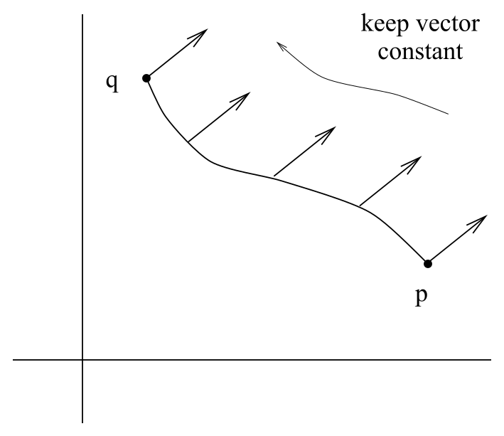
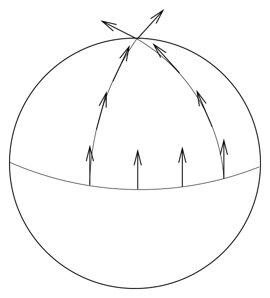
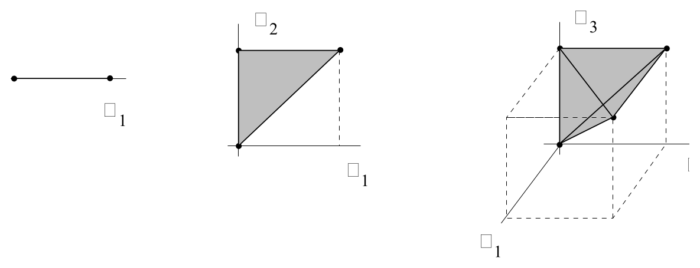
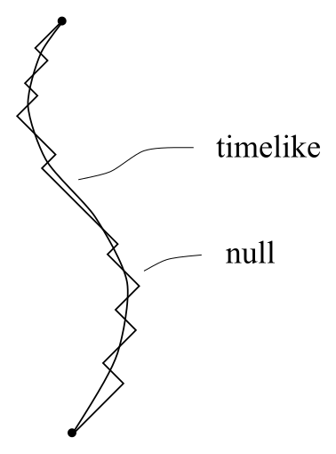
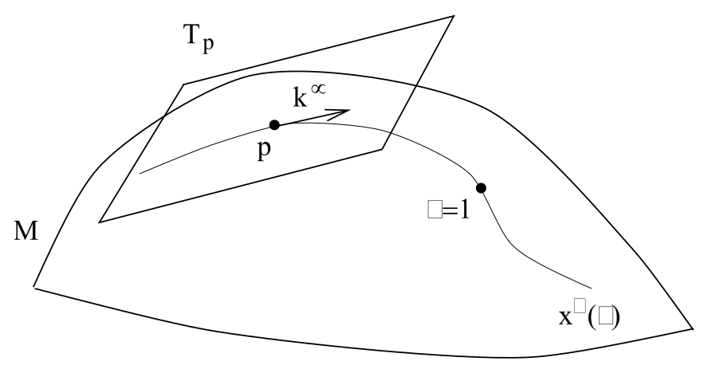

# 平行移动与测地线

<!-- CARROLL_NAV_TOP -->
> 完整译文 · 原 PDF 第 62–103 页 · [本章入口](../03-connection-and-curvature.md) · [全书入口](../../carroll-general-relativity.md)
<!-- /CARROLL_NAV_TOP -->

## 平行移动

建立了联络这套工具之后，我们首先讨论平行移动。回想一下，在平坦空间中，我们不必太过在意向量其实是定义在各个点的切空间中的元素；比较不同点的向量（这里的“比较”是指相加、相减、取点积，等等）实际上非常自然。之所以自然，是因为在平坦空间中，“把一个向量从一点移到另一点，同时让它保持不变”是有意义的。向量从一点到达另一点之后，我们便可以施行向量空间中允许的通常运算。

<figure>
  
  <figcaption>平坦空间中，可以自然地把向量保持不变地移到另一个点。</figcaption>
</figure>

沿一条路径移动向量、同时始终保持它不变的概念，称为平行移动。我们会看到，只要有联络，就能定义平行移动；在平坦空间中凭直觉操纵向量时，我们隐含地使用了这个空间上的 Christoffel 联络。平坦空间与弯曲空间的关键区别在于：在弯曲空间中，*把一个向量从一点平行移动到另一点所得的结果，将依赖于两点之间所取的路径*。即使还没有组装起平行移动的完整机制，我们也能凭借对二维球面的直觉看出这一点。从赤道上的一个向量开始，让它沿一条等经度线指向。以显然的方式沿经线把它平行移动到北极。然后再取原来的向量，先沿赤道把它平行移动一个角度 $\theta$，再像刚才一样把它移到北极。显然，这个向量沿两条路径经过平行移动后到达同一终点，却具有两个不同的值（相差一次 $\theta$ 角的旋转）。

<figure>
  
  <figcaption>球面上沿不同路径平行移动，会在同一终点得到方向不同的向量。</figcaption>
</figure>

由此看来，并不存在一种自然方法，能够把向量从一个切空间唯一地移到另一个切空间；我们总能平行移动它，但结果依赖于路径，同时也没有哪条路径可供自然选取。与我们遇到过的一些问题不同，*这个问题没有解*——我们只能学会接受这一事实：只有当两个向量属于同一个切空间时，才能以自然方式比较它们。例如，彼此擦身而过的两个粒子有定义良好的相对速度（不可能超过光速）。但处在弯曲流形不同点的两个粒子，没有任何定义良好的相对速度概念——这个概念根本没有意义。当然，在某些特殊情形中，假装它有意义仍然很有用，但必须明白，偶尔有用无法替代严格定义。例如在宇宙学中，相对于我们从附近静止光源观察到的频率，遥远星系发来的光会发生红移。由于这个现象与相对运动引起的传统 Doppler 效应极其相似，很容易让人说星系正以由其红移定义的速度“远离我们”。在严格层面上，这句话毫无意义；用 Wittgenstein 的话说，它是一种“语法错误”——星系并没有在远离，因为它们相对于我们的速度根本没有良好定义。实际发生的事情是，在光子从那里传播到这里的过程中，我们与星系之间的时空度规发生了改变（宇宙膨胀了），从而增加了光的波长。幼稚地把 Doppler 公式用于星系红移，会推得其中一些星系正以超光速退行，看起来与相对论矛盾；这就是出错方式的一个例子。这个表面悖论的解决办法很简单：不能从字面上理解星系退行这个观念。

说够了我们做不到的事情；现在看看能做什么。平行移动应当是“沿路径移动向量时让它保持不变”这一概念在弯曲空间中的推广；任意阶张量同样如此。给定曲线 $x^\mu(\lambda)$，在平坦空间中要求张量 $T$ 沿这条曲线保持不变，直接写成 $`{{dT}\over{d\lambda}} =
{{dx^\mu}\over{d\lambda}}{{\partial T}\over{\partial x^\mu}}=0`$。因此，我们把沿路径的协变导数定义为算符
$$
{{D}\over {d\lambda}} = {{dx^\mu}\over{d\lambda}}\nabla_\mu
  \ .
\tag{3.30}
$$
随后，把张量 $T$ 沿路径 $x^\mu(\lambda)$ 的**平行移动**定义为如下要求：沿路径有
$$
\left({{D}\over{d\lambda}}T\right)^{\mu_1 \mu_2 \cdots
  \mu_k}{}_{\nu_1 \nu_2 \cdots \nu_l} \equiv {{dx^\sigma}\over
  {d\lambda}}\nabla_\sigma T^{\mu_1 \mu_2 \cdots
  \mu_k}{}_{\nu_1 \nu_2 \cdots \nu_l} = 0\ .
\tag{3.31}
$$
这是一个定义良好的张量方程，因为切向量 $dx^\mu/d\lambda$ 和协变导数 $\nabla T$ 都是张量。它称为**平行移动方程**。对于向量，该方程具有形式
$$
{{d}\over{d\lambda}} V^\mu
  + \Gamma^\mu_{\sigma\rho}{{dx^\sigma}\over{d\lambda}}V^\rho = 0\ .
\tag{3.32}
$$
可以把平行移动方程看成一个定义初值问题的一阶微分方程：给定路径上某一点的张量，必定存在这个张量向路径其他各点的唯一延拓，使该延拓满足 (3.31)。我们称这样的张量经过了平行移动。

平行移动概念显然依赖于联络，不同联络会给出不同答案。如果联络与度规相容，度规相对于它始终经过平行移动：
$$
{{D}\over{d\lambda}}g_{\mu\nu}= {{dx^\sigma}\over{d\lambda}}
  \nabla_\sigma g_{\mu\nu}=0\ .
\tag{3.33}
$$
由此可知，两个经过平行移动的向量之间的内积保持不变。也就是说，如果 $V^\mu$ 和 $W^\nu$ 沿曲线 $x^\sigma(\lambda)$ 平行移动，就有
$$
\begin{aligned}
{{D}\over{d\lambda}}(g_{\mu\nu}V^\mu W^\nu) &=&
  \left({{D}\over{d\lambda}}g_{\mu\nu}\right)V^\mu W^\nu +
  g_{\mu\nu}\left({{D}\over{d\lambda}} V^\mu\right)W^\nu +
  g_{\mu\nu}V^\mu\left({{D}\over{d\lambda}} W^\nu\right)\cr
  &=& 0\ .
\end{aligned}
\tag{3.34}
$$
这意味着，相对于度规相容联络的平行移动会保持向量的范数、正交性概念，等等。

## 平行传播子与路径有序指数

广义相对论教材通常不会告诉你一件事：平行移动方程其实可以写出一个显式而普遍的解，尽管它多少有些形式化。先注意，对某条路径 $\gamma :\lambda \rightarrow x^\sigma(\lambda)$，求向量 $V^\mu$ 的平行移动方程之解，等价于找到一个矩阵 $P^\mu{}_\rho(\lambda,\lambda_0)$，把向量的初值 $V^\mu(\lambda_0)$ 与它在路径上稍后某处的值联系起来：
$$
V^\mu(\lambda) = P^\mu{}_\rho(\lambda,\lambda_0)V^\rho(\lambda_0)
  \ .
\tag{3.35}
$$
当然，称为**平行传播子**（parallel propagator）的矩阵 $P^\mu{}_\rho(\lambda,\lambda_0)$ 依赖于路径 $\gamma$（不过很难找到一种记号，既能表明这种依赖，又不让 $\gamma$ 看起来像个指标）。如果定义
$$
A^\mu{}_\rho(\lambda) = -\Gamma^\mu_{\sigma\rho}
  {{dx^\sigma}\over{d \lambda}}\ ,
\tag{3.36}
$$
其中右侧各量在 $x^\nu(\lambda)$ 处取值，那么平行移动方程变为
$$
{{d}\over{d\lambda}}V^\mu = A^\mu{}_\rho V^\rho\ .
\tag{3.37}
$$
由于平行传播子必须对任意向量都有效，把 (3.35) 代入 (3.37) 便表明 $P^\mu{}_\rho(\lambda,\lambda_0)$ 也服从这个方程：
$$
{{d}\over{d\lambda}}P^\mu{}_\rho(\lambda,\lambda_0) =
  A^\mu{}_\sigma(\lambda) P^\sigma{}_\rho(\lambda,\lambda_0)
  \ .
\tag{3.38}
$$
为了求解这个方程，先对等号两侧积分：
$$
P^\mu{}_\rho(\lambda,\lambda_0)=\delta^\mu_\rho
  +\int^\lambda_{\lambda_0} A^\mu{}_\sigma(\eta)
  P^\sigma{}_\rho(\eta,\lambda_0)\, d\eta\ .
\tag{3.39}
$$
很容易看出，Kronecker delta 为 $\lambda=\lambda_0$ 提供了正确的归一化。

可以通过迭代求解 (3.39)：把右侧一次又一次代回它自身，得到
$$
P^\mu{}_\rho(\lambda,\lambda_0)=\delta^\mu_\rho
  +\int^\lambda_{\lambda_0} A^\mu{}_\rho(\eta) \, d\eta
  +\int^\lambda_{\lambda_0} \int^\eta_{\lambda_0}
  A^\mu{}_\sigma(\eta) A^\sigma{}_\rho(\eta')\, d\eta' d\eta
  +\cdots\ .
\tag{3.40}
$$
这个级数的第 $n$ 项是在一个 $n$ 维直角三角形，即 $n$-单纯形上的积分。

$$
\int^\lambda_{\lambda_0} A(\eta_1) \, d\eta_1 \qquad
  \int^\lambda_{\lambda_0} \int^{\eta_2}_{\lambda_0}
  A(\eta_2) A(\eta_1)\, d\eta_1 d\eta_2 \qquad
  \int^\lambda_{\lambda_0} \int^{\eta_3}_{\lambda_0}\int^{\eta_2}_{\lambda_0}
  A(\eta_3) A(\eta_2) A(\eta_1)\, d^3\eta
$$

<figure>
  
  <figcaption>嵌套积分的区域是超立方体中的一个 $n$-单纯形。</figcaption>
</figure>

如果能把这样的积分看成在 $n$-立方体上取积分，而非在 $n$-单纯形上取积分，事情就会简化；有没有办法做到？每个立方体中有 $n!$ 个这样的单纯形，所以必须乘以 $1/n!$，补偿多出来的体积。不过，我们还希望被积函数也正确；采用矩阵记号，第 $n$ 阶的被积函数是 $A(\eta_n)A(\eta_{n-1})\cdots A(\eta_1)$，同时带有特殊性质 $\eta_n\geq \eta_{n-1}\geq \cdots \geq \eta_1$。因此，我们定义**路径排序符号** ${\cal P}$，以确保这个条件成立。换句话说，表达式
$$
{\cal P}[A(\eta_n)A(\eta_{n-1})\cdots A(\eta_1)]
\tag{3.41}
$$
代表 $n$ 个矩阵 $A(\eta_i)$ 的乘积，并按如下方式排序：最大的 $\eta_i$ 值位于最左侧，后面每一个 $\eta_i$ 值都小于或等于前一个。于是，可以把 (3.40) 中的第 $n$ 阶项表示成
$$
\begin{aligned}
\lefteqn{\int^\lambda_{\lambda_0}\int^{\eta_n}_{\lambda_0}\cdots
  \int^{\eta_2}_{\lambda_0} A(\eta_n) A(\eta_{n-1})\cdots
  A(\eta_1)\, d^n\eta} \cr
  &=& {1\over{n!}}\int^\lambda_{\lambda_0}
  \int^\lambda_{\lambda_0}\cdots\int^\lambda_{\lambda_0}
  {\cal P}[A(\eta_n) A(\eta_{n-1})\cdots A(\eta_1)]\, d^n\eta\ .
\end{aligned}
\tag{3.42}
$$
这个表达式并没有对矩阵 $A(\eta_i)$ 作任何实质性陈述；它只是一套记号。不过，我们现在可以把 (3.40) 以矩阵形式写成
$$
P(\lambda,\lambda_0) = {\bf 1} + \sum^\infty_{n=1}{1\over {n!}}
  \int^\lambda_{\lambda_0} {\cal P}[A(\eta_n) A(\eta_{n-1})\cdots
  A(\eta_1)]\, d^n\eta\ .
\tag{3.43}
$$
这个公式正是指数函数的级数表达式；所以我们说，平行传播子由路径有序指数给出：
$$
P(\lambda,\lambda_0) = {\cal P}\exp\left(\int^\lambda_{\lambda_0}
  A(\eta)\, d\eta\right)\ ,
\tag{3.44}
$$
这里再一次只是在定义记号；路径有序指数的定义就是 (3.43) 的右侧。可以把它写得更明确：
$$
P^\mu{}_\nu(\lambda,\lambda_0) ={\cal P}\exp\left(-
  \int^\lambda_{\lambda_0}\Gamma^\mu_{\sigma\nu}{{dx^\sigma}\over
  {d\eta}}\, d\eta\right)\ .
\tag{3.45}
$$
拥有一个显式公式总归是好事，即便它相当抽象。同类表达式在量子场论中以“Dyson 公式”出现；它之所以在那里出现，是因为时间演化算符的 Schrödinger 方程与 (3.38) 具有相同形式。

顺便一提，当路径是一条起点与终点相同的回路时，平行传播子会给出一个特别有趣的例子。如果联络与度规相容，所得矩阵就是作用于该点切空间的一次 Lorentz 变换。这个变换称为回路的“完整群”（holonomy）。事实表明，如果你知道每一条可能回路的完整群，就等价于知道度规。这项事实使 Ashtekar 及其合作者得以在“回路表象”（loop representation）中研究广义相对论；在这种表象里，基本变量是完整群，而不显式使用度规。他们沿着这条路径，在理论量子化方面取得了一些进展，不过究竟还能取得多少进一步进展，目前仍没有定论。

## 测地线方程

理解平行移动之后，合乎逻辑的下一步就是讨论测地线。测地线是欧几里得空间中“直线”概念在弯曲空间中的推广。我们都知道直线是什么：它是两点之间距离最短的路径。但还有一个同样好的定义——直线是一条对自身切向量作平行移动的路径。在带任意联络（未必是 Christoffel 联络）的流形上，这两个概念并不完全重合，因此应当分别讨论。

先采用第二个定义，因为它在计算上直接得多。路径 $x^\mu(\lambda)$ 的切向量是 $dx^\mu/d\lambda$。要求它经过平行移动，也就是
$$
{{D}\over{d\lambda}}{{dx^\mu}\over{d\lambda}}=0\ ,
\tag{3.46}
$$
或写成
$$
{{d^2x^\mu}\over{d\lambda^2}}+\Gamma^\mu_{\rho\sigma}
  {{dx^\rho}\over{d\lambda}}{{dx^\sigma}\over{d\lambda}}=0\ .
\tag{3.47}
$$
这就是**测地线方程**，也是一个你应当记住的方程。很容易看出，如果联络系数是欧几里得空间中的 Christoffel 符号，它会复现通常的直线概念；在这种情形下，可以选取使 $\Gamma^\mu_{\rho\sigma}=0$ 的 Cartesian 坐标，于是测地线方程成为 $d^2x^\mu/d\lambda^2=0$，这正是直线的方程。

这实在简单得有些令人尴尬；现在转向更有实质内容的最短距离定义。我们知道，在洛伦兹时空中定义距离涉及各种微妙之处；对零路径，距离为零；对类时路径，使用固有时更方便；等等。为了简单起见，我们只对类时路径完成计算——最后所得方程将对任意路径都适用，所以并没有损失一般性。因此，考虑固有时泛函
$$
\tau = \int \left(-g_{\mu\nu}{{dx^\mu}\over{d\lambda}}
  {{dx^\nu}\over{d\lambda}}\right)^{1/2}\, d\lambda\ ,
\tag{3.48}
$$
其中积分沿路径进行。为了寻找距离最短的路径，我们会使用通常的变分法，寻找这个泛函的极值。（事实上，它们最终会是固有时取*最大值*的曲线。）

我们要考察路径作无穷小变分时固有时的变化：
$$
\begin{aligned}
x^\mu &\rightarrow & x^\mu+\delta x^\mu\cr
  g_{\mu\nu}&\rightarrow & g_{\mu\nu}+ \delta x^\sigma\partial_\sigma g_{\mu\nu}
  \ .
\end{aligned}
\tag{3.49}
$$
（第二行来自弯曲时空中的 Taylor 展开；正如你所见，它使用偏导数，而没有使用协变导数。）把它代入 (3.48)，得到
$$
\begin{aligned}
\tau + \delta\tau &=& \int\left(-g_{\mu\nu}{{dx^\mu}\over{d\lambda}}
  {{dx^\nu}\over{d\lambda}} - {\partial}_{\sigma }g_{\mu\nu}{{dx^\mu}\over{d\lambda}}
  {{dx^\nu}\over{d\lambda}}\delta x^\sigma
  -2 g_{\mu\nu}{{dx^\mu}\over{d\lambda}}{{d(\delta x^\nu)}\over{d\lambda}}
  \right)^{1/2}\, d\lambda\cr
  &=& \int\left(-g_{\mu\nu}{{dx^\mu}\over{d\lambda}}
  {{dx^\nu}\over{d\lambda}}\right)^{1/2}
  \left[1+\left(-g_{\mu\nu}{{dx^\mu}\over{d\lambda}}
  {{dx^\nu}\over{d\lambda}}\right)^{-1}\right.\cr
  && \qquad\qquad\left.
  \times\left(-{\partial}_{\sigma }g_{\mu\nu}{{dx^\mu}\over{d\lambda}}
  {{dx^\nu}\over{d\lambda}}\delta x^\sigma
  -2 g_{\mu\nu}{{dx^\mu}\over{d\lambda}}{{d(\delta x^\nu)}\over{d\lambda}}
  \right)\right]^{1/2}\, d\lambda\ .
\end{aligned}
\tag{3.50}
$$
假设 $\delta x^\sigma$ 很小，就可以展开方括号中表达式的平方根，得到
$$
\delta\tau = \int\left(-g_{\mu\nu}{{dx^\mu}\over{d\lambda}}
  {{dx^\nu}\over{d\lambda}}\right)^{-1/2}
  \left(-{1\over 2}{\partial}_{\sigma }g_{\mu\nu}{{dx^\mu}\over{d\lambda}}
  {{dx^\nu}\over{d\lambda}}\delta x^\sigma
  - g_{\mu\nu}{{dx^\mu}\over{d\lambda}}{{d(\delta x^\nu)}\over{d\lambda}}
  \right)\, d\lambda\ .
\tag{3.51}
$$
此时，把曲线的参数从任意的 $\lambda$ 改为固有时 $\tau$ 本身，会很有帮助；使用
$$
d\lambda = \left(-g_{\mu\nu}{{dx^\mu}\over{d\lambda}}
  {{dx^\nu}\over{d\lambda}}\right)^{-1/2}\, d\tau\ .
\tag{3.52}
$$
把它代入 (3.51)（注意：每一次出现 $d\lambda$ 的地方都要代入），得到
$$
\begin{aligned}
\delta\tau &=&\int \left[-{1\over 2}{\partial}_{\sigma }g_{\mu\nu}
  {{dx^\mu}\over{d\tau}} {{dx^\nu}\over{d\tau}}\delta x^\sigma
  - g_{\mu\nu}{{dx^\mu}\over{d\tau}}{{d(\delta x^\nu)}\over{d\tau}}
  \right]\, d\tau\cr
  &=& \int \left[-{1\over 2}{\partial}_{\sigma }g_{\mu\nu}
  {{dx^\mu}\over{d\tau}} {{dx^\nu}\over{d\tau}}
  +{{d}\over{d\tau}}\left(g_{\mu\sigma} {{dx^\mu}\over{d\tau}}\right)
  \right]\delta x^\sigma\, d\tau\ ,
\end{aligned}
\tag{3.53}
$$
在最后一行中，我们作了分部积分，并通过要求变分 $\delta x^\sigma$ 在路径端点消失，避开可能的边界贡献。我们正在寻找驻点，所以希望 $\delta \tau$ 对任意变分都为零；这意味着
$$
-{1\over 2}{\partial}_{\sigma }g_{\mu\nu}{{dx^\mu}\over{d\tau}} {{dx^\nu}\over{d\tau}}
  + {{dx^\mu}\over{d\tau}} {{dx^\nu}\over{d\tau}} {\partial}_{\nu }g_{\mu\sigma}
  +g_{\mu\sigma}{{d^2x^\mu}\over{d\tau^2}} = 0\ ,
\tag{3.54}
$$
这里使用了 $`d g_{\mu\sigma}/d\tau=(dx^\nu/d\tau){\partial}_{\nu }
g_{\mu\sigma}`$。稍微调整哑指标，便得到
$$
g_{\mu\sigma}{{d^2x^\mu}\over{d\tau^2}} +{1\over 2}\left(
  -{\partial}_{\sigma }g_{{\mu\nu}} + {\partial}_{\nu }g_{\mu\sigma} + {\partial}_{\mu }g_{\nu\sigma}
  \right){{dx^\mu}\over{d\tau}} {{dx^\nu}\over{d\tau}} =0\ ,
\tag{3.55}
$$
最后乘以逆度规，得到
$$
{{d^2x^\rho}\over{d\tau^2}} +{1\over 2}g^{\rho\sigma}\left(
  {\partial}_{\mu }g_{\nu\sigma} + {\partial}_{\nu }g_{\sigma\mu}-{\partial}_{\sigma }g_{{\mu\nu}}
  \right){{dx^\mu}\over{d\tau}} {{dx^\nu}\over{d\tau}} =0\ .
\tag{3.56}
$$
可以看到，这恰好是测地线方程 (3.32)，其中明确选取了 Christoffel 联络 (3.21)。因此，在带度规的流形上，长度泛函的极值曲线，会相对于该度规所联系的 Christoffel 联络平行移动自身的切向量。同一流形上是否还定义了其他联络，并没有影响。当然，广义相对论只使用 Christoffel 联络，所以这两个概念在其中一致。

## 自由粒子与仿射参数

测地线在广义相对论中的首要用途，是描述不受加速的粒子所遵循的路径。事实上，可以把测地线方程视为 Newton 定律 ${\bf f}=m{\bf a}$ 在 ${\bf f}=0$ 情形下的推广。也可以通过在等号右侧加入项来引入力；事实上，回看狭义相对论中 Lorentz 力的表达式 (1.103)，很容易猜测，在广义相对论中，质量 $m$、电荷 $q$ 的粒子所满足的运动方程应当是
$$
{{d^2x^\mu}\over{d\tau^2}}+\Gamma^\mu_{\rho\sigma}
  {{dx^\rho}\over{d\tau}}{{dx^\sigma}\over{d\tau}}=
  {q\over m}F^\mu{}_\nu{{dx^\nu}\over{d\tau}}\ .
\tag{3.57}
$$
稍后还会深入讨论；事实上，你的这个猜测是正确的。

如此大胆地推导出这些表达式之后，我们应当更谨慎地谈一谈测地线路径的参数化。把测地线方程表述成切向量经过平行移动这一要求时，即在 (3.47) 中，我们用某个参数 $\lambda$ 参数化路径；当我们求出时空间隔极值所满足的公式 (3.56) 时，最后却得到了一个非常特定的参数化，也就是固有时。当然，从 (3.56) 的形式可以清楚看出，对某些常数 $a$ 和 $b$ 作变换
$$
\tau \rightarrow \lambda = a\tau +b \ ,
\tag{3.58}
$$
会使方程保持不变。以这种方式与固有时联系起来的任何参数都称为**仿射参数**（affine parameter），用来参数化测地线时与固有时同样合适。在 (3.47) 的推导中有一点被隐藏了起来：*要求切向量经过平行移动，实际上会约束曲线的参数化*，具体来说，它必须通过 (3.58) 与固有时相联系。换句话说，如果从某一点和某个初始方向出发，开始沿该方向行走，并始终让切向量经过平行移动，以此构造曲线，那么你不但会在流形中定义一条路径，还会（在线性变换的自由以内）定义沿路径的参数。

当然，你完全可以使用任意其他喜欢的参数化，但这时 (3.47) 不再成立。更一般地，对某个参数 $\alpha$ 和某个函数 $f(\alpha)$，你会满足如下形式的方程：
$$
{{d^2x^\mu}\over{d\alpha^2}}+\Gamma^\mu_{\rho\sigma}
  {{dx^\rho}\over{d\alpha}}{{dx^\sigma}\over{d\alpha}}=
  f(\alpha){{dx^\mu}\over{d\alpha}}\ ,
\tag{3.59}
$$
反过来，如果一条曲线满足 (3.59)，就总能找到一个仿射参数 $\lambda(\alpha)$，使测地线方程 (3.47) 成立。

洛伦兹度规时空中的测地线有一项重要性质：测地线（相对于度规相容联络）的类型（类时、零或类空）永远不会改变。原因很简单，平行移动会保持内积，而类型由切向量同自身的内积决定。这也说明，我们推导 (3.56) 时只考虑类时路径是前后一致的；对于类空路径，会推导出同一个方程，因为唯一的区别是最终答案中多一个整体负号。零测地线也存在，并满足同一个方程，只是无法用固有时作为参数（会存在某一组允许的参数，它们通过线性变换彼此相联系）。你既可以从切向量必须经过平行移动这个简单要求推导出该事实，也可以把 (3.48) 的变分推广到所有非类空路径。

## 固有时极大与指数映射

现在解释先前那句话：类时测地线是固有时的极大值。我们知道它成立，是因为给定任意类时曲线（无论是否为测地线），都可以用一条零曲线把它近似到任意精度。只需考虑沿这条类时曲线前进的“锯齿形”零曲线：

<figure>
  
  <figcaption>增加尖角数量后，零曲线会越来越接近类时曲线。</figcaption>
</figure>

随着尖角数目增加，零曲线会越来越接近类时曲线，同时路径长度仍为零。因此，类时测地线不可能是固有时取最小值的曲线，因为它们总与固有时为零的曲线无穷接近；事实上，它们会使固有时最大。（这样就能记住双生子悖论中哪一个双生子变老得更多——留在家里的那一位基本上处于测地线上，所以经历的固有时更多。）当然，这种说法仍有一点随意；实际上，每次说“最大化”或“最小化”时，都应加上“局域”这个修饰语。流形上两点之间经常不止一条测地线。例如，在 $S^2$ 上，可以画出经过任意两点的大圆，并设想沿较短的一侧或绕较长的一侧在两点之间行进。其中一条显然比另一条长，尽管两者都是长度泛函的驻点。

在转向真正的曲率之前，关于测地线还剩最后一项事实：可以用它把点 $p$ 处的切空间映到 $p$ 的一个局域邻域。为此，注意任何经过 $p$ 的测地线 $x^\mu(\lambda)$ 都可以由它在 $p$ 处的行为指定；我们选择参数值 $\lambda(p)=0$，并令 $p$ 处的切向量为
$$
{{d x^\mu}\over{d\lambda}}(\lambda=0)=k^\mu\ ,
\tag{3.60}
$$
其中 $k^\mu$ 是 $p$ 点的某个向量（$T_p$ 的某个元素）。那么，在流形 $M$ 上会有唯一一点位于这条测地线上，并且参数在该点取值 $\lambda=1$。我们通过下式定义 $p$ 点的**指数映射** $\exp_p :T_p\rightarrow M$：
$$
\exp_p(k^\mu) = x^\nu(\lambda = 1)\ ,
\tag{3.61}
$$
其中 $x^\nu(\lambda)$ 是在条件 (3.60) 下测地线方程的解。

<figure>
  
  <figcaption>指数映射沿测地线把 $T_p$ 中的向量映到流形 $M$。</figcaption>
</figure>

对于零向量附近的某组切向量 $k^\mu$，这个映射有良好定义，而且实际上可逆。因此，在这个切向量集合的像所给出的 $p$ 点邻域中，切向量本身定义了流形上的一个坐标系。在这个坐标系中，任何经过 $p$ 的测地线都可简单地表示成
$$
x^\mu(\lambda) = \lambda k^\mu\ ,
\tag{3.62}
$$
其中 $k^\mu$ 是某个适当向量。

我们不会深入介绍指数映射的性质，因为实际上不会大量使用它；不过，有一点必须强调：这个映射的值域未必是整个流形，定义域也未必是整个切空间。值域之所以可能无法覆盖整个 $M$，只是因为可能存在两个点，任何测地线都无法把它们连接起来。（在欧几里得号差的度规中，这不可能发生；在洛伦兹时空中却可能发生。）定义域之所以可能无法覆盖整个 $T_p$，是因为一条测地线可能撞上奇点；我们把奇点看作“流形的边缘”。具有这类奇点的流形称为**测地线不完备**（geodesically incomplete）。这并非只会困扰严谨数学家的问题；事实上，Hawking 和 Penrose 的“奇点定理”指出，对于合理的物质内容（没有负能量），广义相对论时空几乎必然是测地线不完备的。举例来说，广义相对论中最有用的两类时空——描述黑洞的 Schwarzschild 解，以及描述均匀各向同性宇宙的 Friedmann–Robertson–Walker 解——都具有重要的奇点。

<!-- CARROLL_NAV_BOTTOM -->
---
[← 协变导数与联络](./01-covariant-derivatives-and-connections.md) · [全书入口](../../carroll-general-relativity.md) · [Riemann 张量、恒等式与 Weyl 张量 →](./03-riemann-tensor-identities-and-weyl.md)
<!-- /CARROLL_NAV_BOTTOM -->
