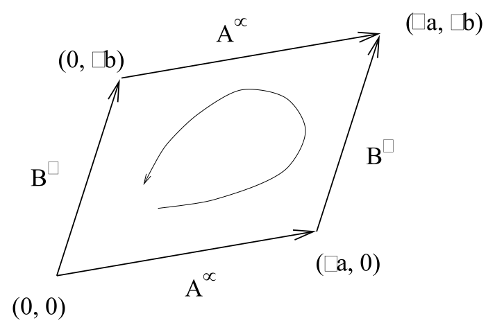
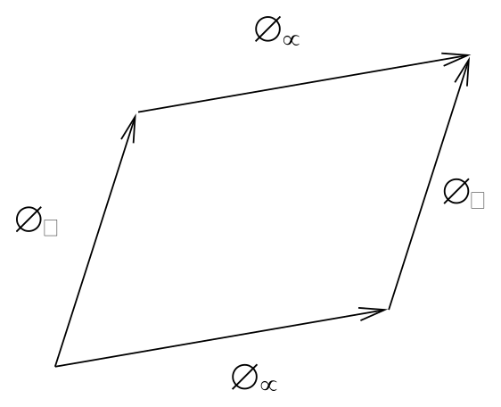

# Riemann 张量、恒等式与 Weyl 张量

<!-- CARROLL_NAV_TOP -->
> 完整译文 · 原 PDF 第 62–103 页 · [本章入口](../03-connection-and-curvature.md) · [全书入口](../../carroll-general-relativity.md)
<!-- /CARROLL_NAV_TOP -->

## 由平行移动认识曲率

建立了平行移动和协变导数这套工具之后，我们终于准备好讨论真正的曲率。曲率由从联络导出的 Riemann 张量来量化。这种曲率度量背后的想法是，我们知道联络的“平坦性”是什么意思——与欧几里得度规或 Minkowski 度规相联系的传统（而且通常是隐含的）Christoffel 联络具有若干性质，可以把它们视为平坦性的不同表现。其中包括：向量沿闭合回路平行移动后保持不变，张量的协变导数彼此对易，以及起初平行的测地线继续保持平行。我们将会看到，在研究这些性质中的任意一个怎样在更一般的情形下发生改变时，Riemann 张量都会自然出现。

我们已经以二维球面为例论证过，在弯曲空间中把一个向量沿闭合回路平行移动，会使这个向量发生变换。所得变换取决于回路围住的总曲率；如果能在每一点对曲率作局域描述，会更有用，而这正是 Riemann 张量应当提供的东西。因此，引入 Riemann 张量的一种传统方式，是考察沿无穷小回路的平行移动。这里我们不走这条路，而会采用更直接的途径。（文献中的大多数讲法要么很草率，要么虽正确却极难跟上。）尽管如此，即使不逐项推演细节，我们仍可以看出答案应当具有怎样的形式。设想把一个向量 $V^\sigma$ 沿由两个向量 $A^\nu$ 和 $B^\mu$ 确定的闭合回路平行移动：

<figure>
  
  <figcaption>向量 $A^\nu$ 与 $B^\mu$ 张成用于平行移动的无穷小回路。</figcaption>
</figure>

回路两组边的（无穷小）长度分别是 $`\delta
a`$ 和 $\delta b$。我们知道，平行移动的作用与坐标无关，所以应当存在某个张量，告诉我们向量回到起点时发生了怎样的改变；它对向量施行线性变换，因而会包含一个上指标和一个下指标。但它还取决于定义回路的两个向量 $A$ 和 $B$；因此，应当再有两个下指标与 $A^\nu$、$B^\mu$ 缩并。此外，这个张量关于这两个指标应当反对称，因为交换两个向量对应于沿反方向走过回路，应当给出原答案的逆。（这也符合如下事实：如果 $A$ 和 $B$ 是同一个向量，变换应当消失。）所以，我们预期这个向量沿回路平行移动时经历的变化 $\delta V^\rho$ 应具有如下形式：
$$
\delta V^\rho = (\delta a) (\delta b) A^\nu B^\mu
  R^\rho{}_{\sigma \mu\nu} V^\sigma\ ,
\tag{3.63}
$$
其中 $R^\rho{}_{\sigma \mu\nu}$ 是一个 $(1,3)$ 张量，称为 **Riemann 张量**（或简称“曲率张量”）。它关于最后两个指标反对称：
$$
R^\rho{}_{\sigma \mu\nu}=-R^\rho{}_{\sigma \nu\mu}\ .
\tag{3.64}
$$
（当然，如果把 (3.63) 当作 Riemann 张量的定义，就需要为指标次序选择一个约定。关于应当采用什么约定，各方完全没有共识，所以务必小心。）

根据我们对平行移动的了解，完全可以极其仔细地完成所需运算，看看向量在这个操作下发生什么，由此得到用联络系数表示曲率张量的公式。不过，考察一个相关操作会快得多：两个协变导数的对易子。它与沿回路平行移动之间的关系应当很明显；张量沿某个方向的协变导数，度量它相对于经过平行移动后本应具有的值改变了多少（因为沿平行移动方向，张量的协变导数为零）。因此，两个协变导数的对易子度量的是这样两种操作之间的差异：先沿一个方向再沿另一个方向平行移动张量，以及按相反次序移动张量。

<figure>
  
  <figcaption>协变导数的对易子比较两种相反次序的平行移动。</figcaption>
</figure>

## 协变导数的对易子

实际计算非常直接。考虑一个向量场 $V^\rho$，有
$$
\begin{aligned}
[\nabla_\mu,\nabla_\nu]V^\rho &=& \nabla_\mu\nabla_\nu
  V^\rho - \nabla_\nu\nabla_\mu V^\rho \cr
  &=&{\partial}_{\mu}(\nabla_\nu V^\rho) -\Gamma^\lambda_{{\mu\nu}} \nabla_\lambda
  V^\rho + \Gamma^\rho_{\mu\sigma} \nabla_\nu V^\sigma
  - (\mu \leftrightarrow \nu)\cr
  &=& {\partial}_{\mu }{\partial}_{\nu }V^\rho + ({\partial}_{\mu }\Gamma^\rho_{\nu\sigma})V^\sigma
  +\Gamma^\rho_{\nu\sigma}{\partial}_{\mu }V^\sigma - \Gamma^\lambda_{{\mu\nu}}
  {\partial}_{\lambda }V^\rho - \Gamma^\lambda_{\mu\nu}\Gamma^\rho_{\lambda\sigma}
  V^\sigma \cr
  &&\qquad +\Gamma^\rho_{\mu\sigma}{\partial}_{\nu }V^\sigma + \Gamma^\rho_{\mu\sigma}
  \Gamma^\sigma_{\nu\lambda}V^\lambda - (\mu\leftrightarrow \nu )\cr
  &=& ({\partial}_{\mu}\Gamma^\rho_{\nu\sigma}-{\partial}_{\nu}\Gamma^\rho_{\mu\sigma}
  +\Gamma^\rho_{\mu\lambda}\Gamma^\lambda_{\nu\sigma}
  -\Gamma^\rho_{\nu\lambda}\Gamma^\lambda_{\mu\sigma})V^\sigma
  - 2\Gamma^\lambda_{[{\mu\nu}]}\nabla_\lambda V^\rho \ .
\end{aligned}
\tag{3.65}
$$
在最后一步中，我们重新命名了一些哑指标，并消去了反对称化时彼此抵消的若干项。可以认出，最后一项正是挠率张量；而等号左侧显然是一个张量，所以括号中的表达式自身也必定是张量。我们写成
$$
[\nabla_\mu,\nabla_\nu]V^\rho = R^\rho{}_{\sigma{\mu\nu}}V^\sigma
  - T_{{\mu\nu}}{}^\lambda\nabla_\lambda V^\rho\ ,
\tag{3.66}
$$
其中 Riemann 张量被确定为
$$
R^\rho{}_{\sigma{\mu\nu}}={\partial}_{\mu}\Gamma^\rho_{\nu\sigma}- {\partial}_{\nu}
  \Gamma^\rho_{\mu\sigma}+\Gamma^\rho_{\mu\lambda}
  \Gamma^\lambda_{\nu\sigma} -\Gamma^\rho_{\nu\lambda}
  \Gamma^\lambda_{\mu\sigma}\ .
\tag{3.67}
$$
关于这个表达式的推导，有许多事情值得注意：

- 当然，我们还没有证明 (3.67) 确实就是 (3.63) 中出现的同一个张量，但事实确实如此（可信但曲折的证明可参见 Wald）。

- 对易子 $[\nabla_\mu,\nabla_\nu]$ 看起来是一个微分算符，但它对向量场的作用（至少在无挠时）竟然只是一次简单的乘法变换，这或许令人惊讶。Riemann 张量度量协变导数对易子中正比于向量场的部分，挠率张量则度量正比于向量场协变导数的部分；二阶导数根本没有出现。

- 请注意，表达式 (3.67) 由非张量式元素构成；你可以检验各项变换律恰好彼此配合，使这个特定组合成为真正的张量。

- 从这个公式及其推导可以立即看出，$R^\rho{}_{\sigma{\mu\nu}}$ 关于最后两个指标反对称。

- 我们完全由联络构造出了曲率张量（始终没有提及度规）。我们的处理足够谨慎，所以上面的表达式适用于任何联络，无论它是否与度规相容、是否无挠。

- 使用如今已经熟悉的方法，可以计算 $[\nabla_\rho,\nabla_\sigma]$ 对任意阶张量的作用。答案是
  $$
  \begin{aligned}
  [\nabla_\rho,\nabla_\sigma]X^{\mu_1\cdots
      \mu_k}{}_{\nu_1\cdots\nu_l} &=&
      {} -T_{\rho\sigma}{}^\lambda\nabla_\lambda
      X^{\mu_1\cdots \mu_k}{}_{\nu_1\cdots\nu_l} \cr &&\quad
      +R^{\mu_1}{}_{\lambda\rho\sigma} X^{\lambda \mu_2\cdots \mu_k}{}_{\nu_1
      \cdots \nu_l}+R^{\mu_2}{}_{\lambda\rho\sigma} X^{\mu_1\lambda\cdots
      \mu_k}{}_{\nu_1 \cdots \nu_l} +\cdots \cr &&\quad
      -R^{\lambda}{}_{\nu_1\rho\sigma} X^{\mu_1\cdots \mu_k}{}_{\lambda\nu_2
      \cdots \nu_l} - R^{\lambda}{}_{\nu_2\rho\sigma} X^{\mu_1\cdots
      \mu_k}{}_{\nu_1\lambda\cdots \nu_l} - \cdots \ .
  \end{aligned}
  \tag{3.68}
  $$

两个向量场 $X$ 和 $Y$ 的对易子是一个很有用的概念；它是第三个向量场，其分量为
$$
[X,Y]^\mu = X^\lambda{\partial}_{\lambda }Y^\mu - Y^\lambda{\partial}_{\lambda }X^\mu\ .
\tag{3.69}
$$
把挠率张量和 Riemann 张量视为多重线性映射时，都可以用对易子写出优美的表达式。把挠率视为从两个向量场映到第三个向量场的映射，有
$$
T(X,Y) = \nabla_X Y - \nabla_Y X - [X,Y]\ ,
\tag{3.70}
$$
把 Riemann 张量视为从三个向量场映到第四个向量场的映射，则有
$$
R(X,Y)Z = \nabla_X\nabla_Y Z-\nabla_Y\nabla_X Z
  - \nabla_{[X,Y]}Z\ .
\tag{3.71}
$$
在这些表达式中，记号 $\nabla_X$ 表示沿向量场 $X$ 的协变导数；用分量表示就是 $`\nabla_X =
X^\mu\nabla_\mu`$。请注意，(3.71) 中的两个向量 $X$ 和 $Y$，对应于 Riemann 张量分量形式中的两个反对称指标。当 $X$ 和 $Y$ 取坐标基向量场时，(3.71) 中含对易子 $[X,Y]$ 的最后一项为零（因为 $[{\partial}_{\mu },{\partial}_{\nu}]=0$）；这也解释了为什么我们最初取两个协变导数的对易子时没有出现这一项。我们不会大量使用这套记号，不过你可能会在文献中看到它，因此应当能够读懂。

## 平坦性与 Riemann 张量

我们已经把曲率张量定义为刻画联络的对象；现在可以承认，在广义相对论中，我们最关心的是 Christoffel 联络。在这种情形下，联络由度规导出，与它相联系的曲率也可以视为度规本身的曲率。借助这种认同，我们终于能明确理解那个非正式观念：度规看起来像欧几里得度规或 Minkowski 度规的空间是平坦的。事实上，两个方向都成立：如果度规分量在某个坐标系中为常数，Riemann 张量就会消失；如果 Riemann 张量消失，我们也总能构造一个坐标系，使度规分量为常数。

第一个方向很容易证明。如果在某个坐标系中有 ${\partial}_{\sigma }g_{\mu\nu}=0$（处处成立，仅在一点成立还不够），那么 $\Gamma^\rho_{\mu\nu}= 0$ 且 ${\partial}_{\sigma}\Gamma^\rho_{\mu\nu}= 0$；所以由 (3.67)，$R^\rho{}_{\sigma{\mu\nu}}=0$。但这是一个张量方程，如果它在一个坐标系中成立，就必定在任意坐标系中成立。因此，要想找到一个使 $g_{\mu\nu}$ 的分量处处为常数的坐标系，Riemann 张量消失是一个必要条件。

它也是一个充分条件，不过证明这一点需要付出更多努力。先在某一点 $p$ 选取 Riemann 正规坐标，使得在 $p$ 点 $g_{\mu\nu}= \eta_{\mu\nu}$。（这里以广义方式使用 $\eta_{\mu\nu}$：它是一个矩阵，每个对角元为 $+1$ 或 $-1$，其余元素为零。$+1$ 和 $-1$ 的实际排列取决于度规的标准形式，但与眼下的论证无关。）把 $p$ 点的基向量记作 ${\hat e}_{(\mu)}$，其分量为 ${\hat e}_{(\mu)}^\sigma$。根据构造，有
$$
g_{\sigma\rho}{\hat e}_{(\mu)}^\sigma {\hat e}_{(\nu)}^\rho (p) =\eta_{\mu\nu}\ .
\tag{3.72}
$$
现在，把整组基向量从 $p$ 平行移动到另一个点 $q$；Riemann 张量为零保证了结果与从 $p$ 到 $q$ 所取的路径无关。相对于度规相容联络的平行移动会保持内积，因此必有
$$
g_{\sigma\rho}{\hat e}_{(\mu)}^\sigma {\hat e}_{(\nu)}^\rho (q) =\eta_{\mu\nu}\ .
\tag{3.73}
$$
这样，我们便指定了一组向量场，它们处处定义一个使度规分量为常数的基。这完全不值得惊叹；无论曲率如何，在任何流形上都能做到这一点。我们希望证明的是，这组基是坐标基（只有曲率为零时才可能如此）。我们知道，如果 ${\hat e}_{(\mu)}$ 是坐标基，它们的对易子将会消失：
$$
[{\hat e}_{(\mu)},{\hat e}_{(\nu)}] = 0\ .
\tag{3.74}
$$
我们真正想要的是其逆命题：如果对易子消失，就能找到坐标 $y^\mu$，使得 $`{\hat e}_{(\mu )}= {{\partial}
\over{\partial y^\mu}}`$。这确实是一项成立的结果，称为 **Frobenius 定理**。它的证明相当麻烦，涉及大量我们压根没有建立过的额外数学工具。姑且把它当作已知事实吧（持怀疑态度的读者可以参阅 Schutz 的 *Geometrical Methods* 一书）。于是，我们希望对刚刚建立的向量场证明 (3.74)。使用挠率的表达式 (3.70)：
$$
[{\hat e}_{(\mu)},{\hat e}_{(\nu)}] = \nabla_{{\hat e}_{(\mu)}} {\hat e}_{(\nu )}- \nabla_{{\hat e}_{(\nu)}}{\hat e}_{(\mu)}
  - T({\hat e}_{(\mu)},{\hat e}_{(\nu)})\ .
\tag{3.75}
$$
根据假设，挠率为零。由我们构造这些向量场的方法，协变导数也会为零；它们是沿任意路径平行移动得到的。如果这些场沿任意路径都经过平行移动，那么它们当然也沿向量 ${\hat e}_{(\mu)}$ 平行移动，所以沿这些向量方向的协变导数为零。因此，(3.70) 蕴含对易子为零；进而我们可以找到一个坐标系 $y^\mu$，使这些向量场就是偏导数。在这个坐标系中，度规将具有所需的分量 $\eta_{\mu\nu}$。

## Christoffel 联络下的代数对称性

在 $n$ 维空间中，具有四个指标的 Riemann 张量乍看之下有 $n^4$ 个独立分量。实际上，反对称性质 (3.64) 意味着最后两个指标只有 $n(n-1)/2$ 种独立取值，所以只剩下 $n^3(n-1)/2$ 个独立分量。然而，当我们考虑 Christoffel 联络时，还有若干其他对称性会进一步减少独立分量。现在就来考察它们。

推导这些额外对称性的最简单方式，是考察所有指标都降低的 Riemann 张量：
$$
R_{\rho\sigma{\mu\nu}} = g_{\rho\lambda}R^\lambda{}_{\sigma{\mu\nu}}\ .
\tag{3.76}
$$
进一步考察这个张量在点 $p$ 所建立的 Riemann 正规坐标中的分量。此时 Christoffel 符号本身为零，但它们的导数并不为零。因此有
$$
\begin{aligned}
R_{\rho\sigma{\mu\nu}} &=& g_{\rho\lambda}
  ({\partial}_{\mu}\Gamma^\lambda_{\nu\sigma}- {\partial}_{\nu}
  \Gamma^\lambda_{\mu\sigma})\cr
  &=& {1\over 2}g_{\rho\lambda}g^{\lambda\tau}(
  {\partial}_{\mu}{\partial}_{\nu }g_{\sigma\tau} + {\partial}_{\mu}{\partial}_{\sigma }g_{\tau\nu}
  -{\partial}_{\mu}{\partial}_{\tau }g_{\nu\sigma} - {\partial}_{\nu}{\partial}_{\mu }g_{\sigma\tau}
  - {\partial}_{\nu}{\partial}_{\sigma }g_{\tau\mu}+{\partial}_{\nu}{\partial}_{\tau }g_{\mu\sigma})\cr
  &=&{1\over 2}({\partial}_{\mu}{\partial}_{\sigma }g_{\rho\nu}
  -{\partial}_{\mu}{\partial}_{\rho }g_{\nu\sigma} - {\partial}_{\nu}{\partial}_{\sigma }g_{\rho\mu}
  +{\partial}_{\nu}{\partial}_{\rho }g_{\mu\sigma})\ .
\end{aligned}
\tag{3.77}
$$
第二行用到了 RNC 中的 $\partial_\mu g^{\lambda\tau}=0$，第三行则用到了偏导数彼此对易这一事实。从这个表达式中，可以立即看出 $R_{\rho\sigma{\mu\nu}}$ 的两项性质：它关于前两个指标反对称，
$$
R_{\rho\sigma{\mu\nu}}=-R_{\sigma\rho{\mu\nu}}\ ,
\tag{3.78}
$$
并且在交换前一对指标与后一对指标时不变：
$$
R_{\rho\sigma{\mu\nu}}= R_{{\mu\nu}\rho\sigma}\ .
\tag{3.79}
$$
再多做一点工作——我们把它留给你的想象力——可以看出最后三个指标作循环置换所得各项之和为零：
$$
R_{\rho\sigma{\mu\nu}} + R_{\rho{\mu\nu}\sigma} + R_{\rho\nu\sigma\mu}
  =0 \ .
\tag{3.80}
$$
最后这项性质等价于最后三个指标的反对称部分为零：
$$
R_{\rho[\sigma{\mu\nu}]} =0 \ .
\tag{3.81}
$$
所有这些性质都是在一个特殊坐标系中推导出来的，但它们全都是张量方程；因此，它们在任意坐标中都会成立。它们并非彼此全部独立；稍作努力便能证明，(3.64)、(3.78) 和 (3.81) 合起来会蕴含 (3.79)。这些方程在逻辑上如何互相依赖，通常不如它们确实成立这个简单事实重要。

## 独立曲率分量的计数

有了 Riemann 张量不同分量之间的这些关系，还剩下多少个独立量？先利用如下事实：$R_{\rho\sigma{\mu\nu}}$ 关于前两个指标反对称，关于最后两个指标反对称，并且在交换这两对指标时对称。这意味着，可以把它看成一个对称矩阵 $R_{[\rho\sigma][{\mu\nu}]}$，其中把指标对 $\rho\sigma$ 和 $\mu\nu$ 分别视为单个指标。一个 $m\times m$ 对称矩阵有 $m(m+1)/2$ 个独立分量，一个 $n\times n$ 反对称矩阵则有 $n(n-1)/2$ 个独立分量。因此我们有
$$
{1\over 2}\left[{1\over 2}n(n-1)\right]\left[{1\over 2}n(n-1)
  +1\right] = {1\over 8}(n^4-2n^3+3n^2-2n)
\tag{3.82}
$$
个独立分量。我们还需要处理额外的对称性 (3.81)。(3.81) 的一个直接推论是，Riemann 张量的全反对称部分消失：
$$
R_{[\rho\sigma{\mu\nu}]} =0 \ .
\tag{3.83}
$$
事实上，这个方程与其他对称性 (3.64)、(3.78)、(3.79) 合在一起，足以推出 (3.81)；只需展开 (3.83)，再摆弄一下所得各项，就很容易证明。因此，一旦计入其他对称性，施加 (3.83) 这一额外约束便等价于施加 (3.81)。这代表多少项独立限制？设想作如下分解：
$$
R_{\rho\sigma{\mu\nu}}=X_{\rho\sigma{\mu\nu}}+R_{[\rho\sigma{\mu\nu}]}\ .
\tag{3.84}
$$
很容易看出，任意全反对称四指标张量都会自动关于第一、最后两个指标反对称，并且在交换这两对指标时对称。因此，对 $X_{\rho\sigma{\mu\nu}}$ 而言，这些性质是独立的限制，与要求 (3.83) 无关。全反对称四指标张量有 $n(n-1)(n-2)(n-3)/4!$ 项，因此 (3.83) 会使独立分量的数目减少这个数。最后剩下
$$
{1\over 8}(n^4-2n^3+3n^2-2n)-{1\over {24}}n(n-1)(n-2)(n-3) =
  {1\over{12}}n^2(n^2-1)
\tag{3.85}
$$
个 Riemann 张量的独立分量。

因此，在四维中，Riemann 张量有 20 个独立分量。（在一维中一个也没有。）这 20 个函数恰好就是度规二阶导数中那 20 个无法通过巧妙选择坐标而置零的自由度。这应当会增强你对 Riemann 张量确实是适当曲率度量的信心。

## Bianchi 恒等式

Riemann 张量除了具有代数对称性（限制任一点的独立分量数目），还服从一条微分恒等式（限制它在不同点的相对取值）。考察 Riemann 张量的协变导数，并在 Riemann 正规坐标中计算：
$$
\begin{aligned}
\nabla_\lambda R_{\rho\sigma{\mu\nu}}&=&{\partial}_{\lambda}
  R_{\rho\sigma{\mu\nu}}\cr
  &=& {1\over 2}{\partial}_{\lambda}({\partial}_{\mu}{\partial}_{\sigma }g_{\rho\nu}
  -{\partial}_{\mu}{\partial}_{\rho }g_{\nu\sigma} - {\partial}_{\nu}{\partial}_{\sigma }g_{\rho\mu}
  +{\partial}_{\nu}{\partial}_{\rho }g_{\mu\sigma})\ .
\end{aligned}
\tag{3.86}
$$
我们要考察前三个指标作循环置换所得各项之和：
$$
\begin{aligned}
\lefteqn{\nabla_\lambda R_{\rho\sigma{\mu\nu}} +
  \nabla_\rho R_{\sigma\lambda{\mu\nu}}+\nabla_\sigma R_{\lambda\rho{\mu\nu}}} \cr
  &=& {1\over 2}
  ({\partial}_{\lambda}{\partial}_{\mu}{\partial}_{\sigma }g_{\rho\nu} -{\partial}_{\lambda}{\partial}_{\mu}{\partial}_{\rho }g_{\nu\sigma}
  -{\partial}_{\lambda}{\partial}_{\nu}{\partial}_{\sigma }g_{\rho\mu}+{\partial}_{\lambda}{\partial}_{\nu}{\partial}_{\rho }g_{\mu\sigma}\cr
  &&+{\partial}_{\rho}{\partial}_{\mu}{\partial}_{\lambda }g_{\sigma\nu} -{\partial}_{\rho}{\partial}_{\mu}{\partial}_{\sigma }g_{\nu\lambda}
  -{\partial}_{\rho}{\partial}_{\nu}{\partial}_{\lambda }g_{\sigma\mu}+{\partial}_{\rho}{\partial}_{\nu}{\partial}_{\sigma }g_{\mu\lambda}\cr
  &&+{\partial}_{\sigma}{\partial}_{\mu}{\partial}_{\rho }g_{\lambda\nu} -{\partial}_{\sigma}{\partial}_{\mu}{\partial}_{\lambda }g_{\nu\rho}
  -{\partial}_{\sigma}{\partial}_{\nu}{\partial}_{\rho }g_{\lambda\mu}+{\partial}_{\sigma}{\partial}_{\nu}{\partial}_{\lambda }g_{\mu\rho})
  \cr & =& 0\ .
\end{aligned}
\tag{3.87}
$$
再一次，尽管这个方程是在某个特定坐标系中推导出来的，但因为它是张量之间的方程，所以在任意坐标系中都成立。到这里，我们已经能看出反对称性 $`R_{\rho\sigma{\mu\nu}}=-
R_{\sigma\rho{\mu\nu}}`$ 允许把这个结果写成
$$
\nabla_{[\lambda}R_{\rho\sigma]{\mu\nu}}=0\ .
\tag{3.88}
$$
这称为 **Bianchi 恒等式**。（请注意，对于一般联络，还会有涉及挠率张量的额外项。）它与 Jacobi 恒等式关系密切，因为（正如你可以证明的）它本质上表达了
$$
[[\nabla_\lambda,\nabla_\rho],\nabla_\sigma]
  +[[\nabla_\rho,\nabla_\sigma],\nabla_\lambda]
  +[[\nabla_\sigma,\nabla_\lambda],\nabla_\rho]=0\ .
\tag{3.89}
$$

## Ricci 张量、Ricci 标量与 Einstein 张量

考察 Riemann 张量的缩并往往很有用。即使没有度规，我们也可以构成一个称为 **Ricci 张量**的缩并：
$$
R_{{\mu\nu}} = R^\lambda{}_{\mu\lambda\nu}\ .
\tag{3.90}
$$
请注意，对于由任意联络（未必是 Christoffel 联络）构成的曲率张量，可以取若干彼此独立的缩并。我们主要关心 Christoffel 联络；对它而言，(3.90) 是唯一的独立缩并（符号约定除外，当然，符号约定会因文献而异）。与 Christoffel 联络相联系的 Ricci 张量是对称的：
$$
R_{{\mu\nu}} = R_{\nu\mu}\ ,
\tag{3.91}
$$
这是 Riemann 张量各项对称性的推论。利用度规，还可以进一步缩并，构成 **Ricci 标量**：
$$
R = R^\mu{}_\mu = g^{\mu\nu}R_{\mu\nu}\ .
\tag{3.92}
$$

Bianchi 恒等式有一种特别有用的形式，它来自对 (3.87) 作两次缩并：
$$
\begin{aligned}
0&=& g^{\nu\sigma}g^{\mu\lambda}(\nabla_\lambda R_{\rho\sigma{\mu\nu}}
  +\nabla_\rho R_{\sigma\lambda{\mu\nu}}+\nabla_\sigma R_{\lambda\rho{\mu\nu}})\cr
  &=&\nabla^\mu R_{\rho\mu}-\nabla_\rho R + \nabla^\nu R_{\rho\nu}\ ,
\end{aligned}
\tag{3.93}
$$
即
$$
\nabla^\mu R_{\rho\mu} = {1\over 2}\nabla_\rho R\ .
\tag{3.94}
$$
（请注意，与偏导数不同，由于度规相容性，升高协变导数上的指标是有意义的。）如果把 **Einstein 张量**定义为
$$
G_{\mu\nu} = R_{\mu\nu}-{1\over 2} R g_{\mu\nu}\ ,
\tag{3.95}
$$
就能看出，二重缩并的 Bianchi 恒等式 (3.94) 等价于
$$
\nabla^\mu G_{{\mu\nu}} = 0\ .
\tag{3.96}
$$
Einstein 张量因 Ricci 张量和度规的对称性而对称，并将在广义相对论中发挥极其重要的作用。

## Weyl 张量与共形变换

Ricci 张量和 Ricci 标量包含 Riemann 张量“迹”的信息。有时，把 Riemann 张量中 Ricci 张量没有告诉我们的那些部分单独拿出来考察很有用。因此，我们发明了 **Weyl 张量**；它基本上就是去掉所有缩并之后的 Riemann 张量。在 $n$ 维中，它由下式给出：
$$
C_{\rho\sigma{\mu\nu}} = R_{\rho\sigma{\mu\nu}} - {2\over{(n-2)}}
  \left(g_{\rho[\mu}R_{\nu]\sigma} - g_{\sigma[\mu}R_{\nu]\rho}
  \right) +{2\over{(n-1)(n-2)}}R g_{\rho[\mu}g_{\nu]\sigma}\ .
\tag{3.97}
$$
这个凌乱的公式经过特意设计，使 $C_{\rho\sigma{\mu\nu}}$ 的所有可能缩并都为零，同时保留 Riemann 张量的对称性：
$$
\begin{aligned}
C_{\rho\sigma{\mu\nu}} &=& C_{[\rho\sigma][{\mu\nu}]}\ ,\cr
  C_{\rho\sigma{\mu\nu}} &=& C_{{\mu\nu}\rho\sigma}\ ,\cr
  C_{\rho[\sigma{\mu\nu}]} &=&0\ .
\end{aligned}
\tag{3.98}
$$
Weyl 张量只在三维及以上才有定义，并且在三维中恒等于零。对于 $n\geq 4$，它满足一种 Bianchi 恒等式：
$$
\nabla^\rho C_{\rho\sigma{\mu\nu}} = -2{{(n-3)}\over{(n-2)}}
  \left(\nabla_{[\mu}R_{\nu]\sigma} + {1\over{2(n-1)}}
  g_{\sigma[\nu}\nabla_{\mu]}R\right)\ .
\tag{3.99}
$$
Weyl 张量最重要的性质之一，是它在**共形变换**（conformal transformation）下不变。这意味着：先对某个度规 $g_{{\mu\nu}}$ 计算 $C_{\rho\sigma{\mu\nu}}$，再对度规 $\Omega^2 (x)g_{{\mu\nu}}$ 重新计算，其中 $\Omega(x)$ 是时空上任意处处不为零的函数，两次会得到相同答案。出于这个原因，它也常称为“共形张量”。

<!-- CARROLL_NAV_BOTTOM -->
---
[← 平行移动与测地线](./02-parallel-transport-and-geodesics.md) · [全书入口](../../carroll-general-relativity.md) · [曲率实例与测地线偏离 →](./04-curvature-examples-and-geodesic-deviation.md)
<!-- /CARROLL_NAV_BOTTOM -->
