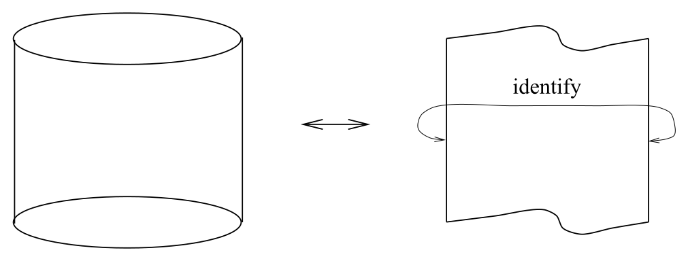
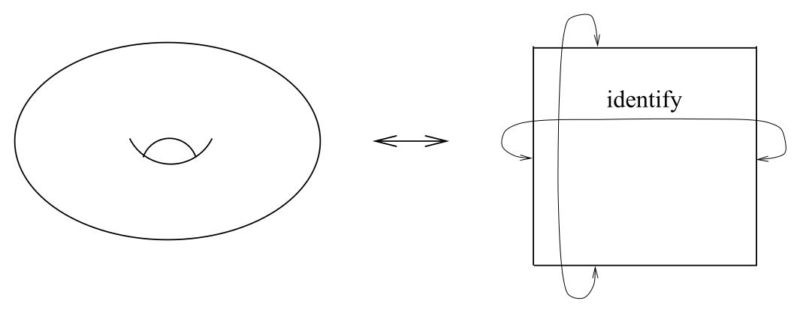
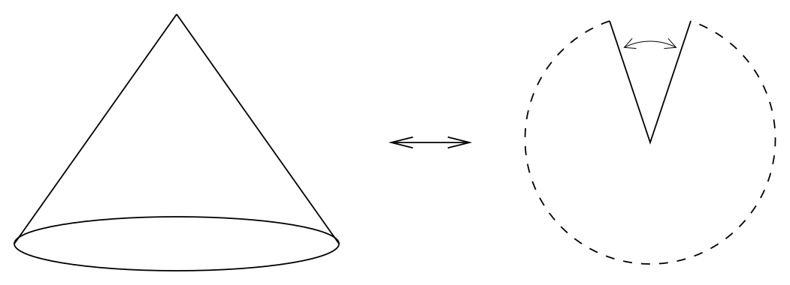
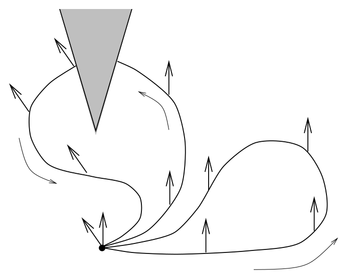
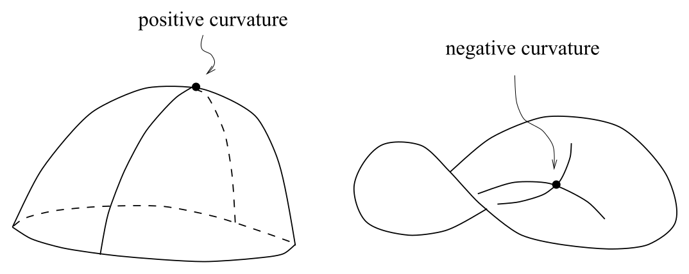
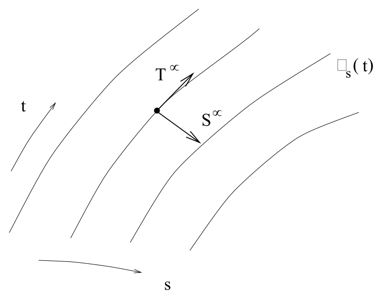

# 曲率实例与测地线偏离

<!-- CARROLL_NAV_TOP -->
> 完整译文 · 原 PDF 第 62–103 页 · [本章入口](../03-connection-and-curvature.md) · [全书入口](../../carroll-general-relativity.md)
<!-- /CARROLL_NAV_TOP -->

## 内禀曲率与外禀曲率

经历了这么多形式体系之后，也许该退一步，通过一些简单例子想一想曲率究竟意味着什么。首先请注意，根据 (3.85)，在 1、2、3 和 4 维中，曲率张量分别有 0、1、6 和 20 个分量。（我们在这些例子里关于曲率所说的一切，都是指与 Christoffel 联络、因而也与度规相联系的曲率。）这意味着一维流形（例如 $S^1$）永远不会弯曲；你觉得圆是弯曲的那种直觉，源于把它想成嵌入某个平坦二维平面中的曲线。（有一种称为“外禀曲率”（extrinsic curvature）的东西，它刻画某个对象嵌入更高维空间的方式。我们的曲率概念是“内禀的”（intrinsic），与这种嵌入无关。）

内禀曲率与外禀曲率的区别在二维中也很重要；在二维，曲率有一个独立分量。（事实上，关于曲率的全部信息都包含在 Ricci 标量这一个分量里。）考虑一个圆柱面 ${\bf R}\times S^1$。

<figure>
  
  <figcaption>圆柱面从嵌入空间中看起来是弯曲的。</figcaption>
</figure>

尽管从我们的视角看它似乎是弯曲的，但显然可以在圆柱面上赋予一个度规，使其分量在适当的坐标系中为常数——只需把圆柱面展开，并采用平面诱导出的度规即可。在这个度规下，圆柱面是平坦的。（当然，我们也完全可以引入另一个度规，使圆柱面不再平坦；这里想强调的要点是，存在某个能让它变平坦的度规。）同样的说法也适用于环面：

<figure>
  
  <figcaption>环面可以看成平面正方形区域的两组对边分别粘合。</figcaption>
</figure>

我们可以把环面看作平面上的一个正方形区域，并把它的两组对边分别等同起来（换句话说，就是 $S^1\times S^1$）；由此很清楚，尽管从嵌入的观点看它是弯曲的，它仍然可以具有平坦度规。

圆锥面是一个二维流形的例子，它恰好只在一个点具有非零曲率。把它展开也可以看清这一点；圆锥面等价于从平面中去掉一个“亏角”（deficit angle），再把切口的两条边等同起来：

<figure>
  
  <figcaption>去掉平面中的一个亏角并粘合两边，便得到圆锥面。</figcaption>
</figure>

在从平坦平面的一部分继承而来的这个度规下，圆锥面除了顶点以外处处平坦。考察向量沿不同回路的平行移动便能看出这一点：如果回路不围住顶点，向量经过一周后不会发生总体变换；如果回路围住顶点（比如恰好一周），向量就会转过一个恰好等于亏角的角度。

<figure>
  
  <figcaption>绕圆锥顶点平行移动一周会使向量转过亏角。</figcaption>
</figure>

## 二维球面的曲率

我们最喜欢的例子当然是二维球面，其度规为
$$
ds^2 = a^2({\rm d}\theta^2 + \sin^2\theta ~ {\rm d}\phi^2)\ ,
\tag{3.100}
$$
其中 $a$ 是球面的半径（把球面想成嵌入 ${\bf R}^3$ 中）。省略具体推导，非零联络系数为
$$
\begin{aligned}
\Gamma^\theta_{\phi\phi} &=& -\sin\theta \cos\theta\cr
  \Gamma^\phi_{\theta\phi} = \Gamma^\phi_{\phi\theta} &=&
  \cot\theta\ .
\end{aligned}
\tag{3.101}
$$
让我们计算 Riemann 张量中一个看来很有希望的分量：
$$
\begin{aligned}
R^\theta{}_{\phi\theta\phi} &=& {\partial}_{\theta}
  \Gamma^\theta_{\phi\phi} - {\partial}_{\phi }\Gamma^\theta_{\theta\phi}
  +\Gamma^\theta_{\theta\lambda}\Gamma^\lambda_{\phi\phi}
  -\Gamma^\theta_{\phi\lambda}\Gamma^\lambda_{\theta\phi}\cr
  &=& (\sin^2\theta - \cos^2\theta) -(0) + (0) - (-\sin\theta
  \cos\theta)(\cot\theta)\cr
  &=& \sin^2\theta\ .
\end{aligned}
\tag{3.102}
$$
（这里的记号显然并不完美，因为希腊字母 $\lambda$ 是一个需要求和的哑指标，而希腊字母 $\theta$ 和 $\phi$ 表示特定坐标。）降低一个指标，得到
$$
\begin{aligned}
R_{\theta\phi\theta\phi} &=& g_{\theta\lambda}
  R^\lambda{}_{\phi\theta\phi}\cr
  &=&g_{\theta\theta}R^\theta{}_{\phi\theta\phi}\cr
  &=& a^2\sin^2\theta\ .
\end{aligned}
\tag{3.103}
$$
不难检验，Riemann 张量的所有分量要么为零，要么通过对称性与这个分量相关。接着可以通过 $`R_{{\mu\nu}}=g^{\alpha\beta}R_{\alpha\mu
\beta\nu}`$ 计算 Ricci 张量。结果为
$$
\begin{aligned}
R_{\theta\theta} &=& g^{\phi\phi}R_{\phi\theta\phi\theta}
  = 1\cr
R_{\theta\phi} &=& R_{\phi\theta} = 0\cr
R_{\phi\phi} &=& g^{\theta\theta}R_{\theta\phi\theta\phi}
  = \sin^2\theta\ .
\end{aligned}
\tag{3.104}
$$
Ricci 标量的计算同样直截了当：
$$
R = g^{\theta\theta}R_{\theta\theta}+ g^{\phi\phi}R_{\phi\phi}
  = {2\over{a^2}}\ .
\tag{3.105}
$$
因此，对于二维流形能够完全刻画曲率的 Ricci 标量，在这个二维球面上处处为常数。这反映了该流形是“最大对称的”（maximally symmetric）；稍后我们会更精确地定义这个概念（不过它的含义正如你所料）。在任意维数中，最大对称空间的曲率都满足（其中 $a$ 为某个常数）
$$
R_{\rho\sigma\mu\nu} = a^{-2}(g_{\rho\mu}g_{\sigma\nu}
  - g_{\rho\nu}g_{\sigma\mu})\ ,
\tag{3.106}
$$
你可以检验这个例子确实满足该式。

请注意，二维球面的 Ricci 标量不仅是常数，而且显然为正。我们说球面是“正曲率的”（当然，这里牵涉了一两个约定；所幸我们的约定彼此配合，使得大家都同意称为正曲率的空间确实具有正的 Ricci 标量）。从生活在一个嵌入更高维欧几里得空间的流形上的观察者视角看，如果他坐在一个正曲率点，空间沿任意方向都以相同的方式从他身边弯离；在负曲率空间中，空间则会沿相反的方向弯离。因此，负曲率空间呈马鞍形。

<figure>
  
  <figcaption>负曲率空间在不同方向上反向弯曲，呈马鞍形。</figcaption>
</figure>

## 测地线偏离

关于实例的趣谈到此为止。在真正引入广义相对论之前，我们还有最后一个主题必须介绍：测地线偏离。你一定听说过，欧几里得（平坦）几何的定义性特征是平行公设：起初平行的直线会永远保持平行。在弯曲空间中，这当然不成立；比如在球面上，起初平行的测地线最终肯定会相交。我们希望对任意弯曲空间中的这种行为作定量描述。

问题在于，“平行”概念无法从平坦空间自然地推广到弯曲空间。我们的做法是构造一个单参数测地线族 $\gamma_s(t)$。也就是说，对于每个 $s\in{\bf R}$，$\gamma_s$ 都是一条以仿射参数 $t$ 参数化的测地线。这些曲线的集合定义了一个光滑二维曲面（嵌入任意维数的流形 $M$ 中）。只要选取的测地线族彼此不相交，就可以用 $s$ 和 $t$ 作为这个曲面上的坐标。整个曲面就是点集 $x^\mu(s,t)\in M$。我们有两个自然的向量场：测地线的切向量
$$
T^\mu = {{\partial x^\mu}\over{\partial t}}\ ,
\tag{3.107}
$$
以及“偏离向量”
$$
S^\mu = {{\partial x^\mu}\over{\partial s}}\ .
\tag{3.108}
$$
这个名称来自一种非正式理解：$S^\mu$ 从一条测地线指向邻近的测地线。

<figure>
  
  <figcaption>$T^\mu$ 沿测地线指向，$S^\mu$ 指向相邻测地线。</figcaption>
</figure>

$S^\mu$ 从一条测地线指向下一条测地线的想法，启发我们定义“测地线的相对速度”
$$
V^\mu = (\nabla_TS)^\mu = T^\rho\nabla_\rho S^\mu\ ,
\tag{3.109}
$$
以及“测地线的相对加速度”
$$
a^\mu = (\nabla_T V)^\mu =T^\rho\nabla_\rho V^\mu\ .
\tag{3.110}
$$
这些名称不必过于当真，但这些向量无疑有明确的定义。

因为 $S$ 和 $T$ 是适配于同一坐标系的基向量，它们的对易子为零：
$$
[S,T]=0\ .
$$
我们希望考虑挠率为零的通常情形，于是由 (3.70) 有
$$
S^\rho\nabla_\rho T^\mu = T^\rho\nabla_\rho S^\mu \ .
\tag{3.111}
$$
记住这一点，让我们来计算加速度：
$$
\begin{aligned}
a^\mu &=& T^\rho\nabla_\rho(T^\sigma\nabla_\sigma S^\mu)\cr
  &=& T^\rho\nabla_\rho (S^\sigma\nabla_\sigma T^\mu)\cr
  &=&(T^\rho\nabla_\rho S^\sigma)(\nabla_\sigma T^\mu) +
  T^\rho S^\sigma\nabla_\rho\nabla_\sigma T^\mu\cr
  &=&(S^\rho\nabla_\rho T^\sigma)(\nabla_\sigma T^\mu) +
  T^\rho S^\sigma(\nabla_\sigma\nabla_\rho T^\mu
  +R^\mu{}_{\nu\rho\sigma}T^\nu)\cr
  &=& (S^\rho\nabla_\rho T^\sigma)(\nabla_\sigma T^\mu) +
  S^\sigma\nabla_\sigma(T^\rho\nabla_\rho T^\mu)
  -(S^\sigma\nabla_\sigma T^\rho)\nabla_\rho T^\mu
  +R^\mu{}_{\nu\rho\sigma}T^\nu T^\rho S^\sigma\cr
  &=& R^\mu{}_{\nu\rho\sigma}T^\nu T^\rho S^\sigma\ .
\end{aligned}
\tag{3.112}
$$
让我们逐行理解这个计算。第一行是 $a^\mu$ 的定义，第二行直接来自 (3.111)。第三行只用了 Leibniz 法则。第四行把一个二重协变导数替换成顺序相反的导数再加上 Riemann 张量。第五行再次使用 Leibniz 法则（方向与通常相反），随后抵消两个相同的项，并注意到含 $T^\rho\nabla_\rho T^\mu$ 的一项为零，因为 $T^\mu$ 是测地线的切向量。最后得到
$$
a^\mu = {{D^2}\over{dt^2}}S^\mu = R^\mu{}_{\nu\rho\sigma}T^\nu
  T^\rho S^\sigma\ ,
\tag{3.113}
$$
这就是著名的**测地线偏离方程**（geodesic deviation equation）。它表达了一个我们或许已经预料到的事实：两条相邻测地线之间的相对加速度正比于曲率。

当然，从物理上说，相邻测地线的加速度被解释为引力潮汐力的表现。这提醒我们，此刻离真正开始做物理已经非常近了。

<!-- CARROLL_NAV_BOTTOM -->
---
[← Riemann 张量、恒等式与 Weyl 张量](./03-riemann-tensor-identities-and-weyl.md) · [全书入口](../../carroll-general-relativity.md) · [四标架、自旋联络与结构方程 →](./05-tetrads-spin-connection-and-structure-equations.md)
<!-- /CARROLL_NAV_BOTTOM -->
