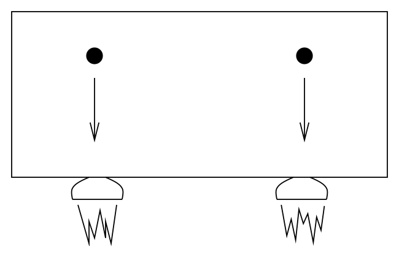
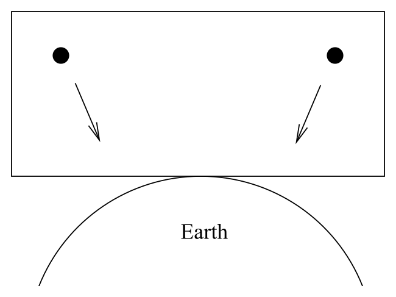
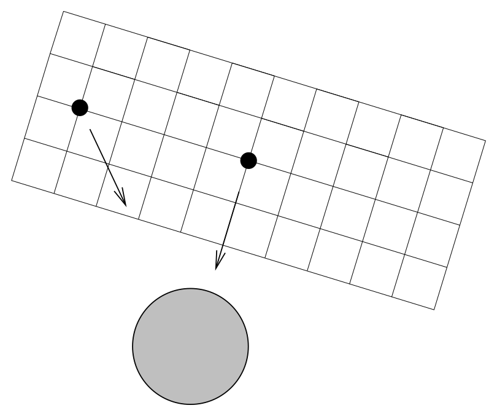
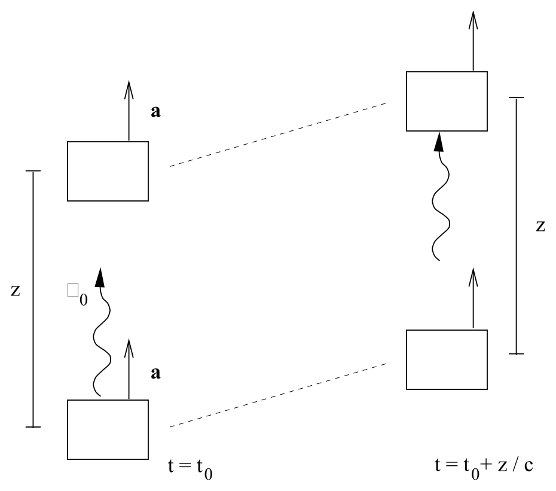
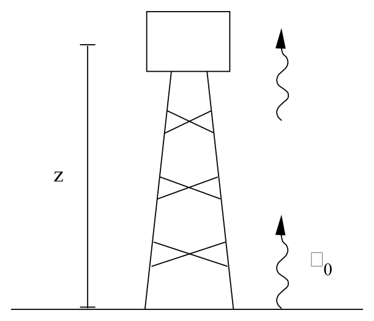
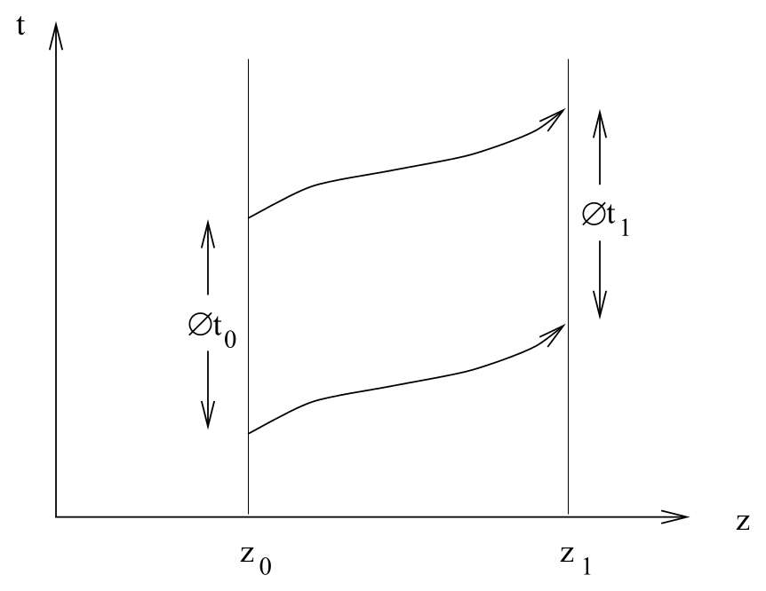

# 等效原理与引力红移

<!-- CARROLL_NAV_TOP -->
> 完整译文 · 原 PDF 第 104–135 页 · [本章入口](../04-gravitation-and-einstein-equation.md) · [全书入口](../../carroll-general-relativity.md)
<!-- /CARROLL_NAV_TOP -->

## 从弱等效原理出发

数学上的功课已经做完，我们现在可以考察广义相对论所描述的引力物理了。这个主题自然分成两个部分：时空曲率如何作用于物质，并以“引力”的形式显现出来；能量和动量又如何影响时空，从而产生曲率。无论哪一部分，我们都完全可以从最高层次讲起，直接陈述支配弯曲时空中物理现象的定律，再推导它们的后果。不过，我们打算多给一些动机：从基本物理原理开始，并试着论证它们会自然导向一种几乎唯一的物理理论。

这些物理原理中最基本的是等效原理，它有多种表述。最早的一种可以追溯到伽利略和牛顿，现在称为**弱等效原理**（Weak Equivalence Principle，WEP）。WEP 断言，任何物体的“惯性质量”都等于它的“引力质量”。为了看清这句话的含义，可以想想牛顿第二定律。这条定律把施加于物体的力与物体获得的加速度联系起来，二者成正比，比例常数就是惯性质量 $m_i$：

$$
{\bf f} = m_i {\bf a}\ .
\tag{4.1}
$$

惯性质量显然具有普适性质，它与你推动物体时感受到的阻力有关；无论施加的是哪一种力，这个常数都相同。我们还有引力定律，它断言物体受到的引力与一个标量场 $\Phi$ 的梯度成正比，这个标量场称为引力势。此时的比例常数称为引力质量 $m_g$：

$$
{\bf f}_g = -m_g \nabla\Phi\ .
\tag{4.2}
$$

乍看之下，$m_g$ 的性质与 $m_i$ 很不一样；它是引力所特有的一个量。你若愿意，可以把它看作物体的“引力荷”。然而，伽利略早已证明，物质对引力的响应具有普适性——每个物体在引力场中都以同样的速率下落，与物体由什么构成无关。传说他是从比萨斜塔上扔下重物完成这项证明的，实际上他用的是让小球沿斜面滚下的实验。在牛顿力学中，这一事实转化为 WEP，也就是对任何物体都有

$$
m_i = m_g
\tag{4.3}
$$

。一个直接后果是，自由下落的试验粒子具有普适的行为，与其质量无关，也与它可能具有的任何其他性质无关；事实上，

$$
{\bf a}= - \nabla\Phi\ .
\tag{4.4}
$$

WEP 所蕴含的引力普适性，还可以用另一种更通俗的方式来表述。设想一位物理学家待在一只严密封闭的箱子里，无法观察外界。她正在做一些涉及试验粒子运动的实验，例如测量局部引力场。当然，箱子放在月球或木星上时，她会得到不同于地球上的答案。但如果箱子以恒定加速度运动，答案也会不同，因为自由下落粒子相对于箱子的加速度随之改变。WEP 蕴含着：仅凭观察自由下落粒子的行为，无法把引力场的效应与身处匀加速参考系的效应区分开来。这一点来自引力的普适性；观察带有不同电荷的粒子如何运动，就可以区分匀加速与电磁场。对引力则做不到，因为这里的“荷”必然与（惯性）质量成正比。

说得严谨些，我们在宣称引力与匀加速无法区分时，应把讨论限制在“足够小的时空区域”内。假如密封箱足够大，引力场在不同位置的变化就会以可观测的方式表现出来，而加速的效应却始终指向同一个方向。在火箭飞船或电梯里，粒子总是竖直向下落：

<figure>
  
  <figcaption>图 4.1：在匀加速的火箭飞船或电梯中，各处粒子都沿同一方向下落。</figcaption>
</figure>

可是，在引力场中的一个非常大的箱子里，粒子会朝向地球中心运动（以地球为例），所以不同区域中的运动方向可能不同：

<figure>
  
  <figcaption>图 4.2：箱子足够大时，各处粒子都朝向地球中心，因而下落方向彼此不同。</figcaption>
</figure>

因此，WEP 可以表述为：“在足够小的时空区域内，自由下落粒子在引力场中和在匀加速参考系中所遵循的定律相同。”在更大的时空区域中，引力场会出现不均匀性，进而产生可以探测到的潮汐力。

## 爱因斯坦等效原理

狭义相对论问世之后，质量概念失去了一部分独特地位，因为人们逐渐明白，质量只是能量和动量的一种表现（$E=mc^2$，诸如此类）。因此，爱因斯坦很自然地想到把 WEP 推广成一条涵盖范围更广的原理。他的想法很简单：箱子里的物理学家无论做什么实验（而不只限于让试验粒子下落），都绝不可能区分匀加速和外部引力场。这个合理的推广后来成为我们所说的**爱因斯坦等效原理**（Einstein Equivalence Principle，EEP）：“在足够小的时空区域内，物理定律约化为狭义相对论的定律；引力场的存在无法被探测出来。”

事实上，很难设想一种尊重 WEP 却违反 EEP 的理论。考虑氢原子，它是质子和电子形成的束缚态。氢原子的质量实际上小于分别考察的质子与电子的质量之和，因为束缚能为负——要把质子和电子拆开，你必须向原子输入能量。按照 WEP，氢原子的引力质量也就小于其组成粒子的质量之和；引力场必须以恰到好处的方式与把原子维系在一起的电磁作用耦合，才能得到正确的引力质量。这意味着，引力不仅必须普适地耦合于静质量，而且必须耦合于一切形式的能量和动量——这实际上已经非常接近 EEP 的主张。不过，反例仍然可以构造出来。例如，我们可以设想一种引力理论：自由下落粒子在穿越引力场时开始旋转。这样一来，它们可以沿着与加速参考系中相同的路径下落（因而满足 WEP），可是你仍能探测到引力场的存在（因而违反 EEP）。这类理论似乎相当刻意，但没有任何自然定律禁止它们。

有时，人们会把“引力的物理定律”与“非引力的物理定律”区分开来，并把 EEP 定义为只适用于后者。于是又定义出“强等效原理”（Strong Equivalence Principle，SEP），把所有物理定律——无论是否涉及引力——都包括进去。我觉得这种区分并没有多大用处，也不打算详加讨论。就我们的目的而言，EEP（或者简称“等效原理”）包括所有物理定律。

EEP 蕴含着（至少暗示着），我们应当把引力作用归因于时空曲率。回想一下，在狭义相对论中，惯性系扮演着突出的角色——尽管无法挑出一个参考系，说它唯一地“处于静止”，却可以挑出一族“无加速”的参考系（即惯性系）。因此，带电粒子在电磁场中的加速度能够相对于这些参考系得到唯一定义。另一方面，EEP 意味着引力无处可逃——不存在一种“引力中性物体”，让我们能够相对于它测量由引力引起的加速度。由此可见，“引力加速度”这个量无法获得可靠定义，因而用处不大。

更合理的做法，是把“无加速”*定义*为“自由下落”，我们也将这样做。这一观点正是“引力不是一种‘力’”这种说法的由来——力会导致加速，而我们对零加速度的定义是：“在周围碰巧存在的任意引力场中自由运动。”

## 局部惯性系与弯曲时空

这看似无伤大雅的一步，对时空的性质却有着深刻影响。在狭义相对论中，我们可以从某一点出发，把刚性杆连接起来并在其上安放时钟，由此构造一个延伸到整个时空的惯性系。然而，引力场的不均匀性再次使这种做法无法实现。如果我们从某个自由下落状态出发，用刚性杆搭建一个大型结构，那么在一定距离之外，自由下落物体相对于这个参考系看起来就会在“加速”，如下页图示。

<figure>
  
  <figcaption>图 4.3：引力场不均匀时，由刚性杆延伸出的参考系无法在各处同时成为自由落体参考系。</figcaption>
</figure>

解决办法是保留惯性系的概念，但放弃把它们唯一延伸到整个空间和时间中的希望。我们转而定义**局部惯性系**：它们在足够小的时空区域内跟随自由下落粒子的运动。（每当我们说“足够小的区域”时，严谨的读者都应该设想一个极限过程，让相应的时空体积趋于零。）这是我们所能做到的最好程度，但也迫使我们放弃许多东西。例如，我们无法再满怀把握地谈论遥远物体相对于我们的速度，因为适用于那些物体的惯性参考系与适用于我们的惯性参考系彼此独立。

到目前为止，我们一直严格地谈论物理，并没有贸然下结论说时空应当描述成弯曲流形。不过，这个结论为何恰当，现在应该已经很清楚了。物理定律应在足够小的时空区域内服从狭义相对论，而且我们还能在这些区域中建立局部惯性系；这一想法对应于我们可以在流形上的任意一点构造黎曼正规坐标——在这种坐标中，度规取其标准形式，克里斯托费尔符号则消失。相隔遥远的区域之间无法比较速度（向量），对应于弯曲流形上的平行移动依赖路径。这些考虑足以让爱因斯坦想到，引力是时空曲率的一种表现。事实上，我们还能把这个论证说得更有说服力。（我们不可能“证明”引力应被理解为时空曲率，因为科学假说只能被证伪，永远无法被证实［而且，正如托马斯·库恩那段著名的论述所说，严格来讲甚至也无法被证伪］。不过，只要具有说服力的合理性论证能导向在经验上成功的理论，我们就没有理由对它感到不满。）

## 引力红移

现在来考察 EEP 的一个著名预言：引力红移。设想两个相距 $z$ 的箱子，它们以某个恒定加速度 $a$ 运动（远离任何物质，所以我们假定那里没有引力场）。在时刻 $t_0$，后面的箱子发射一个波长为 $\lambda_0$ 的光子。

<figure>
  
  <figcaption>图 4.4：后方箱子向前方箱子发射光子；光子飞行期间，两只箱子的速度继续增加。</figcaption>
</figure>

两只箱子之间的距离保持不变，因此在箱子的参考系中，光子经过 $\Delta t = z/c$ 的时间到达前面的箱子。在这段时间里，箱子会再获得一段速度 $\Delta v = a\Delta t = az/c$。因此，抵达前方箱子的光子会由于通常的多普勒效应而发生红移，其大小为

$$
{{\Delta \lambda}\over {\lambda_0}}={{\Delta v}\over c} =
  {{az}\over{c^2}}\ .
\tag{4.5}
$$

（我们假定 $\Delta v/c$ 很小，所以只计算到一阶。）根据 EEP，同样的事情也应发生在均匀引力场中。于是，我们设想有一座高度为 $z$ 的塔矗立在某颗行星表面，以 $a_g$ 表示引力场强度（也就是牛顿会称作“引力加速度”的量）。

<figure>
  
  <figcaption>图 4.5：光子从塔底射向塔顶；依照等效原理，这种情形等效于匀加速箱子。</figcaption>
</figure>

从塔顶箱子中观察者的角度来看，这种情形应当与前一种情形不可区分；她能够探测发射来的光子，但除此之外无法看到箱外。因此，从地面发出的波长为 $\lambda_0$ 的光子应当产生如下大小的红移：

$$
{{\Delta \lambda}\over {\lambda_0}}={{a_gz}\over{c^2}}\ .
\tag{4.6}
$$

这就是著名的引力红移。注意，它是 EEP 的直接后果，并不依赖广义相对论的具体细节。这个效应已经得到实验验证，最早由庞德和雷布卡于 1960 年完成。他们利用穆斯堡尔效应，测量 $\gamma$ 射线从地面传播到哈佛大学杰斐逊实验室楼顶时的频率变化。

红移公式更常用牛顿势 $\Phi$ 来表述，其中 ${\bf a}_g = \nabla\Phi$。（这里的符号与通常约定相反，因为我们把 ${\bf a}_g$ 看作参考系的加速度，而没有把它看作粒子相对于这个参考系的加速度。）$\Phi$ 的非恒定梯度类似于随时间变化的加速度，等效的净速度可以通过对光子从发射到吸收的这段时间积分得到。于是

$$
\begin{aligned}
{{\Delta \lambda}\over {\lambda_0}} &=&
  {1\over {c}}\int \nabla\Phi\ dt \cr
  &=&  {1\over {c^2}}\int {\partial}_{z}\Phi\ dz \cr
  &=&  \Delta\Phi\ ,
\end{aligned}
\tag{4.7}
$$

其中 $\Delta\Phi$ 是引力势的总变化，我们又一次令 $c=1$。这个简单的引力红移公式在更一般的情形中仍然成立。当然，只要使用了牛顿势，我们就已经把适用范围限制在弱引力场中；但对通常能够观测到的效应而言，这一限制一般完全合理。

引力红移还为我们应当把时空看作弯曲的提供了另一个论据。仍考虑刚才的实验装置，现在把它画在下一页的时空图中。

<figure>
  
  <figcaption>图 4.6：同一列光波的前缘与后缘从塔底传播到塔顶；发射与吸收处测得的时间间隔不同。</figcaption>
</figure>

地面上的物理学家从高度 $z_0$ 处发射一束波长为 $\lambda_0$ 的光，它传播到高度 $z_1$ 的塔顶。对于光的任意一个完整波长，从这个波长的起点发出到同一波长的终点发出，所经历的时间为 $\Delta t_0 = \lambda_0/c$；吸收时对应的时间间隔则为 $\Delta t_1=\lambda_1/c$。我们设想引力场不随时间变化，因此同一个波的前缘和后缘在时空中遵循的路径必定完全全等。（图中用一般的曲线路径来表示它们，因为我们并不声称自己已经知道这些路径的确切形状。）简单的几何学告诉我们，时间 $\Delta t_0$ 与 $\Delta t_1$ 必定相同。但它们当然并不相同；引力红移蕴含 $\Delta t_1 > \Delta t_0$。（我们可以把它解释为“塔顶的时钟看起来走得更快”。）问题出在“简单的几何学”这里；若把时空设想成弯曲的，就能更好地描述实际发生的事情。

<!-- CARROLL_NAV_BOTTOM -->
---
[← 纤维丛与规范变换](../03-connection-and-curvature/06-fiber-bundles-and-gauge-transformations.md) · [全书入口](../../carroll-general-relativity.md) · [弯曲时空与牛顿极限 →](./02-curved-spacetime-and-newtonian-limit.md)
<!-- /CARROLL_NAV_BOTTOM -->
