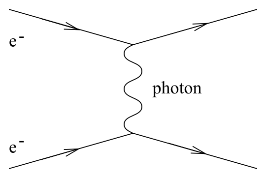
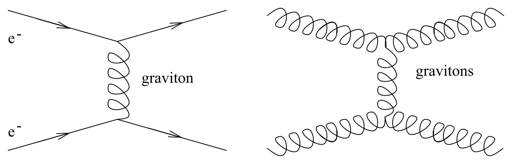

# 弯曲时空中的物理与爱因斯坦方程

<!-- CARROLL_NAV_TOP -->
> 完整译文 · 原 PDF 第 104–135 页 · [本章入口](../04-gravitation-and-einstein-equation.md) · [全书入口](../../carroll-general-relativity.md)
<!-- /CARROLL_NAV_TOP -->

## 牛顿引力作为时空曲率的极限

因此，我们已经证明，只要度规取 (4.21) 的形式，时空曲率确实足以在牛顿极限下描述引力。当然，我们还需要找到度规的场方程，由它推出度规会取这种形式，并且在只有一个引力源物体时恢复牛顿公式

$$
\Phi = -{{GM}\over r}\ ,
\tag{4.22}
$$

，不过我们很快就会做到这一点。

## 协变性原理

接下来的任务，是说明除自由下落粒子的运动定律之外，其余物理定律如何适应时空曲率。这个步骤基本遵循我们论证自由粒子沿测地线运动时建立的范式。先取一条平直空间中的物理定律；传统上，它会用偏导数和平直度规来书写。根据等效原理，只要采用黎曼正规坐标，这条定律在有引力时依然成立。然后，把它转写成张量之间的关系，例如把偏导数改成协变导数。在黎曼正规坐标中，这个版本的定律会约化为平直空间中的版本；但张量是与坐标无关的对象，所以张量形式的定律必定在任何坐标系中都成立。

这个步骤有时拥有一个专门的名字：**协变性原理**（Principle of Covariance）。我不确定它是否真值得单独命名，因为它其实只是 EEP 加上“物理定律必须与坐标无关”这一要求的后果。（我们几乎无法设想物理定律可能依赖坐标。对于给定的一个实验，如果一个人用某种坐标系预测结果，另一个人用另一种坐标系预测结果，那么两人的答案最好一致。）它还有一个名字叫“逗号变分号规则”，因为从排版符号上看，你要做的就是用协变导数（分号）替换偏导数（逗号）。

在推导自由粒子沿测地线运动这一结论时，我们已经暗中使用了协变性原理（或者随便你想怎么称呼它）。在大多数有意思的情形中，它用起来非常简单。举例来说，平直时空中的能量守恒公式为 ${\partial}_{\mu }T^{\mu\nu}=0$。把它推广到弯曲时空立刻得到

$$
\nabla_\mu T^{\mu\nu}=0\ .
\tag{4.23}
$$

这个方程表达了存在引力场时的能量守恒。

遗憾的是，事情并非总有这么容易。考虑狭义相对论中的麦克斯韦方程，看起来我们可以直截了当地应用协变性原理。非齐次方程 ${\partial}_{\mu }F^{\nu\mu} = 4\pi J^\nu$ 变成

$$
\nabla_\mu F^{\nu\mu} = 4\pi J^\nu\ ,
\tag{4.24}
$$

齐次方程 ${\partial}_{[\mu} F_{\nu\lambda]}= 0$ 则变成

$$
\nabla_{[\mu} F_{\nu\lambda]}= 0\ .
\tag{4.25}
$$

另一方面，我们也可以在平直空间中用微分形式写出麦克斯韦方程：

$$
{\rm d}(*F) = 4\pi(* J)\ ,
\tag{4.26}
$$

以及

$$
{\rm d}F = 0\ .
\tag{4.27}
$$

这些方程已经具有完美的张量形式，因为我们已经证明，无论联络是什么，外导数都是定义良好的张量算子。于是我们开始有一点担心：把一条物理定律写成张量形式的过程，凭什么保证给出唯一答案？事实上，正如前面提过的，麦克斯韦方程的微分形式版本应当视为基本版本。不过，在当前例子中，两种做法碰巧没有差别：没有挠率时，(4.26) 与 (4.24) 完全相同，(4.27) 与 (4.25) 也完全相同；联络的对称部分没有贡献。类似地，通过势 $A_\mu$ 定义场强张量时，既可以写成

$$
F_{{\mu\nu}} = \nabla_\mu A_\nu - \nabla_\nu A_\mu\ ,
\tag{4.28}
$$

也完全可以写成

$$
F={\rm d}A\ .
\tag{4.29}
$$

## 从平直时空推广时的歧义

然而，对唯一性的担心确实有其道理。设想两个向量场 $X^\mu$ 和 $Y^\nu$ 在平直空间中服从如下定律：

$$
Y^\mu{\partial}_{\mu }{\partial}_{\nu }X^\nu = 0\ .
\tag{4.30}
$$

把它写成张量方程时会遇到什么问题，应该已经很清楚：偏导数可以交换次序，协变导数却不可以。如果直接用协变导数替换 (4.30) 中的偏导数，得到的答案会不同于另一种做法：先交换导数的次序（这不会改变平直空间中的方程），然后再作替换。两种答案之差为

$$
Y^\mu\nabla_\mu \nabla_\nu X^\nu-Y^\mu\nabla_\nu \nabla_\mu X^\nu
  = -R_{{\mu\nu}}Y^\mu X^\nu\ .
\tag{4.31}
$$

把物理定律从平直时空推广到弯曲时空的处方，并没有指导我们如何选择导数的次序，因此对于有引力时是否应出现 (4.31) 这样的项，它给不出确定答案。（协变导数的排序问题，类似于量子力学中算符排序的歧义。）

在文献中，你能找到各种处理这类歧义的方案，其中大多数都是合理的建议，例如在电磁理论中要记得保持规范不变性。不过，追根究底，真正的答案是：单靠纯粹思考没有办法解决这些问题。事实可能是，同一条物理定律存在不止一种适应弯曲空间的方式，最终只有实验才能在不同方案之间作出裁决。

事实上，让我们坦率地看待等效原理：它是一条有用的指导原则，却不应被当作自然界的基本原理。按照现代观点，我们并不期待 EEP 严格成立。考虑 (4.24) 的如下替代版本：

$$
\nabla_\mu[(1+\alpha R)F^{\nu\mu}] = 4\pi J^\nu\ ,
\tag{4.32}
$$

其中 $R$ 是里奇标量，$\alpha$ 是某个耦合常数。如果这个方程正确描述了弯曲时空中的电动力学，那么即使在任意小的区域中，我们也可以通过对带电粒子做实验来测量 $R$。因此，等效原理要求 $\alpha=0$。可是撇开这一点，它完全是一个正当的方程：它与电荷守恒以及电磁理论的其他理想性质相容，并且在平直空间中约化为通常的方程。事实上，在一个由量子力学支配的世界中，我们预期不同场之间（例如引力场与电磁场之间）凡是与理论对称性相容的耦合都会出现；这里相应的对称性就是规范不变性。那么，把 $\alpha$ 设为零为何合理？真正的理由与尺度有关。注意，里奇张量包含无量纲度规的二阶导数，所以 $R$ 具有（长度）$^{-2}$ 的量纲（取 $c=1$）。因此，$\alpha$ 必须具有（长度）$^{2}$ 的量纲。但由于 $\alpha$ 所代表的耦合源于引力，对相应长度尺度唯一合理的预期就是

$$
\alpha \sim l_P^2\ ,
\tag{4.33}
$$

其中 $l_P$ 是普朗克长度，

$$
l_P = \left({{G\hbar}\over{c^3}}\right)^{1/2}=1.6\times
  10^{-33}{\rm ~cm}\ ,
\tag{4.34}
$$

而 $\hbar$ 当然是普朗克常数。因此，与这个耦合相应的长度尺度极其微小；对任何可以设想的实验而言，我们都预期引力场发生变化的典型尺度会大得多。于是，这个违反等效原理的项之所以可以放心忽略，原因很简单：$\alpha R$ 很可能是一个小得离谱的数，远远超出任何实验的探测能力。另一方面，我们也不妨保持开放态度，因为观测结果并不总会实现我们的预期。

## 从泊松方程猜测引力场方程

我们已经确立了物理定律如何支配弯曲时空中场与物体的行为。接下来引入爱因斯坦场方程，说明度规如何响应能量和动量，就能完成真正意义上的广义相对论体系。我们实际上会用两种方式完成这件事：先给出一个接近爱因斯坦本人思路的非正式论证，然后从一个作用量出发，推导相应的运动方程。

这个非正式论证始于一种认识：我们想找到一个取代牛顿引力势泊松方程的方程：

$$
\nabla^2\Phi = 4\pi G\rho\ ,
\tag{4.35}
$$

其中 $\nabla^2 = \delta^{ij}{\partial}_{i}{\partial}_{j}$ 是空间中的拉普拉斯算子，$\rho$ 是质量密度。（当质量分布为点状时，(4.22) 中给出的 $\Phi$ 显式形式就是 (4.35) 的一个解。）我们要寻找的方程应当具有哪些特征？在 (4.35) 的左边，是一个作用于引力势的二阶微分算子；右边则是对质量分布的度量。相对论性的推广应当采取张量方程的形式。质量密度的张量推广是什么，我们已经知道：它就是能量—动量张量 $T_{\mu\nu}$。与此同时，引力势应由度规张量取代。因此，我们也许会猜想，新方程要把 $T_{\mu\nu}$ 设为与某个张量成正比，而这个张量包含度规的二阶导数。事实上，在牛顿极限下使用度规 (4.21) 以及 $T_{00}=\rho$，就能看出我们要找的方程在这个极限中应当预言

$$
\nabla^2 h_{00} = -8\pi G T_{00}\ ,
\tag{4.36}
$$

不过，我们当然希望它是完全张量化的。

(4.36) 的左边没有一个显而易见的张量推广。第一个选择也许是让达朗贝尔算子 $\Box= \nabla^\mu \nabla_\mu$ 作用于度规 $g_{\mu\nu}$，但由于度规适配性，这个结果自动为零。幸运的是，有一个明显不为零的量，它由度规的二阶导数（以及一阶导数）构成：黎曼张量 $R^\rho{}_{\sigma{\mu\nu}}$。它的指标数目不合适，但我们可以对它作缩并，形成指标数恰好合适的里奇张量 $R_{{\mu\nu}}$（而且它还是对称的）。因此，一个合理猜想是，引力场方程为

$$
R_{{\mu\nu}} = \kappa T_{{\mu\nu}}\ ,
\tag{4.37}
$$

其中 $\kappa$ 是某个常数。事实上，爱因斯坦的确曾在某个阶段提出过这个方程。遗憾的是，它在能量守恒方面有一个问题。根据等效原理，弯曲时空中的能量—动量守恒应表述为

$$
\nabla^\mu T_{{\mu\nu}} =0\ ,
\tag{4.38}
$$

这将进一步蕴含

$$
\nabla^\mu R_{{\mu\nu}} =0\ .
\tag{4.39}
$$

这在任意几何中显然并不成立；根据比安基恒等式 (3.94)，我们已经看到

$$
\nabla^\mu R_{{\mu\nu}} ={1\over 2}\nabla_\nu R\ .
\tag{4.40}
$$

可是，我们所提议的场方程意味着 $R=\kappa g^{{\mu\nu}}T_{{\mu\nu}} = \kappa T$，把这些结果合起来便有

$$
\nabla_\mu T=0\ .
\tag{4.41}
$$

标量的协变导数就是偏导数，所以 (4.41) 告诉我们，$T$ 在整个时空中都是常数。这极不合理，因为真空中 $T=0$，物质中却有 $T>0$。我们得再努力一点。

（其实，把方程 $\nabla^\mu T_{{\mu\nu}} =0$ 看得如此严肃时，我们略微耍了点手段。倘若等效原理确如我们所说，只是一条近似指导原则，我们就可以设想右边存在涉及曲率张量的非零项。稍后我们会给出更精确的论证，说明这些项严格为零。）

## 爱因斯坦张量与场方程

当然，我们不必多费多少力气，因为已经知道一个由里奇张量构成、自动守恒的对称 $(0,2)$ 张量：爱因斯坦张量

$$
G_{\mu\nu}= R_{\mu\nu}- {1\over 2} R g_{\mu\nu}\ ,
\tag{4.42}
$$

它始终满足 $\nabla^\mu G_{\mu\nu}=0$。因此，我们自然提出

$$
G_{\mu\nu}= \kappa T_{\mu\nu}
\tag{4.43}
$$

，把它作为度规的场方程。这个方程满足所有显然的要求：右边以一个对称且守恒的 $(0,2)$ 张量，协变地表示能量和动量密度；左边则是一个由度规及其一阶、二阶导数构成的对称且守恒的 $(0,2)$ 张量。剩下的问题只有一个：它是否真的能重现我们所熟知的引力。

为了回答这个问题，注意对 (4.43) 两边缩并会得到（在四维中）

$$
R = -\kappa T\ ,
\tag{4.44}
$$

利用这一点，可以把 (4.43) 改写成

$$
R_{\mu\nu}= \kappa(T_{\mu\nu}-{1\over 2}T g_{\mu\nu})\ .
\tag{4.45}
$$

这仍是同一个方程，只是写法略有不同。我们想看看，在弱场、与时间无关且粒子缓慢运动的极限中，它是否预言牛顿引力。在这个极限下，静止能量 $\rho=T_{00}$ 会远大于 $T_{\mu\nu}$ 中的其他项，所以我们要关注 (4.45) 的 $\mu=0$、$\nu=0$ 分量。在弱场极限中，按照 (4.13) 和 (4.14) 写成

$$
\begin{aligned}
g_{00} &=&  -1 +h_{00}\ ,\cr
  g^{00} &=&  -1 -h_{00}\ .
\end{aligned}
\tag{4.46}
$$

精确到最低非平凡阶，能量—动量张量的迹为

$$
T = g^{00}T_{00} = -T_{00}\ .
\tag{4.47}
$$

把它代入 (4.45)，得到

$$
R_{00} = {1\over 2} \kappa T_{00}\ .
\tag{4.48}
$$

这个方程把度规的导数与能量密度联系起来。为了求出用度规表示的显式表达式，我们需要计算 $R_{00} = R^\lambda{}_{0\lambda 0}$。实际上，只需计算 $R^i{}_{0i0}$，因为 $R^0{}_{000}=0$。我们有

$$
R^i{}_{0j0} = {\partial}_{j}\Gamma^i_{00} - {\partial}_{0}\Gamma^i_{j0}
  +\Gamma^i_{j\lambda}\Gamma^\lambda_{00}
  -\Gamma^i_{0\lambda}\Gamma^\lambda_{j0}\ .
\tag{4.49}
$$

这里的第二项是时间导数，对静态场为零。第三项和第四项都具有 $(\Gamma)^2$ 的形式；由于 $\Gamma$ 在度规微扰中是一阶量，这两项只在二阶才有贡献，因而可以忽略。剩下的是 $R^i{}_{0j0} = {\partial}_{j}\Gamma^i_{00}$。由此得到

$$
\begin{aligned}
R_{00} &=&  R^i{}_{0i0}\cr
  &=& {\partial}_{i}\left({1\over 2} g^{i\lambda}
  ({\partial}_{0} g_{ \lambda 0} + {\partial}_{0} g_{0\lambda} - {\partial}_{\lambda }g_{00})\right)\cr
  &=&  -{1\over 2}\eta^{ij}{\partial}_{i}{\partial}_{j} h_{00}\cr
  &=&  -{1\over 2}\nabla^2h_{00}\ .
\end{aligned}
\tag{4.50}
$$

与 (4.48) 比较可知，在牛顿极限下，(4.43) 的 $00$ 分量预言

$$
\nabla^2 h_{00} = -\kappa T_{00}\ .
\tag{4.51}
$$

只要令 $\kappa = 8\pi G$，这恰好就是 (4.36)。

看来我们的猜测成功了。通过与牛顿极限比较固定归一化之后，就可以给出广义相对论的**爱因斯坦方程**：

$$
R_{{\mu\nu}} -{1\over 2}R g_{\mu\nu}= 8\pi G T_{{\mu\nu}}\ .
\tag{4.52}
$$

这些方程告诉我们，时空曲率如何对能量—动量的存在作出响应。你也许听说过，爱因斯坦认为左边优美而富于几何意味，右边则没有那么令人信服。

## 方程的自由度、非线性与自耦合

爱因斯坦方程可以看作度规张量场 $g_{\mu\nu}$ 的二阶微分方程。独立方程共有十个（因为两边都是对称的双指标张量），看起来正好对应于度规分量这十个未知函数。然而，比安基恒等式 $\nabla^\mu G_{\mu\nu}=0$ 对函数 $R_{{\mu\nu}}$ 施加了四个约束，所以 (4.52) 中真正独立的方程只有六个。这其实正合适：如果一个度规在某个坐标系 $x^\mu$ 中是爱因斯坦方程的解，那么它在任何其他坐标系 $x^{\mu'}$ 中也应当是解。这意味着 $g_{\mu\nu}$ 中有四个非物理自由度（由四个函数 $x^{\mu'}(x^\mu)$ 表示），所以我们应当预期爱因斯坦方程只约束六个与坐标无关的自由度。

作为微分方程，它们极其复杂：里奇标量和里奇张量是黎曼张量的缩并；黎曼张量涉及克里斯托费尔符号的导数与乘积；克里斯托费尔符号又涉及逆度规和度规的导数。此外，能量—动量张量 $T_{\mu\nu}$ 一般也会包含度规。这些方程还是非线性的，因此无法把两个已知解叠加起来得到第三个解。所以，要在任何程度的一般性下求解爱因斯坦方程都非常困难，通常必须作出一些简化假设。即使在真空中，把能量—动量张量设为零，得到的方程（由 (4.45)）

$$
R_{\mu\nu}=0
\tag{4.53}
$$

也可能很难求解。最常用的一类简化假设，是度规具有相当高的对称性；稍后我们会讨论度规的对称性如何让事情变得容易。

广义相对论的非线性值得特别说一说。在牛顿引力中，两个点质量产生的引力势就是各自引力势的简单相加；在广义相对论中，这一性质显然无法延续到弱场极限之外。其背后有一个物理原因：在 GR 中，引力场会与自身耦合。可以把这一点看作等效原理的一个后果——如果引力不与自身耦合，那么一个“引力原子”（两个粒子依靠相互引力束缚而成）就会因为负的束缚能而具有不同的惯性质量和引力质量。从粒子物理的角度看，这可以用费曼图来表达。两个电子之间的电磁相互作用，可以看作由交换一个虚光子引起：

<figure>
  
  <figcaption>图 4.7：两个电子通过交换虚光子发生电磁相互作用。</figcaption>
</figure>

但不存在两个光子彼此交换另一个光子的图；电磁理论是线性的。与此同时，引力相互作用可以看作由交换一个虚引力子（度规微扰的量子化形式）引起。非线性表现为：电子、引力子（以及其他任何东西）都可以交换虚引力子，因而能够施加引力：

<figure>
  
  <figcaption>图 4.8：引力子本身也能交换虚引力子，体现引力场的自耦合与非线性。</figcaption>
</figure>

引力的这一特征没有什么深不可测之处；大多数规范理论都具有它，例如描述强相互作用的量子色动力学。（电磁理论其实才是例外；它的线性可以追溯到相应的规范群 U(1) 是阿贝尔群。）但它确实标志着广义相对论偏离了牛顿理论。（当然，用费曼图这种量子力学语言谈论 GR 多少有些不合适，因为 GR 尚未被成功量子化［至少目前还没有］；不过，这些图只是方便的简写，帮助我们记住理论中存在哪些相互作用。）

<!-- CARROLL_NAV_BOTTOM -->
---
[← 弯曲时空与牛顿极限](./02-curved-spacetime-and-newtonian-limit.md) · [全书入口](../../carroll-general-relativity.md) · [希尔伯特作用量、能量动量张量与弱能量条件 →](./04-hilbert-action-stress-energy-and-wec.md)
<!-- /CARROLL_NAV_BOTTOM -->
