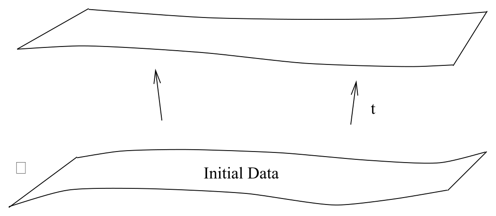
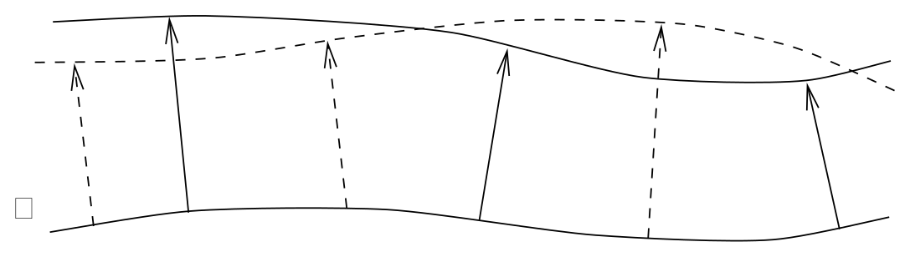
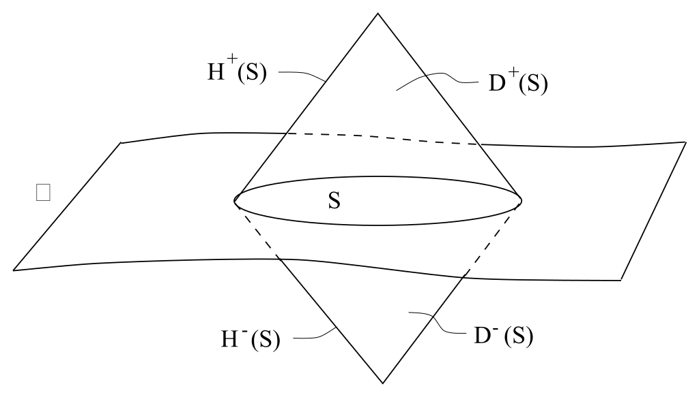
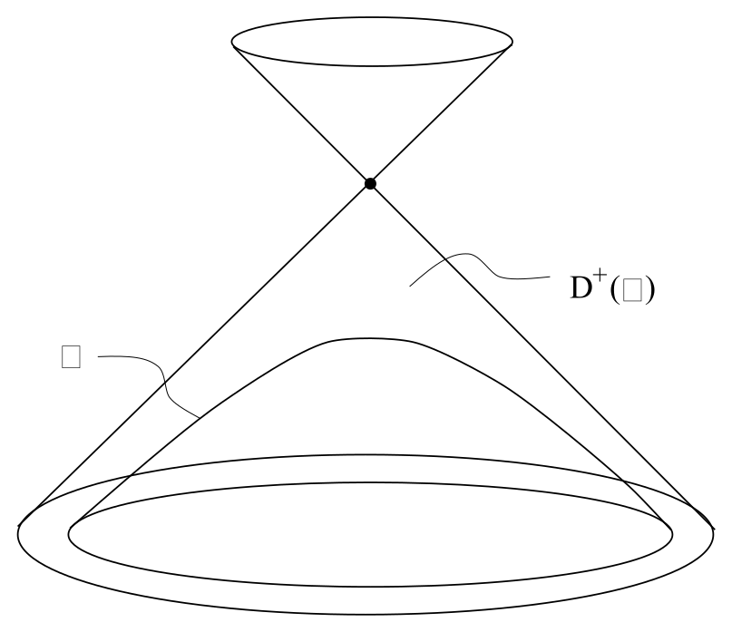
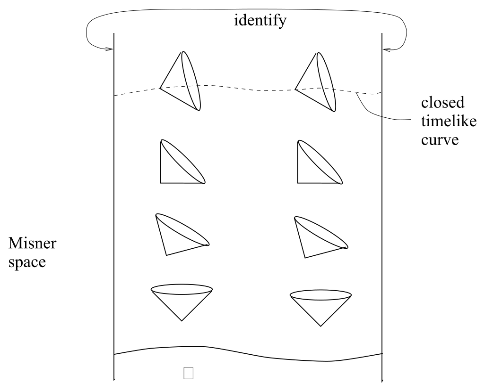
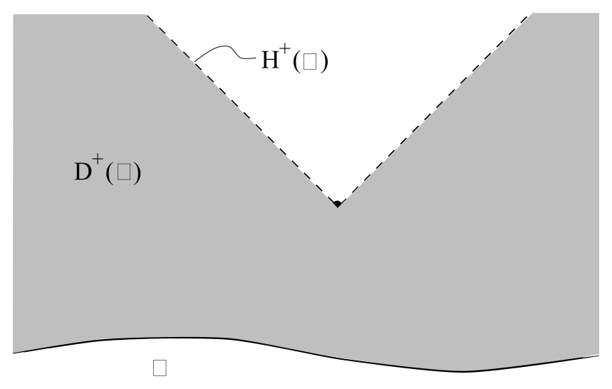

# 初值问题与因果结构

<!-- CARROLL_NAV_TOP -->
> 完整译文 · 原 PDF 第 104–135 页 · [本章入口](../04-gravitation-and-einstein-equation.md) · [全书入口](../../carroll-general-relativity.md)
<!-- /CARROLL_NAV_TOP -->

## 从牛顿力学的初值问题到广义相对论

我们要把这样一种可能性放在心上：上述某个替代方案（更可能的是某种我们尚未想到的理论）也许才真正为自然界所实现。不过，在本课程余下的内容中，我们将假定以爱因斯坦方程或希尔伯特作用量为基础的广义相对论是正确理论，并推导它的后果。当然，这些后果由两部分组成：爱因斯坦方程面对各种能量和动量源时的解，以及试验粒子在这些解中的行为。在详细考察具体解之前，先以更抽象的方式看一看广义相对论中的初值问题。

在经典牛顿力学中，单个粒子的行为当然由 ${\bf f} = m{\bf a}$ 支配。如果粒子在某个势能场 $\Phi(x)$ 的影响下运动，那么力为 ${\bf f} = -\nabla \Phi$，粒子服从

$$
m{{d^2x^i}\over{dt^2}}=-{\partial}_{i}\Phi\ .
\tag{4.79}
$$

这是关于 $x^i(t)$ 的二阶微分方程。引入动量 ${\bf p}$ 后，我们可以把它改写成一组相互耦合的一阶方程：

$$
\begin{aligned}
{{dp^i}\over{dt}}&=& -{\partial}_{i}\Phi\cr
  {{dx^i}\over{dt}} &=&  {1\over m}p^i\ .
\end{aligned}
\tag{4.80}
$$

初值问题就是这样一个过程：指定一个作为边界条件的“状态” $(x^i,p^i)$，使 (4.80) 能够获得唯一解。你可以把 (4.80) 理解成：给定某一时刻 $t$ 的坐标和动量后，它让你把二者向前演化一个无穷小时间，到达 $t+\delta t$；反复进行这个步骤，就能得到完整解。

我们希望在广义相对论中表述类似的问题。爱因斯坦方程 $G_{\mu\nu}= 8\pi G T_{\mu\nu}$ 当然是协变的；它们不会挑出一种优先的“时间”概念，让状态沿着它演化。尽管如此，我们仍可以人为选取一个类空超曲面（或“切片”）$\Sigma$，在这个超曲面上指定初始数据，再看能否由它唯一演化到未来的某个超曲面。（之所以叫“超”曲面，是因为四维时空中的恒定时间切片是三维的，而通常所说的“曲面”是二维的。）这个过程损害了理论的显式协变性，但只要足够谨慎，最终得到的表述就应当等价于在整个时空中一次性求解爱因斯坦方程。

<figure>
  
  <figcaption>图 4.9：在类空超曲面上指定初始数据，并把它们演化到未来的类空切片。</figcaption>
</figure>

## 约束方程与演化方程

由于度规是基本变量，我们的第一个猜测是：把超曲面上度规的取值 $g_{\mu\nu}|_\Sigma$ 看作“坐标”，把它相对于某个指定时间坐标的时间导数 ${\partial}_{t}g_{\mu\nu}|_\Sigma$ 看作“动量”，二者共同指定状态。（物质场也会有自己的坐标和动量，这里不作显式考察。）事实上，方程 $G_{\mu\nu}= 8\pi G T_{\mu\nu}$ 的确涉及度规关于时间的二阶导数（因为联络涉及度规的一阶导数，而爱因斯坦张量涉及联络的一阶导数），所以我们的方向似乎对了。然而，比安基恒等式告诉我们 $\nabla_\mu G^{\mu\nu}=0$。可以把这个方程改写为

$$
{\partial}_{0} G^{0\nu}=-{\partial}_{i}G^{i\nu}-\Gamma^\mu_{\mu\lambda}G^{\lambda\nu}
  -\Gamma^\nu_{\mu\lambda}G^{\mu\lambda}\ .
\tag{4.81}
$$

仔细观察右边就会发现，其中没有关于时间的*三阶*导数；因此，左边也不可能有。于是，尽管 $G^{\mu\nu}$ 整体涉及度规的二阶时间导数，特定分量 $G^{0\nu}$ 却不涉及。在爱因斯坦方程的十个独立分量中，由

$$
G^{0\nu}=8\pi GT^{0\nu}
\tag{4.82}
$$

表示的四个分量不能用来演化初始数据 $(g_{\mu\nu},{\partial}_{t}g_{\mu\nu})_\Sigma$。它们充当的是初始数据必须满足的**约束**；我们不能在超曲面 $\Sigma$ 上任意指定度规及其时间导数的组合，因为它们必须服从关系 (4.82)。其余方程

$$
G^{ij}=8\pi GT^{ij}
\tag{4.83}
$$

则是度规的动力学演化方程。当然，这里只有六个方程，却有十个未知函数 $g_{\mu\nu}(x^\sigma)$，所以解不可避免地带有四重歧义。这正是我们已经提到过的自由：可以在整个时空中选择四个坐标函数。

逐项梳理 (4.83) 后会发现，度规并非所有二阶时间导数都会出现；这个练习很直接，却没有多少启发性。事实上，${\partial}_{t}^2g_{ij}$ 会出现在 (4.83) 中，${\partial}_{t}^2g_{0\nu}$ 却不会。因此，广义相对论中的“状态”由超曲面 $\Sigma$ 上度规的类空分量 $g_{ij}|_\Sigma$ 及其一阶时间导数 ${\partial}_{t}g_{ij}|_\Sigma$ 指定。利用 (4.83)，我们可以由此确定未来的演化，但在固定剩余分量 $g_{0\nu}$ 时存在一种不可避免的歧义。这种情形与电磁理论完全类似；我们知道，无论给出多少初始数据，都不足以唯一确定演化，因为始终存在作规范变换 $A_\mu \rightarrow A_\mu +{\partial}_{\mu}\lambda$ 的自由。因此，在广义相对论中，坐标变换扮演着一种类似于电磁理论中规范变换的角色：它们会给时间演化引入歧义。

## 谐和规范

应对这个问题的一种方式，就是直接“选择规范”。在电磁理论中，这意味着对向量势 $A_\mu$ 施加一个条件，限制我们作规范变换的自由。例如，可以选择满足 $\nabla_\mu A^\mu=0$ 的洛伦兹规范，也可以选择满足 $A_0=0$ 的时间规范。在广义相对论中，可以通过固定坐标系来做类似的事情。一个常用选择是**谐和规范**（也称洛伦兹规范以及许多其他名字），其中

$$
\Box x^\mu =0\ .
\tag{4.84}
$$

这里，$\Box=\nabla^\mu\nabla_\mu$ 是协变达朗贝尔算子。取协变导数时必须清楚认识到，四个函数 $x^\mu$ 仅仅是函数，并非某个向量的分量。因此，这个条件就是

$$
\begin{aligned}
0&=&  \Box x^\mu\cr
  &=&  g^{\rho\sigma}{\partial}_{\rho}{\partial}_{\sigma }x^\mu - g^{\rho\sigma}
  \Gamma^\lambda_{\rho\sigma}{\partial}_{\lambda }x^\mu\cr
  &=&  -g^{\rho\sigma}\Gamma^\lambda_{\rho\sigma}\ .
\end{aligned}
\tag{4.85}
$$

当然，在平直空间中，笛卡尔坐标（其中 $\Gamma^\lambda_{\rho\sigma}=0$）就是谐和坐标。（作为一条一般原则，凡是满足 $\Box f=0$ 的函数 $f$，都称为“调和函数”。）

为了看出这种坐标选择确实固定了规范自由，让我们把条件 (4.84) 改写成略为简单的形式。由克里斯托费尔符号的定义，有

$$
g^{\rho\sigma}\Gamma^\mu_{\rho\sigma}={1\over 2}g^{\rho\sigma}
  g^{\mu\nu}({\partial}_{\rho }g_{\sigma\nu}+{\partial}_{\sigma }g_{\nu\rho} -{\partial}_{\nu}
  g_{\rho\sigma})\ ,
\tag{4.86}
$$

与此同时，由 ${\partial}_{\rho}(g^{\mu\nu}g_{\sigma\nu})={\partial}_{\rho}\delta^\mu_\sigma=0$ 可得

$$
g^{\mu\nu}{\partial}_{\rho }g_{\sigma\nu} = - g_{\sigma\nu}{\partial}_{\rho }g^{\mu\nu}\ .
\tag{4.87}
$$

另外，根据我们先前对度规行列式变分 (4.65) 的探讨，还有

$$
{1\over 2}g_{\rho\sigma}{\partial}_{\nu }g^{\rho\sigma} =
  -{1\over{{\sqrt{-g}}}}\,{\partial}_{\nu }{\sqrt{-g}}\ .
\tag{4.88}
$$

把这些结果合在一起，便发现一般情况下

$$
g^{\rho\sigma}\Gamma^\mu_{\rho\sigma}={1\over{{\sqrt{-g}}}}\,{\partial}_{\lambda}
  ({\sqrt{-g}}g^{\lambda\mu})\ .
\tag{4.89}
$$

因此，谐和规范条件 (4.85) 等价于

$$
{\partial}_{\lambda}({\sqrt{-g}}g^{\lambda\mu})=0\ .
\tag{4.90}
$$

再对它取关于 $t=x^0$ 的偏导数，得到

$$
{{\partial^2}\over{\partial t^2}}({\sqrt{-g}}g^{0\nu})=
  -{{\partial}\over{\partial x^i}}\left[{{\partial}\over
  {\partial t}}({\sqrt{-g}}g^{i\nu})\right]\ .
\tag{4.91}
$$

这个条件以给定的初始数据为基础，为此前不受约束的度规分量 $g^{0\nu}$ 给出了一个二阶微分方程。因此，我们成功固定了规范自由：现在可以在谐和坐标中求解整个度规的演化。（至少在局部是这样；我们一直略过一个事实，即我们的规范选择在整体上可能没有良好定义，此时必须像往常一样分坐标片工作。粒子物理的规范理论中也会出现同样的问题。）注意，我们仍保留了一部分自由：规范条件 (4.84) 限制坐标如何从初始超曲面 $\Sigma$ 延伸到整个时空，但仍允许我们任意选择 $\Sigma$ 上的坐标 $x^i$。这对应于如下事实：作坐标变换 $x^\mu \rightarrow x^\mu +\delta^\mu$，并令 $\Box\delta^\mu=0$，不会违反谐和规范条件。

## 广义相对论的适定初值表述

由此，我们为广义相对论建立了定义良好的初值问题：一个状态由某个类空超曲面 $\Sigma$ 上度规的类空分量及其时间导数指定；给出这些数据之后，爱因斯坦方程的类空分量 (4.83) 允许我们把度规向未来演化，而坐标选择所带来的歧义可以通过选择规范来解决。我们必须记住，初始数据不能任意给定，而要满足约束 (4.82)。（一旦在某个类空超曲面上施加约束，运动方程就会保证它们继续得到满足；你可以验证这一点。）约束发挥着一个有用作用：我们把流形拆分成“空间”和“时间”之后，它们保证结果仍然具有时空协变性。具体而言，约束 $G^{i0}=8\pi GT^{i0}$ 蕴含演化不依赖于我们在 $\Sigma$ 上选择的坐标，而 $G^{00}=8\pi GT^{00}$ 则保证在用不同方式把时空切分成类空超曲面时，理论保持不变。

<figure>
  
  <figcaption>图 4.10：约束方程保证演化不依赖于超曲面上的坐标选择，也不依赖于切分时空的具体方式。</figcaption>
</figure>

一旦看清如何把爱因斯坦方程表述成初值问题，一个至关重要的问题便是解是否存在。也就是说，在指定一个带有初始数据的类空超曲面之后，我们能在多大程度上保证它会确定唯一的时空？要精确回答这个问题，需要完成大量艰苦工作；不过，要大致掌握定义良好的解可能怎样无法存在，并不太难。下面就来考察这些情形。

## 依赖域与柯西视界

比起度规本身的演化，先考虑物质场在固定背景时空中的演化最为简单。因此，在某个具有固定度规 $g_{\mu\nu}$ 的流形 $M$ 中，考虑一个类空超曲面 $\Sigma$，并进一步考察 $\Sigma$ 中的某个连通子集 $S$。我们的指导原则是：任何信号都无法以超光速传播；因此，“信息”只会沿类时或类光轨迹流动（这些轨迹未必是测地线）。我们把 $S$ 的**未来依赖域**记为 $D^+(S)$，并定义为所有满足如下条件的点 $p$ 的集合：通过 $p$ 的*每一条*朝向过去、类时或类光且不可延拓的曲线，都必须与 $S$ 相交。（“不可延拓”只是说曲线会一直延伸下去，不会终止于某个有限位置。）我们按如下方式理解这个定义：$S$ 本身也是 $D^+(S)$ 的子集。（严格的表述当然不需要在定义之外再作额外解释，只是我们目前还没有做到尽可能严谨。）类似地，把“朝向过去”换成“朝向未来”，以同样方式定义过去依赖域 $D^-(S)$。一般而言，$M$ 中有些点会落在某个依赖域中，有些则位于其外。我们把 $D^+(S)$ 的边界定义成**未来柯西视界** $H^+(S)$，同样把 $D^-(S)$ 的边界定义成过去柯西视界 $H^-(S)$。你可以说服自己，二者都是类光曲面。

<figure>
  
  <figcaption>图 4.11：类空超曲面子集 $S$ 的未来、过去依赖域及其类光边界——柯西视界。</figcaption>
</figure>

这些定义的用处应当很明显：如果任何东西都不以超光速运动，信号就无法传播到任意一点 $p$ 的光锥之外。因此，如果留在这个光锥内的每一条曲线都必须与 $S$ 相交，那么在 $S$ 上指定的信息就应足以预测 $p$ 点的情形。（也就是说，在 $S$ 上给定物质场的初始数据，可以用来求出 $p$ 点处的场值。）能够只凭 $S$ 上的信息预测其物理状况的全部点的集合，正是并集 $D^+(S)\cup D^-(S)$。

我们很容易把这些想法从子集 $S$ 推广到整个超曲面 $\Sigma$。要点在于，即使 $\Sigma$ 本身看起来是一个完全正常、延伸遍及整个空间的超曲面，$D^+(\Sigma)\cup D^-(\Sigma)$ 也可能无法覆盖整个 $M$。出现这种情形的方式有好几种。一种可能是，我们恰好选了一个“糟糕的”超曲面（尽管很难给出一条一般准则，判断超曲面何时会在这个意义上很糟糕）。考虑闵可夫斯基空间，以及一个始终位于某一点光锥过去方向的类空超曲面 $\Sigma$。

<figure>
  
  <figcaption>图 4.12：该类空超曲面始终位于某个光锥的过去，因而它的未来依赖域止于光锥。</figcaption>
</figure>

在这种情形中，$\Sigma$ 是一个很好的类空曲面，但 $D^+(\Sigma)$ 显然止于这个光锥，我们无法利用 $\Sigma$ 上的信息预测整个闵可夫斯基空间中发生的事情。当然，我们还可以选择其他曲面，让依赖域覆盖整个流形，所以这个问题没有让我们太过担心。

## Misner 时空与闭合类时曲线

一个稍微更为深刻的例子称为 **Misner 时空**。这是一个拓扑为 ${\bf R}^1\times S^1$ 的二维时空，其度规使光锥随着时间向前推移而逐渐倾斜。

<figure>
  
  <figcaption>图 4.13：Misner 时空的光锥不断倾斜；超过某一点后，会出现绕 $S^1$ 一周并回到自身的类时轨迹。</figcaption>
</figure>

越过某个点之后，就可以沿一条绕过 $S^1$ 并回到自身的类时轨迹旅行；这种轨迹称为**闭合类时曲线**。如果我们在这个点的过去指定一个曲面 $\Sigma$，那么包含闭合类时曲线的区域中，没有任何一点属于 $\Sigma$ 的依赖域，因为这些闭合类时曲线本身不会与 $\Sigma$ 相交。这显然比前一个问题更糟，因为在这个时空中，一个定义良好的初值问题似乎并不存在。（其实，这类问题是当前某些研究工作的主题，所以我不会声称争议已经解决。）

## 奇点与初值演化的障碍

最后一个例子来自奇点的存在。奇点是不属于流形的点，尽管沿测地线旅行有限距离就能抵达它们。通常，当曲率在某一点变成无穷大时就会出现这种情形；一旦如此，就再也不能说该点是时空的一部分。这类事件会导致柯西视界出现——位于某个奇点未来的点 $p$，不可能属于奇点过去某个超曲面的依赖域，因为会有从 $p$ 出发的曲线直接终止于奇点。

<figure>
  
  <figcaption>图 4.14：有些从未来点出发的过去向曲线终止于奇点，无法到达初始超曲面，因此形成柯西视界。</figcaption>
</figure>

当我们试图从初始数据演化度规本身时，所有这些障碍同样会出现在 GR 的初值问题中。不过，它们造成麻烦的程度各不相同。选到“糟糕”初始超曲面的可能性并不常见，尤其因为大多数解都是通过在整个时空中求解爱因斯坦方程而整体找到的。真正需要小心的一种情形，是对爱因斯坦方程作数值求解时：即使原则上存在一个完整解，选取不佳的超曲面也会导致数值困难。闭合类时曲线似乎是 GR 极力避免的东西——确实存在包含它们的解，但从一般初始数据出发演化，通常不会产生它们。另一方面，奇点实际上无法避免。引力总是吸引力，这个简单事实会倾向于把物质拉到一起，增大曲率，并且通常导致某种奇点。我们显然必须学会与此共处，尽管仍有一线希望：一个定义良好的量子引力理论也许能够消除经典 GR 中的奇点。

<!-- CARROLL_NAV_BOTTOM -->
---
[← 引力的替代理论](./05-alternative-theories-of-gravity.md) · [全书入口](../../carroll-general-relativity.md) · [拉回、推前与微分同胚 →](../05-diffeomorphisms-and-symmetry/01-pullbacks-pushforwards-and-diffeomorphisms.md)
<!-- /CARROLL_NAV_BOTTOM -->
