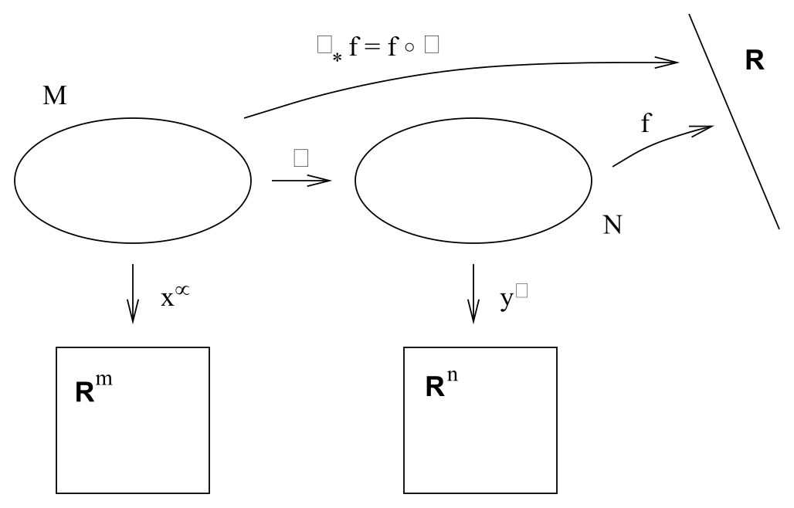
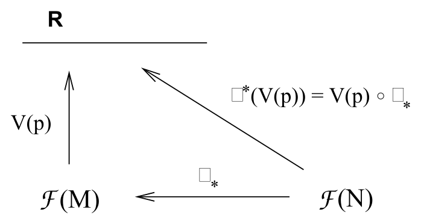
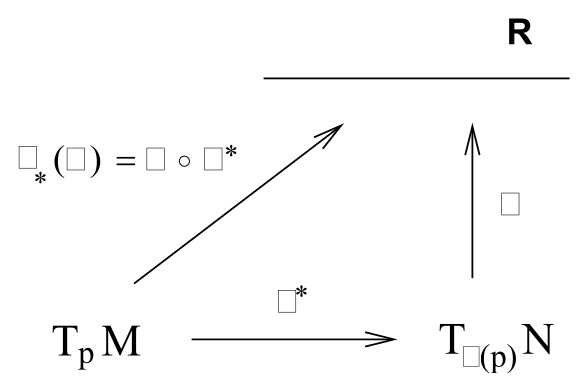
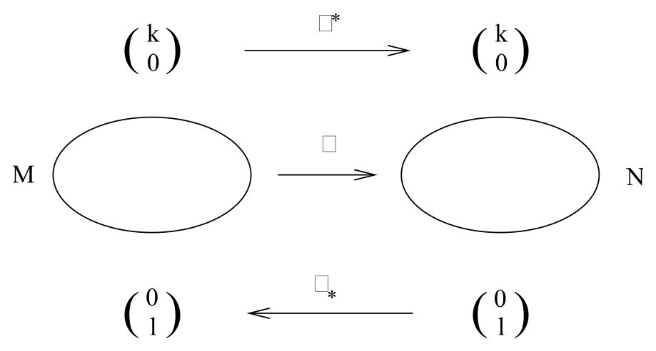
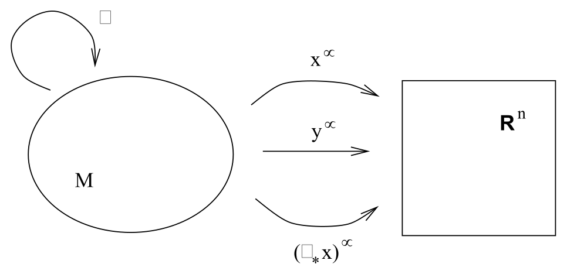

# 拉回、推前与微分同胚

<!-- CARROLL_NAV_TOP -->
> 完整译文 · 原 PDF 第 136–148 页 · [本章入口](../05-diffeomorphisms-and-symmetry.md) · [全书入口](../../carroll-general-relativity.md)
<!-- /CARROLL_NAV_TOP -->

## 更多几何

理解了物理定律如何适应弯曲时空之后，人们无疑很想立即开始讨论应用。不过，再补充几种数学技巧会大大简化我们的工作，因此我们先短暂停下来，进一步探索流形的几何。

在第 2 节讨论流形时，我们引入了两个不同流形之间的映射，也说明了映射如何复合。现在，我们转而考察如何借助这类映射，把张量场从一个流形带到另一个流形。为此，考虑两个流形 $M$ 和 $N$，它们的维数可以不同，各自带有坐标系 $x^\mu$ 和 $y^\alpha$。设有映射 $\phi:M\rightarrow N$，以及函数 $f:N\rightarrow {\bf R}$。

<figure>
  
  <figcaption>图 5.1：映射 $\phi:M\rightarrow N$ 与函数 $f:N\rightarrow {\bf R}$ 可以复合成定义在 $M$ 上的函数 $f\circ\phi$；图中也标出了两个流形各自的坐标映射。</figcaption>
</figure>

显然，我们可以把 $\phi$ 与 $f$ 复合，构造映射 $(f\circ\phi):M\rightarrow{\bf R}$，它就是 $M$ 上的一个函数。这种构造十分有用，因而有了自己的名称；我们把 $f$ 在 $\phi$ 下的**拉回**（pullback）记作 $\phi_*f$，定义为
$$
\phi_* f = (f\circ\phi)\ .
\tag{5.1}
$$
这个名称很贴切，因为我们把 $\phi_*$ 看作把函数 $f$ 从 $N$“拉回”到 $M$。

## 函数的拉回与向量的推前

函数可以拉回，却不能推前。若有函数 $g:M\rightarrow{\bf R}$，我们无法把 $g$ 与 $\phi$ 复合成 $N$ 上的函数；箭头的方向接不上。不过请回想，向量可以看作一种导数算子，它把光滑函数映射为实数。这让我们能够定义向量的**推前**（pushforward）；若 $V(p)$ 是 $M$ 上一点 $p$ 处的向量，我们通过规定它对 $N$ 上函数的作用，来定义 $N$ 上点 $\phi(p)$ 处的推前向量 $\phi^*V$：
$$
(\phi^*V)(f) = V(\phi_*f)\ .
\tag{5.2}
$$
所以，在推前向量场时，我们所说的是：“$\phi^*V$ 对任意函数的作用，就等于 $V$ 对该函数拉回的作用。”

这仍然有些抽象，最好能给出一种更具体的描述。我们知道，$M$ 上的向量基由偏导数集合 ${\partial}_{\mu}={{\partial}\over{\partial x^\mu}}$ 给出，$N$ 上的向量基则由偏导数集合 $`{\partial}_{\alpha}=
{{\partial}\over{\partial y^\alpha}}`$ 给出。因此，我们希望把 $V=V^\mu{\partial}_{\mu}$ 的分量与 $`(\phi^*V)=(\phi^*V)^\alpha
{\partial}_{\alpha}`$ 的分量联系起来。让推前后的向量作用于一个测试函数，再使用链式法则 (2.3)，就能找到所求关系：
$$
\begin{aligned}
(\phi^*V)^\alpha{\partial}_{\alpha }f &=&  V^\mu{\partial}_{\mu }(\phi_* f)\cr
  &=&  V^\mu{\partial}_{\mu }(f\circ\phi)\cr
  &=& V^\mu {{\partial y^\alpha}\over{\partial x^\mu}}{\partial}_{\alpha }f\ .
\end{aligned}
\tag{5.3}
$$
这个简单公式让人很自然地把推前运算 $\phi^*$ 看成矩阵算子 $`(\phi^*V)^\alpha =
(\phi^*)^\alpha{}_\mu V^\mu`$，其矩阵为
$$
(\phi^*)^\alpha{}_\mu = {{\partial y^\alpha}\over{\partial x^\mu}}
  \ .
\tag{5.4}
$$
向量在推前作用下的行为，与坐标变换下的向量变换律有着显而易见的相似之处。事实上，前者是后者的推广，因为当 $M$ 和 $N$ 是同一个流形时，这两种构造完全相同（稍后会讨论这一点）；但不要因此受到误导：一般而言，$\mu$ 与 $\alpha$ 的允许取值不同，而且矩阵 $`{{\partial y^\alpha}
/{\partial x^\mu}}`$ 完全没有必须可逆的理由。

有一个很值得做的练习：让自己确信，给定映射 $`\phi:
M\rightarrow N`$，虽然可以把向量从 $M$ 推前到 $N$，一般却无法把它们拉回——不断尝试发明一种合适的构造，直到你清楚看出这种尝试注定徒劳。由于一形式与向量对偶，听说一形式能够拉回（但一般不能推前），你应该不会感到意外。要做到这一点，请记住一形式是从向量到实数的线性映射。因此，可以通过规定 $N$ 上一形式 $\omega$ 的拉回 $\phi_*\omega$ 对 $M$ 上向量 $V$ 的作用来定义它：令这一作用等于 $\omega$ 本身对 $V$ 的推前的作用，
$$
(\phi_*\omega)(V)=\omega(\phi^*V)\ .
\tag{5.5}
$$
同样，形式上的拉回算子也有简单的矩阵描述：$`(\phi_*\omega)_\mu =(\phi_*)_\mu{}^\alpha
\omega_\alpha`$，我们可以用链式法则把它推导出来。这个矩阵为
$$
(\phi_*)_\mu{}^\alpha = {{\partial y^\alpha}\over{\partial x^\mu}}
  \ .
\tag{5.6}
$$
也就是说，它与推前的矩阵 (5.4) 相同；当然，在矩阵作用于一形式并将其拉回时，参与缩并的是另一个指标。

## 映射复合的观点

对于为何拉回和推前只适用于某些对象、不适用于另一些对象，还有一种理解方式；它对你可能有帮助，也可能没有帮助。若用 ${\cal F}(M)$ 表示 $M$ 上全体光滑函数的集合，那么 $M$ 上一点 $p$ 处的向量 $V(p)$（*即*切空间 $T_pM$ 的一个元素）可以看成从 ${\cal F}(M)$ 到 ${\bf R}$ 的算子。我们已经知道，函数上的拉回算子把 ${\cal F}(N)$ 映射到 ${\cal F}(M)$（正如 $\phi$ 本身把 $M$ 映射到 $N$，只是方向相反）。所以，我们可以像最初通过复合映射定义函数的拉回那样，只靠复合映射来定义作用于向量的推前 $\phi_*$：

<figure>
  
  <figcaption>图 5.2：函数先由 $\phi_*$ 从 ${\cal F}(N)$ 拉回到 ${\cal F}(M)$，再由 $V(p)$ 映到 ${\bf R}$；这一复合定义了推前向量对函数的作用。</figcaption>
</figure>

类似地，若 $T_qN$ 是 $N$ 上一点 $q$ 处的切空间，那么 $q$ 处的一形式 $\omega$（*即*余切空间 $T_q^*N$ 的一个元素）可以看成从 $T_qN$ 到 ${\bf R}$ 的算子。由于推前 $\phi^*$ 把 $T_pM$ 映射到 $T_{\phi(p)}N$，一形式的拉回 $\phi_*$ 同样可以看成纯粹的映射复合：

<figure>
  
  <figcaption>图 5.3：$T_pM$ 中的向量先经 $\phi^*$ 推前到 $T_{\phi(p)}N$，再由 $\omega$ 映到 ${\bf R}$；这一复合定义了拉回一形式。</figcaption>
</figure>

如果这种观点没有帮助，不必为此担心。但一定要分清哪些映射存在、哪些不存在；概念本身很简单，真正容易造成混乱的只是要记住每个映射朝哪个方向。

## 高阶张量的拉回与推前

你还记得，一个 $(0,l)$ 型张量——具有 $l$ 个下指标而没有上指标——是从 $l$ 个向量的直积到 ${\bf R}$ 的线性映射。因此，我们不仅可以拉回一形式，也可以拉回具有任意多个下指标的张量。其定义就是让原张量作用于推前后的向量：
$$
(\phi_* T)(V^{(1)}, V^{(2)},\ldots ,V^{(l)})=T(\phi^*V^{(1)},
  \phi^*V^{(2)},\ldots ,\phi^*V^{(l)})\ ,
\tag{5.7}
$$
其中 $T_{\alpha_1 \cdots \alpha_l}$ 是 $N$ 上的一个 $(0,l)$ 型张量。类似地，通过让任意 $(k,0)$ 型张量 $S^{\mu_1 \cdots \mu_k}$ 作用于拉回后的一形式，我们可以将它推前：
$$
(\phi^* S)(\omega^{(1)}, \omega^{(2)},\ldots ,\omega^{(k)})=
  S(\phi_*\omega^{(1)}, \phi_*\omega^{(2)},\ldots ,\phi_*\omega^{(k)})
  \ .
\tag{5.8}
$$
好在推前 (5.4) 与拉回 (5.6) 的矩阵表示可以直接推广到高阶张量：只需给每个指标配上一个矩阵。因此，对于 $(0,l)$ 型张量的拉回，有
$$
(\phi_* T)_{\mu_1 \cdots \mu_l} = {{\partial y^{\alpha_1}}
  \over{\partial x^{\mu_1}}}\cdots{{\partial y^{\alpha_l}}
  \over{\partial x^{\mu_l}}}T_{\alpha_1 \cdots \alpha_l}\ ,
\tag{5.9}
$$
而对于 $(k,0)$ 型张量的推前，有
$$
(\phi^* S)^{\alpha_1 \cdots \alpha_k} = {{\partial y^{\alpha_1}}
  \over{\partial x^{\mu_1}}}\cdots{{\partial y^{\alpha_k}}
  \over{\partial x^{\mu_k}}}S^{\mu_1 \cdots \mu_k}\ .
\tag{5.10}
$$
于是，我们得到如下完整图景：

<figure>
  
  <figcaption>图 5.4：映射 $\phi:M\rightarrow N$ 将 $(k,0)$ 型张量从 $M$ 推前到 $N$，并将 $(0,l)$ 型张量从 $N$ 拉回到 $M$。</figcaption>
</figure>

请注意，同时带有上指标和下指标的张量，一般既不能推前，也不能拉回。

## 子流形上的诱导度量

看过这套机制在一个简单例子中的实际运作之后，它就不会显得那么吓人了。两个流形之间的映射有一种常见情形：$M$ 实际上是 $N$ 的一个子流形；此时存在一个显然的映射从 $M$ 到 $N$，它只是把 $M$ 的一个元素送到 $N$ 中的“同一个”元素。考虑我们熟悉的例子：嵌入 ${\bf R}^3$ 的二球面，它由到原点距离为一的点组成。若在 $M=S^2$ 上选取坐标 $x^\mu=(\theta,\phi)$，在 $N={\bf R}^3$ 上选取坐标 $y^\alpha=(x,y,z)$，则映射 $\phi:M\rightarrow N$ 为
$$
\phi(\theta,\phi)=(\sin\theta \cos\phi,\sin\theta \sin\phi,
  \cos\theta)\ .
\tag{5.11}
$$
此前，我们考察过 ${\bf R}^3$ 上的度量 $ds^2={\rm d}x^2+{\rm d}y^2+ {\rm d}z^2$，并说它会在 $S^2$ 上诱导出度量 $`{\rm d}\theta^2 +\sin^2\theta
~{\rm d}\phi^2`$；只需把 (5.11) 代入 ${\bf R}^3$ 上的这一平直度量即可。当时我们其实没有为这种说法给出论证，现在则可以补上。（当然，若在 ${\bf R}^3$ 中使用球坐标，计算会更容易；但采用较难的做法更有说明力。）偏导数组成的矩阵为
$$
{{\partial y^{\alpha}}\over{\partial x^{\mu}}}=
  \left(\matrix{\cos\theta \cos\phi &\cos\theta \sin\phi &-\sin\theta\cr
  -\sin\theta \sin\phi &\sin\theta \cos\phi & 0\cr}\right)\ .
\tag{5.12}
$$
$S^2$ 上的度量，只需从 ${\bf R}^3$ 拉回度量便可得到：
$$
\begin{aligned}
(\phi^* g)_{\mu\nu}&=&  {{\partial y^{\alpha}}
  \over{\partial x^{\mu}}}{{\partial y^{\beta}}
  \over{\partial x^{\nu}}}g_{\alpha\beta}\cr
  &=& \left(\matrix{1&0\cr 0& \sin^2\theta\cr}\right)\ ,
\end{aligned}
\tag{5.13}
$$
你可以轻易验证这一点。答案仍然与直接代入所得的结果相同，但现在我们知道了其中的原因。

## 微分同胚与坐标变换

我们一直在谨慎强调：映射 $\phi:M\rightarrow N$ 可以把某些对象推前，把另一些对象拉回。它一般无法同时沿两个方向起作用，根源在于 $\phi$ 可能不可逆。如果 $\phi$ 可逆（并且 $\phi$ 与 $\phi^{-1}$ 都光滑，我们总是默认这一点），那么它就在 $M$ 与 $N$ 之间定义了一个微分同胚（diffeomorphism）。此时，$M$ 与 $N$ 是同一个抽象流形。微分同胚的妙处在于，我们可以同时利用 $\phi$ 和 $\phi^{-1}$，把张量从 $M$ 移到 $N$；这使我们能够定义任意张量的推前与拉回。具体来说，对于 $M$ 上的一个 $(k,l)$ 型张量场 $T^{\mu_1 \cdots \mu_k}{}_{\nu_1 \cdots \mu_l}$，我们把它的推前定义为
$$
(\phi^*T)(\omega^{(1)},\ldots ,\omega^{(k)},V^{(1)},\ldots ,V^{(l)})
  = T(\phi_*\omega^{(1)},\ldots ,\phi_*\omega^{(k)},
  [\phi^{-1}]^*V^{(1)},\ldots ,[\phi^{-1}]^*V^{(l)})\ ,
\tag{5.14}
$$
其中 $\omega^{(i)}$ 是 $N$ 上的一形式，$V^{(i)}$ 是 $N$ 上的向量。用分量表示，这成为
$$
(\phi^*T)^{\alpha_1 \cdots \alpha_k}{}_{\beta_1 \cdots \beta_l}
  = {{\partial y^{\alpha_1}}
  \over{\partial x^{\mu_1}}}\cdots{{\partial y^{\alpha_k}}
  \over{\partial x^{\mu_k}}}{{\partial x^{\nu_1}}
  \over{\partial y^{\beta_1}}}\cdots{{\partial x^{\nu_l}}
  \over{\partial y^{\beta_l}}}T^{\mu_1 \cdots \mu_k}{}_{\nu_1
  \cdots \nu_l}\ .
\tag{5.15}
$$
逆矩阵 $\partial x^\nu/\partial y^\beta$ 在这里出现是合理的，因为 $\phi$ 可逆。请注意，我们也可以按显然的方式定义拉回，不过无需另写一组方程，因为拉回 $\phi_*$ 就等于通过逆映射进行的推前 $[\phi^{-1}]^*$。

现在，我们可以解释微分同胚与坐标变换之间的关系了。两者以两种不同方式完成完全相同的事情。你也可以说，微分同胚是“主动坐标变换”，传统的坐标变换则是“被动坐标变换”。考虑一个 $n$ 维流形 $M$，其坐标函数为 $x^\mu :M\rightarrow {\bf R}^n$。要改变坐标，我们可以直接引入新的函数 $y^\mu :M\rightarrow {\bf R}^n$（“保持流形不动，改变坐标映射”）；同样也可以引入一个微分同胚 $\phi:M\rightarrow M$，随后坐标就是拉回 $(\phi_*x)^\mu:M\rightarrow {\bf R}^n$（“移动流形上的点，再计算新点的坐标”）。从这个意义上说，(5.15) 确实就是张量变换律，只是换了一个观察角度。

<figure>
  
  <figcaption>图 5.5：在流形 $M$ 上施加微分同胚 $\phi$，再用原坐标 $x^\alpha$ 读取新点，与保持点不动并改用坐标 $y^\alpha=(\phi_*x)^\alpha$，给出同一种变换的主动与被动描述。</figcaption>
</figure>

<!-- CARROLL_NAV_BOTTOM -->
---
[← 初值问题与因果结构](../04-gravitation-and-einstein-equation/06-initial-value-problem-and-causality.md) · [全书入口](../../carroll-general-relativity.md) · [积分曲线与李导数 →](./02-integral-curves-and-lie-derivatives.md)
<!-- /CARROLL_NAV_BOTTOM -->
