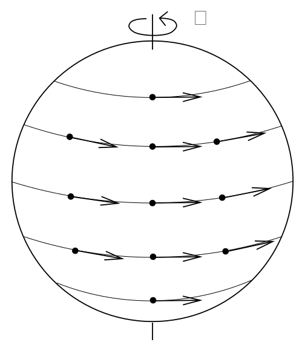
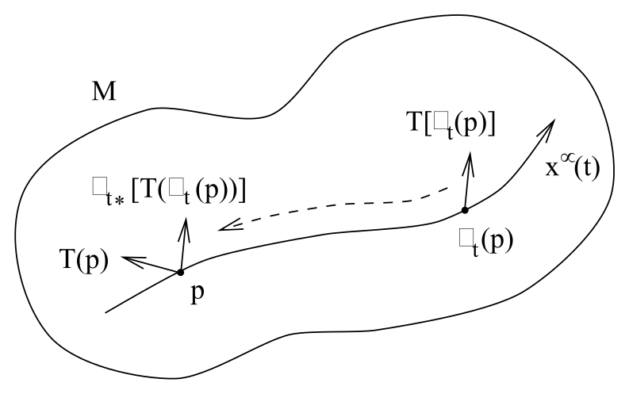

# 积分曲线与李导数

<!-- CARROLL_NAV_TOP -->
> 完整译文 · 原 PDF 第 136–148 页 · [本章入口](../05-diffeomorphisms-and-symmetry.md) · [全书入口](../../carroll-general-relativity.md)
<!-- /CARROLL_NAV_TOP -->

## 单参数微分同胚族

由于微分同胚允许我们拉回和推前任意张量，它也提供了另一种比较流形上不同点处张量的方式。给定微分同胚 $\phi:M\rightarrow M$ 和张量场 $T^{\mu_1 \cdots \mu_k}{}_{\nu_1 \cdots \mu_l}(x)$，我们可以取某点 $p$ 处的张量值，与 $\phi_*[T^{\mu_1 \cdots \mu_k}{}_{\nu_1 \cdots \mu_l}(\phi(p))]$ 之差；后者是在 $\phi(p)$ 处取值、再拉回到 $p$ 的张量。这启发我们，可以在张量场上定义另一种导数算子，用来刻画张量在微分同胚作用下变化时的变化率。不过，单个离散的微分同胚不足以完成这件事；我们需要一个单参数微分同胚族 $\phi_t$。这个族可以看成光滑映射 ${\bf R}\times M\rightarrow M$，其中每个 $t\in{\bf R}$ 对应的 $\phi_t$ 都是微分同胚，并且 $\phi_s\circ\phi_t=\phi_{s+t}$。请注意，最后这个条件意味着 $\phi_0$ 是恒等映射。

单参数微分同胚族可以看作由向量场产生，反过来也一样成立。若考察点 $p$ 在整个族 $\phi_t$ 作用下的变化，显然它会在 $M$ 中描出一条曲线；由于 $M$ 上每一点都有同样的情形，这些曲线会充满流形（不过在微分同胚存在不动点的地方可能发生退化）。我们可以定义向量场 $V^\mu(x)$：在每一点取相应曲线于 $t=0$ 时的切向量。$S^2$ 上的一个例子由微分同胚 $\phi_t(\theta,\phi)=(\theta,\phi+t)$ 给出。

<figure>
  
  <figcaption>图 5.6：$S^2$ 上的微分同胚 $\phi_t(\theta,\phi)=(\theta,\phi+t)$ 沿纬线移动各点；箭头给出了相应积分曲线的切向量，也就是该微分同胚族的生成向量场。</figcaption>
</figure>

## 积分曲线与生成元

我们可以把上述构造反过来，从任意向量场定义一个单参数微分同胚族。给定向量场 $V^\mu(x)$，我们把该向量场的**积分曲线**（integral curves）定义为满足下式的曲线 $x^\mu(t)$：
$$
{{dx^\mu}\over {dt}}=V^\mu\ .
\tag{5.16}
$$
请注意，现在要以与我们通常习惯相反的方向理解这个熟悉的方程——给定的是向量，我们再由它们定义曲线。只要我们不做出什么荒唐的事，例如撞到流形的边缘，(5.16) 的解就一定存在；任何一本标准微分几何教材都会给出证明，其要点是找到一个巧妙的坐标系，把问题化为常微分方程基本定理。我们的微分同胚 $\phi_t$ 表示“沿积分曲线向前流动”，与之相伴的向量场称为该微分同胚的**生成元**（generator）。（积分曲线在初等物理中一直都在使用，只是没有冠以这个名称。把铁屑放在磁体附近时，它们勾勒出的“磁通线”其实就是磁场向量 **B** 的积分曲线。）

## 李导数的定义与性质

于是，给定向量场 $V^\mu(x)$，我们就有了一个由 $t$ 参数化的微分同胚族，并且可以问：沿积分曲线前进时，一个张量变化得有多快。对每个 $t$，我们可以把这一变化定义为
$$
\Delta_t T^{\mu_1 \cdots \mu_k}{}_{\nu_1 \cdots \mu_l}(p)
  = \phi_{t*}[T^{\mu_1 \cdots \mu_k}{}_{\nu_1 \cdots \mu_l}(\phi_t(p))]
  - T^{\mu_1 \cdots \mu_k}{}_{\nu_1 \cdots \mu_l}(p)\ .
\tag{5.17}
$$
请注意，右边两项都是 $p$ 处的张量。

<figure>
  
  <figcaption>图 5.7：点 $p$ 沿流移动到 $\phi_t(p)$；为了比较两点处的张量，需要把 $T[\phi_t(p)]$ 拉回到 $p$，再与 $T(p)$ 作差。</figcaption>
</figure>

随后，我们把张量沿向量场的**李导数**（Lie derivative）定义为
$$
\pounds_VT^{\mu_1 \cdots \mu_k}{}_{\nu_1 \cdots \mu_l} =
  \lim_{t\rightarrow 0}\left({{\Delta_t
  T^{\mu_1 \cdots \mu_k}{}_{\nu_1 \cdots \mu_l}}\over{t}}\right)\ .
\tag{5.18}
$$
李导数把 $(k,l)$ 型张量场映射为 $(k,l)$ 型张量场，而且显然与坐标无关。这个定义在本质上就是把普通导数的惯常定义应用于张量的分量函数，所以它显然是线性的：
$$
\pounds_V(aT+bS) = a\pounds_VT + b\pounds_VS\ ,
\tag{5.19}
$$
并满足 Leibniz 法则：
$$
\pounds_V(T\otimes S) = (\pounds_VT)\otimes S+T\otimes(\pounds_VS)\ ,
\tag{5.20}
$$
其中 $S$ 和 $T$ 是张量，$a$ 和 $b$ 是常数。事实上，李导数是一个比协变导数更原初的概念，因为它不要求预先指定联络（当然，它确实需要一个向量场）。稍加思考便可看出，作用在函数上时，它化为普通导数：
$$
\pounds_Vf = V(f) = V^\mu{\partial}_{\mu }f\ .
\tag{5.21}
$$

## 适配积分曲线的坐标

为了用我们熟悉的其他运算来讨论李导数对张量的作用，选择一个适合当前问题的坐标系会很方便。具体来说，我们使用坐标 $x^\mu$，令 $x^1$ 是沿积分曲线的参数（其余坐标可以任意选择）。于是向量场具有形式 $V=\partial/\partial x^1$；也就是说，它的分量为 $`V^\mu =(1,0,0,
\ldots, 0)`$。这个坐标系的妙处在于，参数为 $t$ 的微分同胚就相当于从 $x^\mu$ 到 $y^\mu=(x^1+t,x^2,\ldots,x^n)$ 的坐标变换。因此，由 (5.6) 可知，拉回矩阵就是
$$
(\phi_{t*})_\mu{}^\nu = \delta^\nu_\mu\ ,
\tag{5.22}
$$
而从 $\phi_t(p)$ 拉回到 $p$ 的张量分量就是
$$
\phi_{t*}[T^{\mu_1 \cdots \mu_k}{}_{\nu_1 \cdots \mu_l}(\phi_t(p))]
  =T^{\mu_1 \cdots \mu_k}{}_{\nu_1 \cdots \mu_l}(x^1+t,x^2,\ldots,x^n)
  \ .
\tag{5.23}
$$
因此，在这个坐标系中，李导数成为
$$
\pounds_VT^{\mu_1 \cdots \mu_k}{}_{\nu_1 \cdots \mu_l} =
  {{\partial}\over{\partial x^1}}
  T^{\mu_1 \cdots \mu_k}{}_{\nu_1 \cdots \mu_l}\ ,
\tag{5.24}
$$
特别地，向量场 $U^\mu(x)$ 的导数为
$$
\pounds_VU^\mu = {{\partial U^\mu}\over{\partial x^1}}\ .
\tag{5.25}
$$

## 向量与一形式的李导数

这个表达式显然不具有显式协变的形式，但我们知道对易子 $[V,U]$ 是定义良好的张量；在这个坐标系中，
$$
\begin{aligned}
[V,U]^\mu &=&  V^\nu{\partial}_{\nu }U^\mu-U^\nu{\partial}_{\nu }V^\mu\cr
  &=& {{\partial U^\mu}\over{\partial x^1}}\ .
\end{aligned}
\tag{5.26}
$$
所以，在这个坐标系中，$U$ 关于 $V$ 的李导数与 $V$ 和 $U$ 的对易子具有相同分量；两者既然都是向量，就必然在任意坐标系中相等：
$$
\pounds_VU^\mu = [V,U]^\mu\ .
\tag{5.27}
$$
作为一个直接推论，我们有 $\pounds_VS=-\pounds_WV$。正因为 (5.27)，对易子有时也称为“李括号”（Lie bracket）。

为了推导 $\pounds_V$ 对一形式 $\omega_\mu$ 的作用，先考虑它对标量 $\omega_\mu U^\mu$ 的作用，其中 $U^\mu$ 是任意向量场。首先利用这样一个事实：关于某个向量场的李导数作用于标量时，会化为该向量本身的作用：
$$
\begin{aligned}
\pounds_V(\omega_\mu U^\mu) &=&  V(\omega_\mu U^\mu)\cr
  &=&  V^\nu{\partial}_{\nu}(\omega_\mu U^\mu)\cr
  &=&  V^\nu({\partial}_{\nu}\omega_\mu)U^\mu + V^\nu\omega_\mu({\partial}_{\nu }U^\mu)\ .
\end{aligned}
\tag{5.28}
$$
接着，对原来的标量使用 Leibniz 法则：
$$
\begin{aligned}
\pounds_V(\omega_\mu U^\mu) &=&  (\pounds_V\omega)_\mu U^\mu
  +\omega_\mu (\pounds_V U)^\mu \cr
  &=&  (\pounds_V\omega)_\mu U^\mu + \omega_\mu V^\nu{\partial}_{\nu }U^\mu
  -\omega_\mu U^\nu{\partial}_{\nu }V^\mu\ .
\end{aligned}
\tag{5.29}
$$
令这两个表达式相等，并要求等式对任意 $U^\mu$ 都成立，我们便得到
$$
\pounds_V \omega_\mu = V^\nu{\partial}_{\nu }\omega_\mu + ({\partial}_{\mu }V^\nu)
  \omega_\nu\ ,
\tag{5.30}
$$
它与对易子的定义一样，是完全协变的，尽管在形式上看不出来。

## 任意张量与度量的李导数

通过类似的步骤，可以定义任意张量场的李导数。答案可以写成
$$
\begin{aligned}
\pounds_V T^{\mu_1 \mu_2 \cdots \mu_k}{}_{\nu_1
  \nu_2 \cdots \nu_l} &=&   V^\sigma\partial_\sigma T^{\mu_1 \mu_2 \cdots
  \mu_k}{}_{\nu_1 \nu_2 \cdots \nu_l} \cr
  && \quad -({\partial}_{\lambda }V^{\mu_1}) T^{\lambda \mu_2 \cdots
  \mu_k}{}_{\nu_1 \nu_2 \cdots \nu_l}
  -({\partial}_{\lambda }V^{\mu_2}) T^{\mu_1 \lambda \cdots
  \mu_k}{}_{\nu_1 \nu_2 \cdots \nu_l} -\cdots\cr
  &&\quad +({\partial}_{\nu_1}V^\lambda)T^{\mu_1 \mu_2 \cdots
  \mu_k}{}_{\lambda \nu_2 \cdots \nu_l}
  +({\partial}_{\nu_2}V^\lambda)T^{\mu_1 \mu_2 \cdots \mu_k}{}_{\nu_1
  \lambda \cdots \nu_l} + \cdots \ .
\end{aligned}
\tag{5.31}
$$
尽管外观看来并非如此，这个表达式仍然是协变的。不过，如果有一个看起来显式张量化的等价表达式，无疑会更令人安心。事实上，可以把它写成
$$
\begin{aligned}
\pounds_V T^{\mu_1 \mu_2 \cdots \mu_k}{}_{\nu_1
  \nu_2 \cdots \nu_l} &=&  V^\sigma\nabla_\sigma T^{\mu_1 \mu_2 \cdots
  \mu_k}{}_{\nu_1 \nu_2 \cdots \nu_l} \cr
  && \quad -(\nabla_\lambda V^{\mu_1}) T^{\lambda \mu_2 \cdots
  \mu_k}{}_{\nu_1 \nu_2 \cdots \nu_l}
  -(\nabla_\lambda V^{\mu_2}) T^{\mu_1 \lambda \cdots
  \mu_k}{}_{\nu_1 \nu_2 \cdots \nu_l} -\cdots\cr
  &&\quad +(\nabla_{\nu_1}V^\lambda)T^{\mu_1 \mu_2 \cdots
  \mu_k}{}_{\lambda \nu_2 \cdots \nu_l}
  +(\nabla_{\nu_2}V^\lambda)T^{\mu_1 \mu_2 \cdots \mu_k}{}_{\nu_1
  \lambda \cdots \nu_l} + \cdots \ ,
\end{aligned}
\tag{5.32}
$$
其中 $\nabla_\mu$ 表示*任意*对称（无挠）的协变导数（当然也包括由度量导出的协变导数）。你可以检查：若展开 (5.32)，所有含联络系数的项都会彼此抵消，最后只剩下 (5.31)。李导数公式的这两种版本在不同场合各有用处。一个格外有用的公式是度量的李导数：
$$
\begin{aligned}
\pounds_V g_{\mu\nu}&=&  V^\sigma\nabla_\sigma g_{\mu\nu}
  +(\nabla_{\mu}V^\lambda)g_{\lambda\nu} +(\nabla_{\nu}V^\lambda)
  g_{\mu\lambda}\cr
  &=& \nabla_\mu V_\nu + \nabla_\nu V_\mu\cr
  &=&  2\nabla_{(\mu} V_{\nu)}\ ,
\end{aligned}
\tag{5.33}
$$
其中 $\nabla_\mu$ 是由 $g_{\mu\nu}$ 导出的协变导数。

<!-- CARROLL_NAV_BOTTOM -->
---
[← 拉回、推前与微分同胚](./01-pullbacks-pushforwards-and-diffeomorphisms.md) · [全书入口](../../carroll-general-relativity.md) · [微分同胚不变性与能量动量守恒 →](./03-diffeomorphism-invariance-and-stress-energy.md)
<!-- /CARROLL_NAV_BOTTOM -->
