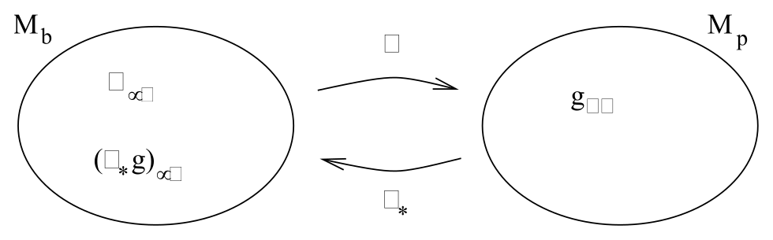
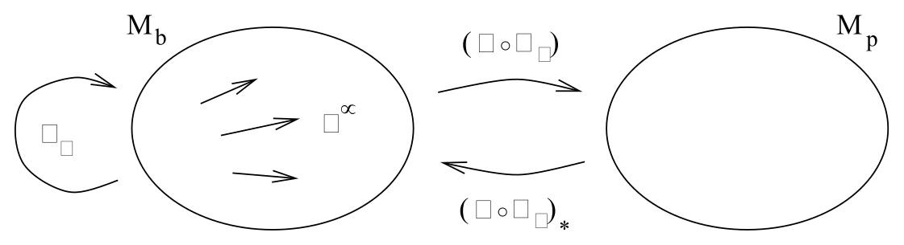

# 弱场与引力辐射

<!-- CARROLL_NAV_TOP -->
> 完整译文 · 原 PDF 第 149–170 页 · [本章入口](../06-weak-fields-and-gravitational-waves.md) · [全书入口](../../carroll-general-relativity.md)
<!-- /CARROLL_NAV_TOP -->

## 线性化引力

我们最初推导爱因斯坦方程时，曾通过考察牛顿极限来检验思路是否正确。那时需要满足这些条件：引力场很弱、引力场是静态的（没有时间导数），并且测试粒子运动缓慢。本节将考察一种限制较少的情形：场仍然很弱，但可以随时间变化，同时不再限制测试粒子的运动。这样一来，我们便能讨论牛顿理论中缺失或含义不明确的现象，例如引力辐射（其中的场随时间变化）以及光的偏折（其中涉及高速运动的粒子）。

引力场的弱小程度仍由这样一种能力来表达：我们可以把度规分解成平直的闵可夫斯基度规加上一个小扰动，
$$
g_{\mu\nu}= \eta_{\mu\nu}+ h_{\mu\nu}\ ,\qquad |h_{\mu\nu}|<<1\ .
\tag{6.1}
$$
我们将只考虑使 $\eta_{\mu\nu}$ 取标准形式 $\eta_{\mu\nu}= {\rm diag}(-1,+1,+1,+1)$ 的坐标。$h_{\mu\nu}$ 很小这一假设使我们能够忽略它的一阶以上高阶项，由此立即得到
$$
g^{\mu\nu}= \eta^{\mu\nu}- h^{\mu\nu}\ ,
\tag{6.2}
$$
其中 $h^{\mu\nu}= \eta^{\mu\rho}\eta^{\nu\sigma}h_{\rho\sigma}$。和以前一样，我们可以用 $\eta^{\mu\nu}$ 与 $\eta_{\mu\nu}$ 升降指标，因为由此产生的修正会是扰动的更高阶项。事实上，我们可以把广义相对论的线性化版本（忽略 $h_{\mu\nu}$ 一阶以上效应的理论）看成一种描述对称张量场 $h_{\mu\nu}$ 在平直背景时空上传播的理论。这个理论在狭义相对论的意义下具有洛伦兹不变性；在洛伦兹变换 $x^{\mu'} = \Lambda^{\mu'}{}_\mu x^\mu$ 下，平直度规 $\eta_{\mu\nu}$ 保持不变，而扰动按照下式变换：
$$
h_{\mu'\nu'}=\Lambda_{\mu'}{}^\mu \Lambda_{\nu'}{}^\nu h_{\mu\nu}\ .
\tag{6.3}
$$
（请注意，我们也可以考虑闵可夫斯基空间以外的其他背景时空上的小扰动。在那种情况下，度规会写成 $g_{\mu\nu}= g_{\mu\nu}^{(0)}+h_{\mu\nu}$，而我们将得到一个对称张量在度规为 $g_{\mu\nu}^{(0)}$ 的弯曲空间上传播的理论。例如，在宇宙学中就必须采用这种方法。）

我们希望找出扰动 $h_{\mu\nu}$ 所满足的运动方程，它来自对爱因斯坦方程的一阶考察。先从克里斯托费尔符号开始，它们为
$$
\begin{aligned}
\Gamma^\rho_{{\mu\nu}}&=& {1\over 2} g^{\rho\lambda}
  ({\partial}_{\mu }g_{\nu\lambda} + {\partial}_{\nu }g_{\lambda\mu} - {\partial}_{\lambda }g_{{\mu\nu}})\cr
  &=& {1\over 2}\eta^{\rho\lambda}({\partial}_{\mu }h_{\nu\lambda}
  + {\partial}_{\nu }h_{\lambda\mu} - {\partial}_{\lambda }h_{{\mu\nu}})\ .
\end{aligned}
\tag{6.4}
$$
由于联络系数是一阶量，对黎曼张量有贡献的只有 $\Gamma$ 的导数，不包括 $\Gamma^2$ 项。为方便起见降下一个指标，便得到
$$
\begin{aligned}
R_{{\mu\nu}\rho\sigma} &=&  \eta_{\mu\lambda}{\partial}_{\rho}
  \Gamma^\lambda_{\nu\sigma} - \eta_{\mu\lambda}{\partial}_{\sigma}
  \Gamma^\lambda_{\nu\rho} \cr
  &=& {1\over 2}({\partial}_{\rho}{\partial}_{\nu }h_{\mu\sigma} +  {\partial}_{\sigma}{\partial}_{\mu }h_{\nu\rho}
  -{\partial}_{\sigma}{\partial}_{\nu }h_{\mu\rho}-{\partial}_{\rho}{\partial}_{\mu }h_{\nu\sigma})\ .
\end{aligned}
\tag{6.5}
$$
将 $\mu$ 与 $\rho$ 缩并便得到里奇张量：
$$
R_{\mu\nu}= {1\over 2}({\partial}_{\sigma}{\partial}_{\nu }h^\sigma{}_\mu
  +{\partial}_{\sigma}{\partial}_{\mu }h^\sigma{}_\nu - {\partial}_{\mu}{\partial}_{\nu }h - \Box h_{\mu\nu})\ ,
\tag{6.6}
$$
从这个表达式可以直接看出它对 $\mu$ 与 $\nu$ 是对称的。这里我们把扰动的迹定义为 $`h=\eta^{\mu\nu}h_{\mu\nu}=
h^\mu{}_\mu`$，而达朗贝尔算符就是平直空间中的算符，$\Box= -{\partial}_{t}^2+{\partial}_{x}^2+{\partial}_{y}^2+{\partial}_{z}^2$。再次缩并得到里奇标量：
$$
R = {\partial}_{\mu}{\partial}_{\nu }h^{\mu\nu}- \Box h\ .
\tag{6.7}
$$
把所有结果合在一起，我们得到爱因斯坦张量：
$$
\begin{aligned}
G_{\mu\nu}&=&  R_{\mu\nu}- {1\over 2}\eta_{\mu\nu}R\cr
  &=& {1\over 2}({\partial}_{\sigma}{\partial}_{\nu }h^\sigma{}_\mu
  +{\partial}_{\sigma}{\partial}_{\mu }h^\sigma{}_\nu - {\partial}_{\mu}{\partial}_{\nu }h - \Box h_{\mu\nu}
  -\eta_{\mu\nu}{\partial}_{\mu}{\partial}_{\nu }h^{\mu\nu}+ \eta_{\mu\nu}\Box h)\ .
\end{aligned}
\tag{6.8}
$$
这与我们对线性化理论的解释相符：它描述平直背景上的一个对称张量。对下面的拉格朗日量关于 $h_{\mu\nu}$ 作变分，也可以导出线性化爱因斯坦张量（6.8）：
$$
{\cal L} = {1\over 2}\left[({\partial}_{\mu }h^{\mu\nu})({\partial}_{\nu }h) -
  ({\partial}_{\mu }h^{\rho\sigma})({\partial}_{\rho }h^\mu{}_\sigma) + {1\over 2}
  \eta^{\mu\nu}({\partial}_{\mu }h^{\rho\sigma})({\partial}_{\nu }h_{\rho\sigma})
  -{1\over 2}\eta^{\mu\nu}({\partial}_{\mu }h)({\partial}_{\nu }h)\right]\ .
\tag{6.9}
$$
具体细节我就饶过你们了。

线性化场方程当然是 $G_{\mu\nu}=8\pi GT_{\mu\nu}$，其中 $G_{\mu\nu}$ 由（6.8）给出，$T_{\mu\nu}$ 是按 $h_{\mu\nu}$ 的零阶计算的能量—动量张量。我们不计入能量—动量张量的高阶修正，因为要使弱场极限适用，能量和动量本身也必须很小。换句话说，$T_{\mu\nu}$ 的最低非零阶会自动与扰动处在同一数量级。请注意，最低阶的守恒定律就是 ${\partial}_{\mu }T^{\mu\nu}=0$。我们最常关注的是真空方程；它们和往常一样就是 $R_{\mu\nu}=0$，其中 $R_{\mu\nu}$ 由（6.6）给出。

## 规范不变性

有了线性化场方程，我们几乎可以着手求解了。不过，我们首先应当处理规范不变性这个棘手问题。之所以会有这个问题，是因为 $g_{\mu\nu}=\eta_{\mu\nu}+h_{\mu\nu}$ 这一要求并没有完全指定时空上的坐标系；还可能存在其他坐标系，在其中度规仍可写成闵可夫斯基度规加一个小扰动，只是扰动会有所不同。因此，把度规分解成平直背景与扰动的方式并不唯一。

我们可以从比较高阶的角度思考这件事。把线性化理论视为支配平直背景上张量场行为的理论，这一观念可以用“背景时空” $M_b$、“物理时空” $M_p$ 以及微分同胚 $\phi:M_b\rightarrow M_p$ 来形式化。作为流形，$M_b$ 与 $M_p$ 是“相同的”（因为二者微分同胚），但我们设想它们拥有一些不同的张量场；我们在 $M_b$ 上定义了平直的闵可夫斯基度规 $\eta_{\mu\nu}$，而 $M_p$ 上则有某个满足爱因斯坦方程的度规 $g_{\alpha\beta}$。（我们设想 $M_b$ 配备坐标 $x^\mu$，$M_p$ 配备坐标 $y^\alpha$，不过这些坐标不会扮演突出的角色。）微分同胚 $\phi$ 使我们可以在背景时空与物理时空之间来回搬运张量。由于我们希望把线性化理论构造为一个发生在平直背景时空上的理论，所以我们感兴趣的是物理度规的拉回 $(\phi_*g)_{\mu\nu}$。可以把扰动定义为拉回后的物理度规与平直度规之差：
$$
h_{\mu\nu}= (\phi_*g)_{\mu\nu}- \eta_{\mu\nu}\ .
\tag{6.10}
$$
仅从这个定义看，没有理由认为 $h_{\mu\nu}$ 的分量很小；不过，如果 $M_p$ 上的引力场很弱，那么对*某些*微分同胚 $\phi$，我们将有 $|h_{\mu\nu}| << 1$。因此，我们只把注意力限制在满足这一条件的微分同胚上。于是，$g_{\alpha\beta}$ 在物理时空上满足爱因斯坦方程这一事实意味着 $h_{\mu\nu}$ 将在背景时空上满足线性化方程（因为 $\phi$ 是微分同胚，也可以用来拉回爱因斯坦方程本身）。

<figure>
  
  <figcaption>图 six1：微分同胚把物理时空的度规拉回背景时空。</figcaption>
</figure>

用这种语言说，规范不变性问题就归结为：$M_b$ 与 $M_p$ 之间存在大量允许的微分同胚（这里“允许”指扰动很小）。考虑背景时空上的一个向量场 $\xi^\mu(x)$。这个向量场生成一族单参数微分同胚 $\psi_\epsilon:M_b\rightarrow M_b$。当 $\epsilon$ 足够小时，如果 $\phi$ 是一个使（6.10）所定义的扰动很小的微分同胚，那么 $(\phi\circ\psi_\epsilon)$ 也会有这一性质，尽管扰动将取不同的值。

<figure>
  
  <figcaption>图 six2：在背景时空上先作用微分同胚，再映到物理时空。</figcaption>
</figure>

具体来说，我们可以定义一族以 $\epsilon$ 为参数的扰动：
$$
\begin{aligned}
h_{\mu\nu}^{(\epsilon)} &=&  [(\phi\circ\psi_\epsilon)_*g]_{\mu\nu}
  - \eta_{\mu\nu}\cr
  &=& [\psi_{\epsilon *}(\phi_*g)]_{\mu\nu}- \eta_{\mu\nu}\ .
\end{aligned}
\tag{6.11}
$$
第二个等号所依据的事实是：复合映射下的拉回等于按相反次序复合各个拉回；这是因为拉回本身搬运对象的方向与原映射相反。代入关系（6.10），得到
$$
\begin{aligned}
h_{\mu\nu}^{(\epsilon)} &=&  \psi_{\epsilon *}(h +\eta)_{\mu\nu}
  -\eta_{\mu\nu}\cr
  &=&  \psi_{\epsilon *}(h_{\mu\nu}) +\psi_{\epsilon *}(\eta_{\mu\nu})-\eta_{\mu\nu}
\end{aligned}
\tag{6.12}
$$
（因为两个张量之和的拉回等于二者拉回之和）。现在使用 $\epsilon$ 很小这一假设；在这种情况下，$\psi_{\epsilon *}(h_{\mu\nu})$ 在最低阶将等于 $h_{\mu\nu}$，另外两项则给出一个李导数：
$$
\begin{aligned}
h_{\mu\nu}^{(\epsilon)} &=&  \psi_{\epsilon *}(h_{\mu\nu})
  +\epsilon\left[{{\psi_{\epsilon *}(\eta_{\mu\nu})-\eta_{\mu\nu}}\over
  \epsilon}\right] \cr
  &=& h_{\mu\nu}+ \epsilon \pounds_\xi\eta_{\mu\nu}\cr
  &=& h_{\mu\nu}+ 2\epsilon\partial_{(\mu}\xi_{\nu)}\ .
\end{aligned}
\tag{6.13}
$$
最后一个等号来自我们先前对度规李导数的计算（5.33），再加上协变导数在最低阶就是偏导数这一事实。

无穷小微分同胚 $\phi_\epsilon$ 在维持扰动很小这一要求的同时，为同一个物理情形提供了不同表示。因此，结果（6.12）告诉我们，什么样的度规扰动表示物理上等价的时空：它们彼此相差 $2\epsilon\partial_{(\mu}\xi_{\nu)}$，其中 $\xi^\mu$ 是某个向量。我们的理论在这种变换下的不变性，类似于传统电磁学在 $A_\mu \rightarrow A_\mu + {\partial}_{\mu}\lambda$ 下的规范不变性。（这个类比不同于我们先前与电磁学所作的类比；先前我们把正交标架形式中的局域洛伦兹变换和内部向量丛中的基变换联系起来。）在电磁学中，不变性源于场强 $F_{\mu\nu}= {\partial}_{\mu }A_\nu - {\partial}_{\nu }A_\mu$ 在规范变换下保持不变；类似地，我们发现变换（6.13）引起的线性化黎曼张量变化为
$$
\begin{aligned}
\delta R_{{\mu\nu}\rho\sigma} &=&
  {1\over 2}({\partial}_{\rho}{\partial}_{\nu}{\partial}_{\mu}\xi_\sigma +{\partial}_{\rho}{\partial}_{\nu}{\partial}_{\sigma}\xi_\mu
  + {\partial}_{\sigma}{\partial}_{\mu}{\partial}_{\nu}\xi_\rho + {\partial}_{\sigma}{\partial}_{\mu}{\partial}_{\rho}\xi_\nu \cr
  & & \qquad - {\partial}_{\sigma}{\partial}_{\nu}{\partial}_{\mu}\xi_\rho - {\partial}_{\sigma}{\partial}_{\nu}{\partial}_{\rho}\xi_\mu
  - {\partial}_{\rho}{\partial}_{\mu}{\partial}_{\nu}\xi_\sigma - {\partial}_{\rho}{\partial}_{\mu}{\partial}_{\sigma}\xi_\nu )\cr
  & =& 0\ .
\end{aligned}
\tag{6.14}
$$
我们从抽象角度导出的度规扰动规范变换，因其确实保持曲率（从而也保持物理时空）不变而得到了验证。

也可以通过稍微朴素一些、却直接得多的无穷小坐标变换来理解规范不变性。微分同胚 $\psi_\epsilon$ 可以看作把坐标从 $x^\mu$ 变为 $x^\mu -\epsilon\xi^\mu$。（这里不合惯例的负号来自这样一个事实：“新”度规是沿积分曲线向前一小段距离拉回的，这等价于用沿曲线向后一小段距离处的坐标替换原坐标。）依照坐标变换下张量变换的通常规则逐步计算，你可以精确导出（6.13）——不过你得稍微“作弊”，把两个不同坐标系里的张量分量等同起来。例子可参见 Schutz 或 Weinberg。

## 调和规范与场方程

面对一个在某类规范变换下保持不变的系统，我们的第一反应通常是固定规范。我们已经讨论过调和坐标系，现在回到弱场极限的语境中考察它。回想一下，这一规范由 $\Box x^\mu=0$ 指定，而且我们曾证明它等价于
$$
g^{\mu\nu}\Gamma^\rho_{\mu\nu}=0\ .
\tag{6.15}
$$
在弱场极限中，它变成
$$
{1\over 2}\eta^{\mu\nu}\eta^{\lambda\rho}({\partial}_{\mu }h_{\nu\lambda}
  +{\partial}_{\nu }h_{\lambda\mu} -{\partial}_{\lambda }h_{\mu\nu})=0\ ,
\tag{6.16}
$$
即
$$
{\partial}_{\mu }h^\mu{}_\lambda - {1\over 2}{\partial}_{\lambda }h = 0\ .
\tag{6.17}
$$
这个条件也称为洛伦兹规范（Lorentz gauge；还叫 Einstein gauge、Hilbert gauge、de Donder gauge 或 Fock gauge）。和以前一样，我们仍然保留了一些规范自由度，因为还可以通过（无穷小）调和函数改变坐标。

在这个规范中，线性化爱因斯坦方程 $G_{\mu\nu}= 8\pi GT_{\mu\nu}$ 略微简化为
$$
\Box h_{\mu\nu}- {1\over 2}\eta_{\mu\nu}\Box h=-16\pi GT_{\mu\nu}\ ,
\tag{6.18}
$$
而真空方程 $R_{\mu\nu}=0$ 则取成简洁的形式
$$
\Box h_{\mu\nu}=0\ ,
\tag{6.19}
$$
这就是通常的相对论性波动方程。（6.19）与（6.17）共同决定了调和规范下真空中引力场扰动的演化。

采用一种略有不同的度规扰动描述往往很方便。我们把“迹反转”扰动 $\bar h_{\mu\nu}$ 定义为
$$
\bar h_{\mu\nu}= h_{\mu\nu}- {1\over 2}\eta_{\mu\nu}h\ .
\tag{6.20}
$$
这个名称很贴切，因为 $\bar h^\mu{}_\mu=-h^\mu{}_\mu$。（爱因斯坦张量恰好就是迹反转后的里奇张量。）用 $\bar h_{\mu\nu}$ 表示时，调和规范条件变为
$$
{\partial}_{\mu }\bar h^\mu{}_\lambda =0\ .
\tag{6.21}
$$
完整的场方程为
$$
\Box\bar h_{\mu\nu}= -16\pi G T_{\mu\nu}\ ,
\tag{6.22}
$$
由此立即可知，真空方程是
$$
\Box\bar h_{\mu\nu}= 0\ .
\tag{6.23}
$$

## 静态球对称源的弱场度规

根据（6.22）以及我们先前对牛顿极限的探究，很容易导出行星或恒星这类静态球对称源的弱场度规。回想一下，我们先前发现，爱因斯坦方程预言在弱场极限中 $h_{00}$ 满足泊松方程（4.51），这意味着
$$
h_{00} = -2\Phi\ ,
\tag{6.24}
$$
其中 $\Phi$ 是通常的牛顿势，$\Phi=-GM/r$。现在假设源的能量—动量张量由其静止能量密度 $\rho=T_{00}$ 主导。（在一般的弱场极限中不必作出这一假设，但对于我们眼下想要考察的行星或恒星，它当然成立。）于是 $T_{\mu\nu}$ 的其他分量远小于 $T_{00}$；根据（6.22），$\bar h_{\mu\nu}$ 的其他分量也必定具有同样的情况。如果 $\bar h_{00}$ 远大于 $\bar h_{ij}$，就有
$$
h = -\bar h=-\eta^{\mu\nu}\bar h_{\mu\nu}= \bar h_{00}\ ,
\tag{6.25}
$$
然后由（6.20）立即得到
$$
\bar h_{00} = 2 h_{00} =-4\Phi\ .
\tag{6.26}
$$
$\bar h_{{\mu\nu}}$ 的其他分量可以忽略，由此可以导出
$$
h_{i0} = \bar h_{i0} - {1\over 2}\eta_{i0}\bar h = 0\ ,
\tag{6.27}
$$
以及
$$
h_{ij}= \bar h_{ij} - {1\over 2}\eta_{ij}\bar h = -2\Phi\delta_{ij}\ .
\tag{6.28}
$$
因此，弱场极限中恒星或行星的度规为
$$
ds^2 = -(1+2\Phi){\rm d}t^2 +(1-2\Phi)({\rm d}x^2 +{\rm d}y^2 +{\rm d}z^2)\ .
\tag{6.29}
$$

<!-- CARROLL_NAV_BOTTOM -->
---
[← 等距映射与 Killing 向量](../05-diffeomorphisms-and-symmetry/04-isometries-and-killing-vectors.md) · [全书入口](../../carroll-general-relativity.md) · [平面波、横向无迹规范与偏振 →](./02-plane-waves-tt-gauge-and-polarization.md)
<!-- /CARROLL_NAV_BOTTOM -->
