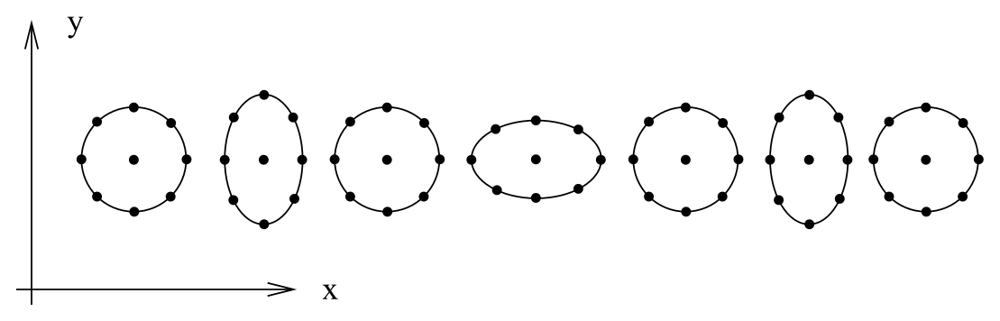
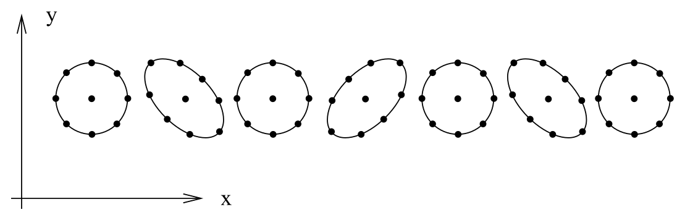
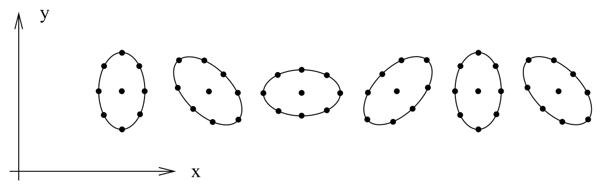

# 平面波、横向无迹规范与偏振

<!-- CARROLL_NAV_TOP -->
> 完整译文 · 原 PDF 第 149–170 页 · [本章入口](../06-weak-fields-and-gravitational-waves.md) · [全书入口](../../carroll-general-relativity.md)
<!-- /CARROLL_NAV_TOP -->

## 真空中的平面波解

弱场极限一个稍微没那么简单的应用是引力辐射。熟悉电磁学中对应问题的读者会注意到，这里的处理过程几乎完全相同。我们从真空中的线性化方程（6.23）开始。由于平直空间的达朗贝尔算符具有 $\Box= -{\partial}_{t}^2 +\nabla^2$ 的形式，场方程就是关于 ${\bar h}_{\mu\nu}$ 的波动方程。每一位称职的物理学家都知道，面对这种方程时应当先写出复值解，最后再取实部。因此我们看出，这个波动方程有一组特别有用的解，也就是平面波：
$$
{\bar h}_{\mu\nu}= C_{\mu\nu}e^{ik_\sigma x^\sigma}\ ,
\tag{6.30}
$$
其中 $C_{\mu\nu}$ 是一个常量、对称的 $(0,2)$ 张量，而 $k^\sigma$ 是一个称为**波矢**（wave vector）的常向量。为检验它确实是解，把它代入：
$$
\begin{aligned}
0&=& \Box{\bar h}_{\mu\nu}\cr &=& \eta^{\rho\sigma}{\partial}_{\rho}{\partial}_{\sigma}
  {\bar h}_{\mu\nu}\cr &=&  \eta^{\rho\sigma}{\partial}_{\rho }(i k_\sigma{\bar h}_{\mu\nu})\cr
  &=&  - \eta^{\rho\sigma}k_\rho k_\sigma{\bar h}_{\mu\nu}\cr
  &=&  -k_\sigma k^\sigma {\bar h}_{\mu\nu}\ .
\end{aligned}
\tag{6.31}
$$
由于对一个有意义的解来说，$h_{\mu\nu}$ 的分量不可能处处全为零，所以必有
$$
k_\sigma k^\sigma=0\ .
\tag{6.32}
$$
因此，当波矢是零向量时，平面波（6.30）就是线性化方程的解；粗略地说，这意味着引力波以光速传播。波矢的类时分量通常称为波的**频率**，我们写成 $`k^\sigma = (\omega,
k^1,k^2,k^3)`$。（更一般地说，以四速度 $U^\mu$ 运动的观察者会观测到波的频率为 $\omega=-k_\mu U^\mu$。）于是，波矢为零向量这一条件变为
$$
\omega^2 = \delta_{ij}k^i k^j\ .
\tag{6.33}
$$
当然，我们的这个波远非最一般的解；任意数量（可能是无穷多个）的不同平面波都可以叠加起来，而结果仍将满足线性方程（6.23）。事实上，任何解都可以写成这样的叠加。

## 调和规范与剩余规范自由度

要指定这个波，需要给定若干自由参数：系数 $C_{\mu\nu}$ 的十个数，以及零向量 $k^\sigma$ 的三个数。其中很大一部分源于坐标自由度与规范自由度，现在我们着手消除它们。首先施加调和规范条件（6.21）。这意味着
$$
\begin{aligned}
0 &=&  {\partial}_{\mu}{\bar h}^{\mu\nu}\cr &=&  {\partial}_{\mu}(C^{\mu\nu}e^{ik_\sigma x^\sigma})\cr
  &=& iC^{\mu\nu}k_\mu e^{ik_\sigma x^\sigma}\ ,
\end{aligned}
\tag{6.34}
$$
它成立的条件只能是
$$
k_\mu C^{\mu\nu}=0\ .
\tag{6.35}
$$
我们说波矢与 $C^{\mu\nu}$ 正交。这是四个方程，把 $C_{\mu\nu}$ 的独立分量数从十个减为六个。

尽管我们现在已经施加了调和规范条件，仍然剩下一些坐标自由度。回想一下，任何形如
$$
x^\mu \rightarrow x^\mu + \zeta^\mu
\tag{6.36}
$$
的坐标变换，都会使调和坐标条件
$$
\Box x^\mu=0
\tag{6.37}
$$
继续成立，只要我们满足
$$
\Box\zeta^\mu=0\ .
\tag{6.38}
$$
当然，（6.38）本身就是关于 $\zeta^\mu$ 的波动方程；一旦选定一个解，我们便会用尽全部规范自由度。让我们选择下面这个解：
$$
\zeta_\mu = B_\mu e^{ik_\sigma x^\sigma}\ ,
\tag{6.39}
$$
其中 $k_\sigma$ 是引力波的波矢，$B_\mu$ 是常系数。

现在我们声称，这项剩余自由度使我们能够把表征引力波的任意系数 $C^{\rm (old)}_{\mu\nu}$ 转换为一组新的 $C^{\rm (new)}_{\mu\nu}$，使其满足
$$
C^{{\rm (new)}\mu}{}_\mu = 0
\tag{6.40}
$$
和
$$
C^{\rm (new)}_{0\nu}=0\ .
\tag{6.41}
$$
（严格说来，最后这个条件既包含规范的选择，也包含洛伦兹参考系的选择。规范选择设定 $`U^\mu
C^{\rm (new)}_{\mu\nu}=0`$，其中 $U^\mu$ 是某个常类时向量；参考系的选择则使 $U^\mu$ 指向时间轴方向。）下面通过显式求解所需的系数 $B_\mu$ 来看看为何可以做到这一点。在变换（6.36）下，度规扰动的相应变化可写为
$$
h^{\rm (new)}_{\mu\nu}= h^{\rm (old)}_{\mu\nu}-{\partial}_{\mu }\zeta_\nu
  -{\partial}_{\nu }\zeta_\mu\ ,
\tag{6.42}
$$
它会引起迹反转扰动的变化：
$$
\begin{aligned}
{\bar h}^{\rm (new)}_{\mu\nu}&=&  h^{\rm (new)}_{\mu\nu}-{1\over 2}
  \eta_{\mu\nu}h^{\rm (new)}\cr & =& h^{\rm (old)}_{\mu\nu}-{\partial}_{\mu }\zeta_\nu
  -{\partial}_{\nu }\zeta_\mu -{1\over 2}\eta_{\mu\nu}(h^{\rm (old)}
  -2{\partial}_{\lambda }\zeta^\lambda)\cr
  &=& {\bar h}^{\rm (old)}_{\mu\nu}-{\partial}_{\mu }\zeta_\nu -{\partial}_{\nu }\zeta_\mu
  +\eta_{\mu\nu}{\partial}_{\lambda }\zeta^\lambda\ .
\end{aligned}
\tag{6.43}
$$
对解使用具体形式（6.30），对变换使用具体形式（6.39），便得到
$$
C^{\rm (new)}_{\mu\nu}=C^{\rm (old)}_{\mu\nu}- ik_\mu B_\nu -i k_\nu B_\mu
  +i\eta_{\mu\nu}k_\lambda B^\lambda\ .
\tag{6.44}
$$
因此，施加（6.40）意味着
$$
0= C^{{\rm (old)}\mu}{}_\mu +2ik_\lambda B^\lambda\ ,
\tag{6.45}
$$
即
$$
k_\lambda B^\lambda = {{i}\over 2}C^{{\rm (old)}\mu}{}_\mu\ .
\tag{6.46}
$$
接下来施加（6.41），先取 $\nu=0$：
$$
\begin{aligned}
0 &=&  C^{\rm (old)}_{00}-2ik_0B_0-ik_\lambda B^\lambda\cr
  &=& C^{\rm (old)}_{00}-2ik_0B_0 +{1\over 2}C^{{\rm (old)}\mu}{}_\mu
  \ ,
\end{aligned}
\tag{6.47}
$$
所以
$$
B_0=-{{i}\over {2k_0}}\left(C^{\rm (old)}_{00}+{1\over 2}
  C^{{\rm (old)}\mu}{}_\mu\right)\ .
\tag{6.48}
$$
然后对 $\nu=j$ 施加（6.41）：
$$
\begin{aligned}
0 &=&  C^{\rm (old)}_{0j}-ik_0 B_j -ik_jB_0\cr
  &=&  C^{\rm (old)}_{0j}-ik_0B_j -ik_j\left[
  {{-i}\over {2k_0}}\left(C^{\rm (old)}_{00}+{1\over 2}
  C^{{\rm (old)}\mu}{}_\mu\right)\right]\ ,
\end{aligned}
\tag{6.49}
$$
所以
$$
B_j={{i}\over{2(k_0)^2}}\left[-2k_0C^{\rm (old)}_{0j}
  +k_j\left(C^{\rm (old)}_{00}+{1\over 2}
  C^{{\rm (old)}\mu}{}_\mu\right)\right]\ .
\tag{6.50}
$$
为了检查这些选择彼此相容，我们应当把（6.48）与（6.50）代回（6.40）；我把这件事留给你们。下面假设我们已经完成了这一变换，并把新分量 $C_{\mu\nu}^{\rm (new)}$ 简称为 $C_{\mu\nu}$。

## 横向无迹规范

我们从对称矩阵 $C_{\mu\nu}$ 中的十个独立数字出发。选择调和规范给出了四个条件（6.35），使独立分量的数目降到六个。利用剩余规范自由度又给出一个条件（6.40）和四个条件（6.41）；但当 $\nu=0$ 时，（6.41）蕴含（6.35），所以额外的独立约束一共有四个，最终只剩两个独立分量。我们已经用尽所有可用的自由度，因此这两个数就是在此规范中表征平面波的物理信息。选择空间坐标，使波沿 $x^3$ 方向传播，可以更明确地看出这一点；也就是说，
$$
k^\mu = (\omega,0,0,k^3) = (\omega,0,0,\omega)\ ,
\tag{6.51}
$$
由于波矢为零向量，我们知道 $k^3=\omega$。在这种情况下，$k^\mu C_{\mu\nu}=0$ 与 $C_{0\nu}=0$ 共同意味着
$$
C_{3\nu}=0\ .
\tag{6.52}
$$
因此，$C_{\mu\nu}$ 唯一可能非零的分量是 $C_{11}$、$C_{12}$、$C_{21}$ 和 $C_{22}$。然而 $C_{\mu\nu}$ 无迹且对称，所以一般可以写成
$$
C_{\mu\nu}= \left(\matrix{0&0&0&0\cr 0&C_{11}&C_{12}&0\cr
  0&C_{12}&-C_{11}&0\cr 0&0&0&0\cr}\right)\ .
\tag{6.53}
$$
因此，对于在此规范中沿 $x^3$ 方向传播的平面波，两个分量 $C_{11}$ 与 $C_{12}$（连同频率 $\omega$）完全刻画了这个波。

在用尽全部规范自由度的过程中，我们进入了调和规范的一个子规范，称为**横向无迹规范**（transverse traceless gauge，有时也称“辐射规范”）。这个名称来自度规扰动无迹并且垂直于波矢这一事实。当然，我们一直使用迹反转扰动 ${\bar h}_{\mu\nu}$，而没有直接使用扰动 $h_{\mu\nu}$；但由于 ${\bar h}_{\mu\nu}$ 无迹（因为 $C_{\mu\nu}$ 无迹），并且它等于 $h_{\mu\nu}$ 的迹反转，所以在这个规范中有
$$
{\bar h}_{\mu\nu}^{\rm TT} = h_{\mu\nu}^{\rm TT}\qquad
  {\rm (transverse~traceless~gauge)}\ .
\tag{6.54}
$$
因此，只要处在这一规范中，就可以去掉 $h_{\mu\nu}$ 上方的横线。

横向无迹规范有一个很好的性质：如果已经知道某个任意规范下平面波的分量，就能很容易地把它们转换成横向无迹分量。首先定义一个充当投影算符的张量 $P_{\mu\nu}$：
$$
P_{\mu\nu}= \eta_{\mu\nu}- n_\mu n_\nu\ .
\tag{6.55}
$$
你可以验证，它会把向量投影到与单位向量 $n_\mu$ 正交的超平面上。这里我们取 $n_\mu$ 为一个*类空*单位向量，并选择它沿波的传播方向：
$$
n_0=0\ ,\qquad n_j = k_j/\omega\ .
\tag{6.56}
$$
于是，某个扰动 $h_{\mu\nu}$ 的横向部分就是投影 $P_\mu{}^\rho P_\nu{}^\sigma h_{\rho\sigma}$；再减去其迹，就得到横向无迹部分：
$$
h^{\rm TT}_{\mu\nu}= P_\mu{}^\rho P_\nu{}^\sigma h_{\rho\sigma}
  -{1\over 2}P_{\mu\nu}P^{\rho\sigma} h_{\rho\sigma}\ .
\tag{6.57}
$$
适用于更一般情形的细节，可参见 Misner、Thorne 和 Wheeler 的讨论。

## 测试粒子的相对运动

为了获得对引力波物理效应的直观认识，考察测试粒子在波存在时的运动很有帮助。只求一个粒子的轨迹当然远远不够，因为那只能告诉我们沿这条世界线的坐标值。（事实上，对任意单个粒子，我们都能找到一组横向无迹坐标，使该粒子在 $h_{\mu\nu}$ 的一阶近似下看起来静止。）为了得到与坐标无关的波效应度量，我们考察相邻粒子的相对运动，它由测地线偏离方程描述。若考虑一些相邻粒子，用单个向量场 $U^\mu(x)$ 描述它们的四速度，并以 $S^\mu$ 表示分离向量，则有
$$
{{D^2}\over{d\tau^2}}S^\mu = R^\mu{}_{\nu\rho\sigma}
  U^\nu U^\rho S^\sigma\ .
\tag{6.58}
$$
我们想把左边计算到 $h_{\mu\nu}$ 的一阶。如果取测试粒子缓慢运动，就可以把四速度表示成时间方向的单位向量，加上 $h_{\mu\nu}$ 一阶及更高阶的修正；但黎曼张量本身已经是一阶量，所以可以忽略 $U^\nu$ 的修正，写成
$$
U^\nu = (1,0,0,0)\ .
\tag{6.59}
$$
因此，我们只需计算 $R^\mu{}_{00\sigma}$，等价地也可以计算 $R_{\mu 00\sigma}$。由（6.5）得
$$
R_{\mu 00\sigma}={1\over 2}({\partial}_{0}{\partial}_{0} h_{\mu\sigma} + {\partial}_{\sigma}
  {\partial}_{\mu }h_{00} - {\partial}_{\sigma}{\partial}_{0} h_{\mu 0} - {\partial}_{\mu}{\partial}_{0} h_{\sigma 0})
  \ .
\tag{6.60}
$$
但 $h_{\mu 0}=0$，所以
$$
R_{\mu 00\sigma}={1\over 2}{\partial}_{0}{\partial}_{0} h_{\mu\sigma}\ .
\tag{6.61}
$$
与此同时，对这些缓慢运动的粒子，最低阶有 $\tau=x^0=t$，因此测地线偏离方程变为
$$
{{\partial^2}\over{\partial t^2}}S^\mu = {1\over 2}S^\sigma
  {{\partial^2}\over{\partial t^2}} h^\mu{}_\sigma\ .
\tag{6.62}
$$
对于沿 $x^3$ 方向传播的波，这意味着只有 $S^1$ 与 $S^2$ 会受影响——测试粒子只会在垂直于波矢的方向上受到扰动。这当然和电磁学中的情形很相似：平面波的电场与磁场都垂直于波矢。

## 线偏振与圆偏振

我们的波由两个数刻画。为了后文方便，把它们重新命名为 $C_+ = C_{11}$ 和 $`C_\times =
C_{12}`$。先分别考察它们的效应，从 $C_\times=0$ 的情形开始。此时有
$$
{{\partial^2}\over{\partial t^2}}S^1 = {1\over 2} S^1
  {{\partial^2}\over{\partial t^2}}
  (C_+ e^{ik_\sigma x^\sigma})
\tag{6.63}
$$
以及
$$
{{\partial^2}\over{\partial t^2}}S^2 = -{1\over 2} S^2
  {{\partial^2}\over{\partial t^2}}
  (C_+ e^{ik_\sigma x^\sigma})\ .
\tag{6.64}
$$
可以立即解出，在最低阶有
$$
S^1 = \left(1+{1\over 2}C_+ e^{ik_\sigma x^\sigma}
  \right)S^1(0)
\tag{6.65}
$$
以及
$$
S^2 = \left(1-{1\over 2}C_+ e^{ik_\sigma x^\sigma}
  \right)S^2(0)\ .
\tag{6.66}
$$
因此，起初在 $x^1$ 方向上彼此分离的粒子会沿 $x^1$ 方向来回振荡；起初沿 $x^2$ 方向分离的粒子也一样。也就是说，若一开始有一圈静止粒子位于 $x$-$y$ 平面内，当波通过时，它们会以“$+$”形来回变形：

<figure>
  
  <figcaption>图 six3：加号偏振使粒子环沿两条正交轴交替伸缩。</figcaption>
</figure>

另一方面，对 $C_+=0$ 而 $C_\times\neq 0$ 的情形作同样分析，会得到解
$$
S^1 = S^1(0)+{1\over 2}C_\times e^{ik_\sigma x^\sigma}
  S^2(0)
\tag{6.67}
$$
以及
$$
S^2 = S^2(0)+{1\over 2}C_\times e^{ik_\sigma x^\sigma}
  S^1(0)\ .
\tag{6.68}
$$
在这种情况下，粒子圆环会以“$\times$”形来回变形：

<figure>
  
  <figcaption>图 six4：叉号偏振沿相对坐标轴旋转四十五度的方向伸缩粒子环。</figcaption>
</figure>

因此，$C_+$ 与 $C_\times$ 这两个记号的含义应该很清楚。它们度量引力波的两种独立线偏振模式。如果愿意，还可以定义
$$
\begin{aligned}
C_R &=&  {1\over {\sqrt2}}(C_+ +i C_\times)\ ,\cr
  C_L &=&  {1\over {\sqrt2}}(C_+ -i C_\times)\ .
\end{aligned}
\tag{6.69}
$$
以考察右旋与左旋圆偏振模式。纯 $C_R$ 波会使粒子作右旋转动，

<figure>
  
  <figcaption>图 six5：右旋圆偏振模式使粒子分布按右手方向旋转形变。</figcaption>
</figure>

左旋模式 $C_L$ 的情形与之类似。（请注意，各个粒子并不会绕着圆环行进；它们只是在一个个小周转圆上运动。）

## 从偏振到自旋二引力子

我们可以把经典引力波的偏振态与量子化后预期出现的粒子种类联系起来。电磁场有两种独立的偏振态，它们由 $x$-$y$ 平面内的向量描述；等价地说，单个偏振模式在这个平面内旋转 $360^\circ$ 后保持不变。这个理论量子化后产生光子，即无质量的自旋一粒子。另一方面，中微子也是无质量粒子；描述它的场在旋转 $360^\circ$ 后会多出一个负号，到旋转 $720^\circ$ 时才保持不变，因此我们说它具有自旋 ${1\over 2}$。一般规则是，自旋 $S$ 与使偏振模式保持不变的转角 $\theta$ 之间满足 $S=360^\circ/\theta$。引力场的波以光速传播，因此应当在量子理论中产生无质量粒子。注意到我们描述的偏振模式在旋转 $180^\circ$ 后保持不变（这里的旋转发生在 $x$-$y$ 平面内），我们便预期相应的粒子——“引力子”——具有自旋 2。我们距离探测到这类粒子还十分遥远（即便永远无法直接探测到它们也不令人意外），但任何像样的量子引力理论都应当预言它们的存在。

<!-- CARROLL_NAV_BOTTOM -->
---
[← 弱场与引力辐射](./01-weak-field-limit-and-gauge.md) · [全书入口](../../carroll-general-relativity.md) · [引力辐射源与四极矩公式 →](./03-radiation-from-sources-and-quadrupole-formula.md)
<!-- /CARROLL_NAV_BOTTOM -->
