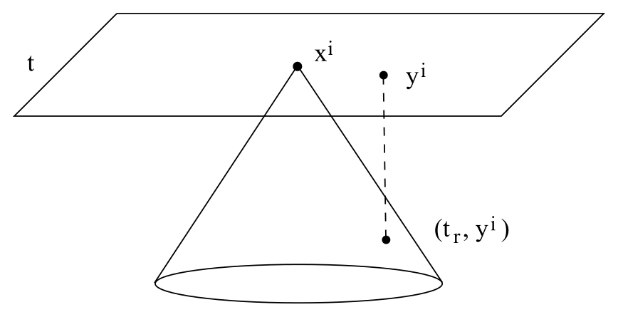
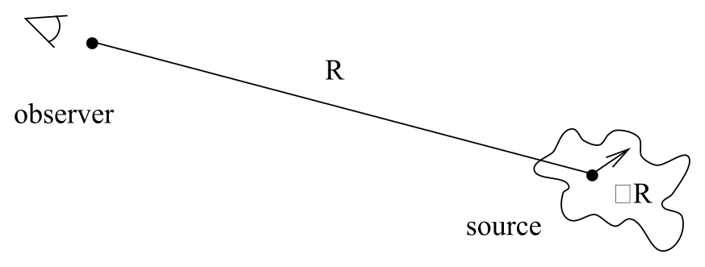
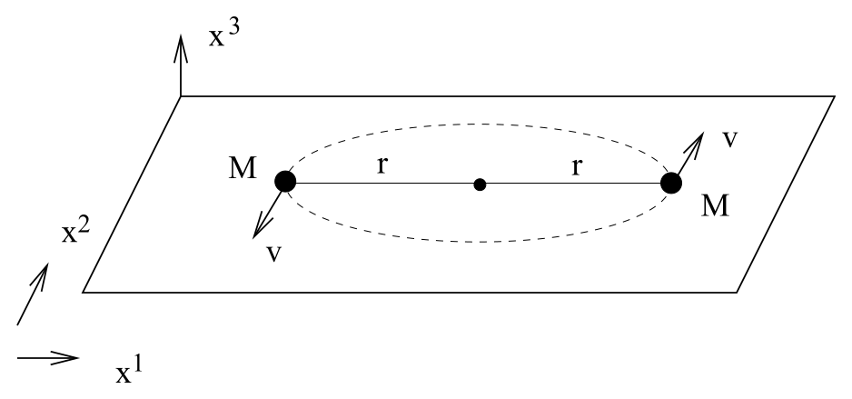

# 引力辐射源与四极矩公式

<!-- CARROLL_NAV_TOP -->
> 完整译文 · 原 PDF 第 149–170 页 · [本章入口](../06-weak-fields-and-gravitational-waves.md) · [全书入口](../../carroll-general-relativity.md)
<!-- /CARROLL_NAV_TOP -->

## 推迟格林函数

既然已经得到了线性化真空方程的平面波解，接下来还要讨论引力辐射怎样由源产生。为此必须考察与物质耦合的方程：
$$
\Box{\bar h}_{\mu\nu}= -16\pi G T_{\mu\nu}\ .
\tag{6.70}
$$
这类方程可以用格林函数求解，方法与电磁学中的对应问题完全相同。这里将回顾这一方法的梗概。

格林函数 $G(x^\sigma - y^\sigma)$ 对应于达朗贝尔算符 $\Box$，它是在存在德尔塔函数源时波动方程的解：
$$
{\Box}_x G(x^\sigma - y^\sigma) = \delta^{(4)}(x^\sigma - y^\sigma)
  \ ,
\tag{6.71}
$$
其中 ${\Box}_x$ 表示对坐标 $x^\sigma$ 作用的达朗贝尔算符。这种函数的用处在于，像（6.70）这样的方程，其一般解可以写成
$$
{\bar h}_{\mu\nu}(x^\sigma) = -16\pi G \int G(x^\sigma - y^\sigma)T_{\mu\nu}(y^\sigma)
  ~d^4y\ ,
\tag{6.72}
$$
这一点可以立即验证。（请注意，这里不需要任何 ${\sqrt{-g}}$ 因子，因为我们的背景就是平直时空。）（6.71）的解当然早已求出；根据它们表示的是沿时间向前传播还是向后传播的波，可以把它们看成“推迟”解或“超前”解。我们关心推迟格林函数，它表示考察点过去的信号所积累起来的效应。它由下式给出：
$$
G(x^\sigma - y^\sigma) = -{{1}\over{4\pi |{\bf x}-{\bf y}|}}\delta
  [|{\bf x}-{\bf y}| - (x^0-y^0)] ~\theta(x^0-y^0)\ .
\tag{6.73}
$$
这里用粗体表示空间向量 ${\bf x}= (x^1,x^2,x^3)$ 和 ${\bf y}=(y^1,y^2,y^3)$，其距离的范数为 $|{\bf x}-{\bf y}|=[\delta_{ij}(x^i-y^i)(x^j-y^j)]^{1/2}$。阶跃函数 $\theta(x^0-y^0)$ 等于 $1$（当 $x^0> y^0$ 时），其余情况下等于零。（6.73）的推导会让我们离题太远，但任何一本标准的电动力学教材或物理学偏微分方程教材中都能找到它。

把（6.73）代入（6.72）后，可以利用德尔塔函数完成对 $y^0$ 的积分，剩下
$$
{\bar h}_{\mu\nu}(t,{\bf x}) =4G\int {{1}\over {|{\bf x}-{\bf y}|}}T_{\mu\nu}(t-|{\bf x}-{\bf y}|,{\bf y})
  ~d^3y\ ,
\tag{6.74}
$$
其中 $t=x^0$。“推迟时间”指的是
$$
t_r = t-|{\bf x}-{\bf y}|\ .
\tag{6.75}
$$
（6.74）的含义应该很清楚：$(t,{\bf x})$ 处的引力场扰动，是过去光锥上 $(t_r,{\bf x}-{\bf y})$ 点处各个能量与动量源所产生影响的总和。

<figure>
  
  <figcaption>图 six6：观察点接收到来自其过去光锥上各个源点的影响。</figcaption>
</figure>

## 遥远孤立慢速源的傅里叶分析

现在取这个一般解，考察引力辐射由一个相当遥远、由非相对论性物质组成的孤立源发出的情形；随着推导进行，我们会把这些近似说得更精确。首先需要为傅里叶变换建立一些约定，因为在处理振荡现象时，傅里叶变换总能让事情轻松一些。给定时空函数 $\phi(t,{\bf x})$，我们只对时间作傅里叶变换及其逆变换：
$$
\begin{aligned}
\widetilde\phi(\omega,{\bf x}) &=&  {{1}\over{\sqrt{2\pi}}}\int
  dt~e^{i\omega t}\phi(t,{\bf x})\ ,\cr
  \phi(t,{\bf x}) &=&  {{1}\over{\sqrt{2\pi}}}\int d\omega~e^{-i\omega t}
  \widetilde\phi(\omega,{\bf x})\ .
\end{aligned}
\tag{6.76}
$$
对度规扰动作变换，得到
$$
\begin{aligned}
\widetilde{\bar h}_{\mu\nu}(\omega,{\bf x}) &=&  {{1}\over{\sqrt{2\pi}}}
  \int dt~e^{i\omega t}{\bar h}_{\mu\nu}(t,{\bf x})\cr
  &=&  {{4G}\over{\sqrt{2\pi}}}\int dt~ d^3y~e^{i\omega t}~
  {{T_{\mu\nu}(t-|{\bf x}-{\bf y}|,{\bf y})}\over {|{\bf x}-{\bf y}|}}\cr
  &=&  {{4G}\over{\sqrt{2\pi}}}\int dt_r~d^3y~e^{i\omega t_r}
  e^{i\omega |{\bf x}-{\bf y}|}{{T_{\mu\nu}(t_r,{\bf y})}\over {|{\bf x}-{\bf y}|}}\cr
  &=&  4G \int d^3y~e^{i\omega |{\bf x}-{\bf y}|}{{\widetilde T_{\mu\nu}(\omega,{\bf y})}
  \over {|{\bf x}-{\bf y}|}}\ .
\end{aligned}
\tag{6.77}
$$
在这一连串等式中，第一个等式就是傅里叶变换的定义；第二行来自解（6.74）；第三行把变量从 $t$ 换成 $t_r$；第四行再次使用了傅里叶变换的定义。

现在采用以下近似：源是孤立的、距离很远，并且运动缓慢。这意味着可以认为源的中心位于（空间）距离 $R$ 处，而源的不同部分位于距离 $R+\delta R$ 处，并满足 $\delta R << R$。由于源运动缓慢，发出的辐射大多具有足够低的频率 $\omega$，使得 $\delta R<<\omega^{-1}$。（从实质上看，光穿过整个源所需的时间，远短于源本身各组成部分穿过源的时间。）

<figure>
  
  <figcaption>图 six7：孤立源的尺度变化远小于它到观察者的距离。</figcaption>
</figure>

在这些近似下，$e^{i\omega |{\bf x}-{\bf y}|}/|{\bf x}-{\bf y}|$ 这一项可以用 $e^{i\omega R}/R$ 代替，并移到积分号外。于是剩下
$$
\widetilde{\bar h}_{\mu\nu}(\omega,{\bf x}) = 4G {{e^{i\omega R}}\over R}
  \int d^3y~\widetilde T_{\mu\nu}(\omega,{\bf y})\ .
\tag{6.78}
$$

事实上，不必计算 $\widetilde{\bar h}_{\mu\nu}(\omega,{\bf x})$ 的全部分量，因为傅里叶空间中的调和规范条件 ${\partial}_{\mu }{\bar h}^{\mu\nu}(t,{\bf x})=0$ 意味着
$$
\widetilde{\bar h}{}^{0\nu} = {i\over \omega}{\partial}_{i}\widetilde{\bar h}{}^{i\nu}\ .
\tag{6.79}
$$
因此，我们只需关注 $\widetilde{\bar h}_{\mu\nu}(\omega,{\bf x})$ 的类空分量。由（6.78），我们需要对 $\widetilde T_{\mu\nu}(\omega,{\bf y})$ 的类空分量作积分。先反向进行分部积分：
$$
\int d^3y~\widetilde T^{ij}(\omega,{\bf y})=\int {\partial}_{k}
  (y^i\widetilde T^{kj})~d^3y - \int y^i({\partial}_{k}\widetilde T^{kj})~d^3y
  \ .
\tag{6.80}
$$
第一项是一个表面积分；由于源是孤立的，它会消失。第二项则可以与 $\widetilde T^{0j}$ 联系起来，所依据的是 ${\partial}_{\mu }T^{\mu\nu}=0$ 在傅里叶空间中的版本：
$$
-{\partial}_{k}\widetilde T^{k\mu}=i\omega \widetilde T^{0\mu}\ .
\tag{6.81}
$$
因此，
$$
\begin{aligned}
\int d^3y~\widetilde T^{ij}(\omega,{\bf y})&=&
  i\omega \int y^i \widetilde T^{0j}~d^3y \cr
  &=&  {{i\omega}\over 2}\int (y^i \widetilde T^{0j}
  +y^j \widetilde T^{0i})~d^3y \cr
  &=&  {{i\omega}\over 2}\int\left[{\partial}_{l}(y^i y^j \widetilde T^{0l})
  -y^i y^j ({\partial}_{l}\widetilde T^{0l})\right]~d^3y \cr
  &=&  -{{\omega^2}\over 2}\int y^i y^j \widetilde T^{00}~d^3y\ .
\end{aligned}
\tag{6.82}
$$
## 四极矩公式

第二行之所以成立，是因为我们知道左边对 $i$ 与 $j$ 对称；第三、第四行只是再次使用了反向分部积分以及 $T^{\mu\nu}$ 的守恒。通常把源的能量密度的**四极矩张量**定义为
$$
q_{ij}(t) = 3\int y^i y^j T^{00}(t,{\bf y})~d^3y\ ,
\tag{6.83}
$$
它在每个等时面上都是一个常张量。用四极矩的傅里叶变换表示时，我们的解具有紧凑形式
$$
\widetilde{\bar h}_{ij}(\omega,{\bf x}) = -{{2G\omega^2}\over 3}
  {{e^{i\omega R}}\over R} \widetilde q_{ij}(\omega)\ ,
\tag{6.84}
$$
再变换回 $t$，得到
$$
\begin{aligned}
{\bar h}_{ij}(t,{\bf x}) &=&  -{1\over{\sqrt{2\pi}}}{{2G}\over {3R}}
  \int d\omega~e^{-i\omega(t-R)}\omega^2\widetilde q_{ij}(\omega)\cr
  &=&  {1\over{\sqrt{2\pi}}}{{2G}\over {3R}}{{d^2}\over{dt^2}}
  \int d\omega~e^{-i\omega t_r}\widetilde q_{ij}(\omega)\cr
  &=&  {{2G}\over {3R}}{{d^2 q_{ij}}\over{dt^2}}(t_r) \ ,
\end{aligned}
\tag{6.85}
$$
其中仍有 $t_r = t-R$。

因此，一个孤立的非相对论性物体产生的引力波，与能量密度四极矩的二阶导数成正比；该四极矩取值于观察者的过去光锥与源相交的时刻。相比之下，电磁辐射的领头贡献来自电荷密度不断变化的*偶极矩*。这种差异可以追溯到引力的普适性质。偶极矩发生变化，对应的是密度中心在运动——电磁学中是电荷密度中心，引力中则是能量密度中心。一个物体的电荷中心可以自由振荡；而孤立系统的质心若发生振荡，就会违反动量守恒。（你可以把一个物体上下摇动，但作为补偿，你与地球也会朝相反方向发生极其微小的晃动。）四极矩度量系统的形状，通常小于偶极矩；由于这个原因，再加上物质与引力的耦合很弱，引力辐射通常远弱于电磁辐射。

## 双星系统的引力波

把一般解应用到一个具体而有趣的情形总是很有启发。一个真正重要的例子是双星（两颗相互绕转的恒星）发出的引力辐射。为简单起见，考虑两颗质量均为 $M$ 的恒星，它们在 $x^1$-$x^2$ 平面内沿圆轨道运动，各自到共同质心的距离为 $r$。

<figure>
  
  <figcaption>图 six8：两颗等质量恒星在平面内绕共同质心作圆周运动。</figcaption>
</figure>

我们将在牛顿近似下处理恒星的运动，这时可以像开普勒那样讨论它们的轨道。描述圆轨道最容易的方法，是令引力与向外的“离心力”相等：
$$
{{GM^2}\over{(2r)^2}} = {{Mv^2}\over r}\ ,
\tag{6.86}
$$
由此得到
$$
v=\left( {{GM}\over{4r}}\right)^{1/2}\ .
\tag{6.87}
$$
完成一周轨道运动所需的时间就是
$$
T = {{2\pi r}\over v}\ ,
\tag{6.88}
$$
但对我们更有用的是轨道的角频率：
$$
\Omega = {{2\pi}\over T} = \left( {{GM}\over{4r^3}}\right)^{1/2}
  \ .
\tag{6.89}
$$
用 $\Omega$ 表示时，可以把恒星 $a$ 的明确轨迹写为
$$
x^1_a = r\cos\Omega t\ ,\qquad x^2_a = r\sin\Omega t\ ,
\tag{6.90}
$$
恒星 $b$ 的轨迹为
$$
x^1_b = -r\cos\Omega t\ ,\qquad x^2_b =-r\sin\Omega t\ .
\tag{6.91}
$$
相应的能量密度是
$$
T^{00}(t,{\bf x}) = M\delta(x^3)\left[\delta(x^1-r\cos\Omega t)
  \delta(x^2-r\sin\Omega t) + \delta(x^1+r\cos\Omega t)
  \delta(x^2+r\sin\Omega t)\right]\ .
\tag{6.92}
$$
如此多的德尔塔函数使我们能够直接完成积分，再由（6.83）得到四极矩：
$$
\begin{aligned}
q_{11} &=&  6Mr^2\cos^2\Omega t = 3Mr^2(1+\cos2\Omega t)\cr
  q_{22} &=&  6Mr^2\sin^2\Omega t = 3Mr^2(1-\cos2\Omega t)\cr
  q_{12} =q_{21} &=&  6Mr^2(\cos\Omega t)(\sin\Omega t) =
  3Mr^2\sin2\Omega t\cr q_{i3} &=& 0\ .
\end{aligned}
\tag{6.93}
$$
接着便很容易由（6.85）得到度规扰动的各个分量：
$$
{\bar h}_{ij}(t,{\bf x}) = {{8GM}\over R}\Omega^2r^2\left(\matrix{
  -\cos2\Omega t_r & -\sin2\Omega t_r & 0\cr
  -\sin2\Omega t_r & \cos2\Omega t_r & 0 \cr
  0 & 0 & 0\cr}\right)\ .
\tag{6.94}
$$
${\bar h}_{\mu\nu}$ 的其余分量可以通过要求调和规范条件得到满足而导出。（我们尚未施加附加规范条件，所以仍然可以这样做。）

## 引力波能量问题的引入

此时自然要讨论通过引力辐射发出的能量。然而，这样的讨论立刻会遇到技术与哲学两方面的问题。正如先前提过的，引力场中的能量不存在真正的局域度量。当然，在弱场极限中，我们把引力看作由固定背景度规上传播的对称张量描述，因而可能希望为涨落 $h_{\mu\nu}$ 导出一个能量—动量张量，就像对电磁学或其他任意场论所做的那样。这在一定程度上是可行的，但仍有困难。由于这些困难，文献中存在许多关于弱场极限中应当用什么作为引力能量—动量张量的不同提议；它们彼此有别，但对于双星系统的能量发射率这类物理上适定的问题，大多数时候会给出相同答案。

<!-- CARROLL_NAV_BOTTOM -->
---
[← 平面波、横向无迹规范与偏振](./02-plane-waves-tt-gauge-and-polarization.md) · [全书入口](../../carroll-general-relativity.md) · [引力波携带的能量 →](./04-energy-carried-by-gravitational-waves.md)
<!-- /CARROLL_NAV_BOTTOM -->
