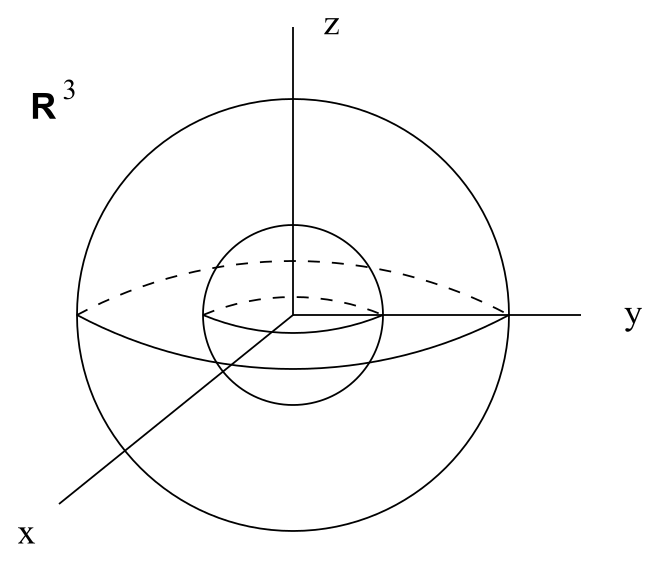
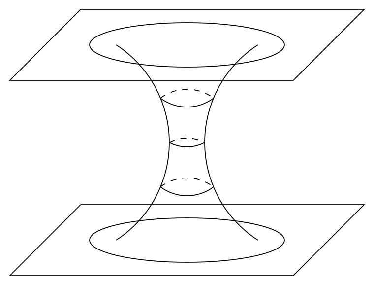

# 施瓦西解与伯克霍夫定理

<!-- CARROLL_NAV_TOP -->
> 完整译文 · 原 PDF 第 171–223 页 · [本章入口](../07-schwarzschild-and-black-holes.md) · [全书入口](../../carroll-general-relativity.md)
<!-- /CARROLL_NAV_TOP -->

## 从弱场极限走向完整的爱因斯坦方程

现在，我们要离开弱场极限的领域，转而研究完整的非线性爱因斯坦方程的解。除闵可夫斯基空间或许可以与之相提并论外，迄今最重要的这种解就是施瓦西发现的解；它描述球对称真空时空。由于我们处在真空中，爱因斯坦方程化为 $R_{\mu\nu}=0$。当然，若有人给出这类微分方程的一项候选解，把它代回方程便足以验证；然而我们希望得到更强的结论。事实上，我们将概述伯克霍夫定理的证明。该定理指出，施瓦西解是爱因斯坦真空方程的*唯一*球对称解。我们的做法是：先用一些不很严格的论证说明，任何球对称度规（无论它是否满足爱因斯坦方程）都必须具有某种形式；再以此为起点，更仔细地推导这种情形下的实际解。

## 球对称与球面叶状分解

“球对称”意为“具有与球面相同的对称性”。（本节所说的“球面”指 $S^2$，不指更高维球面。）我们关心的对象是可微流形上的度规，因此所要研究的是具有这些对称性的度规。我们已经知道如何刻画度规的对称性——它们由 Killing 矢量的存在来体现。此外，我们也知道 $S^2$ 的 Killing 矢量是什么，并且共有三个。因此，球对称流形就是这样一种流形：它具有三个与 $S^2$ 上的 Killing 矢量完全同类的 Killing 矢量场。所谓“完全同类”，是指两种情形下 Killing 矢量的对易子相同；用更精致的语言说，就是这些矢量所生成的代数相同。有一件事我们尚未证明、但确实成立：可以把 $S^2$ 上的三个 Killing 矢量选成 $(V^{(1)},V^{(2)},V^{(3)})$，使得
$$
\begin{aligned}
[V^{(1)},V^{(2)}] &=&  V^{(3)}\cr
  [V^{(2)},V^{(3)}] &=&  V^{(1)}\cr [V^{(3)},V^{(1)}] &=&  V^{(2)}\ .
\end{aligned}
\tag{7.1}
$$
这些对易关系恰好就是 SO(3)，即三维旋转群的对易关系。当然，这绝非巧合，不过我们不在这里继续追究。我们只需要知道：球对称流形拥有三个满足上述对易关系的 Killing 矢量场。

在第三节中，我们提到过 Frobenius 定理：如果有一组彼此对易的矢量场，就存在一组坐标函数，使这些矢量场恰好是对这些函数的偏导数。其实该定理的内容还不止于此。它进一步说明，如果某些矢量场*并不*对易，但它们的对易子是封闭的——也就是这组矢量场中任意两个场的对易子，都是该组中其他场的线性组合——那么这些矢量场的积分曲线会“拼合起来”，描绘出它们共同定义于其上的流形子流形。子流形的维数可能小于矢量数目，也可能与之相等，但显然不可能更大。满足 (7.1) 的矢量场当然会形成二维球面。由于这些矢量场遍及整个空间，每一点都恰好位于其中一个球面上。（严格说来，是几乎每一点；下面我们会说明为何它可能无法涵盖绝对意义上的每一点。）因此，我们说球对称流形可以被球面**叶状分解**。

### 两个直观例子

来看几个例子，把这件事说得具体些。最简单的例子是平坦的三维欧几里得空间。选定一个原点之后，${\bf R}^3$ 对绕该原点的旋转显然具有球对称性。在这种旋转之下（也就是在 Killing 矢量场的流之下），各点会彼此移换，但每一点始终留在与原点距离固定的某个 $S^2$ 上。

<figure>
  
  <figcaption>图 7.1：以选定原点为中心的同心二维球面构成 ${\bf R}^3$ 的叶。</figcaption>
</figure>

正是这些球面对 ${\bf R}^3$ 作了叶状分解。当然，它们并未真正分解整个空间，因为原点本身在旋转下保持不动——它不会沿某个二维球面运动。不过显然，除原点外，空间几乎处处都得到了适当的叶状分解；事实会证明，这对我们已经足够。

即使没有可供万物围绕旋转的“原点”，也可以具有球对称性。一个例子是拓扑为 ${\bf R}\times S^2$ 的“虫洞”。如果压去一个维度，把二维球面画成圆，这种空间可能如下图所示：

<figure>
  
  <figcaption>图 7.2：虫洞的每个截面都是二维球面，整个流形都可由这些球面分叶。</figcaption>
</figure>

在这种情形下，整个流形都可以由二维球面作叶状分解。

## 与叶状分解相适应的坐标

这种叶状结构提示我们，应当以适应叶状分解的方式在流形上设置坐标。具体来说，若一个 $n$ 维流形由 $m$ 维子流形分叶，我们可以在子流形上使用一组 $m$ 个坐标函数 $u^i$，再使用一组 $n-m$ 个坐标函数 $v^I$，用来指明我们位于哪个子流形上。（因此 $i$ 从 1 取到 $m$，而 $I$ 从 1 取到 $n-m$。）于是，所有 $v$ 与 $u$ 合在一起便为整个空间给出了坐标。如果这些子流形是极大对称空间（二维球面就是如此），则有如下强有力的定理：总可以选择 $u$ 坐标，使整个流形上的度规具有形式
$$
ds^2 = g_{\mu\nu}{\rm d}x^\mu {\rm d}x^\nu = g_{IJ}(v){\rm d}v^I {\rm d}v^J
  +f(v)\gamma_{ij}(u){\rm d}u^i {\rm d}u^j\ .
\tag{7.2}
$$
这里，$\gamma_{ij}(u)$ 是子流形上的度规。这个定理同时断言了两件事：第一，不存在交叉项 ${\rm d}v^I {\rm d}u^j$；第二，$g_{IJ}(v)$ 与 $f(v)$ 都只依赖 $v^I$，与 $u^i$ 无关。证明这个定理相当繁琐，不过建议读者查阅 Weinberg 的第 13 章。尽管如此，这个结论非常合乎情理。粗略地说，如果 $g_{IJ}$ 或 $f$ 依赖 $u^i$，那么当我们在同一个子流形内移动时，度规就会改变，这与对称性假设冲突。至于那些不需要的交叉项，只要保证切矢量 $\partial/\partial v^I$ 与各子流形正交，便能将其消去；换句话说，要在整个空间中以同样的方式把各个子流形排列起来。

至此，直观性的推说已经结束，我们可以开始老老实实地计算。在当前情形中，子流形是二维球面；我们通常在其上选择坐标 $(\theta,\phi)$，使度规具有形式
$$
d\Omega^2 = {\rm d}\theta^2 + \sin^2\theta\ {\rm d}\phi^2\ .
\tag{7.3}
$$
我们关心的是四维时空，所以还需要两个坐标，可将其称为 $a$ 和 $b$。于是定理 (7.2) 告诉我们，球对称时空的度规可以写成
$$
ds^2 = g_{aa}(a,b){\rm d}a^2 + g_{ab}(a,b)({\rm d}a{\rm d}b+{\rm d}b{\rm d}a)
  +g_{bb}(a,b){\rm d}b^2 + r^2(a,b)d\Omega^2\ .
\tag{7.4}
$$
这里 $r(a,b)$ 是某个尚未确定的函数，我们只是给它起了一个具有暗示意味的名字。不过，没有什么能够阻止我们把坐标从 $(a,b)$ 换成 $(a,r)$，只需反解 $r(a,b)$ 即可。（唯一可能造成阻碍的情形是 $r$ 仅为 $a$ 的函数；这时我们同样可以轻易地改用 $(b,r)$，所以不再单独讨论这种情况。）度规随即成为
$$
ds^2 = g_{aa}(a,r){\rm d}a^2 + g_{ar}(a,r)({\rm d}a{\rm d}r+{\rm d}r{\rm d}a)
  +g_{rr}(a,r){\rm d}r^2 + r^2 d\Omega^2\ .
\tag{7.5}
$$
下一步是寻找函数 $t(a,r)$，使得在 $(t,r)$ 坐标系中，度规里没有交叉项 ${\rm d}t{\rm d}r+{\rm d}r{\rm d}t$。注意
$$
{\rm d}t = {{\partial t}\over{\partial a}}{\rm d}a + {{\partial t}\over
  {\partial r}}{\rm d}r \ ,
\tag{7.6}
$$
所以
$$
{\rm d}t^2 = \left({{\partial t}\over{\partial a}}\right)^2{\rm d}a^2
  + \left({{\partial t}\over{\partial a}}\right)\left({{\partial t}
  \over{\partial r}}\right)
  ({\rm d}a{\rm d}r+{\rm d}r{\rm d}a) + \left({{\partial t}\over{\partial r}}\right)^2
  {\rm d}r^2\ .
\tag{7.7}
$$
我们希望把度规 (7.5) 的前三项换成
$$
m{\rm d}t^2 + n{\rm d}r^2\ ,
\tag{7.8}
$$
其中 $m$ 和 $n$ 是某些函数。这等价于要求
$$
m\left({{\partial t}\over{\partial a}}\right)^2 = g_{aa}\ ,
\tag{7.9}
$$
$$
n+m\left({{\partial t}\over{\partial r}}\right)^2 = g_{rr}\ ,
\tag{7.10}
$$
以及
$$
m\left({{\partial t}\over{\partial a}}\right)\left({{\partial t}\over
  {\partial r}}\right)=g_{ar}\ .
\tag{7.11}
$$
这样一来，对于三个未知量 $t(a,r)$、$m(a,r)$ 与 $n(a,r)$，我们恰好有三个方程，足以精确确定它们（$t$ 的初始条件除外）。（当然，这里说的“确定”是指用未知函数 $g_{aa}$、$g_{ar}$ 与 $g_{rr}$ 来表示，因此从这个意义看，它们仍未确定。）由此，我们可以把度规写成
$$
ds^2 = m(t,r){\rm d}t^2 + n(t,r){\rm d}r^2+ r^2 d\Omega^2\ .
\tag{7.12}
$$

到目前为止，坐标 $t$ 与 $r$ 的唯一区别在于：我们选定 $r$ 来乘二维球面的度规。这个选择的动机来自我们对平坦闵可夫斯基空间度规的了解，它可以写成 $ds^2 = -{\rm d}t^2 + {\rm d}r^2+ r^2 d\Omega^2$。我们知道所考察的时空是 Lorentz 型的，所以 $m$ 或 $n$ 中必有一个为负。先选择 $m$，也就是 ${\rm d}t^2$ 的系数，为负。这并非一个总能任意作出的选择，事实上稍后会看到它可能失效；不过眼下先作此假设。这个假设也并非全无道理，因为我们知道闵可夫斯基空间本身具有球对称性，因而也会由 (7.12) 描述。作出这个选择后，可以舍去函数 $m$ 与 $n$，改用新函数 $\alpha$ 与 $\beta$，使得
$$
ds^2 = -e^{2\alpha(t,r)}{\rm d}t^2 + e^{2\beta(t,r)}{\rm d}r^2
  + r^2 d\Omega^2\ .
\tag{7.13}
$$

这已经是一般球对称时空度规所能达到的最简形式。下一步要真正求解爱因斯坦方程，从而明确确定函数 $\alpha(t,r)$ 与 $\beta(t,r)$。遗憾的是，我们必须计算 (7.13) 的 Christoffel 符号，再由此得到曲率张量，继而得到 Ricci 张量。像通常那样，以 $(0,1,2,3)$ 标记 $(t,r,\theta,\phi)$，则 Christoffel 符号为
$$
\begin{aligned}
&\Gamma^0_{00}={\partial}_{0}\alpha\qquad\quad
  \Gamma^0_{01} =  {\partial}_{1}\alpha \qquad\quad
  \Gamma^0_{11} = e^{2(\beta-\alpha)}{\partial}_{0}\beta &\cr &
  \Gamma^1_{00} = e^{2(\alpha-\beta)}{\partial}_{1}\alpha\qquad
  \Gamma^1_{01} = {\partial}_{0}\beta \qquad\quad
  \Gamma^1_{11} = {\partial}_{1}\beta & \cr &
  \Gamma^2_{12} = {1\over r}\qquad
  \Gamma^1_{22} = - r e^{-2\beta}\qquad
  \Gamma^3_{13} = {1\over r} &\cr &
  \Gamma^1_{33} = -r e^{-2\beta}\sin^2\theta\qquad
  \Gamma^2_{33} = -\sin\theta \cos\theta \qquad
  \Gamma^3_{23} = {{\cos\theta}\over {\sin\theta}}\ .&
\end{aligned}
\tag{7.14}
$$
（未明确写出的量，意味着它为零，或者可由对称性与已写出的量联系起来。）由此得到 Riemann 张量的下列非零分量：
$$
\begin{aligned}
R^0{}_{101} &=&  e^{2(\beta-\alpha)}[{\partial}_{0}^2\beta +({\partial}_{0}\beta)^2
  -{\partial}_{0}\alpha {\partial}_{0}\beta]+[{\partial}_{1}\alpha{\partial}_{1}\beta-{\partial}_{1}^2\alpha -({\partial}_{1}\alpha)^2]\cr
  R^0{}_{202} &=&  -r e^{-2\beta}{\partial}_{1}\alpha \cr
  R^0{}_{303} &=&  -r e^{-2\beta}\sin^2\theta\ {\partial}_{1}\alpha \cr
  R^0{}_{212} &=&  -r e^{-2\alpha}{\partial}_{0}\beta \cr
  R^0{}_{313} &=&  -r e^{-2\alpha}\sin^2\theta\ {\partial}_{0}\beta \cr
  R^1{}_{212} &=&  r e^{-2\beta}{\partial}_{1}\beta \cr
  R^1{}_{313} &=&  r e^{-2\beta}\sin^2\theta\ {\partial}_{1}\beta \cr
  R^2{}_{323} &=&  (1-e^{-2\beta})\sin^2\theta\ .
\end{aligned}
\tag{7.15}
$$
照常作缩并，得到 Ricci 张量：
$$
\begin{aligned}
R_{00} &=&  [{\partial}_{0}^2\beta +({\partial}_{0}\beta)^2-{\partial}_{0}\alpha {\partial}_{0}\beta] +
  e^{2(\alpha-\beta)}[{\partial}_{1}^2\alpha +({\partial}_{1}\alpha)^2-{\partial}_{1}\alpha{\partial}_{1}\beta
  +{2\over{r}}{\partial}_{1}\alpha]\cr
  R_{11} &=&  -[{\partial}_{1}^2\alpha +({\partial}_{1}\alpha)^2-{\partial}_{1}\alpha{\partial}_{1}\beta
  -{2\over{r}}{\partial}_{1}\beta] + e^{2(\beta-\alpha)}[{\partial}_{0}^2\beta +({\partial}_{0}\beta)^2
  -{\partial}_{0}\alpha {\partial}_{0}\beta]\cr
  R_{01} &=&  {2\over{r}}{\partial}_{0}\beta \cr
  R_{22} &=&  e^{-2\beta}[r({\partial}_{1}\beta-{\partial}_{1}\alpha)-1]+1\cr
  R_{33} &=&  R_{22}\sin^2\theta\ .
\end{aligned}
\tag{7.16}
$$

## 求解真空方程

我们的任务是令 $R_{\mu\nu}=0$。由 $R_{01}=0$ 得
$$
{\partial}_{0}\beta = 0\ .
\tag{7.17}
$$
对 $R_{22}=0$ 取时间导数，并使用 ${\partial}_{0}\beta = 0$，便得到
$$
{\partial}_{0}{\partial}_{1}\alpha =0\ .
\tag{7.18}
$$
因此可以写成
$$
\begin{aligned}
\beta &=&  \beta(r)\cr
  \alpha &=&  f(r)+g(t)\ .
\end{aligned}
\tag{7.19}
$$
度规 (7.13) 的第一项因而是 $`-e^{2f(r)}e^{2g(t)}
{\rm d}t^2`$。然而，我们总能直接以 ${\rm d}t\rightarrow e^{-g(t)}{\rm d}t$ 重新定义时间坐标；换句话说，可以自由选择 $t$，使 $g(t)=0$，于是 $\alpha(t,r)=f(r)$。所以有
$$
ds^2 = -e^{2\alpha(r)}{\rm d}t^2 + e^{\beta(r)}{\rm d}r^2
  + r^2 d\Omega^2\ .
\tag{7.20}
$$
所有度规分量都与坐标 $t$ 无关。由此我们证明了一个关键结果：*任何球对称真空度规都拥有一个类时 Killing 矢量。*

这个性质十分重要，因此有自己的名称：拥有类时 Killing 矢量的度规称为**平稳的**（stationary）。还有一种要求更强的性质：若某个度规拥有一个类时 Killing 矢量，并且该矢量与一族超曲面正交，就称该度规为**静态的**（static）。（$n$ 维流形中的超曲面，就是一个（$n-1$）维子流形。）度规 (7.20) 既平稳，又静态；Killing 矢量场 ${\partial}_{0}$ 与曲面 $t=const$ 正交，因为度规中没有 ${\rm d}t{\rm d}r$ 等交叉项。粗略地说，在静态度规中一切都静止不动；平稳度规则允许物体运动，但运动必须以一种对称方式持续。例如，静态球对称度规 (7.20) 将描述不旋转的恒星或黑洞，而旋转系统（它们在所有时刻都以同一种方式持续旋转）则由平稳度规描述。哪个词对应哪个概念很难记，不过两个概念之间的区别应当是容易理解的。

继续寻找这个解。由于 $R_{00}$ 和 $R_{11}$ 都为零，可以写出
$$
0=e^{2(\beta-\alpha)}R_{00} + R_{11} = {2\over r}({\partial}_{1}\alpha+
  {\partial}_{1}\beta)\ ,
\tag{7.21}
$$
这意味着 $\alpha = -\beta + {\rm~constant}$。仍然可以通过缩放坐标消去这个常数，因此有
$$
\alpha = -\beta\ .
\tag{7.22}
$$
接着考察 $R_{22}=0$，此时它写成
$$
e^{2\alpha}(2r{\partial}_{1}\alpha+1)=1\ .
\tag{7.23}
$$
这与下式完全等价：
$$
{\partial}_{1}(r e^{2\alpha})=1\ .
\tag{7.24}
$$
解得
$$
e^{2\alpha}=1+{\mu\over r}\ ,
\tag{7.25}
$$
其中 $\mu$ 是某个未定常数。结合 (7.22) 与 (7.25)，度规变成
$$
ds^2 = -\left(1+{\mu\over r}\right){\rm d}t^2 +
  \left(1+{\mu\over r}\right)^{-1}{\rm d}r^2
  + r^2 d\Omega^2\ .
\tag{7.26}
$$
现在，除单个常数 $\mu$ 外，我们已没有任何自由度，所以这个形式最好确实能满足余下的方程 $R_{00}=0$ 与 $R_{11}=0$；直接检验不难发现，对于 $\mu$ 的任意取值，它都满足这些方程。

## 牛顿极限与施瓦西度规

最后只需把常数 $\mu$ 解释为某个物理参数。球对称真空解最重要的用途，是表示恒星、行星或类似天体外部的时空。在这种情况下，我们期望当 $r\rightarrow\infty$ 时恢复弱场极限。在此极限下，(7.26) 给出
$$
\begin{aligned}
g_{00}(r\rightarrow\infty) &=& -\left(1+{\mu\over r}\right)\ ,\cr
  g_{rr}(r\rightarrow\infty) &=& \left(1-{\mu\over r}\right)\ .
\end{aligned}
\tag{7.27}
$$
另一方面，弱场极限为
$$
\begin{aligned}
g_{00} &=& -\left(1+2\Phi\right)\ ,\cr
  g_{rr} &=& \left(1-2\Phi\right)\ ,
\end{aligned}
\tag{7.28}
$$
其中势 $\Phi=-GM/r$。因此，若令 $\mu = -2GM$，这两个度规在该极限下确实一致。

我们的最终结果就是著名的**施瓦西度规**：
$$
ds^2 = -\left(1-{{2GM}\over r}\right){\rm d}t^2 +
  \left(1-{{2GM}\over r}\right)^{-1}{\rm d}r^2
  + r^2 d\Omega^2\ .
\tag{7.29}
$$
这对爱因斯坦方程的任意球对称真空解都成立；$M$ 是一个参数，我们恰好知道，它可以解释为通常意义上的牛顿质量，即通过研究远离引力源处的轨道所测得的质量。请注意，当 $M\rightarrow 0$ 时，我们恢复闵可夫斯基空间，这正合预期。还要注意，当 $r\rightarrow\infty$ 时，度规逐渐趋于闵可夫斯基度规；这个性质称为**渐近平坦性**。

施瓦西度规既是一项良好解，又是唯一的球对称真空解；这个事实称为**伯克霍夫定理**。值得注意的是，所得度规是静态的。对于源，我们除要求它具有球对称性外，没有作出任何其他说明。特别是，我们没有要求源本身保持静态；它完全可以是一颗正在坍缩的恒星，只要坍缩过程对称即可。因此，像超新星爆发这种基本呈球对称的过程，预计只会产生很少的引力辐射（相较于它通过其他渠道释放的能量）。在电磁学中也会得到同样的结果：球形电荷分布周围的电磁场并不依赖电荷的径向分布。

<!-- CARROLL_NAV_BOTTOM -->
---
[← 引力波携带的能量](../06-weak-fields-and-gravitational-waves/04-energy-carried-by-gravitational-waves.md) · [全书入口](../../carroll-general-relativity.md) · [测地线、轨道与近日点进动 →](./02-geodesics-orbits-and-perihelion-precession.md)
<!-- /CARROLL_NAV_BOTTOM -->
