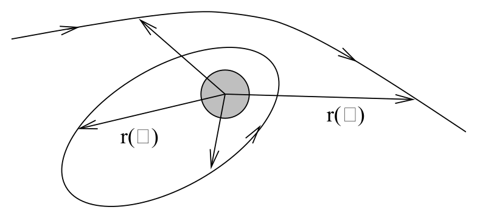
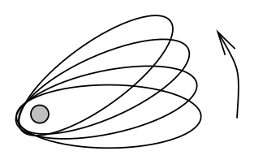

# 测地线、轨道与近日点进动

<!-- CARROLL_NAV_TOP -->
> 完整译文 · 原 PDF 第 171–223 页 · [本章入口](../07-schwarzschild-and-black-holes.md) · [全书入口](../../carroll-general-relativity.md)
<!-- /CARROLL_NAV_TOP -->

## 奇点与坐标奇性

在探索测试粒子在施瓦西几何中的行为之前，我们应当先谈谈奇点。从 (7.29) 的形式看，度规系数在 $r=0$ 和 $r=2GM$ 处变为无穷大——这表面上显示有些事情出了问题。当然，度规系数是依赖坐标的量，因此不应过分看重它们的取值；完全可能出现一种“坐标奇性”，其根源是某个特定坐标系失效，而非底层流形本身出了问题。平面极坐标的原点就是一个例子：度规 $ds^2 = {\rm d}r^2 + r^2 {\rm d}\theta^2$ 在那里退化，逆度规分量 $g^{\theta\theta}=r^{-2}$ 发散，尽管流形上的这一点与其他任何一点并无区别。

如果几何失去控制，我们应寻找何种与坐标无关的信号作为警告？事实证明，这个问题很难回答，甚至已有整本专著讨论广义相对论中奇点的性质。我们不会深入这个问题，而是采用一种简单的判据来判断何时出了问题——即曲率变为无穷大。曲率由 Riemann 张量度量，但要说一个张量何时变为无穷大并不容易，因为它的分量依赖坐标。不过，我们可以从曲率构造各种标量；标量与坐标无关，所以说它们变为无穷大具有明确意义。最简单的这种标量是 Ricci 标量 $R=g^{\mu\nu}R_{\mu\nu}$，但也可以构造更高阶的标量，例如 $R^{\mu\nu}R_{\mu\nu}$、$R^{{\mu\nu}\rho\sigma}R_{{\mu\nu}\rho\sigma}$、$`R_{{\mu\nu}\rho\sigma}
R^{\rho\sigma\lambda\tau} R_{\lambda\tau}{}^{{\mu\nu}}`$，等等。当我们趋近某一点时，只要这些标量中有任何一个变为无穷大（不要求它们全都如此），我们就把该点视为曲率奇点。还应检查该点是否位于“无穷远处”；也就是说，沿一条曲线行进有限距离便应能够到达它。

因此，我们已经得到把一个点视为奇点的充分条件。不过，它并非必要条件；要证明一个给定点没有奇性，通常更加困难。就我们的目的而言，只需检验测地线在所考察点的行为是否良好；若确实如此，便把该点视为非奇异点。对于施瓦西度规 (7.29)，直接计算得到
$$
R^{{\mu\nu}\rho\sigma}R_{{\mu\nu}\rho\sigma} = {{12 G^2 M^2}\over {r^6}}\ .
\tag{7.30}
$$
这足以使我们相信 $r=0$ 表示一个真正的奇点。在另一个问题位置 $r=2GM$，可以检查发现所有曲率不变量都不会发散。因此，我们开始怀疑它其实并不奇异，只是我们选用了一个糟糕的坐标系。如果可能，最佳做法就是变换到更合适的坐标。很快会看到，在这里确实可以做到，而曲面 $r=2GM$ 在施瓦西度规中的行为十分良好（尽管很有趣）。

稍稍担心过奇点之后，还应指出，施瓦西解在 $r\leq 2GM$ 处的行为，对日常问题几乎没有影响。我们推导出的解只在真空中有效，并期望它适用于恒星这类球形物体的外部。然而，对太阳而言，这个天体一直延伸到半径
$$
R_\odot = 10^6 G M_\odot\ .
\tag{7.31}
$$
因此，$r=2GM_\odot$ 远在太阳内部，在那里我们并不期望施瓦西度规适用。事实上，真实的恒星内部解具有形式
$$
ds^2 = -\left(1-{{2Gm(r)}\over r}\right){\rm d}t^2 +
  \left(1-{{2Gm(r)}\over r}\right)^{-1}{\rm d}r^2
  + r^2 d\Omega^2\ .
\tag{7.32}
$$
细节可参见 Schutz。这里的 $m(r)$ 是 $r$ 的函数，它趋于零的速度比 $r$ 本身更快，所以根本没有奇点需要处理。不过，确实存在必须使用完整施瓦西度规的天体——黑洞。因此，在本节余下部分，我们将让想象力漫游到太阳系之外极其遥远的地方。

## 施瓦西几何中的测地线

为了更充分地理解这个度规，第一步是考察测地线的行为。我们需要施瓦西度规的非零 Christoffel 符号：
$$
\begin{aligned}
&\Gamma^1_{00} = {{GM}\over {r^3}}(r-2GM)\qquad
  \Gamma^1_{11} = {{-GM}\over{r(r-2GM)}} \qquad
  \Gamma^0_{01} = {{GM}\over{r(r-2GM)}} \cr
  &\quad\qquad\Gamma^2_{12} = {1\over r}\qquad\quad
  \Gamma^1_{22} = - (r-2GM)\qquad\quad
  \Gamma^3_{13} = {1\over r}\cr
  &\quad\Gamma^1_{33} = -(r-2GM)\sin^2\theta\qquad
  \Gamma^2_{33} = -\sin\theta \cos\theta \qquad
  \Gamma^3_{23} = {{\cos\theta}\over {\sin\theta}}\ .
\end{aligned}
\tag{7.33}
$$
因此，测地线方程化为以下四个方程，其中 $\lambda$ 是仿射参数：
$$
{{d^2 t}\over{d\lambda^2}} + {{2GM}\over{r(r-2GM)}}
  {{dr}\over{d\lambda}}{{dt}\over{d\lambda}} =0\ ,
\tag{7.34}
$$
$$
\begin{aligned}
\lefteqn{{{d^2 r}\over{d\lambda^2}} + {{GM}\over {r^3}}(r-2GM)
  \left({{dt}\over{d\lambda}}\right)^2 - {{GM}\over{r(r-2GM)}}
  \left({{dr}\over{d\lambda}}\right)^2} \cr
  &&- (r-2GM)\left[
  \left({{d\theta}\over{d\lambda}}\right)^2+\sin^2\theta
  \left({{d\phi}\over{d\lambda}}\right)^2\right] = 0 \ ,
\end{aligned}
\tag{7.35}
$$
$$
{{d^2 \theta}\over{d\lambda^2}} + {2\over r}{{d\theta}\over{d\lambda}}
  {{dr}\over{d\lambda}} - \sin\theta \cos\theta
  \left({{d\phi}\over{d\lambda}}\right)^2 = 0\ ,
\tag{7.36}
$$
以及
$$
{{d^2 \phi}\over{d\lambda^2}} + {2\over r}{{d\phi}\over{d\lambda}}
  {{dr}\over{d\lambda}} + 2{{\cos\theta}\over {\sin\theta}}
  {{d\theta}\over{d\lambda}}{{d\phi}\over{d\lambda}} = 0\ .
\tag{7.37}
$$
看来，想通过观察直接解出这组耦合方程，几乎没有希望。幸运的是，施瓦西度规的高度对称性大大简化了我们的任务。我们知道它有四个 Killing 矢量：三个来自球对称性，一个来自时间平移。每一个都会为自由粒子带来一个运动常量；若 $K^\mu$ 是 Killing 矢量，则有
$$
K_\mu {{dx^\mu}\over{d\lambda}} = {\rm constant}\ .
\tag{7.38}
$$
此外，测地线总还有另一个运动常量；度规适配性意味着，沿路径的量
$$
\epsilon = -g_{\mu\nu}{{dx^\mu}\over{d\lambda}}{{dx^\nu}\over{d\lambda}}
\tag{7.39}
$$
保持不变。当然，对有质量粒子，我们通常选择 $\lambda = \tau$，此关系就简化为 $\epsilon = -g_{\mu\nu}U^\mu U^\nu=+1$。对无质量粒子，始终有 $\epsilon =0$。我们还会关心类空测地线（尽管它们不对应粒子的路径），并为其选择 $\epsilon = -1$。

### 对称性与守恒量

先不急着写出与四个 Killing 矢量对应的四个守恒量的显式表达式，让我们想想它们究竟告诉了我们什么。注意，它们所代表的对称性也存在于平坦时空中；在那里，由这些对称性产生的守恒量十分熟悉。时间平移不变性导致能量守恒，空间旋转不变性则导致角动量的三个分量守恒。对于施瓦西度规，情形本质上相同。我们可以把角动量视为一个三维矢量，它具有大小（一个分量）和方向（两个分量）。角动量方向守恒意味着粒子将在一个平面内运动。可以把这个平面选为坐标系的赤道面；如果粒子起初不在这个平面内，只需旋转坐标，直至它落入该平面。因此，导致角动量方向守恒的两个 Killing 矢量意味着
$$
\theta = {\pi\over 2}\ .
\tag{7.40}
$$
余下两个 Killing 矢量分别对应能量和角动量的大小。能量来自类时 Killing 矢量 $K = \partial_t$，即
$$
K_\mu = \left(-\left(1-{{2GM}\over r}\right),0,0,0\right)
  \ .
\tag{7.41}
$$
其守恒量为角动量大小的 Killing 矢量是 $L = {\partial}_{\phi}$，即
$$
L_\mu = \left(0,0,0,r^2\sin^2\theta \right)\ .
\tag{7.42}
$$
由于 (7.40) 意味着，在我们关心的测地线上 $\sin\theta = 1$，所以两个守恒量为
$$
\left(1-{{2GM}\over r}\right){{dt}\over{d\lambda}}=E\ ,
\tag{7.43}
$$
以及
$$
r^2{{d\phi}\over{d\lambda}}=L\ .
\tag{7.44}
$$
对无质量粒子，可把它们看成能量与角动量；对有质量粒子，则是单位粒子质量的能量与角动量。请注意，(7.44) 的恒定性就是 Kepler 第二定律（相等时间内扫过相等面积）在广义相对论中的对应物。

## 有效势与轨道分类

这些守恒量合在一起，为理解施瓦西几何中的粒子轨道提供了一种方便的方法。展开 (7.39) 中 $\epsilon$ 的表达式，得到
$$
-\left(1-{{2GM}\over r}\right)\left({{dt}\over{d\lambda}}\right)^2 +
  \left(1-{{2GM}\over r}\right)^{-1}\left({{dr}\over{d\lambda}}\right)^2
  +r^2\left({{d\phi}\over{d\lambda}}\right)^2 = -\epsilon\ .
\tag{7.45}
$$
将它乘以 $(1-2GM/r)$，再使用 $E$ 和 $L$ 的表达式，便得到
$$
-E^2+\left({{dr}\over{d\lambda}}\right)^2+\left(1-{{2GM}\over r}\right)
  \left({{L^2}\over{r^2}} +\epsilon\right) =0\ .
\tag{7.46}
$$
这无疑是一项进展：我们从一组杂乱的耦合方程出发，得到了关于 $r(\lambda)$ 的单个方程。把它重写为下式，看起来还会更整洁：
$$
{1\over 2}\left({{dr}\over{d\lambda}}\right)^2+ V(r) =
  {1\over 2}E^2\ ,
\tag{7.47}
$$
其中
$$
V(r) = {1\over 2}\epsilon - \epsilon{{GM}\over r} +
  {{L^2}\over{2r^2}} - {{GML^2}\over {r^3}}\ .
\tag{7.48}
$$
在 (7.47) 中，我们恰好得到了一个经典方程：单位质量的经典粒子具有“能量” ${1\over 2}E^2$，并在 $V(r)$ 给出的一维势中运动。（真正的单位质量能量是 $E$，但坐标 $r$ 的有效势响应的是 ${1\over 2}E^2$。）

当然，我们的物理情形与经典粒子的一维运动相去甚远。这里所考察的轨迹是围绕恒星或其他天体的轨道：

<figure>
  
  <figcaption>图 7.3：粒子绕中心引力源运动；径向行为只描述完整轨道的一部分。</figcaption>
</figure>

我们感兴趣的量不只有 $r(\lambda)$，还有 $t(\lambda)$ 与 $\phi(\lambda)$。尽管如此，只要理解径向行为，就能在很大程度上理解所有轨道；把这一行为化为一个我们知道怎样求解的问题，帮助很大。

在 Newton 引力中对轨道作类似分析，也会得到类似结果；一般方程 (7.47) 完全相同，但有效势 (7.48) 中不会出现最后一项。（请注意，这个方程并非关于 $1/r$ 的幂级数，它是精确的。）在势 (7.48) 中，第一项只是一个常数，第二项与 Newton 引力势完全对应，第三项是角动量的贡献，它在 Newton 引力和广义相对论中形式相同。最后一项是广义相对论的贡献；事实将证明，它会造成很大的差异，在 $r$ 较小时尤其如此。

让我们考察图中所示的各种可能轨道。不同的 $V(r)$ 曲线对应不同的 $L$ 值；对于任意一条曲线，可以通过比较 ${1\over 2}E^2$ 与 $V(r)$ 来判断轨道行为。一般而言，粒子会在势中运动，直至抵达满足 $V(r)={1\over 2}E^2$ 的“转向点”，随后开始沿相反方向运动。有时可能根本没有可抵达的转向点，这时粒子会一直走下去。在另一些情况下，粒子可能只是在半径 $r_c= const$ 处作圆周运动；当势是平的，即 $dV/dr=0$ 时，就会出现这种情况。对 (7.48) 求导可知，圆轨道出现于
$$
\epsilon GM r_c^2 - L^2 r_c +3GML^2\gamma =0\ ,
\tag{7.49}
$$
其中，在 Newton 引力中 $\gamma=0$，在广义相对论中 $\gamma=1$。若圆轨道对应势的极小值，它就是稳定的；若对应极大值，它就是不稳定的。非圆形的束缚轨道会围绕稳定圆轨道的半径振荡。

<figure>
  
  <figcaption>图 7.4：Newton 情形下，不同角动量所对应的有效势及允许的径向运动。</figcaption>
</figure>

<figure>
  
  <figcaption>图 7.5：广义相对论的有效势多出短程项，因而产生新的轨道结构。</figcaption>
</figure>

### Newton 引力中的轨道

先看 Newton 引力，可知圆轨道出现于
$$
r_c = {{L^2}\over{\epsilon GM}}\ .
\tag{7.50}
$$
对于无质量粒子，$\epsilon=0$，所以没有圆轨道；这与图示一致，图中根本不存在任何束缚轨道。尽管在这个坐标系中看得不太清楚，无质量粒子其实沿直线运动，因为 Newton 引力对无质量粒子的力为零。（当然，无质量粒子在 Newton 理论中的地位有些成问题，不过暂且忽略。）用有效势来描述，具有给定能量 $E$ 的光子会从 $r=\infty$ 入射，并逐渐“减速”（实际下降的是 $dr/d\lambda$，光速并未改变），直到抵达转向点，然后开始向外运动，返回 $r=\infty$。$L$ 越小，光子在转向之前就会靠得越近；这些轨迹恰好对应光子起初瞄准的方向更接近引力天体。对有质量粒子，在半径 (7.50) 处存在稳定圆轨道，也存在围绕该半径振荡的束缚轨道。如果能量大于渐近值 $E=1$，轨道便不受束缚，描述一个接近恒星、随后又远离的粒子。我们知道，Newton 理论中的轨道是圆锥曲线——束缚轨道是圆或椭圆，非束缚轨道是抛物线或双曲线——不过这里不作证明。

### 广义相对论中的轨道

在广义相对论中，情况有所不同，但差异只在 $r$ 足够小时出现。由于差别来自 $-GML^2/r^3$ 项，当 $r\rightarrow\infty$ 时，两种理论中的行为完全相同。但当 $r\rightarrow 0$ 时，势趋于 $-\infty$；Newton 情形下则趋于 $+\infty$。在 $r=2GM$ 处，势总为零；该半径以内是黑洞，稍后会更深入地讨论。对于无质量粒子，势垒总是存在（$L=0$ 时除外，此时势恒等于零）；但能量足够高的光子仍会越过势垒，并不可避免地一路被拖向中心。（请注意，“能量足够高”意为“与其角动量相比足够高”——事实上，光子的频率无关紧要，唯一重要的是它指向的方向。）势垒顶部存在不稳定圆轨道。令 $\epsilon=0$、$\gamma=1$，很容易解出 (7.49)，得到
$$
r_c = 3GM\ .
\tag{7.51}
$$
图也证实了这一点：$V(r)$ 在 $r=3GM$ 处取得极大值，对每个 $L$ 都是如此。这意味着，光子可以永远沿该半径上的圆周运行，但任何扰动都会使它飞向 $r=0$ 或 $r=\infty$。

<figure>
  
  <figcaption>图 7.6：光子的有效势在 $r=3GM$ 处具有对应不稳定圆轨道的峰值。</figcaption>
</figure>

<figure>
  
  <figcaption>图 7.7：有质量粒子的角动量决定稳定与不稳定圆轨道是否存在。</figcaption>
</figure>

对于有质量粒子，依角动量不同，又会出现若干不同区域。圆轨道位于
$$
r_c = {{L^2\pm \sqrt{L^4 - 12 G^2 M^2 L^2}}\over{2GM}}\ .
\tag{7.52}
$$
当 $L$ 很大时，会有两个圆轨道，一个稳定，一个不稳定。在 $L\rightarrow\infty$ 极限下，它们的半径为
$$
r_c = {{L^2\pm L^2(1 - 6 G^2 M^2/L^2)}\over{2GM}} =
  \left({{L^2}\over{GM}} ,\ 3GM\right)\ .
\tag{7.53}
$$
在此极限下，稳定圆轨道越来越远，不稳定圆轨道则趋近 $3GM$，这与无质量情形的行为相呼应。当 $L$ 减小时，两个圆轨道彼此靠近；当 (7.52) 的判别式在
$$
L = \sqrt{12}GM\ ,
\tag{7.54}
$$
处消失时，两轨道重合，此时
$$
r_c = 6GM\ ,
\tag{7.55}
$$
而当 $L$ 更小时，它们会完全消失。因此，$6GM$ 是施瓦西度规中稳定圆轨道可能具有的最小半径。此外，还有从无穷远入射后转向的非束缚轨道，以及围绕稳定圆轨道半径振荡的束缚非圆轨道。请注意，这类轨道在 Newton 引力中会描出精确的圆锥曲线，在广义相对论中却不会如此，尽管要展示这一点，还必须解出关于 $d\phi/dt$ 的方程。最后，还有从无穷远入射、一路继续到 $r=0$ 的轨道；当能量高于势垒时会发生这种情况，而当 $L<\sqrt{12}GM$、势垒彻底消失时也会如此。

因此，我们发现施瓦西解在 $r>6GM$ 处具有稳定圆轨道，在 $3GM < r < 6GM$ 处具有不稳定圆轨道。重要的是要记住，这些只是测地线；受加速的粒子完全可以下探至 $r=3GM$ 以下再重新出来，只要它始终停留在 $r=2GM$ 之外。

## 广义相对论的经典检验

广义相对论的大多数实验检验都涉及测试粒子在太阳系中的运动，因而涉及施瓦西度规的测地线；这里正适合稍作停顿，考察这些检验。Einstein 提出了三项检验：光线偏折、近日点进动与引力红移。光线偏折在弱场极限下即可观测到，因此算不上对施瓦西几何精确形式的理想检验。人们曾在日食期间观测这种偏折，结果与广义相对论的预言相符（尽管它并非一项格外干净利落的实验）。近日点进动反映了非圆轨道并非闭合椭圆这一事实；在很好的近似下，它们是会发生进动的椭圆，描出一朵花般的图案。

<figure>
  
  <figcaption>图 7.8：非圆束缚轨道近似为不断转动长轴的椭圆，因此形成花瓣状轨迹。</figcaption>
</figure>

利用测地线方程，可以把 $d\phi/d\lambda$ 解成轨道偏心率 $e$ 的幂级数，并由此得到拱点频率 $\omega_a$；它定义为 $2\pi$ 除以椭圆完成一整周进动所需的时间。细节可查阅 Weinberg；答案为
$$
\omega_a={{3(GM)^{3/2}}\over {c^2(1-e^2)r^{5/2}}}\ ,
\tag{7.56}
$$
这里恢复了 $c$，以便与观测比较。（亲自推导最低非零阶是一个很好的练习；在该阶近似下，$e^2$ 项不会出现。）在历史上，水星进动是广义相对论的第一项检验。对水星而言，相关数值为
$$
\begin{aligned}
{{GM_\odot}\over{c^2}}&=& 1.48\times 10^5 {\rm ~cm}\ ,\cr
  a &=&  5.55\times 10^{12}{\rm ~cm}\ ,
\end{aligned}
\tag{7.57}
$$
当然还有 $c=3.00\times 10^{10}$ cm/sec。由此得到 $`\omega_a
= 2.35\times 10^{-14}`$ sec$^{-1}$。换句话说，水星轨道的长轴每 100 年进动 $42.9$ 角秒。观测值为 $5601$ 角秒/100 年。不过，其中很大一部分来自地心坐标系中分点的进动，精确地说是 $5025$ 角秒/100 年。其他行星的引力扰动又贡献了 $532$ 角秒/100 年，留下 $43$ 角秒/100 年需要广义相对论解释，而它完成得相当出色。

正如我们已经看到的，引力红移也是弱场极限中存在的一种效应；事实上，任何服从等效原理的引力理论都会预言它。不过，这一点只适用于足够小的时空区域；跨越更大距离时，红移的精确数值将依赖度规，因而依赖正在考察的理论。因此，值得计算施瓦西几何中的红移。考虑两位并不沿测地线运动的观察者，他们固定在空间坐标值 $(r_1,\theta_1,\phi_1)$ 与 $(r_2,\theta_2,\phi_2)$ 处。根据 (7.45)，观察者 $i$ 的固有时间与坐标时间 $t$ 之间满足
$$
{{d\tau_i}\over{dt}} = \left(1-{{2GM}\over{r_i}}\right)^{1/2}\ .
\tag{7.58}
$$
设观察者 ${\cal O}_1$ 发出一道光脉冲，传播到观察者 ${\cal O}_2$；${\cal O}_1$ 测得光波相邻两个波峰之间的时间为 $\Delta\tau_1$。每个波峰都沿同一条路径前往 ${\cal O}_2$，只是它们相隔一个坐标时间
$$
\Delta t= \left(1-{{2GM}\over{r_1}}\right)^{-1/2}\Delta \tau_1\ .
\tag{7.59}
$$
这个坐标时间间隔沿光子轨迹不会改变，但第二位观察者测得相邻波峰间的时间为
$$
\begin{aligned}
\Delta\tau_2 &=&  \left(1-{{2GM}\over{r_2}}\right)^{1/2}
  \Delta t\cr
  &=&  \left({{1-{{2GM}/{r_2}}}\over{1-{{2GM}/{r_1}}}}\right)^{1/2}
  \Delta\tau_1\ .
\end{aligned}
\tag{7.60}
$$
由于这些间隔 $\Delta\tau_i$ 测量的是电磁波两个波峰之间的固有时间，所以观测频率满足
$$
\begin{aligned}
{{\omega_2}\over{\omega_1}}&=& {{\Delta\tau_1}\over
  {\Delta\tau_2}}\cr
  &=& \left({{1-{{2GM}/{r_1}}}\over{1-{{2GM}/{r_2}}}}\right)^{1/2}
  \ .
\end{aligned}
\tag{7.61}
$$
这是频移的精确结果；在 $r>>2GM$ 极限下，有
$$
\begin{aligned}
{{\omega_2}\over{\omega_1}}&=& 1-{{GM}\over{r_1}}+
  {{GM}\over{r_2}}\cr
  &=& 1+\Phi_1-\Phi_2\ .
\end{aligned}
\tag{7.62}
$$
这告诉我们，当 $\Phi$ 增大时，频率会降低；爬出引力场时正是这种情况，因此会发生红移。可以检查，它与我们先前依据等效原理作出的计算一致。

Einstein 提出三项经典检验之后，人们又提出了广义相对论的更多检验。最著名的当然是上一节讨论过的双星脉冲星。另一项是 Shapiro 发现（并观测到）的引力时间延迟。它所表达的只是：在两个事件之间沿两条不同轨迹流逝的时间未必相同。人们通过让雷达信号从金星和火星反射回来测量了这种效应，结果再次与广义相对论的预言相符。尚未观测到的一种效应是 Lense–Thirring 效应，也叫参考系拖曳效应。长期以来，人们一直在推动一项拟议的卫星计划，称为引力探测器 B（Gravity Probe B）；它将携带精度极高的陀螺仪，使人们可以测量其进动，并分离出广义相对论的贡献。不过，它距离发射还有很长的路要走，而这类项目能否存续，每年都要重新面对考验。

<!-- CARROLL_NAV_BOTTOM -->
---
[← 施瓦西解与伯克霍夫定理](./01-schwarzschild-solution-and-birkhoff-theorem.md) · [全书入口](../../carroll-general-relativity.md) · [事件视界、Kruskal 坐标与引力坍缩 →](./03-event-horizon-kruskal-and-collapse.md)
<!-- /CARROLL_NAV_BOTTOM -->
