# 事件视界、Kruskal 坐标与引力坍缩

<!-- CARROLL_NAV_TOP -->
> 完整译文 · 原 PDF 第 171–223 页 · [本章入口](../07-schwarzschild-and-black-holes.md) · [全书入口](../../carroll-general-relativity.md)
<!-- /CARROLL_NAV_TOP -->

## 径向光线与事件视界

现在，我们已经了解了测地线在那个棘手半径 $r=2GM$ 之外的某些行为；太阳系以及大多数其他天体物理情形所关注的正是这个区域。接下来，我们将研究这样一类天体：即使在小于 $2GM$ 的半径处，它们仍由施瓦西解描述——这就是黑洞。（眼下我们会使用“黑洞”这个名称，尽管还没有给这种天体下一个严格定义。）

理解一种几何的方法之一，是探索由光锥定义的因果结构。因此，我们考虑径向零曲线，也就是 $\theta$ 与 $\phi$ 保持不变且 $ds^2=0$ 的曲线：
$$
ds^2 = 0 = -\left(1-{{2GM}\over r}\right){\rm d}t^2
  +\left(1-{{2GM}\over r}\right)^{-1}{\rm d}r^2 \ ,
\tag{7.63}
$$
由此可见
$$
{{dt}\over{dr}}=\pm \left(1-{{2GM}\over r}\right)^{-1}\ .
\tag{7.64}
$$
当然，它量出了 $t$-$r$ 平面时空图中光锥的斜率。在很大的 $r$ 处，斜率为 $\pm 1$，与平直空间中的情形相同；而当我们接近 $r=2GM$ 时，便有 $`dt/dr\rightarrow
\pm\infty`$，光锥随之“闭拢”：

<figure>
  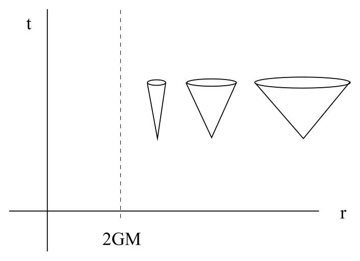
  <figcaption>施瓦西坐标中的径向光锥。</figcaption>
</figure>

因此，至少在这个坐标系里，一束接近 $r=2GM$ 的光似乎永远也到不了那里；它看上去只会渐近于这个半径。

我们将会看到，这是一种假象；光线（或有质量粒子）实际上毫无困难便能到达 $r=2GM$。然而，远处的观察者永远无法确认这一点。假如我们留在外面，而一位勇敢无畏、从事观测的广义相对论学家纵身跃入黑洞并始终向外发送信号，我们只会看到这些信号越来越慢地抵达我们。

<figure>
  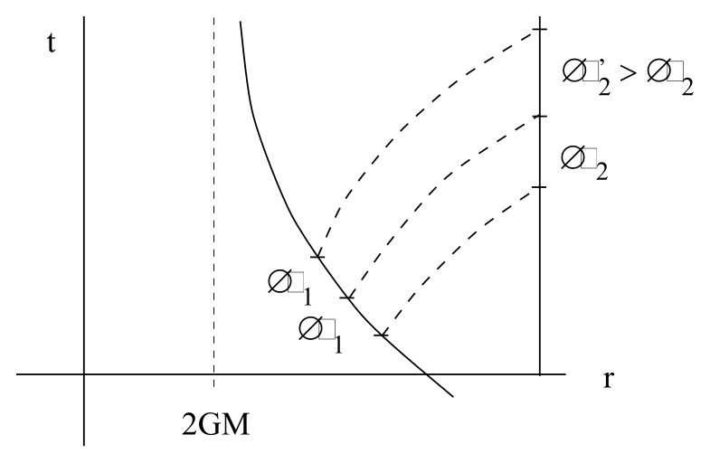
  <figcaption>远方观察者看到下落者逐渐逼近事件视界。</figcaption>
</figure>

这一点从图中应当已经很清楚，也得到了我们讨论引力红移时对 $\Delta\tau_1/\Delta\tau_2$ 所作计算 (7.61) 的证实。随着下落的宇航员接近 $r=2GM$，他们固有时中的任意固定间隔 $\Delta\tau_1$，从我们的视角看，都对应着越来越长的间隔 $\Delta\tau_2$。这种趋势会永远持续下去；我们绝不会看到宇航员穿过 $r=2GM$，只会看到他们运动得越来越慢（而且变得越来越红，仿佛他们正为自己做出跳进黑洞这种蠢事而羞红了脸）。

我们永远看不到下落的宇航员抵达 $r=2GM$，这是一个有意义的陈述；但说他们在 $t$-$r$ 平面中的轨迹永远到不了那里，却没有同样的意义。后一个说法高度依赖于我们的坐标系，而我们希望提出一个更独立于坐标的问题（例如，宇航员能否在有限的固有时内到达这个半径？）。做到这一点的最佳办法，是换用一个在 $r=2GM$ 处表现更好的坐标系。这样的坐标确实存在，我们现在就来寻找。坐标变换当然无从“推导”；我们只能给出新坐标，然后把它们代入公式。不过，我们会分几步建立这些坐标，希望由此让每一步选择显得多少有些动机。

## 乌龟坐标与 Eddington-Finkelstein 坐标

当前坐标的问题在于，沿着径向零测地线有 $dt/dr\rightarrow \infty$；当这些测地线接近 $r=2GM$ 时，沿 $r$ 方向的进展相对于坐标时间 $t$ 变得越来越慢。我们可以尝试用一个沿零测地线“走得更慢”的坐标取代 $t$，以修复这个问题。首先注意，刻画径向零曲线的条件 (7.64) 可以显式求解为
$$
t = \pm r^* +{\rm ~constant}\ ,
\tag{7.65}
$$
其中，**乌龟坐标** $r^*$ 定义为
$$
r^* = r+2GM \ln\left({{r}\over{2GM}}-1\right)\ .
\tag{7.66}
$$
（乌龟坐标只有在所关联的 $r$ 满足 $r\geq 2GM$ 时才有明确意义；不过越过那里以后，我们原来的坐标本来就不太好用。）用乌龟坐标表示，施瓦西度规变成
$$
ds^2 = \left(1-{{2GM}\over r}\right)\left(-{\rm d}t^2
  +{\rm d}{r^*}^2 \right) + r^2 d\Omega^2\ ,
\tag{7.67}
$$
这里把 $r$ 看成 $r^*$ 的函数。这算是取得了一些进展，因为光锥看起来不再闭拢；此外，没有任何度规系数在 $r=2GM$ 处变为无穷大（尽管 $g_{tt}$ 和 $g_{r^* r^*}$ 都变为零）。然而，我们付出的代价是：所关注的曲面 $r=2GM$ 被直接推到了无穷远处。

<figure>
  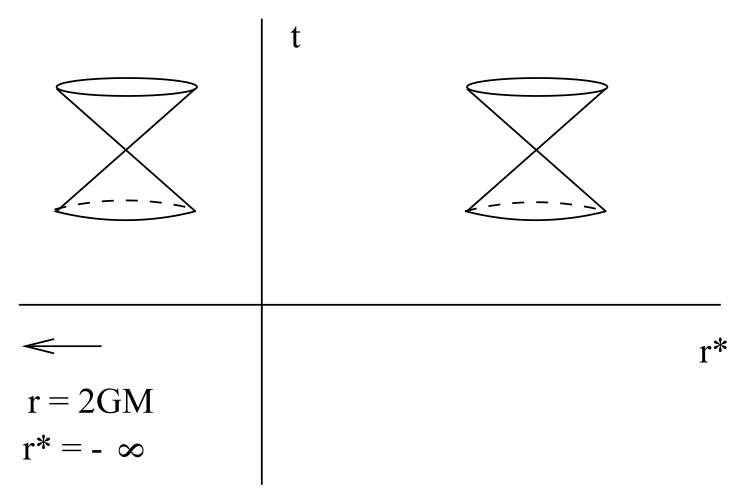
  <figcaption>乌龟坐标中的径向光锥与视界。</figcaption>
</figure>

下一步是定义自然适应零测地线的坐标。令
$$
\begin{aligned}
\tilde u &=&  t+r^*\cr \tilde v &=&  t-r^*\ ,
\end{aligned}
\tag{7.68}
$$
那么，向内落下的径向零测地线由 $\tilde u =$ 常量刻画，而向外传播的径向零测地线则满足 $\tilde v =$ 常量。现在考虑重新使用原来的径向坐标 $r$，同时把类时坐标 $t$ 换成新坐标 $\tilde u$。它们称为 **Eddington-Finkelstein 坐标**。用这组坐标表示，度规为
$$
ds^2 = -\left(1-{{2GM}\over r}\right){\rm d}{\tilde u}^2 +
  ({\rm d}\tilde u {\rm d}r + {\rm d}r{\rm d}\tilde u) + r^2 d\Omega^2\ .
\tag{7.69}
$$
我们在这里第一次看到了真正的进展。尽管度规系数 $g_{\tilde u \tilde u}$ 在 $r=2GM$ 处为零，却不存在真正的退化；度规的行列式是
$$
g = -r^4 \sin^2\theta\ ,
\tag{7.70}
$$
它在 $r=2GM$ 处完全正则。因此度规可逆，我们由此彻底看清：$r=2GM$ 在最初的 $(t,r,\theta,\phi)$ 坐标系中只是一个坐标奇性。在 Eddington-Finkelstein 坐标中，径向零曲线的条件可解为
$$
{{d\tilde u}\over {dr}} = \cases{ 0\ ,& {\rm (infalling)}\cr
  2\left(1-{{2GM}\over r}\right)^{-1}\ .& {\rm (outgoing)}\cr}
\tag{7.71}
$$
因此，我们可以看清发生了什么：在这个坐标系里，光锥在 $r=2GM$ 处始终表现良好，而且该曲面位于有限的坐标值上。沿零粒子或类时粒子的路径追踪它们穿过该曲面，没有任何困难。另一方面，这里的确发生了一件有趣的事。光锥虽然没有闭拢，却发生了倾斜，使得在 $r< 2GM$ 时，所有指向未来的路径都朝着 $r$ 减小的方向延伸。

<figure>
  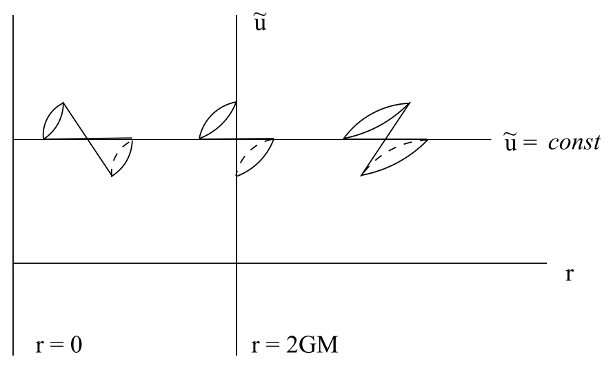
  <figcaption>穿过事件视界时，光锥保持正则并向较小的 r 倾斜。</figcaption>
</figure>

曲面 $r=2GM$ 在局部完全正则，但从整体上说，它充当了一个有去无回的分界面——测试粒子一旦落到它的下方，就再也无法回来。正因如此，$r=2GM$ 称为**事件视界**；位于 $r\leq 2GM$ 的事件无法影响任何位于 $r>2GM$ 的事件。请注意，事件视界是零曲面，并非类时曲面。还要注意，由于没有任何东西能逃出事件视界，我们不可能“看见内部”——**黑洞**一名正由此而来。

让我们回顾一下已经做过的事情。我们怀疑原来的坐标可能无法良好覆盖整个流形，于是把最初的坐标 $t$ 换成了新坐标 $\tilde u$；这个新坐标有一个很好的性质：减小 $r$，并沿着径向零曲线 $\tilde u =$ 常量前进，就能毫无困难地直接穿过事件视界。（事实上，一位亲身完成这趟旅程的局部观察者未必会知道自己何时越过了事件视界——这里的局部几何与其他任何地方都没有区别。）因此，我们得出结论：先前的怀疑是正确的，最初的坐标系确实没有良好覆盖整个流形。时空中理应包含 $r\leq 2GM$ 区域，因为物理粒子能够轻易到达那里并穿行而过。不过，我们无法保证工作已经完成；也许沿其他方向还可以继续延拓流形。

## 向过去与未来延拓

事实上确实如此。注意，在 $(\tilde u, r)$ 坐标系里，我们可以沿指向未来的路径穿过事件视界，却不能沿指向过去的路径穿过它。这看上去不太合理，因为出发点是一个与时间无关的解。不过，我们原本也可以选择 $\tilde v$ 而非 $\tilde u$；在那种情况下，度规将是
$$
ds^2 = -\left(1-{{2GM}\over r}\right){\rm d}{\tilde v}^2
  -({\rm d}\tilde v{\rm d}r + {\rm d}r{\rm d}\tilde v) + r^2 d\Omega^2\ .
\tag{7.72}
$$
现在，我们又可以穿过事件视界了，只不过这一次仅能沿指向过去的曲线穿过。

<figure>
  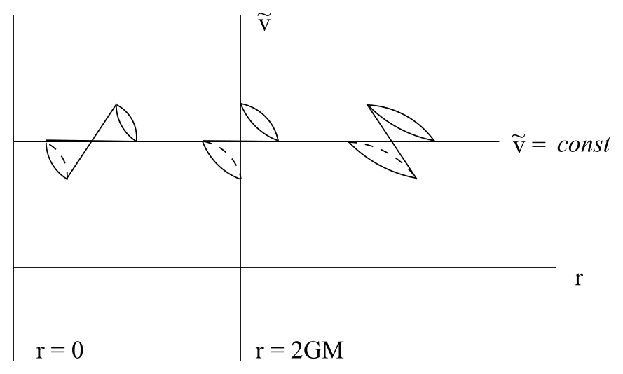
  <figcaption>适于沿过去方向穿越视界的坐标延拓。</figcaption>
</figure>

这或许令人惊讶：我们可以相容地沿指向未来或指向过去的曲线穿过 $r=2GM$，但会到达不同的地方。其实这原本就在意料之中，因为根据定义 (7.68)，若保持 $\tilde u$ 不变并减小 $r$，必有 $t\rightarrow +\infty$；若保持 $\tilde v$ 不变并减小 $r$，则必有 $t\rightarrow -\infty$。（乌龟坐标 $r^*$ 趋于 $-\infty$，同时 $r\rightarrow 2GM$。）所以，我们已经沿两个不同方向延拓了时空，一个指向未来，一个指向过去。

下一步本该沿类空测地线继续追踪，看看是否还会发现更多区域。答案是肯定的，我们将到达时空的又一个部分；不过，让我们定义一组处处良好的坐标，直接走一条捷径。第一个猜想也许是同时使用 $\tilde u$ 和 $\tilde v$（取代 $t$ 与 $r$），这会得到
$$
ds^2 = {1\over 2}\left(1-{{2GM}\over r}\right)({\rm d}{\tilde u}
  {\rm d}{\tilde v}+{\rm d}{\tilde v}{\rm d}{\tilde u}) +r^2 d\Omega^2\ ,
\tag{7.73}
$$
其中，$r$ 由 $\tilde u$ 与 $\tilde v$ 通过下式隐式定义：
$$
{1\over 2}(\tilde u-\tilde v)=
  r+2GM \ln\left({{r}\over{2GM}}-1\right)\ .
\tag{7.74}
$$
这样一来，我们实际上重新引入了最初的退化；在这些坐标中，$r=2GM$ 位于“无穷远处”（对应 $\tilde u=-\infty$ 或 $\tilde v=+\infty$）。正确的做法是换用能把这些点拉回到有限坐标值的坐标；一个很好的选择是
$$
\begin{aligned}
u' &=&  e^{\tilde u/4GM} \cr v' &=&  e^{-\tilde v/4GM}\ ,
\end{aligned}
\tag{7.75}
$$
用原来的 $(t,r)$ 坐标系表示，就是
$$
\begin{aligned}
u' &=&  \left({{r}\over{2GM}}-1\right)^{1/2}e^{(r+t)/4GM} \cr
  v' &=&  \left({{r}\over{2GM}}-1\right)^{1/2}e^{(r-t)/4GM}\ .
\end{aligned}
\tag{7.76}
$$
在 $(u',v',\theta,\phi)$ 坐标系中，施瓦西度规为
$$
ds^2 =-{{16 G^3M^3}\over{r}}e^{-r/2GM}({\rm d}u' {\rm d}v'+ {\rm d}v' {\rm d}u')
  +r^2 d\Omega^2\ .
\tag{7.77}
$$
至此，$r=2GM$ 的非奇异性质终于彻底显现出来；在这种形式下，没有任何度规系数在事件视界处表现出特殊行为。

## Kruskal 坐标与最大延拓

$u'$ 和 $v'$ 都是类光坐标，这意味着它们的偏导数 $\partial/\partial u'$ 和 $\partial/\partial v'$ 是类光向量。这没有任何问题，因为在这个坐标系里，四个偏导向量（两个类光向量与两个类空向量）的集合完全可以充当切空间的一组良好基。不过，我们还是更习惯使用一个坐标类时、其余坐标类空的坐标系。因此定义
$$
\begin{aligned}
u &=&  {1\over 2}(u'-v')\cr
  &=&  \left({{r}\over{2GM}}-1\right)^{1/2}e^{r/4GM}\cosh(t/4GM)
\end{aligned}
\tag{7.78}
$$
以及
$$
\begin{aligned}
v &=&  {1\over 2}(u'+v')\cr
  &=&  \left({{r}\over{2GM}}-1\right)^{1/2}e^{r/4GM}\sinh(t/4GM)\ ,
\end{aligned}
\tag{7.79}
$$
用它们表示，度规变为
$$
ds^2 ={{32 G^3M^3}\over{r}}e^{-r/2GM}(-{\rm d}v^2+{\rm d}u^2)
  +r^2 d\Omega^2\ ,
\tag{7.80}
$$
其中 $r$ 由下式隐式定义：
$$
(u^2-v^2)=
  \left({{r}\over{2GM}}-1\right)e^{r/2GM}\ .
\tag{7.81}
$$
坐标 $(v,u,\theta,\phi)$ 称为 **Kruskal 坐标**，有时也称 Kruskal-Szekres 坐标。注意，$v$ 是类时坐标。

Kruskal 坐标具有许多近乎神奇的性质。与 $(t,r^*)$ 坐标相同，径向零曲线看起来与平直空间中的一样：
$$
v= \pm u + {\rm constant}\ .
\tag{7.82}
$$
然而，它又与 $(t,r^*)$ 坐标不同：事件视界 $r=2GM$ 并不位于无穷远处；事实上，它由
$$
v = \pm u\ ,
\tag{7.83}
$$
定义，这与它是零曲面的性质一致。更一般地，可以考虑 $r=$ 常量的曲面。由 (7.81)，它们满足
$$
u^2-v^2 = {\rm ~constant}\ .
\tag{7.84}
$$
因此，在 $u$-$v$ 平面中，它们表现为双曲线。此外，$t$ 为常量的曲面由
$$
{v\over u} = \tanh(t/4GM)\ ,
\tag{7.85}
$$
给出，它定义了穿过原点、斜率为 $\tanh(t/4GM)$ 的直线。注意，当 $t\rightarrow \pm\infty$ 时，它就变成 (7.83)；所以这些曲面正是 $r=2GM$。

现在，应该允许坐标 $(v,u)$ 取遍它们在不撞上 $r=2GM$ 处真正奇点的情况下所能取到的每一个值；因此允许区域是 $-\infty \leq u \leq \infty$ 且 $v^2 < u^2+1$。现在，我们可以在 $v$-$u$ 平面内画出一幅时空图（略去 $\theta$ 与 $\phi$），称为“Kruskal 图”，它表示与施瓦西度规相对应的完整时空。

<figure>
  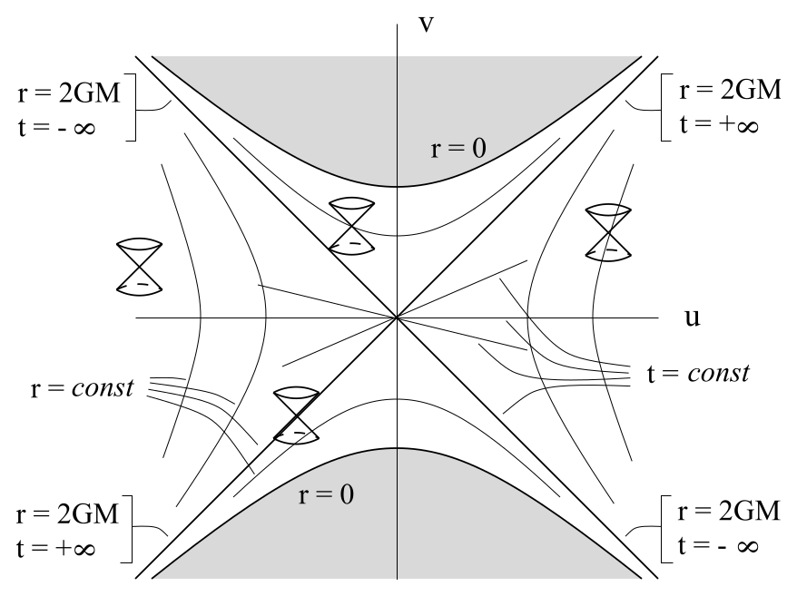
  <figcaption>完整施瓦西时空的 Kruskal 图。</figcaption>
</figure>

图中的每一点都代表一个二维球面。

我们原来的坐标 $(t,r)$ 只在 $r>2GM$ 时良好，而这只是 Kruskal 图所描绘流形的一部分。把整幅图分成四个区域会很方便：

<figure>
  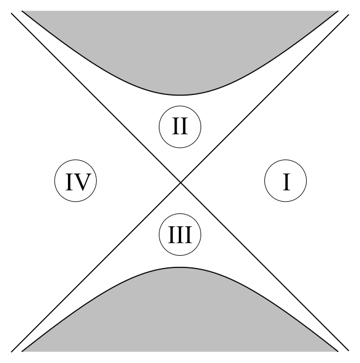
  <figcaption>Kruskal 图中的区域 I、II、III 与 IV。</figcaption>
</figure>

最初所在的是区域 I；沿指向未来的零射线追踪，我们到达了区域 II；沿指向过去的零射线追踪，我们到达了区域 III。如果探索类空测地线，则会被引向区域 IV。把 $(u,v)$ 与 $(t,r)$ 联系起来的定义 (7.78) 和 (7.79)，严格说来只在区域 I 有效；在其他区域中，必须引入适当的负号，防止坐标变成虚数。

## 施瓦西时空的整体结构

把施瓦西几何尽可能延拓之后，我们得到的是一个非同寻常的时空。区域 II 当然就是我们所说的黑洞。任何东西一旦从区域 I 进入 II，就永远无法返回。事实上，区域 II 中每一条指向未来的路径最终都会撞上 $r=0$ 处的奇点；一旦进入事件视界，你就彻底在劫难逃。这一点值得强调：你不仅无法逃回区域 I，甚至无法阻止自己朝 $r$ 减小的方向运动，因为这就是类时方向。（从原来的坐标系中也能看出这一点；在 $r<2GM$ 时，$t$ 变成类空坐标，$r$ 变成类时坐标。）所以，你无法停止朝奇点运动，正如你无法阻止自己变老。由于沿测地线的固有时取最大值，如果不作挣扎，只是放松下来接近奇点，你反而能活得最久。当然，留给你放松的时间并不多。（而且这段旅程也谈不上轻松；接近奇点时，潮汐力会变成无穷大。当你落向奇点时，双脚与头部会被彼此拉开，躯干则被压缩到无穷薄。一位天体物理学家落入黑洞的可怕死法，详见 Misner、Thorne 和 Wheeler 的第 32.6 节。注意，他们使用的是正交归一标架\[这当然不会让旅程变得更愉快\]。）

区域 III 与 IV 多少有些出人意料。区域 III 只是区域 II 的时间反演：东西可以从这个时空区域逃到我们这里，我们却永远到不了那里。它可以被视为一个“白洞”。过去存在一个奇点，宇宙看起来正是从中迸发出来。区域 III 的边界有时称为过去事件视界，而区域 II 的边界称为未来事件视界。另一方面，无论沿时间向前还是向后，我们都无法从区域 I 到达区域 IV（那边的任何人同样到不了我们这里）。它是时空的另一个渐近平直区域，是我们所在区域的镜像。可以把它看成通过一个“虫洞”与区域 I 相连；虫洞是一种颈状构型，连接着两个不同区域。考虑用 $v$ 为常量的类空曲面对 Kruskal 图进行切片：

<figure>
  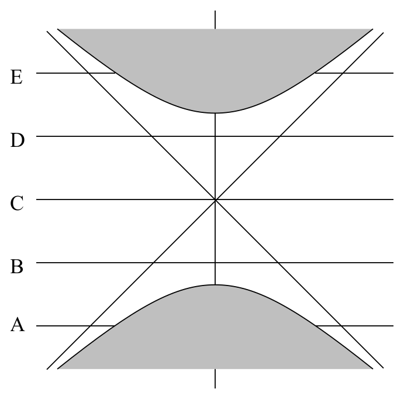
  <figcaption>对 Kruskal 图作常 v 类空切片。</figcaption>
</figure>

现在，为了让图像更清楚，我们恢复一个角坐标，画出每个切片：

<figure>
  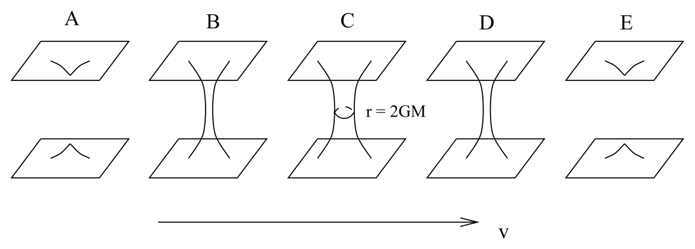
  <figcaption>虫洞形成、连接并再次闭合的空间切片。</figcaption>
</figure>

所以，施瓦西几何实际描述了两个渐近平直区域：它们彼此靠近，通过一个虫洞连接一段时间，随后又断开。然而，虫洞闭合得太快，任何类时观察者都来不及从一个区域穿越到另一个区域。

## 恒星坍缩形成黑洞

两个相互分离的时空彼此靠近片刻，随后又各自离去，这个故事或许显得不太可信。事实上，我们并不期望它在真实世界中发生，因为施瓦西度规无法精确描述整个宇宙。请记住，例如它只在真空中有效，也就是适用于恒星外部。如果恒星半径大于 $2GM$，我们完全不必担心任何事件视界。不过，我们相信确有恒星会在自身引力作用下坍缩，收缩到 $r=2GM$ 以下，并继续坍缩成奇点，最终形成黑洞。然而这里无需出现白洞，因为这类时空的过去与完整施瓦西解的过去完全不同。粗略地说，恒星坍缩的类 Kruskal 图会是下面这样：

<figure>
  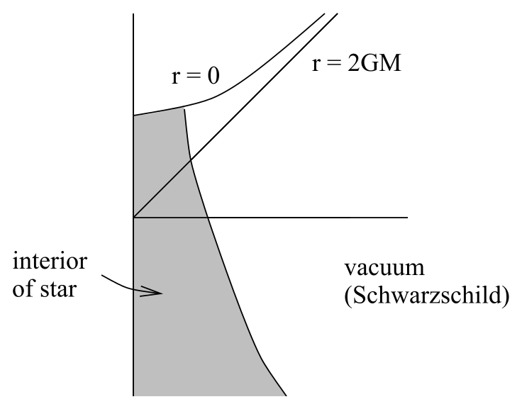
  <figcaption>恒星坍缩时空；阴影区由恒星物质占据。</figcaption>
</figure>

阴影区域不能用施瓦西解描述，因此也就无需为白洞和虫洞费心。

既然谈到了这个主题，我们还可以说说大质量恒星如何形成天体物理黑洞。恒星的一生，就是引力向内拉拽与压力向外支撑之间持续不断的斗争。恒星在核心燃烧核燃料时，压力来自这种燃烧产生的热。（“燃烧”二字应该加上引号，因为核聚变与氧化无关。）燃料耗尽后，温度下降，随着引力开始在这场斗争中占据上风，恒星也开始收缩。最终，当电子被挤压得如此接近，以至于单凭 Pauli 不相容原理（任意两个费米子不能处于同一状态）便抵抗进一步压缩时，这一过程会停止。由此形成的天体称为**白矮星**。然而，如果质量足够大，就连电子简并压力也不足以支撑，电子会在一次剧烈的相变中与质子结合。结果就是一颗**中子星**，它几乎完全由中子组成（尽管我们对中子星内部的了解还很不充分）。由于中子星中心的条件与地球上的条件极不相同，我们并未完全掌握它的状态方程。尽管如此，我们仍相信，质量足够大的中子星本身也无法抵抗引力拉拽，将会继续坍缩。中子流体是我们目前能够设想的密度最高的物质，因此人们相信，这种坍缩不可避免的结局就是黑洞。

半径随质量变化的下图概括了这一过程：

<figure>
  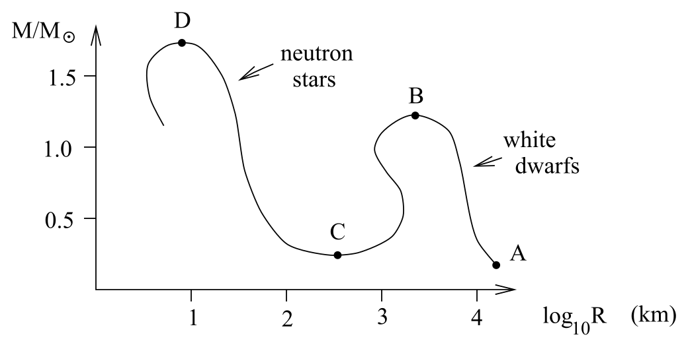
  <figcaption>恒星质量—半径图与致密天体的不同终态。</figcaption>
</figure>

这幅图的要点是：对于任意给定质量 $M$，恒星半径都会不断减小，直至碰到图中的曲线。白矮星位于点 $A$ 与 $B$ 之间，中子星位于点 $C$ 与 $D$ 之间。点 $B$ 的高度略低于 1.4 个太阳质量；点 $D$ 的高度更不确定，但很可能低于 2 个太阳质量。坍缩过程十分复杂，恒星在演化期间可能损失或获得质量，因此很难预测某一颗恒星的最终结局。尽管如此，白矮星随处可见，中子星也并不罕见，还有许多系统被强烈认为包含黑洞。（当然，你无法直接看见黑洞。你能看到的是落向黑洞的物质所发出的辐射；这些物质越接近黑洞就越热，并会释放辐射。）

<!-- CARROLL_NAV_BOTTOM -->
---
[← 测地线、轨道与近日点进动](./02-geodesics-orbits-and-perihelion-precession.md) · [全书入口](../../carroll-general-relativity.md) · [Penrose 图、共形无穷与黑洞无毛定理 →](./04-penrose-diagrams-conformal-infinity-and-no-hair.md)
<!-- /CARROLL_NAV_BOTTOM -->
