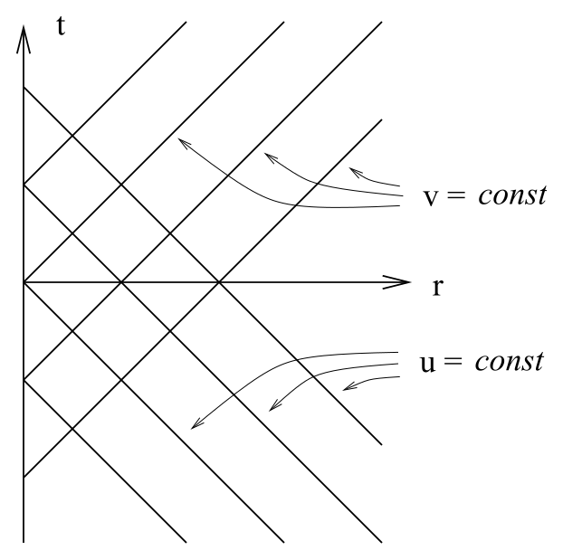
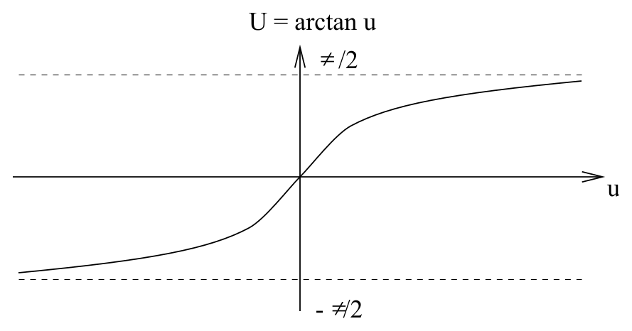
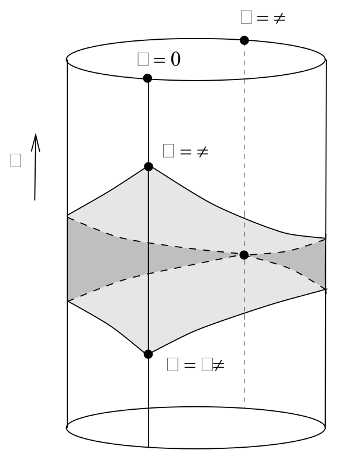
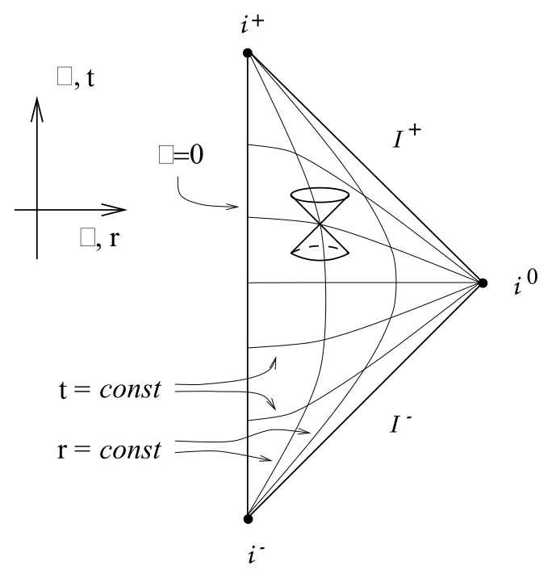
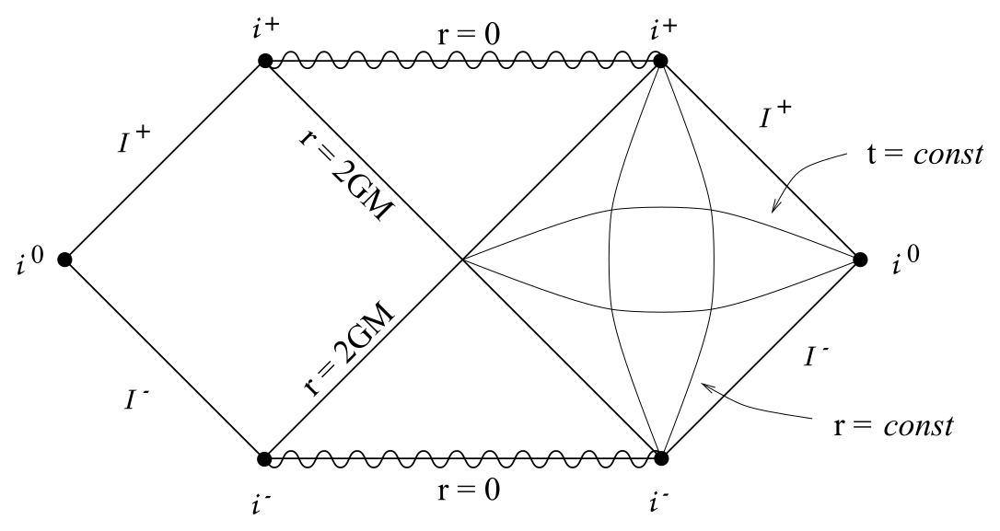
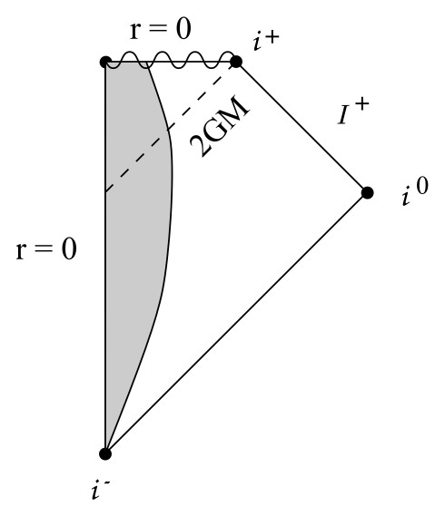
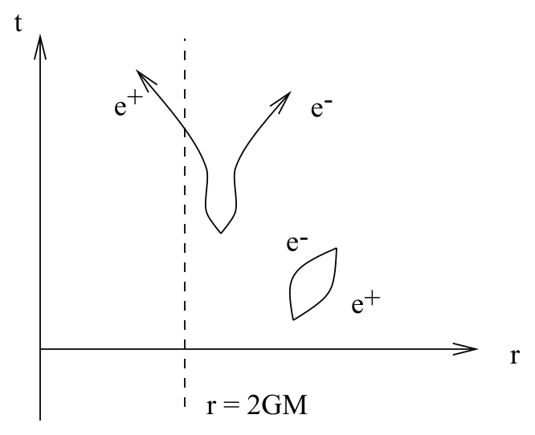
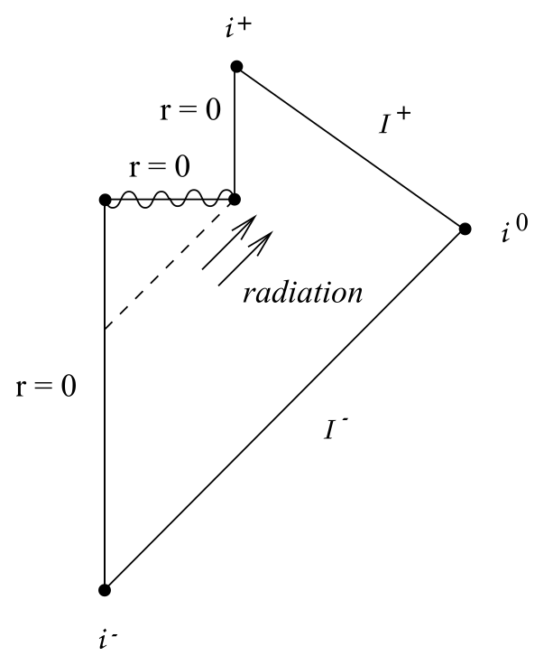

# Penrose 图、共形无穷与黑洞无毛定理

<!-- CARROLL_NAV_TOP -->
> 完整译文 · 原 PDF 第 171–223 页 · [本章入口](../07-schwarzschild-and-black-holes.md) · [全书入口](../../carroll-general-relativity.md)
<!-- /CARROLL_NAV_TOP -->

## 闵可夫斯基时空的共形紧化

我们已经看到，Kruskal 坐标系为表示施瓦西几何提供了一种非常有用的方式。在转向其他类型的黑洞之前，我们还要介绍一种思考这一时空的方式，即 Penrose 图（也称 Carter-Penrose 图或共形图）。其思想是作一次共形变换，把整个流形映到一个紧致区域中，从而能够把时空画在一张纸上。

让我们从闵可夫斯基空间开始，看看这种技巧如何运作。极坐标中的度规为
$$
ds^2 = -{\rm d}t^2 + {\rm d}r^2 + r^2 d\Omega^2\ .
\tag{7.86}
$$
$\theta, \phi$ 坐标不会发生任何反常的事情，但我们要仔细追踪另外两个坐标的取值范围。在这里当然有
$$
\begin{aligned}
& -\infty < t < +\infty&\cr& 0 \leq r < +\infty\ .&
\end{aligned}
\tag{7.87}
$$
严格说来，世界线 $r=0$ 代表一个坐标奇性，应该由另一张坐标卡覆盖；不过我们都知道这里究竟是怎么回事，所以姑且把 $r=0$ 当作表现良好。

如果换用零坐标，我们的任务会稍微容易一些：
$$
\begin{aligned}
u &=&  {1\over 2}(t+r)\cr v &=&  {1\over 2}(t-r)\ ,
\end{aligned}
\tag{7.88}
$$
相应的取值范围是
$$
\begin{aligned}
&-\infty < u < +\infty &\cr &-\infty < v < +\infty &\cr
  & v \leq u\ .&
\end{aligned}
\tag{7.89}
$$

<figure>
  
  <figcaption>闵可夫斯基时空的零坐标区域。</figcaption>
</figure>

这些范围如图所示，其中每一点都代表一个半径为 $r=u-v$ 的二维球面。这组坐标中的度规为
$$
ds^2 = -2({\rm d}u{\rm d}v + {\rm d}v{\rm d}u) +(u-v)^2 d\Omega^2\ .
\tag{7.90}
$$

现在，我们希望换用一组让“无穷远”具有有限坐标值的坐标。一个很好的选择是
$$
\begin{aligned}
U &=&  \arctan u\cr V &=&  \arctan v\ .
\end{aligned}
\tag{7.91}
$$

<figure>
  
  <figcaption>反正切变换把无穷远压缩到有限坐标值。</figcaption>
</figure>

此时的取值范围为
$$
\begin{aligned}
&-\pi/2  < U < +\pi/2&\cr &-\pi/2  < V < +\pi/2&\cr
  & V \leq U\ .&
\end{aligned}
\tag{7.92}
$$
为了得到度规，使用
$$
{\rm d}U = {{{\rm d}u}\over{1+u^2}}\ ,%\qquad \d V = {{\d v}\over{1+v^2}}\ ,
\tag{7.93}
$$
以及
$$
\cos(\arctan{u}) = {{1}\over{\sqrt{1+u^2}}}\ ,
\tag{7.94}
$$
对 $v$ 也同样处理。于是得到
$$
{\rm d}u{\rm d}v + {\rm d}v{\rm d}u = {{1}\over{\cos^2U \cos^2V}}
  ({\rm d}U{\rm d}V + {\rm d}V{\rm d}U)\ .
\tag{7.95}
$$
与此同时，
$$
\begin{aligned}
(u-v)^2 &=&  (\tan U - \tan V)^2\cr
  &=& {{1}\over{\cos^2U \cos^2V}}(\sin U\cos V- \cos U \sin V)^2\cr
  &=& {{1}\over{\cos^2U \cos^2V}}\sin^2(U-V)\ .
\end{aligned}
\tag{7.96}
$$
因此，这组坐标中的闵可夫斯基度规为
$$
ds^2 = {{1}\over{\cos^2U \cos^2V}}\left[ -2({\rm d}U{\rm d}V + {\rm d}V{\rm d}U)
  +\sin^2(U-V)d\Omega^2\right]\ .
\tag{7.97}
$$

这个结果颇为赏心悦目，因为度规表现为一个相当简单的表达式乘以一个整体因子。通过以下变换，重新采用一个类时坐标 $\eta$ 和一个类空（径向）坐标 $\chi$，还可以把它写得更好：
$$
\begin{aligned}
\eta &=&  U+V\cr \chi &=&  U-V\ ,
\end{aligned}
\tag{7.98}
$$
它们的取值范围为
$$
\begin{aligned}
& -\pi< \eta < +\pi & \cr &  0  \leq \chi < +\pi\ . &
\end{aligned}
\tag{7.99}
$$
现在度规为
$$
ds^2 = \omega^{-2}\left(-{\rm d}\eta^2 + {\rm d}\chi^2 +\sin^2\chi\
  d\Omega^2\right)\ ,
\tag{7.100}
$$
其中
$$
\begin{aligned}
\omega &=&  \cos U \cos V\cr &=&  {1\over 2}
  (\cos\eta +\cos\chi)\ .
\end{aligned}
\tag{7.101}
$$

因此，可以把闵可夫斯基度规视为通过共形变换与下面这个“非物理”度规相关：
$$
\begin{aligned}
d\bar{s}^2 &=&  \omega^2 ds^2\cr
  &=& -{\rm d}\eta^2 + {\rm d}\chi^2 +\sin^2\chi\ d\Omega^2\ .
\end{aligned}
\tag{7.102}
$$
它描述流形 ${\bf R}\times S^3$，其中三维球面是最大对称且静态的。这个度规中存在曲率，它也不是真空 Einstein 方程的解。这不应使我们困扰，因为它是非物理的；通过共形变换得到的真实物理度规就是平直时空。事实上，这个度规正是“Einstein 静态宇宙”的度规；后者是 Einstein 方程在存在理想流体和宇宙学常数时的一个静态（但不稳定）解。当然，${\bf R}\times S^3$ 上坐标的完整范围通常应为 $-\infty < \eta < +\infty$、$0\leq\chi \leq\pi$，而闵可夫斯基空间只被映到 (7.99) 所定义的子空间。整个 ${\bf R}\times S^3$ 可以画成一个圆柱，其中每个圆都是一个三维球面，如下一页所示。

<figure>
  
  <figcaption>Einstein 静态宇宙圆柱中的闵可夫斯基时空。</figcaption>
</figure>

阴影区域表示闵可夫斯基空间。注意，这个圆柱上的每一点 $(\eta,\chi)$ 都是一个二维球面的一半，另一半对应点 $(\eta,-\chi)$。可以把阴影区域展开，将闵可夫斯基空间画成一个三角形，如图所示。

<figure>
  
  <figcaption>闵可夫斯基时空的 Penrose 图。</figcaption>
</figure>

这就是 **Penrose 图**。图中的每一点都代表一个二维球面。

## 共形无穷的结构

实际上，闵可夫斯基空间只对应上图的*内部*（包括 $\chi=0$）；边界并不属于原来的时空。这些边界合称为**共形无穷**。Penrose 图的结构使我们可以把共形无穷分成几个不同区域：
$$
\begin{array}{rcl}
  i^+ &=&  {\rm future~timelike~infinity~} (\eta=\pi\ ,\ \chi=0)\cr
  i^0 &=&  {\rm spatial~infinity~} (\eta=0\ ,\ \chi=\pi)\cr
  i^- &=&  {\rm past~timelike~infinity~} (\eta=-\pi\ ,\ \chi=0)\cr
  {\cal I}^+ &=& {\rm future~null~infinity~} (\eta=\pi-\chi\ ,\ 0<\chi<\pi)\cr
  {\cal I}^- &=& {\rm past~null~infinity~} (\eta=-\pi+\chi\ ,\ 0<\chi<\pi)
  \end{array}
$$
（${\cal I}^+$ 与 ${\cal I}^-$ 分别读作“scri-plus”和“scri-minus”。）注意，$i^+$、$i^0$ 与 $i^-$ 实际上都是*点*，因为 $\chi=0$ 与 $\chi=\pi$ 分别是 $S^3$ 的北极和南极。与此同时，${\cal I}^+$ 与 ${\cal I}^-$ 实际上是零曲面，其拓扑为 ${\bf R}\times S^2$。

闵可夫斯基时空的 Penrose 图有许多重要特征。点 $i^+$ 与 $i^-$ 可以看成一族法向量为类时的类空曲面的极限；反过来，$i^0$ 可以看成一族法向量为类空的类时曲面的极限。径向零测地线在图中与坐标轴成 $\pm 45^\circ$。所有类时测地线都始于 $i^-$、终于 $i^+$；所有零测地线都始于 ${\cal I}^-$、终于 ${\cal I}^+$；所有类空测地线的起点与终点都是 $i^0$。另一方面，也可以存在终止于零无穷的非测地类时曲线（如果它们变得“渐近类光”）。

能把整个闵可夫斯基空间画在一小张纸上固然很好，但我们并没有因此学到多少原先不知道的内容。当我们想表示稍微更有趣的时空，例如黑洞时空时，Penrose 图会更有用。Penrose 图最初的用途，是把其他时空“在无穷远处”与闵可夫斯基空间比较——“渐近平直”的严格定义大体上就是：一个时空拥有与闵可夫斯基空间相同的共形无穷。我们不会深入讨论这些问题，而会直接转向施瓦西黑洞 Penrose 图的分析。

## 施瓦西黑洞的 Penrose 图

我们不会详细推演所需的变换，因为它们与闵可夫斯基情形平行，只是代数复杂得多。第一步可以从 Kruskal 坐标的零坐标版本开始，此时度规具有形式
$$
ds^2 =-{{16 G^3M^3}\over{r}}e^{-r/2GM}({\rm d}u' {\rm d}v'+ {\rm d}v' {\rm d}u')
  +r^2 d\Omega^2\ ,
\tag{7.103}
$$
其中 $r$ 通过下式隐式定义：
$$
u'v' = \left({{r}\over{2GM}}-1\right)e^{r/2GM}\ .
\tag{7.104}
$$
接下来，基本上只需采用平直时空中所用的同一种变换，就足以把无穷远带到有限的坐标值：
$$
\begin{aligned}
u'' &=&  \arctan\left({{u'}\over{\sqrt{2GM}}}\right)\cr
  v'' &=&  \arctan\left({{v'}\over{\sqrt{2GM}}}\right)\ ,
\end{aligned}
\tag{7.105}
$$
其取值范围为
$$
\begin{array}{c}
  -\pi/2 < u'' < +\pi/2\cr -\pi/2 < v'' < +\pi/2\cr
  -\pi < u'' + v'' < \pi\ .
\end{array}
$$
度规的 $(u'',v'')$ 部分（即角坐标保持不变的部分）此时与闵可夫斯基空间共形相关。在新坐标中，$r=0$ 处的奇点是两条直线，从一个渐近区域的类时无穷延伸到另一个渐近区域的类时无穷。因此，最大延拓施瓦西解的 Penrose 图如下：

<figure>
  
  <figcaption>最大延拓施瓦西时空的 Penrose 图。</figcaption>
</figure>

这幅图唯一真正微妙的地方，是必须理解 $i^+$ 和 $i^-$ 与 $r=0$ 并不相同（有许多类时路径不会撞上奇点）。还要注意，共形无穷的结构与闵可夫斯基空间完全一样，这与施瓦西时空渐近平直的说法一致。此外，形成黑洞的坍缩恒星，其 Penrose 图也正如你可能预期的那样，见下一页。

<figure>
  
  <figcaption>恒星坍缩并形成黑洞的 Penrose 图。</figcaption>
</figure>

这些时空的 Penrose 图再次没有告诉我们原先不知道的内容；等到考察更一般的黑洞时，它们的用途就会显现出来。原则上，黑洞可能具有各种各样的类型，具体取决于它们的形成过程。然而，令人惊讶的是，事实并非如此；无论黑洞如何形成，它都会（相当迅速地）稳定到一种只由质量、电荷和角动量刻画的状态。这个性质必须针对人们设想可能参与构成黑洞的各种场逐一证明，通常概括为**“黑洞无毛”**。例如，可以证明，由初始时不均匀的坍缩形成的黑洞，会通过发射引力辐射“抖落”所有凹凸不平。这就是一个“无毛定理”的例子。因此，如果我们关心黑洞稳定下来之后的形式，只需要考察带电黑洞和旋转黑洞。在这两种情形下，度规都有精确解可供我们仔细研究。

## Hawking 辐射与信息丢失问题

不过，我们先短暂绕道看看黑洞蒸发的世界。设想一个黑洞在“蒸发”颇为奇怪，但在真实世界中，黑洞并不真正漆黑——它们会像温度为 $`T=\hbar/8\pi
kGM`$ 的黑体那样辐射能量，其中 $M$ 是黑洞质量，$k$ 是 Boltzmann 常数。这个效应称为 **Hawking 辐射**；推导它需要使用弯曲时空中的量子场论，远远超出了我们目前的范围。尽管如此，它背后的非正式想法仍然可以理解。

<figure>
  
  <figcaption>事件视界附近的粒子对与 Hawking 辐射示意图。</figcaption>
</figure>

量子场论中存在“真空涨落”——粒子与反粒子对在空无一物的空间里自发产生和湮灭。这些涨落与简谐振子的零点涨落完全类似。通常无法探测这种涨落，因为取平均后它们给出的总能量为零（尽管没人知道为什么；这就是宇宙学常数问题）。然而，在事件视界存在时，虚粒子对中的一个成员偶尔会落入黑洞，而它的伙伴则逃向无穷远。抵达无穷远的粒子必定具有正能量，但总能量守恒；因此，黑洞必须损失质量。（如果愿意，也可以把落进去的粒子想成具有负质量。）我们把逃逸粒子看作 Hawking 辐射。这个效应并不强，而且温度随质量增大而降低，所以对质量与太阳相当的黑洞而言，它完全可以忽略。不过，原则上黑洞可以通过 Hawking 辐射损失全部质量，并在这个过程中收缩到什么都不剩。相应的 Penrose 图可能如下所示：

<figure>
  
  <figcaption>黑洞完全蒸发的一种候选 Penrose 图。</figcaption>
</figure>

另一方面，它也可能并非如此。这幅图的问题是“信息丢失”——如果在奇点的过去画出一个类空曲面，并把它向未来演化，其中一部分最终会撞上奇点而被摧毁。结果，辐射本身包含的信息少于最初存在于时空中的信息。（这比黑洞无毛还要糟糕。认为信息被困在事件视界内部是一回事，认为信息已经彻底消失则更加令人担忧。）然而，这种过程违反了广义相对论和量子场论都内含的信息守恒，而正是这两个理论共同导出了上述预言。如今，这个悖论被视为一个重大问题，人们正从许多方向努力理解如何以某种方式取回信息。目前流行的一种解释依赖弦理论，大意是黑洞其实有很多“毛”，其形式是生活在事件视界附近的虚弦态。听说我们不会非常仔细地研究这个问题，希望你不会失望；不过，你应该知道问题是什么，也应知道它如今仍是一个活跃的研究领域。

<!-- CARROLL_NAV_BOTTOM -->
---
[← 事件视界、Kruskal 坐标与引力坍缩](./03-event-horizon-kruskal-and-collapse.md) · [全书入口](../../carroll-general-relativity.md) · [带电黑洞、宇宙审查与极端性 →](./05-charged-black-holes-censorship-and-extremality.md)
<!-- /CARROLL_NAV_BOTTOM -->
