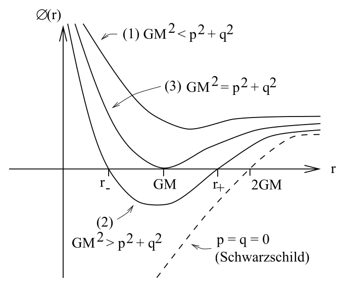
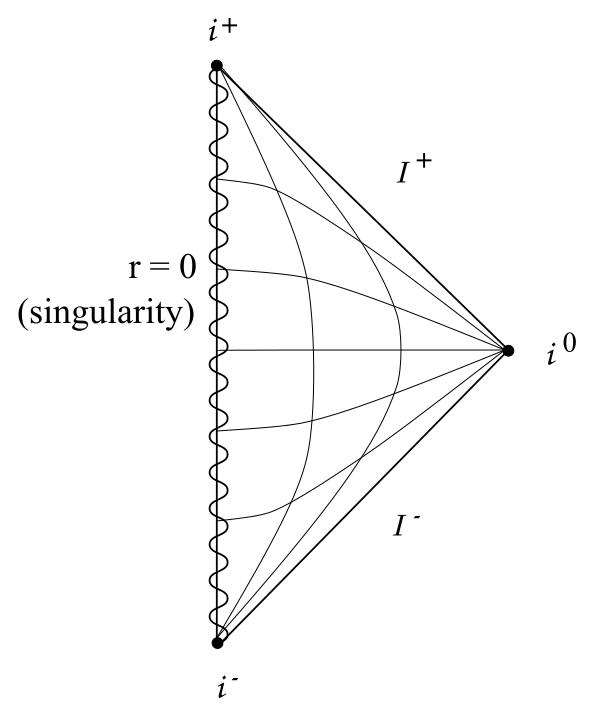
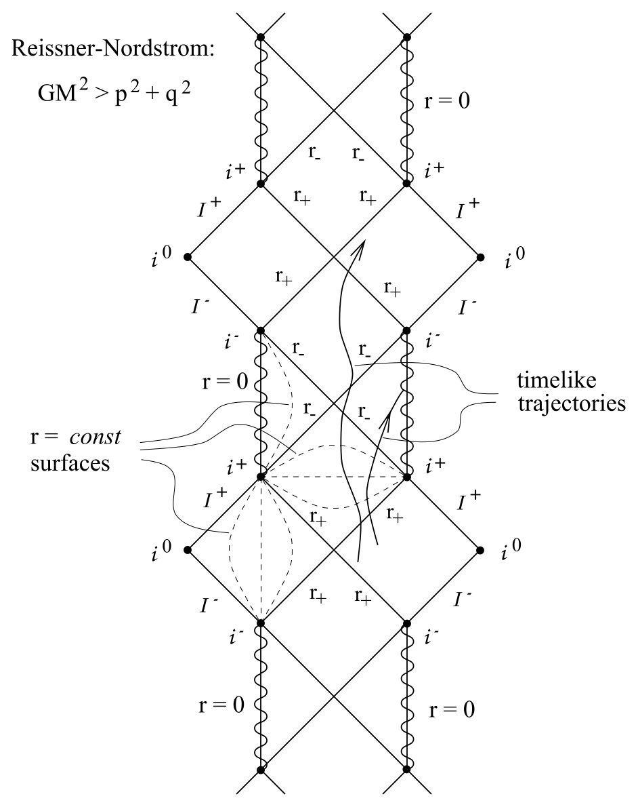
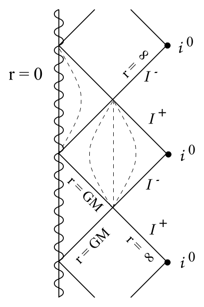

# 带电黑洞、宇宙审查与极端性

<!-- CARROLL_NAV_TOP -->
> 完整译文 · 原 PDF 第 171–223 页 · [本章入口](../07-schwarzschild-and-black-holes.md) · [全书入口](../../carroll-general-relativity.md)
<!-- /CARROLL_NAV_TOP -->

## Reissner–Nordstrøm 解

把这些问题处理完后，我们现在转向带电黑洞。乍看之下，它们似乎是相当合理的对象，因为当然没有什么能阻止我们把一些净电荷投入一个原先不带电的黑洞。不过在天体物理情形中，总电荷量预计会非常小，尤其是把它与质量作比较时（这里比较的是二者相对的引力效应）。尽管如此，带电黑洞为各种思想实验提供了有用的试验场，因此值得我们考察。

在这种情形下，问题仍然具有完整的球对称性；所以我们知道，度规可以写成
$$
ds^2 = -e^{2\alpha(r,t)}{\rm d}t^2 + e^{2\beta(r,t)}{\rm d}r^2 +
  r^2 d\Omega^2\ .
\tag{7.106}
$$
然而现在我们已不再处于真空，因为黑洞将具有非零电磁场，而电磁场又会充当能量—动量的源。电磁场的能量—动量张量为
$$
T_{\mu\nu}= {1\over{4\pi}}(F_{\mu\rho}F_\nu{}^\rho
  -{1\over 4}g_{\mu\nu}F_{\rho\sigma}F^{\rho\sigma})\ ,
\tag{7.107}
$$
其中 $F_{\mu\nu}$ 是电磁场强张量。由于具有球对称性，最一般的场强张量将具有分量
$$
\begin{aligned}
F_{tr} &=&  f(r,t) = -F_{rt}\cr
  F_{\theta\phi} &=&  g(r,t)\sin\theta = -F_{\phi\theta}\ ,
\end{aligned}
\tag{7.108}
$$
其中 $f(r,t)$ 和 $g(r,t)$ 是一些有待通过场方程确定的函数，未写出的分量均为零。$F_{tr}$ 对应径向电场，$F_{\theta\phi}$ 对应径向磁场。（若你正在疑惑为何会出现 $\sin\theta$，请回想一下：应当与 $\theta$ 和 $\phi$ 无关的是磁场的径向分量 $B^r = \epsilon^{01\mu\nu}F_{\mu\nu}$。对于球对称度规，$\epsilon^{\rho\sigma\mu\nu}={1\over{\sqrt{-g}}}\tilde\epsilon^{\rho\sigma\mu\nu}$ 正比于 $(\sin\theta)^{-1}$，因此我们希望一个 $\sin\theta$ 因子出现在 $F_{\theta\phi}$ 中。）此时的场方程同时包括爱因斯坦方程与 Maxwell 方程：
$$
\begin{aligned}
g^{\mu\nu}\nabla_\mu F_{\nu\sigma} &=& 0\cr
  \nabla_{[\mu}F_{\nu\rho]} &=& 0\ .
\end{aligned}
\tag{7.109}
$$
这两组方程相互耦合：电磁场强张量通过能量—动量张量进入爱因斯坦方程，而度规则显式地进入 Maxwell 方程。

不过这些困难并非无法克服；沿用与真空情形相似的步骤，也能得到带电情形的解。我们不逐一展示具体步骤，只给出最终答案。这个解称为 **Reissner–Nordstrøm 度规**，其形式为
$$
ds^2 = -\Delta {\rm d}t^2 + \Delta^{-1}{\rm d}r^2 +
  r^2d\Omega^2\ ,
\tag{7.110}
$$
其中
$$
\Delta = 1-{{2GM}\over r}+{{G(p^2+q^2)}\over{r^2}}\ .
\tag{7.111}
$$
在这个表达式中，$M$ 再次被解释为黑洞的质量；$q$ 是总电荷，$p$ 是总磁荷。自然界中从未观测到孤立磁荷（磁单极子），但这并不妨碍我们写出它们若确实存在时所产生的度规。我们有充分的理论理由认为磁单极子存在，只是极其罕见。（当然，即使不存在任何磁单极子，黑洞仍有可能带有磁荷。）事实上，电荷和磁荷以相同方式进入度规，因此在表达式中保留 $p$ 并不会引入任何额外复杂性。与这个解相伴的电磁场为
$$
\begin{aligned}
F_{tr} &=& - {q\over{r^2}}\cr
  F_{\theta\phi} &=&  p\sin\theta\ .
\end{aligned}
\tag{7.112}
$$
持保守态度的读者若愿意，尽可令 $p=0$。

## 奇点、视界与三种参数情形

由于函数 $\Delta(r)$ 中多出了一个项（可以把它理解为衡量“光锥倾倒了多少”的量），这个度规中的奇点与事件视界结构比施瓦西情形更加复杂。有一点仍然相同：$r=0$ 处存在真正的曲率奇点（可以通过计算曲率标量 $R_{{\mu\nu}\rho\sigma}R^{{\mu\nu}\rho\sigma}$ 来检验）。与此同时，与 $r=2GM$ 对应的是 $\Delta$ 为零处的半径。这会发生在
$$
r_\pm = GM\pm \sqrt{G^2M^2 - G(p^2+q^2)}\ .
\tag{7.113}
$$
依 $GM^2$ 与 $p^2+q^2$ 的相对大小而定，这个方程可能有两个、一个或零个解。因此，我们分别考察每种情形。

<figure>
  
  <figcaption>图 7.28：不同质量—电荷关系会产生不同数目的零点。</figcaption>
</figure>

### $GM^2<p^2+q^2$：裸奇点

在这种情形下，系数 $\Delta$ 始终为正（从不为零），而度规在（$t,r,\theta,\phi$）坐标中一直到 $r=0$ 都完全正则。坐标 $t$ 始终类时，$r$ 始终类空。不过 $r=0$ 处仍然存在奇点，而且现在它是一条类时线。由于没有事件视界，观察者前往奇点并返回、报告所见之事不会受到任何阻碍。这称为**裸奇点**，即没有被视界遮蔽的奇点。然而，仔细分析测地线会发现该奇点具有“排斥性”——类时测地线从不会与 $r=0$ 相交；它们会逐渐接近，随后掉转方向并远离。（零测地线能够到达奇点，非测地的类时曲线也能。）

当 $r\rightarrow\infty$ 时，该解趋近平坦时空；而我们刚刚看到，因果结构在各处都“正常”。所以它的 Penrose 图将与闵可夫斯基空间相同，只不过现在 $r=0$ 是奇点。

<figure>
  
  <figcaption>图 7.29：没有事件视界遮蔽时，类时奇点裸露在外。</figcaption>
</figure>

奇点的裸露有违我们的体面观感，也有违**宇宙审查猜想**。粗略地说，该猜想断言：物理物质构型的引力坍缩永远不会产生裸奇点。（当然，这终究只是一个猜想，未必正确；有些数值模拟声称，纺锤状构型的坍缩可能导致裸奇点。）事实上，我们根本不应期待把一个满足 $GM^2<p^2+q^2$ 的黑洞视为引力坍缩的结果。粗略来说，这个条件表明黑洞的总能量小于仅由电磁场贡献的能量——也就是说，携带电荷的物质本身必须具有负质量。因此，这个解通常被视为非物理的。还要注意，这个时空中不存在良好的 Cauchy 曲面（即每条不可延拓的类时线都与之相交的类空切片），因为类时线可以始于奇点，也可以终于奇点。

### $GM^2>p^2+q^2$：两个事件视界

我们预期真实引力坍缩适用的正是这种情形：电磁场中的能量小于总能量。此时，度规系数 $\Delta(r)$ 在 $r$ 较大和 $r$ 较小时为正，在两个零点 $r_\pm = GM\pm \sqrt{G^2M^2 - G(p^2+q^2)}$ 之间为负。度规在 $r_+$ 和 $r_-$ 处都有坐标奇性；在两处都可以像处理施瓦西情形那样，通过坐标变换消除这些奇性。

<figure>
  
  <figcaption>图 7.30：外、内视界连接着重复出现的渐近平坦区域。</figcaption>
</figure>

由 $r=r_\pm$ 定义的两个曲面都是零曲面，而且确实都是事件视界（稍后我们会把这个说法讲得更精确）。$r=0$ 处的奇点是一条类时线（不像施瓦西情形中那样是类空曲面）。如果你是一位从远处落入黑洞的观察者，那么 $r_+$ 的作用就与施瓦西度规中的 $2GM$ 一样；在这个半径处，$r$ 从类空坐标转变为类时坐标，而你必然朝 $r$ 减小的方向运动。黑洞外部的见证者也会看到与不带电黑洞外部相同的现象——在他们看来，下落的观察者运动得越来越慢，同时红移不断增大。

不过，从 $r_+$ 开始不可避免地朝越来越小半径下落的过程，只持续到你抵达零曲面 $r=r_-$ 为止；在那里，$r$ 又变回类空坐标，朝 $r$ 减小方向的运动便可以停止。因此，你不必撞上 $r=0$ 处的奇点；这是意料之中的，因为 $r=0$ 是一条类时线（所以不一定处在你的未来）。事实上，你既可以选择继续前往 $r=0$，也可以开始朝 $r$ 增大的方向运动，重新穿过 $r=r_-$ 处的零曲面。随后 $r$ 再次成为类时坐标，但取向发生反转；你被迫朝 $r$ *增大*的方向运动。最终，你会再次被吐出到 $r=r_+$ 之外，这就像从白洞中涌出，进入宇宙的其余部分。从这里，你可以选择再度进入黑洞——这一次，进入的是与你最初进入的那个不同的黑洞——并且想重复多少次，就重复多少次。这段小故事对应于随附的 Penrose 图；当然，也可以更严格地导出它：选择适当的坐标，并把 Reissner–Nordstrøm 度规解析延拓到它所能达到的最远处。

这里有多少属于科学，又有多少属于科幻？很可能科学成分不多。设想一位身处黑洞内部、即将穿过 $r_-$ 处事件视界的观察者眼中的世界，你会注意到，他们能够回望并看见外部（渐近平坦）宇宙的全部历史，至少是从黑洞所见的全部历史。但他们在有限的固有时间内看完了这段（无限漫长的）历史——因此，当他们接近 $r_-$ 时，任何抵达他们的信号都会发生无限蓝移。所以有理由相信（尽管据我所知尚无证明），任何进入 Reissner–Nordstrøm 黑洞的非球对称扰动，都会猛烈地扰乱我们所描述的几何。实际几何会是什么样子很难说，但没有什么充分理由相信，它必定包含无限多个渐近平坦区域，而这些区域又经由各种虫洞彼此相连。

### $GM^2=p^2+q^2$：极端黑洞

这种情形称为**极端 Reissner–Nordstrøm 解**（或简称“极端黑洞”）。在某种意义上，质量恰好与电荷达到平衡——我们可以构造出由多个极端黑洞组成的精确解，它们始终相对于彼此保持静止。一方面，极端黑洞是一种有趣的理论玩具；研究信息丢失悖论以及黑洞在量子引力中的作用时，人们经常考察这些解。另一方面，它看起来非常不稳定，因为只要加入一点点物质，就会使它进入第二种情形。

<figure>
  
  <figcaption>图 7.31：极端黑洞只有一个退化视界，类时奇点始终位于左侧。</figcaption>
</figure>

极端黑洞的 $\Delta(r)=0$ 只发生在一个半径上，即 $r=GM$。这里确实代表一个事件视界，但 $r$ 坐标从未成为类时坐标；它在 $r=GM$ 处变为零，而在两侧都是类空的。与其他情形一样，$r=0$ 处的奇点是一条类时线。因此，对于这种黑洞，你仍然可以避开奇点并继续向未来运动，进入渐近平坦区域的更多副本，不过奇点始终位于“左边”。其 Penrose 图如图所示。

<!-- CARROLL_NAV_BOTTOM -->
---
[← Penrose 图、共形无穷与黑洞无毛定理](./04-penrose-diagrams-conformal-infinity-and-no-hair.md) · [全书入口](../../carroll-general-relativity.md) · [Kerr 几何、Killing 张量与能层 →](./06-kerr-geometry-killing-tensors-and-ergosphere.md)
<!-- /CARROLL_NAV_BOTTOM -->
