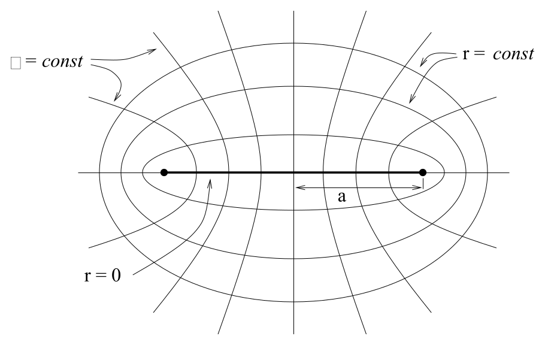
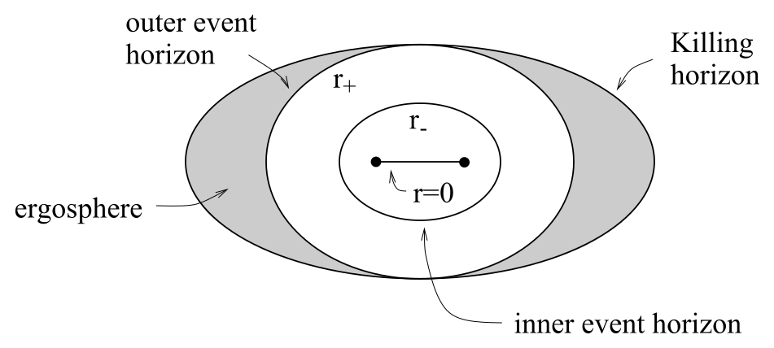
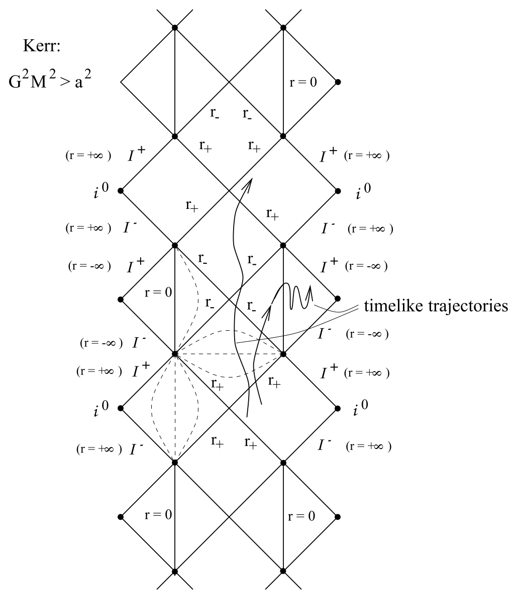

# Kerr 几何、Killing 张量与能层

<!-- CARROLL_NAV_TOP -->
> 完整译文 · 原 PDF 第 171–223 页 · [本章入口](../07-schwarzschild-and-black-holes.md) · [全书入口](../../carroll-general-relativity.md)
<!-- /CARROLL_NAV_TOP -->

## Kerr 度规与 Boyer–Lindquist 坐标

关于带电解，我们当然还可以深入讨论很多细节，不过还是让我们转向旋转黑洞。在这种情形下，要找到度规的精确解困难得多，因为我们已经放弃了球对称性。一开始只剩下轴对称性（绕旋转轴），但我们还可以要求解是平稳的（即存在一个类时 Killing 矢量）。施瓦西解和 Reissner–Nordstrøm 解都是在广义相对论创立后不久发现的，而旋转黑洞的解直到 1963 年才由 Kerr 找到。他的结果称为 **Kerr 度规**，由下面这一团复杂的表达式给出：
$$
ds^2 = -{\rm d}t^2 + {{\rho^2}\over \Delta}{\rm d}r^2 +\rho^2{\rm d}\theta^2
  +(r^2+a^2)\sin^2\theta\,{\rm d}\phi^2 +{{2GMr}\over{\rho^2}}
  (a\sin^2\theta\,{\rm d}\phi - {\rm d}t)^2\ ,
\tag{7.114}
$$
其中
$$
\Delta(r) = r^2 - 2GMr +a^2\ ,
\tag{7.115}
$$
以及
$$
\rho^2(r,\theta) = r^2+a^2\cos^2\theta\ .
\tag{7.116}
$$
这里 $a$ 衡量黑洞的旋转，$M$ 是质量。加入电荷 $q$ 与磁荷 $p$ 很直接，只需把 $2GMr$ 替换为 $2GMr-(q^2+p^2)/G$；所得结果就是 **Kerr–Newman 度规**。在没有电荷时，所有有趣现象依然存在，因此从现在起我们令 $q=p=0$。

坐标 $(t,r,\theta,\phi)$ 称为 **Boyer–Lindquist 坐标**。很容易检验，当 $a\rightarrow 0$ 时，它们会退化为施瓦西坐标。然而，如果保持 $a$ 不变并令 $M\rightarrow 0$，我们会恢复平坦时空，但所用的并非普通极坐标。此时度规变为
$$
ds^2 = -{\rm d}t^2 + {{(r^2+a^2\cos^2\theta)^2}\over (r^2+a^2)}{\rm d}r^2
  +(r^2+a^2\cos^2\theta)^2{\rm d}\theta^2
  +(r^2+a^2)\sin^2\theta\,{\rm d}\phi^2\ ,
\tag{7.117}
$$
而我们认出，它的空间部分正是椭球坐标中的平坦空间。

<figure>
  
  <figcaption>图 7.32：固定半径坐标的曲面在欧几里得三维空间中形成共焦椭球。</figcaption>
</figure>

它们与欧几里得三维空间中的 Cartesian 坐标有如下关系：
$$
\begin{aligned}
x&=& (r^2+a^2)^{1/2}\sin\theta\,\cos(\phi)\cr
  y&=& (r^2+a^2)^{1/2}\sin\theta\,\sin(\phi)\cr
  z&=& r\cos\theta\ .
\end{aligned}
\tag{7.118}
$$

## 显式 Killing 矢量与隐藏的 Killing 张量

度规 (7.114) 有两个 Killing 矢量，而且二者都是显而易见的：由于度规系数与 $t$ 和 $\phi$ 无关，$\zeta^\mu={\partial}_{t}$ 与 $\eta^\mu={\partial}_{\phi}$ 都是 Killing 矢量。当然，$\eta^\mu$ 表示这个解的轴对称性。矢量 $\zeta^\mu$ 与 $t=$ 常数超曲面不正交；事实上，它与任何超曲面都不正交。因此，这个度规是平稳的，却并非静态的。（它不随时间变化，却一直在旋转。）

除此以外，Kerr 度规还拥有一种称为 **Killing 张量**的对象。它是满足下式的任意对称 $(0,n)$ 张量 $\xi_{\mu_1\cdots\mu_n}$：
$$
\nabla_{(\sigma}\xi_{\mu_1\cdots\mu_n)}=0\ .
\tag{7.119}
$$
Killing 张量的简单例子包括度规本身，以及 Killing 矢量的对称化张量积。正如 Killing 矢量会蕴含测地运动的一个常量，如果存在 Killing 张量，那么沿测地线将有
$$
\xi_{\mu_1\cdots\mu_n}{{dx^{\mu_1}}\over{d\lambda}}\cdots
  {{dx^{\mu_n}}\over{d\lambda}} = {\rm constant}\ .
\tag{7.120}
$$
（与 Killing 矢量不同，高阶 Killing 张量并不对应于度规的对称性。）在 Kerr 几何中，我们可以定义 $(0,2)$ 张量
$$
\xi_{\mu\nu}= 2\rho^2 l_{(\mu}n_{\nu)} + r^2 g_{\mu\nu}\ .
\tag{7.121}
$$
在这个表达式中，两个矢量 $l$ 和 $n$ 由下式给出（这里指标已经升起）：
$$
\begin{aligned}
l^\mu &=&  {1\over\Delta}\left(r^2+a^2, \Delta, 0, a\right)\cr
  n^\mu &=&  {1\over{2\rho^2}}\left(r^2+a^2, -\Delta, 0, a\right)\ .
\end{aligned}
\tag{7.122}
$$
两个矢量都是零性（类光）矢量，并满足
$$
l^\mu l_\mu =0\ ,\quad n^\mu n_\mu =0\ ,\quad l^\mu n_\mu =-1\ .
\tag{7.123}
$$
（顺带一提，它们是这个时空的 Petrov 分类中的“特殊零性矢量”。）采用这些定义后，你可以自行检验 $\xi_{\mu\nu}$ 的确是 Killing 张量。

## 事件视界与能层

### 两个事件视界

让我们思考完整 Kerr 解的结构。奇点似乎同时出现在 $\Delta=0$ 与 $\rho=0$ 处；先把注意力转向 $\Delta=0$。与 Reissner–Nordstrøm 解一样，这里也有三种可能：$G^2M^2>a^2$、$G^2M^2=a^2$ 和 $G^2M^2<a^2$。最后一种情形具有裸奇点；极端情形 $G^2M^2=a^2$ 则与 Reissner–Nordstrøm 中一样不稳定。由于这些情形的物理意义较小，而时间又很有限，我们将集中研究 $G^2M^2>a^2$。这时 $\Delta$ 在两个半径处为零，它们是
$$
r_\pm = GM\pm\sqrt{G^2M^2 - a^2}\ .
\tag{7.124}
$$
两个半径都是零曲面，并且稍后会发现它们是事件视界。对这些曲面的分析与 Reissner–Nordstrøm 情形非常相似；很容易找到能够穿过视界继续延伸的坐标。

### Killing 视界与能层

除 $r_\pm$ 处的事件视界外，Kerr 解还有另一个值得关注的曲面。回想一下，在球对称解中，“类时”Killing 矢量 $\zeta^\mu={\partial}_{t}$ 到（外）事件视界上实际上会变成零矢量，在其内部则变为类空矢量。为了查看 Kerr 中相应的变化发生在何处，我们计算
$$
\zeta^\mu\zeta_\mu = -{1\over{\rho^2}}(\Delta-a^2\sin^2\theta)\ .
\tag{7.125}
$$
这个量在外事件视界上并不为零；事实上，在 $r=r_+$ 处（那里 $\Delta=0$），有
$$
\zeta^\mu\zeta_\mu={{a^2}\over{\rho^2}}\sin^2\theta \geq 0\ .
\tag{7.126}
$$
所以 Killing 矢量在外视界处已经是类空的，只有在南北两极（$\theta=0$）处是零的。满足 $\zeta^\mu\zeta_\mu =0$ 的点的轨迹称为 **Killing 视界**，由下式给出：
$$
(r-GM)^2 = G^2M^2 - a^2\cos^2\theta\ ,
\tag{7.127}
$$
而外事件视界由下式给出：
$$
(r_+-GM)^2 = G^2M^2 - a^2\ .
\tag{7.128}
$$
因此，这两个曲面之间有一个称为**能层**的区域。在能层内部，你必须沿黑洞旋转的方向（即 $\phi$ 方向）运动；不过，你仍然可以朝事件视界靠近或远离（离开能层也没有任何困难）。显然，即使尚未穿过视界，这里也可能发生一些有趣的事情；稍后还会详谈。

<figure>
  
  <figcaption>图 7.33：外事件视界与 Killing 视界之间的区域就是能层。</figcaption>
</figure>

## 环奇点与解析延拓

在急着绘制 Penrose 图之前，我们需要理解真正曲率奇点的性质；在这个时空中，它并不发生在 $r=0$，真正的曲率奇点位于 $\rho=0$。由于 $`\rho^2
= r^2+a^2\cos^2\theta`$ 是两个显然非负量之和，所以它只能在两项都为零时消失，即
$$
r=0\ ,\qquad \theta = {\pi\over 2}\ .
\tag{7.129}
$$
这个结果看起来有些奇怪，不过请记住，$r=0$ 在空间中对应一个圆盘，并非单独一点；点集 $r=0$、$\theta=\pi/2$ 实际上是这个圆盘边缘的一个*圆环*。旋转使施瓦西奇点“软化”了，将其铺展为一个圆环。

如果你进入圆环内侧，会发生什么？仔细的解析延拓（我们不会实际进行）将揭示：你会离开这里，进入另一个渐近平坦时空，但它并非你来处时空的完全相同副本。这个新时空由 $r<0$ 的 Kerr 度规描述。因此，$\Delta$ 永远不会为零，也不存在任何视界。它的 Penrose 图与 Reissner–Nordstrøm 的非常相似，只不过现在你可以穿过奇点。

<figure>
  
  <figcaption>图 7.34：Kerr 解析延拓连接多个区域，并允许经过环奇点进入负半径区域。</figcaption>
</figure>

除了这些不同的渐近平坦区域经由黑洞与我们的区域相连所带来的通常怪异之处，环奇点附近的区域还有额外的病态性质：闭合类时曲线。考虑这样的轨迹：沿 $\phi$ 方向绕行，同时保持 $\theta$ 与 $t$ 不变，并让 $r$ 取一个绝对值很小的负值。沿这条路径的线元为
$$
ds^2 = a^2\left(1+{{2GM}\over r}\right){\rm d}\phi^2\ ,
\tag{7.130}
$$
对于绝对值很小的负 $r$，这个量为负。由于这些路径是闭合的，它们显然就是闭合类时曲线（CTC）。于是，你可以在过去遇见自己，以及随之而来的一切后果。

当然，我们对 Kerr 解析延拓所说的一切，都受到先前谈论施瓦西解和 Reissner–Nordstrøm 解时所述同样的警告约束；现实中的引力坍缩不太可能产生这些离奇时空。尽管如此，拥有精确解总是有用的。更何况，即使我们停留在事件视界外部，Kerr 度规中仍然会发生一些奇异的事情，下面就转向这些现象。

## 惯性系拖曳与视界角速度

我们先更仔细地考虑黑洞的角速度。显然，要把通常的角速度定义用于时空度规这样抽象的对象，必须先作一些修改。考虑一个光子的命运：它沿 $\phi$ 方向发射，发射点位于 Kerr 黑洞赤道面上某个半径 $r$ 处（$\theta=\pi/2$）。在刚刚发射的一瞬间，它的动量在 $r$ 或 $\theta$ 方向都没有分量，因此它为零的条件是
$$
ds^2 = 0 = g_{tt}{\rm d}t^2 + g_{t\phi}({\rm d}t{\rm d}\phi+{\rm d}\phi {\rm d}t)
  +g_{\phi\phi}{\rm d}\phi^2\ .
\tag{7.131}
$$
立刻求解可得
$$
{{d\phi}\over{dt}} = -{{g_{t\phi}}\over{g_{\phi\phi}}}
  \pm\sqrt{\left({{g_{t\phi}}\over{g_{\phi\phi}}}\right)^2
  -{{g_{tt}}\over{g_{\phi\phi}}}}\ .
\tag{7.132}
$$
如果在 Kerr 度规的 Killing 视界上计算这个量，我们有 $g_{tt}=0$，从而得到两个解：
$$
{{d\phi}\over{dt}}=0\ ,\qquad {{d\phi}\over{dt}}={{2a}\over
  {(2GM)^2+a^2}}\ .
\tag{7.133}
$$
非零解与 $a$ 同号；我们把它解释为光子沿着与黑洞旋转相同的方向绕黑洞运动。零解意味着，在这个坐标系中，逆着黑洞旋转方向发射的光子完全不动。（这还算不上光子轨迹的完整解，只说明它的瞬时速度为零。）这就是前面提到的“惯性系拖曳”的一个例子。这项练习的要点是：有质量粒子必然比光子运动得更慢，因此一旦进入 Killing 视界内部，它们就必然会被拖着沿黑洞的旋转方向运动。当我们接近 $r_+$ 处的外事件视界时，这种拖曳仍会继续；我们可以把事件视界本身的角速度 $\Omega_H$ 定义为视界处一个粒子可能具有的最小角速度。直接由 (7.132) 可得
$$
\Omega_H = \left({{d\phi}\over{dt}}\right)_-(r_+)
  = {a\over{r_+^2+a^2}}\ .
\tag{7.134}
$$

## 测地运动、守恒量与负能粒子

现在转向测地运动。我们知道，考虑与 Killing 矢量 $\zeta^\mu={\partial}_{t}$ 和 $\eta^\mu={\partial}_{\phi}$ 相联系的守恒量，会使分析得到简化。为满足当前目的，可以只关注有质量粒子；对它们，我们可以使用四动量
$$
p^\mu = m {{dx^\mu}\over{d\tau}}\ ,
\tag{7.135}
$$
其中 $m$ 是粒子的静质量。随后，我们可以把粒子的实际能量和角动量取作两个守恒量：
$$
E=-\zeta_\mu p^\mu = m\left(1-{{2GMr}\over {\rho^2}}\right)
  {{dt}\over{d\tau}}
  +{{2mGMar}\over{\rho^2}}\sin^2\theta\, {{d\phi}\over{d\tau}}
\tag{7.136}
$$
以及
$$
L=\eta_\mu p^\mu=-{{2mGMar}\over{\rho^2}}\sin^2\theta\, {{dt}\over{d\tau}}
  +{{m(r^2+a^2)^2 - m\Delta a^2\sin^2\theta}\over{\rho^2}}\sin^2\theta\,
  {{d\phi}\over{d\tau}}\ .
\tag{7.137}
$$
（这与我们先前对守恒量的定义不同；此前 $E$ 和 $L$ 分别取作*单位质量*的能量与角动量。当然，无论采用哪种定义，它们都是守恒的。）

$E$ 的定义中有一个负号，因为在无穷远处，$\zeta^\mu$ 与 $p^\mu$ 都是类时的，所以二者内积为负；但我们希望能量为正。然而在能层内部，$\zeta^\mu$ 会变成类空矢量；因此可以设想存在满足下式的粒子：
$$
E = -\zeta_\mu p^\mu < 0\ .
\tag{7.138}
$$
意识到 *Killing 视界之外的所有*粒子都必须具有正能量，会在一定程度上减轻这件事带来的困扰。因此，能层内的负能粒子只有两种去向：留在 Killing 视界内部的一条测地线上；或者在准备逃逸时受到加速，直到其能量变为正值。

<!-- CARROLL_NAV_BOTTOM -->
---
[← 带电黑洞、宇宙审查与极端性](./05-charged-black-holes-censorship-and-extremality.md) · [全书入口](../../carroll-general-relativity.md) · [Penrose 过程、不可约质量与黑洞热力学 →](./07-penrose-process-irreducible-mass-and-thermodynamics.md)
<!-- /CARROLL_NAV_BOTTOM -->
