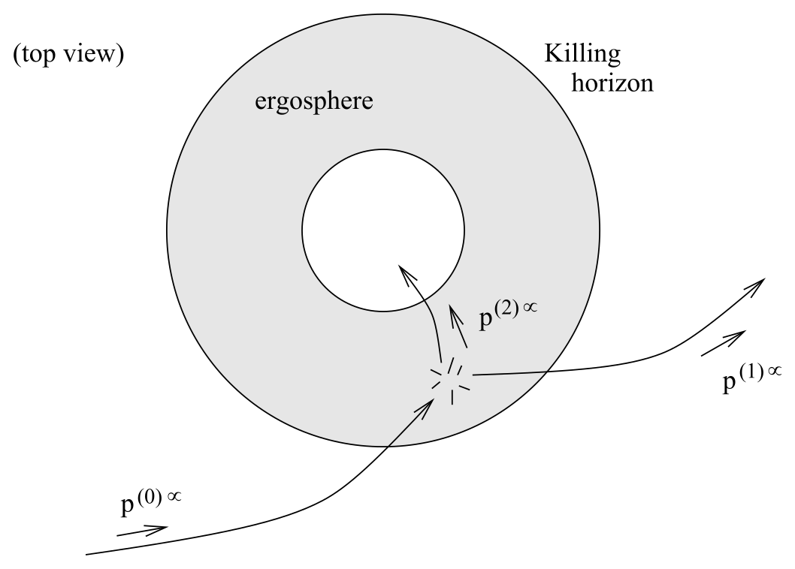

# Penrose 过程、不可约质量与黑洞热力学

<!-- CARROLL_NAV_TOP -->
> 完整译文 · 原 PDF 第 171–223 页 · [本章入口](../07-schwarzschild-and-black-holes.md) · [全书入口](../../carroll-general-relativity.md)
<!-- /CARROLL_NAV_TOP -->

## 从旋转黑洞提取能量

尽管如此，这一认识引出了一种从旋转黑洞中提取能量的方法；它称为 **Penrose 过程**。想法很简单：你从能层外出发，随身带着一块大石头，朝黑洞纵身跃去。把（你 + 石头）系统的四动量记作 $p^{(0)\mu}$，那么能量 $E^{(0)}=-\zeta_\mu p^{(0)\mu}$ 显然为正，并且在你沿测地线运动时守恒。一旦进入能层，你便以全部力气、用一种非常特定的方式把石头掷出去。把你的动量记作 $p^{(1)\mu}$，石头的动量记作 $p^{(2)\mu}$；就在你掷出石头的瞬间，动量像在狭义相对论中一样守恒：
$$
p^{(0)\mu}=p^{(1)\mu}+p^{(2)\mu}\ .
\tag{7.139}
$$
与 Killing 矢量 $\zeta_\mu$ 缩并，得到
$$
E^{(0)}=E^{(1)}+E^{(2)}\ .
\tag{7.140}
$$
但是，如果设想你拥有任意强大的力量（而且投掷得任意精准），就可以按照 (7.158) 安排这次投掷，使 $E^{(2)}<0$。

<figure>
  
  <figcaption>图 7.35：在能层内把石块逆着黑洞旋转方向掷入，可使逃逸者带走更多能量。</figcaption>
</figure>

此外，Penrose 还证明，可以这样安排初始轨迹与投掷方式：投掷之后，你沿一条测地线轨迹越过 Killing 视界返回外部宇宙。由于你的能量沿途守恒，最后将有
$$
E^{(1)}>E^{(0)}\ .
\tag{7.141}
$$
因此，你出来时拥有的能量*多于*进去时。

天下没有免费的午餐；你获得的能量必定有其来源，而这个来源就是黑洞。事实上，Penrose 过程通过减小旋转黑洞的角动量来提取能量；要让这套办法奏效，就必须逆着黑洞的旋转方向投掷石头。为更精确地看清这一点，定义一个新的 Killing 矢量
$$
\chi^\mu = \zeta^\mu + \Omega_H\eta^\mu\ .
\tag{7.142}
$$
在外视界上，$\chi^\mu$ 是零性的，并与视界相切。（由 $\zeta^\mu = {\partial}_{t}$、$\eta^\mu={\partial}_{\phi}$ 以及 $\Omega_H$ 的定义 (7.134) 可以看出这一点。）动量为 $p^{(2)\mu}$ 的粒子“沿时间向前”穿过事件视界这一陈述，就是
$$
p^{(2)\mu}\chi_\mu <0\ .
\tag{7.143}
$$
代入 $E$ 与 $L$ 的定义，可见该条件等价于
$$
L^{(2)} < {{E^{(2)}}\over{\Omega_H}}\ .
\tag{7.144}
$$
我们已经安排 $E^{(2)}$ 为负，而 $\Omega_H$ 为正，所以这个粒子必须具有负角动量——它逆着黑洞的旋转方向运动。当你逃出能层、石头落入事件视界之后，黑洞的质量和角动量，就分别等于原有数值加上石头带来的负贡献：
$$
\begin{aligned}
\delta M &=&  E^{(2)}\cr \delta J &=&  L^{(2)}.
\end{aligned}
\tag{7.145}
$$
这里引入记号 $J$ 表示黑洞的角动量；它由下式给出：
$$
J=Ma\ .
\tag{7.146}
$$
我们不会证明这一点，不过可以在 Wald 的书中找到解释。于是，(7.144) 化为角动量所能减小程度的一个限制：
$$
\delta J < {{\delta M}\over {\Omega_H}}\ .
\tag{7.147}
$$
当我们恰好达到这个极限时，掷入的石头越来越接近零性，便得到“理想”过程，其中 $\delta J=\delta M/\Omega_H$。

## 事件视界面积与不可约质量

现在利用这些想法证明一个有力的结论：尽管可以用 Penrose 过程从黑洞提取能量，却永远无法减小事件视界的面积。对于 Kerr 度规，可以作一番直接计算（投影度规与体积元等），得到事件视界的面积：
$$
A = 4\pi(r_+^2 + a^2)\ .
\tag{7.148}
$$
为了证明它不会减小，改用黑洞的**不可约质量**最为方便；其定义为
$$
\begin{aligned}
M_{\rm irr}^2 &=&  {{A}\over {16\pi G^2}}\cr
  &=& {{1\over {4G^2}}}(r_+^2 + a^2)\cr
  &=& {1\over {2}}\left(M^2 + \sqrt{M^4-(Ma/G)^2}\right)\cr
  &=& {1\over {2}}\left(M^2 + \sqrt{M^4-(J/G)^2}\right)\ .
\end{aligned}
\tag{7.149}
$$
经过一点运算，对它求微分可得
$$
\delta M_{\rm irr} = {{a}\over{4G\sqrt{G^2M^2-a^2}M_{\rm irr}}}
  (\Omega_H^{-1}\delta M - \delta J)\ .
\tag{7.150}
$$
（我想我把 $G$ 的各个因子都写对了，不过检查一下也无妨。）于是，限制 (7.147) 变成
$$
\delta M_{\rm irr} >0\ .
\tag{7.151}
$$
不可约质量永远无法减小；它的名字正由此而来。随之可知，在把黑洞的旋转减缓至零以前，能够从中提取的最大能量为
$$
M-M_{\rm irr} = M-{1\over\sqrt2}
  \left(M^2 + \sqrt{M^4-(J/G)^2}\right)^{1/2}\ .
\tag{7.152}
$$
完成全部提取后，得到的是一个质量为 $M_{\rm irr}$ 的施瓦西黑洞。事实证明，最佳方案是从一个极端 Kerr 黑洞开始；这样大约可以取出其总能量的 $29\%$。

$M_{\rm irr}$ 的不可约性立即意味着面积 $A$ 永远不会减小。由 (7.149) 与 (7.150) 有
$$
\delta A = 8\pi G{a\over{\Omega_H\sqrt{G^2M^2-a^2}}}
  (\delta M - \Omega_H\delta_J)\ ,
\tag{7.153}
$$
它可以改写为
$$
\delta M = {{\kappa}\over{8\pi G}}\delta A +\Omega_H
  \delta J\ ,
\tag{7.154}
$$
这里引入了
$$
\kappa = {{\sqrt{G^2M^2-a^2}}\over{2GM(GM+
  \sqrt{G^2M^2-a^2})}}              \ .
\tag{7.155}
$$
量 $\kappa$ 称为黑洞的**表面引力**。

## 黑洞热力学四定律

正是像 (7.154) 这样的方程，最初促使人们思考黑洞与热力学之间的关系。考虑热力学第一定律
$$
dU = TdS + {\rm work~ terms}\ .
\tag{7.156}
$$
很自然，可以把 $\Omega_H\delta J$ 项理解为我们把石头扔进黑洞时对它所做的“功”。如果进一步考虑把面积 $A$ 认作熵 $S$，并把表面引力 $\kappa$ 认作 $8\pi G$ 乘以温度 $T$，热力学类比便开始成形。事实上，在经典广义相对论的语境中，这一类比几乎完美。热力学“第零”定律指出，在热平衡中，温度在整个系统内保持恒定；黑洞的对应陈述是，平稳黑洞在整个视界上的表面引力恒定（这是真的）。正如已经看到的，第一定律 (7.156) 等价于 (7.154)。第二定律说熵永不减小，对应的正是视界面积永不减小。最后，第三定律指出，通过任何物理过程都无法达到 $T=0$；这应当意味着，通过任何物理过程都无法达到 $\kappa=0$。事实证明，$\kappa=0$ 对应极端黑洞（Kerr 或 Reissner–Nordstrøm 情形皆然）——裸奇点正会在那里出现。因此，第三定律以某种方式与宇宙监督相关。

缺失的一环在于，*真实的*热力学物体不会只是待在那里；它们会发出黑体辐射，其谱依赖自身温度。在 Hawking 发现 Hawking 辐射以前，人们以为黑洞不会这样做，因为它们确实是黑的。从历史上看，是 Bekenstein 提出了黑洞应当成为名副其实的黑体、并在适当温度下发出辐射的想法。这使 Hawking 颇为恼火，于是他着手证明 Bekenstein 错了，结果却证明黑洞终究会发出辐射。因此，热力学类比竟比我们有任何理由期待的还要贴切——尽管可以放心地说，没有人真正知道这是为什么。

<!-- CARROLL_NAV_BOTTOM -->
---
[← Kerr 几何、Killing 张量与能层](./06-kerr-geometry-killing-tensors-and-ergosphere.md) · [全书入口](../../carroll-general-relativity.md) · [均匀性、各向同性与 Robertson-Walker 几何 →](../08-cosmology/01-homogeneity-isotropy-and-rw-geometry.md)
<!-- /CARROLL_NAV_BOTTOM -->
