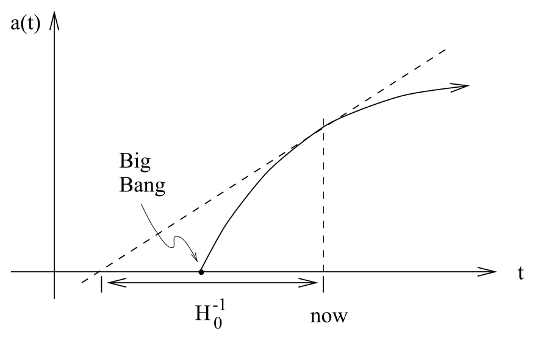
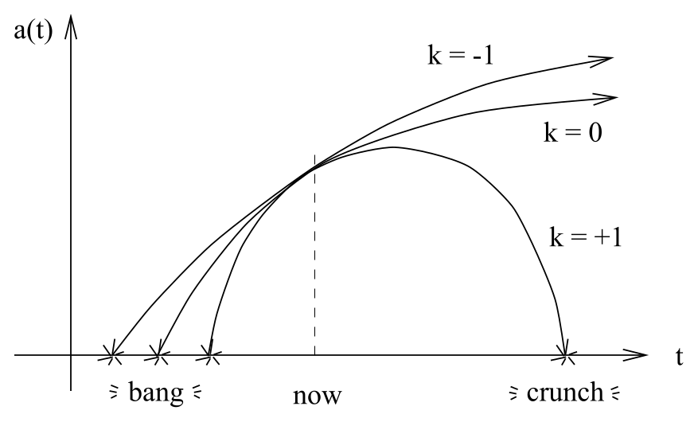

# 宇宙学参数与尺度因子的演化

<!-- CARROLL_NAV_TOP -->
> 完整译文 · 原 PDF 第 224–238 页 · [本章入口](../08-cosmology.md) · [全书入口](../../carroll-general-relativity.md)
<!-- /CARROLL_NAV_TOP -->

## 宇宙学参数

### 哈勃参数与减速参数

与宇宙学参数相关的术语很多，这里只介绍其中最基本的几个。膨胀速率由**哈勃参数**刻画：
$$
H ={{\dot a}\over a}\ .
\tag{8.37}
$$
哈勃参数在当前时代的值就是哈勃常数 $H_0$。目前，它的实际数值仍存在很大争议，各项测量结果落在 40 到 90 km/sec/Mpc 的范围内。（“Mpc”代表“兆秒差距”，即 $3\times 10^{24}$ cm。）请注意，我们必须用 $\dot a$ 除以 $a$ 才能得到可测量的量，因为 $a$ 的整体尺度无关紧要。此外还有**减速参数**：
$$
q = -{{a\ddot a}\over {\dot a^2}}\ ,
\tag{8.38}
$$
它衡量膨胀速率的变化快慢。

### 密度参数与临界密度

另一个有用的量是**密度参数**：
$$
\begin{aligned}
\Omega &=&  {{8\pi G}\over {3H^2}}\rho\cr
  &=& {\rho\over{\rho_{\rm crit}}}\ ,
\end{aligned}
\tag{8.39}
$$
其中，**临界密度**定义为
$$
\rho_{\rm crit} = {{3H^2}\over{8\pi G}}\ .
\tag{8.40}
$$
这个量（一般会随时间变化）之所以称为“临界”密度，是因为弗里德曼方程（8.36）可以写成
$$
\Omega-1={{k}\over {H^2 a^2}} \ .
\tag{8.41}
$$
因此，$k$ 的符号取决于 $\Omega$ 大于、等于还是小于一。我们有
$$
\matrix{\rho<\rho_{\rm crit} & \leftrightarrow & \Omega < 1 &
  \leftrightarrow & k=-1 & \leftrightarrow & {\rm open}\cr
  \rho=\rho_{\rm crit} & \leftrightarrow & \Omega = 1 &
  \leftrightarrow & k=0 & \leftrightarrow & {\rm flat}\cr
  \rho>\rho_{\rm crit} & \leftrightarrow & \Omega > 1 &
  \leftrightarrow & k=+1 & \leftrightarrow & {\rm closed}\ .\cr}
$$
于是，密度参数会告诉我们三种罗伯逊—沃尔克几何中的哪一种描述了我们的宇宙。通过观测确定它，是一个研究极为活跃的领域。

## 尺度因子的定性演化

### 大爆炸与宇宙年龄

在若干简单情形下，我们可以精确求解弗里德曼方程；但了解各种可能性的定性行为往往更加有用。现在暂且令 $\Lambda=0$，并考察由正能量（$\rho > 0$）且压强非负（$p\geq 0$）的流体充满的宇宙。根据（8.35），此时必有 $\ddot a<0$。我们从对遥远星系的观测得知宇宙正在膨胀（$\dot a>0$），这意味着宇宙正在“减速”。这也符合我们的预期，因为宇宙中物质的引力吸引会阻碍膨胀。宇宙只能减速这一事实意味着，它在过去一定膨胀得更快；如果沿时间反向追溯其演化，我们必然会在 $a=0$ 处到达一个奇点。请注意，如果 $\ddot a$ 恰好为零，$a(t)$ 将是一条直线，宇宙年龄将为 $H_0^{-1}$。由于 $\ddot a$ 实际为负，宇宙必定比这个年龄稍小一些。

<figure>
  
  <figcaption>图 8.1：现今尺度因子曲线的切线向过去延伸，会比真实的尺度因子曲线更早到达 $a=0$；因此，从大爆炸到现在的宇宙年龄小于 $H_0^{-1}$。</figcaption>
</figure>

$a=0$ 处的这个奇点就是**大爆炸**。它代表宇宙从一种奇异状态中创生，并非物质向某个预先存在的时空中爆炸。人们也许会希望，正是 FRW 宇宙的完美对称性导致了这个奇点，但事实并非如此；奇点定理预言，任何满足 $\rho>0$ 和 $p\geq 0$ 的宇宙都必定始于一个奇点。当然，当 $a\rightarrow 0$ 时，能量密度会变得任意高，而我们并不期望经典广义相对论在这个区域中仍能准确描述自然；希望一种自洽的量子引力理论能够解决这个问题。

### 开放和平直宇宙

对于不同的 $k$ 值，宇宙未来的演化也不同。在开放和平直两种情形下，$k\leq 0$，（8.36）意味着
$$
\dot a^2 = {{8\pi G}\over 3}\rho a^2 + |k|\ .
\tag{8.42}
$$
等式右边*严格*为正（因为我们假设 $\rho>0$），所以 $\dot a$ 永远不会经过零。我们知道今天 $\dot a>0$，因此它在所有时刻都必定为正。于是，开放宇宙和平直宇宙会永远膨胀——它们在时间上和空间上都是开放的。（请牢记得出这个结论所依赖的假设——也就是存在非零的正能量密度。能量密度为负的宇宙即使是“开放”的，也不一定永远膨胀。）

这些宇宙会以多快的速度继续膨胀？考虑 $\rho a^3$ 这个量（它在物质主导的宇宙中为常数）。根据能量守恒方程（8.20），我们有
$$
\begin{aligned}
{{d}\over {dt}}(\rho a^3) &=&
  a^3\left(\dot\rho + 3\rho{{\dot a}\over a}\right)\cr
  &=&  -3p a^2\dot a\ .
\end{aligned}
\tag{8.43}
$$
等式右边要么为零，要么为负；因此
$$
{{d}\over {dt}}(\rho a^3)\leq 0\ .
\tag{8.44}
$$
这进而意味着，$\rho a^2$ 在一个永远膨胀的宇宙中必须趋于零，而在这样的宇宙中 $a\rightarrow\infty$。因此，（8.42）告诉我们
$$
\dot a^2\rightarrow |k|\ .
\tag{8.45}
$$
（请记住，这对 $k\leq 0$ 成立。）因此，当 $k=-1$ 时，膨胀会趋近极限值 $\dot a\rightarrow 1$；当 $k=0$ 时，宇宙会继续膨胀，但速度越来越慢。

### 闭合宇宙

对于闭合宇宙（$k=+1$），（8.36）变为
$$
\dot a^2 = {{8\pi G}\over 3}\rho a^2 -1\ .
\tag{8.46}
$$
$\rho a^2\rightarrow 0$ 的论证在 $a\rightarrow\infty$ 时仍然适用；但在这种情况下，（8.46）将变为负数，而这是不可能发生的。因此，宇宙不会无限膨胀；$a$ 存在一个上界 $a_{\rm max}$。当 $a$ 接近 $a_{\rm max}$ 时，（8.35）意味着
$$
\ddot a \rightarrow -{{4\pi G}\over 3}(\rho +3p)a_{\rm max} <0
  \ .
\tag{8.47}
$$
因此，$\ddot a$ 在这一点是有限的负值，所以 $a$ 会到达 $a_{\rm max}$，继而开始减小；随后（因为 $\ddot a <0$），它将不可避免地继续收缩到零——这就是大挤压。因此，闭合宇宙（同样是在 $\rho$ 为正且 $p$ 非负的假设下）在时间上和空间上都是闭合的。

<figure>
  
  <figcaption>图 8.2：在正能量密度、非负压强且 $\Lambda=0$ 的假设下，$k=-1$ 的开放宇宙和 $k=0$ 的平直宇宙会永远膨胀，而 $k=+1$ 的闭合宇宙会达到最大尺度后重新收缩，最终发生大挤压。</figcaption>
</figure>

## 单一能量成分的精确解

### 尘埃和辐射

现在列出一些只含一种能量密度时的精确解。对于只含尘埃的宇宙（$p=0$），定义一个**发展角** $\phi(t)$ 会比较方便，我们不用 $t$ 直接作为参数。于是，对于开放宇宙，解为
$$
\cases{a={C\over 2}(\cosh\phi-1)\cr
  t={C\over 2}(\sinh\phi-\phi)\cr}\qquad (k=-1)\ ,
\tag{8.48}
$$
对于平直宇宙，解为
$$
a = \left({{9C}\over 4}\right)^{1/3} t^{2/3}\qquad (k=0)\ ,
\tag{8.49}
$$
而对于闭合宇宙，解为
$$
\cases{a={C\over 2}(1-\cos\phi)\cr
  t={C\over 2}(\phi-\sin\phi)\cr}\qquad (k=+1)\ ,
\tag{8.50}
$$
其中我们定义了
$$
C={{8\pi G}\over 3}\rho a^3 = {\rm ~constant}\ .
\tag{8.51}
$$
对于只由辐射充满的宇宙，$p={1\over 3}\rho$；我们再一次得到开放宇宙
$$
a=\sqrt{C'}\left[\left(1+{t\over{\sqrt{C'}}}\right)^2-1\right]^{1/2}
  \qquad (k=-1)\ ,
\tag{8.52}
$$
平直宇宙
$$
a=(4C')^{1/4} t^{1/2}\qquad (k=0)\ ,
\tag{8.53}
$$
以及闭合宇宙
$$
a=\sqrt{C'}\left[1-\left(1-{t\over{\sqrt{C'}}}\right)^2\right]^{1/2}
  \qquad (k=+1)\ ,
\tag{8.54}
$$
这一次我们定义了
$$
C'={{8\pi G}\over 3}\rho a^4 = {\rm ~constant}\ .
\tag{8.55}
$$
你们可以自行检验，这些精确解确实具有我们论证过的一般性质。

### 宇宙学常数、德西特空间与反德西特空间

对于除宇宙学常数外空无一物的宇宙，$\rho$ 或 $p$ 中会有一个为负，从而违反我们先前推导 $a(t)$ 的一般行为时采用的假设。在这种情况下，开放／闭合与永远膨胀／重新坍缩之间的联系便不再成立。我们先考虑 $\Lambda<0$。此时 $\Omega$ 为负，而根据（8.41），这只能在 $k=-1$ 时发生。这种情况下的解是
$$
a = \sqrt{{-3}\over\Lambda}\sin\left(\sqrt{{-\Lambda}\over 3} \, t
  \right)\ .
\tag{8.56}
$$
也存在一个开放的（$k=-1$）解，对应于 $\Lambda>0$：
$$
a = \sqrt{{3}\over\Lambda}\sinh\left(\sqrt{{\Lambda}\over 3} \, t
  \right)\ .
\tag{8.57}
$$
真空主导的平直宇宙必须满足 $\Lambda>0$，其解为
$$
a\propto \exp\left(\pm\sqrt{{\Lambda}\over 3} \, t
  \right)\ ,
\tag{8.58}
$$
而闭合宇宙也必须满足 $\Lambda>0$，并且满足
$$
a= \sqrt{{3}\over\Lambda}\cosh\left(\sqrt{{\Lambda}\over 3} \, t
  \right)\ .
\tag{8.59}
$$
这些解有一点误导性。事实上，$\Lambda>0$ 时的三个解——（8.57）、（8.58）和（8.59）——全都表示同一个时空，只是采用了不同的坐标。这个时空称为**德西特空间**，实际上作为一个时空，它是最大对称的。（详情参见 Hawking 和 Ellis。）$\Lambda<0$ 时的解（8.56）同样是最大对称的，称为**反德西特空间**。

<!-- CARROLL_NAV_BOTTOM -->
---
[← 宇宙学物质与 Friedmann 方程](./02-cosmological-matter-and-friedmann-equations.md) · [全书入口](../../carroll-general-relativity.md) · [红移、光度距离与哈勃定律 →](./04-redshift-luminosity-distance-and-hubble-law.md)
<!-- /CARROLL_NAV_BOTTOM -->
