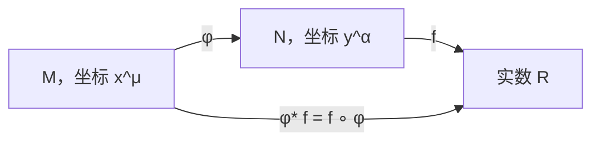
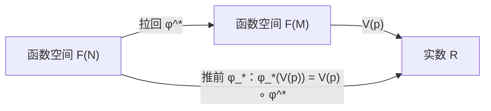
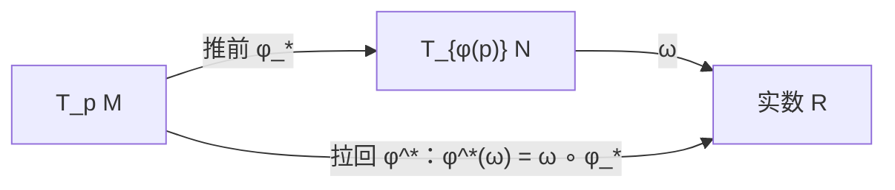
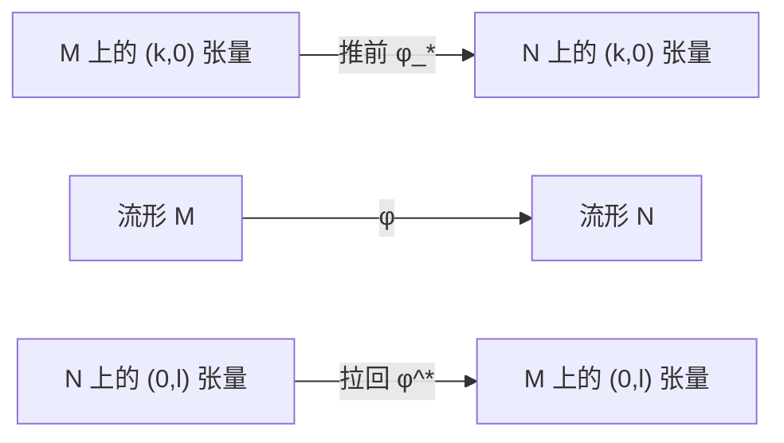

# 附录 A 流形之间的映射

[返回系列目录](../spacetime-and-geometry.md) · [上一篇：第 9 章 弯曲时空中的量子场论](./09-quantum-field-theory-in-curved-spacetime.md) · [下一篇：附录 B 微分同胚与 Lie 导数](./appendix-b-diffeomorphisms-and-lie-derivatives.md)

<!-- source: PDF 436; printed: 423 -->

在第 2 章讨论流形时，我们引入了两个不同流形之间的映射，也说明了怎样复合映射。这里将更细致地研究这种映射，重点考察怎样用它把张量场从一个流形带到另一个流形。所涉及的两个流形可能分别是一个子流形和包含它的更大空间，也可能只是同一个抽象流形的两个不同副本，而我们要在它们之间建立映射。

考虑两个流形 $M$ 和 $N$，它们的维数可以不同，各自带有坐标系 $x^\mu$ 和 $y^\alpha$。设有映射 $\phi:M\to N$，以及函数 $f:N\to\mathbb{R}$。显然，我们可以复合 $\phi$ 与 $f$，构造映射

$$
(f\circ\phi):M\to\mathbb{R},
$$

它就是 $M$ 上的一个函数。这个构造非常有用，值得拥有自己的名称：由 $\phi$ 对 $f$ 的**拉回**（pullback）记作 $\phi^*f$，定义为

$$
\phi^*f=(f\circ\phi).
\tag{A.1}
$$

这个名称很形象，因为可以把 $\phi^*$ 想成把函数 $f$ 从 $N$“拉回”到 $M$（见图 A.1）。

**图 A.1**　映射 $\phi:M\to N$ 对函数 $f:N\to\mathbb{R}$ 的拉回，就是 $\phi$ 与 $f$ 的复合。

<!-- source: PDF 437; printed: 424 -->

函数可以拉回，却不能一般地推前。若有函数 $g:M\to\mathbb{R}$，我们无法把 $g$ 与 $\phi$ 复合成 $N$ 上的函数，因为两个箭头的方向接不起来。不过请回忆，向量可以看成一种把光滑函数映到实数的微分算子。利用这一点可以定义向量的**推前**（pushforward）：若 $V(p)$ 是 $M$ 上点 $p$ 处的向量，我们通过规定它对 $N$ 上函数的作用，来定义 $N$ 上点 $\phi(p)$ 处的推前向量 $\phi_*V$：

$$
(\phi_*V)(f)=V(\phi^*f).
\tag{A.2}
$$

因此，要推前一个向量场，我们可以这样说：“$\phi_*V$ 对任意函数的作用，就是 $V$ 对该函数之拉回的作用。”[^a1]

上面的说法略显抽象，最好再给出更具体的描述。$M$ 上向量的一组基为偏导算子

$$
\partial_\mu=\frac{\partial}{\partial x^\mu},
$$

而 $N$ 上的一组基为

$$
\partial_\alpha=\frac{\partial}{\partial y^\alpha}.
$$

我们希望把 $V=V^\mu\partial_\mu$ 的分量与

$$
(\phi_*V)=(\phi_*V)^\alpha\partial_\alpha
$$

的分量联系起来。让推前后的向量作用在一个测试函数上，再使用链式法则（2.12），便得到所需关系：

$$
\begin{aligned}
(\phi_*V)^\alpha\partial_\alpha f
&=V^\mu\partial_\mu(\phi^*f)\\
&=V^\mu\partial_\mu(f\circ\phi)\\
&=V^\mu\frac{\partial y^\alpha}{\partial x^\mu}\partial_\alpha f.
\end{aligned}
\tag{A.3}
$$

这个简单公式很自然地让人把推前 $\phi_*$ 看成矩阵算子：

$$
(\phi_*V)^\alpha=(\phi_*)^\alpha{}_{\mu}V^\mu,
$$

其中矩阵为

$$
(\phi_*)^\alpha{}_{\mu}
=
\frac{\partial y^\alpha}{\partial x^\mu}.
\tag{A.4}
$$

向量在推前下的行为与坐标变换下的向量变换律非常相似。事实上，推前是后者的一种推广：当 $M$ 和 $N$ 是同一个流形时，这两个构造彼此相同，后面会对此加以讨论。不过仍须留意，一般情形下 $\mu$ 与 $\alpha$ 的取值范围可以不同，矩阵 $\partial y^\alpha/\partial x^\mu$ 也没有理由可逆。

下面这个练习很有启发性：给定 $\phi:M\to N$，向量可以从 $M$ 推前到 $N$，却不能一般地从 $N$ 拉回到 $M$。你可以不断尝试发明一个合适的构造，直到看清这种尝试为什么注定失败。一形式与向量对偶，因此一形式能够拉回，但一般不能推前。为定义这个操作，请记住一形式是从向量到实数的线性映射。设 $\omega$ 是 $N$ 上的一形式，它的拉回 $\phi^*\omega$ 可以

[^a1]: 遗憾的是，星号的位置并未完全标准化。有些文献用上标 $*$ 表示推前、用下标 $*$ 表示拉回，阅读时需要留意。

<!-- source: PDF 438; printed: 425 -->

通过其对 $M$ 上向量 $V$ 的作用来定义：令它等于 $\omega$ 本身对 $V$ 的推前的作用，

$$
(\phi^*\omega)(V)=\omega(\phi_*V).
\tag{A.5}
$$

一形式上的拉回算子同样有简单的矩阵描述，

$$
(\phi^*\omega)_\mu=(\phi^*)_\mu{}^\alpha\omega_\alpha,
$$

用链式法则即可推导出

$$
(\phi^*)_\mu{}^\alpha
=
\frac{\partial y^\alpha}{\partial x^\mu}.
\tag{A.6}
$$

这与推前公式（A.4）使用同一个矩阵；矩阵作用于一形式并将其拉回时，收缩的是另一个指标。

有一种看法可以帮助理解：为什么拉回和推前只对某些对象成立。把 $M$ 上所有光滑函数组成的集合记作 $\mathcal{F}(M)$。$M$ 上点 $p$ 处的向量 $V(p)$，也就是切空间 $T_pM$ 的一个元素，可以看成从 $\mathcal{F}(M)$ 到 $\mathbb{R}$ 的算子。另一方面，函数的拉回算子把 $\mathcal{F}(N)$ 映到 $\mathcal{F}(M)$；它与把 $M$ 映到 $N$ 的 $\phi$ 方向相反。因此，正如最初通过复合映射定义函数的拉回一样，我们也能通过复合映射定义作用在向量上的推前 $\phi_*$；图 A.2 展示了这一点。

类似地，若 $T_qN$ 是 $N$ 上点 $q$ 处的切空间，那么 $q$ 处的一形式 $\omega$，也就是余切空间 $T_q^*N$ 的元素，可以看成从 $T_qN$ 到 $\mathbb{R}$ 的算子。由于推前 $\phi_*$ 把 $T_pM$ 映到 $T_{\phi(p)}N$，一形式的拉回 $\phi^*$ 同样可以看成映射的直接复合，如图 A.3 所示。若这种看法没有帮助，也不必担心。不过一定要分清哪些操作存在、哪些不存在；概念本身很简单，混乱往往来自忘记了某个映射究竟朝哪个方向。

请进一步回忆，一个 $(0,l)$ 型张量——有 $l$ 个下标而没有上标——是从 $l$ 个向量的直积到 $\mathbb{R}$ 的线性映射。因此，除了拉回一形式以外，我们还能拉回具有任意多个下标的张量。其定义就是让原张量作用在推前后的各个向量上：

$$
\begin{aligned}
(\phi^*T)&\bigl(V^{(1)},V^{(2)},\ldots,V^{(l)}\bigr)\\
&=T\bigl(\phi_*V^{(1)},\phi_*V^{(2)},\ldots,\phi_*V^{(l)}\bigr).
\end{aligned}
\tag{A.7}
$$

**图 A.2**　把向量的推前看成两个映射的复合：一个映射连接 $N$ 与 $M$ 上的函数空间，另一个把 $M$ 上的函数映到 $\mathbb{R}$。

> **勘误（图 A.2）**：依作者官方勘误，图中从 $\mathcal{F}(M)$ 指向 $\mathbb{R}$ 的箭头应标为 $V(p)$；上图已经采用修正后的标记。

<!-- source: PDF 439; printed: 426 -->

**图 A.3**　把一形式的拉回看成两个映射的复合：一个映射连接切空间 $T_pM$ 与 $T_{\phi(p)}N$，另一个把 $T_{\phi(p)}N$ 映到 $\mathbb{R}$。

> **勘误（图 A.3）**：依作者官方勘误，图题中的切空间应写成 $T_{\phi(p)}N$，最后的 $p$ 需要括号；上面的图题已经修正。

其中 $T_{\alpha_1\cdots\alpha_l}$ 是 $N$ 上的 $(0,l)$ 型张量。类似地，对于任意 $(k,0)$ 型张量 $S^{\mu_1\cdots\mu_k}$，可以让它作用在拉回后的一形式上，从而定义其推前：

$$
\begin{aligned}
(\phi_*S)&\bigl(\omega^{(1)},\omega^{(2)},\ldots,\omega^{(k)}\bigr)\\
&=S\bigl(\phi^*\omega^{(1)},\phi^*\omega^{(2)},\ldots,\phi^*\omega^{(k)}\bigr).
\end{aligned}
\tag{A.8}
$$

幸运的是，推前（A.4）与拉回（A.6）的矩阵表示可以很直接地推广到高阶张量：只需给每个指标配上一个矩阵。于是，对 $(0,l)$ 型张量的拉回有

$$
(\phi^*T)_{\mu_1\cdots\mu_l}
=
\frac{\partial y^{\alpha_1}}{\partial x^{\mu_1}}
\cdots
\frac{\partial y^{\alpha_l}}{\partial x^{\mu_l}}
T_{\alpha_1\cdots\alpha_l},
\tag{A.9}
$$

而对 $(k,0)$ 型张量的推前有

$$
(\phi_*S)^{\alpha_1\cdots\alpha_k}
=
\frac{\partial y^{\alpha_1}}{\partial x^{\mu_1}}
\cdots
\frac{\partial y^{\alpha_k}}{\partial x^{\mu_k}}
S^{\mu_1\cdots\mu_k}.
\tag{A.10}
$$

完整图景如图 A.4 所示。要注意，同时带有上、下指标的张量一般既不能推前，也不能拉回。

**图 A.4**　映射 $\phi:M\to N$ 使我们能够拉回 $(0,l)$ 型张量，并推前 $(k,0)$ 型张量。图中上方箭头表示 $\phi_*$，下方由 $N$ 指向 $M$ 的箭头表示 $\phi^*$。

<!-- source: PDF 440; printed: 427 -->

把这套机制用于一个简单例子后，它就不再那么令人生畏了。两个流形之间的映射有一种常见情形：$M$ 本身是 $N$ 的子流形；附录 C 会更仔细地讨论这一点。基本想法是，存在一个从 $M$ 到 $N$ 的映射，它把 $M$ 的一个元素送到 $N$ 中“同一个”元素。

考虑嵌入 $\mathbb{R}^3$ 的二维球面，把它视为距原点为单位距离的所有点组成的轨迹。在 $M=S^2$ 上取坐标 $x^\mu=(\theta,\phi)$，在 $N=\mathbb{R}^3$ 上取坐标 $y^\alpha=(x,y,z)$，则映射 $\phi:M\to N$ 为

$$
\phi(\theta,\phi)
=
(\sin\theta\cos\phi,\,\sin\theta\sin\phi,\,\cos\theta).
\tag{A.11}
$$

以这种方式把球面放进 $\mathbb{R}^3$，会在 $S^2$ 上诱导出一个度规，它就是平直空间度规的拉回。最直接的算法，是从 $\mathbb{R}^3$ 上的度规

$$
ds^2=dx^2+dy^2+dz^2
$$

出发，把（A.11）代入，得到 $S^2$ 上的度规

$$
d\theta^2+\sin^2\theta\,d\phi^2.
$$

现在看看怎样用更正式的语言得到同一答案。（当然，若在 $\mathbb{R}^3$ 上采用球坐标，计算会更容易；这里故意使用较费力的做法，因为它更能说明问题。）偏导数组成的矩阵为

$$
\frac{\partial y^\alpha}{\partial x^\mu}
=
\begin{pmatrix}
\cos\theta\cos\phi & \cos\theta\sin\phi & -\sin\theta\\
-\sin\theta\sin\phi & \sin\theta\cos\phi & 0
\end{pmatrix}.
\tag{A.12}
$$

$S^2$ 上的度规只需从 $\mathbb{R}^3$ 拉回度规即可得到：

$$
\begin{aligned}
(\phi^*g)_{\mu\nu}
&=
\frac{\partial y^\alpha}{\partial x^\mu}
\frac{\partial y^\beta}{\partial x^\nu}
g_{\alpha\beta}\\
&=
\begin{pmatrix}
1 & 0\\
0 & \sin^2\theta
\end{pmatrix},
\end{aligned}
\tag{A.13}
$$

这一点很容易检验。因此，答案确实与直接代入所得结果相同；现在我们也明白了它为什么成立。

<!-- source: PDF 441; printed: 428 -->

原书此页注明：“本页有意留白。”

---

[返回系列目录](../spacetime-and-geometry.md) · [上一篇：第 9 章 弯曲时空中的量子场论](./09-quantum-field-theory-in-curved-spacetime.md) · [下一篇：附录 B 微分同胚与 Lie 导数](./appendix-b-diffeomorphisms-and-lie-derivatives.md)
