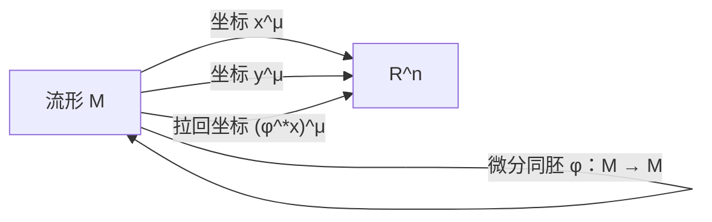

# 附录 B 微分同胚与 Lie 导数

[返回系列目录](../spacetime-and-geometry.md) · [上一篇：附录 A 流形之间的映射](./appendix-a-maps-between-manifolds.md) · [下一篇：附录 C 子流形](./appendix-c-submanifolds.md)

<!-- source: PDF 442; printed: 429 -->

本附录继续上一附录的探索，现在专门研究两个流形其实相同的情形。到目前为止，我们一直强调，映射 $\phi:M\to N$ 可以把某些对象拉回（A.9），把另一些对象推前（A.10）。这两个方向一般不能同时成立，根源在于 $\phi$ 未必可逆。若 $\phi$ 可逆，并且 $\phi$ 与 $\phi^{-1}$ 都光滑——下文始终默认这一点——那么它就在 $M$ 与 $N$ 之间定义了一个**微分同胚**（diffeomorphism）。只有当 $M$ 与 $N$ 是同一个抽象流形时，这才可能发生；事实上，两个流形“相同”的定义正是它们之间存在微分同胚。

微分同胚的妙处在于，可以同时利用 $\phi$ 和 $\phi^{-1}$ 把张量从 $M$ 移到 $N$，从而为任意型张量定义推前和拉回。具体说，设 $M$ 上有一个 $(k,l)$ 型张量场 $T^{\mu_1\cdots\mu_k}{}_{\nu_1\cdots\nu_l}$，定义其推前为

$$
\begin{aligned}
&(\phi_*T)\bigl(
\omega^{(1)},\ldots,\omega^{(k)},
V^{(1)},\ldots,V^{(l)}
\bigr)\\
&\quad =T\bigl(
\phi^*\omega^{(1)},\ldots,\phi^*\omega^{(k)},
[\phi^{-1}]_*V^{(1)},\ldots,[\phi^{-1}]_*V^{(l)}
\bigr),
\end{aligned}
\tag{B.1}
$$

其中，$\omega^{(i)}$ 是 $N$ 上的一形式，$V^{(i)}$ 是 $N$ 上的向量。用分量表示，定义变为

$$
\begin{aligned}
(\phi_*T)^{\alpha_1\cdots\alpha_k}{}_{\beta_1\cdots\beta_l}
={}&
\frac{\partial y^{\alpha_1}}{\partial x^{\mu_1}}
\cdots
\frac{\partial y^{\alpha_k}}{\partial x^{\mu_k}}
\frac{\partial x^{\nu_1}}{\partial y^{\beta_1}}
\cdots
\frac{\partial x^{\nu_l}}{\partial y^{\beta_l}}
T^{\mu_1\cdots\mu_k}{}_{\nu_1\cdots\nu_l}.
\end{aligned}
\tag{B.2}
$$

逆矩阵 $\partial x^\nu/\partial y^\beta$ 可以合法地出现在这里，正是因为 $\phi$ 可逆。当然，我们也能用显然的方式定义拉回；不过没有必要另外写一组公式，因为 $\phi^*$ 的拉回与经由逆映射的推前 $[\phi^{-1}]_*$ 相同。

现在可以解释微分同胚与坐标变换的关系：它们是完成同一件事的两种方式。可以把微分同胚称为“主动坐标变换”，把传统坐标变换称为“被动坐标变换”。考虑一个 $n$ 维流形 $M$，其坐标函数为 $x^\mu:M\to\mathbb{R}^n$。改变坐标时，我们可以直接引入新函数 $y^\mu:M\to\mathbb{R}^n$，也就是“保持流形上的点不动，改变坐标映射”；也可以引入微分同胚 $\phi:M\to M$，此时新坐标就是拉回 $(\phi^*x)^\mu:M\to\mathbb{R}^n$，也就是“移动流形上的点，再计算新点的坐标”。

<!-- source: PDF 443; printed: 430 -->

图 B.1 展示了这两种视角。按照这个意义，式（B.2）就是张量变换律，只是换了一个观察角度。

**图 B.1**　由微分同胚 $\phi:M\to M$ 诱导的坐标变换。

微分同胚允许我们拉回和推前任意张量，因此也提供了另一种比较流形上不同点处张量的方法。给定微分同胚 $\phi:M\to M$ 和张量场 $T^{\mu_1\cdots\mu_k}{}_{\nu_1\cdots\nu_l}(x)$，可以比较点 $p$ 处的张量值与

$$
\phi^*\!\left[
T^{\mu_1\cdots\mu_k}{}_{\nu_1\cdots\nu_l}(\phi(p))
\right],
$$

也就是把 $\phi(p)$ 处的张量值拉回到 $p$ 之后所得的值。这启发我们在张量场上定义另一类导数算子，用它描述张量沿微分同胚之流的变化率。

为此，一个离散的微分同胚还不够；我们需要一族单参数微分同胚 $\phi_t$。可以把它看成光滑映射

$$
\mathbb{R}\times M\to M,
$$

使得对每个 $t\in\mathbb{R}$ 都有一个微分同胚 $\phi_t$，并满足

$$
\phi_s\circ\phi_t=\phi_{s+t}.
$$

最后这个条件蕴含 $\phi_0$ 是恒等映射。

单参数微分同胚族可以看成由向量场产生，反过来也成立。观察点 $p$ 在整族 $\phi_t$ 作用下的运动，它会描出 $M$ 中的一条曲线；对 $M$ 中每个点都这样做，这些曲线便填满整个流形，不过在微分同胚具有不动点的地方可能出现退化。取每条曲线在 $t=0$ 时的切向量，就定义出一个向量场 $V^\mu(x)$。图 B.2 给出了 $S^2$ 上的例子：

$$
\phi_t(\theta,\phi)=(\theta,\phi+t).
$$

也可以反向进行这个构造，从任意向量场定义一族单参数微分同胚。给定 $V^\mu(x)$，把该向量场的**积分曲线**定义为满足

$$
\frac{dx^\mu}{dt}=V^\mu
\tag{B.3}
$$

的曲线 $x^\mu(t)$。这个方程看起来很熟悉，不过这里的理解方向与惯常用法相反：向量已经给定，我们由它来定义曲线。只要没有发生撞上流形边界之类的问题，（B.3）的解就一定存在；证明的要点，是找到一套坐标，把问题化为常微分方程基本定理的情形。

<!-- source: PDF 444; printed: 431 -->

**图 B.2**　二维球面上的一个微分同胚：绕其轴旋转。每条纬线都是相应向量场的一条积分曲线，箭头表示 $\phi_t$ 的流动方向。

微分同胚 $\phi_t$ 表示“沿积分曲线流动”，与之关联的向量场称为该微分同胚的**生成元**。这里有一个容易混淆的用词：向量场及其积分曲线也会出现在类光超曲面的语境中，届时被称作“生成元”的是曲线，而非向量场。初等物理里其实一直在使用积分曲线，只是通常不这样称呼。例如，磁体周围的铁屑勾勒出的“磁通线”，正是磁场向量 $\mathbf B$ 的积分曲线。

给定向量场 $V^\mu(x)$，我们便有一族由 $t$ 参数化的微分同胚，可以追问：沿积分曲线前进时，一个张量改变得有多快。对每个 $t$，把张量拉回到 $p$ 后的值减去它在 $p$ 处的原值，定义

$$
\begin{aligned}
\Delta_t T^{\mu_1\cdots\mu_k}{}_{\nu_1\cdots\nu_l}(p)
={}&
\phi_t^*\!\left[
T^{\mu_1\cdots\mu_k}{}_{\nu_1\cdots\nu_l}(\phi_t(p))
\right]\\
&-T^{\mu_1\cdots\mu_k}{}_{\nu_1\cdots\nu_l}(p).
\end{aligned}
\tag{B.4}
$$

右端两项都是点 $p$ 处的张量，如图 B.3 所示。于是，张量沿向量场的 **Lie 导数**定义为

$$
\mathcal{L}_V
T^{\mu_1\cdots\mu_k}{}_{\nu_1\cdots\nu_l}
=
\lim_{t\to0}
\left(
\frac{
\Delta_t T^{\mu_1\cdots\mu_k}{}_{\nu_1\cdots\nu_l}
}{t}
\right).
\tag{B.5}
$$

Lie 导数把 $(k,l)$ 型张量场映成 $(k,l)$ 型张量场，并且定义显然与坐标无关。这个定义本质上就是把普通导数的常规定义用到张量的分量函数上，因此它具有线性：

$$
\mathcal{L}_V(aT+bS)
=a\mathcal{L}_VT+b\mathcal{L}_VS,
\tag{B.6}
$$

<!-- source: PDF 445; printed: 432 -->

并满足 Leibniz 法则：

$$
\mathcal{L}_V(T\otimes S)
=(\mathcal{L}_VT)\otimes S
+T\otimes(\mathcal{L}_VS),
\tag{B.7}
$$

其中 $S$ 与 $T$ 是张量，$a$ 与 $b$ 是常数。Lie 导数其实比协变导数更原始，因为它不要求预先指定联络，当然，它需要给定一个向量场。稍加思考就能看出，在函数上它退化为普通方向导数：

$$
\mathcal{L}_Vf
=V(f)
=V^\mu\partial_\mu f.
\tag{B.8}
$$

**图 B.3**　沿向量场积分曲线的张量变化率，通过以下方式计算：把点 $p$ 处的原张量 $T(p)$，与点 $\phi_t(p)$ 处的 $T$ 作比较；后一个张量先由 $\phi_t^*$ 拉回到 $p$。

> **勘误（图 B.3）**：作者的官方勘误指出，原图题第二行末尾应为 “$T$ **at** a point $\phi_t(p)$”；上面的中文已经按此修正。

为了用熟悉的运算表达 Lie 导数对张量的作用，选取一套适应问题的坐标会很方便。具体地，采用坐标

$$
x^\mu=(x^1,\ldots,x^n),
$$

使 $x^1$ 成为沿积分曲线的参数，其余坐标任意选取。此时向量场为

$$
V=\frac{\partial}{\partial x^1},
\qquad
V^\mu=(1,0,0,\ldots,0).
$$

这套坐标的妙处在于，$\phi_t$ 的微分同胚等价于从 $x^\mu$ 到

$$
y^\mu=(x^1+t,x^2,\ldots,x^n)
$$

的坐标变换。因此，由（A.6）可知，拉回矩阵就是

$$
(\phi_t^*)_\mu{}^\nu=\delta_\mu{}^\nu,
\tag{B.9}
$$

而把张量从 $\phi_t(p)$ 拉回到 $p$ 后，其分量就是

$$
\begin{aligned}
\phi_t^*\!\left[
T^{\mu_1\cdots\mu_k}{}_{\nu_1\cdots\nu_l}(\phi_t(p))
\right]
=
T^{\mu_1\cdots\mu_k}{}_{\nu_1\cdots\nu_l}
(x^1+t,x^2,\ldots,x^n).
\end{aligned}
\tag{B.10}
$$

> **勘误（B.9–B.10）**：原印刷本把这两个拉回符号的星号排在下方；依作者官方勘误，这里统一使用上标星号 $\phi_t^*$。

<!-- source: PDF 446; printed: 433 -->

在这套坐标中，Lie 导数变成

$$
\mathcal{L}_V
T^{\mu_1\cdots\mu_k}{}_{\nu_1\cdots\nu_l}
=
\frac{\partial}{\partial x^1}
T^{\mu_1\cdots\mu_k}{}_{\nu_1\cdots\nu_l},
\tag{B.11}
$$

特别地，向量场 $U^\mu(x)$ 的 Lie 导数为

$$
\mathcal{L}_VU^\mu
=
\frac{\partial U^\mu}{\partial x^1}.
\tag{B.12}
$$

这个表达式显然没有把协变性直接显露出来。不过我们知道，对易子 $[V,U]$ 是定义良好的张量，而且在当前坐标系中

$$
\begin{aligned}
[V,U]^\mu
&=V^\nu\partial_\nu U^\mu-U^\nu\partial_\nu V^\mu\\
&=\frac{\partial U^\mu}{\partial x^1}.
\end{aligned}
\tag{B.13}
$$

所以，在这套坐标中，$U$ 关于 $V$ 的 Lie 导数与 $V$、$U$ 的对易子具有相同分量；二者都是向量，于是在任意坐标系中都相等：

$$
\mathcal{L}_VU^\mu=[V,U]^\mu.
\tag{B.14}
$$

立即可得 $\mathcal{L}_VU=-\mathcal{L}_UV$。正因为式（B.14），对易子有时也称为 **Lie 括号**（Lie bracket）。

为了推导 $\mathcal{L}_V$ 对一形式 $\omega_\mu$ 的作用，先考察它对标量 $\omega_\mu U^\mu$ 的作用，其中 $U^\mu$ 是任意向量场。首先利用 Lie 导数作用在标量上时退化为向量本身的作用：

$$
\begin{aligned}
\mathcal{L}_V(\omega_\mu U^\mu)
&=V(\omega_\mu U^\mu)\\
&=V^\nu\partial_\nu(\omega_\mu U^\mu)\\
&=V^\nu(\partial_\nu\omega_\mu)U^\mu
+V^\nu\omega_\mu(\partial_\nu U^\mu).
\end{aligned}
\tag{B.15}
$$

再对原标量使用 Leibniz 法则：

$$
\begin{aligned}
\mathcal{L}_V(\omega_\mu U^\mu)
&=(\mathcal{L}_V\omega)_\mu U^\mu
+\omega_\mu(\mathcal{L}_VU)^\mu\\
&=(\mathcal{L}_V\omega)_\mu U^\mu
+\omega_\mu V^\nu\partial_\nu U^\mu
-\omega_\mu U^\nu\partial_\nu V^\mu.
\end{aligned}
\tag{B.16}
$$

令这两个表达式相等，并要求等式对任意 $U^\mu$ 成立，可得

$$
\mathcal{L}_V\omega_\mu
=V^\nu\partial_\nu\omega_\mu
+(\partial_\mu V^\nu)\omega_\nu.
\tag{B.17}
$$

与对易子的定义相同，这个表达式完全协变，只是形式上没有立即显出这一点。

<!-- source: PDF 447; printed: 434 -->

用类似步骤，可以定义任意张量场的 Lie 导数。结果为

$$
\begin{aligned}
\mathcal{L}_V
T^{\mu_1\mu_2\cdots\mu_k}{}_{\nu_1\nu_2\cdots\nu_l}
={}&V^\sigma\partial_\sigma
T^{\mu_1\mu_2\cdots\mu_k}{}_{\nu_1\nu_2\cdots\nu_l}\\
&-(\partial_\lambda V^{\mu_1})
T^{\lambda\mu_2\cdots\mu_k}{}_{\nu_1\nu_2\cdots\nu_l}\\
&-(\partial_\lambda V^{\mu_2})
T^{\mu_1\lambda\cdots\mu_k}{}_{\nu_1\nu_2\cdots\nu_l}
-\cdots\\
&+(\partial_{\nu_1}V^\lambda)
T^{\mu_1\mu_2\cdots\mu_k}{}_{\lambda\nu_2\cdots\nu_l}\\
&+(\partial_{\nu_2}V^\lambda)
T^{\mu_1\mu_2\cdots\mu_k}{}_{\nu_1\lambda\cdots\nu_l}
+\cdots.
\end{aligned}
\tag{B.18}
$$

尽管外观上不明显，这个表达式仍然协变。若希望使用一眼就能看出张量性的等价形式，可以写成

$$
\begin{aligned}
\mathcal{L}_V
T^{\mu_1\mu_2\cdots\mu_k}{}_{\nu_1\nu_2\cdots\nu_l}
={}&V^\sigma\nabla_\sigma
T^{\mu_1\mu_2\cdots\mu_k}{}_{\nu_1\nu_2\cdots\nu_l}\\
&-(\nabla_\lambda V^{\mu_1})
T^{\lambda\mu_2\cdots\mu_k}{}_{\nu_1\nu_2\cdots\nu_l}\\
&-(\nabla_\lambda V^{\mu_2})
T^{\mu_1\lambda\cdots\mu_k}{}_{\nu_1\nu_2\cdots\nu_l}
-\cdots\\
&+(\nabla_{\nu_1}V^\lambda)
T^{\mu_1\mu_2\cdots\mu_k}{}_{\lambda\nu_2\cdots\nu_l}\\
&+(\nabla_{\nu_2}V^\lambda)
T^{\mu_1\mu_2\cdots\mu_k}{}_{\nu_1\lambda\cdots\nu_l}
+\cdots,
\end{aligned}
\tag{B.19}
$$

其中 $\nabla_\mu$ 可以是任意对称、无挠的协变导数，当然也包括由度规导出的协变导数。若展开（B.19），所有含联络系数的项都会抵消，只留下（B.18）。Lie 导数的这两种公式在不同场合都很有用。一个尤其重要的例子是度规的 Lie 导数：

$$
\begin{aligned}
\mathcal{L}_Vg_{\mu\nu}
&=V^\sigma\nabla_\sigma g_{\mu\nu}
+(\nabla_\mu V^\lambda)g_{\lambda\nu}
+(\nabla_\nu V^\lambda)g_{\mu\lambda}\\
&=\nabla_\mu V_\nu+\nabla_\nu V_\mu,
\end{aligned}
\tag{B.20}
$$

也就是

$$
\boxed{
\mathcal{L}_Vg_{\mu\nu}=2\nabla_{(\mu}V_{\nu)}
}.
\tag{B.21}
$$

这里的 $\nabla_\mu$ 是由 $g_{\mu\nu}$ 导出的协变导数。

下面把这些思想放进广义相对论的语境。人们经常宣称 GR 是一种“微分同胚不变”的理论。其含义是：若用带有度规 $g_{\mu\nu}$ 和物质场 $\psi^i$ 的流形 $M$ 表示宇宙，并取微分同胚 $\phi:M\to M$，那么

$$
(M,g_{\mu\nu},\psi)
\quad\text{与}\quad
(M,\phi^*g_{\mu\nu},\phi^*\psi)
$$

表示同一个物理情形。微分同胚就是主动坐标变换，所以这也可以视作一种较高阶的说法：理论具有坐标不变性。

<!-- source: PDF 448; printed: 435 -->

这个陈述虽然正确，却很容易引起误解，因为它传递的信息其实很少。任何多少像样的物理理论都具有坐标不变性，包括基于狭义相对论或 Newton 力学的理论；GR 在这方面并不独特。人们谈到 GR 的微分同胚不变性时，通常真正想到的是两个密切相关的概念之一：理论不带“先验几何”，并且时空没有优先坐标系。

第一点来自度规是动力学变量这一事实；联络、体积元等也随之成为动力学对象。与经典力学或 SR 不同，没有任何几何结构事先给定。因此，我们无法固定在一套适配某些绝对几何元素的坐标中，以此简化所有问题。这迫使我们格外谨慎：GR 中两个表面上不同的物质—度规构型，可能由微分同胚相连，因而其实是“同一个”构型。在量子引力的路径积分方法里，我们希望对所有可能构型求和，此时必须避免重复计数，让物理上不可区分的构型贡献多次。相比之下，SR 或 Newton 力学具有一组优先坐标，因而免除了这类歧义。

“GR 没有优先坐标系”常被含混地改说成“GR 坐标不变”“一般协变”或“微分同胚不变”。这些说法都成立，但前一事实包含的物理内容更多。

另一方面，微分同胚不变性也能发挥实际作用。回忆一下，引力与一组物质场 $\psi^i$ 耦合时，完整作用量是 GR 的 Hilbert 作用量与物质作用量之和：

$$
S
=
\frac{1}{16\pi G}S_H[g_{\mu\nu}]
+S_M[g_{\mu\nu},\psi^i].
\tag{B.22}
$$

单独考察时，Hilbert 作用量 $S_H$ 具有微分同胚不变性；若总作用量要保持不变，物质作用量 $S_M$ 也必须具有这一性质。微分同胚下 $S_M$ 的变分可以写为

$$
\delta S_M
=
\int d^n x\,
\frac{\delta S_M}{\delta g_{\mu\nu}}\,
\delta g_{\mu\nu}
+
\int d^n x\,
\frac{\delta S_M}{\delta\psi^i}\,
\delta\psi^i.
\tag{B.23}
$$

这里并未考虑场的任意变分，只考虑由微分同胚产生的变分。不过，物质运动方程告诉我们，$S_M$ 关于 $\psi^i$ 的变分对任意 $\delta\psi^i$ 都为零，因为作用量的引力部分不含物质场。因此，对微分同胚不变理论，（B.23）右端第一项也必须为零。若微分同胚由向量场 $V^\mu(x)$ 生成，度规的无穷小变化就是它沿 $V^\mu$ 的 Lie 导数。由（B.20），

<!-- source: PDF 449; printed: 436 -->

$$
\begin{aligned}
\delta g_{\mu\nu}
&=\mathcal{L}_Vg_{\mu\nu}\\
&=2\nabla_{(\mu}V_{\nu)}.
\end{aligned}
\tag{B.24}
$$

令 $\delta S_M=0$，便有

$$
\begin{aligned}
0
&=\int d^n x\,
\frac{\delta S_M}{\delta g_{\mu\nu}}
\nabla_\mu V_\nu\\
&=-\int d^n x\,\sqrt{-g}\,V_\nu\nabla_\mu
\left(
\frac{1}{\sqrt{-g}}
\frac{\delta S_M}{\delta g_{\mu\nu}}
\right).
\end{aligned}
\tag{B.25}
$$

由于 $\delta S_M/\delta g_{\mu\nu}$ 已经对称，这里可以去掉 $\nabla_{(\mu}V_{\nu)}$ 的对称化符号。要求（B.25）对任意向量场 $V^\mu$ 所生成的微分同胚成立，再使用能量—动量张量的定义（4.75），恰好得到能量—动量守恒律：

$$
\nabla_\mu T^{\mu\nu}=0.
\tag{B.26}
$$

> **勘误（B.24–B.25）**：作者说明，这里的 $V$ 应理解为无穷小向量；也可以把 $V$ 视作有限向量，并在每次出现时乘一个无穷小参数 $\epsilon$。原文随后把能量—动量张量的定义误引为（4.73），正确编号是（4.75），上文已经改正。

$T_{\mu\nu}$ 的守恒是很强的结论；看起来似乎令人意外，因为我们只从微分同胚不变性这样一个较弱要求就推导出了它。其实，推导中悄悄加入了一个强得多的假设：物质作用量与引力作用量可以干净地分离，也就是引力作用量中不出现物质场。例如，若有一个标量场既乘在曲率标量前，又出现在物质作用量里——第 4 章讨论的标量—张量理论正是如此——这个假设就会失效，$T_{\mu\nu}$ 也不会单独守恒。

回忆第 3 章关于对称性和 Killing 向量的讨论，当时多次请读者参看附录。现在已经更了解微分同胚，理解对称性就很直接了：如果张量 $T$ 在微分同胚 $\phi$ 下拉回后保持不变，就称 $\phi$ 是 $T$ 的一个对称性：

$$
\phi^*T=T.
\tag{B.27}
$$

对称性可以是离散的，也常会形成一族单参数对称性 $\phi_t$。若该族由向量场 $V^\mu(x)$ 生成，那么（B.27）等价于

$$
\mathcal{L}_VT=0.
\tag{B.28}
$$

由（B.12）可知，若 $T$ 在某族单参数微分同胚下对称，总能找到一套坐标，使 $T$ 的各分量都与其中一个坐标——向量场的积分曲线坐标——无关。逆命题也成立：若所有分量都与某个坐标无关，那么与该坐标关联的偏导向量场就生成 $T$ 的一个对称性。

<!-- source: PDF 450; printed: 437 -->

最重要的对称性是度规的对称性，此时 $\phi^*g_{\mu\nu}=g_{\mu\nu}$。这种微分同胚称为**等距映射**（isometry）。若一族单参数等距映射由向量场 $K^\mu(x)$ 生成，那么 $K^\mu$ 是 Killing 向量场。因此，Killing 向量的条件为

$$
\mathcal{L}_Kg_{\mu\nu}=0,
\tag{B.29}
$$

或者由（B.20）写成

$$
\nabla_{(\mu}K_{\nu)}=0.
\tag{B.30}
$$

最后这个形式就是 Killing 方程（3.174）。第 3 章已经说明：若时空具有 Killing 向量，就能找到一套坐标，使度规与其中一个坐标无关；沿切向量为 $p^\mu$ 的测地线，$p_\mu K^\mu$ 保持常数。有了微分同胚与 Lie 导数的整套工具，Killing 向量的推导也显得优雅得多。

## B.1 习题

> **编号勘误**：原书把本题编号误排为“8”；作者的官方勘误说明附录习题编号有误。附录 B 只有这一题，故这里改为第 1 题。

1. 在三维 Euclid 空间中，求出并画出下列向量场的积分曲线：

   $$
   A
   =
   \frac{y-x}{r}\frac{\partial}{\partial x}
   -
   \frac{x+y}{r}\frac{\partial}{\partial y},
   $$

   以及

   $$
   B
   =
   xy\frac{\partial}{\partial x}
   -
   y^2\frac{\partial}{\partial y}.
   $$

   计算 $C=\mathcal{L}_AB$，并画出 $C$ 的积分曲线。

<!-- source: PDF 451; printed: 438 -->

PDF 第 451 页为空白页。

---

[返回系列目录](../spacetime-and-geometry.md) · [上一篇：附录 A 流形之间的映射](./appendix-a-maps-between-manifolds.md) · [下一篇：附录 C 子流形](./appendix-c-submanifolds.md)
