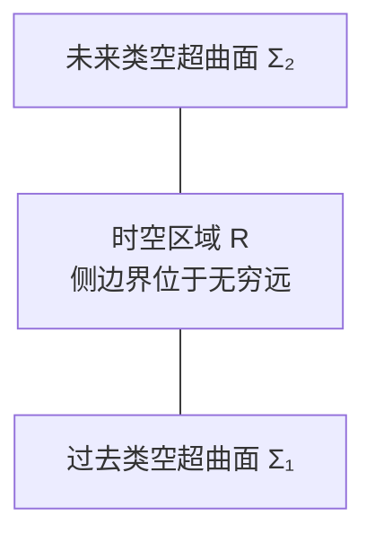

# 附录 E Stokes 定理

[返回系列目录](../spacetime-and-geometry.md) · [上一篇：附录 D 超曲面](./appendix-d-hypersurfaces.md) · [下一篇：附录 F 测地线丛](./appendix-f-geodesic-congruences.md)

<!-- source: PDF 466; printed: 453 -->

第 2.10 节引入了一个观点：流形上的积分把 $n$ 形式场映到实数。由此可以极其优雅地表述微分几何中最强有力的定理之一——**Stokes 定理**。它推广了微积分基本定理

$$
\int_b^a dx=a-b.
$$

设有一个带边界 $\partial M$ 的 $n$ 维区域 $M$，它也可以是整个流形；又设 $M$ 上有一个 $(n-1)$ 形式 $\omega$。附录 D 已经说明了流形边界的含义。此时 $d\omega$ 是可以在 $M$ 上积分的 $n$ 形式，而 $\omega$ 本身可以在 $\partial M$ 上积分。Stokes 定理就是

$$
\boxed{
\int_M d\omega
=
\int_{\partial M}\omega
}.
\tag{E.1}
$$

这个定理的不同特例不仅包括微积分基本定理，还包括三维向量分析中熟悉的 Green 定理、Gauss 定理和 Stokes 定理。

式（E.1）的表述极其优雅，甚至优雅得几乎不便于直接使用。好在我们可以把它改写成朴素的坐标与指标记号。先把 $(n-1)$ 形式 $\omega$ 写成一形式 $V$ 的 Hodge 对偶：

$$
\omega=*V,
\tag{E.2}
$$

其分量为

$$
\begin{aligned}
\omega_{\mu_1\cdots\mu_{n-1}}
&=(*V)_{\mu_1\cdots\mu_{n-1}}\\
&=\epsilon^\nu{}_{\mu_1\cdots\mu_{n-1}}V_\nu\\
&=\epsilon_{\nu\mu_1\cdots\mu_{n-1}}V^\nu.
\end{aligned}
\tag{E.3}
$$

这里 $\epsilon$ 是 $M$ 上的 Levi–Civita $n$ 形式，最后一行把 $V$ 的指标升了起来。若想从 $\omega$ 重建 $V$，再次施加 Hodge 算子即可：

$$
V
=
(-1)^{s+n-1}**V
=
(-1)^{s+n-1}*\omega,
\tag{E.4}
$$

<!-- source: PDF 467; printed: 454 -->

其中，对 Lorentz 符号差 $s=-1$，对 Euclidean 符号差 $s=+1$。$\omega=*V$ 的外微分是一个 $n$ 形式：

$$
\begin{aligned}
(d\omega)_{\lambda\mu_1\cdots\mu_{n-1}}
&=(d*V)_{\lambda\mu_1\cdots\mu_{n-1}}\\
&=n\nabla_{[\lambda}
\left(
\epsilon_{|\nu|\mu_1\cdots\mu_{n-1}]}V^\nu
\right)\\
&=n\epsilon_{\nu[\mu_1\cdots\mu_{n-1}}
\nabla_{\lambda]}V^\nu.
\end{aligned}
\tag{E.5}
$$

这里 $n$ 是区域的维数，不要同边界的法向量 $n^\mu$ 混淆。任意 $n$ 形式都可以写成某个函数 $f(x)$ 乘以 $\epsilon$，等价地，也可写成 $f(x)$ 的 Hodge 对偶：

$$
d\omega=f\epsilon=*f.
\tag{E.6}
$$

对两边取对偶，得到

$$
f
=
(-1)^s**f
=
(-1)^s*d\omega.
\tag{E.7}
$$

在当前情形中，

$$
\begin{aligned}
*d\omega
&=*d*V\\
&=\frac1{n!}\epsilon^{\lambda\mu_1\cdots\mu_{n-1}}
\left(
n\epsilon_{\nu[\mu_1\cdots\mu_{n-1}}
\nabla_{\lambda]}V^\nu
\right)\\
&=\frac1{(n-1)!}(-1)^s(n-1)!
\delta^\lambda{}_{\nu}\nabla_\lambda V^\nu\\
&=(-1)^s\nabla_\nu V^\nu.
\end{aligned}
\tag{E.8}
$$

最后回忆，Levi–Civita 张量就是体积元：

$$
\begin{aligned}
\epsilon
&=\sqrt{|g|}\,dx^1\wedge\cdots\wedge dx^n\\
&=\sqrt{|g|}\,d^nx.
\end{aligned}
\tag{E.9}
$$

合并以上结果，有

$$
d\omega
=
\nabla_\nu V^\nu\sqrt{|g|}\,d^nx.
\tag{E.10}
$$

因此，在 $n$ 维流形上，$(n-1)$ 形式的外微分恰好是表示向量散度的一种利落方式，只需再乘以度规体积元。

为理解式（E.1）的右边，回忆上一附录的结论：超曲面（例如边界）上的诱导体积元为

$$
\hat\epsilon
=
\sqrt{|\gamma|}\,d^{n-1}y,
\tag{E.11}
$$

其中 $\gamma_{ij}$ 是以坐标 $y^i$ 表示的边界诱导度规。$\hat\epsilon$ 在 $M$ 的 $x^\mu$ 坐标中的分量为

$$
\hat\epsilon_{\mu_1\cdots\mu_{n-1}}
=
n^\lambda\epsilon_{\lambda\mu_1\cdots\mu_{n-1}},
\tag{E.12}
$$

<!-- source: PDF 468; printed: 455 -->

其中 $n^\mu$ 是边界的单位法向量。对一般超曲面，$n^\mu$ 的符号可以任意选择；当超曲面是某个区域的边界时，则有朝内与朝外之分。要正确恢复 Stokes 定理，有一点至关重要：若边界为类时的，应把 $n^\mu$ 选成向内；若边界为类空的，应把它选成向外。

$\omega$ 是 $(n-1)$ 形式，所以限制到 $(n-1)$ 维边界以后，它必定与 $\hat\epsilon$ 成比例。仿照上一段的推导可得

$$
\omega
=
n_\mu V^\mu\sqrt{|\gamma|}\,d^{n-1}y.
\tag{E.13}
$$

于是 Stokes 定理把向量场的散度同它在边界上的值联系起来：

$$
\boxed{
\int_M d^nx\sqrt{|g|}\,\nabla_\mu V^\mu
=
\int_{\partial M}d^{n-1}y\sqrt{|\gamma|}\,n_\mu V^\mu
}.
\tag{E.14}
$$

这是广义相对论中最常见的 Stokes 定理版本。

## 守恒流与守恒荷

不要以为应用 Stokes 定理一定要降到指标记号。作为一个简单的反例，下面说明同守恒流对应的电荷在十分一般的意义下都是“守恒”的：它不仅在某个特定坐标系中不随时间变化，而且在合理假设下，穿过类空超曲面 $\Sigma$ 的电荷完全不依赖超曲面的选择。

设有守恒流 $J^\mu$，也就是

$$
\nabla_\mu J^\mu=0.
\tag{E.15}
$$

用一形式 $J_\mu=g_{\mu\nu}J^\nu$ 表示，守恒条件可以改写成

$$
d(*J)=0.
\tag{E.16}
$$

定义穿过超曲面 $\Sigma$ 的电荷为

$$
Q_\Sigma
=
-\int_\Sigma *J.
\tag{E.17}
$$

通常会把 $\Sigma$ 选为恒定时间超曲面，此时 $Q_\Sigma$ 就是该时刻整个空间中的总电荷；不过，这个公式适用得更广。负号是一项约定，可以暂时转成分量来理解。对照式（E.2）和式（E.13），式（E.17）成为

$$
Q_\Sigma
=
-\int_\Sigma d^{n-1}y\sqrt{|\gamma|}\,n_\mu J^\mu.
\tag{E.18}
$$

这个负号补偿了 $n^\mu$ 的时间分量在降指标时得到的负号，从而使正电荷密度 $\rho=J^0$ 给出正的积分总电荷。

<!-- source: PDF 469; printed: 456 -->

现在考虑四维时空区域 $R$：它位于两个空间超曲面 $\Sigma_1$ 与 $\Sigma_2$ 之间，如图 E.1 所示。连接这两个超曲面的那部分边界位于无穷远处，并假设所有场在那里消失，因而可以忽略。守恒律（E.16）和 Stokes 定理（E.1）给出

> **图 E.1**　时空区域 $R$ 的空间方向边界位于无穷远；其未来与过去边界包含两个空间超曲面 $\Sigma_2$ 与 $\Sigma_1$。

$$
\begin{aligned}
0
&=\int_R d(*J)\\
&=\int_{\partial R}*J\\
&=\int_{\Sigma_1}*J-\int_{\Sigma_2}*J\\
&=Q_1-Q_2.
\end{aligned}
\tag{E.19}
$$

第三行的负号来自 $\Sigma_2$ 从 $R$ 继承的取向：它的法向量指向内部，与单独对 $\Sigma_2$ 积分时的惯例选择相反。只要电流在无穷远处消失，在任意类空超曲面 $\Sigma$ 上计算的 $Q_\Sigma$ 都相同。因此，Stokes 定理说明了无散流的存在怎样蕴含守恒荷的存在。

## 用边界通量计算电荷

Stokes 定理的另一项用途，对应于三维 Euclidean 空间中 Gauss 定理的通常用法：通过在超曲面上积分，真正算出电荷 $Q$。考虑四维时空中的 Maxwell 方程，它描述电磁场强张量 $F_{\mu\nu}$ 如何响应守恒四维电流：

$$
\nabla_\mu F^{\nu\mu}=J^\nu.
\tag{E.20}
$$

于是可以在式（E.18）中代入 $\nabla_\nu F^{\nu\mu}$ 来计算电荷：

$$
Q
=
-\int_\Sigma d^3y\sqrt{|\gamma|}\,
n_\mu\nabla_\nu F^{\nu\mu}.
\tag{E.21}
$$

每当反对称张量场 $F^{\mu\nu}=-F^{\nu\mu}$ 的散度在超曲面 $\Sigma$ 上积分时，都可以仿照推导式（E.14）的步骤，把散度同 $F^{\mu\nu}$ 在边界上的值联系起来。若超曲面为类时的，这个边界位于空间无穷远：

$$
\boxed{
\int_\Sigma d^{n-1}y\sqrt{|\gamma|}\,
n_\mu\nabla_\nu F^{\mu\nu}
=
\int_{\partial\Sigma}d^{n-2}z
\sqrt{\left|\gamma^{(\partial\Sigma)}\right|}\,
n_\mu\sigma_\nu F^{\mu\nu}
}.
\tag{E.22}
$$

其中 $z^a$ 是 $\partial\Sigma$ 上的坐标，$\gamma_{ab}^{(\partial\Sigma)}$ 是 $\partial\Sigma$ 上的诱导度规，$\sigma^\mu$ 是 $\partial\Sigma$ 的单位法向量。也许会担心对 $\partial\Sigma$ 的积分，因为“边界的边界为零”；然而，$\Sigma$ 只是一块区域边界的组成部分，并非任何区域的完整边界，所以它完全可以有自己的边界。

<!-- source: PDF 470; printed: 457 -->

为确认这套方法确实可用，下面在 Minkowski 空间中恢复点粒子的电荷。把度规写成极坐标形式：

$$
ds^2
=
-dt^2+dr^2+r^2d\theta^2+r^2\sin^2\theta\,d\phi^2.
\tag{E.23}
$$

在本书所用的 Lorentz–Heaviside 约定中，Maxwell 方程不含 $4\pi$；电荷 $q$ 的电场为

$$
E^r=\frac{q}{4\pi r^2},
\tag{E.24}
$$

其余分量为零。它同场强张量的关系是

$$
F^{tr}=-F^{rt}=E^r.
\tag{E.25}
$$

两个单位法向量为

$$
n^\mu=(1,0,0,0),
\qquad
\sigma^\mu=(0,1,0,0),
\tag{E.26}
$$

所以

$$
n_\mu\sigma_\nu F^{\mu\nu}
=
-E^r
=
-\frac{q}{4\pi r^2}.
\tag{E.27}
$$

空间无穷远处二球面上的度规为

$$
\gamma_{ab}^{(S^2)}dz^a dz^b
=
r^2d\theta^2+r^2\sin^2\theta\,d\phi^2,
\tag{E.28}
$$

所以体积元为

$$
d^2z\sqrt{\gamma^{(S^2)}}
=
r^2\sin\theta\,d\theta\,d\phi.
\tag{E.29}
$$

把式（E.27）、（E.29）以及（E.21）代入式（E.22），得到

$$
\begin{aligned}
Q
&=
-\lim_{r\to\infty}
\int_{S^2}d\theta\,d\phi\,
r^2\sin\theta
\left(-\frac{q}{4\pi r^2}\right)\\
&=q,
\end{aligned}
\tag{E.30}
$$

这正是所需答案。

<!-- source: PDF 471; printed: 458 -->

PDF 第 471 页为空白页。

---

[返回系列目录](../spacetime-and-geometry.md) · [上一篇：附录 D 超曲面](./appendix-d-hypersurfaces.md) · [下一篇：附录 F 测地线丛](./appendix-f-geodesic-congruences.md)
