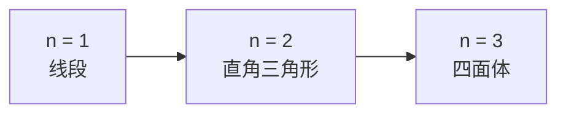

# 附录 I 平行传播子

[返回系列目录](../spacetime-and-geometry.md) · [上一篇：附录 H 共形图](./appendix-h-conformal-diagrams.md) · [下一篇：附录 J 非坐标基](./appendix-j-noncoordinate-bases.md)

<!-- source: PDF 492; printed: 479 -->

沿曲线平行移动一个张量的概念，在广义相对论中显然具有核心重要性。设向量 $V^\mu$ 沿路径 $x^\mu(\lambda)$ 移动，平行移动方程为

$$
\frac{dx^\mu}{d\lambda}\nabla_\mu V^\nu
=
\frac{dx^\mu}{d\lambda}\partial_\mu V^\nu
+
\frac{dx^\mu}{d\lambda}\Gamma^\nu{}_{\mu\sigma}V^\sigma
=0.
\tag{I.1}
$$

可以为这个方程写出显式的一般解。这个解多少有些形式化，但它本身很有趣，而且与量子场论中的一些技术有密切联系。

考虑路径

$$
\gamma:\lambda\longmapsto x^\sigma(\lambda).
$$

求解向量 $V^\mu$ 的平行移动方程，等价于寻找一个矩阵 $P^\mu{}_{\rho}(\lambda,\lambda_0)$，把向量的初值 $V^\mu(\lambda_0)$ 同它在路径下游某处的值联系起来：

$$
V^\mu(\lambda)
=
P^\mu{}_{\rho}(\lambda,\lambda_0)V^\rho(\lambda_0).
\tag{I.2}
$$

矩阵 $P^\mu{}_{\rho}(\lambda,\lambda_0)$ 称为**平行传播子**（parallel propagator），它当然依赖路径 $\gamma$；很难找到一种既能表示这种依赖、又不让 $\gamma$ 看起来像指标的记号。定义

$$
A^\mu{}_{\rho}(\lambda)
=
-\Gamma^\mu{}_{\sigma\rho}
\frac{dx^\sigma}{d\lambda},
\tag{I.3}
$$

其中右端各量在 $x^\nu(\lambda)$ 处求值，平行移动方程便成为

$$
\frac{d}{d\lambda}V^\mu
=
A^\mu{}_{\rho}V^\rho.
\tag{I.4}
$$

平行传播子必须适用于任意向量。把式（I.2）代入式（I.4）可知，$P^\mu{}_{\rho}(\lambda,\lambda_0)$ 也满足

$$
\frac{d}{d\lambda}P^\mu{}_{\rho}(\lambda,\lambda_0)
=
A^\mu{}_{\sigma}(\lambda)
P^\sigma{}_{\rho}(\lambda,\lambda_0).
\tag{I.5}
$$

为求解此方程，先对两边积分：

$$
P^\mu{}_{\rho}(\lambda,\lambda_0)
=
\delta^\mu{}_{\rho}
+
\int_{\lambda_0}^{\lambda}
A^\mu{}_{\sigma}(\eta)
P^\sigma{}_{\rho}(\eta,\lambda_0)\,d\eta.
\tag{I.6}
$$

<!-- source: PDF 493; printed: 480 -->

容易看出，Kronecker delta 为 $\lambda=\lambda_0$ 提供了正确的归一化。

可以迭代求解式（I.6）：把右端反复代回它自身，得到

$$
\begin{aligned}
P^\mu{}_{\rho}(\lambda,\lambda_0)
={}&\delta^\mu{}_{\rho}
+\int_{\lambda_0}^{\lambda}A^\mu{}_{\rho}(\eta)\,d\eta\\
&+\int_{\lambda_0}^{\lambda}\int_{\lambda_0}^{\eta}
A^\mu{}_{\sigma}(\eta)
A^\sigma{}_{\rho}(\eta')\,d\eta'\,d\eta
+\cdots.
\end{aligned}
\tag{I.7}
$$

这个级数的第 $n$ 项是在 $n$ 维直角三角形，也就是 $n$ 单纯形上的积分。前三阶分别为

$$
\begin{gathered}
\int_{\lambda_0}^{\lambda}A(\eta_1)\,d\eta_1,\\[4pt]
\int_{\lambda_0}^{\lambda}\int_{\lambda_0}^{\eta_2}
A(\eta_2)A(\eta_1)\,d\eta_1\,d\eta_2,\\[4pt]
\int_{\lambda_0}^{\lambda}\int_{\lambda_0}^{\eta_3}
\int_{\lambda_0}^{\eta_2}
A(\eta_3)A(\eta_2)A(\eta_1)\,d^3\eta.
\end{gathered}
$$

> **图 I.1**　$n=1,2,3$ 时的 $n$ 单纯形，也就是 $n$ 维直角三角形。积分区域由 $\lambda\ge\eta_n\ge\cdots\ge\eta_1\ge\lambda_0$ 给出。

如果能把这种积分视为在 $n$ 维立方体而非 $n$ 单纯形上进行，事情会简单很多。每个立方体中有 $n!$ 个这样的单纯形，所以必须乘以 $1/n!$ 来补偿增加的体积。不过，还必须把被积函数处理正确。使用矩阵记号时，$n$ 阶被积函数是

$$
A(\eta_n)A(\eta_{n-1})\cdots A(\eta_1),
$$

并具有特殊次序 $\eta_n\ge\eta_{n-1}\ge\cdots\ge\eta_1$。因此定义**路径排序符号** $\mathcal P$ 来保证这个条件。表达式

$$
\mathcal P
\left[
A(\eta_n)A(\eta_{n-1})\cdots A(\eta_1)
\right]
\tag{I.8}
$$

表示把 $n$ 个矩阵 $A(\eta_i)$ 排序，使最大的 $\eta_i$ 位于最左边，之后的每一个 $\eta_i$ 都小于或等于前一个。

<!-- source: PDF 494; printed: 481 -->

于是，式（I.7）的 $n$ 阶项可以表示为

$$
\begin{aligned}
&\int_{\lambda_0}^{\lambda}
\int_{\lambda_0}^{\eta_n}\cdots
\int_{\lambda_0}^{\eta_2}
A(\eta_n)A(\eta_{n-1})\cdots A(\eta_1)\,d^n\eta\\
&\qquad=
\frac1{n!}
\int_{\lambda_0}^{\lambda}\cdots\int_{\lambda_0}^{\lambda}
\mathcal P
\left[
A(\eta_n)A(\eta_{n-1})\cdots A(\eta_1)
\right]\,d^n\eta.
\end{aligned}
\tag{I.9}
$$

这个表达式没有对矩阵 $A(\eta_i)$ 作任何实质性断言，它只是一种记号。现在可把式（I.7）写成矩阵形式：

$$
P(\lambda,\lambda_0)
=
\mathbf 1
+
\sum_{n=1}^{\infty}\frac1{n!}
\int_{\lambda_0}^{\lambda}
\mathcal P
\left[
A(\eta_n)A(\eta_{n-1})\cdots A(\eta_1)
\right]\,d^n\eta.
\tag{I.10}
$$

这正是指数函数的级数表达式。因此，平行传播子可写成**路径排序指数**：

$$
P(\lambda,\lambda_0)
=
\mathcal P\exp\left(
\int_{\lambda_0}^{\lambda}A(\eta)\,d\eta
\right).
\tag{I.11}
$$

这仍是一种记号；路径排序指数按式（I.10）的右端定义。把 $A$ 展开，可以更明确地写成

$$
\boxed{
P^\mu{}_{\nu}(\lambda,\lambda_0)
=
\mathcal P\exp\left(
-\int_{\lambda_0}^{\lambda}
\Gamma^\mu{}_{\sigma\nu}
\frac{dx^\sigma}{d\eta}\,d\eta
\right)
}.
\tag{I.12}
$$

即使这个显式公式颇为抽象，拥有它仍然很有用。相同形式的表达式在量子场论中以“Dyson 公式”出现；原因是时间演化算符的 Schrödinger 方程具有与式（I.5）相同的形式。

当路径是一条从某点出发又回到同一点的闭环时，平行传播子给出一个格外有趣的例子。若联络与度规相容，所得矩阵就是作用于该点切空间的 Lorentz 变换。这个变换称为闭环的**和乐**（holonomy）。知道所有可能闭环的和乐，等价于知道度规。

于是，可以用“环表示”研究广义相对论：基本变量取为和乐，而非显式度规。称为“圈量子引力”（loop quantum gravity）的研究方案试图直接用这些变量量子化广义相对论；这与弦论之类的方案不同，后者会在某个极限中导出广义相对论。沿这个方向已经取得大量数学进展，但根本性障碍仍然存在。[^1]

[^1]: 关于这一方案的综述，见 C. Rovelli, “Loop quantum gravity,” *Living Reviews in Relativity* **1**, 1 (1998)，[arXiv:gr-qc/9710008](https://arxiv.org/abs/gr-qc/9710008)。

<!-- source: PDF 495; printed: 482 -->

PDF 第 495 页为空白页。

---

[返回系列目录](../spacetime-and-geometry.md) · [上一篇：附录 H 共形图](./appendix-h-conformal-diagrams.md) · [下一篇：附录 J 非坐标基](./appendix-j-noncoordinate-bases.md)
