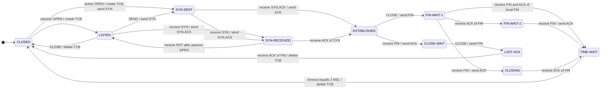
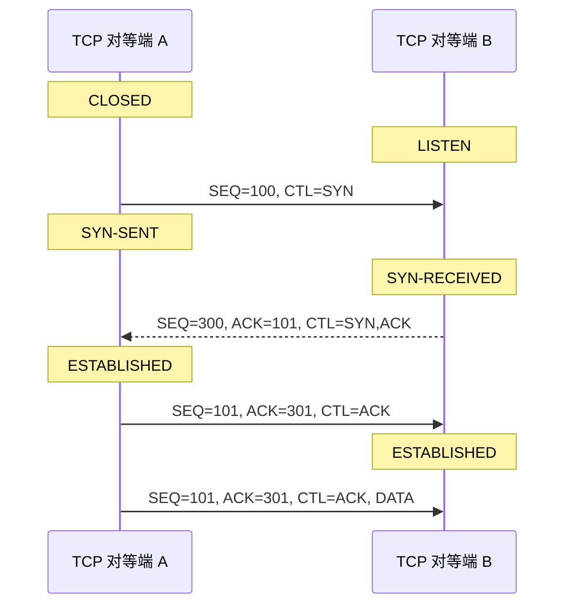
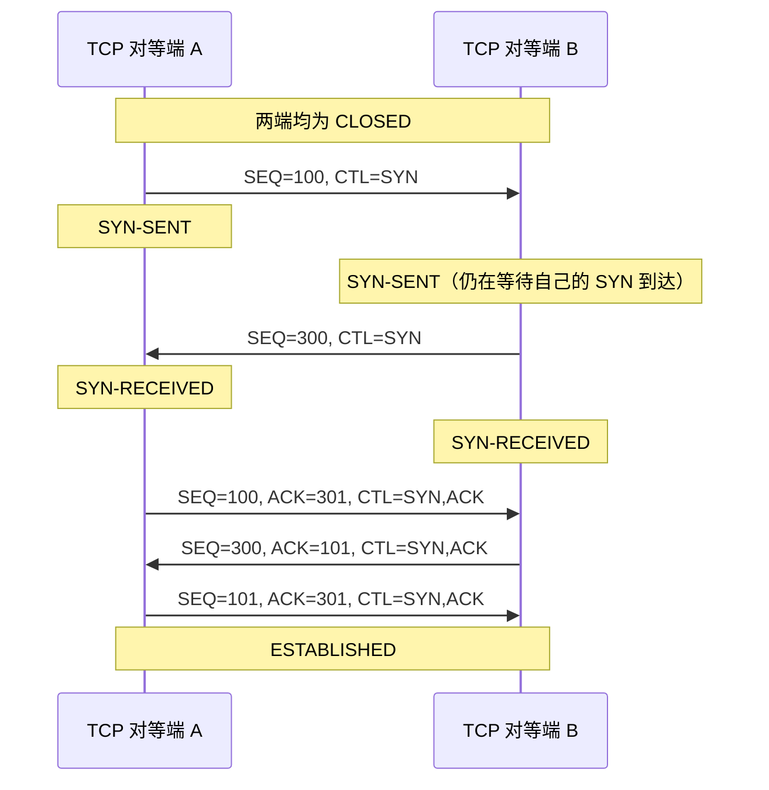
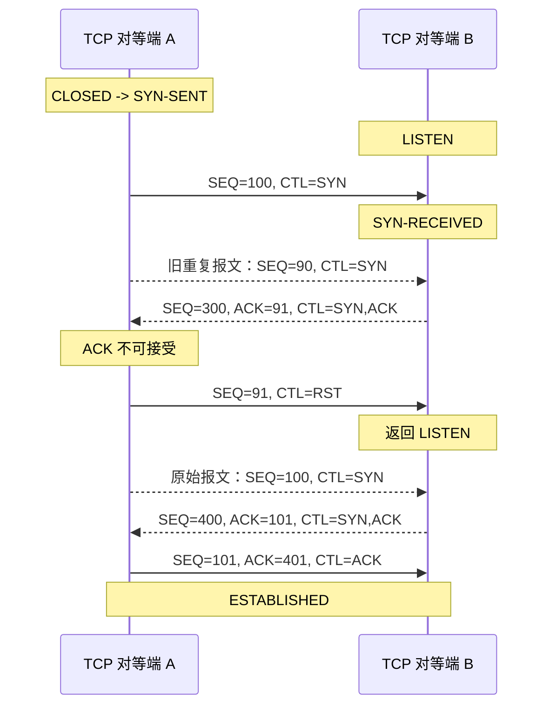
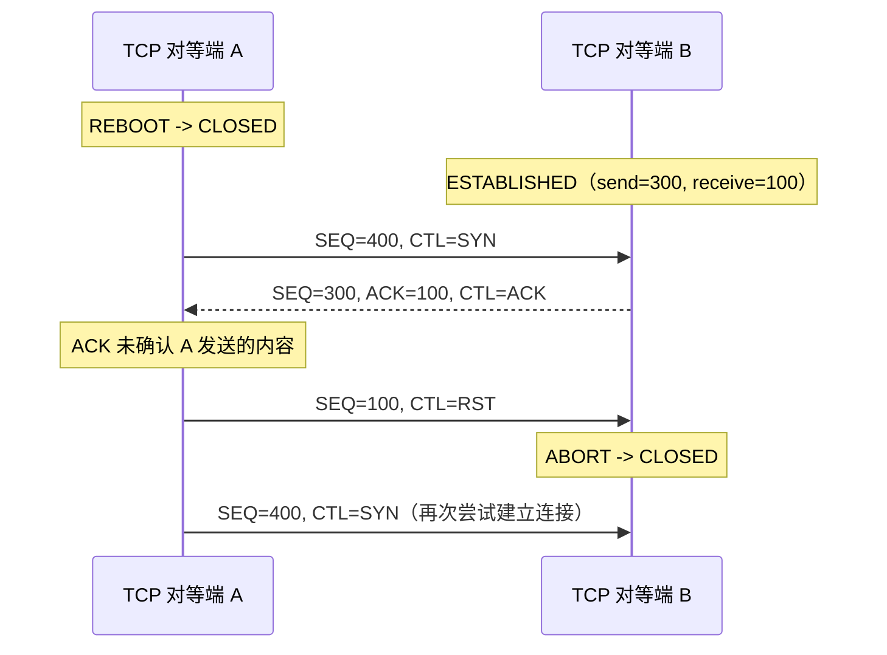
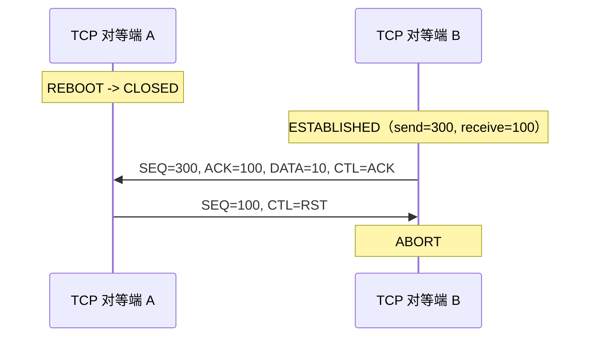
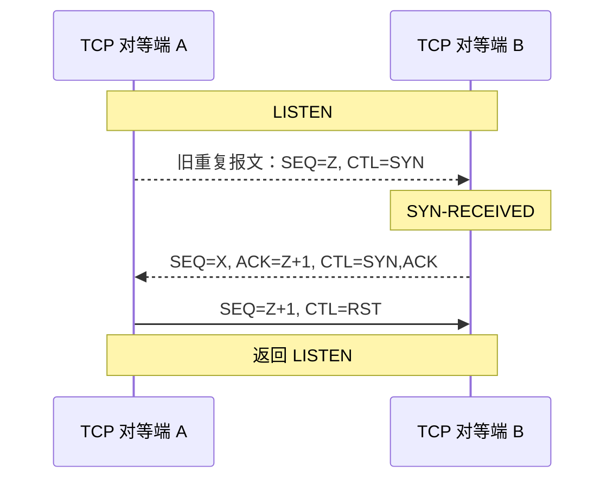
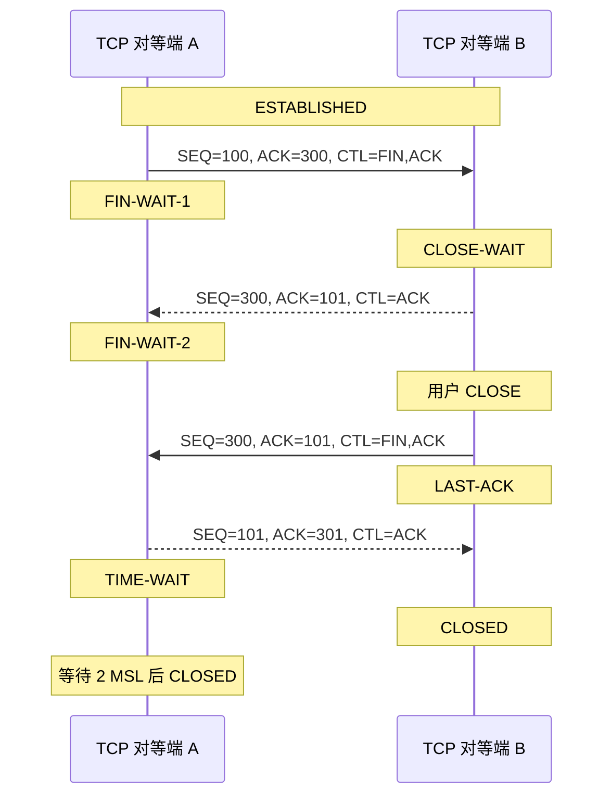
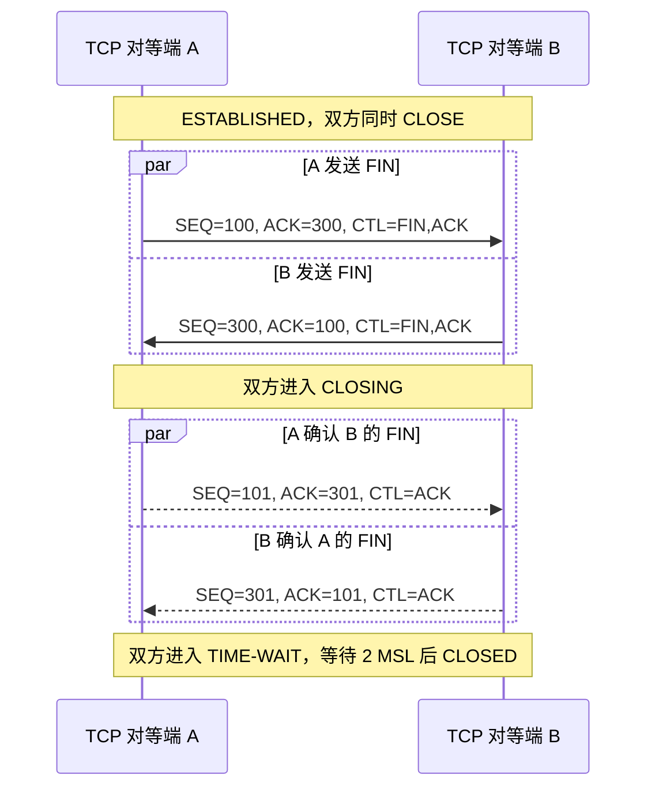
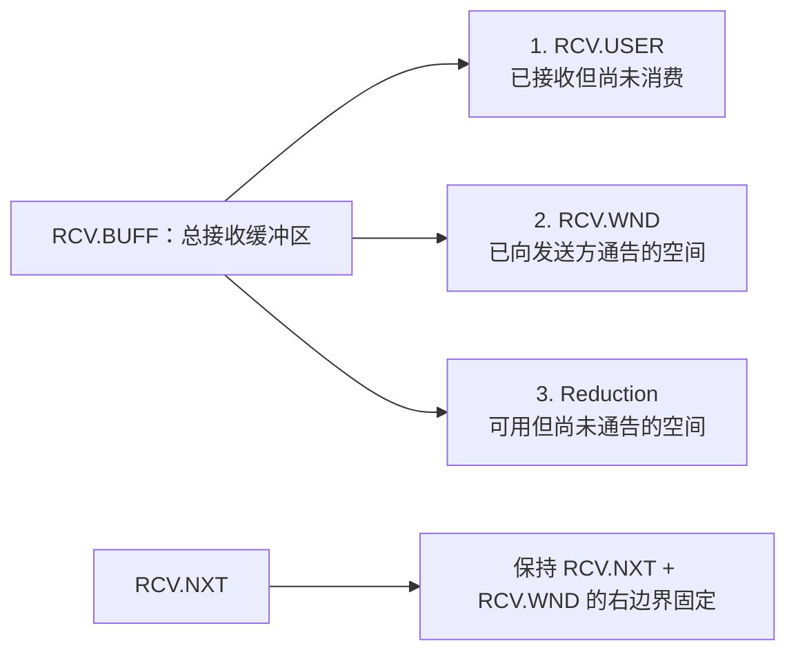

# RFC 9293：传输控制协议（TCP）

> 原文：W. Eddy（编），MTI Systems，2022 年 8 月。本文依据 [RFC 9293 原文](https://www.rfc-editor.org/rfc/rfc9293.html)整理为单篇中文 Markdown，保留 RFC 的章节编号、协议变量、状态名、图示和需求标签。

::: warning 翻译说明

这是便于中文阅读的非官方译文。涉及协议一致性的场合，请以 IETF 发布的英文 RFC 9293 为准。文中的规范性关键字保留英文大写，并在第 2.1 节给出对应的中文解释；`MUST-`、`SHLD-`、`MAY-`、`REC-` 标签也全部保留，便于和附录 B 的需求汇总对应。

:::

## 阅读导航

<details open>
<summary>展开目录</summary>

- [摘要](#section-abstract)
- [文档状态与版权声明](#section-boilerplate)
- [1. 目的与范围](#section-1)
- [2. 引言](#section-2)
  - [2.1. 需求语言](#section-2-1)
  - [2.2. TCP 的关键概念](#section-2-2)
- [3. 功能规范](#section-3)
  - [3.1. 首部格式](#section-3-1)
  - [3.2. 特定选项定义](#section-3-2)
  - [3.3. TCP 术语概览](#section-3-3)
  - [3.4. 序列号](#section-3-4)
  - [3.5. 建立连接](#section-3-5)
  - [3.6. 关闭连接](#section-3-6)
  - [3.7. 分段](#section-3-7)
  - [3.8. 数据通信](#section-3-8)
  - [3.9. 接口](#section-3-9)
  - [3.10. 事件处理](#section-3-10)
- [4. 术语表](#section-4)
- [5. 相对于 RFC 793 的变更](#section-5)
- [6. IANA 注意事项](#section-6)
- [7. 安全与隐私注意事项](#section-7)
- [8. 参考文献](#section-8)
- [附录 A：其他实现说明](#appendix-a)
- [附录 B：TCP 需求汇总](#appendix-b)
- [致谢](#acknowledgments)
- [作者地址](#authors-address)

</details>

## RFC 元数据

| 项目 | 内容 |
| --- | --- |
| RFC | 9293 |
| STD | 7 |
| 状态 | Internet Standard（互联网标准） |
| 类别 | Standards Track（标准化轨道） |
| 发布 | 2022 年 8 月 |
| 作者 | W. Eddy（编） |
| 组织 | MTI Systems |
| 废止 | RFC 793、879、2873、6093、6429、6528、6691 |
| 更新 | RFC 1011、1122、5961 |

## 摘要

<a id="section-abstract"></a>

本文规定传输控制协议（Transmission Control Protocol，TCP）。TCP 是互联网协议栈中重要的传输层协议，随着互联网数十年的使用与发展持续演进。在此期间，RFC 793 所规定的 TCP 经历了许多变化，但这些变化一直以零散方式记录。本文把这些变更与 RFC 793 的协议规范汇集起来。本文废止 RFC 793，以及用于更新 RFC 793 部分内容的 RFC 879、2873、6093、6429、6528 和 6691。本文更新 RFC 1011 和 RFC 1122，应视为取代其中涉及 TCP 需求的部分。本文还通过澄清 `SYN-RECEIVED` 状态下的复位处理，对 RFC 5961 作了一处小幅更新。RFC 793 中的 TCP 首部控制位也依据 RFC 3168 作了更新。

## 文档状态与版权声明

<a id="section-boilerplate"></a>

### 本备忘录的状态

<a id="section-status-of-memo"></a>

本文属于互联网标准化轨道文档。

本文是互联网工程任务组（IETF）的成果，代表 IETF 社区的共识。本文已接受公开审阅，并已获互联网工程指导组（IESG）批准发布。关于互联网标准的更多信息，请参见 RFC 7841 第 2 节。

本文当前状态、勘误信息以及反馈方式见 [RFC 9293 信息页](https://www.rfc-editor.org/info/rfc9293)。

### 版权声明

<a id="section-copyright"></a>

版权所有 © 2022 IETF Trust 以及文档作者中列出的人员。保留所有权利。

本文受发布日生效的 BCP 78 以及 [IETF Trust 关于 IETF 文档的法律规定](https://trustee.ietf.org/license-info)约束。请仔细阅读这些文档，它们说明了与本文相关的权利和限制。从本文提取的代码组件必须包含 Trust 法律规定第 4.e 节所描述的修订版 BSD 许可证文本，并按照修订版 BSD 许可证中的说明按“现状”提供，不附带任何保证。

本文可能包含 2008 年 11 月 10 日之前发布或公开的 IETF 文档或 IETF 贡献中的材料。控制这些材料版权的人员可能没有授予 IETF Trust 权利，允许在 IETF 标准化流程之外修改这些材料。除非获得相关版权控制者的适当许可，本文不得在 IETF 标准化流程之外修改，也不得据此创建衍生作品；但可以将其格式化为 RFC 发布格式，或翻译成英语之外的语言。

::: tip 关于规范性语言

译文中的 `MUST`、`MUST NOT`、`REQUIRED`、`SHALL`、`SHALL NOT`、`SHOULD`、`SHOULD NOT`、`RECOMMENDED`、`NOT RECOMMENDED`、`MAY`、`OPTIONAL` 与英文原文保持一致。它们的精确定义见 [2.1. 需求语言](#section-2-1)。

:::

## 1. 目的与范围

<a id="section-1"></a>

1981 年发布了 [RFC 793](https://www.rfc-editor.org/rfc/rfc793)，记录传输控制协议（TCP），并取代了此前公布的 TCP 规范。

从那以后，TCP 得到了广泛实现，并被互联网中的大量应用用作传输协议。

数十年来，RFC 793 与其他若干文档共同构成了 TCP 的核心规范（参见 [RFC 7414](https://www.rfc-editor.org/rfc/rfc7414)）。随着时间推移，RFC 793 收到了许多勘误；人们也发现并解决了安全、性能以及其他方面的缺陷。增强项散落在越来越多的独立文档中，却始终没有汇总成对基础规范的一次全面更新。

本文的目的，是汇集对 TCP 基础功能规范（RFC 793）所作的全部 IETF 标准化轨道变更和其他澄清，并将它们统一为更新后的规范版本。

本文引用了 TCP 所用的重要算法（例如拥塞控制）的配套文档，但没有把这些算法完整纳入本文。这是有意为之：基础规范可以与独立开发并纳入的多种附加算法配合使用。本文聚焦于所有 TCP 实现都必须支持、从而实现互操作的共同基础。由于一些附加 TCP 特性本身已经相当复杂（例如高级丢包恢复和拥塞控制），未来的配套文档可能也会尝试把这些内容汇集起来。

除了描述 TCP 报文段格式、生成和处理规则的协议规范（这些规则需要落实到代码中），RFC 793 及其后续更新还包含帮助读者理解协议设计和运行方式的信息性、描述性文字。本文不试图修改或更新这些信息性文字，只关注规范性协议规范的更新。在适当位置，本文保留了指向包含重要解释和设计理由的文档的引用。

本文既适合用于检查现有 TCP 实现是否符合规范，也适合用于编写新的 TCP 实现。

## 2. 引言

<a id="section-2"></a>

RFC 793 讨论了 TCP 的设计目标，并给出了运行示例，包括建立连接、终止连接以及通过重传修复丢失报文的示例。

本文描述现代 TCP 实现应具备的基本功能，并取代 RFC 793 中的协议规范。本文没有复现或尝试更新 RFC 793 第 1、2 节中的引言和设计理念内容，而是引用其他文档来解释运行原理、设计理由和具体设计决策。本文只关注协议的规范性行为。

《TCP 路线图》（[RFC 7414](https://www.rfc-editor.org/rfc/rfc7414)）更全面地介绍了定义 TCP 以及描述各种重要算法的 RFC。TCP 路线图还介绍了一些强烈鼓励实现的增强项，它们可以在本文规定的基本运行之上改善 TCP 的性能和其他方面。例如，实现拥塞控制（如 [RFC 5681](https://www.rfc-editor.org/rfc/rfc5681)）是 TCP 的要求，但它本身很复杂，且存在许多不影响基本互操作性的选项和可能性，因此本文不详细描述。同样，现今大多数 TCP 实现都包含 [RFC 7323](https://www.rfc-editor.org/rfc/rfc7323) 中的高性能扩展，但这些扩展并非严格要求，本文也不讨论。TCP 的多路径问题另由 [RFC 8684](https://www.rfc-editor.org/rfc/rfc8684) 规定。

RFC 793 的变更列表见[第 5 节](#section-5)。

### 2.1. 需求语言

<a id="section-2-1"></a>

当且仅当下列关键字以全部大写形式出现时，本文中的 `MUST`、`MUST NOT`、`REQUIRED`、`SHALL`、`SHALL NOT`、`SHOULD`、`SHOULD NOT`、`RECOMMENDED`、`NOT RECOMMENDED`、`MAY` 和 `OPTIONAL` 应按照 BCP 14（[RFC 2119](https://www.rfc-editor.org/rfc/rfc2119) 与 [RFC 8174](https://www.rfc-editor.org/rfc/rfc8174)）中的定义解释。

文档中的每一次 RFC 2119 关键字使用都单独标记，并在附录 B 中引用；附录 B 汇总了实现需求。

使用 `MUST` 的句子标记为 `MUST-X`，其中 `X` 是数字标识符，便于附录 B 引用时定位需求。

同理，使用 `SHOULD` 的句子标记为 `SHLD-X`，使用 `MAY` 的句子标记为 `MAY-X`，使用 `RECOMMENDED` 的句子标记为 `REC-X`。

对于这种标记方式，`SHOULD NOT` 和 `MUST NOT` 分别按 `SHOULD` 和 `MUST` 的实例标记。

### 2.2. TCP 的关键概念

<a id="section-2-2"></a>

TCP 向应用提供可靠、有序的字节流服务。

应用字节流通过 TCP 报文段在网络上传输；每个 TCP 报文段都作为一个互联网协议（IP）数据报发送。

TCP 的可靠性包括：通过序列号检测分组丢失，通过每个报文段的校验和检测错误，以及通过重传进行纠正。

TCP 支持单播传输数据。有些任播应用无需修改即可成功使用 TCP，但由于下层转发行为发生变化，存在不稳定风险（参见 [RFC 7094](https://www.rfc-editor.org/rfc/rfc7094)）。

TCP 面向连接，但它本身并不包含检测连接存活性的能力。

TCP 连接支持双向数据流；应用也可以自行选择只沿一个方向发送数据。

TCP 使用端口号标识应用服务，并在主机之间复用不同的数据流。

关于 TCP 相对于其他传输协议的特性的更详细说明，见 [RFC 8095 第 3.1 节](https://www.rfc-editor.org/rfc/rfc8095)。关于开发 TCP 的动机及其在互联网协议栈中的作用，见 RFC 793 第 2 节以及更早版本的 TCP 规范。

## 3. 功能规范

<a id="section-3"></a>

### 3.1. 首部格式

<a id="section-3-1"></a>

TCP 报文段以互联网数据报形式发送。IP 首部携带多个信息字段，包括源主机地址和目的主机地址（参见 [RFC 791](https://www.rfc-editor.org/rfc/rfc791) 与 [RFC 8200](https://www.rfc-editor.org/rfc/rfc8200)）。TCP 首部紧随 IP 首部之后，提供 TCP 专用的信息。这种分层使除 TCP 之外的其他主机级协议成为可能。在互联网协议套件早期开发阶段，IP 首部字段曾经是 TCP 的一部分。

本文描述使用 TCP 首部的 TCP。

TCP 首部后面可以跟随报文段中的用户数据，其格式如下。图示风格参考了[增强型 ASCII 报文首部图](https://datatracker.ietf.org/doc/html/draft-mcquistin-augmented-ascii-diagrams-10)。图中的每个刻度线代表一个比特位置。

```text
    0                   1                   2                   3
    0 1 2 3 4 5 6 7 8 9 0 1 2 3 4 5 6 7 8 9 0 1 2 3 4 5 6 7 8 9 0 1
   +-+-+-+-+-+-+-+-+-+-+-+-+-+-+-+-+-+-+-+-+-+-+-+-+-+-+-+-+-+-+-+-+
   |          Source Port          |       Destination Port        |
   +-+-+-+-+-+-+-+-+-+-+-+-+-+-+-+-+-+-+-+-+-+-+-+-+-+-+-+-+-+-+-+-+
   |                        Sequence Number                        |
   +-+-+-+-+-+-+-+-+-+-+-+-+-+-+-+-+-+-+-+-+-+-+-+-+-+-+-+-+-+-+-+-+
   |                    Acknowledgment Number                      |
   +-+-+-+-+-+-+-+-+-+-+-+-+-+-+-+-+-+-+-+-+-+-+-+-+-+-+-+-+-+-+-+-+
   |  Data |       |C|E|U|A|P|R|S|F|                               |
   | Offset| Rsrvd |W|C|R|C|S|S|Y|I|            Window             |
   |       |       |R|E|G|K|H|T|N|N|                               |
   +-+-+-+-+-+-+-+-+-+-+-+-+-+-+-+-+-+-+-+-+-+-+-+-+-+-+-+-+-+-+-+-+
   |           Checksum            |         Urgent Pointer        |
   +-+-+-+-+-+-+-+-+-+-+-+-+-+-+-+-+-+-+-+-+-+-+-+-+-+-+-+-+-+-+-+-+
   |                           [Options]                           |
   +-+-+-+-+-+-+-+-+-+-+-+-+-+-+-+-+-+-+-+-+-+-+-+-+-+-+-+-+-+-+-+-+
   |                                                               :
   :                             Data                              :
   :                                                               |
   +-+-+-+-+-+-+-+-+-+-+-+-+-+-+-+-+-+-+-+-+-+-+-+-+-+-+-+-+-+-+-+-+
```

**图 1：TCP 首部格式。**

下列字段组成 TCP 首部：

| 字段 | 长度 | 含义 |
| --- | ---: | --- |
| Source Port（源端口） | 16 bit | 源端口号。 |
| Destination Port（目的端口） | 16 bit | 目的端口号。 |
| Sequence Number（序列号） | 32 bit | 本报文段中第一个数据八位组的序列号（设置 `SYN` 标志时例外）。如果设置了 `SYN`，该字段为初始序列号（ISN），第一个数据八位组的序列号为 `ISN+1`。 |
| Acknowledgment Number（确认号） | 32 bit | 如果设置了 `ACK` 控制位，该字段包含报文段发送方期望接收的下一个序列号。连接建立后，该字段始终发送。 |
| Data Offset（数据偏移，DOffset） | 4 bit | TCP 首部包含的 32 位字数，指出数据从哪里开始。TCP 首部（包括选项时也如此）的长度必须是 32 位的整数倍。 |
| Reserved（保留，Rsrvd） | 4 bit | 为未来使用而保留的一组控制位。生成的报文段中必须为零；如果发送方或接收方未实现相应的未来特性，收到这些位时必须忽略。 |
| Window（窗口） | 16 bit | 从确认字段所指示的序列号开始，发送方愿意接收的数据八位组数量。使用窗口缩放扩展时，该值会经过缩放。 |
| Checksum（校验和） | 16 bit | 首部和正文所有 16 位字的反码和的 16 位反码。 |
| Urgent Pointer（紧急指针） | 16 bit | 当前紧急指针相对于本报文段序列号的正偏移量；它指向紧急数据之后那个八位组的序列号。只有设置 `URG` 控制位的报文段才解释此字段。 |
| Options（选项） | 可变 | TCP 选项及其尾部填充，仅当 `DOffset > 5` 时存在。 |
| Data（数据） | 可变 | TCP 报文段携带的用户数据。 |

#### 控制位

控制位也称为“标志”。其分配由 IANA 的 [TCP Header Flags 注册表](https://www.iana.org/assignments/tcp-parameters/)管理。当前已分配的控制位是 `CWR`、`ECE`、`URG`、`ACK`、`PSH`、`RST`、`SYN` 和 `FIN`。

| 标志 | 长度 | 含义 |
| --- | ---: | --- |
| `CWR` | 1 bit | Congestion Window Reduced，拥塞窗口减小（参见 [RFC 3168](https://www.rfc-editor.org/rfc/rfc3168)）。 |
| `ECE` | 1 bit | ECN-Echo，ECN 回显（参见 [RFC 3168](https://www.rfc-editor.org/rfc/rfc3168)）。 |
| `URG` | 1 bit | 紧急指针字段有效。 |
| `ACK` | 1 bit | 确认字段有效。 |
| `PSH` | 1 bit | 推送功能（参见[发送调用](#section-3-9-1-2)）。 |
| `RST` | 1 bit | 复位连接。 |
| `SYN` | 1 bit | 同步序列号。 |
| `FIN` | 1 bit | 发送方没有更多数据。 |

窗口大小必须按无符号数处理，否则大窗口会表现为负窗口，TCP 将无法工作（`MUST-1`）。建议实现为连接记录中的发送窗口和接收窗口预留 32 位字段，并使用 32 位完成所有窗口计算（`REC-1`）。

#### 校验和与伪首部

校验和字段是首部和正文中所有 16 位字的反码和的 16 位反码。校验和计算必须保证被求和数据按 16 位对齐。如果首部和正文包含奇数个八位组，可以在最后一个八位组右侧补零，构成用于校验和计算的 16 位字；补齐字节不会作为报文段的一部分发送。计算校验和时，校验和字段本身替换为零。

校验和还覆盖一个在概念上加在 TCP 首部之前的伪首部（图 2）。IPv4 伪首部为 96 位，IPv6 伪首部为 320 位。把伪首部纳入校验和，可以保护 TCP 连接免受错误路由报文段的影响。这些信息携带在 IP 首部中，由 TCP 实现通过与 IP 层的调用参数或返回结果在 TCP/网络接口上传递。

```text
                      +--------+--------+--------+--------+
                      |           Source Address          |
                      +--------+--------+--------+--------+
                      |         Destination Address       |
                      +--------+--------+--------+--------+
                      |  zero  |  PTCL  |    TCP Length   |
                      +--------+--------+--------+--------+
```

**图 2：IPv4 TCP 伪首部。**

IPv4 伪首部包含：

- **Source Address（源地址）：** 网络字节序的 IPv4 源地址。
- **Destination Address（目的地址）：** 网络字节序的 IPv4 目的地址。
- **zero：** 设置为零的比特。
- **PTCL：** IP 首部中的协议号。
- **TCP Length（TCP 长度）：** TCP 首部长度加数据长度（单位为八位组）；它不是显式发送的量，而是计算得到的，并且不计入伪首部自身的 12 个八位组。

对于 IPv6，伪首部定义于 RFC 8200 第 8.1 节，包含 IPv6 源地址和目的地址、上层分组长度（32 位，其含义与 IPv4 伪首部中的 TCP Length 相同）、三个字节的零填充，以及 Next Header 值。如果 IPv6 与 TCP 之间存在扩展首部，Next Header 值可能不同于 IPv6 首部中的值。

TCP 校验和绝不能省略。发送方必须生成校验和（`MUST-2`），接收方必须检查校验和（`MUST-3`）。

#### 选项

选项占用 TCP 首部末尾的空间，长度为 8 bit 的整数倍。所有选项都包含在校验和中；选项可以从任意八位组边界开始。选项有两种格式：

1. 只有一个选项类型八位组。
2. 一个选项类型八位组（`Kind`）、一个选项长度八位组以及实际的选项数据八位组。

选项长度同时计算选项类型、选项长度这两个八位组以及选项数据八位组。

选项列表可能短于数据偏移字段所暗示的长度。选项列表结束选项之后的首部内容必须是填零的首部填充（`MUST-69`）。

所有当前定义的选项由 IANA 管理，每个选项在相应 RFC 中定义。该集合还包括可扩展为支持多个并发用途的实验性选项（参见 [RFC 6994](https://www.rfc-editor.org/rfc/rfc6994)）。

TCP 实现可以支持任何当前已定义的选项，但必须支持下列选项（`MUST-4`；最大报文段大小选项的支持也属于[第 3.7.1 节](#section-3-7-1)的 `MUST-14`）：

| Kind | Length | 含义 |
| ---: | ---: | --- |
| 0 | — | 选项列表结束（End of Option List，EOL）。 |
| 1 | — | 无操作（No-Operation，NOP）。 |
| 2 | 4 | 最大报文段大小（Maximum Segment Size，MSS）。 |

**表 1：必需选项集合。**

TCP 实现必须能够在任何报文段中接收 TCP 选项（`MUST-5`）。

假设某个选项带有长度字段，TCP 实现必须无错误地忽略任何自己未实现的 TCP 选项（`MUST-6`）。除选项列表结束（EOL）和无操作（NOP）外，所有 TCP 选项都必须带长度字段，未来的所有选项也包括在内（`MUST-68`）。TCP 实现必须准备处理非法选项长度（例如零）；一种建议做法是复位连接并记录错误原因（`MUST-7`）。

::: details 选项空间扩展

目前仍有扩展 TCP 选项可用空间的工作，例如 [TCP Extended Data Offset Option](https://datatracker.ietf.org/doc/html/draft-ietf-tcpm-tcp-edo-12)。

:::

### 3.2. 特定选项定义

<a id="section-3-2"></a>

在必需选项集合中，TCP 选项可以是选项列表结束选项、无操作选项或最大报文段大小选项。

#### 选项列表结束（EOL）

选项列表结束选项的格式如下：

```text
        0
        0 1 2 3 4 5 6 7
       +-+-+-+-+-+-+-+-+
       |       0       |
       +-+-+-+-+-+-+-+-+
```

其中：

- **Kind：** 1 字节；`Kind == 0`。
- 该选项代码表示选项列表结束。它不一定与数据偏移字段所表示的 TCP 首部末尾重合。它用于所有选项的末尾，而不是每个选项的末尾；只有当选项末尾不会自然落在 TCP 首部末尾时，才需要使用它。

#### 无操作（NOP）

无操作选项的格式如下：

```text
        0
        0 1 2 3 4 5 6 7
       +-+-+-+-+-+-+-+-+
       |       1       |
       +-+-+-+-+-+-+-+-+
```

其中：

- **Kind：** 1 字节；`Kind == 1`。
- 该选项代码可以放在其他选项之间，例如把后续选项的起始位置对齐到字边界。发送方不一定使用它，因此接收方必须准备处理没有从字边界开始的选项（`MUST-64`）。

#### 最大报文段大小（MSS）

最大报文段大小选项的格式如下：

```text
        0                   1                   2                   3
        0 1 2 3 4 5 6 7 8 9 0 1 2 3 4 5 6 7 8 9 0 1 2 3 4 5 6 7 8 9 0 1
       +-+-+-+-+-+-+-+-+-+-+-+-+-+-+-+-+-+-+-+-+-+-+-+-+-+-+-+-+-+-+-+-+
       |       2       |     Length    |   Maximum Segment Size (MSS)  |
       +-+-+-+-+-+-+-+-+-+-+-+-+-+-+-+-+-+-+-+-+-+-+-+-+-+-+-+-+-+-+-+-+
```

其中：

- **Kind：** 1 字节；`Kind == 2`。如果存在该选项，它传递发送该报文段的 TCP 端点的最大接收报文段大小。该值受 IP 重组限制。该字段可以在初始连接请求中发送，也就是可以出现在设置 `SYN` 控制位的报文段中；其他报文段绝不能发送它（`MUST-65`）。如果不使用该选项，则允许任意报文段大小。关于该选项的完整描述见[第 3.7.1 节](#section-3-7-1)。
- **Length：** 1 字节；`Length == 4`，表示选项的字节长度。
- **Maximum Segment Size（MSS）：** 2 字节，表示发送该报文段的 TCP 端点的最大接收报文段大小。

#### 3.2.1. 其他常见选项

<a id="section-3-2-1"></a>

其他 RFC 定义了一些常用选项。为获得高性能，建议实现这些选项，但基本 TCP 互操作性并不要求它们。它们是 TCP 选择确认（SACK）选项（[RFC 2018](https://www.rfc-editor.org/rfc/rfc2018)、[RFC 2883](https://www.rfc-editor.org/rfc/rfc2883)）、TCP 时间戳（TS）选项和 TCP 窗口缩放（WS）选项（[RFC 7323](https://www.rfc-editor.org/rfc/rfc7323)）。

#### 3.2.2. 实验性 TCP 选项

<a id="section-3-2-2"></a>

实验性 TCP 选项值定义于 [RFC 4727](https://www.rfc-editor.org/rfc/rfc4727)，[RFC 6994](https://www.rfc-editor.org/rfc/rfc6994) 描述了这些实验值当前推荐的使用方式。

### 3.3. TCP 术语概览

<a id="section-3-3"></a>

本节概览理解本文其余部分详细协议操作所需的关键术语。第 4 节还提供术语表。

#### 3.3.1. 关键连接状态变量

<a id="section-3-3-1"></a>

在详细讨论 TCP 实现的运行方式之前，需要先介绍一些更具体的术语。维护 TCP 连接需要维护多个变量的状态。可以把这些变量看作存储在一个称为传输控制块（Transmission Control Block，TCB）的连接记录中。TCB 中的变量包括连接双方的本地和远端 IP 地址及端口号、连接的 IP 安全级别和安全隔离域（参见[附录 A.1](#appendix-a-1)）、用户发送和接收缓冲区的指针、重传队列和当前报文段的指针，以及与发送、接收序列号相关的多个变量。

**表 2：发送序列变量。**

| 变量 | 含义 |
| --- | --- |
| `SND.UNA` | send unacknowledged，最早尚未确认的序列号。 |
| `SND.NXT` | send next，下一个要发送的序列号。 |
| `SND.WND` | send window，发送窗口。 |
| `SND.UP` | send urgent pointer，发送紧急指针。 |
| `SND.WL1` | 上一次窗口更新所用报文段的序列号。 |
| `SND.WL2` | 上一次窗口更新所用报文段的确认号。 |
| `ISS` | initial send sequence number，初始发送序列号。 |

**表 3：接收序列变量。**

| 变量 | 含义 |
| --- | --- |
| `RCV.NXT` | receive next，下一个要接收的序列号。 |
| `RCV.WND` | receive window，接收窗口。 |
| `RCV.UP` | receive urgent pointer，接收紧急指针。 |
| `IRS` | initial receive sequence number，初始接收序列号。 |

下面的图有助于把这些变量与序列空间联系起来：


发送窗口是图 3 中标为 3 的序列空间部分，即从 `SND.NXT` 到 `SND.UNA + SND.WND` 的可发送范围。


接收窗口是图 4 中标为 2 的序列空间部分，即从 `RCV.NXT` 到 `RCV.NXT + RCV.WND - 1` 的可接收范围。

讨论中还经常使用一组取自当前报文段字段的变量。

**表 4：当前报文段变量。**

| 变量 | 含义 |
| --- | --- |
| `SEG.SEQ` | 报文段序列号。 |
| `SEG.ACK` | 报文段确认号。 |
| `SEG.LEN` | 报文段长度。 |
| `SEG.WND` | 报文段窗口。 |
| `SEG.UP` | 报文段紧急指针。 |

#### 3.3.2. 状态机概览

<a id="section-3-3-2"></a>

连接在其生命周期中会经过一系列状态：`LISTEN`、`SYN-SENT`、`SYN-RECEIVED`、`ESTABLISHED`、`FIN-WAIT-1`、`FIN-WAIT-2`、`CLOSE-WAIT`、`CLOSING`、`LAST-ACK`、`TIME-WAIT`，以及虚构的 `CLOSED` 状态。`CLOSED` 之所以是虚构状态，是因为它表示没有 TCB、因而没有连接的情况。各状态的简要含义如下：

| 状态 | 含义 |
| --- | --- |
| `LISTEN` | 等待来自任意远端 TCP 对等端和端口的连接请求。 |
| `SYN-SENT` | 已发送连接请求，等待匹配的连接请求。 |
| `SYN-RECEIVED` | 已接收并发送连接请求，等待确认连接请求的确认。 |
| `ESTABLISHED` | 连接已打开，收到的数据可以交付给用户；这是连接数据传输阶段的正常状态。 |
| `FIN-WAIT-1` | 等待远端 TCP 对等端的连接终止请求，或等待此前发送的连接终止请求得到确认。 |
| `FIN-WAIT-2` | 等待远端 TCP 对等端发送连接终止请求。 |
| `CLOSE-WAIT` | 等待本地用户发出连接终止请求。 |
| `CLOSING` | 等待远端 TCP 对等端确认连接终止请求。 |
| `LAST-ACK` | 等待确认此前发送给远端 TCP 对等端的连接终止请求；该终止请求已经同时确认了远端对等端发来的终止请求。 |
| `TIME-WAIT` | 等待足够时间，确保远端 TCP 对等端收到了对其连接终止请求的确认，并避免旧连接的延迟报文段影响新连接。 |
| `CLOSED` | 完全没有连接状态。 |

TCP 连接响应事件从一个状态进入另一个状态。事件包括用户调用 `OPEN`、`SEND`、`RECEIVE`、`CLOSE`、`ABORT` 和 `STATUS`；到达的报文段，特别是包含 `SYN`、`ACK`、`RST` 和 `FIN` 标志的报文段；以及超时。

`OPEN` 调用指定应主动推进建立连接，还是被动等待建立连接。

被动 `OPEN` 请求表示进程希望接受传入的连接请求；主动 `OPEN` 则试图发起连接。

图 5 的状态图只展示状态变化、触发这些变化的事件及其产生的动作；它没有覆盖错误条件，也没有覆盖与状态变化无关的动作。后文会更详细地说明 TCP 实现对事件的反应。图中某些状态名的缩写形式或连字符写法与本文其他位置略有不同。

::: warning 图 5 的适用范围

状态图只是摘要，不能视为完整规范；其中省略了许多细节。

:::



图 5 的说明：

1. 从 `SYN-RECEIVED` 接收 `RST` 后转到 `LISTEN`，只有当该状态是由被动 `OPEN` 到达时才成立。
2. 图中省略了从 `FIN-WAIT-1` 到 `TIME-WAIT` 的转移：当收到 `FIN` 且本地 `FIN` 也已确认时会发生该转移。
3. `RST` 可以从任何有到 `TIME-WAIT` 对应转移的状态发送（理由见 [RFC 9293 引用的相关讨论](https://www.rfc-editor.org/rfc/rfc9293.html)）；为保持图示可读性，这些转移没有显式绘出。同样，从任意状态收到 `RST` 都会转到 `LISTEN` 或 `CLOSED`，图中也略去了这些转移。

### 3.4. 序列号

<a id="section-3-4"></a>

TCP 设计中的基本概念是：通过 TCP 连接发送的每个数据八位组都有一个序列号。由于每个八位组都被编号，每个八位组都可以被确认。TCP 使用的确认机制是累积确认，因此确认序列号 `X` 表示已经收到序列号小于 `X` 的所有八位组。这种机制可以在发生重传时直接检测重复数据。一个报文段内八位组的编号方式如下：紧随首部的第一个数据八位组编号最低，之后的八位组依次编号。

必须记住，实际的序列号空间是有限的，虽然它很大。其范围为 `0` 到 `2³² - 1`。由于空间有限，所有涉及序列号的算术运算都必须按 `2³²` 取模。无符号运算能够保持序列号从 `2³² - 1` 回绕到 `0` 时的关系。计算机中的模运算存在一些细节，编程比较这些值时应格外谨慎。符号 `=<` 表示“小于或等于”（按 `2³²` 取模）。

TCP 实现必须执行的典型序列号比较包括：

1. 判断确认号是否指向已经发送但尚未确认的序列号。
2. 判断报文段占用的所有序列号是否都已经确认（例如据此从重传队列移除报文段）。
3. 判断传入报文段是否包含期待的序列号，也就是该报文段是否“覆盖”接收窗口。

发送数据后，TCP 端点会收到确认。处理确认需要以下比较量：

| 变量 | 含义 |
| --- | --- |
| `SND.UNA` | 最早尚未确认的序列号。 |
| `SND.NXT` | 下一个要发送的序列号。 |
| `SEG.ACK` | 接收方 TCP 对等端发来的确认号，即接收方期望的下一个序列号。 |
| `SEG.SEQ` | 报文段的第一个序列号。 |
| `SEG.LEN` | 报文段数据占用的八位组数，其中计入 `SYN` 和 `FIN`。 |
| `SEG.SEQ+SEG.LEN-1` | 报文段的最后一个序列号。 |

满足下列不等式的确认称为“可接受确认”（acceptable ack）：

```text
SND.UNA < SEG.ACK =< SND.NXT
```

如果重传队列中的报文段的序列号与长度之和小于或等于传入报文段的确认值，则该报文段已被完全确认。

接收数据时需要以下比较量：

| 变量 | 含义 |
| --- | --- |
| `RCV.NXT` | 传入报文段中期待的下一个序列号，也是接收窗口的左侧/下边界。 |
| `RCV.NXT+RCV.WND-1` | 传入报文段中期待的最后一个序列号，也是接收窗口的右侧/上边界。 |
| `SEG.SEQ` | 传入报文段占用的第一个序列号。 |
| `SEG.SEQ+SEG.LEN-1` | 传入报文段占用的最后一个序列号。 |

如果满足下列任一条件，则认为报文段占用了有效接收序列空间的一部分：

```text
RCV.NXT =< SEG.SEQ < RCV.NXT+RCV.WND
```

或：

```text
RCV.NXT =< SEG.SEQ+SEG.LEN-1 < RCV.NXT+RCV.WND
```

第一部分检查报文段开头是否落在窗口内，第二部分检查报文段末尾是否落在窗口内；只要报文段通过其中一项，就说明它在窗口中包含数据。

实际情况还要稍微复杂一些。由于存在零窗口和零长度报文段，传入报文段的可接受性有四种情况：

| 报文段长度 | 接收窗口 | 测试 |
| ---: | ---: | --- |
| 0 | 0 | `SEG.SEQ = RCV.NXT` |
| 0 | >0 | `RCV.NXT =< SEG.SEQ < RCV.NXT+RCV.WND` |
| >0 | 0 | 不可接受 |
| >0 | >0 | `RCV.NXT =< SEG.SEQ < RCV.NXT+RCV.WND`，或 `RCV.NXT =< SEG.SEQ+SEG.LEN-1 < RCV.NXT+RCV.WND` |

**表 5：报文段可接受性测试。**

接收窗口为零时，除 `ACK` 报文段外，不应有任何报文段可接受。因此，TCP 实现可以在发送数据并接收确认的同时维持零接收窗口。即使接收窗口为零，TCP 接收方也必须处理所有传入报文段中的 `RST` 和 `URG` 字段（`MUST-66`）。

TCP 还利用编号机制保护某些控制信息：把部分控制标志隐式纳入序列空间，使它们能够被重传和确认而不会产生歧义，即每个控制只会被处理一次。控制信息并不实际占用报文段的数据空间，因此需要规定如何为控制信息隐式分配序列号。只有 `SYN` 和 `FIN` 需要这种保护，而且它们只用于连接的打开和关闭。就序列号而言，`SYN` 被视为发生在它所在报文段的第一个实际数据八位组之前；`FIN` 被视为发生在它所在报文段最后一个实际数据八位组之后。报文段长度（`SEG.LEN`）包括数据以及占用序列空间的控制信息。如果报文段存在 `SYN`，则 `SEG.SEQ` 是 `SYN` 的序列号。

#### 3.4.1. 初始序列号选择

<a id="section-3-4-1"></a>

连接由一对套接字定义。连接可以被复用；连接的新实例称为该连接的一个 incarnation（实例）。由此产生的问题是：“TCP 实现如何识别来自该连接先前实例的重复报文段？”当连接快速打开并关闭，或者连接因内存丢失而中断、随后重新建立时，这个问题尤其明显。为此，`TIME-WAIT` 状态限制连接复用的速率，而下面描述的初始序列号选择进一步避免混淆传入分组属于哪个连接实例。

为了避免混淆，必须防止某个连接实例的报文段在早期实例使用过的相同序列号仍可能存在于网络时被使用；即使 TCP 端点完全丢失了所用序列号的记忆，也应尽量保证这一点。建立新连接时使用初始序列号（ISN）生成器，选择一个新的 32 位 ISN。如果带外攻击者能够预测或猜测 ISN，会产生安全问题（参见 [RFC 6528](https://www.rfc-editor.org/rfc/rfc6528)）。

TCP 初始序列号来自一个单调递增、直到回绕的数字序列，通常宽泛地称为“时钟”。这个时钟是 32 位计数器，典型情况下至少每约 4 微秒递增一次；它既不要求是真实时间，也不要求精确，而且无需跨重启持久化。考虑最大报文段生存期（MSL）时，时钟分量用于保证生成的 ISN 唯一：它约每 4.55 小时循环一次，远大于 MSL。对于支持高速率的现代网络，如果连接可能在 MSL 内快速推进序列号并发生重叠，建议实现后文[第 3.4.3 节](#section-3-4-3)提到的时间戳选项。

TCP 实现必须使用上述类型的“时钟”来按时钟驱动方式选择初始序列号（`MUST-8`），并应使用下式生成初始序列号：

```text
ISN = M + F(localip, localport, remoteip, remoteport, secretkey)
```

其中，`M` 是 4 微秒计时器，`F()` 是连接标识参数（`localip, localport, remoteip, remoteport`）和秘密密钥（`secretkey`）的伪随机函数（PRF）（`SHLD-1`）。`F()` 绝不能从外部计算出来（`MUST-9`），否则攻击者仍可能根据其他连接所用的 ISN 猜测序列号。PRF 可以通过对 TCP 连接参数与某些秘密数据的拼接结果执行密码学哈希来实现。关于具体哈希算法选择和秘密密钥数据管理的讨论，见 [RFC 6528 第 3 节](https://www.rfc-editor.org/rfc/rfc6528)。

每个连接都有发送序列号和接收序列号。初始发送序列号（ISS）由发送数据的 TCP 对等端选择；初始接收序列号（IRS）在建立连接的过程中获知。

建立或初始化连接时，两个 TCP 对等端必须同步彼此的初始序列号。同步通过交换携带名为 `SYN`（synchronize，同步）的控制位以及初始序列号的建连报文段完成。作为简写，携带 `SYN` 位的报文段也称为 `SYN`。因此，解决方案需要合适的初始序列号选择机制以及交换 ISN 的略微复杂的握手。

同步要求每一方发送自己的初始序列号，并收到远端 TCP 对等端对它的确认；同时，每一方还必须收到远端对等端的初始序列号，并发送确认。

```text
1) A --> B  SYN 我的序列号是 X
2) A <-- B  ACK 你的序列号是 X
3) A <-- B  SYN 我的序列号是 Y
4) A --> B  ACK 你的序列号是 Y
```

由于步骤 2 和步骤 3 可以合并在同一条消息中，这个过程称为三次（或三消息）握手（3WHS）。

之所以需要 3WHS，是因为序列号并未绑定到网络中的全局时钟，而且不同 TCP 实现可能使用不同机制选择 ISN。第一个 `SYN` 的接收方无法知道该报文段是否为旧报文，除非它记住了该连接最后使用的序列号（这并不总是可能）；因此它必须要求发送方验证这个 `SYN`。三次握手以及时钟驱动 ISN 选择的优点，见相关连接管理讨论。

#### 3.4.2. 判断何时保持静默

<a id="section-3-4-2"></a>

存在一个理论问题：主机重启后，如果复用相同端口号和序列空间，网络中的旧报文段可能与新报文段混淆，导致数据损坏。下面的“静默时间”概念处理这一问题；本文保留这段讨论，是因为它在某些场景仍然有参考价值，但目前大多数实现并不认为必须执行它。这个问题在 TCP 早期历史中更重要。在今天的互联网实际使用中，产生错误的条件已经足够罕见，可以安全忽略。原因包括：（a）ISS 和临时端口随机化降低了重启后复用端口号和序列号的可能性；（b）随着链路加速，互联网的有效 MSL 已经缩短；（c）重启通常本身就耗时超过一个 MSL。

为确保 TCP 实现不会生成带有某个序列号的报文段，而该序列号可能与网络中残留的旧报文段重复，TCP 端点在启动或从丢失序列号记忆的状态中恢复时，必须先静默一个 MSL，然后才能分配序列号。本文将 MSL 取为 2 分钟。这是一个工程选择；如果实践表明需要，可以修改。需要注意的是，如果 TCP 端点以某种方式重新初始化却保留了正在使用的序列号记忆，那么无需等待；它只需确保使用大于近期使用过的序列号即可。

#### 3.4.3. TCP 静默时间概念

<a id="section-3-4-3"></a>

由于任何原因丢失每条活动连接（即尚未关闭连接）最后发送序列号记忆的主机，都应至少等待其所在互联网系统约定的 MSL，然后再发送任何 TCP 报文段。下面解释这一规定的原因。TCP 实现者可以违反“静默时间”限制，但要承担这样的风险：某些接收方可能把旧数据当作新数据接受，或把新数据错误地当作旧的重复数据拒绝。

TCP 端点每次形成报文段并将其放入源主机的网络输出队列时，都会消耗序列号空间。TCP 的重复检测和排序算法依赖于报文段数据与序列空间之间的唯一绑定：在绑定到某些序列号的报文段数据已经交付并得到接收方确认，且所有重复副本已经从互联网中“排空”之前，序列号不应循环经过全部 `2³²` 个值。如果没有这种假设，两个不同的 TCP 报文段可能被分配相同或重叠的序列号，使接收方无法判断哪些数据是新的、哪些是旧的。每个报文段绑定的连续序列号数量，等于该报文段中数据八位组数量与 `SYN`/`FIN` 标志数量之和。

正常情况下，TCP 实现记录下一个要发送的序列号以及最早等待确认的序列号，从而避免在序列号第一次使用得到确认前错误地复用它。这还不足以保证旧的重复数据已从网络排空，因此序列空间被设计得足够大，以降低游荡重复报文到达时造成问题的概率。以 2 Mbit/s 的速率耗尽 `2³²` 个数据八位组的序列空间需要 4.5 小时。由于网络中的最大报文段生存期很可能不超过几十秒，即使数据速率提升到数十 Mbit/s，这也被认为足以保护可预见的网络。在 100 Mbit/s 下，循环时间为 5.4 分钟，可能略短但仍在合理范围内。如今还存在更高的数据速率，其影响见本小节最后一段。

然而，如果源 TCP 端点不记得某条连接最后使用的序列号，TCP 的基础重复检测和排序算法就可能被击破。例如，假设 TCP 实现让所有连接都从序列号 0 开始；主机重启后，TCP 对等端可能重新建立早期连接（可能先经历半开连接处理），并发送序列号与网络中仍残留的报文段相同或重叠的分组，而这些报文段来自同一连接的早期实例。如果不知道某条连接使用过哪些序列号，TCP 规范建议源端在发送该连接的报文段之前等待 MSL 秒，以便早期连接实例的报文段从系统中排空。

即使主机能够记住当前时间并用它选择初始序列号，也不能免除这个问题；也就是说，即便每个新连接实例都依据当前时间选择 ISN，问题仍然存在。

例如，假设某条连接从序列号 `S` 开始建立。假设该连接使用很少，最终初始序列号函数 `ISN(t)` 取到了某个值 `S1`，而 `S1` 恰好等于该 TCP 端点在这条连接上最后发送的报文段序列号。现在假设主机就在此刻重启并建立该连接的新实例，选择的初始序列号为 `S1 = ISN(t)`——正是旧实例最后使用过的序列号！如果恢复足够快，网络中携带 `S1` 附近序列号的旧重复报文可能到达，并被新实例的接收方当作新分组处理。

问题在于，恢复中的主机可能不知道自己在重启期间停机了多久，也不知道系统中是否仍残留更早连接实例的旧重复报文。

解决方法之一，是在重启恢复后有意等待一个 MSL，再发送报文段，这就是“静默时间”规范。愿意承担旧分组与新分组可能混淆风险、希望避免等待的主机，可以选择不等待“静默时间”。实现者可以让 TCP 用户按连接选择重启后是否等待，也可以对所有连接统一执行“静默时间”。显然，即使用户选择等待，主机已经“运行”至少 MSL 秒后也无需再等待。

总结来说：每个发出的报文段都会占用序列空间中的一个或多个序列号；在 MSL 秒过去之前，这些序列号都处于“忙”或“使用中”状态。主机重启时，任何可能仍在途的报文段中的数据八位组以及 `SYN`/`FIN` 标志会在时空上占据一块空间。如果新连接过早启动，并使用了上一连接实例那些可能仍在途报文段的时空足迹中的序列号，序列号就可能发生重叠，从而使接收方产生混淆。

高性能场景的循环时间会比上述以 Mbit/s 为单位的基础 TCP 设计所考虑的时间更短。在 1 Gbit/s 下，循环时间为 34 秒；10 Gbit/s 下仅为 3 秒；100 Gbit/s 下约为三分之一秒。在这些更高性能的场景中，TCP 时间戳选项与回绕序列号保护（PAWS，参见 [RFC 7323](https://www.rfc-editor.org/rfc/rfc7323)）提供检测并丢弃旧重复报文所需的能力。

### 3.5. 建立连接

<a id="section-3-5"></a>

“三次握手”是建立连接所使用的过程。通常由一个 TCP 对等端发起，另一个 TCP 对等端响应；如果两个 TCP 对等端同时发起，该过程同样有效。发生同时打开时，每个 TCP 对等端在发送 `SYN` 后都会收到一个不带确认的 `SYN` 报文段。当然，旧的重复 `SYN` 报文段到达时，接收方可能误以为正在进行同时建立连接。正确使用复位报文段可以区分这些情况。

下面给出几个连接发起示例。这些示例没有展示使用携带数据的报文段同步连接，但这种做法完全合法，只要接收 TCP 端点在确定数据有效之前不把数据交付给用户即可。例如，可以先把数据缓存在接收方，等连接进入 `ESTABLISHED` 状态后再交付；三次握手降低了错误连接的可能性。这是在内存占用和额外消息之间进行的权衡。

最简单的 3WHS 如图 6 所示。每行都有编号，便于引用。右箭头表示 TCP 报文段从 TCP 对等端 A 发往 TCP 对等端 B，或表示 B 从 A 收到报文段；左箭头表示反方向。省略号表示仍在网络中、尚未到达的延迟报文段。括号内是注释。TCP 连接状态表示该行所示报文段发送或到达之后的状态。为保持清晰，报文段内容只显示序列号、控制标志和 ACK 字段，窗口、地址、长度及正文等其他字段省略。



**图 6：基本三次握手。**

图 6 第 2 行中，TCP 对等端 A 发送 `SYN`，表示它将从序列号 100 开始使用序列号。第 3 行中，TCP 对等端 B 发送 `SYN`，并确认从 A 收到的 `SYN`。确认字段表明 B 现在期待接收序列号 101，也就是确认占用序列号 100 的 `SYN`。

第 4 行中，A 用一个空报文段回应，确认 B 的 `SYN`；第 5 行中，A 发送数据。注意第 5 行报文段的序列号与第 4 行相同，因为 ACK 不占用序列空间；如果 ACK 也占用序列空间，就会出现“确认 ACK”的问题。

同时发起连接只稍微复杂一些，如图 7 所示。每个 TCP 对等端的连接状态都从 `CLOSED` 经过 `SYN-SENT` 和 `SYN-RECEIVED`，再到 `ESTABLISHED`。



**图 7：同时打开。**

TCP 实现必须支持同时打开尝试（`MUST-10`）。

TCP 实现还必须记录连接进入 `SYN-RECEIVED` 状态时，是由被动 `OPEN` 还是主动 `OPEN` 导致的（`MUST-11`）。

三次握手的主要原因，是防止旧的重复连接发起造成混淆。为此定义了一个特殊控制消息：复位。如果接收 TCP 对等端处于非同步状态（即 `SYN-SENT` 或 `SYN-RECEIVED`），在收到可接受的复位后会返回 `LISTEN`。如果 TCP 对等端处于同步状态（`ESTABLISHED`、`FIN-WAIT-1`、`FIN-WAIT-2`、`CLOSE-WAIT`、`CLOSING`、`LAST-ACK` 或 `TIME-WAIT`），它会中止连接并通知用户。后者将在下面“半开连接”一节讨论。

图 8 展示了一个旧重复报文恢复示例：



TCP 对等端 B 无法判断第 3 行的 `SYN` 是旧重复报文，因此正常回应。A 发现确认字段错误，发送 `RST`，并选择一个能让该报文段看起来可信的 `SEQ` 字段。B 收到 `RST` 后返回 `LISTEN`。原始 `SYN` 最终到达时，连接同步正常继续。如果原始 `SYN` 在 `RST` 之前到达，可能会发生双方都发送 `RST` 的更复杂交换。

#### 3.5.1. 半开连接和其他异常

<a id="section-3-5-1"></a>

如果一方 TCP 对等端已经在本端关闭或中止连接，而另一方并不知道，或者连接两端因故障或重启丢失内存而失去同步，则称已建立的连接为“半开”。只要任一方向尝试发送数据，这类连接就会自动被复位；不过，半开连接应当是少见情况。

如果站点 A 上的连接已经不存在，站点 B 的用户尝试在该连接上发送数据时，B 的 TCP 端点会收到复位控制消息。该消息表示出现了问题，B 的 TCP 端点应中止连接。

假设用户进程 A 和 B 正在通信，A 的 TCP 实现因故障或重启而丢失内存。取决于承载 A 的 TCP 实现的操作系统，通常会存在某种错误恢复机制。TCP 端点恢复运行后，A 可能从头开始，也可能从某个恢复点开始。因此，A 可能重新 `OPEN` 连接，或者尝试在它认为仍然打开的连接上 `SEND`。在后一种情况下，它会从本地（A 的）TCP 实现收到“connection not open”错误消息。为了建立连接，A 的 TCP 实现会发送包含 `SYN` 的报文段。

图 9 展示了这种情形：A 重启后，用户尝试重新打开连接；与此同时，B 认为连接仍然打开。



当第 3 行的 `SYN` 到达时，B 处于同步状态，且传入报文段在窗口之外，于是 B 发送确认，指出它下一个期待接收的序列号（ACK 100）。A 发现该报文段没有确认自己发送的任何内容；由于 A 尚未同步，它判断存在半开连接并发送 `RST`。B 在第 5 行中止。A 会继续尝试建立连接；此时问题已退化为图 6 所示的基本三次握手。

另一种情况是 A 重启，而 B 尝试在它认为已经同步的连接上发送数据，如图 10 所示。来自 B 的数据在 A 处不可接受，因为 A 根本没有该连接，因此 A 发送 `RST`。该 `RST` 可接受，B 处理它并中止连接。



图 11 描述两个处于被动连接、正在等待 `SYN` 的 TCP 对等端。到达 B 的旧重复报文使 B 开始动作。B 返回 `SYN-ACK`，导致 A 生成 `RST`，因为该确认（第 3 行的 ACK）不可接受。B 接受复位并返回被动的 `LISTEN` 状态。



其他情况还有很多；下面的 `RST` 生成和处理规则涵盖了这些情况。

#### 3.5.2. 复位生成

<a id="section-3-5-2"></a>

TCP 用户或应用可以随时对连接发出复位；协议本身也会在各种错误条件下生成复位，具体如下。发出复位的一方应进入 `TIME-WAIT` 状态，因为这通常有助于减轻繁忙服务器的负载，理由见相关研究。

一般规则是：当某个报文段到达，且看起来并非发往当前连接时，就发送复位（`RST`）。如果无法明确判定这一点，则不得发送复位。

状态分为三组：

1. **连接不存在（`CLOSED`）：** 除另一个复位外，对任何传入报文段都发送复位，以此拒绝与现有连接不匹配的 `SYN`。如果传入报文段设置了 `ACK` 位，复位的序列号取自该报文段的 ACK 字段；否则复位序列号为零，ACK 字段设置为传入报文段序列号与报文段长度之和。连接保持在 `CLOSED` 状态。

2. **非同步状态（`LISTEN`、`SYN-SENT`、`SYN-RECEIVED`）：** 如果传入报文段确认了尚未发送的内容（携带不可接受的 ACK），或者传入报文段的安全级别/隔离域（[附录 A.1](#appendix-a-1)）与连接请求的安全级别/隔离域不完全匹配，则发送复位。如果传入报文段有 ACK 字段，复位序列号取自 ACK 字段；否则复位序列号为零，ACK 字段设置为传入报文段序列号与报文段长度之和。连接保持在原状态。

3. **同步状态（`ESTABLISHED`、`FIN-WAIT-1`、`FIN-WAIT-2`、`CLOSE-WAIT`、`CLOSING`、`LAST-ACK`、`TIME-WAIT`）：** 对任何不可接受的报文段（序列号超出窗口或确认号不可接受），必须以一个空确认报文段回应。该报文段不含用户数据，携带当前发送序列号以及表示下一个期待接收序列号的确认号；连接保持在原状态。如果传入报文段的安全级别/隔离域与连接请求不完全匹配，则发送复位，连接进入 `CLOSED`；复位序列号取自传入报文段的 ACK 字段。

#### 3.5.3. 复位处理

<a id="section-3-5-3"></a>

除 `SYN-SENT` 外的所有状态，都通过检查 `RST` 报文段的 `SEQ` 字段来验证复位。如果其序列号落在窗口内，则复位有效。在 `SYN-SENT` 状态中（收到响应初始 `SYN` 的 `RST`），只要 ACK 字段确认了该 `SYN`，复位就是可接受的。

`RST` 接收方先验证复位，再改变状态。如果接收方处于 `LISTEN`，则忽略复位。如果接收方处于 `SYN-RECEIVED` 且此前处于 `LISTEN`，则返回 `LISTEN`；否则中止连接并进入 `CLOSED`。如果接收方处于其他状态，则中止连接、通知用户并进入 `CLOSED`。

TCP 实现应允许收到的 `RST` 报文段包含数据（`SHLD-2`）。有人提出可以在 `RST` 报文段中携带解释复位原因的诊断数据，但目前尚未建立这类数据的标准。

### 3.6. 关闭连接

<a id="section-3-6"></a>

`CLOSE` 操作表示“我没有更多数据要发送”。当然，关闭全双工连接的含义可能不明确，因为接收方向应如何处理并不总是显而易见。本文选择以单工方式处理 `CLOSE`：发出 `CLOSE` 的用户仍然可以继续 `RECEIVE`，直到 TCP 接收方获知远端对等端也已 `CLOSE`。因此，程序可以先发出多次 `SEND`，再发出 `CLOSE`，然后继续 `RECEIVE`，直到收到“由于远端对等端已关闭而导致 `RECEIVE` 失败”的通知。即使当前没有未完成的 `RECEIVE`，TCP 实现也会通知用户远端对等端已关闭，使用户能够优雅地终止本端。TCP 实现会可靠地交付连接 `CLOSE` 之前已 `SEND` 的全部缓冲区；因此，如果用户不期待返回数据，只需等待连接成功 `CLOSE` 的通知，就能知道所有数据已到达目的 TCP 端点。用户关闭发送方向后，必须继续读取该连接，直到 TCP 实现表明没有更多数据。

基本上有三种情况：

1. 用户告诉 TCP 实现 `CLOSE` 连接（图 12 中的 TCP 对等端 A）。
2. 远端 TCP 端点发送 `FIN` 控制信号（图 12 中的 TCP 对等端 B）。
3. 两端用户同时 `CLOSE`（图 13）。

**情况 1：本地用户发起关闭。**

TCP 可以构造一个 `FIN` 报文段并放入外发报文段队列。TCP 实现不再接受用户的 `SEND`，并进入 `FIN-WAIT-1`。此状态仍允许 `RECEIVE`。包括 `FIN` 在内的全部此前报文段都会一直重传，直到获得确认。当另一 TCP 对等端既确认了该 `FIN`，又发送了自己的 `FIN` 后，第一个 TCP 对等端可以确认这个 `FIN`。注意，收到 `FIN` 的 TCP 端点会发送 ACK，但在自己的用户也关闭连接之前不会发送自己的 `FIN`。

**情况 2：TCP 端点从网络收到 `FIN`。**

如果网络中出现非预期的 `FIN`，接收 TCP 端点可以确认它，并通知用户连接正在关闭。用户随后发出 `CLOSE`；TCP 端点发送完剩余数据后，可以向另一个 TCP 对等端发送 `FIN`。然后它等待自己的 `FIN` 得到确认，随后删除连接。如果迟迟没有收到 ACK，用户超时后连接中止，并通知用户。

**情况 3：两端用户同时关闭。**

两端用户同时 `CLOSE` 会导致交换 `FIN` 报文段（图 13）。当 `FIN` 之前的所有报文段都已处理并确认后，每个 TCP 对等端都可以确认收到的 `FIN`。两端收到这些 ACK 后都会删除连接。



**图 12：正常关闭序列。**



**图 13：同时关闭。**

TCP 连接可以通过两种方式终止：（1）使用 `FIN` 握手的正常 TCP 关闭序列（图 12）；（2）“中止”，即发送一个或多个 `RST` 报文段并立即丢弃连接状态。如果远端因为收到 `FIN` 或 `RST` 而关闭本地 TCP 连接，本地应用必须获知连接是正常关闭还是被中止（`MUST-12`）。

#### 3.6.1. 半关闭连接

<a id="section-3-6-1"></a>

正常 TCP 关闭序列会可靠地交付两个方向上的缓冲数据。TCP 连接的两个方向独立关闭，因此连接可以“半关闭”，即只关闭一个方向；主机可以继续在保持打开的方向上发送数据。

主机可以实现“半双工” TCP 关闭序列，使调用了 `CLOSE` 的应用不能继续从连接读取数据（`MAY-1`）。如果这种主机在 TCP 连接中仍有接收数据待处理时发出 `CLOSE`，或者 `CLOSE` 后又收到新数据，其 TCP 实现应发送 `RST` 以表明数据已经丢失（`SHLD-3`）。相关讨论见 [RFC 2525 第 2.17 节](https://www.rfc-editor.org/rfc/rfc2525)。

连接主动关闭时，必须在 `TIME-WAIT` 状态停留 `2×MSL` 的时间（`MUST-13`）。不过，如果满足以下条件，TCP 端点可以直接从 `TIME-WAIT` 接受远端 TCP 端点的新 `SYN` 并重新打开连接（`MAY-2`）：

1. 为新连接分配的初始序列号大于上一连接实例使用过的最大序列号。
2. 如果该 `SYN` 后来证明是旧重复报文，则返回 `TIME-WAIT` 状态。

当 TCP 时间戳选项可用时，[RFC 6191](https://www.rfc-editor.org/rfc/rfc6191) 描述了支持更高连接建立速率的改进算法。由于时间戳选项已被广泛使用，这种减少 `TIME-WAIT` 的算法属于当前最佳实践，应当实现；它能为繁忙的互联网服务器带来好处（`SHLD-4`）。

### 3.7. 分段

<a id="section-3-7"></a>

“分段”是指 TCP 从发送应用接收字节流，并把字节流打包为 TCP 报文段的活动。单个 TCP 报文段通常不会与应用的单次 `send`（或套接字写入）调用一一对应。应用可以按上层协议的消息粒度写入数据，但 TCP 不保证所发送和接收的 TCP 报文段边界与用户应用数据读写缓冲区边界之间存在任何对应关系。在某些特定协议中，例如使用直接数据放置（DDP）和标记 PDU 对齐帧（MPA）的远程直接内存访问（RDMA）（参见 [RFC 5044](https://www.rfc-editor.org/rfc/rfc5044)），如果能够控制 TCP 报文段与应用数据单元之间的关系，就可以进行性能优化；MPA 也包含检测和验证 TCP 报文段与应用消息数据结构之间关系的专用机制。不过，这只适用于 RDMA 一类应用。总体而言，TCP 实现创建报文段时的大小会受到多个目标共同影响。

推动发送较大报文段的目标包括：

- 减少网络中在途分组的数量。
- 通过减少中断次数和层间交互次数，提高处理效率和潜在性能。
- 限制 TCP 首部开销。

发送更大报文段的性能收益可能随着大小增加而下降，也可能存在优势反转的边界。例如，在某些实现架构中，报文段中的 1025 字节可能比 1024 字节带来更差的性能，纯粹因为复制操作中的数据对齐问题。

推动发送较小报文段的目标包括：

- 避免发送导致 IP 数据报大于 IP 路径上最小 MTU 的 TCP 报文段，因为这会导致分组丢失或分片。更不利的是，一些防火墙或中间盒可能丢弃分片分组，或丢弃与分片相关的 ICMP 消息。
- 防止应用数据流产生延迟，尤其是在 TCP 等待应用生成更多数据，或应用等待对等端事件/输入后才能生成更多数据时。
- 允许 TCP 报文段与下层数据单元“命运共享”，例如在 IP 下方存在小于 IP MTU 的链路单元或帧时。

为了在这些相互竞争的目标之间取得平衡，TCP 提供了多种机制，包括最大报文段大小选项、路径 MTU 发现、Nagle 算法以及 IPv6 超大报文支持，下面分别介绍。

#### 3.7.1. 最大报文段大小选项

<a id="section-3-7-1"></a>

TCP 端点必须同时实现 MSS 选项的发送和接收（`MUST-14`）。

当接收 MSS 不同于 IPv4 默认值 536 或 IPv6 默认值 1220 时，TCP 实现应在每个 `SYN` 报文段中发送 MSS 选项（`SHLD-5`）；也可以始终发送它（`MAY-3`）。

如果建立连接时没有收到 MSS 选项，TCP 实现必须假设发送 MSS 为 IPv4 的 536（576 - 40），或 IPv6 的 1220（1280 - 60）（`MUST-15`）。

TCP 端点实际发送的最大报文段大小，即“有效发送 MSS”，必须取发送 MSS（反映远端主机可用的重组缓冲区大小 `EMTU_R`）与 IP 层允许的最大传输大小 `EMTU_S` 中较小者（`MUST-16`）：

```text
Eff.snd.MSS = min(SendMSS+20, MMS_S) - TCPhdrsize - IPoptionsize
```

其中：

- `SendMSS` 是从远端主机收到的 MSS 值；如果没有收到 MSS 选项，则为 IPv4 默认值 536 或 IPv6 默认值 1220。
- `MMS_S` 是 TCP 可以发送的传输层消息最大尺寸。
- `TCPhdrsize` 是固定 TCP 首部和所有选项的大小。没有选项时（这种情况很少见）为 20；发送 TCP 选项时可能更大。某些选项不一定出现在每个报文段中，但发送每个报文段时，发送方都应在 `Eff.snd.MSS` 限制内相应调整数据长度。
- `IPoptionsize` 是与 TCP 连接相关的 IPv4 选项或 IPv6 扩展首部的大小。某些选项或扩展首部不一定出现在每个分组中，但发送每个报文段时，发送方都应在 `Eff.snd.MSS` 限制内相应调整数据长度。

MSS 选项中要发送的值应等于有效 MTU 减去固定 IP 首部和 TCP 首部。计算 MSS 选项值时，如果忽略 IP 和 TCP 选项，而实际分组又包含这些选项，则发送方必须相应减少 TCP 数据大小。RFC 6691 对此作了更详细讨论。

MSS 选项中要发送的值必须小于或等于 `MMS_R - 20`，其中 `MMS_R` 是能够接收（并在 IP 层重组）的传输层消息最大尺寸（`MUST-67`）。TCP 从 IP 层获得 `MMS_R` 和 `MMS_S`；参见 RFC 1122 第 3.4 节中的通用调用 `GET_MAXSIZES`。这些值以 IP MTU 的等价量 `EMTU_R` 和 `EMTU_S` 定义。

当 IP 首部或 TCP 首部不是固定大小时，发送方必须在每个分组中按照 IP 和 TCP 选项占用的八位组数减少 TCP 数据量。这个问题在历史上容易造成混淆，RFC 6691 第 3.1 节对此作了说明。

#### 3.7.2. 路径 MTU 发现

<a id="section-3-7-2"></a>

TCP 实现可能知道直接连接链路上的 MTU，但通常无法了解整条网络路径上的 MTU。对于 IPv4，RFC 1122 建议非直接连接目的地的 IP 层默认有效 MTU 小于或等于 576；IPv6 对应值为 1280。使用固定值会限制 TCP 连接的性能和效率。因此，强烈建议实现路径 MTU 发现（PMTUD）和分组化层路径 MTU 发现（PLPMTUD），让 TCP 改进分段决策。PMTUD 和 PLPMTUD 都能帮助 TCP 选择报文段大小，避免路径中分片（IPv4）以及源端分片（IPv4 和 IPv6）。

IPv4 的 PMTUD（[RFC 1191](https://www.rfc-editor.org/rfc/rfc1191)）或 IPv6 的 PMTUD（[RFC 8201](https://www.rfc-editor.org/rfc/rfc8201)）由 TCP、IP 和 ICMP 协同实现。它依赖避免源端分片，并设置 IPv4 的 DF（不要分片）标志来抑制路径中的分片。当报文段太大而无法通过某条链路时，它还依赖路径上路由器发送 ICMP 错误。RFC 2923 针对实践中遇到的问题描述了若干 TCP 实现调整。PLPMTUD（[RFC 4821](https://www.rfc-editor.org/rfc/rfc4821)）是对 PMTUD 的标准化轨道改进，放宽了路径必须支持 ICMP 的要求，并在 ICMP 传递不稳定时改善性能，同时仍然尝试避免源端分片。这四个 RFC 中的机制都建议纳入 TCP 实现。

TCP MSS 选项规定了可接收分组大小的上界。由此，MSS 选项值设置得过小，可能影响 PMTUD 或 PLPMTUD 寻找更大路径 MTU 的能力。RFC 1191 讨论了这一影响：许多旧 TCP 实现对非本地目的地设置 TCP MSS 为 536（对应 IPv4 默认 MTU 576），而没有按照建议从已连接接口的 MTU 推导 MSS。

#### 3.7.3. 有可变 MTU 值的接口

<a id="section-3-7-3"></a>

有效 MTU 有时会变化，例如使用可变压缩时，稳健首部压缩（ROHC）就是一个例子（参见 [RFC 5795](https://www.rfc-editor.org/rfc/rfc5795)）。TCP 实现可能想通告最大可能 MSS，以便高效使用压缩后的有效载荷。但有些压缩方案偶尔需要发送完整首部，从而需要更小的有效载荷，以便端点压缩器/解压缩器重新同步状态。如果用最大 MTU 计算并通告 MSS，TCP 重传可能干扰压缩器重新同步。

因此，当接口的有效 MTU 在不同分组之间变化时，TCP 实现应使用接口的最小有效 MTU 计算要在 MSS 选项中通告的值（`SHLD-6`）。

#### 3.7.4. Nagle 算法

<a id="section-3-7-4"></a>

“Nagle 算法”由 RFC 896 描述，RFC 1122 推荐它用于缓解早期大量生成小分组的问题。它已经在大多数当前 TCP 代码库中实现，有时带有小幅变体（参见[附录 A.3](#appendix-a-3)）。

如果存在未确认数据（即 `SND.NXT > SND.UNA`），发送 TCP 端点必须缓存全部用户数据（无论 `PSH` 位如何），直到在途数据得到确认，或直到 TCP 端点可以发送一个满大小报文段（`Eff.snd.MSS` 字节）。

TCP 实现应实现 Nagle 算法以合并短报文段（`SHLD-7`）。不过，应用必须能够在单个连接上禁用 Nagle 算法（`MUST-17`）。在所有情况下，发送数据还受慢启动算法的限制（参见 [RFC 5681](https://www.rfc-editor.org/rfc/rfc5681)）。

由于 Nagle 算法与延迟确认之间可能发生有问题的交互，一些实现使用 Nagle 算法的小幅变体，例如[附录 A.3](#appendix-a-3)中描述的变体。

#### 3.7.5. IPv6 超大报文

<a id="section-3-7-5"></a>

为了支持 TCP over IPv6 超大报文，实现需要能够发送大于 64 KB 限制的 TCP 报文段，因为 MSS 选项无法表示更大的值。RFC 2675 规定，MSS 值 65,535 字节应视为无穷大，并使用路径 MTU 发现来确定实际 MSS。

不支持连接到 MTU 大于 65,575 的链路的 IPv6 节点，无需实现或理解 Jumbo Payload 选项；当前 IPv6 节点需求也没有要求支持超大报文。

### 3.8. 数据通信

<a id="section-3-8"></a>

连接建立后，通过交换报文段传输数据。报文段可能因错误（校验和检查失败）或网络拥塞而丢失，TCP 使用重传保证每个报文段都能交付。网络重传或 TCP 重传可能导致重复报文段到达。如[序列号](#section-3-4)一节所述，TCP 实现会对报文段中的序列号和确认号执行测试，以验证它们是否可接受。

数据发送方在 `SND.NXT` 中记录下一个要使用的序列号。数据接收方在 `RCV.NXT` 中记录下一个期待的序列号。数据发送方在 `SND.UNA` 中记录最早尚未确认的序列号。如果数据流暂时空闲且已发送的所有数据都已确认，则这三个变量相等。

发送方创建并发送报文段时推进 `SND.NXT`；接收方接受报文段时推进 `RCV.NXT` 并发送确认；数据发送方收到确认时推进 `SND.UNA`。这些变量的值相差多少，可以衡量通信延迟。变量推进的量等于报文段中的数据、`SYN` 或 `FIN` 标志所占用的长度。注意，进入 `ESTABLISHED` 状态后，所有报文段都必须携带当前确认信息。

用户调用 `CLOSE` 蕴含推送功能（参见[第 3.9.1 节](#section-3-9-1)）；传入报文段中的 `FIN` 控制位也蕴含推送功能。

#### 3.8.1. 重传超时

<a id="section-3-8-1"></a>

组成互联网系统的网络具有很大的变化范围，TCP 连接的使用方式也各不相同，因此重传超时（RTO）必须动态确定。

RTO 必须按照 [RFC 6298](https://www.rfc-editor.org/rfc/rfc6298) 中的算法计算，包括对 RTT 样本使用 Karn 算法（`MUST-18`）。

RFC 793 早期给出了一个基于 IEN 177 的 RTO 计算示例。后来 RFC 1122 中描述的算法取代了它；该算法随后由 RFC 2988 更新，最后又由 RFC 6298 更新。

RFC 1122 允许这样处理：如果重传分组与原始分组完全相同（这不仅意味着数据边界未改变，还意味着所有首部都未改变），则可以使用相同的 IPv4 Identification 字段（参见 RFC 1122 第 3.2.1.5 节，`MAY-4`）。无论如何都可以复用同一个 IP Identification 字段，因为它只有在数据报被分片时才有意义。TCP 实现不应依赖或通常接触 IPv4 首部中的这个字段；它不适合标记发送的重复报文段，也不适合识别接收的重复报文段。

#### 3.8.2. TCP 拥塞控制

<a id="section-3-8-2"></a>

RFC 2914 解释了拥塞控制对互联网的重要性。

RFC 1122 要求实现 Van Jacobson 的拥塞控制算法：慢启动、拥塞避免，以及同一报文段连续 RTO 值的指数退避。RFC 2581 给出了慢启动、拥塞避免、快速重传和快速恢复的 IETF 标准化轨道描述。RFC 5681 是这些算法的当前描述，也是提供 TCP 拥塞控制指南的当前标准化轨道规范。RFC 6298 描述 RTO 值的指数退避，包括在后续带有新数据的报文段未经重传就发送并确认之前，持续使用退避后的值。

TCP 端点必须实现基本拥塞控制算法——慢启动、拥塞避免以及 RTO 的指数退避——以避免造成拥塞崩溃（`MUST-19`）。RFC 5681 和 RFC 6298 在 IETF 标准化轨道上描述了广泛适用的基本算法；其他合适算法也存在并得到广泛使用。端点可以实现并配置使用这些替代算法，只要它们符合 RFC 2914、RFC 5033 和 RFC 8961 所描述的 IETF 标准化轨道 TCP 规范（`MAY-18`）。

显式拥塞通知（ECN）由 RFC 3168 定义，是一项具有许多好处的 IETF 标准化轨道增强项。TCP 端点应按照 RFC 3168 实现 ECN（`SHLD-8`）。

#### 3.8.3. TCP 连接失败

<a id="section-3-8-3"></a>

TCP 端点对同一报文段进行过多次重传，说明远端主机或互联网路径出现故障；故障可能持续很短，也可能持续很久。处理数据报文段过度重传时必须使用以下过程（`MUST-20`）：

1. 设置两个阈值 `R1` 和 `R2`，衡量同一报文段发生的重传量。`R1` 和 `R2` 可以用时间单位衡量，也可以用重传次数衡量；如果需要，可以用当前 RTO 及其退避值作为换算因子。
2. 同一报文段的发送次数达到或超过 `R1` 时，向 IP 层传递负面建议（参见 RFC 1122 第 3.3.1.4 节），触发死网关诊断。
3. 同一报文段的发送次数达到大于 `R1` 的 `R2` 时，关闭连接。
4. 应用必须能够为特定连接设置 `R2` 的值（`MUST-21`）。例如，交互式应用可以把 `R2` 设置为“无穷大”，由用户决定何时断开。
5. 当达到 `R1` 且尚未达到 `R2` 时，TCP 实现应将交付问题通知应用，除非应用已禁用这类信息（参见[异步报告](#section-3-9-1-8)）（`SHLD-9`）。例如，这样远程登录应用就可以通知用户。

`R1` 的值应对应当前 RTO 下至少 3 次重传（`SHLD-10`）；`R2` 的值应对应至少 100 秒（`SHLD-11`）。

尝试打开 TCP 连接时，可能因为 `SYN` 报文段过度重传而失败，也可能因为收到 `RST` 或 ICMP Port Unreachable 而失败。对 `SYN` 的重传必须按照数据重传的一般方式处理，包括通知应用层。

不过，`SYN` 和数据报文段的 `R1`、`R2` 值可以不同。特别地，`SYN` 报文段的 `R2` 必须足够大，使该报文段至少能重传 3 分钟（`MUST-23`）。当然，应用可以更早关闭连接，也就是放弃打开尝试。

#### 3.8.4. TCP 保活

<a id="section-3-8-4"></a>

如果在一段很长的时间内没有收到传入报文段，也没有要发送的新数据或未确认数据，则称 TCP 连接处于“空闲”。

实现者可以在 TCP 实现中加入“保活”（`MAY-5`），但这一做法并未得到普遍认可。有些 TCP 实现确实包含保活机制。为了确认空闲连接仍然活动，这些实现发送一个旨在引发 TCP 对等端响应的探测报文段。该报文段通常包含 `SEG.SEQ = SND.NXT-1`，也可以包含或不包含一个垃圾数据八位组。如果实现保活，应用必须能够为每条 TCP 连接打开或关闭它（`MUST-24`），并且默认必须关闭（`MUST-25`）。

只有在没有已发送但未完成的数据，且连接在一个时间间隔内没有收到数据或确认报文时，才能发送保活分组（`MUST-26`）。该间隔必须可配置（`MUST-27`），默认值不得少于 2 小时（`MUST-28`）。

必须特别注意：不带数据的 ACK 报文段不会被 TCP 可靠传输。因此，如果实现了保活机制，就绝不能把某个具体探测没有收到响应解释为连接已死亡（`MUST-29`）。

实现应发送不带数据的保活报文段（`SHLD-12`）；不过，为了兼容错误的 TCP 实现，也可以配置为发送包含一个垃圾数据八位组的保活报文段（`MAY-6`）。

#### 3.8.5. 紧急信息通信

<a id="section-3-8-5"></a>

由于实现差异和中间盒交互，新应用不应使用 TCP 紧急机制（`SHLD-13`）。不过，TCP 实现仍然必须支持紧急机制（`MUST-30`）。一些 TCP 实现如何解释紧急指针，见 RFC 6093。

TCP 紧急机制的目标，是允许发送用户促使接收用户接受某些紧急数据，并允许接收 TCP 端点在当前已知的全部紧急数据都被用户接收后通知接收用户。

该机制允许把数据流中的某个位置指定为紧急信息的末尾。当这个位置领先于接收 TCP 端点的接收序列号（`RCV.NXT`）时，TCP 实现必须通知用户进入“紧急模式”；当接收序列号追上紧急指针时，TCP 实现必须通知用户进入“普通模式”。如果用户处于“紧急模式”时更新紧急指针，该更新对用户不可见。

该方法使用一个携带在所有发送报文段中的紧急字段。`URG` 控制标志表示紧急字段有效；把它加到报文段序列号上即可得到紧急指针。没有该标志表示当前没有未完成的紧急数据。

要发送紧急指示，用户还必须发送至少一个数据八位组。如果发送用户同时指示推送，紧急信息可以更及时地交付给目的进程。由于紧急指针的变化对应发送应用写入数据，紧急指针不能在序列空间中“后退”；不过，TCP 接收方应能稳健处理无效的紧急指针值。

TCP 实现必须支持任意长度的紧急数据序列（`MUST-31`）。

紧急指针必须指向紧急数据之后那个八位组的序列号（`MUST-62`）。

当 TCP 实现收到紧急指针，且此前没有待处理紧急数据，或者紧急指针在数据流中前进时，必须异步通知应用层（`MUST-32`）。TCP 实现必须提供一种方式，让应用得知连接中还剩多少紧急数据，或至少判断是否还有更多紧急数据待读取（`MUST-33`）。

#### 3.8.6. 管理窗口

<a id="section-3-8-6"></a>

每个报文段中发送的窗口，表示窗口发送方（数据接收方）当前准备接受的序列号范围；通常假设它与当前为该连接提供的数据缓冲区空间相关。

发送 TCP 端点把要发送的数据打包为适合当前窗口的报文段，也可以对重传队列中的报文段重新打包。重新打包并非必需，但可能有帮助。

在单向数据流的连接中，窗口信息会携带在确认报文段中，而这些确认报文段的序列号都相同，因此它们到达乱序时无法据此重新排序。这并非严重问题，但意味着窗口信息有时会暂时基于数据接收方的旧报告。为避免这一问题，可以只根据携带最高确认号的报文段更新窗口，即只处理确认号大于或等于此前收到的最高确认号的报文段。

通告大窗口会鼓励发送。如果到达的数据多于可接受数据，就会被丢弃，导致过多重传，给网络和 TCP 端点增加不必要负载。通告小窗口可能把数据发送限制到每发送一个新报文段就引入一次往返延迟。

TCP 机制允许端点先通告大窗口，随后在尚未接受那么多数据的情况下通告小得多的窗口，这称为“缩小窗口”，强烈不建议这样做。鲁棒性原则要求 TCP 对等端不要自行缩小窗口，但要能够应对其他 TCP 对等端的这种行为。

TCP 接收方不应缩小窗口，也就是不应把窗口右边界向左移动（`SHLD-14`）。但是，发送 TCP 对等端必须能够稳健处理窗口缩小；这可能导致“可用窗口”（见[发送方算法](#section-3-8-6-2-1)）变为负值（`MUST-34`）。

如果发生这种情况，发送方不应发送新数据（`SHLD-15`），但应正常重传 `SND.UNA` 到 `SND.UNA+SND.WND` 之间的旧未确认数据（`SHLD-16`）。发送方也可以重传超出 `SND.UNA+SND.WND` 的旧数据（`MAY-7`），但如果窗口右边界之外的数据未被确认，不应使连接超时（`SHLD-17`）。窗口缩小为零时，TCP 实现必须按标准方式探测窗口（见下文，`MUST-35`）。

##### 3.8.6.1. 零窗口探测

<a id="section-3-8-6-1"></a>

即使发送窗口为零，发送 TCP 对等端也必须定期向接收 TCP 对等端发送至少一个新数据八位组（如果有），或重传数据，以“探测”窗口。只要任一 TCP 对等端的窗口为零，这种重传就是可靠报告窗口重新打开的必要条件。其他文档把它称为零窗口探测（ZWP）。

必须支持对零（通告）窗口的探测（`MUST-36`）。

TCP 实现可以无限期地保持其通告的接收窗口关闭（`MAY-8`）。只要接收 TCP 对等端继续响应探测报文段发送确认，发送 TCP 对等端就必须允许连接保持打开（`MUST-37`）。这使 TCP 能够处理“打印机用完纸张”等场景。实现的资源管理仍然可以影响此行为。

接收 TCP 对等端窗口为零时，如果收到报文段，仍然必须发送确认，显示下一个期待的序列号和当前窗口（零）。

窗口为零持续一个重传超时后，发送主机应发送第一个零窗口探测（`SHLD-29`）；后续探测之间的间隔应指数增加（`SHLD-30`）。

##### 3.8.6.2. 避免糊涂窗口综合征

<a id="section-3-8-6-2"></a>

“糊涂窗口综合征”（Silly Window Syndrome，SWS）是小幅、持续的窗口移动模式，会导致 TCP 性能极差。下面分别给出发送方和接收方的 SWS 避免算法。RFC 1122 对 SWS 作了更详细的讨论。注意，Nagle 算法与发送方 SWS 避免算法互相补充：当待发送数据以小增量增加时，Nagle 算法抑制发送极小报文段；当窗口右边界以小增量前进时，SWS 避免算法抑制由此产生的小报文段。

###### 3.8.6.2.1. 发送方算法——何时发送数据

<a id="section-3-8-6-2-1"></a>

TCP 实现必须在发送方包含 SWS 避免算法（`MUST-38`）。[第 3.7.4 节](#section-3-7-4)的 Nagle 算法还规定了如何合并短报文段。

发送方的 SWS 避免算法比接收方更困难，因为发送方无法直接知道接收方的总缓冲区空间（`RCV.BUFF`）。一种已证明效果良好的方法，是计算连接中见过的最大 `SND.WND`，并用它估计 `RCV.BUFF`。不过这只能是估计：接收方可能随时减小 `RCV.BUFF`。为了避免由此造成死锁，需要设置超时，强制发送数据，覆盖 SWS 避免算法；实际中该超时应很少发生。

“可用窗口”为：

```text
U = SND.UNA + SND.WND - SND.NXT
```

也就是通告窗口减去已发送但未确认的数据量。如果发送 TCP 端点已排队但尚未发送的数据量为 `D`，则建议使用以下规则发送数据：

1. 可以发送最大大小报文段，即：

   ```text
   min(D,U) >= Eff.snd.MSS
   ```

2. 或者数据带有推送标志，且所有排队数据现在都可以发送，即：

   ```text
   [SND.NXT = SND.UNA and] PUSHed and D <= U
   ```

   方括号中的条件由 Nagle 算法施加。

3. 或者至少可以发送最大窗口的一部分，即：

   ```text
   [SND.NXT = SND.UNA and]
   min(D,U) >= Fs * Max(SND.WND)
   ```

4. 或者覆盖超时发生。

这里的 `Fs` 是一个比例，建议值为 `1/2`。覆盖超时应在 0.1–1.0 秒范围内。可以把它与[零窗口探测](#section-3-8-6-1)所用的计时器合并。

###### 3.8.6.2.2. 接收方算法——何时发送窗口更新

<a id="section-3-8-6-2-2"></a>

TCP 实现必须在接收方包含 SWS 避免算法（`MUST-39`）。接收方的 SWS 避免算法决定何时可以推进窗口右边界，这通常称为“更新窗口”。该算法与[延迟确认算法](#section-3-8-6-3)结合，决定何时真正发送带有当前窗口的 ACK 报文段。

接收方解决 SWS 的方法是：即使从网络收到小报文段，也避免小幅推进右窗口边界 `RCV.NXT+RCV.WND`。

假设接收缓冲区总空间为 `RCV.BUFF`。在任意时刻，其中的 `RCV.USER` 个八位组可能被已经接收并确认、但用户进程尚未消费的数据占用。当连接静止时，`RCV.WND = RCV.BUFF` 且 `RCV.USER = 0`。

数据到达并得到确认时，如果希望保持右窗口边界不变，就必须通告小于完整缓冲区空间的窗口；也就是说，随着 `RCV.NXT` 增加，接收方必须指定一个能保持 `RCV.NXT+RCV.WND` 不变的 `RCV.WND`。因此，总缓冲区空间通常分成三个部分：



建议的接收方 SWS 避免算法是：一直保持 `RCV.NXT+RCV.WND` 不变，直到 reduction 满足：

```text
RCV.BUFF - RCV.USER - RCV.WND >=
    min(Fr * RCV.BUFF, Eff.snd.MSS)
```

其中 `Fr` 是一个比例，建议值为 `1/2`；`Eff.snd.MSS` 是该连接的有效发送 MSS（参见[第 3.7.1 节](#section-3-7-1)）。不等式满足后，把 `RCV.WND` 设置为 `RCV.BUFF-RCV.USER`。

该算法的总体效果，是让 `RCV.WND` 以 `Eff.snd.MSS` 为增量前进（对于实际的接收缓冲区，通常 `Eff.snd.MSS < RCV.BUFF/2`）。注意，接收方必须使用自己的 `Eff.snd.MSS`，也就是假设它与发送方的值相同。

##### 3.8.6.3. 延迟确认——何时发送 ACK 报文段

<a id="section-3-8-6-3"></a>

接收 TCP 数据流时，每收到一个数据报文段就发送一个 ACK 并非必要；发送少于每段一个 ACK 可以同时提高网络和主机效率，这称为“延迟确认”。

TCP 端点应实现延迟确认（`SHLD-18`），但 ACK 不应延迟过久；特别是延迟必须小于 0.5 秒（`MUST-40`）。至少每收到两个满大小报文段，或每收到 `2*RMSS` 个新数据八位组，就应生成一个 ACK；这里 `RMSS` 是发送待确认报文段的 TCP 端点所指定的 MSS，未指定时使用默认值（`SHLD-19`）。过度延迟 ACK 会干扰往返时间测量和分组“时钟”算法。RFC 5681 第 4 节对延迟确认有更完整的讨论，包括立即确认乱序报文段、序列空间间隙上方的报文段，以及填充全部或部分间隙的报文段，从而加速丢包恢复的建议。

目前还有一些会进一步减少 ACK 数量的实践，包括通用接收卸载（GRO）、ACK 压缩和 ACK 抽取（ACK decimation）。

### 3.9. 接口

<a id="section-3-9"></a>

这里需要关注两个接口：用户/TCP 接口和 TCP/下层接口。本文对用户/TCP 接口给出了相对详细的模型；下层协议模块的接口留待下层协议规范详细定义。对于下层为 IP 的情况，本文指出 TCP 实现可能使用的一些参数值。

#### 3.9.1. 用户/TCP 接口

<a id="section-3-9-1"></a>

下面对用户命令的功能描述充其量只是一个抽象模型，因为每个操作系统都会提供不同的设施。因此需要提醒读者，不同 TCP 实现可能具有不同的用户接口。不过，为了保证所有 TCP 实现都能支持相同的协议层次，所有实现都必须提供一组最低服务。本节规定所有 TCP 实现都需要的功能接口。

RFC 8303 第 3.1 节也列出了 TCP 提供的原语，可以作为实现者的补充参考。

下面各节从功能上刻画用户/TCP 接口。所用记法类似高级语言中的过程或函数调用，但这并不排除陷阱型服务调用。

下述用户命令指定 TCP 实现必须执行的基本功能，以支持进程间通信。每个实现必须定义自己的确切格式，也可以在一个调用中组合若干基本功能，或只提供其中一部分。特别地，有些实现可能希望在用户针对某条连接第一次执行 `SEND` 或 `RECEIVE` 时自动 `OPEN` 该连接。

提供进程间通信设施时，TCP 实现不仅要接受命令，还要向它所服务的进程返回信息，信息包括：

- 连接的一般信息，例如中断、远端关闭以及未指定远端套接字的绑定。
- 对具体用户命令的回复，指出成功或各种失败类型。

##### 3.9.1.1. OPEN

<a id="section-3-9-1-1"></a>

```text
OPEN (local port, remote socket, active/passive [, timeout]
      [, Diffserv field] [, security/compartment]
      [, local IP address] [, options]) -> local connection name
```

如果 `active/passive` 标志设置为 `passive`，则该调用用于监听传入连接。被动 `OPEN` 可以指定完整的远端套接字，以等待特定连接；也可以不指定远端套接字，以等待任意连接。指定完整远端套接字的被动调用，可以通过随后执行 `SEND` 变为主动调用。

TCP 实现会创建传输控制块（TCB），并用 `OPEN` 命令参数填充其中一部分数据。

每个被动 `OPEN` 调用要么创建一个处于 `LISTEN` 状态的新连接记录，要么返回错误；它绝不能影响此前创建的连接记录（`MUST-41`）。

支持多个并发连接的 TCP 实现，必须提供一个功能上允许应用在某个连接块使用相同本地端口、且处于 `SYN-SENT` 或 `SYN-RECEIVED` 状态时仍监听该端口的 `OPEN` 调用（`MUST-42`）。

执行主动 `OPEN` 命令时，TCP 端点会立即开始同步（即建立）连接的过程。

如果存在 `timeout`，调用方可以用它为提交给 TCP 的所有数据设置超时。如果数据未能在超时期限内成功交付给目的地，TCP 端点会中止连接。当前全局默认值为 5 分钟。

TCP 实现或操作系统的某个组件会验证用户是否有权使用指定的 Diffserv 字段值或安全级别/隔离域。`OPEN` 调用中没有指定 Diffserv 字段值或安全级别/隔离域，表示必须使用默认值。

TCP 只在传入请求的安全级别/隔离域与 `OPEN` 调用请求的值完全相同时，才把它们视为匹配。

用户指定的 Diffserv 字段值只影响外发分组；它可能在网络传输过程中被修改，并不直接决定或关联接收分组。

TCP 实现会向用户返回一个本地连接名。此后，可以用本地连接名作为由 `<local socket, remote socket>` 对定义的连接的简写。

可选的“本地 IP 地址”参数必须得到支持，以允许指定本地 IP 地址（`MUST-43`）。当主机多宿时，这使应用能够选择用于连接的本地 IP 地址。

带有“本地 IP 地址”参数的被动 `OPEN` 会等待发往该地址的传入连接请求。如果未指定该参数，被动 `OPEN` 会等待发往任意本地 IP 地址的传入连接请求，并把连接的本地 IP 地址绑定到实际使用的地址。

对于主动 `OPEN`，指定的“本地 IP 地址”用于打开连接；如果未指定，主机会选择适当的本地 IP 地址（参见 RFC 1122 第 3.3.4.2 节）。

多宿主机上的应用主动打开 TCP 连接时，如果没有指定本地 IP 地址，TCP 实现必须在发送第一个 `SYN` 之前要求 IP 层选择本地 IP 地址（`MUST-44`）。参见 RFC 1122 第 3.4 节中的 `GET_SRCADDR()` 函数。

在其他所有时候，该连接此前已经发送或收到过报文段，TCP 实现必须继续使用此前报文段使用的同一本地地址（`MUST-45`）。

对于无效的远端 IP 地址（例如广播地址或组播地址），TCP 实现必须把本地 `OPEN` 调用拒绝为错误（`MUST-46`）。

##### 3.9.1.2. SEND

<a id="section-3-9-1-2"></a>

```text
SEND (local connection name, buffer address, byte count,
      URGENT flag [, PUSH flag] [, timeout])
```

该调用使指定用户缓冲区中的数据通过指定连接发送。如果连接尚未打开，`SEND` 被视为错误。有些实现可能允许用户先 `SEND`，此时会自动执行 `OPEN`。例如，这可以让应用数据包含在 `SYN` 报文段中。如果调用进程无权使用该连接，则返回错误。

TCP 端点可以在 `SEND` 调用中实现 `PUSH` 标志（`MAY-15`）。如果没有实现 `PUSH` 标志，则发送 TCP 对等端：（1）绝不能无限期缓存数据（`MUST-60`）；（2）必须在最后一个被缓存的报文段，也就是已经没有更多排队数据待发送时，设置 `PSH` 位（`MUST-61`）。以下描述假定 `SEND` 调用支持 `PUSH` 标志。

如果设置了 `PUSH` 标志，应用表示希望数据及时发送给接收方；由缓冲区生成的最后一个 TCP 报文段会设置 `PSH` 位。

`PSH` 位不是记录标记，也独立于报文段边界。发送方在打包数据时应合并连续的 `PSH` 位，以发送尽可能大的报文段（`SHLD-27`）。

如果没有设置 `PUSH` 标志，为提高传输效率，数据可以与后续 `SEND` 调用的数据合并。应用连续执行多个未设置 `PUSH` 标志的 `SEND` 时，TCP 实现可以在内部聚合数据而暂不发送（`MAY-16`）。使用 Nagle 算法时，TCP 实现可能不考虑 `PUSH` 标志就缓存数据后再发送（参见[第 3.7.4 节](#section-3-7-4)）。

逻辑上，当应用需要强制交付数据以避免通信死锁时，必须在 `SEND` 调用中设置 `PUSH` 标志。不过，TCP 实现应在可能时发送最大大小的报文段，以提高性能（`SHLD-28`；参见[发送方算法](#section-3-8-6-2-1)）。

由于实现差异和中间盒问题，新应用不应设置 `URGENT` 标志（`SHLD-13`）。

如果设置 `URGENT` 标志，发送到目的 TCP 对等端的报文段会设置紧急指针。如果紧急指针表示紧急指针之前的数据尚未被接收进程消费，接收 TCP 对等端会向接收进程通知紧急条件。`URGENT` 标志的作用是促使接收方处理紧急数据，并在当前已知的所有紧急数据都已接收后通知接收方。发送用户的 TCP 实现发出紧急通知的次数，不一定等于接收用户收到紧急数据通知的次数。

如果 `OPEN` 中没有指定远端套接字，但连接已经建立（例如，监听连接因传入远端报文段到达本地套接字而变得具体），则指定的缓冲区会发送到隐含的远端套接字。使用未指定远端套接字的 `OPEN` 的用户，可以在完全不知道远端套接字地址的情况下使用 `SEND`。

不过，在远端套接字变得具体之前尝试 `SEND` 会返回错误。用户可以用 `STATUS` 调用确定连接状态。一些 TCP 实现可能会在未指定的套接字完成绑定时通知用户。

如果指定了超时，则把该连接当前的用户超时改为新值。

最简单的实现会让 `SEND` 直到传输完成或超时到期才把控制返回给发送进程。然而，这种方法容易发生死锁（例如双方都在执行 `RECEIVE` 之前尝试 `SEND`），性能也很差，因此不推荐。更复杂的实现会立即返回，让进程与网络 I/O 并发运行，并允许多个 `SEND` 同时进行。多个 `SEND` 按先来先服务，TCP 端点会把暂时无法服务的请求排队。

上述描述隐含了一个异步用户接口：`SEND` 稍后会从服务 TCP 端点引发某种 `SIGNAL` 或伪中断。另一种方式是立即返回响应。例如，即使所发送报文段还未被远端 TCP 端点确认，`SEND` 也可以立即返回本地确认，并乐观地假设最终会成功；如果假设错误，连接最终会因超时关闭。这类同步实现仍会产生一些异步信号，但它们针对连接本身，而不是具体的报文段或缓冲区。

为了让进程区分不同 `SEND` 的成功或错误指示，可以在返回给 `SEND` 请求的编码响应中附带缓冲区地址。下面关于 TCP 到用户信号的描述会说明应返回的信息。

##### 3.9.1.3. RECEIVE

<a id="section-3-9-1-3"></a>

```text
RECEIVE (local connection name, buffer address, byte count)
    -> byte count, URGENT flag [, PUSH flag]
```

该命令为指定连接分配接收缓冲区。如果命令前没有 `OPEN`，或调用进程无权使用该连接，则返回错误。

最简单的实现会让控制直到缓冲区填满或发生错误才返回调用程序，但这种方案很容易死锁。更复杂的实现允许同时存在多个未完成的 `RECEIVE`；当报文段到达时填充这些请求。这种策略可以提高吞吐量，但需要更复杂的机制（可能是异步的）来通知调用程序已看到 `PUSH` 或缓冲区已填满。

TCP 接收方可以通过接口中的 `PUSH` 标志把收到的 `PSH` 位传递给应用层（`MAY-17`），但这并非必需（RFC 1122 第 4.2.2.2 节对此作了澄清）。下面关于 `RECEIVE` 调用的其余描述假定支持传递 `PUSH` 指示。

如果在看到 `PUSH` 之前到达了足以填满缓冲区的数据，`RECEIVE` 响应不会设置 `PUSH` 标志；缓冲区会尽可能填满。如果缓冲区填满之前看到 `PUSH`，则返回部分填充的缓冲区，并指示 `PUSH`。

如果存在紧急数据，用户会在数据到达时通过 TCP 到用户信号得到通知，因此接收用户应处于“紧急模式”。如果 `URGENT` 标志为开，表示仍有额外紧急数据；如果为关，表示本次 `RECEIVE` 已返回全部紧急数据，用户可以退出“紧急模式”。注意，如果没有为用户清楚标出边界，就不能把紧急指针之后的数据（非紧急数据）与紧急指针之前的数据放在同一个缓冲区中交付。

为了区分多个未完成的 `RECEIVE`，并处理缓冲区未完全填满的情况，返回码还要附带缓冲区指针和字节数，后者表示实际收到的数据长度。

`RECEIVE` 也可以采用其他实现方式：由 TCP 端点分配缓冲存储，或让 TCP 端点与用户共享环形缓冲区。

##### 3.9.1.4. CLOSE

<a id="section-3-9-1-4"></a>

```text
CLOSE (local connection name)
```

该命令关闭指定连接。如果连接未打开，或调用进程无权使用该连接，则返回错误。关闭连接是优雅操作：只要流量控制允许，所有未完成的 `SEND` 都会持续发送和重传，直到全部处理。因此，可以执行多次 `SEND`，随后执行 `CLOSE`，并期待所有数据都发送到目的地。同样，用户应继续对正在关闭的连接执行 `RECEIVE`，因为远端对等端可能正在发送最后的数据。因此，`CLOSE` 表示“我没有更多数据要发送”，不表示“我不会再接收数据”。如果用户层协议设计不当，关闭方可能在超时前无法清空所有数据；此时 `CLOSE` 会转为 `ABORT`，关闭方 TCP 对等端放弃操作。

用户可以随时主动 `CLOSE` 连接，也可以响应 TCP 实现的提示（例如远端关闭、发送超时、目的地不可达）而 `CLOSE`。

由于关闭连接需要与远端 TCP 对等端通信，连接可能在关闭状态停留一段时间。在 TCP 对等端响应 `CLOSE` 之前尝试重新打开连接，会得到错误响应。

`CLOSE` 也隐含推送功能。

##### 3.9.1.5. STATUS

<a id="section-3-9-1-5"></a>

```text
STATUS (local connection name) -> status data
```

这是一个与实现相关的用户命令，可以在不产生不良影响的情况下省略。返回信息通常来自与连接关联的 TCB。

该命令返回包含下列信息的数据块：

- 本地套接字；
- 远端套接字；
- 本地连接名；
- 接收窗口；
- 发送窗口；
- 连接状态；
- 等待确认的缓冲区数量；
- 等待接收的缓冲区数量；
- 紧急状态；
- Diffserv 字段值；
- 安全级别/隔离域；
- 发送超时。

根据连接状态或实现本身，其中一些信息可能不可用或没有意义。如果调用进程无权使用该连接，则返回错误；这可以防止未授权进程获得连接信息。

##### 3.9.1.6. ABORT

<a id="section-3-9-1-6"></a>

```text
ABORT (local connection name)
```

该命令中止所有未完成的 `SEND` 和 `RECEIVE`，移除 TCB，并向连接的远端 TCP 对等端发送特殊的 `RST` 消息。根据实现，用户可能会为每个未完成的 `SEND` 或 `RECEIVE` 收到中止指示，也可能只收到一个 `ABORT` 确认。

##### 3.9.1.7. FLUSH

<a id="section-3-9-1-7"></a>

一些 TCP 实现包含 `FLUSH` 调用，用于清空用户执行 `SEND` 后已经提交、但仍在当前发送窗口右侧的 TCP 发送队列数据。也就是说，在不丢失序列号同步的情况下，尽可能刷新排队的发送数据。`FLUSH` 调用可以实现（`MAY-14`）。

##### 3.9.1.8. 异步报告

<a id="section-3-9-1-8"></a>

必须存在向应用报告 TCP 软错误条件的机制（`MUST-47`）。这里假定它表现为应用提供的 `ERROR_REPORT` 例程，传输层可以异步向上调用它：

```text
ERROR_REPORT(local connection name, reason, subreason)
```

这里不规定 `reason` 和 `subreason` 参数的具体编码。不过，异步报告给应用的条件必须包括：

- 收到 ICMP 错误消息（各 ICMP 消息类型的处理见[第 3.9.2.2 节](#section-3-9-2-2)，因为某些类型不应触发向应用报告）；
- 过度重传（参见[第 3.8.3 节](#section-3-8-3)）；
- 紧急指针前进（参见[第 3.8.5 节](#section-3-8-5)）。

不希望接收这类 `ERROR_REPORT` 调用的应用，应能够有效禁用这些调用（`SHLD-20`）。

##### 3.9.1.9. 设置差分服务字段（IPv4 TOS 或 IPv6 Traffic Class）

<a id="section-3-9-1-9"></a>

应用层必须能够指定连接上发送报文段所使用的 Differentiated Services（差分服务）字段（`MUST-48`）。差分服务字段包含 6 位的 Differentiated Services Codepoint（DSCP）值。虽然不是强制要求，但应用应能够在连接生命周期内修改差分服务字段（`SHLD-21`）。TCP 实现在连接上发送报文段时，应不加修改地把当前差分服务字段值传递给 IP 层（`SHLD-22`）。

连接的两个方向分别指定差分服务字段，因此接收方应用会指定 ACK 报文段使用的差分服务字段。

TCP 实现可以把最近收到的差分服务字段传递给应用层（`MAY-9`）。

#### 3.9.2. TCP/下层接口

<a id="section-3-9-2"></a>

TCP 端点调用下层协议模块，在网络上实际发送和接收信息。当前位于 TCP 下方的两个互联网协议标准版本是 IPv4 和 IPv6。

如果下层协议是 IPv4，它会提供服务类型（在差分服务字段中使用）和生存时间参数。TCP 对这些参数采用以下设置：

**Diffserv 字段：** IP 首部中的 Diffserv 字段值由用户给出，其中包含差分服务代码点（DSCP）的位。

**Time to Live（TTL）：** 用于发送 TCP 报文段的 TTL 值必须可配置（`MUST-49`）。RFC 793 曾把 TTL 规定为固定的一分钟（60 秒），因为它假定最大报文段生存期为两分钟；这意在要求报文段如果无法在一分钟内由互联网系统交付，就被销毁。RFC 1122 更新 RFC 793，要求 TTL 可配置。

RFC 1122 允许在连接期间改变 Diffserv 字段（第 4.2.4.2 节）。不过，应用接口可能不支持这种能力，而且应用不了解单个 TCP 报文段，因此最多只能以较粗粒度改变它。RFC 7657 第 5.1、5.3 和 6 节进一步讨论了这一限制。一般而言，应用不应在连接期间改变 Diffserv 字段值（`SHLD-23`）。

任何下层协议都必须提供源地址、目的地址和协议字段，以及某种确定“TCP 长度”的方式；这些信息既用于提供 IP 的功能等价服务，也用于 TCP 校验和。

当 IP 层向 TCP 上传收到的选项时，TCP 实现必须忽略自己不理解的选项（`MUST-50`）。

TCP 实现可以支持 Timestamp 选项（`MAY-10`）和 Record Route 选项（`MAY-11`）。

##### 3.9.2.1. 源路由

<a id="section-3-9-2-1"></a>

如果下层是 IP（或提供此功能的其他协议）且使用源路由，接口必须允许传递路由信息。这一点尤其重要，因为 TCP 校验和中使用的源地址和目的地址必须是原始源地址和最终目的地址；同时还必须保留返回路由，以便响应连接请求。

应用必须能够在主动打开 TCP 连接时指定源路由（`MUST-51`），而且该源路由必须优先于数据报中收到的源路由（`MUST-52`）。

TCP 连接被动 `OPEN` 后，如果报文段携带已完成的 IP Source Route 选项（包含返回路由），TCP 实现必须保存该返回路由，并在该连接发送的所有报文段中使用它（`MUST-53`）。如果后续报文段中出现不同源路由，后来的定义应覆盖早先的定义（`SHLD-24`）。

##### 3.9.2.2. ICMP 消息

<a id="section-3-9-2-2"></a>

TCP 实现必须处理 IP 层上传的 ICMP 错误消息，并把它交给产生错误的连接（`MUST-54`）。所需的分用信息可以从 ICMP 消息中包含的 IP 首部获得。

除 IPv4 ICMP 外，这一规则也适用于 ICMPv6。

RFC 5461 讨论了特定 ICMP 和 ICMPv6 消息，并将它们分为可能需要不同响应的“软”错误和“硬”错误。各类 ICMP 消息的处理如下：

**Source Quench：** TCP 实现必须静默丢弃收到的所有 ICMP Source Quench 消息（`MUST-55`）。

**软错误：** IPv4 ICMP 的软错误包括 Destination Unreachable 的代码 0、1、5，Time Exceeded 的代码 0、1，以及 Parameter Problem。ICMPv6 的软错误包括 Destination Unreachable 的代码 0、3，Time Exceeded 的代码 0、1，以及 Parameter Problem 的代码 0、1、2。由于这些 Unreachable 消息表示软错误，TCP 实现绝不能中止连接（`MUST-56`），并应把信息提供给应用（`SHLD-25`）。

**硬错误：** ICMP 的硬错误包括 Destination Unreachable 的代码 2–4。这些表示硬错误，因此 TCP 实现应中止连接（`SHLD-26`）。RFC 5461 指出，一些实现收到同步状态连接的 ICMP 硬错误时不会中止连接。

注意，RFC 5461 第 4 节描述了广泛存在的实现行为：在建立连接期间，把软错误按硬错误处理。

##### 3.9.2.3. 源地址验证

<a id="section-3-9-2-3"></a>

RFC 1122 要求验证传入 `SYN` 报文段中的地址：

- 地址无效的传入 `SYN` 必须由 TCP 或 IP 层忽略（`MUST-63`）。
- 发往广播或组播地址的传入 `SYN` 报文段，TCP 实现必须静默丢弃（`MUST-57`）。

这可以防止错误生成连接状态和响应。实现者还应注意：RFC 1122 明确指出，这一建议适用于所有传入报文段，而不仅仅是 `SYN`。

### 3.10. 事件处理

<a id="section-3-10"></a>

本节所展示的处理过程只是可能的实现示例。其他实现可能采用略有不同的处理顺序，但差异应限于细节，不应改变实质。

TCP 端点的活动可以看作对事件作出响应。事件分为三类：用户调用、到达的报文段和超时。本节描述 TCP 端点对各类事件的处理；在许多情况下，所需处理取决于连接状态。

事件包括：

- **用户调用：** `OPEN`、`SEND`、`RECEIVE`、`CLOSE`、`ABORT`、`STATUS`。
- **到达的报文段：** `SEGMENT ARRIVES`。
- **超时：** `USER TIMEOUT`、`RETRANSMISSION TIMEOUT`、`TIME-WAIT TIMEOUT`。

TCP/用户接口模型是：用户命令立即返回，也可能通过事件或伪中断在稍后收到延迟响应。以下描述中的“signal（通知）”表示引发这种延迟响应。

本文中的错误响应用字符串表示。例如，用户命令引用不存在的连接时，会收到 `error: connection not open`。

以下所有序列号、确认号、窗口等算术运算，都按 `2³²`（序列号空间大小）取模；`=<` 表示按 `2³²` 取模的小于或等于。

一种自然的传入报文段处理模型是：先测试序列号是否正确，也就是其内容是否位于序列空间中期待的“接收窗口”范围内；然后通常按序列号顺序排队和处理。

如果报文段与已经收到的其他报文段重叠，则重构报文段，只保留新数据，并相应调整首部字段。

如果没有特别说明状态变化，则 TCP 连接保持在当前状态。

#### 3.10.1. OPEN 调用

<a id="section-3-10-1"></a>

##### CLOSED 状态（即不存在 TCB）

- 创建新的传输控制块（TCB），保存连接状态信息。填充本地套接字标识、远端套接字、Diffserv 字段、安全级别/隔离域以及用户超时信息。被动 `OPEN` 中远端套接字的某些部分可能未指定，随后由传入 `SYN` 报文段的参数填充。验证用户是否有权使用所请求的安全级别和 Diffserv 值；如果无权，返回 `error: Diffserv value not allowed` 或 `error: security/compartment not allowed`。如果是被动 `OPEN`，进入 `LISTEN` 并返回。如果是主动 `OPEN` 且远端套接字未指定，返回 `error: remote socket unspecified`；如果远端套接字已指定，则发送 `SYN` 报文段。选择初始发送序列号（ISS），发送 `<SEQ=ISS><CTL=SYN>`，设置 `SND.UNA = ISS`、`SND.NXT = ISS+1`，进入 `SYN-SENT` 并返回。
- 如果调用方无权访问指定的本地套接字，返回 `error: connection illegal for this process`。如果没有空间创建新连接，返回 `error: insufficient resources`。

##### LISTEN 状态

- 如果 `OPEN` 调用是主动的且指定了远端套接字，则把连接从被动改为主动，选择 ISS，发送 `SYN`，设置 `SND.UNA = ISS`、`SND.NXT = ISS+1`，进入 `SYN-SENT`。与 `SEND` 关联的数据可以随 `SYN` 发送，也可以排队，等进入 `ESTABLISHED` 后再发送。如果命令请求了紧急位，则由本次命令产生的数据报文段必须带有紧急位。如果没有空间排队请求，返回 `error: insufficient resources`。如果未指定远端套接字，返回 `error: remote socket unspecified`。

##### SYN-SENT、SYN-RECEIVED、ESTABLISHED、FIN-WAIT-1、FIN-WAIT-2、CLOSE-WAIT、CLOSING、LAST-ACK 状态

本调用在这些状态下没有额外动作，连接保持当前状态。

##### TIME-WAIT 状态

- 返回 `error: connection already exists`。

#### 3.10.2. SEND 调用

<a id="section-3-10-2"></a>

##### CLOSED 状态（即不存在 TCB）

- 如果用户无权访问该连接，返回 `error: connection illegal for this process`。
- 否则返回 `error: connection does not exist`。

##### LISTEN 状态

- 如果指定了远端套接字，则把连接从被动改为主动，选择 ISS，发送 `SYN`，设置 `SND.UNA = ISS`、`SND.NXT = ISS+1`，进入 `SYN-SENT`。本次 `SEND` 关联的数据可以随 `SYN` 发送，也可以排队，等进入 `ESTABLISHED` 后再发送。如果命令请求了紧急位，则由本次命令产生的数据报文段必须带有紧急位。如果没有空间排队请求，返回 `error: insufficient resources`。如果未指定远端套接字，返回 `error: remote socket unspecified`。

##### SYN-SENT 状态

本调用没有额外动作，连接保持当前状态。

##### SYN-RECEIVED 状态

- 把数据排队，等进入 `ESTABLISHED` 后发送。如果没有空间排队，返回 `error: insufficient resources`。

##### ESTABLISHED、CLOSE-WAIT 状态

- 把缓冲区分段，并携带确认（确认值为 `RCV.NXT`）发送。如果没有足够空间记住该缓冲区，直接返回 `error: insufficient resources`。
- 如果设置了 `URGENT` 标志，则设置 `SND.UP <- SND.NXT`，并在外发报文段中设置紧急指针。

##### FIN-WAIT-1、FIN-WAIT-2、CLOSING、LAST-ACK 状态

本调用没有额外动作，连接保持当前状态。

##### TIME-WAIT 状态

- 返回 `error: connection closing`，不处理请求。

#### 3.10.3. RECEIVE 调用

<a id="section-3-10-3"></a>

##### CLOSED 状态（即不存在 TCB）

- 如果用户无权访问该连接，返回 `error: connection illegal for this process`。
- 否则返回 `error: connection does not exist`。

##### LISTEN、SYN-SENT 状态

本调用没有额外动作，连接保持当前状态。

##### SYN-RECEIVED 状态

- 把请求排队，等进入 `ESTABLISHED` 后处理。如果没有空间排队，返回 `error: insufficient resources`。

##### ESTABLISHED、FIN-WAIT-1、FIN-WAIT-2 状态

- 如果排队的传入报文段不足以满足请求，则把请求排队。如果没有空间记住该 `RECEIVE`，返回 `error: insufficient resources`。
- 把排队的传入报文段重组到接收缓冲区并返回给用户；如果看到 `PUSH`，标记“看到推送”（`PUSH`）。
- 如果 `RCV.UP` 超过当前正在交给用户的数据位置，通知用户存在紧急数据。
- 当 TCP 端点承担向用户交付数据的责任时，必须通过确认把这一事实告知发送方。确认的形成方式见传入报文段处理部分。

##### CLOSE-WAIT 状态

- 远端已经发送 `FIN`，因此 `RECEIVE` 必须由手头已有、但尚未交付给用户的数据满足。如果没有等待交付的正文，`RECEIVE` 返回 `error: connection closing`；否则用剩余数据满足该请求。

##### CLOSING、LAST-ACK 状态

本调用没有额外动作，连接保持当前状态。

##### TIME-WAIT 状态

- 返回 `error: connection closing`。

#### 3.10.4. CLOSE 调用

<a id="section-3-10-4"></a>

##### CLOSED 状态（即不存在 TCB）

- 如果用户无权访问该连接，返回 `error: connection illegal for this process`。
- 否则返回 `error: connection does not exist`。

##### LISTEN 状态

- 对所有未完成的 `RECEIVE` 返回 `error: closing`。删除 TCB，进入 `CLOSED` 并返回。

##### SYN-SENT 状态

- 删除 TCB，并向排队的 `SEND` 或 `RECEIVE` 返回 `error: closing`。

##### SYN-RECEIVED 状态

- 如果没有执行过 `SEND` 且没有待发送数据，则形成并发送 `FIN`，进入 `FIN-WAIT-1`；否则把 `CLOSE` 排队，等进入 `ESTABLISHED` 后处理。

##### ESTABLISHED 状态

- 排队等待此前所有 `SEND` 完成分段，然后形成并发送 `FIN`；无论如何都进入 `FIN-WAIT-1`。

##### FIN-WAIT-1 状态

本调用没有额外动作，连接保持当前状态。

##### FIN-WAIT-2 状态

- 严格来说，这是错误，应返回 `error: connection closing`。只要不再次发送 `FIN`，返回 `ok` 也可以接受；第一个 `FIN` 仍然可以重传。

##### CLOSE-WAIT 状态

- 排队等待此前所有 `SEND` 完成分段，然后发送 `FIN`，进入 `LAST-ACK`。

##### CLOSING、LAST-ACK 状态

本调用没有额外动作，连接保持当前状态。

##### TIME-WAIT 状态

- 返回 `error: connection closing`。

#### 3.10.5. ABORT 调用

<a id="section-3-10-5"></a>

##### CLOSED 状态（即不存在 TCB）

- 如果用户无权访问该连接，返回 `error: connection illegal for this process`。
- 否则返回 `error: connection does not exist`。

##### LISTEN 状态

- 对所有未完成的 `RECEIVE` 返回 `error: connection reset`。删除 TCB，进入 `CLOSED` 并返回。

##### SYN-SENT 状态

- 对所有排队的 `SEND` 和 `RECEIVE` 发出 `connection reset` 通知。删除 TCB，进入 `CLOSED` 并返回。

##### SYN-RECEIVED、ESTABLISHED、FIN-WAIT-1、FIN-WAIT-2、CLOSE-WAIT 状态

- 发送复位报文段：

  ```text
  <SEQ=SND.NXT><CTL=RST>
  ```

- 对所有排队的 `SEND` 和 `RECEIVE` 发出 `connection reset` 通知；刷新所有排队等待发送或重传的报文段，但保留上面形成的 `RST`。删除 TCB，进入 `CLOSED` 并返回。

##### CLOSING、LAST-ACK 状态

本调用没有额外动作，连接保持当前状态。

##### TIME-WAIT 状态

- 返回 `ok`，删除 TCB，进入 `CLOSED` 并返回。

#### 3.10.6. STATUS 调用

<a id="section-3-10-6"></a>

##### CLOSED 状态（即不存在 TCB）

- 如果用户无权访问该连接，返回 `error: connection illegal for this process`。
- 否则返回 `error: connection does not exist`。

其余状态均返回对应状态和 TCB 指针：

| 当前状态 | 返回值 |
| --- | --- |
| `LISTEN` | `state = LISTEN` 和 TCB 指针 |
| `SYN-SENT` | `state = SYN-SENT` 和 TCB 指针 |
| `SYN-RECEIVED` | `state = SYN-RECEIVED` 和 TCB 指针 |
| `ESTABLISHED` | `state = ESTABLISHED` 和 TCB 指针 |
| `FIN-WAIT-1` | `state = FIN-WAIT-1` 和 TCB 指针 |
| `FIN-WAIT-2` | `state = FIN-WAIT-2` 和 TCB 指针 |
| `CLOSE-WAIT` | `state = CLOSE-WAIT` 和 TCB 指针 |
| `CLOSING` | `state = CLOSING` 和 TCB 指针 |
| `LAST-ACK` | `state = LAST-ACK` 和 TCB 指针 |
| `TIME-WAIT` | `state = TIME-WAIT` 和 TCB 指针 |

#### 3.10.7. SEGMENT ARRIVES

<a id="section-3-10-7"></a>

##### 3.10.7.1. CLOSED 状态

<a id="section-3-10-7-1"></a>

如果状态为 `CLOSED`（即不存在 TCB）：

- 丢弃传入报文段中的所有数据。包含 `RST` 的传入报文段直接丢弃；不包含 `RST` 的传入报文段触发响应 `RST`。确认字段和序列字段的值应选择为使复位序列对发送问题报文段的 TCP 端点来说可接受。
- 如果 `ACK` 位关闭，使用序列号零：

  ```text
  <SEQ=0><ACK=SEG.SEQ+SEG.LEN><CTL=RST,ACK>
  ```

- 如果 `ACK` 位打开：

  ```text
  <SEQ=SEG.ACK><CTL=RST>
  ```

- 返回。

##### 3.10.7.2. LISTEN 状态

<a id="section-3-10-7-2"></a>

如果状态为 `LISTEN`：

1. **首先检查 `RST`：** 传入 `RST` 不可能有效，因为它不可能是针对该连接实例已发送内容的响应。应忽略传入 `RST` 并返回。
2. **其次检查 `ACK`：** 仍处于 `LISTEN` 的连接收到任何确认都是错误。对于任何到达的、携带 ACK 的报文段，应形成可接受的复位：

   ```text
   <SEQ=SEG.ACK><CTL=RST>
   ```

   然后返回。
3. **再次检查 `SYN`：** 如果设置了 `SYN` 位，检查安全级别/隔离域。如果传入报文段的安全级别/隔离域与 TCB 中的值不完全匹配，则发送复位并返回：

   ```text
   <SEQ=0><ACK=SEG.SEQ+SEG.LEN><CTL=RST,ACK>
   ```

   设置 `RCV.NXT = SEG.SEQ+1`，设置 `IRS = SEG.SEQ`，并把其他控制信息或正文排队，稍后处理。选择 ISS，并发送以下形式的 `SYN` 报文段：

   ```text
   <SEQ=ISS><ACK=RCV.NXT><CTL=SYN,ACK>
   ```

   设置 `SND.NXT = ISS+1`、`SND.UNA = ISS`，并把连接状态改为 `SYN-RECEIVED`。注意，与 `SYN` 一起到达的其他控制信息或数据将在 `SYN-RECEIVED` 状态处理，但不应重复处理 `SYN` 和 `ACK`。如果监听请求没有完整指定远端套接字，则此时填充未指定的字段。
4. **其他数据或控制：** 正常情况下不应到达这一步；丢弃报文段并返回。任何其他控制或数据报文段（不含 `SYN`）都必须带 ACK，因此会在第二步的 ACK 处理中丢弃，除非先在第一步的 RST 检查中丢弃。

##### 3.10.7.3. SYN-SENT 状态

<a id="section-3-10-7-3"></a>

如果状态为 `SYN-SENT`：

1. **首先检查 `ACK` 位：** 如果设置了 `ACK`，并且 `SEG.ACK =< ISS` 或 `SEG.ACK > SND.NXT`，则发送复位；但如果同时设置了 `RST`，则丢弃报文段并返回。复位形式为：

   ```text
   <SEQ=SEG.ACK><CTL=RST>
   ```

   发送后丢弃报文段并返回。如果 `SND.UNA < SEG.ACK =< SND.NXT`，则 ACK 可接受。一些已部署的 TCP 代码使用 `SEG.ACK == SND.NXT`（`==` 而不是 `=<`）进行检查；当 TCP 栈能够在 `SYN` 上发送数据时，这种检查并不合适，因为 TCP 对等端可能不接受或确认 `SYN` 上的全部数据。
2. **其次检查 `RST` 位：** RFC 5961 描述了潜在的盲复位攻击及其缓解方案。该缓解方案的适用范围见 RFC 5961，不能替代密码学保护（例如 IPsec 或 TCP-AO）。支持 RFC 5961 缓解方案的 TCP 实现，应在执行下一步动作前先检查序列号是否精确匹配 `RCV.NXT`。

   如果 ACK 可接受，则向用户通知 `error: connection reset`，丢弃报文段，进入 `CLOSED`，删除 TCB 并返回；如果没有 ACK，则丢弃报文段并返回。
3. **第三检查安全级别/隔离域：** 如果报文段中的安全级别/隔离域与 TCB 中的值不完全匹配，则发送复位：

   - 有 ACK 时：`<SEQ=SEG.ACK><CTL=RST>`。
   - 无 ACK 时：`<SEQ=0><ACK=SEG.SEQ+SEG.LEN><CTL=RST,ACK>`。

   如果发送了复位，则丢弃报文段并返回。
4. **第四检查 `SYN` 位：** 只有 ACK 正确或不存在 ACK，且报文段不含 `RST` 时，才应到达这一步。

   - 如果设置了 `SYN`，且安全级别/隔离域可接受，则设置 `RCV.NXT = SEG.SEQ+1`、`IRS = SEG.SEQ`。如果有 ACK，则把 `SND.UNA` 推进到 `SEG.ACK`，并从重传队列删除因此得到确认的报文段。
   - 如果 `SND.UNA > ISS`，说明本端 `SYN` 已得到确认；改变连接状态为 `ESTABLISHED`，形成并发送：

     ```text
     <SEQ=SND.NXT><ACK=RCV.NXT><CTL=ACK>
     ```

     可以把排队等待发送的数据或控制信息包含在其中。一些 TCP 实现会在收到的报文段带有数据、后续处理本来就会生成确认时，抑制这个额外的 `SYN` 确认。如果报文段中还有其他控制信息或正文，则继续按[第 3.10.7.4 节](#section-3-10-7-4)第六步检查 `URG`；否则返回。
   - 否则进入 `SYN-RECEIVED`，形成并发送 `SYN,ACK`：

     ```text
     <SEQ=ISS><ACK=RCV.NXT><CTL=SYN,ACK>
     ```

     设置：

     ```text
     SND.WND <- SEG.WND
     SND.WL1 <- SEG.SEQ
     SND.WL2 <- SEG.ACK
     ```

     如果报文段中还有其他控制信息或正文，将它们排队，等进入 `ESTABLISHED` 后处理，然后返回。

     在 `SYN` 报文段上发送和接收应用数据是合法的；这里的“正文”就是指这类数据。历史上对此存在不少错误信息和误解，一些防火墙及安全设备也会把它视为可疑行为。然而，T/TCP 曾使用这一能力，TCP Fast Open（TFO）也在使用它，因此实现和网络设备必须允许这种用法。
5. **第五步：** 如果 `SYN` 和 `RST` 都未设置，则丢弃报文段并返回。

##### 3.10.7.4. 其他状态

<a id="section-3-10-7-4"></a>

对于其他状态，按以下顺序处理。

###### 第一步：检查序列号

适用状态为 `SYN-RECEIVED`、`ESTABLISHED`、`FIN-WAIT-1`、`FIN-WAIT-2`、`CLOSE-WAIT`、`CLOSING`、`LAST-ACK` 和 `TIME-WAIT`。

- 报文段按序列处理。到达时先做初步检查，以丢弃旧重复报文；后续处理按 `SEG.SEQ` 顺序进行。如果报文段内容跨越新旧边界，只处理新部分。
- 收到报文段的处理通常必须尽可能聚合 ACK 报文段（`MUST-58`）。例如，如果 TCP 端点正在处理一系列排队报文段，必须全部处理完后再发送任何 ACK（`MUST-59`）。
- 传入报文段可接受性测试有四种情况：

  | 报文段长度 | 接收窗口 | 测试 |
  | ---: | ---: | --- |
  | 0 | 0 | `SEG.SEQ = RCV.NXT` |
  | 0 | >0 | `RCV.NXT =< SEG.SEQ < RCV.NXT+RCV.WND` |
  | >0 | 0 | 不可接受 |
  | >0 | >0 | `RCV.NXT =< SEG.SEQ < RCV.NXT+RCV.WND`，或 `RCV.NXT =< SEG.SEQ+SEG.LEN-1 < RCV.NXT+RCV.WND` |

  **表 6：报文段可接受性测试。**

- 实现这里描述的序列号验证时，应注意[附录 A.2](#appendix-a-2)。
- `RCV.WND` 为零时，没有报文段可接受；但应特别允许有效的 ACK、URG 和 RST。
- 如果传入报文段不可接受，则应发送回应确认；但如果设置了 `RST`，则丢弃报文段并返回。确认形式为：

  ```text
  <SEQ=SND.NXT><ACK=RCV.NXT><CTL=ACK>
  ```

  发送确认后丢弃不可接受的报文段并返回。
- 对 `TIME-WAIT` 状态，[RFC 6191](https://www.rfc-editor.org/rfc/rfc6191) 描述了一种利用时间戳处理传入 `SYN` 的改进算法，而不依赖这里的序列号检查。当实现了该算法，且 `TIME-WAIT` 连接收到带时间戳选项的传入 `SYN` 时，上述逻辑不适用。
- 下文假定报文段是理想化报文段：从 `RCV.NXT` 开始且不超过窗口。可以裁剪实际报文段，使它满足这一假设，即去掉窗口外的部分（包括 `SYN` 和 `FIN`），只有裁剪后报文段从 `RCV.NXT` 开始时才继续处理。起始序列号较大的报文段应保留以便稍后处理（`SHLD-31`）。

###### 第二步：检查 `RST` 位

RFC 5961 第 3 节描述了潜在的盲复位攻击和可选缓解方式。该方式不提供密码学保护（例如 IPsec 或 TCP-AO），但在 RFC 5961 描述的场景中可能适用。实现该保护的 TCP 栈使用以下三项检查：

1. 如果设置 `RST` 且序列号在当前接收窗口之外，则静默丢弃报文段。
2. 如果设置 `RST` 且序列号精确匹配下一个期待序列号 `RCV.NXT`，则 TCP 端点必须按连接状态规定的方式复位连接。
3. 如果设置 `RST`，序列号不精确匹配 `RCV.NXT`，但处于当前接收窗口内，则 TCP 端点必须发送确认（challenge ACK）：

   ```text
   <SEQ=SND.NXT><ACK=RCV.NXT><CTL=ACK>
   ```

   发送 challenge ACK 后，TCP 端点必须丢弃不可接受的报文段，并停止进一步处理传入分组。RFC 5961 和其勘误 ID 4772 还包含实现中 ACK 限流的其他考虑。

按状态处理 `RST`：

- **`SYN-RECEIVED`：** 如果连接由被动 `OPEN` 发起（从 `LISTEN` 到达），则把连接返回 `LISTEN` 并返回，不必通知用户。如果连接由主动 `OPEN` 发起（从 `SYN-SENT` 到达），则连接被拒绝，向用户通知 `connection refused`；在任一情况下都刷新重传队列。主动 `OPEN` 情况还要进入 `CLOSED`、删除 TCB 并返回。
- **`ESTABLISHED`、`FIN-WAIT-1`、`FIN-WAIT-2`、`CLOSE-WAIT`：** 如果设置了 `RST`，所有未完成的 `RECEIVE` 和 `SEND` 都应收到 `reset` 响应；刷新所有报文段队列；向用户发送未经请求的一般 `connection reset` 通知；进入 `CLOSED`，删除 TCB 并返回。
- **`CLOSING`、`LAST-ACK`、`TIME-WAIT`：** 如果设置了 `RST`，进入 `CLOSED`、删除 TCB 并返回。

###### 第三步：检查安全级别/隔离域

- `SYN-RECEIVED`：如果报文段中的安全级别/隔离域与 TCB 中的值不完全匹配，则发送复位并返回。
- `ESTABLISHED`、`FIN-WAIT-1`、`FIN-WAIT-2`、`CLOSE-WAIT`、`CLOSING`、`LAST-ACK`、`TIME-WAIT`：如果安全级别/隔离域不完全匹配，则发送复位；所有未完成 `RECEIVE` 和 `SEND` 收到 `reset` 响应；刷新所有报文段队列；向用户发送未经请求的一般 `connection reset` 通知；进入 `CLOSED`，删除 TCB 并返回。

把这项检查放在序列号检查之后，是为了防止同一端口号上的旧连接报文带有不同安全级别时导致当前连接中止。

###### 第四步：检查 `SYN` 位

- `SYN-RECEIVED`：如果连接由被动 `OPEN` 发起，则返回 `LISTEN` 并返回；否则按下述同步状态处理。
- `ESTABLISHED`、`FIN-WAIT-1`、`FIN-WAIT-2`、`CLOSE-WAIT`、`CLOSING`、`LAST-ACK`、`TIME-WAIT`：同步状态中的 `SYN` 可能表示合法的新连接尝试（例如 `TIME-WAIT`），也可能表示应复位连接的错误，或攻击尝试。若处于 `TIME-WAIT`，在使用时间戳选项且满足要求时可以接受新连接。其他情况中，RFC 5961 为部分场景提供了缓解方案，也存在密码学保护的替代方案（见[第 7 节](#section-7)）。RFC 5961 建议同步状态收到 `SYN` 时，不论序列号如何，TCP 端点都必须向远端发送 challenge ACK：

  ```text
  <SEQ=SND.NXT><ACK=RCV.NXT><CTL=ACK>
  ```

  发送确认后，TCP 实现必须丢弃不可接受的报文段并停止后续处理。RFC 5961 及勘误 ID 4772 还包含实现中 ACK 限流的注意事项。

对于不遵循 RFC 5961 的实现，适用 RFC 793 的原始行为：如果 `SYN` 在窗口内，则这是错误；发送复位，所有未完成的 `RECEIVE` 和 `SEND` 收到 `reset` 响应，刷新所有报文段队列，向用户发送未经请求的一般 `connection reset` 通知，进入 `CLOSED`，删除 TCB 并返回。如果 `SYN` 不在窗口内，则不会到达此步骤，因为第一步序列号检查已经发送了 ACK。

###### 第五步：检查 ACK 字段

- 如果 ACK 位关闭，丢弃报文段并返回。
- 如果 ACK 位打开，RFC 5961 第 5 节描述了潜在的盲数据注入攻击及其可选缓解方案，实现可以选择加入该缓解（`MAY-12`）。实现 RFC 5961 的 TCP 栈必须增加输入检查：只有当 ACK 值位于下列范围时才可接受：

  ```text
  (SND.UNA - MAX.SND.WND) =< SEG.ACK =< SND.NXT
  ```

  不满足条件的所有传入报文段都必须丢弃，并发送 ACK。新的状态变量 `MAX.SND.WND` 定义为本地发送方曾从对等端收到的最大窗口（经过窗口缩放），也可以硬编码为允许的最大窗口值。ACK 可接受时，继续执行下面的按状态处理。

按状态处理 ACK：

- **`SYN-RECEIVED`：** 如果 `SND.UNA < SEG.ACK =< SND.NXT`，进入 `ESTABLISHED`，并设置：

  ```text
  SND.WND <- SEG.WND
  SND.WL1 <- SEG.SEQ
  SND.WL2 <- SEG.ACK
  ```

  如果确认不可接受，形成并发送：`<SEQ=SEG.ACK><CTL=RST>`。

- **`ESTABLISHED`：** 如果 `SND.UNA < SEG.ACK =< SND.NXT`，设置 `SND.UNA <- SEG.ACK`，删除重传队列中因此完全确认的报文段。对于已经 `SENT` 且完全确认的缓冲区，向用户返回肯定确认，即返回 `SEND` 缓冲区的 `ok` 响应。如果 ACK 是重复 ACK（`SEG.ACK =< SND.UNA`），可以忽略。如果 ACK 确认了尚未发送的数据（`SEG.ACK > SND.NXT`），发送 ACK，丢弃报文段并返回。

  如果 `SND.UNA =< SEG.ACK =< SND.NXT`，则更新发送窗口。如果 `SND.WL1 < SEG.SEQ`，或 `SND.WL1 = SEG.SEQ` 且 `SND.WL2 =< SEG.ACK`，则设置 `SND.WND <- SEG.WND`、`SND.WL1 <- SEG.SEQ`、`SND.WL2 <- SEG.ACK`。

  `SND.WND` 是相对于 `SND.UNA` 的偏移；`SND.WL1` 记录最后一次用于更新 `SND.WND` 的报文段序列号；`SND.WL2` 记录最后一次用于更新 `SND.WND` 的报文段确认号。这里的检查可以防止旧报文段更新窗口。

- **`FIN-WAIT-1`：** 除执行 `ESTABLISHED` 状态处理外，如果 `FIN` 现在得到确认，则进入 `FIN-WAIT-2`，并继续按该状态处理。
- **`FIN-WAIT-2`：** 除执行 `ESTABLISHED` 状态处理外，如果重传队列为空，可以向用户确认 `CLOSE`（返回 `ok`），但不要删除 TCB。
- **`CLOSE-WAIT`：** 执行与 `ESTABLISHED` 状态相同的处理。
- **`CLOSING`：** 除执行 `ESTABLISHED` 状态处理外，如果 ACK 确认本端的 `FIN`，则进入 `TIME-WAIT`；否则忽略该报文段。
- **`LAST-ACK`：** 此状态唯一可能到达的是确认本端 `FIN` 的 ACK。如果本端 `FIN` 现在得到确认，则删除 TCB，进入 `CLOSED` 并返回。
- **`TIME-WAIT`：** 此状态唯一可能到达的是远端 `FIN` 的重传。确认它，并重新启动 2 MSL 超时。

###### 第六步：检查 URG 位

- 对于 `ESTABLISHED`、`FIN-WAIT-1`、`FIN-WAIT-2`，如果设置了 `URG`，则设置 `RCV.UP <- max(RCV.UP, SEG.UP)`。如果紧急指针（`RCV.UP`）超过已消费数据的位置，则通知用户远端有紧急数据。如果用户已经收到过该连续紧急数据序列的通知，或仍处于“紧急模式”，则不要再次通知。
- 对于 `CLOSE-WAIT`、`CLOSING`、`LAST-ACK`、`TIME-WAIT`，由于远端已经发送 `FIN`，这里不应出现紧急数据；忽略 `URG`。

###### 第七步：处理报文段正文

- 对于 `ESTABLISHED`、`FIN-WAIT-1`、`FIN-WAIT-2`，进入 `ESTABLISHED` 后，可以把报文段数据交付给用户的 `RECEIVE` 缓冲区。数据持续移入缓冲区，直到缓冲区填满或报文段为空。如果报文段变空且带有 `PUSH`，则在把缓冲区返回给用户时通知用户已收到 `PUSH`。
- TCP 端点一旦承担向用户交付数据的责任，就必须确认已经收到数据。
- TCP 端点承担数据责任后，推进 `RCV.NXT`，越过已接受数据，并根据当前缓冲区可用空间调整 `RCV.WND`。`RCV.NXT + RCV.WND` 的总和不应减小。
- 当有效报文段落在窗口内、但不位于窗口左边界时，TCP 实现可以发送确认 `RCV.NXT` 的 ACK（`MAY-13`）。
- 应注意[第 3.8 节](#section-3-8)中的窗口管理建议。
- 发送以下形式的确认：

  ```text
  <SEQ=SND.NXT><ACK=RCV.NXT><CTL=ACK>
  ```

  如果不会产生不当延迟，应把该确认捎带在正在发送的报文段上。
- 对于 `CLOSE-WAIT`、`CLOSING`、`LAST-ACK`、`TIME-WAIT`，由于远端已经发送 `FIN`，不应出现正文；忽略报文段正文。

###### 第八步：检查 FIN 位

如果状态是 `CLOSED`、`LISTEN` 或 `SYN-SENT`，由于无法验证 `SEG.SEQ`，不要处理 `FIN`；丢弃报文段并返回。

如果设置了 `FIN` 位，向用户通知 `connection closing`，并用同一消息返回所有待处理的 `RECEIVE`；让 `RCV.NXT` 越过 `FIN`，并发送确认 `FIN` 的 ACK。注意，`FIN` 对尚未交付给用户的报文段正文隐含 `PUSH`。

- `SYN-RECEIVED`：按本状态的后续处理返回。
- `ESTABLISHED`：进入 `CLOSE-WAIT`。
- `FIN-WAIT-1`：如果本端 `FIN` 已得到确认（可能就在当前报文段中），进入 `TIME-WAIT`，启动 time-wait 计时器并关闭其他计时器；否则进入 `CLOSING`。
- `FIN-WAIT-2`：进入 `TIME-WAIT`，启动 time-wait 计时器并关闭其他计时器。
- `CLOSE-WAIT`：保持 `CLOSE-WAIT`。
- `CLOSING`：保持 `CLOSING`。
- `LAST-ACK`：保持 `LAST-ACK`。
- `TIME-WAIT`：保持 `TIME-WAIT`，重新启动 2 MSL 的 time-wait 超时。

完成上述处理后返回。

#### 3.10.8. 超时

<a id="section-3-10-8"></a>

**用户超时（`USER TIMEOUT`）：** 对任何状态，如果用户超时到期，则刷新所有队列，向用户（一般地以及针对所有未完成调用）通知 `error: connection aborted due to user timeout`，删除 TCB，进入 `CLOSED` 并返回。

**重传超时（`RETRANSMISSION TIMEOUT`）：** 对任何状态，如果重传队列中的某个报文段发生重传超时，则再次发送重传队列最前面的报文段，重新初始化重传计时器并返回。

**TIME-WAIT 超时（`TIME-WAIT TIMEOUT`）：** 如果连接的 time-wait 超时到期，则删除 TCB，进入 `CLOSED` 并返回。

## 4. 术语表

<a id="section-4"></a>

| 术语 | 中文含义与定义 |
| --- | --- |
| `ACK` | 确认控制位，不占用序列空间。它表示本报文段的确认字段指定了发送方期待接收的下一个序列号，因此确认了此前所有序列号已经收到。 |
| connection | 由一对套接字标识的逻辑通信路径。 |
| datagram | 分组交换计算机通信网络中发送的一条消息。 |
| Destination Address | 预定接收报文段的端点的网络层地址。 |
| `FIN` | finis（结束）控制位，占用一个序列号，表示发送方不会再发送数据或其他占用序列空间的控制信息。 |
| flush | 从存储区（缓冲区或队列）移除所有内容（数据或报文段）。 |
| fragment | 逻辑数据单元的一部分；特别地，互联网分片是互联网数据报的一部分。 |
| header | 消息、报文段、分片、分组或数据块开头的控制信息。 |
| host | 计算机；从通信网络角度看，主机是消息的源或目的地。 |
| Identification | Internet Protocol 中的字段。发送方分配的这一标识值帮助接收方重组数据报分片。 |
| internet address | 网络层地址。 |
| internet datagram | 互联网主机之间交换的数据单元，与允许数据报从源路由到目的地的互联网首部一起构成。 |
| internet fragment | 带有互联网首部的互联网数据报数据的一部分。 |
| `IP` | Internet Protocol，互联网协议。参见 RFC 791 和 RFC 8200。 |
| `IRS` | Initial Receive Sequence number，初始接收序列号；连接上发送方使用的第一个序列号。 |
| `ISN` | Initial Sequence Number，初始序列号；连接上使用的第一个序列号（ISS 或 IRS）。它应以在指定时间内唯一且攻击者难以预测的方式选择。 |
| `ISS` | Initial Send Sequence number，初始发送序列号；连接上发送方使用的第一个序列号。 |
| left sequence | 数据接收 TCP 端点下一个要确认的序列号，也就是当前最小的未确认序列号；有时称发送窗口的左边界。 |
| module | 通常以软件形式实现的协议或其他过程。 |
| `MSL` | Maximum Segment Lifetime，最大报文段生存期，即 TCP 报文段可以存在于互联网系统中的时间；任意定义为 2 分钟。 |
| octet | 八位字节，即 8 bit。 |
| Options | 一个选项字段可以包含多个选项，每个选项可以由多个八位组组成。 |
| packet | 带有首部的数据封装，逻辑上可能完整，也可能不完整；更常指数据的物理封装，而不是逻辑封装。 |
| port | 连接标识中用于在端点处分用连接的部分。 |
| process | 正在执行的程序；从 TCP 端点或其他主机到主机协议的角度看，是数据的源或目的地。 |
| `PUSH` | 不占用序列空间的控制位，表示本报文段包含必须推送给接收用户的数据。 |
| `RCV.NXT` | receive next，下一个接收序列号。 |
| `RCV.UP` | receive urgent pointer，接收紧急指针。 |
| `RCV.WND` | receive window，接收窗口。 |
| receive next sequence number | 本地 TCP 端点期待接收的下一个序列号。 |
| receive window | 本地接收 TCP 端点愿意接收的序列号范围。也就是说，本地端点认为覆盖 `RCV.NXT` 到 `RCV.NXT + RCV.WND - 1` 的报文段携带可接受的数据或控制信息；完全位于该范围之外的报文段被视为重复报文或注入攻击并丢弃。 |
| `RST` | 复位控制位，不占用序列空间，表示接收方应在不再交互的情况下删除连接。接收方可以根据传入报文段的序列号和确认字段判断应接受还是忽略复位；收到包含 `RST` 的报文段绝不会触发响应 `RST`。 |
| `SEG.ACK` | 报文段确认号。 |
| `SEG.LEN` | 报文段长度。 |
| `SEG.SEQ` | 报文段序列号。 |
| `SEG.UP` | 报文段紧急指针字段。 |
| `SEG.WND` | 报文段窗口字段。 |
| segment | 逻辑数据单元；特别地，TCP 报文段是两个 TCP 模块之间传输的数据单元。 |
| segment acknowledgment | 到达报文段的确认字段中的序列号。 |
| segment length | 报文段占用的序列空间大小，包括占用序列空间的控制信息。 |
| segment sequence | 到达报文段的序列字段中的数字。 |
| send sequence | 本地发送 TCP 端点将在连接上使用的下一个序列号。它初始从初始序列号曲线（ISN）中选择，并针对发送的每个数据八位组或有序控制信息递增。 |
| send window | 远端接收 TCP 端点愿意接收的序列号范围，即远端数据接收 TCP 端点报文段中指定的窗口字段值。TCP 实现可以发出的新序列号范围位于 `SND.NXT` 与 `SND.UNA + SND.WND - 1` 之间；当然，预计会重传 `SND.UNA` 到 `SND.NXT` 之间的序列号。 |
| `SND.NXT` | send sequence，发送序列号。 |
| `SND.UNA` | left sequence，左序列号。 |
| `SND.UP` | send urgent pointer，发送紧急指针。 |
| `SND.WL1` | 上次窗口更新时的报文段序列号。 |
| `SND.WL2` | 上次窗口更新时的报文段确认号。 |
| `SND.WND` | send window，发送窗口。 |
| socket（也称 socket number、socket address 或 socket identifier） | 明确包含端口标识的地址，即 Internet Address 与 TCP 端口的拼接。 |
| Source Address | 发送端点的网络层地址。 |
| `SYN` | 传入报文段中的控制位，占用一个序列号，在连接发起时指示序列号从哪里开始。 |
| `TCB` | Transmission Control Block，传输控制块；记录连接状态的数据结构。 |
| `TCP` | Transmission Control Protocol，传输控制协议；用于互联网环境可靠通信的主机到主机协议。 |
| `TOS` | Type of Service，服务类型；已废止的 IPv4 字段。同一首部位目前用于差分服务字段，其中包含 DSCP 值和 2 位 ECN 代码点。 |
| Type of Service | 参见 `TOS`。 |
| `URG` | 紧急控制位，不占用序列空间；用于表示只要仍有序列号小于紧急指针值的数据待消费，就应通知接收用户进行紧急处理。 |
| urgent pointer | 只有 `URG` 位打开时才有意义的控制字段。该字段传递紧急指针值，指示与发送用户紧急调用关联的数据八位组。 |

## 5. 相对于 RFC 793 的变更

<a id="section-5"></a>

本文废止 RFC 793，以及更新 RFC 793 的 RFC 6093 和 RFC 6528。所有情况下，本文只纳入规范性协议规范和需求；RFC 793 及相关文档中介绍背景和设计理由的一些信息性文字可能没有纳入。尽管这些文档的规范性内容已经合并到本文，它们的信息性内容对于学习和理解 TCP 仍然有价值，并仍作为信息性参考文献有效。

本文主体取自 RFC 793 第 3 节“功能规范”，并尽量保持原有格式和布局。

本文纳入了针对 RFC 793 报告、已接受或保留等待更新的适用 RFC 勘误（勘误 ID：573、574、700、701、1283、1561、1562、1564、1571、1572、2297、2298、2748、2749、2934、3213、3300、3301、6222）。由于其他变更而不适用的勘误包括：572、575、1565、1569、2296、3305、3602。

本文纳入了 RFC 1011、RFC 1122 和 RFC 6093 所描述的紧急指针规范变更。RFC 6093 详细讨论了这些变更为何必要。

本文把 RFC 793 对 RTO 的讨论更新为引用 RFC 6298。RFC 1122 中关于 RTO 的文字原本取代了 RFC 793 中的文字；然而，RFC 2988 本应更新 RFC 1122，后来又被 RFC 6298 废止。

RFC 1011 包含许多关于 RFC 793 的意见，其中包括对 TCP 规范的一些必要变更。这些内容在 RFC 1122 中展开，RFC 1122 还汇集了 RFC 793 的其他变更和澄清。影响协议的规范性内容已纳入本文，但 RFC 1122 中一些具有历史价值的实现建议和信息性讨论没有纳入。当前文档取代 RFC 793 成为 TCP 规范，并更新 RFC 1011；RFC 1011 中指出的意见也已纳入。

RFC 1122 不仅包含 TCP 需求，因此本文无法完全废止 RFC 1122。本文只标记为“更新”RFC 1122；不过，应理解为它实际上废止了 RFC 1122 中关于 TCP 的全部材料。

本文纳入了 RFC 6528 中更安全的初始序列号生成算法。RFC 6528 讨论了该算法所缓解的攻击，以及选择 PRF 算法和管理秘密密钥数据的建议。

本文根据 RFC 6429 增加了一条说明，明确系统资源管理方面的考虑允许回收连接资源。从这一意义上说，RFC 6429 已废止：它描述的澄清已经体现在当前的 TCP 基础规范中。

本文根据 IETF 在拥塞控制主题上发布的 BCP、标准化轨道文档以及当前常见实现状态，补充了拥塞控制实现说明。

## 6. IANA 注意事项

<a id="section-6"></a>

在“Transmission Control Protocol (TCP) Header Flags”注册表中，IANA 作出了本节所述的若干变更。

RFC 3168 最初创建了该注册表，但只填入 RFC 3168 定义的新位，遗漏了 RFC 793 和其他文档此前描述的位。此后，第 7 位也由 RFC 8311 更新。

下面将“Bit”列改名为“Bit Offset”，因为它引用的是图 1 中 TCP 首部 16 位对齐视图内每个首部标志的偏移量。偏移 0 到 3 的位属于 TCP 报文段的数据偏移字段，而不是首部标志。

IANA 增加了“Assignment Notes（分配说明）”列。

IANA 分配的值如下：

| 位偏移 | 名称 | 参考 | 分配说明 |
| ---: | --- | --- | --- |
| 4 | 为未来使用保留 | RFC 9293 |  |
| 5 | 为未来使用保留 | RFC 9293 |  |
| 6 | 为未来使用保留 | RFC 9293 |  |
| 7 | 为未来使用保留 | RFC 8311 | Historic RFC 3540 曾将其用作 NS（Nonce Sum）。 |
| 8 | `CWR`（Congestion Window Reduced） | RFC 3168 |  |
| 9 | `ECE`（ECN-Echo） | RFC 3168 |  |
| 10 | 紧急指针字段有效（`URG`） | RFC 9293 |  |
| 11 | 确认字段有效（`ACK`） | RFC 9293 |  |
| 12 | 推送功能（`PSH`） | RFC 9293 |  |
| 13 | 复位连接（`RST`） | RFC 9293 |  |
| 14 | 同步序列号（`SYN`） | RFC 9293 |  |
| 15 | 发送方没有更多数据（`FIN`） | RFC 9293 |  |

**表 7：TCP 首部标志。**

“TCP Header Flags”注册表也已移到全局“Transmission Control Protocol (TCP) Parameters”注册表的子注册表中：[IANA TCP 参数](https://www.iana.org/assignments/tcp-parameters/)。

注册表的注册流程仍为 Standards Action；不过，Reference 已更新为本文，Note 已移除。

## 7. 安全与隐私注意事项

<a id="section-7"></a>

TCP 设计只包含一些基础安全特性，用于提高连接和应用数据传输的稳健性与可靠性；它没有内置密码学能力，无法提供机密性、认证或其他典型安全功能。人们已经开发了非密码学增强项（例如 RFC 5961），提高 TCP 连接抵抗特定类型攻击的稳健性，但非密码学增强项的适用范围和保护能力有限（参见 RFC 5961 第 1.1 节）。应用通常使用下层协议（如 IPsec）和上层协议（如 TLS）为 TCP 连接及其承载的应用数据提供安全和隐私。也有人基于 TCP 选项开发了一些安全能力。

要完整提供 TCP 连接（包括控制标志）的机密性、完整性保护和认证，IPsec 是当前唯一有效的方法。对于完整性保护和认证，可以使用 TCP Authentication Option（TCP-AO，参见 [RFC 5925](https://www.rfc-editor.org/rfc/rfc5925)）；另有提议扩展它，为报文段有效载荷提供机密性。本节讨论的其他方法可能为有效载荷提供机密性或完整性保护，但对 TCP 首部只覆盖部分字段（例如 tcpcrypt），或者完全不覆盖首部（例如 TLS）。TCP 中增加的其他安全特性（例如 ISN 生成、序列号检查）只能部分阻碍攻击。

使用长寿命 TCP 流的应用容易受到利用早期 TCP 规范中控制标志处理方式的攻击。TCP-MD5 曾是为其中一些连接提供认证的常用 TCP 选项，但它存在缺陷，目前已经废弃。TCP-AO 能够保护长寿命 TCP 连接免受攻击，属性优于 TCP-MD5；它不为应用数据或 TCP 首部提供隐私保护。

TCP 的实验性扩展 tcpcrypt 提供了对连接数据进行密码学保护的能力。TCP 流的元数据仍然可见，但应用流得到了良好保护。在 TCP 首部中，tcpcrypt 只保护紧急指针和 `FIN` 标志。

《TCP 路线图》包含若干 TCP 安全相关 RFC 的说明。这些 RFC 提供的许多增强项已经整合进本文，包括 ISN 生成、缓解盲窗口内攻击以及改进软错误和 ICMP 分组的处理。它们的原始 RFC 还对早期 TCP 规范所需的变更作了更详细讨论。此外，RFC 6093 讨论了紧急指针字段相关的安全注意事项，也劝阻新应用使用紧急指针。

TCP 经常用于大块数据传输流，因此一些攻击可以滥用 TCP 拥塞控制逻辑，例如“ACK 分割”攻击。TCP 拥塞控制规范的更新包含适当字节计数（ABC）等机制，用于缓解此类攻击。

其他攻击集中于耗尽 TCP 服务器资源，例如 SYN 洪泛攻击，或在不推进的连接上浪费资源。操作系统通常会实现对应的缓解措施；代理、有状态防火墙和其他技术也常用于防御，这些技术位于端主机 TCP 实现之外。

RFC 8546 描述了协议的“线路图像”（wire image）概念：TCP 的明文首部向路径上的节点暴露了多于严格路由所需的元数据。路径上的对手可能利用这些元数据。TCP 的相关经验已经影响了 QUIC 等新传输协议的设计。基于 TCP 及其扩展的经验，IETF 还在 RFC 9065 中记录了可能适用于未来 TCP 扩展和其他传输协议的注意事项；RFC 8558 和 RFC 9170 也包含 IAB 建议。

还可以通过“指纹识别”推断主机 TCP 实现（操作系统）版本或平台信息。指纹识别会收集多个方面的观察值，包括报文段中存在的选项、选项顺序、各种条件下的具体行为、分组时序、分组大小，以及实现者可以自行决定的其他协议行为，并据此识别主机和实现信息。

由于 ICMP 消息处理也会与 TCP 连接交互，因此存在针对 TCP 连接的 ICMP 攻击可能。RFC 5927 讨论了这类攻击及已经实现的缓解措施。

## 8. 参考文献

<a id="section-8"></a>

### 8.1. 规范性参考文献

<a id="section-8-1"></a>

- **[1]** Postel, J.，《Internet Protocol（互联网协议）》，STD 5，RFC 791，DOI `10.17487/RFC0791`，1981 年 9 月。[RFC 791 信息页](https://www.rfc-editor.org/info/rfc791)
- **[2]** Mogul, J. 与 Deering, S.，《Path MTU discovery（路径 MTU 发现）》，RFC 1191，DOI `10.17487/RFC1191`，1990 年 11 月。[RFC 1191 信息页](https://www.rfc-editor.org/info/rfc1191)
- **[3]** Bradner, S.，《Key words for use in RFCs to Indicate Requirement Levels（RFC 中表示需求级别的关键词）》，BCP 14，RFC 2119，DOI `10.17487/RFC2119`，1997 年 3 月。[RFC 2119 信息页](https://www.rfc-editor.org/info/rfc2119)
- **[4]** Nichols, K.、Blake, S.、Baker, F. 与 Black, D.，《Definition of the Differentiated Services Field (DS Field) in the IPv4 and IPv6 Headers（IPv4 与 IPv6 首部中差分服务字段的定义）》，RFC 2474，DOI `10.17487/RFC2474`，1998 年 12 月。[RFC 2474 信息页](https://www.rfc-editor.org/info/rfc2474)
- **[5]** Floyd, S.，《Congestion Control Principles（拥塞控制原则）》，BCP 41，RFC 2914，DOI `10.17487/RFC2914`，2000 年 9 月。[RFC 2914 信息页](https://www.rfc-editor.org/info/rfc2914)
- **[6]** Ramakrishnan, K.、Floyd, S. 与 Black, D.，《The Addition of Explicit Congestion Notification (ECN) to IP（向 IP 增加显式拥塞通知）》，RFC 3168，DOI `10.17487/RFC3168`，2001 年 9 月。[RFC 3168 信息页](https://www.rfc-editor.org/info/rfc3168)
- **[7]** Floyd, S. 与 Allman, M.，《Specifying New Congestion Control Algorithms（规定新的拥塞控制算法）》，BCP 133，RFC 5033，DOI `10.17487/RFC5033`，2007 年 8 月。[RFC 5033 信息页](https://www.rfc-editor.org/info/rfc5033)
- **[8]** Allman, M.、Paxson, V. 与 Blanton, E.，《TCP Congestion Control（TCP 拥塞控制）》，RFC 5681，DOI `10.17487/RFC5681`，2009 年 9 月。[RFC 5681 信息页](https://www.rfc-editor.org/info/rfc5681)
- **[9]** Ramaiah, A.、Stewart, R. 与 Dalal, M.，《Improving TCP's Robustness to Blind In-Window Attacks（提高 TCP 抵抗盲窗口内攻击的稳健性）》，RFC 5961，DOI `10.17487/RFC5961`，2010 年 8 月。[RFC 5961 信息页](https://www.rfc-editor.org/info/rfc5961)
- **[10]** Paxson, V.、Allman, M.、Chu, J. 与 Sargent, M.，《Computing TCP's Retransmission Timer（计算 TCP 重传计时器）》，RFC 6298，DOI `10.17487/RFC6298`，2011 年 6 月。[RFC 6298 信息页](https://www.rfc-editor.org/info/rfc6298)
- **[11]** Gont, F.，《Deprecation of ICMP Source Quench Messages（废止 ICMP Source Quench 消息）》，RFC 6633，DOI `10.17487/RFC6633`，2012 年 5 月。[RFC 6633 信息页](https://www.rfc-editor.org/info/rfc6633)
- **[12]** Leiba, B.，《Ambiguity of Uppercase vs Lowercase in RFC 2119 Key Words（RFC 2119 关键词大写与小写的歧义）》，BCP 14，RFC 8174，DOI `10.17487/RFC8174`，2017 年 5 月。[RFC 8174 信息页](https://www.rfc-editor.org/info/rfc8174)
- **[13]** Deering, S. 与 Hinden, R.，《Internet Protocol, Version 6 (IPv6) Specification（互联网协议第 6 版 IPv6 规范）》，STD 86，RFC 8200，DOI `10.17487/RFC8200`，2017 年 7 月。[RFC 8200 信息页](https://www.rfc-editor.org/info/rfc8200)
- **[14]** McCann, J.、Deering, S.、Mogul, J. 与 Hinden, R.（编），《Path MTU Discovery for IP version 6（IPv6 的路径 MTU 发现）》，STD 87，RFC 8201，DOI `10.17487/RFC8201`，2017 年 7 月。[RFC 8201 信息页](https://www.rfc-editor.org/info/rfc8201)
- **[15]** Allman, M.，《Requirements for Time-Based Loss Detection（基于时间的丢失检测需求）》，BCP 233，RFC 8961，DOI `10.17487/RFC8961`，2020 年 11 月。[RFC 8961 信息页](https://www.rfc-editor.org/info/rfc8961)

### 8.2. 信息性参考文献

<a id="section-8-2"></a>

- **[16]** Postel, J.，《Transmission Control Protocol（传输控制协议）》，STD 7，RFC 793，DOI `10.17487/RFC0793`，1981 年 9 月。[RFC 793 信息页](https://www.rfc-editor.org/info/rfc793)
- **[17]** Nagle, J.，《Congestion Control in IP/TCP Internetworks（IP/TCP 互联网中的拥塞控制）》，RFC 896，DOI `10.17487/RFC0896`，1984 年 1 月。[RFC 896 信息页](https://www.rfc-editor.org/info/rfc896)
- **[18]** Reynolds, J. 与 Postel, J.，《Official Internet protocols（官方互联网协议）》，RFC 1011，DOI `10.17487/RFC1011`，1987 年 5 月。[RFC 1011 信息页](https://www.rfc-editor.org/info/rfc1011)
- **[19]** Braden, R.（编），《Requirements for Internet Hosts - Communication Layers（互联网主机需求——通信层）》，STD 3，RFC 1122，DOI `10.17487/RFC1122`，1989 年 10 月。[RFC 1122 信息页](https://www.rfc-editor.org/info/rfc1122)
- **[20]** Almquist, P.，《Type of Service in the Internet Protocol Suite（互联网协议套件中的服务类型）》，RFC 1349，DOI `10.17487/RFC1349`，1992 年 7 月。[RFC 1349 信息页](https://www.rfc-editor.org/info/rfc1349)
- **[21]** Braden, R.，《T/TCP -- TCP Extensions for Transactions Functional Specification（T/TCP——事务 TCP 扩展功能规范）》，RFC 1644，DOI `10.17487/RFC1644`，1994 年 7 月。[RFC 1644 信息页](https://www.rfc-editor.org/info/rfc1644)
- **[22]** Mathis, M.、Mahdavi, J.、Floyd, S. 与 Romanow, A.，《TCP Selective Acknowledgment Options（TCP 选择确认选项）》，RFC 2018，DOI `10.17487/RFC2018`，1996 年 10 月。[RFC 2018 信息页](https://www.rfc-editor.org/info/rfc2018)
- **[23]** Paxson, V.、Allman, M.、Dawson, S.、Fenner, W.、Griner, J.、Heavens, I.、Lahey, K.、Semke, J. 与 Volz, B.，《Known TCP Implementation Problems（已知 TCP 实现问题）》，RFC 2525，DOI `10.17487/RFC2525`，1999 年 3 月。[RFC 2525 信息页](https://www.rfc-editor.org/info/rfc2525)
- **[24]** Borman, D.、Deering, S. 与 Hinden, R.，《IPv6 Jumbograms（IPv6 超大报文）》，RFC 2675，DOI `10.17487/RFC2675`，1999 年 8 月。[RFC 2675 信息页](https://www.rfc-editor.org/info/rfc2675)
- **[25]** Xiao, X.、Hannan, A.、Paxson, V. 与 Crabbe, E.，《TCP Processing of the IPv4 Precedence Field（TCP 对 IPv4 优先级字段的处理）》，RFC 2873，DOI `10.17487/RFC2873`，2000 年 6 月。[RFC 2873 信息页](https://www.rfc-editor.org/info/rfc2873)
- **[26]** Floyd, S.、Mahdavi, J.、Mathis, M. 与 Podolsky, M.，《An Extension to the Selective Acknowledgement (SACK) Option for TCP（TCP 选择确认 SACK 选项扩展）》，RFC 2883，DOI `10.17487/RFC2883`，2000 年 7 月。[RFC 2883 信息页](https://www.rfc-editor.org/info/rfc2883)
- **[27]** Lahey, K.，《TCP Problems with Path MTU Discovery（TCP 的路径 MTU 发现问题）》，RFC 2923，DOI `10.17487/RFC2923`，2000 年 9 月。[RFC 2923 信息页](https://www.rfc-editor.org/info/rfc2923)
- **[28]** Balakrishnan, H.、Padmanabhan, V.、Fairhurst, G. 与 Sooriyabandara, M.，《TCP Performance Implications of Network Path Asymmetry（网络路径不对称对 TCP 性能的影响）》，BCP 69，RFC 3449，DOI `10.17487/RFC3449`，2002 年 12 月。[RFC 3449 信息页](https://www.rfc-editor.org/info/rfc3449)
- **[29]** Allman, M.，《TCP Congestion Control with Appropriate Byte Counting (ABC)（使用适当字节计数 ABC 的 TCP 拥塞控制）》，RFC 3465，DOI `10.17487/RFC3465`，2003 年 2 月。[RFC 3465 信息页](https://www.rfc-editor.org/info/rfc3465)
- **[30]** Fenner, B.，《Experimental Values in IPv4, IPv6, ICMPv4, ICMPv6, UDP, and TCP Headers（IPv4、IPv6、ICMPv4、ICMPv6、UDP 和 TCP 首部中的实验值）》，RFC 4727，DOI `10.17487/RFC4727`，2006 年 11 月。[RFC 4727 信息页](https://www.rfc-editor.org/info/rfc4727)
- **[31]** Mathis, M. 与 Heffner, J.，《Packetization Layer Path MTU Discovery（分组化层路径 MTU 发现）》，RFC 4821，DOI `10.17487/RFC4821`，2007 年 3 月。[RFC 4821 信息页](https://www.rfc-editor.org/info/rfc4821)
- **[32]** Eddy, W.，《TCP SYN Flooding Attacks and Common Mitigations（TCP SYN 洪泛攻击及常见缓解措施）》，RFC 4987，DOI `10.17487/RFC4987`，2007 年 8 月。[RFC 4987 信息页](https://www.rfc-editor.org/info/rfc4987)
- **[33]** Touch, J.，《Defending TCP Against Spoofing Attacks（防御针对 TCP 的欺骗攻击）》，RFC 4953，DOI `10.17487/RFC4953`，2007 年 7 月。[RFC 4953 信息页](https://www.rfc-editor.org/info/rfc4953)
- **[34]** Culley, P.、Elzur, U.、Recio, R.、Bailey, S. 与 Carrier, J.，《Marker PDU Aligned Framing for TCP Specification（TCP 标记 PDU 对齐帧规范）》，RFC 5044，DOI `10.17487/RFC5044`，2007 年 10 月。[RFC 5044 信息页](https://www.rfc-editor.org/info/rfc5044)
- **[35]** Gont, F.，《TCP's Reaction to Soft Errors（TCP 对软错误的反应）》，RFC 5461，DOI `10.17487/RFC5461`，2009 年 2 月。[RFC 5461 信息页](https://www.rfc-editor.org/info/rfc5461)
- **[36]** StJohns, M.、Atkinson, R. 与 Thomas, G.，《Common Architecture Label IPv6 Security Option (CALIPSO)（通用架构标签 IPv6 安全选项）》，RFC 5570，DOI `10.17487/RFC5570`，2009 年 7 月。[RFC 5570 信息页](https://www.rfc-editor.org/info/rfc5570)
- **[37]** Sandlund, K.、Pelletier, G. 与 Jonsson, L.-E.，《The RObust Header Compression (ROHC) Framework（稳健首部压缩 ROHC 框架）》，RFC 5795，DOI `10.17487/RFC5795`，2010 年 3 月。[RFC 5795 信息页](https://www.rfc-editor.org/info/rfc5795)
- **[38]** Touch, J.、Mankin, A. 与 Bonica, R.，《The TCP Authentication Option（TCP 认证选项）》，RFC 5925，DOI `10.17487/RFC5925`，2010 年 6 月。[RFC 5925 信息页](https://www.rfc-editor.org/info/rfc5925)
- **[39]** Gont, F. 与 Yourtchenko, A.，《On the Implementation of the TCP Urgent Mechanism（TCP 紧急机制的实现）》，RFC 6093，DOI `10.17487/RFC6093`，2011 年 1 月。[RFC 6093 信息页](https://www.rfc-editor.org/info/rfc6093)
- **[40]** Gont, F.，《Reducing the TIME-WAIT State Using TCP Timestamps（使用 TCP 时间戳减少 TIME-WAIT 状态）》，BCP 159，RFC 6191，DOI `10.17487/RFC6191`，2011 年 4 月。[RFC 6191 信息页](https://www.rfc-editor.org/info/rfc6191)
- **[41]** Bashyam, M.、Jethanandani, M. 与 Ramaiah, A.，《TCP Sender Clarification for Persist Condition（TCP 发送方对持续条件的澄清）》，RFC 6429，DOI `10.17487/RFC6429`，2011 年 12 月。[RFC 6429 信息页](https://www.rfc-editor.org/info/rfc6429)
- **[42]** Gont, F. 与 Bellovin, S.，《Defending against Sequence Number Attacks（防御序列号攻击）》，RFC 6528，DOI `10.17487/RFC6528`，2012 年 2 月。[RFC 6528 信息页](https://www.rfc-editor.org/info/rfc6528)
- **[43]** Borman, D.，《TCP Options and Maximum Segment Size (MSS)（TCP 选项与最大报文段大小 MSS）》，RFC 6691，DOI `10.17487/RFC6691`，2012 年 7 月。[RFC 6691 信息页](https://www.rfc-editor.org/info/rfc6691)
- **[44]** Touch, J.，《Updated Specification of the IPv4 ID Field（IPv4 ID 字段更新规范）》，RFC 6864，DOI `10.17487/RFC6864`，2013 年 2 月。[RFC 6864 信息页](https://www.rfc-editor.org/info/rfc6864)
- **[45]** Touch, J.，《Shared Use of Experimental TCP Options（实验性 TCP 选项的共享使用）》，RFC 6994，DOI `10.17487/RFC6994`，2013 年 8 月。[RFC 6994 信息页](https://www.rfc-editor.org/info/rfc6994)
- **[46]** McPherson, D.、Oran, D.、Thaler, D. 与 Osterweil, E.，《Architectural Considerations of IP Anycast（IP 任播的架构注意事项）》，RFC 7094，DOI `10.17487/RFC7094`，2014 年 1 月。[RFC 7094 信息页](https://www.rfc-editor.org/info/rfc7094)
- **[47]** Borman, D.、Braden, B.、Jacobson, V. 与 Scheffenegger, R.（编），《TCP Extensions for High Performance（TCP 高性能扩展）》，RFC 7323，DOI `10.17487/RFC7323`，2014 年 9 月。[RFC 7323 信息页](https://www.rfc-editor.org/info/rfc7323)
- **[48]** Cheng, Y.、Chu, J.、Radhakrishnan, S. 与 Jain, A.，《TCP Fast Open（TCP 快速打开）》，RFC 7413，DOI `10.17487/RFC7413`，2014 年 12 月。[RFC 7413 信息页](https://www.rfc-editor.org/info/rfc7413)
- **[49]** Duke, M.、Braden, R.、Eddy, W.、Blanton, E. 与 Zimmermann, A.，《A Roadmap for Transmission Control Protocol (TCP) Specification Documents（传输控制协议 TCP 规范文档路线图）》，RFC 7414，DOI `10.17487/RFC7414`，2015 年 2 月。[RFC 7414 信息页](https://www.rfc-editor.org/info/rfc7414)
- **[50]** Black, D.（编）与 Jones, P.，《Differentiated Services (Diffserv) and Real-Time Communication（差分服务 Diffserv 与实时通信）》，RFC 7657，DOI `10.17487/RFC7657`，2015 年 11 月。[RFC 7657 信息页](https://www.rfc-editor.org/info/rfc7657)
- **[51]** Fairhurst, G. 与 Welzl, M.，《The Benefits of Using Explicit Congestion Notification (ECN)（使用显式拥塞通知 ECN 的好处）》，RFC 8087，DOI `10.17487/RFC8087`，2017 年 3 月。[RFC 8087 信息页](https://www.rfc-editor.org/info/rfc8087)
- **[52]** Fairhurst, G.（编）、Trammell, B.（编）与 Kuehlewind, M.（编），《Services Provided by IETF Transport Protocols and Congestion Control Mechanisms（IETF 传输协议和拥塞控制机制提供的服务）》，RFC 8095，DOI `10.17487/RFC8095`，2017 年 3 月。[RFC 8095 信息页](https://www.rfc-editor.org/info/rfc8095)
- **[53]** Welzl, M.、Tuexen, M. 与 Khademi, N.，《On the Usage of Transport Features Provided by IETF Transport Protocols（IETF 传输协议所提供传输特性的使用）》，RFC 8303，DOI `10.17487/RFC8303`，2018 年 2 月。[RFC 8303 信息页](https://www.rfc-editor.org/info/rfc8303)
- **[54]** Black, D.，《Relaxing Restrictions on Explicit Congestion Notification (ECN) Experimentation（放宽显式拥塞通知 ECN 实验的限制）》，RFC 8311，DOI `10.17487/RFC8311`，2018 年 1 月。[RFC 8311 信息页](https://www.rfc-editor.org/info/rfc8311)
- **[55]** Chown, T.、Loughney, J. 与 Winters, T.，《IPv6 Node Requirements（IPv6 节点需求）》，BCP 220，RFC 8504，DOI `10.17487/RFC8504`，2019 年 1 月。[RFC 8504 信息页](https://www.rfc-editor.org/info/rfc8504)
- **[56]** Trammell, B. 与 Kuehlewind, M.，《The Wire Image of a Network Protocol（网络协议的线路图像）》，RFC 8546，DOI `10.17487/RFC8546`，2019 年 4 月。[RFC 8546 信息页](https://www.rfc-editor.org/info/rfc8546)
- **[57]** Bittau, A.、Giffin, D.、Handley, M.、Mazieres, D.、Slack, Q. 与 Smith, E.，《Cryptographic Protection of TCP Streams (tcpcrypt)（TCP 流的密码学保护 tcpcrypt）》，RFC 8548，DOI `10.17487/RFC8548`，2019 年 5 月。[RFC 8548 信息页](https://www.rfc-editor.org/info/rfc8548)
- **[58]** Hardie, T.（编），《Transport Protocol Path Signals（传输协议路径信号）》，RFC 8558，DOI `10.17487/RFC8558`，2019 年 4 月。[RFC 8558 信息页](https://www.rfc-editor.org/info/rfc8558)
- **[59]** Ford, A.、Raiciu, C.、Handley, M.、Bonaventure, O. 与 Paasch, C.，《TCP Extensions for Multipath Operation with Multiple Addresses（使用多个地址进行多路径操作的 TCP 扩展）》，RFC 8684，DOI `10.17487/RFC8684`，2020 年 3 月。[RFC 8684 信息页](https://www.rfc-editor.org/info/rfc8684)
- **[60]** Iyengar, J.（编）与 Thomson, M.（编），《QUIC: A UDP-Based Multiplexed and Secure Transport（QUIC：基于 UDP 的多路复用安全传输）》，RFC 9000，DOI `10.17487/RFC9000`，2021 年 5 月。[RFC 9000 信息页](https://www.rfc-editor.org/info/rfc9000)
- **[61]** Fairhurst, G. 与 Perkins, C.，《Considerations around Transport Header Confidentiality, Network Operations, and the Evolution of Internet Transport Protocols（传输首部机密性、网络运维和互联网传输协议演进的注意事项）》，RFC 9065，DOI `10.17487/RFC9065`，2021 年 7 月。[RFC 9065 信息页](https://www.rfc-editor.org/info/rfc9065)
- **[62]** IANA，《Transmission Control Protocol (TCP) Parameters（传输控制协议 TCP 参数）》。[IANA TCP 参数注册表](https://www.iana.org/assignments/tcp-parameters/)
- **[63]** Gont, F.，《Processing of IP Security/Compartment and Precedence Information by TCP（TCP 对 IP 安全/隔离域和优先级信息的处理）》，工作进行中，Internet-Draft `draft-gont-tcpm-tcp-seccomp-prec-00`，2012 年 3 月 29 日。[草案](https://datatracker.ietf.org/doc/html/draft-gont-tcpm-tcp-seccomp-prec-00)
- **[64]** Gont, F. 与 Borman, D.，《On the Validation of TCP Sequence Numbers（TCP 序列号验证）》，工作进行中，Internet-Draft `draft-gont-tcpm-tcp-seq-validation-04`，2019 年 3 月 11 日。[草案](https://datatracker.ietf.org/doc/html/draft-gont-tcpm-tcp-seq-validation-04)
- **[65]** Touch, J. 与 Eddy, W. M.，《TCP Extended Data Offset Option（TCP 扩展数据偏移选项）》，工作进行中，Internet-Draft `draft-ietf-tcpm-tcp-edo-12`，2022 年 4 月 15 日。[草案](https://datatracker.ietf.org/doc/html/draft-ietf-tcpm-tcp-edo-12)
- **[66]** McQuistin, S.、Band, V.、Jacob, D. 与 Perkins, C.，《Describing Protocol Data Units with Augmented Packet Header Diagrams（使用增强型分组首部图描述协议数据单元）》，工作进行中，Internet-Draft `draft-mcquistin-augmented-ascii-diagrams-10`，2022 年 3 月 7 日。[草案](https://datatracker.ietf.org/doc/html/draft-mcquistin-augmented-ascii-diagrams-10)
- **[67]** Thomson, M. 与 Pauly, T.，《Long-Term Viability of Protocol Extension Mechanisms（协议扩展机制的长期可行性）》，RFC 9170，DOI `10.17487/RFC9170`，2021 年 12 月。[RFC 9170 信息页](https://www.rfc-editor.org/info/rfc9170)
- **[68]** Minshall, G.，《A Suggested Modification to Nagle's Algorithm（Nagle 算法的一项建议修改）》，工作进行中，Internet-Draft `draft-minshall-nagle-01`，1999 年 6 月 18 日。[草案](https://datatracker.ietf.org/doc/html/draft-minshall-nagle-01)
- **[69]** Dalal, Y. 与 Sunshine, C.，《Connection Management in Transport Protocols（传输协议中的连接管理）》，Computer Networks，第 2 卷第 6 期，第 454–473 页，DOI `10.1016/0376-5075(78)90053-3`，1978 年 12 月。[DOI](https://doi.org/10.1016/0376-5075(78)90053-3)
- **[70]** Faber, T.、Touch, J. 与 Yui, W.，《The TIME-WAIT state in TCP and Its Effect on Busy Servers（TCP 中的 TIME-WAIT 状态及其对繁忙服务器的影响）》，IEEE INFOCOM 论文集，第 1573–1583 页，DOI `10.1109/INFCOM.1999.752180`，1999 年 3 月。[DOI](https://doi.org/10.1109/INFCOM.1999.752180)
- **[71]** Postel, J.，《Comments on Action Items from the January Meeting（一月会议行动事项评论）》，IEN 177，1981 年 3 月。[IEN 177](https://www.rfc-editor.org/ien/ien177.txt)
- **[72]** 《Segmentation Offloads（分段卸载）》，Linux 内核文档。[文档](https://www.kernel.org/doc/html/latest/networking/segmentation-offloads.html)

以下条目是本文引用的 RFC 勘误记录：

- **[73]** RFC Errata，勘误 ID 573，RFC 793。[记录](https://www.rfc-editor.org/errata/eid573)
- **[74]** RFC Errata，勘误 ID 574，RFC 793。[记录](https://www.rfc-editor.org/errata/eid574)
- **[75]** RFC Errata，勘误 ID 700，RFC 793。[记录](https://www.rfc-editor.org/errata/eid700)
- **[76]** RFC Errata，勘误 ID 701，RFC 793。[记录](https://www.rfc-editor.org/errata/eid701)
- **[77]** RFC Errata，勘误 ID 1283，RFC 793。[记录](https://www.rfc-editor.org/errata/eid1283)
- **[78]** RFC Errata，勘误 ID 1561，RFC 793。[记录](https://www.rfc-editor.org/errata/eid1561)
- **[79]** RFC Errata，勘误 ID 1562，RFC 793。[记录](https://www.rfc-editor.org/errata/eid1562)
- **[80]** RFC Errata，勘误 ID 1564，RFC 793。[记录](https://www.rfc-editor.org/errata/eid1564)
- **[81]** RFC Errata，勘误 ID 1571，RFC 793。[记录](https://www.rfc-editor.org/errata/eid1571)
- **[82]** RFC Errata，勘误 ID 1572，RFC 793。[记录](https://www.rfc-editor.org/errata/eid1572)
- **[83]** RFC Errata，勘误 ID 2297，RFC 793。[记录](https://www.rfc-editor.org/errata/eid2297)
- **[84]** RFC Errata，勘误 ID 2298，RFC 793。[记录](https://www.rfc-editor.org/errata/eid2298)
- **[85]** RFC Errata，勘误 ID 2748，RFC 793。[记录](https://www.rfc-editor.org/errata/eid2748)
- **[86]** RFC Errata，勘误 ID 2749，RFC 793。[记录](https://www.rfc-editor.org/errata/eid2749)
- **[87]** RFC Errata，勘误 ID 2934，RFC 793。[记录](https://www.rfc-editor.org/errata/eid2934)
- **[88]** RFC Errata，勘误 ID 3213，RFC 793。[记录](https://www.rfc-editor.org/errata/eid3213)
- **[89]** RFC Errata，勘误 ID 3300，RFC 793。[记录](https://www.rfc-editor.org/errata/eid3300)
- **[90]** RFC Errata，勘误 ID 3301，RFC 793。[记录](https://www.rfc-editor.org/errata/eid3301)
- **[91]** RFC Errata，勘误 ID 6222，RFC 793。[记录](https://www.rfc-editor.org/errata/eid6222)
- **[92]** RFC Errata，勘误 ID 572，RFC 793。[记录](https://www.rfc-editor.org/errata/eid572)
- **[93]** RFC Errata，勘误 ID 575，RFC 793。[记录](https://www.rfc-editor.org/errata/eid575)
- **[94]** RFC Errata，勘误 ID 1565，RFC 793。[记录](https://www.rfc-editor.org/errata/eid1565)
- **[95]** RFC Errata，勘误 ID 1569，RFC 793。[记录](https://www.rfc-editor.org/errata/eid1569)
- **[96]** RFC Errata，勘误 ID 2296，RFC 793。[记录](https://www.rfc-editor.org/errata/eid2296)
- **[97]** RFC Errata，勘误 ID 3305，RFC 793。[记录](https://www.rfc-editor.org/errata/eid3305)
- **[98]** RFC Errata，勘误 ID 3602，RFC 793。[记录](https://www.rfc-editor.org/errata/eid3602)
- **[99]** RFC Errata，勘误 ID 4772，RFC 5961。[记录](https://www.rfc-editor.org/errata/eid4772)
- **[100]** Gont, F.，《ICMP Attacks against TCP（针对 TCP 的 ICMP 攻击）》，RFC 5927，DOI `10.17487/RFC5927`，2010 年 7 月。[RFC 5927 信息页](https://www.rfc-editor.org/info/rfc5927)

## 附录 A：其他实现说明

<a id="appendix-a"></a>

本节包含 TCP 实现决策的附加说明和参考资料；这些内容当前尚未纳入 RFC 系列或 TCP 标准。实现者可以考虑这些项目，但 IETF 尚未就把它们纳入标准达成共识。

### A.1. IP 安全隔离域和优先级

<a id="appendix-a-1"></a>

IPv4 规范在（现已废止的）服务类型（TOS）字段中包含优先级值。该字段在 RFC 1349 中被修改，随后又因差分服务（Diffserv）的定义而废止。当前 TCP 规范用 Diffserv 取代了在网络层、TCP 实现和应用之间设置及传递 TOS 的做法。

RFC 793 要求检查传入 TCP 报文段的 IP 安全隔离域和优先级，以保证它们在连接内部以及与应用请求一致。这两方面的 IP 机制后来都已经过时，而 RFC 793 没有得到明确更新。RFC 2873（标准化轨道）修复了优先级问题，因此当前 TCP 规范纳入了这些变更。不过，IETF 当前对多级安全（MLS）系统可能使用的 IP 安全选项的状态并不十分明确。

当传入分组不符合预期安全隔离域或优先级时复位连接，已经被识别为一种可能的攻击向量。人们也讨论过修改 TCP 规范，防止由于 IP 安全隔离域和 Diffserv 代码点值不匹配而中止连接。

#### A.1.1. 优先级

<a id="appendix-a-1-1"></a>

在 Diffserv 中，原先的优先级值被视为 Class Selector 代码点；Diffserv 架构描述了兼容处理方法。RFC 793 和 RFC 1122 定义的 RFC TCP 规范包含这样的逻辑：让连接使用任一端应用请求的最高优先级，并在整个连接中保持优先级一致。这些来自已废止 TOS 的逻辑不适用于 Diffserv，不应纳入 TCP 实现；不过，仍不鼓励在连接期间修改 Diffserv 值。相关讨论见 RFC 7657 第 5.1、5.3 和 6 节。

已废止的 TOS 处理规则假定连接两端使用双向（或对称）的优先级值，但 Diffserv 架构是非对称的。RFC 2873 描述了旧 TCP 逻辑在这方面的问题，并提出在 TCP 中忽略 IP 优先级作为解决方案。由于 RFC 2873 是标准化轨道文档（虽然没有标记为更新 RFC 793），当前实现应能稳健处理这些情况。注意，每个方向使用的 Diffserv 字段值属于 TCP 与网络层之间的接口，TCP 和应用可以在两个方向上传递这些值。

#### A.1.2. MLS 系统

<a id="appendix-a-1-2"></a>

RFC 791 定义的 IP Security Option（IPSO）和隔离域，后来在 RFC 1038 中细化，又由 RFC 1108 取代。Commercial IP Security Option（CIPSO）定义于 FIPS-188（NIST 已于 2015 年撤回），部分供应商和操作系统支持它。RFC 1108 目前属于 Historic，但 RFC 791 本身还没有更新以移除 IP Security Option。IPv6 也定义了类似的 Common Architecture Label IPv6 Security Option（CALIPSO，参见 RFC 5570）。

RFC 793 的逻辑把 IP 安全/隔离域信息纳入 TCP 报文段处理。本文提到的 IP“安全/隔离域”，对多级安全（MLS）系统实现者可能仍有意义；对非 MLS 实现，可以按照互联网运行代码的实际情况忽略。更多讨论见本附录 A.1。RFC 5570 还描述了可能使用 IPSO、CIPSO 或 CALIPSO 的一些 MLS 网络场景；在这些特殊场景中，TCP 实现者应参见 RFC 5570 第 7.3.1 节并遵循其中的指导。

### A.2. 序列号验证

<a id="appendix-a-2"></a>

在一些情况下，TCP 序列号验证规则会阻止 ACK 字段被处理，从而引起连接问题。RFC 5927 讨论了这些问题，并描述了同时打开、自连接、同时关闭和同时窗口探测等条件下可能出现的问题。该文档还描述了通过扩展可接受序列号来缓解问题的 TCP 规范潜在变更。

在互联网 TCP 使用中，这些条件很少出现。常见操作系统包含不同的替代缓解方案；标准尚未更新以明确规定其中某一种，但实现者应考虑 RFC 5927 描述的问题。

### A.3. Nagle 修改

<a id="appendix-a-3"></a>

在常见操作系统中，Nagle 算法和延迟确认通常都已实现并默认启用。许多应用采用请求-响应通信方式，Nagle 算法与延迟确认的组合可能导致应用性能不佳。RFC 896 的一项建议修改描述了改善这类应用情况的方法。

一些常见操作系统已经实现该修改，而且它不会影响 TCP 互操作性。许多应用也会直接禁用 Nagle，因为套接字选项通常支持这样做。TCP 标准尚未纳入这项 Nagle 修改，但实现者可以考虑它的好处。

### A.4. 低水位设置

<a id="appendix-a-4"></a>

一些操作系统内核的 TCP 实现包含套接字选项，可以指定缓冲区中积累多少字节后，套接字层才把发送数据交给 TCP（`SO_SNDLOWAT`），或在接收时交给应用（`SO_RCVLOWAT`）。

此外，还可以使用另一个套接字选项（`TCP_NOTSENT_LOWAT`）控制写队列中的未发送字节数量。这可以帮助发送 TCP 应用避免创建大量缓冲数据及相应延迟。例如，当应用把多个上层数据流复用到一条连接上，且这些数据流混合了交互式/实时数据和大块数据传输时，这个选项可能很有用。

## 附录 B：TCP 需求汇总

<a id="appendix-b"></a>

本节改编自 RFC 1122。

下面的列表没有包含 PLPMTUD 相关需求，但正文推荐实现 PLPMTUD。

::: details 展开完整 TCP 需求矩阵

表中 `X` 表示该行的需求级别；`ReqID` 与正文中出现的 `MUST-X`、`SHLD-X`、`MAY-X`、`REC-X` 标签对应。`ALP` 表示 Application-Layer Program，即应用层程序。

| 特性 | ReqID | MUST | SHOULD | MAY | SHOULD NOT | MUST NOT |
| --- | --- | :---: | :---: | :---: | :---: | :---: |
| **`PUSH` 标志** |  |  |  |  |  |  |
| 聚合或排队未推送数据 | `MAY-16` |  |  | X |  |  |
| 发送方合并连续 `PSH` 位 | `SHLD-27` |  | X |  |  |  |
| `SEND` 调用可以指定 `PUSH` | `MAY-15` |  |  | X |  |  |
| 无法指定时：发送方无限期缓存 | `MUST-60` |  |  |  |  | X |
| 无法指定时：最后一个报文段设置 `PSH` | `MUST-61` | X |  |  |  |  |
| 通知接收 ALP 已收到 `PSH` | `MAY-17` |  |  | X |  |  |
| 可能时发送最大大小报文段 | `SHLD-28` |  | X |  |  |  |
| **窗口** |  |  |  |  |  |  |
| 将窗口作为无符号数处理 | `MUST-1` | X |  |  |  |  |
| 将窗口作为 32 位数处理 | `REC-1` |  | X |  |  |  |
| 从右侧缩小窗口 | `SHLD-14` |  |  |  | X |  |
| 窗口缩小时发送新数据 | `SHLD-15` |  |  |  | X |  |
| 在窗口内重传旧的未确认数据 | `SHLD-16` |  | X |  |  |  |
| 不因右边界之外的数据超时连接 | `SHLD-17` |  |  |  | X |  |
| 能稳健处理窗口缩小 | `MUST-34` | X |  |  |  |  |
| 允许接收方窗口无限期保持关闭 | `MAY-8` |  |  | X |  |  |
| 使用标准探测逻辑 | `MUST-35` | X |  |  |  |  |
| 发送方探测零窗口 | `MUST-36` | X |  |  |  |  |
| 首次探测在 RTO 后发送 | `SHLD-29` |  | X |  |  |  |
| 探测间隔指数退避 | `SHLD-30` |  | X |  |  |  |
| 允许窗口无限期保持为零 | `MUST-37` | X |  |  |  |  |
| 重传 `SND.UNA+SND.WND` 之外的旧数据 | `MAY-7` |  |  | X |  |  |
| 零窗口时仍处理 `RST` 和 `URG` | `MUST-66` | X |  |  |  |  |
| **紧急数据** |  |  |  |  |  |  |
| 支持紧急指针 | `MUST-30` | X |  |  |  |  |
| 指针指向第一个非紧急八位组 | `MUST-62` | X |  |  |  |  |
| 支持任意长度紧急数据序列 | `MUST-31` | X |  |  |  |  |
| 异步通知 ALP 紧急数据 | `MUST-32` | X |  |  |  |  |
| ALP 可以获知是否/有多少紧急数据排队 | `MUST-33` | X |  |  |  |  |
| ALP 使用紧急机制 | `SHLD-13` |  |  |  | X |  |
| **TCP 选项** |  |  |  |  |  |  |
| 支持必需选项集合 | `MUST-4` | X |  |  |  |  |
| 在任意报文段中接收 TCP 选项 | `MUST-5` | X |  |  |  |  |
| 忽略不支持的选项 | `MUST-6` | X |  |  |  |  |
| 除 EOL/NOP 外的所有选项包含长度 | `MUST-68` | X |  |  |  |  |
| 处理非法选项长度 | `MUST-7` | X |  |  |  |  |
| 不论字边界如何都处理选项 | `MUST-64` | X |  |  |  |  |
| 实现 MSS 选项的发送和接收 | `MUST-14` | X |  |  |  |  |
| IPv4 非 536 时发送 MSS 选项 | `SHLD-5` |  | X |  |  |  |
| IPv6 非 1220 时发送 MSS 选项 | `SHLD-5` |  | X |  |  |  |
| 始终发送 MSS 选项 | `MAY-3` |  |  | X |  |  |
| IPv4 默认发送 MSS 为 536 | `MUST-15` | X |  |  |  |  |
| IPv6 默认发送 MSS 为 1220 | `MUST-15` | X |  |  |  |  |
| 计算有效发送报文段大小 | `MUST-16` | X |  |  |  |  |
| MSS 考虑可变 MTU | `SHLD-6` |  | X |  |  |  |
| 非 `SYN` 报文段不发送 MSS | `MUST-65` |  |  |  |  | X |
| 根据 `MMS_R` 确定 MSS 值 | `MUST-67` | X |  |  |  |  |
| 用零填充首部 | `MUST-69` | X |  |  |  |  |
| **TCP 校验和** |  |  |  |  |  |  |
| 发送方计算校验和 | `MUST-2` | X |  |  |  |  |
| 接收方检查校验和 | `MUST-3` | X |  |  |  |  |
| **ISN 选择** |  |  |  |  |  |  |
| ISN 生成器包含时钟驱动分量 | `MUST-8` | X |  |  |  |  |
| 使用 PRF 分量保护 ISN 生成器 | `SHLD-1` |  | X |  |  |  |
| PRF 可从主机外部计算 | `MUST-9` |  |  |  |  | X |
| **打开连接** |  |  |  |  |  |  |
| 支持同时打开尝试 | `MUST-10` | X |  |  |  |  |
| `SYN-RECEIVED` 记住前一状态 | `MUST-11` | X |  |  |  |  |
| 被动 `OPEN` 调用影响其他连接 | `MUST-41` |  |  |  |  | X |
| 允许同端口同时 `LISTEN` | `MUST-42` | X |  |  |  |  |
| 必要时在 `SYN` 前向 IP 请求源地址 | `MUST-44` | X |  |  |  |  |
| 其余情况使用连接的本地地址 | `MUST-45` | X |  |  |  |  |
| `OPEN` 到广播/组播 IP 地址 | `MUST-46` |  |  |  |  | X |
| 静默丢弃发往广播/组播地址的报文段 | `MUST-57` | X |  |  |  |  |
| **关闭连接** |  |  |  |  |  |  |
| `RST` 可以包含数据 | `SHLD-2` |  | X |  |  |  |
| 通知应用连接已中止 | `MUST-12` | X |  |  |  |  |
| 半双工关闭连接 | `MAY-1` |  |  | X |  |  |
| 发送 `RST` 表示数据丢失 | `SHLD-3` |  | X |  |  |  |
| 在 `TIME-WAIT` 保持 2 MSL 秒 | `MUST-13` | X |  |  |  |  |
| 接受来自 `TIME-WAIT` 的 `SYN` | `MAY-2` |  |  | X |  |  |
| 使用时间戳减少 `TIME-WAIT` | `SHLD-4` |  | X |  |  |  |
| **重传** |  |  |  |  |  |  |
| 实现指数退避、慢启动和拥塞避免 | `MUST-19` | X |  |  |  |  |
| 使用相同 IP Identification 重传 | `MAY-4` |  |  | X |  |  |
| 使用 Karn 算法 | `MUST-18` | X |  |  |  |  |
| **生成 ACK** |  |  |  |  |  |  |
| 尽可能聚合 ACK | `MUST-58` | X |  |  |  |  |
| 排队乱序报文段 | `SHLD-31` |  | X |  |  |  |
| 发送 ACK 前处理所有已排队报文段 | `MUST-59` | X |  |  |  |  |
| 为乱序报文段发送 ACK | `MAY-13` |  |  | X |  |  |
| 延迟 ACK | `SHLD-18` |  | X |  |  |  |
| 延迟小于 0.5 秒 | `MUST-40` | X |  |  |  |  |
| 每两个满大小报文段或 2*RMSS 确认一次 | `SHLD-19` |  | X |  |  |  |
| 接收方 SWS 避免算法 | `MUST-39` | X |  |  |  |  |
| **发送数据** |  |  |  |  |  |  |
| TTL 可配置 | `MUST-49` | X |  |  |  |  |
| 发送方 SWS 避免算法 | `MUST-38` | X |  |  |  |  |
| Nagle 算法 | `SHLD-7` |  | X |  |  |  |
| 应用可以禁用 Nagle 算法 | `MUST-17` | X |  |  |  |  |
| **连接失败** |  |  |  |  |  |  |
| `R1` 次重传时向 IP 提供负面建议 | `MUST-20` | X |  |  |  |  |
| `R2` 次重传时关闭连接 | `MUST-20` | X |  |  |  |  |
| ALP 可以设置 `R2` | `MUST-21` | X |  |  |  |  |
| 在 `R1 <= retxs < R2` 时通知 ALP | `SHLD-9` |  | X |  |  |  |
| `R1` 的建议值 | `SHLD-10` |  | X |  |  |  |
| `R2` 的建议值 | `SHLD-11` |  | X |  |  |  |
| `SYN` 使用相同机制 | `MUST-22` | X |  |  |  |  |
| `SYN` 的 `R2` 至少为 3 分钟 | `MUST-23` | X |  |  |  |  |
| **发送保活分组** |  |  |  |  |  |  |
| 发送保活分组 | `MAY-5` |  | X |  |  |  |
| 应用可以请求保活 | `MUST-24` | X |  |  |  |  |
| 默认关闭 | `MUST-25` | X |  |  |  |  |
| 只在空闲达到间隔后发送 | `MUST-26` | X |  |  |  |  |
| 间隔可配置 | `MUST-27` | X |  |  |  |  |
| 默认至少 2 小时 | `MUST-28` | X |  |  |  |  |
| 能容忍 ACK 丢失 | `MUST-29` | X |  |  |  |  |
| 发送不带数据的保活 | `SHLD-12` |  | X |  |  |  |
| 可以配置为发送垃圾数据八位组 | `MAY-6` |  |  | X |  |  |
| **IP 选项** |  |  |  |  |  |  |
| 忽略 TCP 不理解的选项 | `MUST-50` | X |  |  |  |  |
| 时间戳支持 | `MAY-10` |  | X |  |  |  |
| Record Route 支持 | `MAY-11` |  | X |  |  |  |
| **源路由** |  |  |  |  |  |  |
| ALP 可以指定源路由 | `MUST-51` | X |  |  |  |  |
| 覆盖数据报中的源路由 | `MUST-52` | X |  |  |  |  |
| 根据源路由建立返回路由 | `MUST-53` | X |  |  |  |  |
| 后来的源路由覆盖先前值 | `SHLD-24` |  | X |  |  |  |
| **从 IP 接收 ICMP 消息** |  |  |  |  |  |  |
| 接收来自 IP 的 ICMP 消息 | `MUST-54` | X |  |  |  |  |
| Destination Unreachable（0、1、5）通知 ALP | `SHLD-25` | X |  |  |  |  |
| Destination Unreachable（0、1、5）时中止 | `MUST-56` |  |  |  |  | X |
| Destination Unreachable（2–4）时中止连接 | `SHLD-26` |  | X |  |  |  |
| Source Quench 静默丢弃 | `MUST-55` | X |  |  |  |  |
| Time Exceeded 时中止 | `MUST-56` |  |  |  |  | X |
| Parameter Problem 时中止 | `MUST-56` |  |  |  |  | X |
| **地址验证** |  |  |  |  |  |  |
| 拒绝发往无效 IP 地址的 `OPEN` | `MUST-46` | X |  |  |  |  |
| 拒绝来自无效 IP 地址的 `SYN` | `MUST-63` | X |  |  |  |  |
| 静默丢弃发往广播/组播地址的 `SYN` | `MUST-57` | X |  |  |  |  |
| **TCP/ALP 接口服务** |  |  |  |  |  |  |
| 错误报告机制 | `MUST-47` | X |  |  |  |  |
| ALP 可以禁用错误报告例程 | `SHLD-20` |  | X |  |  |  |
| ALP 可以指定发送时的 Diffserv 字段 | `MUST-48` | X |  |  |  |  |
| 不加修改地传递给 IP | `SHLD-22` |  | X |  |  |  |
| ALP 可以在连接期间改变 Diffserv 字段 | `SHLD-21` |  | X |  |  |  |
| ALP 通常改变连接期间的 Diffserv 字段 | `SHLD-23` |  |  |  | X |  |
| 把收到的 Diffserv 字段传递给 ALP | `MAY-9` |  |  | X |  |  |
| `FLUSH` 调用 | `MAY-14` |  |  | X |  |  |
| `OPEN` 的可选本地 IP 地址参数 | `MUST-43` | X |  |  |  |  |
| **RFC 5961 支持** |  |  |  |  |  |  |
| 实现数据注入保护 | `MAY-12` |  |  | X |  |  |
| **显式拥塞通知** |  |  |  |  |  |  |
| 支持 ECN | `SHLD-8` |  | X |  |  |  |
| **替代拥塞控制** |  |  |  |  |  |  |
| 实现符合规范的替代算法 | `MAY-18` |  |  | X |  |  |

**表 8：TCP 需求汇总。**

:::

脚注：`ALP` 表示 Application-Layer Program（应用层程序）。

## 致谢

<a id="acknowledgments"></a>

本文主要是 RFC 793 的修订版；RFC 793 的编辑是 Jon Postel。由于他的出色工作，RFC 793 在需要修订之前持续使用了三十年。

Andre Oppermann 曾参与贡献，并帮助编辑本文的第一版修订稿。

感谢 IETF TCPM 工作组历任主席在本文工作期间提供的帮助：

- Michael Scharf
- Yoshifumi Nishida
- Pasi Sarolahti
- Michael Tüxen

在 TCPM 邮件列表讨论、工作组会议和领域审阅期间，以下人员提供了有帮助的意见、批评和审阅（按姓氏字母顺序排列）：Praveen Balasubramanian、David Borman、Mohamed Boucadair、Bob Briscoe、Neal Cardwell、Yuchung Cheng、Martin Duke、Francis Dupont、Ted Faber、Gorry Fairhurst、Fernando Gont、Rodney Grimes、Yi Huang、Rahul Jadhav、Markku Kojo、Mike Kosek、Juhamatti Kuusisaari、Kevin Lahey、Kevin Mason、Matt Mathis、Stephen McQuistin、Jonathan Morton、Matt Olson、Tommy Pauly、Tom Petch、Hagen Paul Pfeifer、Kyle Rose、Anthony Sabatini、Michael Scharf、Greg Skinner、Joe Touch、Michael Tüxen、Reji Varghese、Bernie Volz、Tim Wicinski、Lloyd Wood 和 Alex Zimmermann。

Joe Touch 还帮助澄清了报文段大小参数以及 PMTUD/PLPMTUD 建议的描述。Markku Kojo 帮助整理了 TCP 拥塞控制一节的文字。

本文包含了以下人员报告的勘误内容（按时间顺序）：Yin Shuming、Bob Braden、Morris M. Keesan、Pei-chun Cheng、Constantin Hagemeier、Vishwas Manral、Mykyta Yevstifeyev、EungJun Yi、Botong Huang、Charles Deng、Merlin Buge。

## 作者地址

<a id="authors-address"></a>

**Wesley M. Eddy（编辑）**<br>
MTI Systems<br>
美国<br>
Email：<wes@mti-systems.com>

---

[上一页：RFC 阅读路线](./f-rfc-roadmap.md) · [返回附录目录](../08-appendices.md) · [返回教程总览](../../tcp-from-zero-to-diagnostics.md)
