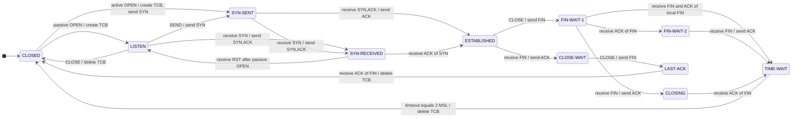

# 3.3. TCP 术语概览

本文其余部分将详细描述协议操作，本节先概述理解这些内容所需的关键术语。第 4 节另附术语表。

## 3.3.1. 关键连接状态变量

在详细讨论 TCP 实现的运行机制之前，需要先介绍一些具体术语。维护一条 TCP 连接，需要维护若干状态变量。可以设想，这些变量存放在一条称为传输控制块（Transmission Control Block，TCB）的连接记录中。TCB 中保存的变量包括：连接两端的本地与远端 IP 地址及端口号、该连接的 IP 安全级别与安全隔离域（参见[附录 A.1](./appendix-a.md#appendix-a-1)）、指向用户发送缓冲区和接收缓冲区的指针、指向重传队列和当前报文段的指针，以及若干与发送、接收序列号相关的变量。

**表 2：发送序列变量。**

| 变量 | 含义 |
| --- | --- |
| `SND.UNA` | send unacknowledged，最早一个尚未确认的序列号。 |
| `SND.NXT` | send next，下一个要发送的序列号。 |
| `SND.WND` | send window，发送窗口。 |
| `SND.UP` | send urgent pointer，发送紧急指针。 |
| `SND.WL1` | 上一次窗口更新所用报文段的序列号。 |
| `SND.WL2` | 上一次窗口更新所用报文段的确认号。 |
| `ISS` | initial send sequence number，初始发送序列号。 |

**表 3：接收序列变量。**

| 变量 | 含义 |
| --- | --- |
| `RCV.NXT` | receive next，下一个要接收的序列号。 |
| `RCV.WND` | receive window，接收窗口。 |
| `RCV.UP` | receive urgent pointer，接收紧急指针。 |
| `IRS` | initial receive sequence number，初始接收序列号。 |

下图有助于理解这些变量与序列空间的对应关系：

发送窗口是图 3 中标为 3 的那部分序列空间，即从 `SND.NXT` 到 `SND.UNA + SND.WND` 的可发送范围。

接收窗口是图 4 中标为 2 的那部分序列空间，即从 `RCV.NXT` 到 `RCV.NXT + RCV.WND - 1` 的可接收范围。

讨论中还经常用到一组取自当前报文段各字段的变量。

**表 4：当前报文段变量。**

| 变量 | 含义 |
| --- | --- |
| `SEG.SEQ` | 报文段序列号。 |
| `SEG.ACK` | 报文段确认号。 |
| `SEG.LEN` | 报文段长度。 |
| `SEG.WND` | 报文段窗口。 |
| `SEG.UP` | 报文段紧急指针。 |

## 3.3.2. 状态机概览

连接在其生命周期中会经历一系列状态：`LISTEN`、`SYN-SENT`、`SYN-RECEIVED`、`ESTABLISHED`、`FIN-WAIT-1`、`FIN-WAIT-2`、`CLOSE-WAIT`、`CLOSING`、`LAST-ACK`、`TIME-WAIT`，以及假想的 `CLOSED` 状态。`CLOSED` 之所以是假想状态，是因为它代表不存在 TCB、因而不存在连接的情形。各状态的简要含义如下：

| 状态 | 含义 |
| --- | --- |
| `LISTEN` | 等待任意远端 TCP 对等端、任意端口发来的连接请求。 |
| `SYN-SENT` | 已发送连接请求，等待匹配的连接请求。 |
| `SYN-RECEIVED` | 已收到并发出连接请求，正在等待对方返回确认。 |
| `ESTABLISHED` | 连接已建立，收到的数据可以交付给用户；这是连接数据传输阶段的正常状态。 |
| `FIN-WAIT-1` | 等待远端 TCP 对等端的连接终止请求，或等待先前发出的连接终止请求得到确认。 |
| `FIN-WAIT-2` | 等待远端 TCP 对等端发出连接终止请求。 |
| `CLOSE-WAIT` | 等待本地用户发出连接终止请求。 |
| `CLOSING` | 等待远端 TCP 对等端确认连接终止请求。 |
| `LAST-ACK` | 等待远端 TCP 对等端对先前发给它的连接终止请求作出确认；该请求中已包含对远端终止请求的确认。 |
| `TIME-WAIT` | 等待足够长的时间，确保远端 TCP 对等端已收到对其连接终止请求的确认，并避免新连接受到旧连接延迟报文段的影响。 |
| `CLOSED` | 完全没有连接的状态。 |

TCP 连接在事件的驱动下从一个状态转移到另一个状态。事件包括：用户调用 `OPEN`、`SEND`、`RECEIVE`、`CLOSE`、`ABORT` 和 `STATUS`；到达的报文段，尤其是带有 `SYN`、`ACK`、`RST` 和 `FIN` 标志的报文段；以及超时。

`OPEN` 调用指定是主动发起连接建立，还是被动等待连接建立。

被动 `OPEN` 请求表示进程希望接受外部传入的连接请求；主动 `OPEN` 请求则试图发起连接。

图 5 的状态图仅展示状态转移，以及引发转移的事件和随之产生的动作；它既不涵盖错误情况，也不涵盖与状态转移无关的动作。关于 TCP 实现对各类事件的响应，后文将给出更详细的说明。图中部分状态名的缩写或连字符写法与本文其他位置略有出入。

::: warning 图 5 的适用范围

状态图仅为摘要，不得视为完整规范；其中省略了许多细节。

:::

图 5 的说明：

1. 从 `SYN-RECEIVED` 收到 `RST` 后转入 `LISTEN`，仅当该状态是通过被动 `OPEN` 进入时才成立。
2. 图中省略了从 `FIN-WAIT-1` 到 `TIME-WAIT` 的转移：当收到 `FIN` 且本地的 `FIN` 也已被确认时，即发生该转移。
3. 凡存在指向 `TIME-WAIT` 转移的状态，均可发送 `RST`（理由参见 [RFC 9293 引用的相关讨论](https://www.rfc-editor.org/rfc/rfc9293.html)）；为使图示清晰易读，这些转移未逐一画出。同理，在任意状态下收到 `RST` 都会转入 `LISTEN` 或 `CLOSED`，图中也省略了这些转移。
