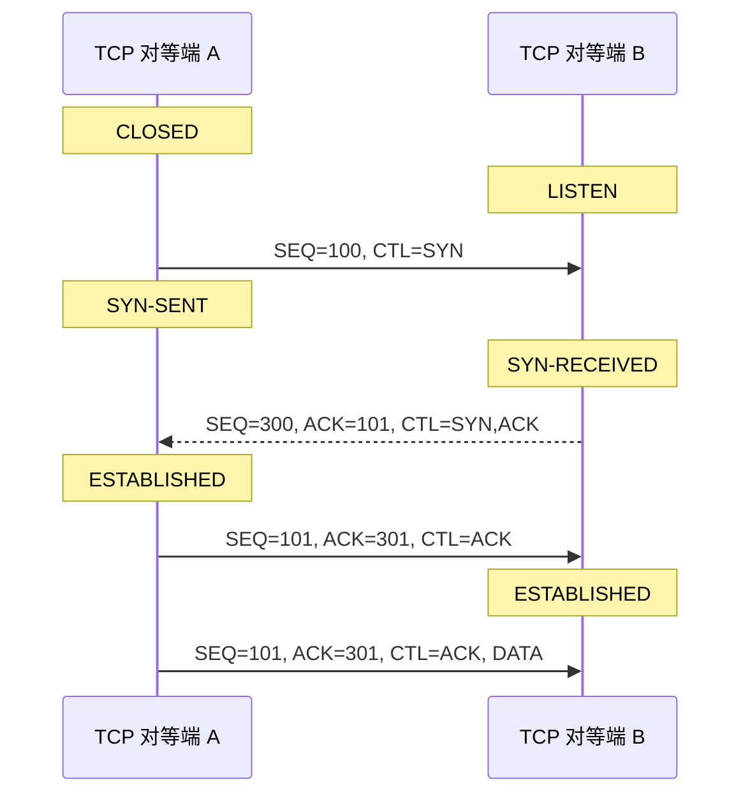
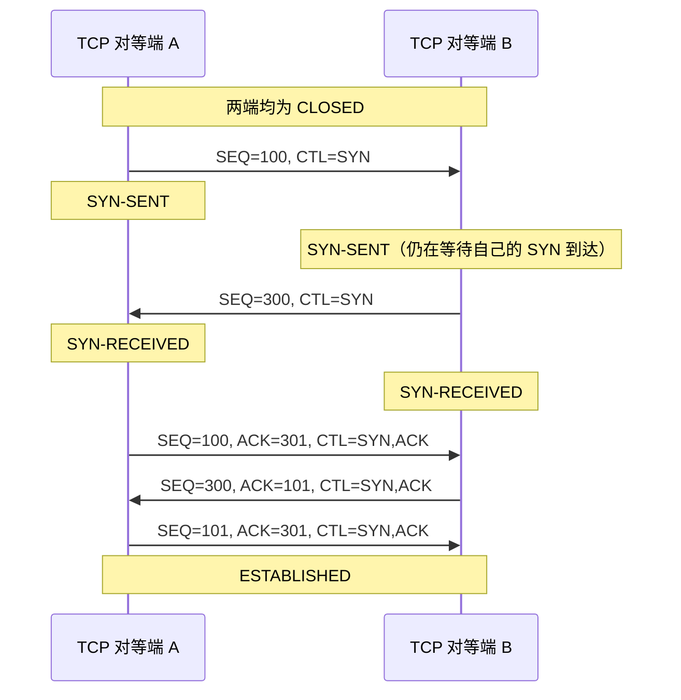
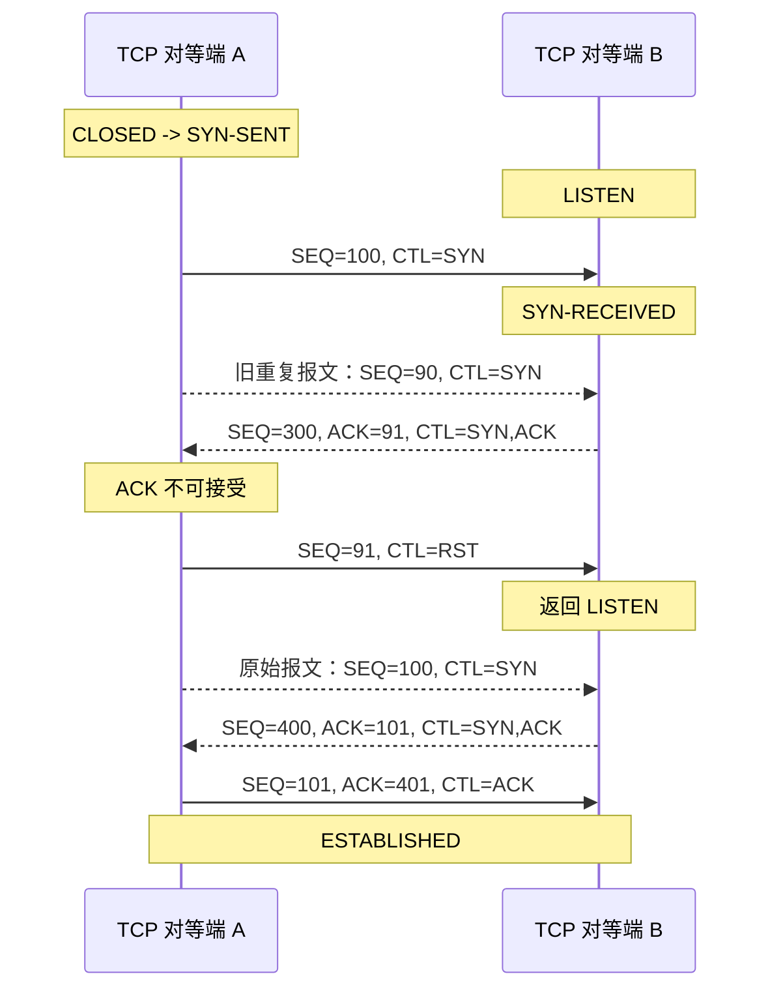
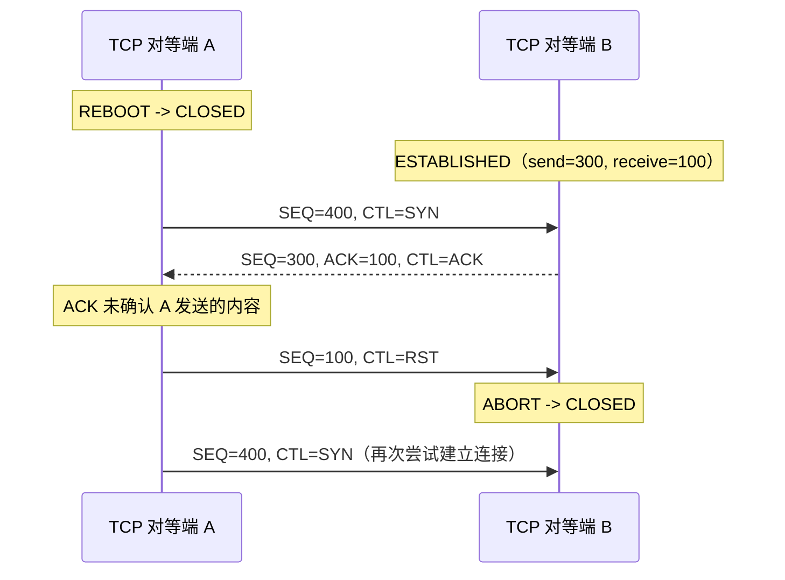
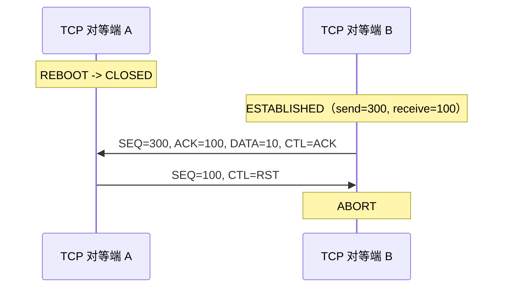
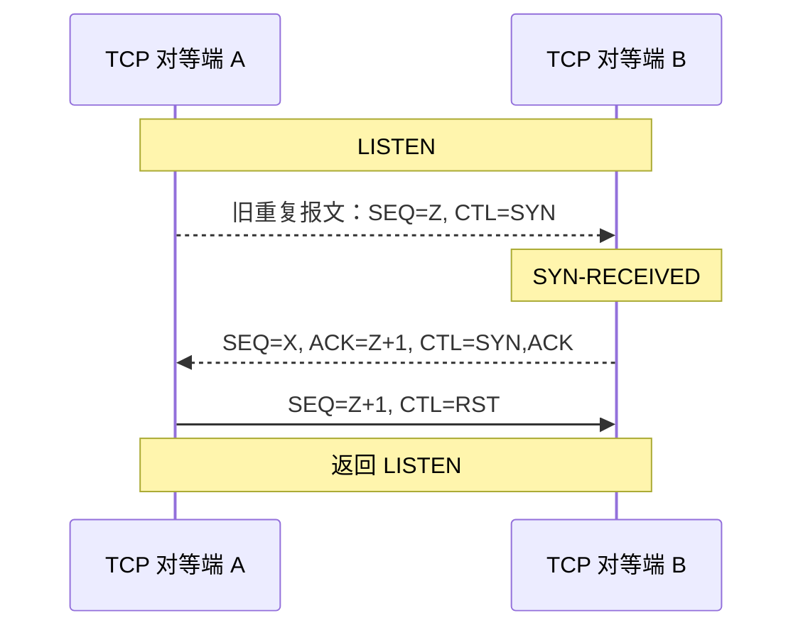

# 3.5. 建立连接

“三次握手”是用于建立连接的过程。该过程通常由一个 TCP 对等端发起、另一个 TCP 对等端响应；即使两个 TCP 对等端同时发起，也同样适用。在同时打开的情况下，每个 TCP 对等端发出 `SYN` 之后，都会收到一个不带确认的 `SYN` 报文段。当然，旧的重复 `SYN` 报文段到达时，也可能让接收方误以为正在进行同时建立连接。借助复位报文段的正确使用，可以区分这些情况。

下面给出几个连接发起的示例。这些示例均未展示用携带数据的报文段来同步连接的做法，但这种做法完全合法——只要接收方 TCP 在确认数据有效之前不将其交付给用户即可。例如，接收方可以先缓存数据，待连接进入 `ESTABLISHED` 状态后再交付。三次握手降低了建立错误连接的可能性，这本质上是在内存开销与额外报文开销之间的权衡。

最简单的 3WHS 如图 6 所示。图中每行均按顺序编号，便于引用。右箭头表示 TCP 报文段由 TCP 对等端 A 发往 TCP 对等端 B，或表示 B 收到了来自 A 的报文段；左箭头方向相反。省略号表示仍在网络中传输、尚未到达的延迟报文段。括号中的内容为注释。TCP 连接状态指该行所示报文段发出或到达之后所处的状态。为使图示简洁，报文段内容仅标出序列号、控制标志和 ACK 字段，窗口、地址、长度及正文等其余字段均省略。

**图 6：基本三次握手。**

在图 6 第 2 行中，TCP 对等端 A 发出 `SYN`，声明它将使用从 100 开始的序列号。第 3 行中，TCP 对等端 B 发出 `SYN`，并对来自 A 的 `SYN` 加以确认。确认字段表明 B 接下来期待接收序列号 101，即确认了那个占用序列号 100 的 `SYN`。

第 4 行中，A 以一个空报文段回应，确认 B 的 `SYN`；第 5 行中，A 开始发送数据。注意，第 5 行报文段的序列号与第 4 行相同，因为 ACK 不占用序列空间；倘若 ACK 也占用序列空间，就会产生“对 ACK 再作确认”的问题。

同时发起连接的情形仅稍显复杂，如图 7 所示。每个 TCP 对等端的连接状态都依次经历 `CLOSED`、`SYN-SENT`、`SYN-RECEIVED`，最终进入 `ESTABLISHED`。

**图 7：同时打开。**

TCP 实现必须支持同时发起的打开尝试（`MUST-10`）。

TCP 实现还必须记住：连接进入 `SYN-RECEIVED` 状态，究竟是由被动 `OPEN` 还是主动 `OPEN` 所致（`MUST-11`）。

采用三次握手的主要原因，是防止旧的重复连接发起引发混淆。为此，协议定义了一种特殊的控制消息——复位。如果接收方 TCP 对等端处于非同步状态（即 `SYN-SENT` 或 `SYN-RECEIVED`），它在收到可接受的复位后会返回 `LISTEN` 状态。如果 TCP 对等端处于同步状态（`ESTABLISHED`、`FIN-WAIT-1`、`FIN-WAIT-2`、`CLOSE-WAIT`、`CLOSING`、`LAST-ACK` 或 `TIME-WAIT`），则会中止连接并通知用户。后一种情况将在下文“半开连接”一节讨论。

图 8 展示了一个从旧重复报文中恢复的示例：

TCP 对等端 B 无法判断第 3 行的 `SYN` 是否为旧重复报文，因此照常回应。A 发现确认字段有误，便发送 `RST`，并将其 `SEQ` 字段选取得足以让该报文段显得可信。B 收到 `RST` 后返回 `LISTEN` 状态。当原始 `SYN` 最终到达时，连接同步即可正常推进。倘若原始 `SYN` 先于 `RST` 到达，则可能引发双方都发送 `RST` 的更复杂交互。

## 3.5.1. 半开连接和其他异常

若一方 TCP 对等端已在本端关闭或中止了连接，而另一方对此并不知情，或者连接两端因崩溃或重启丢失内存状态而失去同步，则称该已建立的连接处于“半开”状态。只要任一方向尝试发送数据，这类连接就会自动复位。不过，半开连接理应属于少见情形。

如果站点 A 上的连接已不复存在，而站点 B 的用户仍尝试在该连接上发送数据，B 的 TCP 端点便会收到复位控制消息。该消息表明连接出了问题，B 的 TCP 端点应中止连接。

假设用户进程 A 与 B 正在通信，A 的 TCP 实现因崩溃或重启而丢失了内存状态。视承载 A 的 TCP 实现的操作系统而定，系统中通常会配备某种错误恢复机制。TCP 端点恢复运行后，A 既可能从头开始，也可能从某个恢复点继续。于是，A 可能重新 `OPEN` 连接，也可能尝试在它认为仍然打开的连接上执行 `SEND`。在后一种情况下，它会从本地（A 的）TCP 实现收到“connection not open”错误消息。为建立连接，A 的 TCP 实现将发送一个包含 `SYN` 的报文段。

图 9 展示了这种场景：A 重启后，用户尝试重新打开连接，而 B 仍认为连接处于打开状态。

当第 3 行的 `SYN` 到达时，B 处于同步状态，而该传入报文段落在窗口之外，于是 B 回送确认，指明它下一个期待接收的序列号（ACK 100）。A 发现该报文段并未确认自己发送过的任何内容；由于 A 尚未同步，它据此判定存在半开连接，遂发送 `RST`。B 在第 5 行中止连接。A 会继续尝试建立连接，此时问题已退化为图 6 所示的基本三次握手。

另一种情形如图 10 所示：A 发生重启，而 B 尝试在它认为已经同步的连接上发送数据。由于 A 根本不存在该连接，来自 B 的数据对 A 而言不可接受，A 遂发送 `RST`。该 `RST` 对 B 是可接受的，B 据此处理并中止连接。

图 11 描述了两个处于被动打开状态、正在等待 `SYN` 的 TCP 对等端。一个到达 B 的旧重复报文触发了 B 的动作。B 返回 `SYN-ACK`；由于其中携带的确认（第 3 行的 ACK）不可接受，A 生成 `RST`。B 接受该复位，返回被动的 `LISTEN` 状态。

其他情形还有很多，下文的 `RST` 生成与处理规则已将其涵盖。

## 3.5.2. 复位生成

TCP 用户或应用可随时对连接发出复位；协议本身也会在各种错误条件下生成复位，具体如下。发出复位的一方应进入 `TIME-WAIT` 状态——这通常有助于减轻繁忙服务器的负载，其理由可参见相关研究。

一般规则是：当某个到达的报文段看起来并非发往当前连接时，即发送复位（`RST`）。如果无法明确断定这一点，则不得发送复位。

共分为三组状态：

1. **连接不存在（`CLOSED`）：** 除复位报文段本身之外，对任何传入报文段都回以复位，以此拒绝与现有连接不匹配的 `SYN`。如果传入报文段设置了 `ACK` 位，复位的序列号取自该报文段的 ACK 字段；否则复位的序列号为零，其 ACK 字段设置为传入报文段的序列号与报文段长度之和。连接保持 `CLOSED` 状态。

2. **非同步状态（`LISTEN`、`SYN-SENT`、`SYN-RECEIVED`）：** 如果传入报文段确认了尚未发送过的内容（即携带不可接受的 ACK），或者传入报文段的安全级别/隔离域（[附录 A.1](./appendix-a.md#appendix-a-1)）与该连接所请求的安全级别/隔离域不完全一致，则发送复位。如果传入报文段带有 ACK 字段，复位的序列号取自该 ACK 字段；否则复位序列号为零，其 ACK 字段设置为传入报文段的序列号与报文段长度之和。连接保持原有状态。

3. **同步状态（`ESTABLISHED`、`FIN-WAIT-1`、`FIN-WAIT-2`、`CLOSE-WAIT`、`CLOSING`、`LAST-ACK`、`TIME-WAIT`）：** 对于任何不可接受的报文段（序列号超出窗口，或确认号不可接受），都必须以一个空确认报文段作为回应。该报文段不携带用户数据，只包含当前发送序列号，以及表示下一个期待接收序列号的确认号；连接保持原有状态。如果传入报文段的安全级别/隔离域与该连接所请求的不完全一致，则发送复位，连接进入 `CLOSED` 状态；复位的序列号取自传入报文段的 ACK 字段。

## 3.5.3. 复位处理

在除 `SYN-SENT` 以外的所有状态下，均通过检查 `RST` 报文段的 `SEQ` 字段来验证复位：其序列号落在窗口之内，复位方为有效。在 `SYN-SENT` 状态下（即收到对初始 `SYN` 响应的 `RST`），只要 ACK 字段确认了该 `SYN`，复位即为可接受。

`RST` 的接收方应先验证复位，然后才改变状态。如果接收方处于 `LISTEN` 状态，则忽略该复位。如果接收方处于 `SYN-RECEIVED` 状态，且此前曾处于 `LISTEN` 状态，则返回 `LISTEN` 状态；否则中止连接并进入 `CLOSED` 状态。如果接收方处于其他任一状态，则中止连接、通知用户，并进入 `CLOSED` 状态。

TCP 实现应允许收到的 `RST` 报文段携带数据（`SHLD-2`）。已有提议建议在 `RST` 报文段中包含用于说明复位原因的诊断数据，但目前尚无针对此类数据的标准。
