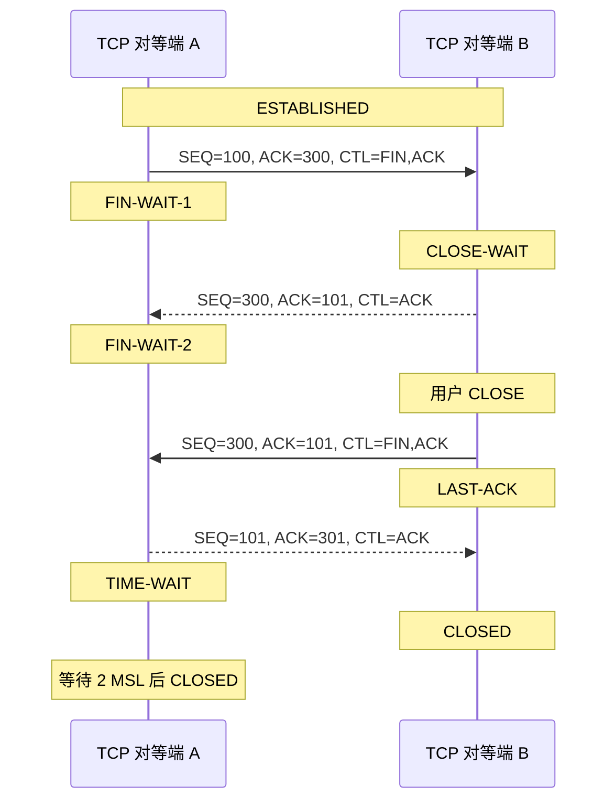
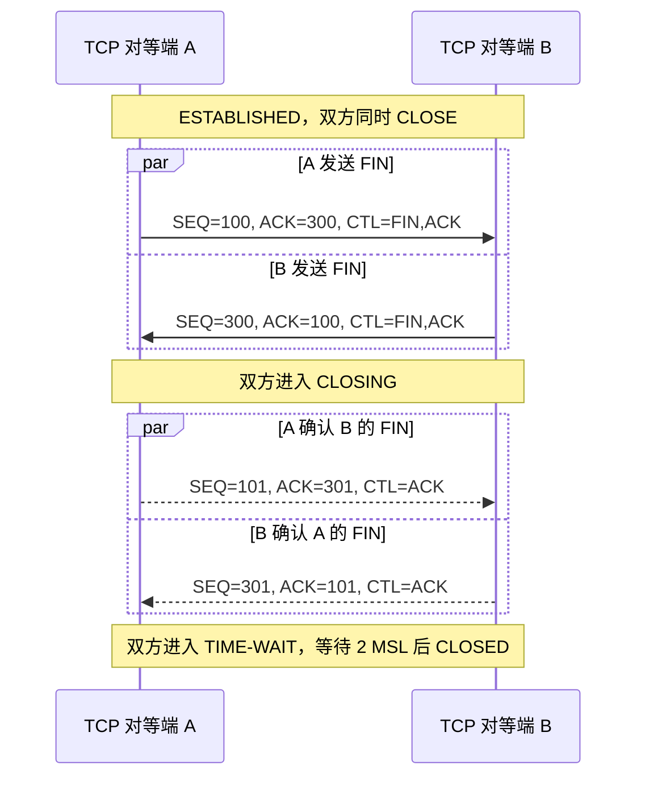

# 3.6. 关闭连接

`CLOSE` 操作表示“我没有更多数据要发送”。然而，关闭全双工连接的语义可能存在歧义，因为对端关闭后接收方向该如何处理并不总是显而易见。本文选择以单工方式处理 `CLOSE`：发起 `CLOSE` 的用户仍可继续 `RECEIVE`，直至 TCP 接收方被告知对端也已 `CLOSE`。因此，程序可以先执行若干次 `SEND`，随后发起 `CLOSE`，再继续 `RECEIVE`，直到收到通知：`RECEIVE` 因对端已关闭而失败。我们假定，即便当前没有挂起的 `RECEIVE`，TCP 实现也会将对端已关闭一事通知用户，使用户得以优雅地终止本端。TCP 实现会可靠地交付连接 `CLOSE` 之前已 `SEND` 的全部缓冲区；因此，若用户不期待对端返回数据，只需等到连接成功关闭的通知，即可确认其所有数据均已送达目的 TCP 端点。用户在关闭发送方向之后，仍必须继续读取该连接，直至 TCP 实现表明已无更多数据。

基本上有三种情况：

1. 用户告诉 TCP 实现 `CLOSE` 连接（图 12 中的 TCP 对等端 A）。
2. 远端 TCP 端点发送 `FIN` 控制信号（图 12 中的 TCP 对等端 B）。
3. 两端用户同时 `CLOSE`（图 13）。

**情况 1：本地用户发起关闭。**

此时，TCP 可以构造一个 `FIN` 报文段，并将其放入外发报文段队列。此后 TCP 实现不再接受用户的 `SEND`，并进入 `FIN-WAIT-1` 状态；该状态下仍允许 `RECEIVE`。`FIN` 之前的所有报文段（含 `FIN` 本身）都会持续重传，直至获得确认。当另一 TCP 对等端既确认了该 `FIN`，又发出了自己的 `FIN` 之后，先发起关闭的 TCP 对等端便可确认这个 `FIN`。需要注意的是，收到 `FIN` 的 TCP 端点会对其做出确认，但在本端用户也关闭连接之前，不会发出自己的 `FIN`。

**情况 2：TCP 端点从网络收到 `FIN`。**

如果网络中出现非预期的 `FIN`，接收方 TCP 端点可以对其做出确认，并告知用户连接正在关闭。用户随后会发起 `CLOSE`；TCP 端点在发送完剩余数据后，即可向对端 TCP 对等端发送 `FIN`。随后，它等待自己的 `FIN` 获得确认，然后删除连接。若迟迟收不到 ACK，则在用户超时后中止连接，并将中止情况通知用户。

**情况 3：两端用户同时关闭。**

两端用户同时发起 `CLOSE`，会导致双方交换 `FIN` 报文段（图 13）。当 `FIN` 之前的所有报文段均已处理完毕并获得确认后，每个 TCP 对等端即可确认收到的 `FIN`。两端都收到这些 ACK 后，连接即被删除。

**图 12：正常关闭序列。**

**图 13：同时关闭。**

TCP 连接有两种终止方式：（1）通过 `FIN` 握手进行的正常 TCP 关闭序列（图 12）；（2）“中止”（abort），即发送一个或多个 `RST` 报文段，并立即丢弃连接状态。若本地 TCP 连接因收到远端的 `FIN` 或 `RST` 而关闭，则必须告知本地应用该连接是正常关闭还是被中止（`MUST-12`）。

## 3.6.1. 半关闭连接

正常的 TCP 关闭序列能够可靠地交付两个方向上的缓冲数据。TCP 连接的两个方向各自独立关闭，因此连接可以处于“半关闭”状态——即仅关闭其中一个方向，主机仍可在保持开放的方向上继续发送数据。

主机可以实现“半双工”式的 TCP 关闭序列：应用一旦调用 `CLOSE`，便不能继续从该连接读取数据（`MAY-1`）。若此类主机在仍有已接收数据滞留于连接中时发起 `CLOSE`，或者在 `CLOSE` 之后又收到新数据，其 TCP 实现应发送 `RST`，以表明数据已经丢失（`SHLD-3`）。相关讨论参见 [RFC 2525 第 2.17 节](https://www.rfc-editor.org/rfc/rfc2525)。

主动关闭连接的一端必须在 `TIME-WAIT` 状态停留 `2×MSL`（最长报文段寿命）的时长（`MUST-13`）。不过，在满足以下条件时，TCP 端点可以直接在 `TIME-WAIT` 状态下接受对端 TCP 端点发来的新 `SYN`，重新打开连接（`MAY-2`）：

1. 为新连接分配的初始序列号大于上一个连接实例所使用的最大序列号。
2. 若事后发现该 `SYN` 属于旧的重复报文段，则重新回到 `TIME-WAIT` 状态。

当 TCP 时间戳选项可用时，可采用 [RFC 6191](https://www.rfc-editor.org/rfc/rfc6191) 所描述的改进算法，以支持更高的连接建立速率。鉴于时间戳选项已被普遍采用，这种缩短 `TIME-WAIT` 的算法属于当前最佳实践，应当实现（`SHLD-4`）；它能为繁忙的互联网服务器带来收益。
