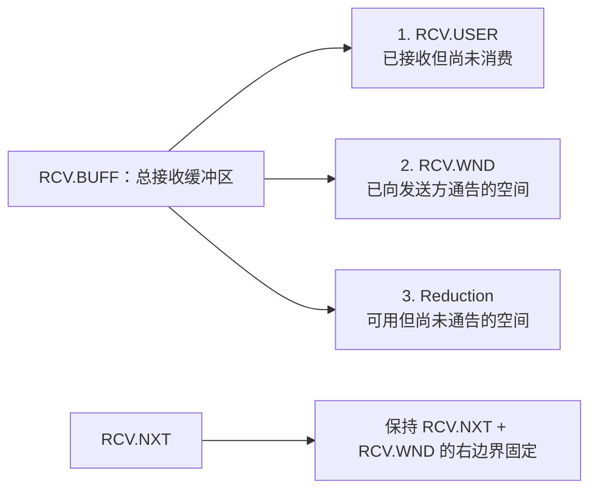

# 3.8. 数据通信

<a id="section-3-8"></a>

连接建立后，数据通过交换报文段进行传输。报文段可能因错误（校验和校验失败）或网络拥塞而丢失，TCP 依靠重传确保每个报文段最终都能交付。网络层的重传或 TCP 自身的重传都可能导致重复报文段到达。如[序列号](./03-04-sequence-numbers.md#section-3-4)一节所述，TCP 实现会对报文段中的序列号和确认号进行检验，以判断其是否可接受。

数据发送方在 `SND.NXT` 中记录下一个要使用的序列号。数据接收方在 `RCV.NXT` 中记录下一个期望的序列号。数据发送方在 `SND.UNA` 中记录最早尚未确认的序列号。如果数据流暂时空闲，且已发送的数据全部得到确认，则这三个变量相等。

发送方创建并发送报文段时推进 `SND.NXT`；接收方接受报文段时推进 `RCV.NXT` 并发送确认；数据发送方收到确认时推进 `SND.UNA`。这些变量取值的差异程度可以反映通信的时延。各变量每次推进的量，等于报文段中数据以及 `SYN` 或 `FIN` 标志所占用的长度。注意，进入 `ESTABLISHED` 状态后，所有报文段都必须携带当前的确认信息。

用户调用 `CLOSE` 即隐含推送功能（参见[第 3.9.1 节](./03-09-interfaces.md#section-3-9-1)）；传入报文段中的 `FIN` 控制位同样隐含推送功能。

## 3.8.1. 重传超时

<a id="section-3-8-1"></a>

构成互联网的各类网络在特性上差异悬殊，TCP 连接的使用方式也千差万别，因此重传超时（RTO）必须动态确定。

RTO 必须按照 [RFC 6298](https://www.rfc-editor.org/rfc/rfc6298) 中的算法计算，其中包括对 RTT 样本采用 Karn 算法（`MUST-18`）。

RFC 793 早期曾给出一个基于 IEN 177 的 RTO 计算示例，后被 RFC 1122 描述的算法取代；该算法随后经 RFC 2988 更新，最终又由 RFC 6298 修订。

RFC 1122 允许这样处理：如果重传分组与原始分组完全相同（这不仅意味着数据边界未改变，还意味着所有首部均未改变），则可以沿用相同的 IPv4 Identification 字段（参见 RFC 1122 第 3.2.1.5 节，`MAY-4`）。无论如何都可以复用同一个 IP Identification 字段，因为该字段仅在数据报分片时才有意义。TCP 实现不应依赖该字段，通常也无需访问它；它既不能用于标记发送方的重复报文段，也不能用于识别接收方的重复报文段。

## 3.8.2. TCP 拥塞控制

<a id="section-3-8-2"></a>

RFC 2914 解释了拥塞控制对互联网的重要性。

RFC 1122 要求实现 Van Jacobson 的拥塞控制算法：慢启动、拥塞避免，以及对同一报文段相继 RTO 值的指数退避。RFC 2581 以 IETF 标准化轨道文档的形式描述了慢启动、拥塞避免、快速重传和快速恢复。RFC 5681 是这些算法的现行描述，也是当前提供 TCP 拥塞控制指导的标准化轨道规范。RFC 6298 描述 RTO 值的指数退避，其中包括：在携带新数据的后续报文段未经重传便发送并获确认之前，一直保持退避后的取值。

TCP 端点必须实现基本的拥塞控制算法——慢启动、拥塞避免以及 RTO 的指数退避——以避免造成拥塞崩溃（`MUST-19`）。RFC 5681 和 RFC 6298 以 IETF 标准化轨道文档的形式给出了广泛适用的基础算法；此外还存在其他合适的算法，并得到广泛应用。只要符合 RFC 2914、RFC 5033 和 RFC 8961 所描述的 IETF 标准化轨道 TCP 规范，端点就可以实现并配置使用这些替代算法（`MAY-18`）。

显式拥塞通知（ECN）由 RFC 3168 定义，是 IETF 标准化轨道上的一项增强机制，能带来诸多益处。TCP 端点应按照 RFC 3168 实现 ECN（`SHLD-8`）。

## 3.8.3. TCP 连接失败

<a id="section-3-8-3"></a>

TCP 端点对同一报文段的过度重传，表明远端主机或互联网路径出现了故障；此类故障持续时间或短或长。处理数据报文段的过度重传时，必须采用以下过程（`MUST-20`）：

1. 设置两个阈值 `R1` 和 `R2`，用于度量同一报文段的重传量。`R1` 和 `R2` 既可以按时间单位度量，也可以按重传次数度量；必要时，可将当前 RTO 及其退避值用作换算因子。
2. 同一报文段的发送次数达到或超过 `R1` 时，向 IP 层传递消极建议（参见 RFC 1122 第 3.3.1.4 节），触发死网关诊断。
3. 同一报文段的发送次数达到大于 `R1` 的 `R2` 时，关闭连接。
4. 应用必须能够为特定连接设置 `R2` 的值（`MUST-21`）。例如，交互式应用可以把 `R2` 设置为“无穷大”，由用户自行决定何时断开连接。
5. 当达到 `R1` 且尚未达到 `R2` 时，TCP 实现应将交付问题通知应用，除非应用已禁用这类信息（参见[异步报告](./03-09-interfaces.md#section-3-9-1-8)）（`SHLD-9`）。这样，远程登录之类的应用便可以通知用户。

`R1` 的值应对应当前 RTO 下至少 3 次重传（`SHLD-10`）；`R2` 的值应对应至少 100 秒（`SHLD-11`）。

打开 TCP 连接的尝试，可能因 `SYN` 报文段过度重传而失败，也可能因收到 `RST` 或 ICMP Port Unreachable 而失败。对 `SYN` 的重传必须按照数据重传的一般方式处理，包括通知应用层。

不过，`SYN` 和数据报文段的 `R1`、`R2` 取值可以不同。特别地，`SYN` 报文段的 `R2` 必须足够大，使该报文段至少能重传 3 分钟（`MUST-23`）。当然，应用也可以提前关闭连接，即放弃本次打开尝试。

## 3.8.4. TCP 保活

<a id="section-3-8-4"></a>

如果 TCP 连接在很长的时间内既没有收到任何传入报文段，也没有新数据要发送、没有未确认的数据，则称该连接处于“空闲”状态。

实现者可以在 TCP 实现中加入“保活”机制（`MAY-5`），但这一做法并未得到普遍认可。有些 TCP 实现确实包含保活机制：为了确认空闲连接仍然存活，这些实现会发送一个用于诱使 TCP 对等端作出响应的探测报文段。该报文段通常包含 `SEG.SEQ = SND.NXT-1`，可以包含一个垃圾数据八位组，也可以不包含。如果实现保活，应用必须能够为每条 TCP 连接打开或关闭它（`MUST-24`），并且默认必须关闭（`MUST-25`）。

只有在没有已发送但尚未确认的数据，且连接在一个时间间隔内未收到任何数据或确认报文时，才能发送保活分组（`MUST-26`）。该间隔必须可配置（`MUST-27`），默认值不得少于 2 小时（`MUST-28`）。

需要特别注意的是：TCP 对不携带数据的 ACK 报文段不提供可靠传输。因此，若实现了保活机制，绝不能仅因某次具体探测未收到响应，就断定连接已经死亡（`MUST-29`）。

实现应发送不带数据的保活报文段（`SHLD-12`）；不过，为兼容存在缺陷的 TCP 实现，也可以配置为发送包含一个垃圾数据八位组的保活报文段（`MAY-6`）。

## 3.8.5. 紧急信息通信

<a id="section-3-8-5"></a>

鉴于实现上的差异以及与中间盒的交互问题，新应用不应使用 TCP 紧急机制（`SHLD-13`）。但 TCP 实现仍必须支持紧急机制（`MUST-30`）。关于一些 TCP 实现对紧急指针的不同解读，参见 RFC 6093。

TCP 紧急机制有两个目的：一是让发送方用户能够敦促接收方用户接收某些紧急数据；二是让接收方 TCP 端点在用户收完全部当前已知的紧急数据之后，能够将这一情况通知接收方用户。

该机制允许将数据流中的某个位置指定为紧急信息的终点。只要该位置领先于接收方 TCP 端点的接收序列号（`RCV.NXT`），TCP 实现就必须通知用户进入“紧急模式”；当接收序列号追上紧急指针时，TCP 实现必须通知用户回到“普通模式”。若紧急指针在用户处于“紧急模式”期间发生更新，该更新对用户不可见。

该方法使用一个随所有发出报文段携带的紧急字段。`URG` 控制标志表示紧急字段有效，将其与报文段序列号相加即得到紧急指针。未设置该标志则表示当前没有未处理的紧急数据。

要发送紧急指示，用户还必须同时发送至少一个数据八位组。若发送用户同时发出推送指示，紧急信息便能更及时地送达目的进程。紧急指针的变化与发送应用写入的数据相对应，因此紧急指针不能在序列空间中“倒退”；但 TCP 接收方应能妥善处理非法的紧急指针取值。

TCP 实现必须支持任意长度的紧急数据序列（`MUST-31`）。

紧急指针必须指向紧急数据之后那个八位组的序列号（`MUST-62`）。

当 TCP 实现收到紧急指针，且此前没有待处理的紧急数据，或者紧急指针在数据流中前移时，必须异步通知应用层（`MUST-32`）。TCP 实现必须提供一种方式，让应用得知连接中还剩多少紧急数据，或至少能够判断是否还有更多紧急数据待读取（`MUST-33`）。

## 3.8.6. 管理窗口

<a id="section-3-8-6"></a>

每个报文段中携带的窗口值，表示窗口发送方（即数据接收方）当前准备接收的序列号范围；通常认为它与该连接当前提供的数据缓冲区空间相关。

发送方 TCP 端点将待发数据按当前窗口打包成报文段，也可以对重传队列中的报文段重新打包。重新打包并非必需，但可能有所助益。

在单向数据流的连接中，窗口信息由确认报文段携带，而这些确认报文段的序列号完全相同，一旦乱序到达便无法据此重新排序。这并不算严重问题，但意味着窗口信息偶尔会暂时基于数据接收方的旧报告。为避免这一问题，可以只依据携带最大确认号的报文段来更新窗口，即只处理确认号大于或等于此前已收到的最大确认号的报文段。

通告大窗口会刺激数据发送。若到达的数据超出可接收的范围，多余的数据将被丢弃，进而引发过多重传，给网络和 TCP 端点平添不必要的负担。而通告过小的窗口，则可能使数据传输受限，以至于每发送一个新报文段都要多付出一次往返时延。

TCP 机制允许端点先通告大窗口，随后在尚未接收那么多数据的情况下又通告小得多的窗口，这称为“缩小窗口”，是强烈不鼓励的做法。鲁棒性原则要求 TCP 对等端自身不缩小窗口，但要能容忍其他 TCP 对等端的这种行为。

TCP 接收方不应缩小窗口，也就是不应把窗口右边界向左移动（`SHLD-14`）。但是，发送方 TCP 对等端必须能够稳健地处理窗口缩小；这可能导致“可用窗口”（见[发送方算法](#section-3-8-6-2-1)）变为负值（`MUST-34`）。

一旦出现这种情况，发送方不应发送新数据（`SHLD-15`），但应照常重传 `SND.UNA` 至 `SND.UNA+SND.WND` 之间的旧的未确认数据（`SHLD-16`）。发送方还可以重传超出 `SND.UNA+SND.WND` 的旧数据（`MAY-7`），但若窗口右边界之外的数据未获确认，不应因此令连接超时（`SHLD-17`）。当窗口缩小为零时，TCP 实现必须按下文所述的标准方式探测窗口（`MUST-35`）。

### 3.8.6.1. 零窗口探测

<a id="section-3-8-6-1"></a>

即使发送窗口为零，发送方 TCP 对等端也必须定期向接收方 TCP 对等端发送至少一个新数据八位组（若有），或者重传数据，以此“探测”窗口。只要任一端窗口为零，这种重传就是确保窗口重新打开的消息能够可靠送达对方的必要手段。其他文档将其称为零窗口探测（ZWP）。

必须支持对零（通告）窗口的探测（`MUST-36`）。

TCP 实现可以无限期地保持其通告的接收窗口关闭（`MAY-8`）。只要接收方 TCP 对等端继续响应探测报文段并回送确认，发送方 TCP 对等端就必须允许连接保持打开（`MUST-37`）。这样，TCP 便能应对“打印机缺纸”之类的场景。不过，实现方的资源管理策略仍可能影响这一行为。

当接收方 TCP 对等端的窗口为零时，它收到报文段后仍必须回送确认，并在其中给出下一个期望的序列号和当前窗口（零）。

当零窗口状态持续了一个重传超时周期后，发送主机应发出第一个零窗口探测（`SHLD-29`）；此后相继探测之间的间隔应按指数增长（`SHLD-30`）。

### 3.8.6.2. 避免糊涂窗口综合征

<a id="section-3-8-6-2"></a>

“糊涂窗口综合征”（Silly Window Syndrome，SWS）指窗口以小幅度持续移动的模式，它会使 TCP 性能急剧恶化。下文分别给出发送方与接收方的 SWS 避免算法，RFC 1122 对 SWS 有更详尽的讨论。需要注意，Nagle 算法与发送方 SWS 避免算法互为补充：当待发数据以小增量增长时，Nagle 算法抑制极小报文段的发送；当窗口右边界以小增量前移时，SWS 避免算法则抑制由此产生的小报文段。

#### 3.8.6.2.1. 发送方算法——何时发送数据

<a id="section-3-8-6-2-1"></a>

TCP 实现必须在发送方实现 SWS 避免算法（`MUST-38`）。此外，[第 3.7.4 节](./03-07-segmentation.md#section-3-7-4)中的 Nagle 算法还规定了如何合并短报文段。

发送方的 SWS 避免算法比接收方更难处理，因为发送方无法直接获知接收方的总缓冲区空间（`RCV.BUFF`）。一种实践证明有效的方法，是记录连接上出现过的最大 `SND.WND`，并以此估计 `RCV.BUFF`。但这终究只是估计——接收方可能随时缩减 `RCV.BUFF`。为避免由此引发死锁，需要设置一个超时机制，超时后强制发送数据，从而越过 SWS 避免算法；实际运行中，这种超时应很少触发。

“可用窗口”为：

```text
U = SND.UNA + SND.WND - SND.NXT
```

即通告窗口减去已发送但尚未确认的数据量。设发送方 TCP 端点已排队但尚未发送的数据量为 `D`，则建议按以下规则发送数据：

1. 可以发送一个最大尺寸的报文段，即：

   ```text
   min(D,U) >= Eff.snd.MSS
   ```

2. 或者数据带有推送标志，且当前全部排队数据均可发送，即：

   ```text
   [SND.NXT = SND.UNA and] PUSHed and D <= U
   ```

   方括号中的条件由 Nagle 算法施加。

3. 或者至少可以发送最大窗口的一定比例，即：

   ```text
   [SND.NXT = SND.UNA and]
   min(D,U) >= Fs * Max(SND.WND)
   ```

4. 或者触发覆盖超时。

其中 `Fs` 为比例系数，建议取 `1/2`。覆盖超时应设置在 0.1–1.0 秒之间。该计时器可以与[零窗口探测](#section-3-8-6-1)所用的计时器合并。

#### 3.8.6.2.2. 接收方算法——何时发送窗口更新

<a id="section-3-8-6-2-2"></a>

TCP 实现必须在接收方实现 SWS 避免算法（`MUST-39`）。接收方的 SWS 避免算法决定何时可以推进窗口右边界，这通常称为“更新窗口”。该算法与[延迟确认算法](#section-3-8-6-3)相结合，共同决定何时真正发出携带当前窗口的 ACK 报文段。

接收方解决 SWS 的方法是：即使从网络收到小报文段，也避免小幅推进右窗口边界 `RCV.NXT+RCV.WND`。

设接收缓冲区总空间为 `RCV.BUFF`。在任意时刻，其中可能有 `RCV.USER` 个八位组被已接收并确认、但尚未被用户进程消费的数据占用。当连接处于静止状态时，`RCV.WND = RCV.BUFF` 且 `RCV.USER = 0`。

当数据到达并得到确认时，若要保持右窗口边界不变，就必须通告小于缓冲区总空间的窗口；换言之，随着 `RCV.NXT` 增大，接收方必须给出能使 `RCV.NXT+RCV.WND` 保持不变的 `RCV.WND`。因此，缓冲区总空间通常可划分为三部分：



建议的接收方 SWS 避免算法是：一直保持 `RCV.NXT+RCV.WND` 不变，直到 reduction 满足：

```text
RCV.BUFF - RCV.USER - RCV.WND >=
    min(Fr * RCV.BUFF, Eff.snd.MSS)
```

其中 `Fr` 为比例系数，建议取 `1/2`；`Eff.snd.MSS` 是该连接的有效发送 MSS（参见[第 3.7.1 节](./03-07-segmentation.md#section-3-7-1)）。不等式满足后，把 `RCV.WND` 设置为 `RCV.BUFF-RCV.USER`。

该算法的总体效果是令 `RCV.WND` 以 `Eff.snd.MSS` 为步进向前推进（对于实际的接收缓冲区，通常 `Eff.snd.MSS < RCV.BUFF/2`）。注意，接收方必须使用自己的 `Eff.snd.MSS`，即假定其与发送方的取值相同。

### 3.8.6.3. 延迟确认——何时发送 ACK 报文段

<a id="section-3-8-6-3"></a>

接收 TCP 数据流时，并非必须每收到一个数据报文段就回送一个 ACK；以低于“每段一个”的频率发送 ACK，可以同时提升网络与主机的效率，这种做法称为“延迟确认”。

TCP 端点应实现延迟确认（`SHLD-18`），但 ACK 不应延迟过久；特别是延迟必须小于 0.5 秒（`MUST-40`）。至少每收到两个全尺寸报文段，或每收到 `2*RMSS` 个新数据八位组，就应生成一个 ACK；其中 `RMSS` 是被确认报文段的发送方所指定的 MSS，未指定时取默认值（`SHLD-19`）。过度延迟 ACK 会干扰往返时间测量和分组“时钟”算法。RFC 5681 第 4 节对延迟确认有更完整的讨论，其中包括以下建议：对乱序报文段、位于序列空间空洞之上的报文段，以及填充了全部或部分空洞的报文段立即予以确认，以加速丢包恢复。

目前还有一些可进一步减少 ACK 数量的实践做法，包括通用接收卸载（GRO）、ACK 压缩和 ACK 抽取（ACK decimation）。
