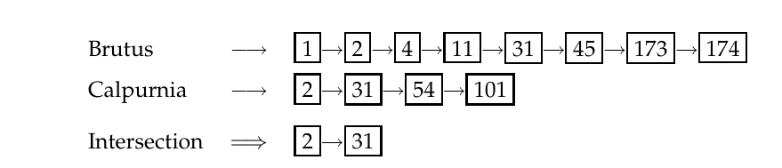

# 第 1 章 布尔检索

[返回系列目录](../introduction-to-information-retrieval.md) · [上一篇：扉页、目录、符号表与前言](./00-front-matter-and-preface.md) · [下一篇：第 2 章 词项词汇表与倒排记录表](./02-term-vocabulary-and-postings-lists.md)

原书印刷页 1–18；PDF 第 38–55 页。

<!-- source: PDF 38; printed: 1 -->

术语信息检索（information retrieval）的含义可以非常广泛。仅仅是从钱包里拿出一张信用卡以便输入卡号，这也是一种信息检索的形式。然而，作为一个学术研究领域，信息检索可以这样定义：

**信息检索**（Information retrieval，IR）是从大规模集合（通常存储在计算机上）中找出满足信息需求的非结构化性质（通常是文本）的材料（通常是文档）的过程。

按照这种定义，信息检索曾经是只有少数人从事的活动：参考咨询图书馆员、律师助理以及类似的专业搜索人员。现在世界已经改变，数以亿计的人每天在使用网络搜索引擎或搜索他们的电子邮件时，都在进行信息检索。<sup>[1]</sup> 信息检索正迅速成为信息访问的主导形式，超越了传统的数据库式搜索（也就是当职员对你说：“很抱歉，只有您提供订单号，我才能查询您的订单”时所进行的那种搜索）。

除了上述核心定义中指出的内容之外，信息检索（IR）还可以涵盖其他类型的数据和信息问题。术语“非结构化数据”（unstructured data）指的是没有清晰的、语义上明显的、易于计算机处理的结构的数据。它与结构化数据（structured data）相对，后者的典型例子是关系型数据库，即公司通常用来维护产品库存和人事记录的那种数据库。在现实中，几乎没有数据是真正“非结构化”的。如果算上人类语言潜在的语言学结构，这对所有文本数据来说绝对是正确的。但即使承认这里所指的结构是显式结构，大多数文本也是有结构的，例如标题、段落和脚注，这些通常在文档中通过显式标记来表示（例如网页底层的编码

> **脚注 1（原书第 1 页）**：在现代用语中，“搜索”（search）一词已经趋向于取代“（信息）检索”（(information) retrieval）；“搜索”这个词相当有歧义，但在上下文中我们将这两个词作为同义词使用。

<!-- source: PDF 39; printed: 2 -->

页面）。信息检索也用于促进“半结构化”（semistructured）搜索，例如查找标题包含 Java 且正文包含 threading 的文档。

信息检索领域还包括支持用户浏览或过滤文档集（document collections），或者对一组检索到的文档进行进一步处理。给定一组文档，聚类（clustering）的任务是根据文档的内容提出一种良好的文档分组。这类似于根据主题在书架上排列书籍。给定一组主题、长期信息需求或其他类别（例如文本对不同年龄组的适用性），分类（classification）的任务是决定一组文档中的每一篇属于哪个或哪些类别（如果有的话）。通常的方法是首先手动对一些文档进行分类，然后希望能够自动对新文档进行分类。

信息检索系统也可以根据其运行的规模来区分，区分三种突出的规模是很有用的。在网络搜索（web search）中，系统必须提供对存储在数百万台计算机上的数十亿篇文档的搜索。其独特的问题在于需要收集文档以进行索引，能够构建在这种巨大规模下高效工作的系统，以及处理网络的特定方面，例如利用超文本，并且鉴于网络的商业重要性，不被试图通过操纵页面内容来提高其搜索引擎排名的网站提供者所欺骗。我们将在第 19 至 21 章中重点讨论所有这些问题。另一个极端是个人信息检索（personal information retrieval）。在过去几年中，消费者操作系统已经集成了信息检索功能（例如苹果 Mac OS X 的 Spotlight 或 Windows Vista 的 Instant Search）。电子邮件程序通常不仅提供搜索，还提供文本分类：它们至少提供垃圾邮件（spam）过滤器，并且通常还提供手动或自动的方法来对邮件进行分类，以便将其直接放入特定的文件夹中。这里的独特问题包括处理典型个人计算机上广泛的文档类型，并使搜索系统免维护，且在启动、处理和磁盘空间使用方面足够轻量级，以便它可以在一台机器上运行而不会让其所有者感到烦恼。介于两者之间的是企业、机构和特定领域搜索（enterprise, institutional, and domain-specific search）的空间，其中可能为诸如公司内部文档、专利数据库或生物化学研究文章等集合提供检索。在这种情况下，文档通常将存储在集中式文件系统上，并且一台或少数几台专用机器将提供对该集合的搜索。本书包含了在整个范围内都有价值的技术，但由于关于此类系统细节的已发表文献相对较少，我们对网络规模搜索系统中并行和分布式搜索某些方面的覆盖相对较少。然而，除了少数几家网络搜索公司之外，软件开发人员最有可能遇到的是个人搜索和企业场景。

<!-- source: PDF 40; printed: 3 -->

在本章中，我们从一个非常简单的信息检索问题示例开始，并介绍词项-文档矩阵（term-document matrix）的概念（第 1.1 节）以及核心的倒排索引（inverted index）数据结构（第 1.2 节）。然后我们将探讨布尔检索模型以及布尔查询是如何处理的（第 1.3 节和第 1.4 节）。

## 1.1 信息检索问题示例

许多人都拥有一本厚厚的书，那就是《莎士比亚全集》（Shakespeare’s Collected Works）。假设你想确定莎士比亚的哪些戏剧包含单词 Brutus AND Caesar AND NOT Calpurnia。一种方法是从头开始通读所有文本，记录每部戏剧是否包含 Brutus 和 Caesar，如果包含 Calpurnia 则将其排除在考虑之外。最简单的文档检索形式就是让计算机对文档进行这种线性扫描。这个过程通常被称为在文本中进行 grep（**GREP**），得名于执行此过程的 Unix 命令 `grep`。在文本中进行 grep 可能是一个非常有效的过程，特别是考虑到现代计算机的速度，并且通常允许通过使用正则表达式来进行有用的通配符模式匹配。借助现代计算机，对于适度规模集合的简单查询（《莎士比亚全集》的大小总共不到一百万个单词的文本），你真的不需要别的什么了。

但出于许多目的，你确实需要更多：

1. 快速处理大型文档集。在线数据的增长速度至少与计算机速度的增长一样快，我们现在希望能够搜索总计达数十亿到数万亿个单词的集合。
2. 允许更灵活的匹配操作。例如，使用 `grep` 执行查询 Romans NEAR countrymen 是不切实际的，其中 NEAR 可能被定义为“在 5 个单词内”或“在同一个句子中”。
3. 允许排序检索：在许多情况下，你希望在包含某些单词的众多文档中找到满足信息需求的最佳答案。

避免对每个查询进行文本线性扫描的方法是预先对文档进行索引（**INDEX**）。让我们继续使用《莎士比亚全集》，并用它来介绍布尔检索模型的基础知识。假设我们为每篇文档（这里是莎士比亚的一部戏剧）记录它是否包含莎士比亚使用的所有单词中的每一个单词（莎士比亚使用了大约 32,000 个不同的单词）。结果是一个二元的词项-文档关联矩阵（term-document incidence matrix），如图 1.1 所示。词项（term）是被索引的单位（在第 2.2 节中进一步讨论）；它们通常是单词，目前你可以将

<!-- source: PDF 41; printed: 4 -->

| | Antony and Cleopatra | Julius Caesar | The Tempest | Hamlet | Othello | Macbeth | ... |
|---|---|---|---|---|---|---|---|
| Antony | 1 | 1 | 0 | 0 | 0 | 1 |
| Brutus | 1 | 1 | 0 | 1 | 0 | 0 |
| Caesar | 1 | 1 | 0 | 1 | 1 | 1 |
| Calpurnia | 0 | 1 | 0 | 0 | 0 | 0 |
| Cleopatra | 1 | 0 | 0 | 0 | 0 | 0 |
| mercy | 1 | 0 | 1 | 1 | 1 | 1 |
| worser | 1 | 0 | 1 | 1 | 1 | 0 |
| ... |

▶ **图 1.1** 词项-文档关联矩阵。如果列 $d$ 中的戏剧包含行 $t$ 中的单词，则矩阵元素 $(t, d)$ 为 1，否则为 0。

它们视为单词，但信息检索文献通常称之为词项（term），因为其中一些（例如 I-9 或 Hong Kong）通常不被认为是单词。现在，根据我们是查看矩阵的行还是列，我们可以为每个词项得到一个向量，显示它出现的文档；或者为每篇文档得到一个向量，显示其中出现的词项。<sup>[2]</sup>

为了回答查询 Brutus AND Caesar AND NOT Calpurnia，我们取出 Brutus、Caesar 和 Calpurnia 的向量，对最后一个向量求补，然后进行按位与（AND）运算：

$$110100 \text{ AND } 110111 \text{ AND } 101111 = 100100$$

因此，该查询的答案是 Antony and Cleopatra 和 Hamlet（图 1.2）。

布尔检索模型（Boolean retrieval model）是一种信息检索模型，在该模型中，我们可以提出任何形式为词项的布尔表达式的查询，也就是说，词项通过运算符 AND、OR 和 NOT 组合在一起。该模型将每篇文档仅仅视为一组单词。

现在让我们考虑一个更现实的场景，同时借此机会介绍一些术语和符号。假设我们有 $N = 100$ 万篇文档。文档（document）是指我们决定在其上构建检索系统的任何单位。它们可能是单独的备忘录或书的章节（进一步的讨论见第 2.1.2 节（第 20 页））。我们将执行检索的那组文档称为（文档）集（collection）。它有时也被称为语料库（corpus）（文本的集合）。假设每篇文档大约有 1000 个单词长（2-3 页书）。如果

> **脚注 2（原书第 4 页）**：形式上，我们对矩阵进行转置，以便能够将词项作为列向量获取。

<!-- source: PDF 42; printed: 5 -->

《安东尼与克莉奥佩特拉》（Antony and Cleopatra），第三幕第二场
阿格里帕 [向多米提乌斯·伊诺巴布斯旁白]（Agrippa [Aside to Domitius Enobarbus]）：
> Why, Enobarbus,
> When Antony found Julius Caesar dead,
> He cried almost to roaring; and he wept
> When at Philippi he found Brutus slain.
> 
> （啊，伊诺巴布斯，
> 安东尼看到尤利乌斯·恺撒的尸体时，
> 哭得几乎像在吼叫；而他在腓立比
> 看到布鲁图斯阵亡时，也流下了眼泪。）

《哈姆雷特》（Hamlet），第三幕第二场
波洛涅斯大人（Lord Polonius）：
> I did enact Julius Caesar: I was killed i’ the
> Capitol; Brutus killed me.
> 
> （我曾扮演尤利乌斯·恺撒：我在卡庇托尔被杀；布鲁图斯杀了我。）

◮ **图 1.2** 针对查询 Brutus AND Caesar AND NOT Calpurnia 在莎士比亚作品中的检索结果。

---

我们假设平均每个词（包括空格和标点符号）占 6 个字节，那么这个文档集的大小约为 6 GB。通常，这些文档中可能有大约 $M = 500,000$ 个不同的词项。我们选择的这些数字并没有什么特别之处，它们可能会有一个数量级或更大的变化，但它们让我们对需要处理的问题的规模有了一定的概念。我们将在第 5.1 节（原书第 86 页）讨论并对这些规模假设进行建模。

我们的目标是开发一个系统来解决**特设检索**（ad hoc retrieval）任务。这是最标准的 IR 任务。在其中，系统旨在从文档集中提供与任意用户**信息需求**（information need）相关的文档，该需求通过一次性的、由用户发起的**查询**（query）传达给系统。信息需求是用户渴望了解更多的关于某个主题的内容，它不同于查询，查询是用户为了传达信息需求而向计算机输入的内容。如果用户认为某篇文档包含对其个人信息需求有价值的信息，那么该文档就是**相关的**（relevant）。我们上面的例子相当人为，因为信息需求是根据特定的词来定义的，而通常用户对诸如“管道泄漏”（pipeline leaks）之类的主题感兴趣，并希望找到相关的文档，无论它们是否精确地使用了这些词，或者用其他词（如 pipeline rupture，管道破裂）来表达这个概念。为了评估 IR 系统的**有效性**（effectiveness）（即其搜索结果的质量），用户通常会想知道关于系统针对查询返回的结果的两个关键统计数据：

**查准率**（precision）：返回的结果中有多少比例是与信息需求相关的？

**召回率**（recall）：文档集中有多少比例的相关文档被系统返回了？

<!-- source: PDF 43; printed: 6 -->

第 8 章详细讨论了相关性和包括查准率与召回率在内的评估指标。

我们现在不能以一种朴素的方式构建词项-文档矩阵。一个 500K × 1M 的矩阵有 5000 亿个 0 和 1——太多了，无法装入计算机的内存中。但关键的观察结果是，该矩阵极其稀疏，也就是说，它几乎没有非零项。因为每篇文档有 1000 个词长，所以矩阵中最多有 10 亿个 1，因此至少有 99.8% 的单元格是零。一种更好的表示方法是只记录确实发生的事情，即 1 的位置。

这个想法是信息检索中第一个主要概念——**倒排索引**（inverted index）的核心。这个名字实际上是多余的：索引总是从词项映射回它们在文档中出现的部分。尽管如此，倒排索引，或者有时称为倒排文件（inverted file），已经成为信息检索中的标准术语。<sup>[3]</sup> 倒排索引的基本思想如图 1.3 所示。我们保留一个词项的**词典**（dictionary）（有时也称为**词汇表**（vocabulary）或词库（lexicon）；在本书中，我们使用词典来表示数据结构，使用词汇表来表示词项的集合）。然后对于每个词项，我们都有一个列表，记录该词项出现在哪些文档中。列表中的每一项——记录了一个词项出现在一篇文档中（以及后来通常记录在文档中的位置）——通常被称为**倒排记录**（posting）。<sup>[4]</sup> 该列表随后被称为**倒排记录表**（postings list）（或倒排表），所有倒排记录表放在一起被称为**倒排记录**（postings）。图 1.3 中的词典已按字母顺序排序，每个倒排记录表按文档 ID 排序。我们将在下面的第 1.3 节中看到为什么这很有用，但稍后我们也会考虑这样做的替代方案（第 7.1.5 节）。

## 1.2 初步构建倒排索引

为了在检索时获得索引带来的速度优势，我们必须提前构建索引。其中的主要步骤是：

1. 收集要建立索引的文档：
   `Friends, Romans, countrymen.`（朋友们，罗马人，同胞们。）
   `So let it be with Caesar ...`（恺撒的下场也是这样……）

2. 对文本进行词元化（Tokenize），将每篇文档转换成词元（token）列表：
   `Friends` `Romans` `countrymen` `So` `...`

> **脚注 3（原书第 6 页）**：一些信息检索研究人员更喜欢使用术语倒排文件（inverted file），但是像索引构建（index construction）和索引压缩（index compression）这样的表达比倒排文件构建和倒排文件压缩要常见得多。为了保持一致性，我们在本书中始终使用（倒排）索引。

> **脚注 4（原书第 6 页）**：在（非位置）倒排索引中，倒排记录只是一个文档 ID，但它通过其所在的倒排记录表内在地与一个词项相关联；有时我们也会将 (词项, docID) 对称为一条倒排记录。

<!-- source: PDF 44; printed: 7 -->

```text
┌───────────┐    ┌───┬───┬───┬────┬────┬────┬─────┬─────┐
│ Brutus    │ ⟶ │ 1 │ 2 │ 4 │ 11 │ 31 │ 45 │ 173 │ 174 │
└───────────┘    └───┴───┴───┴────┴────┴────┴─────┴─────┘
┌───────────┐    ┌───┬───┬───┬───┬───┬────┬────┬─────┬─────┐
│ Caesar    │ ⟶ │ 1 │ 2 │ 4 │ 5 │ 6 │ 16 │ 57 │ 132 │ ... │
└───────────┘    └───┴───┴───┴───┴───┴────┴────┴─────┴─────┘
┌───────────┐    ┌───┬────┬────┬─────┬─────┐
│ Calpurnia │ ⟶ │ 2 │ 31 │ 54 │ 101 │ ... │
└───────────┘    └───┴────┴────┴─────┴─────┘
      ⋮

└───┬───┘        └────────────┬────────────┘
 Dictionary                Postings
```

◮ **图 1.3** 倒排索引的两个部分。词典通常保存在内存中，带有指向每个倒排记录表的指针，倒排记录表存储在磁盘上。

3. 进行语言学预处理，产生一个归一化词元列表，这些词元就是索引词项（term）：
   `friend` `roman` `countryman` `so` `...`

4. 通过创建由词典和倒排记录组成的倒排索引，对每个词项出现的文档建立索引。

我们将在第 2.2 节（原书第 22 页）中定义和讨论处理的早期阶段，即步骤 1-3。在此之前，您可以将词元和归一化词元粗略地等同于词（word）。在这里，我们假设前 3 个步骤已经完成，并研究通过基于排序的索引构建基本的倒排索引。

在一个文档集中，我们假设每篇文档都有一个唯一的序列号，称为文档标识符（**docID**）。在索引构建期间，我们可以在首次遇到每篇新文档时简单地为其分配连续的整数。索引的输入是每篇文档的归一化词元列表，我们同样可以将其视为词项和 docID 对的列表，如图 1.4 所示。核心的索引步骤是对该列表进行**排序**（sorting），使词项按字母顺序排列，从而得到图 1.4 中间列的表示形式。然后合并同一文档中同一词项的多次出现。<sup>[5]</sup> 接着将同一词项的实例分组，结果被拆分为词典和倒排记录，如图 1.4 右列所示。由于一个词项通常出现在多篇文档中，这种数据组织方式已经降低了索引的存储需求。词典还记录了一些统计数据，例如包含每个词项的文档数量（即**文档频率**（document frequency），在这里也就是每个倒排记录表的长度）。这些信息对于基本的布尔搜索引擎来说不是至关重要的，但它允许我们提高

> **脚注 5（原书第 7 页）**：Unix 用户可以注意到，这些步骤类似于使用 `sort` 然后使用 `uniq` 命令。

<!-- source: PDF 45; printed: 8 -->

**Doc 1**
I did enact Julius Caesar: I was killed i' the Capitol; Brutus killed me.
（我曾扮演尤利乌斯·恺撒：我在国会大厦被杀；布鲁图斯杀了我。）

**Doc 2**
So let it be with Caesar. The noble Brutus hath told you Caesar was ambitious:
（恺撒的下场也是这样。高贵的布鲁图斯已经告诉你们恺撒有野心：）

```text
term      docID          term      docID
I             1          ambitious     2          term      doc. freq.      postings lists
did           1          be            2          ┌───────────┬───┐       ┌───┐
enact         1          brutus        1          │ ambitious │ 1 │   ⟶   │ 2 │
julius        1          brutus        2          ├───────────┼───┤       ├───┤
caesar        1          capitol       1          │ be        │ 1 │   ⟶   │ 2 │
I             1          caesar        1          ├───────────┼───┤       ├───┼───┬───┐
was           1          caesar        2          │ brutus    │ 2 │   ⟶   │ 1 │ ⟶ │ 2 │
killed        1          caesar        2          ├───────────┼───┤       ├───┼───┴───┘
i'            1   ==>    did           1   ==>    │ capitol   │ 1 │   ⟶   │ 1 │
the           1          enact         1          ├───────────┼───┤       ├───┼───┬───┐
capitol       1          hath          1          │ caesar    │ 2 │   ⟶   │ 1 │ ⟶ │ 2 │
brutus        1          I             1          ├───────────┼───┤       ├───┼───┴───┘
killed        1          I             1          │ did       │ 1 │   ⟶   │ 1 │
me            1          i'            1          ├───────────┼───┤       ├───┤
so            2          it            2          │ enact     │ 1 │   ⟶   │ 1 │
let           2          julius        1          ├───────────┼───┤       ├───┤
it            2          killed        1          │ hath      │ 1 │   ⟶   │ 2 │
be            2          killed        1          ├───────────┼───┤       ├───┤
with          2          let           2          │ I         │ 1 │   ⟶   │ 1 │
caesar        2          me            1          ├───────────┼───┤       ├───┤
the           2          noble         2          │ i'        │ 1 │   ⟶   │ 1 │
noble         2          so            2          ├───────────┼───┤       ├───┤
brutus        2          the           1          │ it        │ 1 │   ⟶   │ 2 │
hath          2          the           2          ├───────────┼───┤       ├───┤
told          2          told          2          │ julius    │ 1 │   ⟶   │ 1 │
you           2          you           2          ├───────────┼───┤       ├───┤
caesar        2          was           1          │ killed    │ 1 │   ⟶   │ 1 │
was           2          was           2          ├───────────┼───┤       ├───┤
ambitious     2          with          2          │ let       │ 1 │   ⟶   │ 2 │
                                                  ├───────────┼───┤       ├───┤
                                                  │ me        │ 1 │   ⟶   │ 1 │
                                                  ├───────────┼───┤       ├───┤
                                                  │ noble     │ 1 │   ⟶   │ 2 │
                                                  ├───────────┼───┤       ├───┤
                                                  │ so        │ 1 │   ⟶   │ 2 │
                                                  ├───────────┼───┤       ├───┼───┬───┐
                                                  │ the       │ 2 │   ⟶   │ 1 │ ⟶ │ 2 │
                                                  ├───────────┼───┤       ├───┼───┴───┘
                                                  │ told      │ 1 │   ⟶   │ 2 │
                                                  ├───────────┼───┤       ├───┤
                                                  │ you       │ 1 │   ⟶   │ 2 │
                                                  ├───────────┼───┤       ├───┼───┬───┐
                                                  │ was       │ 2 │   ⟶   │ 1 │ ⟶ │ 2 │
                                                  ├───────────┼───┤       ├───┼───┴───┘
                                                  │ with      │ 1 │   ⟶   │ 2 │
                                                  └───────────┴───┘       └───┘
```

◮ **图 1.4** 通过排序和分组构建索引。每篇文档中的词项序列，标记了它们的 documentID（左），按字母顺序排序（中）。然后将同一词项的实例按词分组，再按 documentID 分组。接着将词项和 documentID 分离（右）。词典存储词项，并具有指向每个词项的倒排记录表的指针。它通常还存储其他摘要信息，例如此处的每个词项的文档频率。我们使用此信息来提高查询时的效率，并在稍后用于排序检索模型中的加权。每个倒排记录表存储词项出现的文档列表，并且可以存储其他信息，例如词项频率（每个词项在每篇文档中的频率）或词项在每篇文档中的位置。

<!-- source: PDF 46; printed: 9 -->

搜索引擎在查询时（使用），并且它是后来在许多排序检索模型中使用的一个统计量。倒排记录其次按 docID 排序。这为高效的查询处理提供了基础。这种倒排索引结构作为支持自组织（ad hoc）文本搜索的最有效结构，基本上是无可匹敌的。

在生成的索引中，我们需要为词典和倒排记录表的存储付出代价。后者要大得多，但词典通常保存在内存中，而倒排记录表通常保存在磁盘上，因此两者的大小都很重要，在第 5 章中我们将探讨如何优化两者的存储和访问效率。倒排记录表应该使用什么数据结构？固定长度的数组会造成浪费，因为有些词出现在许多文档中，而另一些词则极少出现。对于内存中的倒排记录表，两个很好的替代方案是单链表或变长数组。单链表允许廉价地将文档插入到倒排记录表中（在更新之后，例如在重新抓取网页以获取更新的文档时），并且自然地扩展到更高级的索引策略，如跳跃表（第 2.3 节），这需要额外的指针。变长数组在空间需求上胜出，因为它避免了指针的开销；在时间需求上也胜出，因为它们使用连续内存，提高了具有内存缓存的现代处理器的速度。在实践中，额外的指针可以作为偏移量编码到列表中。如果更新相对不频繁，变长数组将更紧凑且遍历速度更快。我们也可以使用一种混合方案，为每个词项使用固定长度数组的链表。当倒排记录表存储在磁盘上时，它们被存储（可能经过压缩）为没有显式指针的连续倒排记录序列（如图 1.3 所示），以便最小化倒排记录表的大小以及将倒排记录表读入内存所需的磁盘寻道次数。

**练习 1.1** [⋆]
画出为以下文档集构建的倒排索引。（参见图 1.3 的示例。）
Doc 1 new home sales top forecasts （新房屋销售超出预期）
Doc 2 home sales rise in july （七月房屋销售增长）
Doc 3 increase in home sales in july （七月房屋销售增加）
Doc 4 july new home sales rise （七月新房屋销售增长）

**练习 1.2** [⋆]
考虑以下文档：
Doc 1 breakthrough drug for schizophrenia （精神分裂症的突破性药物）
Doc 2 new schizophrenia drug （新型精神分裂症药物）
Doc 3 new approach for treatment of schizophrenia （治疗精神分裂症的新方法）
Doc 4 new hopes for schizophrenia patients （精神分裂症患者的新希望）

- **a.** 画出该文档集的词项-文档关联矩阵。

<!-- source: PDF 47; printed: 10 -->


**图 1.5** 对图 1.3 中 Brutus 和 Calpurnia 的倒排记录表进行求交。
图中文字：Brutus（布鲁图斯）、Calpurnia（卡尔普尼娅）、Intersection（交集）。

- **b.** 画出该文档集的倒排索引表示，如图 1.3（原书第 7 页）所示。

**练习 1.3** [⋆]
对于练习 1.2 中所示的文档集，以下查询的返回结果是什么：

- **a.** schizophrenia AND drug
- **b.** for AND NOT(drug OR approach)

## 1.3 布尔查询的处理

我们如何使用倒排索引和基本的布尔检索模型来处理查询？考虑处理以下简单合取查询（simple conjunctive query）：

$$ 
\text{Brutus AND Calpurnia} 
\tag{1.1} 
$$

在图 1.3（原书第 7 页）部分展示的倒排索引上。我们：

1. 在词典中定位 Brutus
2. 获取其倒排记录
3. 在词典中定位 Calpurnia
4. 获取其倒排记录
5. 对这两个倒排记录表求交，如图 1.5 所示。

求交操作（intersection operation）是至关重要的：我们需要高效地对倒排记录表求交（postings list intersection），以便能够快速找到同时包含这两个词项的文档。（此操作有时被称为合并倒排记录表（merging postings lists）：这个略显反直觉的名称反映了使用术语合并算法（merge algorithm）来指代一类通用算法，这类算法通过交替推进各个列表的指针来组合多个有序列表；在这里，我们使用逻辑 AND 操作来合并列表。）

使用合并算法有一种简单且有效的倒排记录表求交方法（见图 1.6）：我们在两个表中维护指针

<!-- source: PDF 48; printed: 11 -->

```text
INTERSECT(p1, p2)
1  answer ← ⟨⟩
2  while p1 ≠ NIL and p2 ≠ NIL
3  do if docID(p1) = docID(p2)
4     then ADD(answer, docID(p1))
5          p1 ← next(p1)
6          p2 ← next(p2)
7     else if docID(p1) < docID(p2)
8          then p1 ← next(p1)
9          else p2 ← next(p2)
10 return answer
```
**图 1.6** 两个倒排记录表 $p_1$ 和 $p_2$ 的求交算法。

并同时遍历这两个倒排记录表，其时间与倒排记录条目的总数成线性关系。在每一步中，我们比较两个指针所指向的 docID。如果它们相同，我们将该 docID 放入结果表中，并同时推进两个指针。否则，我们推进指向较小 docID 的指针。如果倒排记录表的长度分别为 $x$ 和 $y$，则求交操作需要 $O(x + y)$ 次运算。形式上，查询的复杂度为 $\Theta(N)$，其中 $N$ 是文档集中的文档数量。<sup>[6]</sup>
与线性扫描相比，我们的索引方法仅仅带来了一个常数级别的提升，并未改变 $\Theta$ 时间复杂度，但在实践中这个常数是巨大的。要使用此算法，至关重要的是倒排记录必须按照单一的全局顺序进行排序。使用按 docID 的数值排序是实现这一点的一种简单方法。

我们可以扩展求交操作来处理更复杂的查询，例如：

$$ 
\text{(Brutus OR Caesar) AND NOT Calpurnia} 
\tag{1.2} 
$$

查询优化（query optimization）是选择如何组织回答查询的工作的过程，以便系统需要完成的总工作量最少。对于布尔查询而言，其中的一个主要因素是访问倒排记录表的顺序。查询处理的最佳顺序是什么？考虑一个由 $t$ 个词项进行 AND 操作的查询，例如：

$$ 
\text{Brutus AND Caesar AND Calpurnia} 
\tag{1.3} 
$$

对于这 $t$ 个词项中的每一个，我们需要获取其倒排记录，然后将它们进行 AND 操作。标准的启发式方法是按照文档频率递增的顺序处理词项：

> **脚注 6（原书第 11 页）**：符号 $\Theta(\cdot)$ 用于表示算法复杂度的渐近紧确界。非正式地，这通常写为 $O(\cdot)$，但该符号实际上表示的是渐近上界，它不一定是紧确的（Cormen et al. 1990）。

<!-- source: PDF 49; printed: 12 -->

```text
INTERSECT(⟨t1, ..., tn⟩)
1 terms ← SORTBYINCREASINGFREQUENCY(⟨t1, ..., tn⟩)
2 result ← postings(first(terms))
3 terms ← rest(terms)
4 while terms ≠ NIL and result ≠ NIL
5 do result ← INTERSECT(result, postings(first(terms)))
6    terms ← rest(terms)
7 return result
```
**图 1.7** 合取查询算法，返回包含输入词项列表中每个词项的文档集合。

如果我们从对两个最小的倒排记录表求交开始，那么所有中间结果必定不会大于最小的倒排记录表，因此我们很可能完成最少的总工作量。所以，对于图 1.3（原书第 7 页）中的倒排记录表，我们将上述查询执行为：

$$ 
\text{(Calpurnia AND Brutus) AND Caesar} 
\tag{1.4} 
$$

这是在词典中保留词项频率的首要理由：它允许我们在访问任何倒排记录表之前，基于内存中的数据做出这种排序决定。

现在考虑更一般查询的优化，例如：

$$ 
\text{(madding OR crowd) AND (ignoble OR strife) AND (killed OR slain)} 
\tag{1.5} 
$$

和以前一样，我们将获取所有词项的频率，然后我们可以通过其各个析取项（disjunct）频率的总和来（保守地）估计每个 OR 的大小。然后，我们可以按照每个析取词项大小递增的顺序来处理查询。

对于任意的布尔查询，我们必须计算并临时存储复杂表达式中中间表达式的答案。然而，在许多情况下，要么是因为查询语言的性质，要么仅仅因为这是用户提交的最常见查询类型，查询是纯粹合取的。在这种情况下，与其将合并倒排记录表视为具有两个输入和一个独立输出的函数，不如将每个检索到的倒排记录表与内存中当前的中间结果求交更为高效，其中我们通过加载频率最低的词项的倒排记录表来初始化中间结果。该算法如图 1.7 所示。此时的求交操作是不对称的：中间结果表在内存中，而与之求交的表正从磁盘读取。此外，中间结果表总是至少与另一个表一样短，并且在许多情况下要短几个数量级。倒排记录

<!-- source: PDF 50; printed: 13 -->

交集运算仍然可以通过图 1.6 中的算法来完成，但是当表长度之间的差异非常大时，就有机会使用替代技术。可以通过破坏性地修改或标记中间结果表中的无效项来就地（in place）计算交集。或者，对于中间结果表中的每个倒排记录，可以在长倒排记录表中进行一系列二分查找来完成交集运算。另一种可能性是将长倒排记录表存储为哈希表，这样就可以在常数时间而不是线性或对数时间内计算出中间结果项的成员资格。然而，这些替代技术很难与第 5 章中讨论的那种倒排记录表压缩技术相结合。此外，当查询的两个词项都非常常见时，标准的倒排记录表交集操作仍然是必要的。

**练习 1.4** [*]
对于下面的查询，我们是否仍然可以在 $O(x + y)$ 的时间内完成交集运算，其中 $x$ 和 $y$ 分别是 Brutus 和 Caesar 的倒排记录表长度？如果不能，我们能达到什么样的时间复杂度？

- **a.** Brutus AND NOT Caesar

- **b.** Brutus OR NOT Caesar

**练习 1.5** [*]
将倒排记录合并算法扩展到任意布尔查询公式。它的时间复杂度是多少？例如，考虑：

- **c.** (Brutus OR Caesar) AND NOT (Antony OR Cleopatra)

我们总是可以在线性时间内合并吗？对什么呈线性？我们能做得更好吗？

**练习 1.6** [**]
我们可以使用 AND 和 OR 的分配律来重写查询。

- **a.** 说明如何使用分配律将练习 1.5 中的查询重写为析取范式（disjunctive normal form）。

- **b.** 结果查询的评估效率会比该查询的原始形式更高还是更低？

- **c.** 这个结果通常成立吗？还是取决于单词和文档集的内容？

**练习 1.7** [*]
为以下查询推荐一种查询处理顺序：

- **d.** (tangerine OR trees) AND (marmalade OR skies) AND (kaleidoscope OR eyes)

给定以下倒排记录表大小：

<!-- source: PDF 51; printed: 14 -->

| 词项 (Term) | 倒排记录表大小 (Postings size) |
|---|---|
| eyes | 213312 |
| kaleidoscope | 87009 |
| marmalade | 107913 |
| skies | 271658 |
| tangerine | 46653 |
| trees | 316812 |

**练习 1.8** [*]
如果查询是：

- **e.** friends AND romans AND (NOT countrymen)

我们如何利用 countrymen 的频率来评估最佳的查询评估顺序？特别地，提出一种在确定查询处理顺序时处理否定的方法。

**练习 1.9** [**]
对于合取查询，按大小顺序处理倒排记录表是否保证是最佳的？解释为什么是，或者给出一个不是最佳的例子。

**练习 1.10** [**]
仿照图 1.6（第 11 页）的风格，写出一个用于 $x$ OR $y$ 查询的倒排记录合并算法。

**练习 1.11** [**]
应该如何处理布尔查询 $x$ AND NOT $y$？为什么对该查询的朴素评估通常非常昂贵？写出一个能高效评估该查询的倒排记录合并算法。

## 1.4 扩展布尔模型与排序检索

布尔检索模型与**排序检索模型**（ranked retrieval model）（如第 6.3 节中的向量空间模型）形成对比。在排序检索模型中，用户主要使用**自由文本查询**（free text queries），即只输入一个或多个单词，而不是使用带有运算符的精确语言来构建查询表达式，然后由系统决定哪些文档最能满足查询。尽管学术界对排序检索的优势进行了数十年的研究，但直到 20 世纪 90 年代初（大约是万维网出现的时期），实现布尔检索模型的系统在三十年间一直是大型商业信息提供商提供的主要或唯一搜索选项。然而，这些系统并不只有我们迄今为止介绍的基本布尔运算（AND、OR 和 NOT）。对于人们的许多信息需求来说，基于词项的严格布尔表达式加上无序的结果集显得过于局限，因此这些系统通过引入额外的运算符（如词项邻近运算符）来实现扩展布尔检索模型。**邻近运算符**（proximity operator）是一种指定查询中两个词项

<!-- source: PDF 52; printed: 15 -->

必须在文档中彼此靠近出现的方法，其中“靠近”可以通过限制允许的中间词数量，或者参考诸如句子或段落等结构单元来衡量。

> **例 1.1：商业布尔搜索：Westlaw。** Westlaw (http://www.westlaw.com/) 是最大的商业法律搜索服务（就付费订阅者数量而言），拥有超过 50 万订阅者，每天在数十 TB 的文本数据上执行数百万次搜索。该服务始于 1975 年。2005 年，布尔搜索（Westlaw 称之为“Terms and Connectors”）仍然是默认设置，并被很大一部分用户使用，尽管在 1992 年就添加了排序自由文本查询（Westlaw 称之为“Natural Language”）。以下是 Westlaw 上的一些布尔查询示例：
> 
> *信息需求*：关于防止曾受雇于竞争公司的员工泄露商业机密所涉及的法律理论的信息。
> *查询*：`"trade secret" /s disclos! /s prevent /s employe!`
> 
> *信息需求*：残疾人能够进入工作场所的要求。
> *查询*：`disab! /p access! /s work-site work-place (employment /3 place)`
> 
> *信息需求*：关于主人对醉酒客人的责任的案例。
> *查询*：`host! /p (responsib! liab!) /p (intoxicat! drunk!) /p guest`
> 
> 注意这些长而精确的查询以及邻近运算符的使用，这两者在网络搜索中都不常见。提交的查询平均长度约为 10 个单词。与网络搜索惯例不同，单词之间的空格表示析取（结合最紧密的运算符），`&` 表示 AND，而 `/s`、`/p` 和 `/k` 分别要求在同一句子、同一段落或 $k$ 个单词内匹配。双引号表示短语搜索（连续的单词）；参见第 2.4 节（第 39 页）。感叹号 (`!`) 表示尾部通配符查询（参见第 3.2 节，第 51 页）；因此 `liab!` 匹配所有以 `liab` 开头的单词。此外，`work-site` 匹配 `worksite`、`work-site` 或 `work site` 中的任何一个；参见第 2.2.1 节（第 22 页）。典型的专家查询通常经过仔细定义和增量开发，直到获得用户看起来不错的结果。

许多用户，特别是专业人士，更喜欢布尔查询模型。布尔查询是精确的：文档要么匹配查询，要么不匹配。这为用户提供了对检索内容的更大控制权和透明度。并且某些领域（如法律材料）允许在布尔模型中采用一种有效的文档排序方法：Westlaw 按时间倒序返回文档，这在实践中非常有效。2007 年，大多数法律图书馆员似乎仍然推荐使用词项和连接符进行高召回率搜索，并且大多数法律用户认为使用它们可以获得更大的控制权。然而，这并不意味着布尔查询对专业搜索者更有效。事实上，Turtle (1994) 在一个 Westlaw 子文档集上进行实验发现，对于他实验中的大多数信息需求，自由文本查询产生的结果比 Westlaw 自己的参考图书馆员准备的布尔查询更好。布尔搜索的一个普遍问题是，使用 AND 运算符往往会产生高查准率但低召回率的搜索，而使用 OR 运算符会产生低查准率但高召回率的搜索，很难或不可能找到令人满意的中间地带。

在本章中，我们研究了基本

<!-- source: PDF 53; printed: 16 -->

倒排索引的结构和构建，它由词典和倒排记录表组成。我们介绍了布尔检索模型，并探讨了如何通过线性时间合并和简单的查询优化来进行高效检索。在第 2-7 章中，我们将详细考虑更丰富的查询模型以及高效处理它们所需的增强索引结构。在这里，我们只提及一些我们希望能够实现的主要附加功能：

1. 我们希望更好地确定词典中的词项集合，并提供对拼写错误和用词不一致具有容错能力的检索。
2. 搜索表示某个概念的复合词或短语（如“operating system”）通常很有用。正如 Westlaw 示例所示，我们可能还希望进行邻近查询，例如 `Gates NEAR Microsoft`。为了回答此类查询，必须增强索引以捕获文档中词项的邻近度。
3. 布尔模型仅记录词项的存在与否，但通常我们希望积累证据，赋予多次包含某个词项的文档比仅包含一次的文档更高的权重。为了能够做到这一点，我们需要在倒排记录表中包含**词项频率**（term frequency，即词项在文档中出现的次数）信息。
4. 布尔查询只是检索出一组匹配的文档，但通常我们希望有一种有效的方法对返回的结果进行排序（或“打分”）。这需要有一种机制来确定文档评分（score），该评分概括了文档与查询的匹配程度。

有了这些额外的想法，我们将看到支持对非结构化信息进行即席（ad hoc）搜索的大部分基础技术。对文档的即席搜索最近征服了世界，它不仅为网络搜索引擎提供动力，还为大型电子商务网站背后的非结构化搜索提供支持。尽管主要的网络搜索引擎因强调自由文本查询而有所不同，但正如我们将在后面的章节中看到的那样，索引和查询的大多数基本问题和技术仍然是相同的。此外，随着时间的推移，网络搜索引擎至少部分实现了扩展布尔模型中一些最流行的运算符：短语搜索特别受欢迎，并且大多数搜索引擎都非常部分地实现了布尔运算符。尽管如此，虽然这些选项受到专家搜索者的喜爱，但大多数人很少使用它们，并且它们也不是试图提高网络搜索引擎性能的工作的主要焦点。

**练习 1.12** [*]
使用 Westlaw 语法编写一个查询，该查询将查找与动词 `explain` 的某种形式在同一句子中的 `professor`、`teacher` 或 `lecturer` 等任何单词。

<!-- source: PDF 54; printed: 17 -->

**练习 1.13**
[⋆]
尝试在几个主流的 Web 搜索引擎上使用布尔搜索功能。例如，选择一个词，比如 burglar，然后提交查询 (i) burglar，(ii) burglar AND burglar，以及 (iii) burglar OR burglar。观察估计的结果数量和排名靠前的结果。从布尔逻辑的角度来看，它们合理吗？对于主流搜索引擎来说，通常并不合理。你能理解这是怎么回事吗？如果你尝试不同的词会怎样？例如，查询 (i) knight，(ii) conquer，然后查询 (iii) knight OR conquer。前两个查询的结果数量应该对第三个查询的结果数量设定什么界限？这个界限被遵守了吗？

## 1.5 参考文献及进一步阅读

计算机化信息检索（information retrieval）的实际探索始于 20 世纪 40 年代末（Cleverdon 1991, Liddy 2005）。科学文献产量的急剧增加（其中大部分是不太正式的技术报告，而非传统的期刊文章），加上计算机的普及，引发了人们对自动文档检索的兴趣。然而，在那个年代，文档检索总是基于作者、标题和关键词；全文搜索是很久以后才出现的。

Bush (1945) 的文章为这个新领域提供了持久的灵感：

> “设想一种供个人使用的未来设备，它是一种机械化的私人文件和图书馆。它需要一个名字，随便造一个，‘memex’ 就行。memex 是一种设备，个人可以在其中存储他所有的书籍、记录和通信，并且它是机械化的，因此可以以极高的速度和灵活性进行查阅。它是对其记忆的一种扩大化的、亲密的补充。”

Information Retrieval（信息检索）一词是由 Calvin Mooers 在 1948/1950 年创造的（Mooers 1950）。

1958 年，报纸对一次会议上展示的 IBM “自动索引（auto-indexing）”机器给予了大量关注（参见 Taube and Wooster 1958），该机器主要基于 H. P. Luhn 的工作。商业兴趣迅速转向布尔检索系统，但早年间人们对检索系统的各种不同技术进行了激烈的辩论。例如，Mooers (1961) 提出了异议：

> “这是一个常见的谬误，如今由于在各种检索硬件上投资了数百万美元而得到了背书，即认为 George Boole (1847) 的代数是检索系统设计的合适形式体系。这种观点被广泛且不加批判地接受，但它却是错误的。”

关于 AND 与 OR 在查准率/召回率（precision/recall）权衡中给出相反极端，但没有中间地带的观察，来自于 (Lee and Fox 1988)。

<!-- source: PDF 55; printed: 18 -->

(Witten et al. 1999) 一书是深入比较倒排索引（inverted index）与其他可能数据结构在空间和时间效率方面的标准参考文献；Zobel and Moffat (2006) 则提供了更简洁和最新的介绍。我们将在第 5 章进一步讨论几种方法。

**正则表达式（REGULAR EXPRESSIONS）** Friedl (2006) 涵盖了用于搜索的正则表达式的实际用法。其底层的计算机科学原理见于 (Hopcroft et al. 2000)。

[返回系列目录](../introduction-to-information-retrieval.md) · [上一篇：扉页、目录、符号表与前言](./00-front-matter-and-preface.md) · [下一篇：第 2 章 词项词汇表与倒排记录表](./02-term-vocabulary-and-postings-lists.md)
